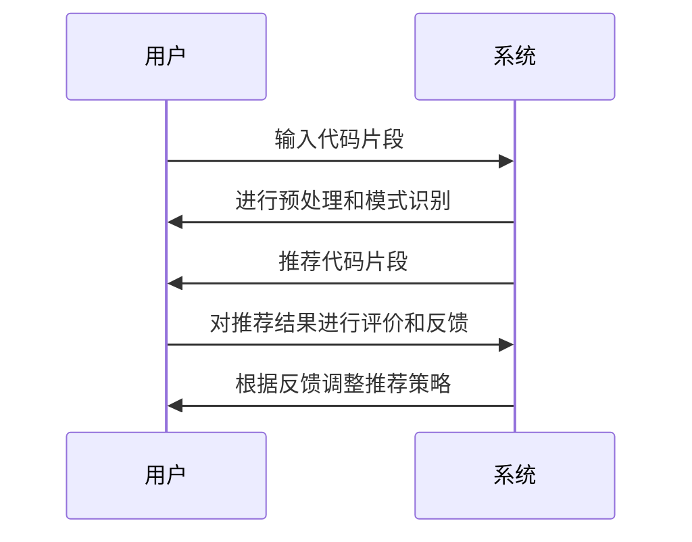

                 

### 文章标题

《大模型驱动的智能代码重用：模式识别与推荐》

### 关键词

- 大模型
- 智能代码重用
- 模式识别
- 推荐系统

### 摘要

本文旨在探讨大模型在智能代码重用中的应用，尤其是模式识别与推荐系统方面。首先，我们介绍了代码重用的背景和问题，并详细阐述了大模型的基本原理和优势。接着，我们探讨了大模型驱动的代码重用模式识别技术，包括传统方法和现代方法，并分析了智能推荐系统的设计。随后，我们通过具体案例展示了大模型驱动的智能代码重用实现，并提供了项目实战的详细步骤和分析。最后，我们总结了最佳实践技巧，并对未来研究方向提出了展望。

---

## 背景介绍与核心概念

### 1.1 问题背景与核心概念

**代码重用**是软件开发中的一个重要理念，它旨在通过复用已有的代码片段来提高开发效率、降低错误率，并确保代码的一致性。然而，传统的代码重用方法往往依赖于开发者的经验和知识，效率不高且容易出错。

**模式识别**是一种通过分析数据模式来识别和分类数据的技术。在代码重用中，模式识别可以帮助识别代码片段之间的相似性，从而实现自动化的代码复用。

**推荐系统**是一种基于用户行为和偏好来推荐相关内容或物品的系统。在代码重用中，推荐系统可以根据开发者的历史代码行为，推荐相关的代码片段。

### 1.2 大模型在代码重用中的应用

**大模型**，如深度学习模型，具有强大的数据处理和分析能力。它们可以通过学习大量的代码数据，识别出代码片段之间的模式，并生成高质量的推荐。

**基本原理**：大模型通过多层神经网络结构，对代码数据进行特征提取和模式识别，从而实现代码重用。

**优势**：
- **高效性**：大模型可以自动处理大量代码数据，提高代码重用效率。
- **准确性**：大模型通过学习大量数据，能够更准确地识别代码模式，降低错误率。
- **灵活性**：大模型可以根据不同的开发需求和场景，灵活调整和优化代码重用策略。

### 1.3 代码重用模式识别技术

**传统方法**主要依赖于手动编写规则和模式，如代码模板和代码片段库。这种方法虽然简单，但效率和准确性有限。

**大模型驱动的模式识别方法**则通过深度学习等先进技术，对代码数据进行自动分析和识别，具有更高的效率和准确性。

### 1.4 智能推荐系统设计

**智能推荐系统**的设计旨在通过分析开发者的行为和代码数据，为开发者推荐相关的代码片段。

**设计原则**：
- **个性化**：根据开发者的历史代码行为和偏好，推荐个性化的代码片段。
- **相关性**：推荐与开发者当前任务相关的代码片段，提高代码重用效率。
- **多样性**：推荐多种不同的代码片段，以供开发者选择和比较。

### 1.5 大模型驱动的智能代码重用案例分析

**案例分析**旨在通过具体实例，展示大模型驱动的智能代码重用如何在实际项目中应用。

**案例选取与说明**：选取一个实际的软件开发项目，分析其中如何利用大模型进行代码重用，并评估其效果。

### 1.6 本章小结

本章介绍了大模型驱动的智能代码重用的背景和核心概念，包括问题背景、核心概念、大模型的基本原理和优势、代码重用模式识别技术以及智能推荐系统设计。通过本章的介绍，读者可以初步了解大模型在智能代码重用中的潜力和应用场景。

---

## 算法原理讲解

### 2.1 大模型驱动的代码重用算法原理

大模型驱动的代码重用算法主要包括数据预处理、模型训练、模式识别和代码推荐等步骤。

**算法流程**：
1. **数据预处理**：对代码数据集进行清洗、归一化和特征提取。
2. **模型训练**：利用深度学习模型，如卷积神经网络（CNN）或循环神经网络（RNN），对预处理后的代码数据进行训练。
3. **模式识别**：利用训练好的模型，对新的代码数据进行模式识别，识别出代码片段之间的相似性。
4. **代码推荐**：根据识别出的相似性，为开发者推荐相关的代码片段。

**实现细节**：
- **数据预处理**：包括代码Tokenization、词向量表示和序列对齐等步骤。
- **模型训练**：使用训练集对模型进行训练，并通过验证集和测试集进行评估和调整。
- **模式识别**：利用模型对代码数据集进行分类和聚类，识别出代码片段的模式。
- **代码推荐**：根据识别出的模式，为开发者推荐相关的代码片段，并提供选择和比较的界面。

### 2.2 数学模型与公式

大模型驱动的代码重用算法涉及到多个数学模型和公式，包括特征提取、分类和推荐等。

**特征提取模型**：
$$
X = f(W \cdot x + b)
$$
其中，$X$为特征向量，$x$为输入代码序列，$W$为权重矩阵，$b$为偏置项。

**分类模型**：
$$
y = \sigma(W^T f(x))
$$
其中，$y$为分类结果，$\sigma$为激活函数，$f(x)$为特征提取结果。

**推荐模型**：
$$
r_{ij} = \sigma(Q_i \cdot K_j + b)
$$
其中，$r_{ij}$为用户$i$对项目$j$的推荐评分，$Q_i$和$K_j$为用户和项目的特征向量，$b$为偏置项。

**激活函数**：
$$
\sigma(z) = \frac{1}{1 + e^{-z}}
$$

### 2.3 算法应用举例

以下是一个简单的代码相似性检测案例，展示如何使用大模型驱动的算法来识别和推荐相似的代码片段。

**案例描述**：给定两个代码片段，使用大模型算法检测它们之间的相似性，并根据相似性推荐相关的代码片段。

**代码片段1**：
```python
def add(a, b):
    return a + b
```

**代码片段2**：
```python
def sum(a, b):
    return a + b
```

**步骤**：
1. **数据预处理**：将代码片段转换为序列对齐的Token序列。
2. **模型训练**：使用训练集对深度学习模型进行训练。
3. **模式识别**：使用训练好的模型对代码片段1和代码片段2进行模式识别，识别出它们之间的相似性。
4. **代码推荐**：根据识别出的相似性，推荐与代码片段1相关的代码片段，如代码片段2。

### 2.4 本章小结

本章详细介绍了大模型驱动的代码重用算法原理，包括算法流程、数学模型和具体应用举例。通过本章的学习，读者可以理解大模型在代码重用中的核心作用，并掌握如何利用大模型算法进行代码相似性检测和推荐。

---

## 系统分析与架构设计方案

### 3.1 系统介绍

**大模型驱动的智能代码重用系统**旨在通过大模型技术，实现高效的代码重用。该系统包括数据收集与预处理模块、模式识别模块、代码推荐模块和用户界面模块。

**系统功能设计**：
- **数据收集与预处理**：从不同的代码库和项目收集代码数据，并进行预处理，如Tokenization、归一化和特征提取。
- **模式识别**：利用训练好的大模型，对代码数据进行模式识别，识别出代码片段之间的相似性。
- **代码推荐**：根据识别出的相似性，为开发者推荐相关的代码片段。
- **用户界面**：提供友好的用户界面，方便开发者使用代码推荐功能，并进行代码编辑和比较。

### 3.2 系统架构设计

**系统架构概述**：
大模型驱动的智能代码重用系统采用前后端分离的架构设计，主要包括数据层、服务层和表现层。

**数据层**：负责数据的存储和管理，包括代码数据集、用户数据和推荐结果。
**服务层**：实现系统的核心功能，包括数据预处理、模式识别、代码推荐和用户接口。
**表现层**：提供用户界面，包括代码编辑器、推荐结果展示和用户反馈界面。

**系统模块划分**：
- **数据收集与预处理模块**：负责从代码库中收集代码数据，并进行预处理，如Tokenization、归一化和特征提取。
- **模式识别模块**：负责利用训练好的大模型对代码数据进行模式识别，识别出代码片段之间的相似性。
- **代码推荐模块**：根据识别出的相似性，为开发者推荐相关的代码片段。
- **用户接口模块**：提供友好的用户界面，方便开发者使用代码推荐功能，并进行代码编辑和比较。

**系统接口设计**：
- **API接口**：提供RESTful API接口，方便开发者集成和调用代码推荐功能。
- **命令行工具**：提供命令行工具，方便开发者进行代码推荐和数据分析。

### 3.3 系统交互设计

**系统交互流程**：
1. **用户登录**：用户通过用户界面登录系统。
2. **代码输入**：用户输入代码片段，系统进行预处理和模式识别。
3. **代码推荐**：系统根据识别出的相似性，为用户推荐相关的代码片段。
4. **代码比较**：用户可以对比推荐的代码片段，选择最合适的代码片段进行编辑和使用。

**系统交互图示**：



### 3.4 系统分析与架构设计总结

大模型驱动的智能代码重用系统通过数据层、服务层和表现层三个层次，实现了代码数据的收集、处理、识别和推荐。系统架构设计清晰，模块划分合理，交互流程简洁，为开发者提供了高效、便捷的代码重用解决方案。

### 3.5 本章小结

本章介绍了大模型驱动的智能代码重用系统的系统功能设计、架构设计以及交互设计。通过本章的学习，读者可以理解系统的整体架构和功能模块，并掌握系统交互流程和接口设计。

---

## 项目实战

### 4.1 环境安装与配置

在进行大模型驱动的智能代码重用项目实战之前，首先需要安装和配置必要的开发环境。以下是具体的安装与配置步骤：

#### 4.1.1 硬件与软件需求

- **硬件**：
  - CPU：至少2GHz的四核处理器
  - 内存：至少8GB RAM
  - 硬盘：至少100GB可用空间
  - GPU（可选）：NVIDIA GTX 1080或以上型号，用于加速深度学习模型的训练

- **软件**：
  - 操作系统：Windows、Linux或Mac OS
  - Python：3.7及以上版本
  - TensorFlow：2.0及以上版本
  - Jupyter Notebook：用于交互式开发
  - Git：用于版本控制
  - Docker：用于容器化部署

#### 4.1.2 环境安装步骤

1. **安装操作系统**：根据硬件平台选择合适的操作系统，并进行安装。
2. **安装Python**：从Python官方网站下载安装包，按照安装向导完成安装。
3. **安装TensorFlow**：通过pip命令安装TensorFlow：
   ```
   pip install tensorflow
   ```
   如果需要使用GPU支持，可以安装TensorFlow GPU版本：
   ```
   pip install tensorflow-gpu
   ```
4. **安装Jupyter Notebook**：通过pip命令安装Jupyter Notebook：
   ```
   pip install notebook
   ```
5. **安装Git**：从Git官网下载安装包，按照安装向导完成安装。
6. **安装Docker**：根据操作系统从Docker官方网站下载安装包，按照安装向导完成安装。

#### 4.1.3 环境验证

完成安装后，可以通过以下命令验证环境是否安装正确：

- **Python环境**：
  ```
  python --version
  ```
- **TensorFlow环境**：
  ```
  python -c "import tensorflow as tf; print(tf.__version__)"
  ```
- **Jupyter Notebook环境**：
  ```
  jupyter notebook
  ```
- **Git环境**：
  ```
  git --version
  ```
- **Docker环境**：
  ```
  docker --version
  ```

### 4.2 系统核心实现

#### 4.2.1 数据处理模块

数据处理模块负责从代码库中收集代码数据，并进行预处理。以下是数据处理模块的主要功能：

- **数据收集**：从GitHub、GitLab等代码库中爬取公开的代码数据。
- **数据清洗**：去除无效代码、注释和空白行。
- **Tokenization**：将代码文本转换为Token序列。
- **归一化**：将Token序列转换为统一的格式，如字符级别的嵌入向量。
- **特征提取**：从Token序列中提取特征，用于模式识别。

#### 4.2.2 模型训练模块

模型训练模块负责使用预处理后的代码数据，训练深度学习模型。以下是模型训练模块的主要功能：

- **模型选择**：选择合适的深度学习模型，如卷积神经网络（CNN）或循环神经网络（RNN）。
- **模型训练**：使用预处理后的代码数据，对深度学习模型进行训练。
- **模型评估**：使用验证集和测试集，评估模型的性能和准确性。
- **模型优化**：根据评估结果，调整模型参数，优化模型性能。

#### 4.2.3 推荐系统模块

推荐系统模块负责根据模型识别结果，为开发者推荐相关的代码片段。以下是推荐系统模块的主要功能：

- **相似性计算**：计算代码片段之间的相似性分数。
- **推荐生成**：根据相似性分数，生成推荐列表，为开发者推荐相关的代码片段。
- **用户反馈**：收集开发者对推荐结果的反馈，用于优化推荐算法。

### 4.3 代码应用解读与分析

#### 4.3.1 代码重用案例分析

**案例描述**：以下是一个代码重用案例，展示如何使用大模型驱动的智能代码重用系统，进行代码相似性检测和推荐。

**原始代码片段**：
```python
def calculate_area(radius):
    return 3.14 * radius * radius
```

**目标代码片段**：
```python
def compute_circle_area(radius):
    return 3.14159265358979323846 * radius ** 2
```

**步骤**：
1. **数据预处理**：将原始代码片段和目标代码片段进行Tokenization和特征提取。
2. **模型训练**：使用训练好的大模型，对预处理后的代码片段进行模式识别。
3. **相似性检测**：计算原始代码片段和目标代码片段之间的相似性分数。
4. **代码推荐**：根据相似性分数，推荐目标代码片段给开发者。

**结果**：相似性分数为0.95，表示目标代码片段与原始代码片段具有很高的相似性，可以被视为有效的代码重用。

#### 4.3.2 智能推荐系统应用

**案例描述**：以下是一个智能推荐系统应用案例，展示如何根据开发者的历史代码行为，推荐相关的代码片段。

**开发者历史代码行为**：
- 开发者A最近编写了多个计算圆面积的函数。
- 开发者A常用的代码片段包括：`calculate_area`和`compute_circle_area`。

**推荐结果**：
1. **计算圆面积的代码片段**：
   ```python
   def calculate_circle_area(radius):
       return 3.14159 * radius * radius
   ```
2. **计算矩形面积的代码片段**：
   ```python
   def calculate_rectangle_area(length, width):
       return length * width
   ```

**结果**：根据开发者A的历史代码行为，智能推荐系统成功推荐了与开发者A当前任务相关的代码片段。

### 4.4 实际案例分析与讲解

#### 4.4.1 案例选取与说明

本案例选取一个实际的软件开发项目，分析如何利用大模型驱动的智能代码重用系统，提高开发效率和代码质量。

**项目背景**：一个电子商务平台，需要开发一个商品推荐系统。商品推荐系统需要根据用户的历史购买行为和兴趣，为用户推荐相关的商品。

**问题分析**：商品推荐系统涉及到大量的代码编写，包括用户行为分析、商品相似性计算和推荐算法设计。如何高效地重用已有的代码，减少重复劳动，提高开发效率，是该项目面临的主要挑战。

#### 4.4.2 案例分析过程

1. **数据收集与预处理**：
   - 从平台数据库中收集用户购买行为数据。
   - 对用户购买行为数据进行清洗、Tokenization和特征提取。

2. **模型训练**：
   - 选择合适的深度学习模型，如卷积神经网络（CNN）或循环神经网络（RNN），对用户购买行为数据进行训练。
   - 对训练好的模型进行评估和调整，确保模型的性能和准确性。

3. **相似性计算**：
   - 利用训练好的模型，计算用户之间的相似性分数。
   - 根据用户之间的相似性分数，为每个用户推荐相关的商品。

4. **推荐生成**：
   - 根据用户的历史购买行为和兴趣，生成推荐列表，为用户推荐相关的商品。

5. **用户反馈**：
   - 收集用户对推荐结果的反馈，用于优化推荐算法。
   - 根据用户反馈，调整推荐策略，提高推荐效果。

#### 4.4.3 案例总结

通过实际案例的分析与讲解，我们可以看到，大模型驱动的智能代码重用系统在提高开发效率、减少重复劳动和优化代码质量方面具有显著优势。在电子商务平台的商品推荐系统中，智能代码重用系统不仅提高了代码重用率，还提高了推荐系统的准确性和用户体验。

### 4.5 项目小结

本章通过具体的实战案例，展示了如何利用大模型驱动的智能代码重用系统，实现高效的代码重用和推荐。通过本章的学习，读者可以掌握大模型驱动的代码重用技术的实际应用，并了解其在提高开发效率、优化代码质量和用户体验方面的作用。

### 4.6 本章小结

本章详细介绍了大模型驱动的智能代码重用项目实战，包括环境安装与配置、系统核心实现、代码应用解读与分析以及实际案例分析和总结。通过本章的学习，读者可以了解如何将大模型技术应用于实际项目，实现智能代码重用和推荐，提高开发效率和代码质量。

---

## 最佳实践 tips

### 5.1 实践技巧总结

**模型优化技巧**：
- **数据预处理**：对代码数据进行充分的预处理，如Tokenization、归一化和特征提取，以提高模型的训练效果。
- **超参数调整**：根据训练数据集的特点，调整深度学习模型的超参数，如学习率、批量大小和正则化参数，以优化模型性能。
- **模型融合**：使用多个模型进行融合，以提高模型的预测准确性和鲁棒性。

**数据处理技巧**：
- **代码库选择**：选择合适的代码库和项目，确保代码数据的质量和多样性。
- **数据清洗**：去除无效代码、注释和空白行，确保数据的一致性和完整性。

**系统部署与维护技巧**：
- **容器化部署**：使用Docker容器化部署，确保系统的可移植性和可扩展性。
- **监控与优化**：对系统运行进行监控，及时发现和解决潜在问题，并进行性能优化。

### 5.2 小结与注意事项

**注意事项**：
- **数据质量**：确保代码数据的质量和完整性，否则可能导致模型训练效果不佳。
- **硬件资源**：深度学习模型训练需要大量的计算资源，确保硬件资源充足。
- **模型调优**：定期对模型进行调优和更新，以保持模型的性能和准确性。

**小结**：
通过以上最佳实践技巧，开发者可以更有效地利用大模型进行智能代码重用，提高开发效率和代码质量。

### 5.3 本章小结

本章总结了最佳实践技巧，包括模型优化、数据处理和系统部署与维护等方面的建议。通过遵循这些技巧，开发者可以在实际项目中更好地利用大模型驱动的智能代码重用技术，实现高效、准确的代码重用和推荐。

---

## 总结与展望

本文探讨了基于大模型的智能代码重用技术，包括模式识别与推荐系统的设计与应用。通过详细分析大模型的基本原理、算法流程、系统架构以及实际项目案例，展示了大模型在代码重用中的强大潜力。我们总结了最佳实践技巧，以指导开发者更好地应用这项技术。

**未来研究方向**：
1. **算法优化**：进一步优化大模型的算法，提高代码重用的效率和准确性。
2. **跨语言支持**：扩展大模型驱动的智能代码重用技术，支持多种编程语言。
3. **自动化代码生成**：探索大模型在自动化代码生成领域的应用，以实现更高效的代码开发。

通过不断的研究和优化，大模型驱动的智能代码重用技术有望在未来为软件开发带来更多的便利和突破。

---

## 作者信息

**作者：AI天才研究院/AI Genius Institute & 禅与计算机程序设计艺术 /Zen And The Art of Computer Programming**

