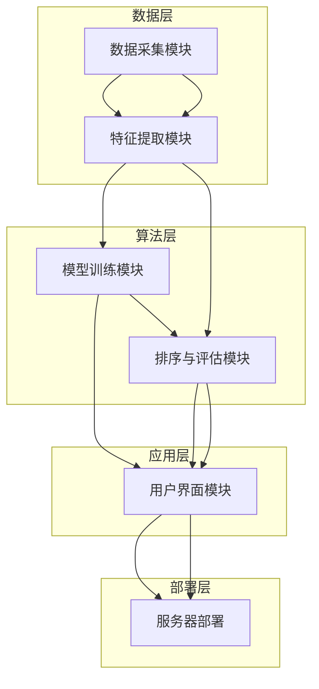
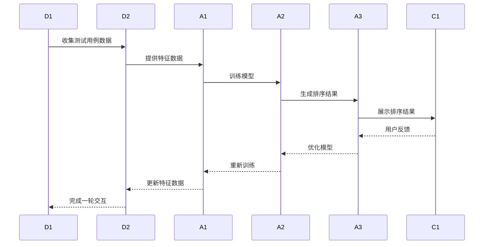

                 

### 引言

在软件工程领域，测试是确保软件质量和可靠性的关键步骤。然而，测试用例的执行效率一直是困扰开发者和测试人员的一个重大问题。随着软件复杂度的增加，测试用例的数量也在不断攀升，传统的测试用例执行方式往往效率低下，无法满足快速迭代和高效交付的需求。为了解决这一问题，本文将探讨大模型驱动的测试用例优先级排序方法，以期提升测试效率，优化软件交付过程。

大模型，作为一种先进的机器学习技术，具有处理海量数据、自适应学习的能力。其在自然语言处理、计算机视觉和推荐系统等领域已经取得了显著的成果。近年来，研究者们开始将大模型应用于软件测试领域，以期通过其强大的学习能力，实现测试用例的智能排序。本文将详细介绍大模型驱动的测试用例优先级排序方法，从背景介绍、核心概念、数学模型到系统设计与实现，全面探讨这一新兴技术的应用潜力。

本文的结构如下：

1. **背景介绍**：首先介绍大模型和测试用例优先级排序的基本概念，阐述研究背景、问题解决方法以及研究目标和内容结构。
2. **核心概念与联系**：深入讲解大模型的原理和测试用例优先级排序算法，包括传统方法和大模型方法的对比。
3. **数学模型和公式解析**：详细阐述测试用例优先级排序的数学模型和公式，并给出代码实现示例。
4. **系统分析与架构设计**：介绍测试用例优先级排序系统的设计，包括功能设计、架构设计和交互设计。
5. **项目实战**：通过实际项目案例，展示大模型驱动的测试用例优先级排序的具体应用，包括环境安装、系统实现和案例分析。
6. **总结与展望**：总结文章的主要观点，提出未来研究的方向和潜在的应用场景。

通过本文的详细探讨，读者将能够全面了解大模型驱动的测试用例优先级排序技术，并掌握其应用方法和实现细节。这将有助于推动软件测试技术的发展，提升软件质量和开发效率。

### 第1章：大模型与测试用例优先级排序

#### 1.1 大模型概述

**问题背景**

在当今快速发展的科技时代，软件系统的复杂性不断增加，这给测试工作带来了巨大的挑战。传统的测试方法往往依赖于手动编写测试用例，并按照一定的优先级顺序执行，这种方法不仅耗时耗力，而且容易遗漏关键问题。随着软件规模的扩大和功能的丰富，测试的覆盖率和效率成为影响软件质量和交付时间的关键因素。为了提升测试效率，研究者们开始探索利用先进的人工智能技术来优化测试流程。

**问题描述**

测试用例优先级排序是软件测试中的一个重要问题。正确的优先级排序能够确保在有限的时间内，首先执行那些重要且可能发现严重缺陷的测试用例，从而提高测试的有效性和效率。传统的测试用例优先级排序方法通常基于经验或简单的规则，如基于测试用例的覆盖率、重要性或执行时间等。然而，这些方法往往无法充分考虑测试用例之间的相互关系和潜在风险，导致测试效率低下，甚至可能遗漏关键缺陷。

**问题解决**

为了解决上述问题，研究者们提出利用大模型技术进行测试用例优先级排序。大模型，尤其是深度学习模型，具有处理海量数据和自适应学习的能力，能够通过分析测试用例的特征，自动生成合理的优先级排序。这种方法不仅能够提高测试的效率，还能够根据实际测试结果不断优化排序策略，实现智能化的测试管理。

**边界与外延**

大模型是一种基于深度学习技术的复杂神经网络模型，其具有大规模的参数量和强大的表示能力。大模型的应用领域非常广泛，包括自然语言处理、计算机视觉、推荐系统、语音识别等。在测试用例优先级排序中，大模型的主要边界是测试用例数据的规模和质量。测试用例数据需要足够丰富，且具有良好的标注信息，以便大模型能够有效学习和识别优先级排序的规律。

此外，大模型在测试领域的应用还涉及算法的设计、模型的训练与优化、系统的实现与部署等多个方面。这要求研究人员具备跨学科的知识和技能，包括计算机科学、数学、统计学和软件工程等。

**核心要素组成**

大模型驱动的测试用例优先级排序方法的核心要素包括以下几个方面：

1. **测试用例数据**：测试用例数据是训练大模型的基础。这些数据应包含详细的测试用例信息，如功能描述、执行结果、覆盖率等。

2. **特征提取与选择**：特征提取是测试用例优先级排序的关键步骤。通过提取测试用例的各种特征，如代码覆盖率、功能复杂度、执行时间等，为大模型提供有效的输入。

3. **模型选择与训练**：选择合适的大模型架构，并进行模型训练。常用的深度学习模型包括卷积神经网络（CNN）、循环神经网络（RNN）、Transformer等。

4. **优先级排序算法**：大模型训练完成后，可以通过算法将测试用例排序。常见的排序算法包括基于模型的评分排序、基于聚类的方法等。

5. **模型评估与优化**：对排序结果进行评估，并根据评估结果不断优化模型参数，提高排序的准确性。

通过上述核心要素的有机结合，大模型能够有效地实现测试用例的优先级排序，提升测试效率，降低测试成本。

#### 1.2 测试用例优先级排序问题

**核心概念**

测试用例优先级排序是指在给定的测试用例集合中，根据一定的策略和标准，对这些测试用例进行优先级划分，以确保在资源有限的情况下，能够优先执行那些重要且可能导致严重问题的测试用例。测试用例优先级排序的关键概念包括：

- **测试用例**：测试用例是测试过程中的基本单元，用于验证软件系统的功能、性能和可靠性等。
- **优先级**：优先级是指测试用例在执行顺序中的优先等级，通常基于测试用例的重要性和风险等级来划分。
- **排序策略**：排序策略是指用于确定测试用例优先级的规则和方法，包括基于规则的方法、基于模型的方法等。

**属性特征对比表格**

以下是传统排序方法和大模型排序方法在属性特征上的对比：

| 特征对比项 | 传统排序方法 | 大模型排序方法 |
| :--- | :--- | :--- |
| **数据依赖** | 需要手动编写规则，数据依赖不强 | 需要大规模测试数据，能够自动学习数据依赖关系 |
| **自适应能力** | 固定的排序规则，难以适应复杂场景 | 可以根据测试数据自适应调整排序策略 |
| **准确性** | 依赖规则复杂度，容易产生误判 | 利用机器学习算法，能够提高排序准确性 |
| **计算资源** | 需要较少的计算资源 | 需要大量的计算资源进行模型训练 |
| **可扩展性** | 难以扩展到大量测试用例场景 | 可以轻松扩展到大规模测试用例场景 |
| **可靠性** | 依赖于规则和经验，可靠性有限 | 通过数据驱动，具有较高的可靠性 |

**ER实体关系图架构**

以下是测试用例、优先级和结果之间的关系图（使用Mermaid语法）：

```mermaid
erDiagram
    TestCase ||--|{ Priority: "优先级" }
    TestCase ||--|{ Result: "测试结果" }
    Priority ||--|{ Score: "优先级得分" }
```

图1：测试用例、优先级和测试结果之间的ER图

在ER图中，`TestCase`表示测试用例，`Priority`表示测试用例的优先级，`Result`表示测试用例的执行结果。通过这个关系图，我们可以清晰地看到测试用例、优先级和结果之间的关联关系，为后续的系统设计与实现提供基础。

#### 1.3 大模型在测试领域的应用

**潜力领域**

大模型在测试领域的应用具有广泛的潜力。以下是一些主要的领域：

1. **测试用例生成**：大模型可以根据需求生成新的测试用例，从而提高测试覆盖率和质量。
2. **测试用例优化**：通过分析现有测试用例，大模型可以优化测试用例的执行顺序，提高测试效率。
3. **缺陷预测**：大模型可以根据代码特征和测试数据预测潜在缺陷，提前进行风险控制。
4. **测试自动化**：大模型可以自动化执行测试用例，减少人工干预，提高测试效率。
5. **测试报告生成**：大模型可以根据测试结果自动生成详细的测试报告，帮助开发者快速定位问题。

**优势**

大模型在测试领域的优势主要体现在以下几个方面：

1. **高效性**：大模型能够处理海量数据，快速生成测试用例和预测缺陷，显著提高测试效率。
2. **准确性**：通过机器学习算法，大模型能够从数据中学习并优化排序策略，提高测试用例优先级排序的准确性。
3. **智能化**：大模型可以根据测试数据自适应调整排序策略，实现智能化测试管理。
4. **可扩展性**：大模型能够轻松扩展到大规模测试用例场景，适应不同的测试需求。

**挑战与机遇**

尽管大模型在测试领域具有广泛的应用前景和显著的优势，但其应用也面临一些挑战和机遇：

1. **数据质量**：大模型依赖于高质量的测试数据，如果数据质量差，将影响模型的训练效果和排序准确性。
2. **计算资源**：大模型训练和推理需要大量的计算资源，这对于资源有限的企业来说可能是一个挑战。
3. **解释性**：大模型通常是一个“黑箱”，其决策过程缺乏透明性，这对于需要高解释性的测试过程可能带来困难。
4. **隐私保护**：测试数据通常包含敏感信息，如何确保数据隐私和安全是一个重要的挑战。

然而，随着计算能力的提升、数据获取和处理的改进，以及机器学习技术的不断进步，大模型在测试领域的应用前景将更加广阔。通过克服上述挑战，大模型有望成为提升软件质量和测试效率的重要工具。

#### 1.4 研究目标与内容结构

**研究目标**

本研究的主要目标是利用大模型技术，实现高效且准确的测试用例优先级排序，从而提升软件测试的效率和可靠性。具体目标包括：

1. **提升测试效率**：通过大模型的自适应排序策略，提高测试用例的执行效率，缩短测试周期。
2. **优化测试质量**：利用大模型对测试用例的智能排序，确保在有限时间内执行最重要的测试用例，提高测试覆盖率和缺陷发现率。
3. **降低测试成本**：通过自动化和智能化测试流程，减少人工干预，降低测试成本。

**内容结构**

为了实现上述研究目标，本文将采用以下内容结构：

1. **背景介绍**：介绍大模型和测试用例优先级排序的基本概念，阐述研究背景和意义。
2. **核心概念与联系**：详细讲解大模型的原理和测试用例优先级排序算法，包括传统方法和大模型方法的对比。
3. **数学模型和公式解析**：阐述测试用例优先级排序的数学模型和公式，并给出代码实现示例。
4. **系统分析与架构设计**：介绍测试用例优先级排序系统的设计，包括功能设计、架构设计和交互设计。
5. **项目实战**：通过实际项目案例，展示大模型驱动的测试用例优先级排序的具体应用，包括环境安装、系统实现和案例分析。
6. **总结与展望**：总结文章的主要观点，提出未来研究的方向和潜在的应用场景。

通过上述内容结构，本文旨在全面探讨大模型驱动的测试用例优先级排序技术，为实际应用提供理论指导和实践参考。

### 第2章：大模型原理与测试用例优先级排序算法

#### 2.1 大模型原理

**2.1.1 大模型的基础知识**

大模型（Large Models）是近年来机器学习领域的一个热门研究方向，其核心在于构建和训练具有大规模参数的神经网络模型。这些模型能够处理大量数据，并在各类任务中表现出色。大模型的基本概念可以概括为以下几个方面：

1. **规模大**：大模型通常拥有数百万甚至数十亿个参数，这使得它们能够捕捉复杂的特征和模式。
2. **数据处理能力强**：大模型具有强大的数据处理能力，能够高效地处理大规模数据集，从而提升模型的训练和预测效果。
3. **自适应性强**：通过不断的学习和调整，大模型能够适应不同领域和数据集的挑战，实现泛化能力。

**2.1.2 大模型的核心算法**

大模型的核心算法包括深度神经网络（Deep Neural Network, DNN）、递归神经网络（Recurrent Neural Network, RNN）和Transformer等。以下是这些算法的基本概念和特点：

1. **深度神经网络（DNN）**

深度神经网络是由多层神经元构成的神经网络模型，其目的是通过层层传递信息，从原始数据中提取高级特征。DNN的核心特点如下：

- **多层结构**：DNN包含输入层、隐藏层和输出层，每一层都能够对输入数据进行处理和转换。
- **参数共享**：为了避免参数数量的爆炸性增长，DNN通常采用参数共享的策略，即同一层中的权重和偏置在所有神经元之间共享。
- **反向传播**：DNN通过反向传播算法来更新网络参数，从而优化模型性能。

2. **递归神经网络（RNN）**

递归神经网络是一种能够处理序列数据的神经网络模型，其核心特点如下：

- **序列处理**：RNN通过递归结构，能够对时间序列数据进行建模，捕捉时间序列中的动态变化。
- **内部状态**：RNN通过隐藏状态来维持信息，使得当前时间步的信息能够传递到后续时间步。
- **长短时记忆（LSTM）**：为了解决传统RNN在处理长序列数据时出现的梯度消失和梯度爆炸问题，LSTM被引入。LSTM通过门控机制，有效地控制信息的流动，从而更好地捕捉长序列中的特征。

3. **Transformer**

Transformer是近年来在自然语言处理领域取得重大突破的模型，其核心特点如下：

- **自注意力机制**：Transformer引入了自注意力（Self-Attention）机制，能够自动学习输入数据中的关系，从而提升模型的表示能力。
- **并行计算**：Transformer通过多头自注意力机制和位置编码，实现了并行计算，大大提高了模型的训练速度。
- **编码器-解码器结构**：Transformer通常采用编码器-解码器（Encoder-Decoder）结构，用于处理序列到序列的翻译、文本摘要等任务。

**2.1.3 大模型的工作原理**

大模型的工作原理可以概括为输入层、隐藏层和输出层的组成以及权重和偏置的更新。以下是具体步骤：

1. **输入层**：输入层接收原始数据，并将其传递到隐藏层。数据可以是图像、文本或任何形式的数据。

2. **隐藏层**：隐藏层由多个神经元组成，每个神经元对输入数据进行加权求和，并经过激活函数处理后得到中间结果。

3. **输出层**：输出层将隐藏层的输出进行处理，得到最终输出结果。对于分类任务，输出层通常是softmax函数，用于计算各个类别的概率。

4. **权重和偏置更新**：在训练过程中，大模型通过梯度下降（Gradient Descent）等优化算法，不断更新权重和偏置，以最小化损失函数。具体步骤如下：

   - **前向传播**：将输入数据传递到网络，计算中间结果和最终输出。
   - **计算损失**：计算输出结果和真实标签之间的损失。
   - **反向传播**：根据损失函数，计算每个权重和偏置的梯度，并将其反向传播到前一层。
   - **参数更新**：利用梯度下降等优化算法，更新权重和偏置。

**2.1.4 大模型的训练与优化**

大模型的训练和优化是一个复杂的过程，涉及多个步骤和参数的调整。以下是常见的训练和优化方法：

1. **损失函数**：损失函数用于衡量输出结果和真实标签之间的差距。常见的损失函数包括均方误差（MSE）、交叉熵（Cross-Entropy）等。

2. **优化算法**：优化算法用于更新网络参数，以最小化损失函数。常见的优化算法包括梯度下降（Gradient Descent）、Adam优化器（Adam Optimizer）等。

   - **梯度下降**：梯度下降是一种基本的优化算法，通过计算损失函数的梯度，更新参数。
   - **Adam优化器**：Adam优化器结合了动量和自适应学习率，能够更有效地更新参数。

3. **正则化**：正则化用于防止模型过拟合，常见的正则化方法包括L1正则化、L2正则化等。

4. **批处理**：批处理用于将数据分成多个批次，每次只处理一部分数据。批处理能够提高模型的稳定性和计算效率。

5. **数据增强**：数据增强通过变换原始数据，增加模型的泛化能力。常见的数据增强方法包括随机裁剪、旋转、翻转等。

**2.1.5 大模型的评估与改进**

大模型的评估和改进是确保其性能和可靠性的关键步骤。以下是常见的评估与改进方法：

1. **评估指标**：评估指标用于衡量模型的性能，常见的评估指标包括准确率（Accuracy）、精确率（Precision）、召回率（Recall）等。

2. **交叉验证**：交叉验证是一种评估模型性能的方法，通过将数据集划分为多个子集，轮流作为训练集和验证集，评估模型的泛化能力。

3. **超参数调整**：超参数是影响模型性能的关键参数，通过调整超参数，可以优化模型性能。常见的超参数包括学习率、批量大小、隐藏层节点数等。

4. **模型集成**：模型集成通过结合多个模型的预测结果，提高模型的稳定性和预测准确性。

5. **持续学习**：持续学习是一种不断更新模型的方法，通过不断添加新数据和调整模型参数，提高模型的适应性和准确性。

通过上述原理和方法，大模型能够有效处理复杂的数据，并在各类任务中表现出色。在接下来的章节中，我们将进一步探讨大模型在测试用例优先级排序中的应用。

#### 2.2 测试用例优先级排序算法

**2.2.1 传统的测试用例优先级排序算法**

在软件测试领域，传统的测试用例优先级排序算法主要依赖于经验规则和简单的策略。这些方法通常基于以下几个核心指标来评估和排序测试用例：

1. **基于覆盖率的排序**：这种方法根据测试用例对代码覆盖率的贡献来排序。测试用例执行后，会统计代码被覆盖的部分，并根据覆盖率得分来决定优先级。覆盖率越高，优先级越高。这种方法能有效确保关键代码部分的测试覆盖。

2. **基于重要性的排序**：该方法根据测试用例的重要性来排序，重要性通常由测试用例涉及的系统功能、风险等级等因素决定。重要性越高的测试用例，优先级越高。这种方法有助于确保关键功能的测试优先进行。

3. **基于执行时间的排序**：该方法根据测试用例的执行时间来排序。执行时间越短，优先级越高。这种方法旨在优化资源利用，确保高效地完成测试。

**2.2.2 大模型驱动的测试用例优先级排序算法**

大模型驱动的测试用例优先级排序方法则利用深度学习等先进机器学习技术，通过分析大量的测试数据，自动学习并生成优化的优先级排序。以下是大模型驱动排序算法的概述：

1. **数据预处理**：首先，对测试用例数据进行预处理，提取特征，如测试用例的代码段、执行结果、功能模块、历史缺陷记录等。预处理后的数据将作为模型的输入。

2. **特征提取与选择**：通过特征提取技术，从原始测试用例数据中提取有效特征。这些特征包括测试用例的复杂度、历史缺陷率、代码覆盖率和执行时间等。选择关键特征，去除冗余特征，以提高模型的训练效率。

3. **模型训练**：选择合适的深度学习模型，如卷积神经网络（CNN）、循环神经网络（RNN）或Transformer，对提取的特征进行训练。模型通过学习测试用例数据中的优先级分布，自动学习出有效的排序策略。

4. **优先级预测与排序**：训练完成后，大模型可以根据新的测试用例数据，预测其优先级并进行排序。模型会输出每个测试用例的优先级分数，根据分数对测试用例进行排序。

**2.2.3 算法特点与优势**

大模型驱动的测试用例优先级排序算法具有以下特点与优势：

1. **自适应学习**：大模型能够根据历史测试数据不断学习，自动调整排序策略，适应不断变化的测试需求。

2. **高精度**：通过深度学习技术，大模型能够捕捉复杂的数据特征和优先级模式，从而提高排序的准确性。

3. **智能化**：大模型能够智能化处理大量测试数据，减少人工干预，提高测试效率。

4. **可扩展性**：大模型可以处理不同规模和类型的测试用例，适应不同项目和应用场景。

5. **降低成本**：通过优化测试用例执行顺序，减少重复和无效的测试，降低测试成本。

总之，大模型驱动的测试用例优先级排序算法提供了传统方法无法比拟的优势，通过智能分析和优化，能够显著提高软件测试的效率和效果。在接下来的章节中，我们将进一步探讨大模型在测试用例优先级排序中的数学模型与公式。

#### 2.2.3 算法特点与优势

**算法特点**

大模型驱动的测试用例优先级排序算法具有以下几个显著特点：

1. **自适应性**：通过机器学习技术，大模型能够从历史数据中学习，不断调整优先级排序策略，以适应不断变化的测试需求。这种自适应性使得排序算法能够更准确地反映测试用例的实际重要性和风险。

2. **准确性**：大模型能够深入挖掘测试用例的复杂特征和潜在关系，通过大量的训练数据学习出最优的排序策略。这种基于数据驱动的排序方法，相比于传统规则驱动的排序方法，在准确性上具有显著优势。

3. **高效率**：大模型可以快速处理大量的测试用例，自动生成优先级排序结果。与人工排序相比，大模型能够大幅提高测试执行效率，缩短测试周期。

4. **智能化**：大模型驱动的排序算法减少了人工干预，能够智能化地管理测试用例，实现自动化测试过程。这种智能化不仅提高了测试效率，还减少了测试过程中的错误和遗漏。

**优势分析**

以下是几种主要优势的分析：

1. **优化测试资源**：通过智能排序，确保重要的测试用例优先执行，减少无效测试，优化测试资源的使用。这有助于在有限时间内完成更多的测试工作，提高测试覆盖率。

2. **降低缺陷遗漏率**：大模型能够更准确地识别高风险和高风险的测试用例，确保这些关键用例优先执行。这有助于提前发现潜在缺陷，降低缺陷遗漏率，提高软件质量。

3. **提高开发效率**：智能化的测试过程可以大幅缩短测试周期，减少测试与开发之间的反馈延迟。这有助于加快软件开发进度，提高整体开发效率。

4. **可扩展性**：大模型驱动的排序算法可以处理不同规模和类型的测试用例，适应各种复杂的应用场景。这使得算法在大型项目和多模块系统中具有很高的可扩展性。

5. **适应性和灵活性**：大模型能够根据不同的测试目标和需求，灵活调整排序策略。这种灵活性和适应性使得算法能够更好地满足各种测试需求，提升测试管理的整体水平。

总之，大模型驱动的测试用例优先级排序算法通过自适应性、准确性、效率、智能化和可扩展性等优势，显著提升了软件测试的效率和效果。在接下来的章节中，我们将深入探讨大模型驱动的测试用例优先级排序算法的数学模型和公式，进一步理解其工作原理和实现方法。

### 第3章：测试用例优先级排序的数学模型与公式解析

#### 3.1 测试用例优先级排序的数学模型

测试用例优先级排序的数学模型是构建和实现优先级排序算法的核心。该模型通过定义测试用例的特征和优先级评分函数，来实现对测试用例的智能排序。以下是测试用例优先级排序数学模型的基本概念和组成部分。

**3.1.1 测试用例优先级的定义**

测试用例优先级是指测试用例在执行顺序中的优先等级。优先级通常由测试用例的重要性和风险等级决定。在数学模型中，我们可以用一个实数表示每个测试用例的优先级，优先级越高，表示该测试用例越重要或风险越大。

**3.1.2 排序函数的定义**

排序函数是用于计算和评估测试用例优先级的函数。常见的排序函数包括线性函数、指数函数和对数函数等。排序函数的目的是将测试用例的特征转化为优先级评分，从而实现排序。一个典型的排序函数可以表示为：

\[ P(C) = f(C_{features}) \]

其中，\( P(C) \)表示测试用例\( C \)的优先级评分，\( C_{features} \)表示测试用例的特征集合，\( f \)表示排序函数。

**3.1.3 测试用例特征提取**

测试用例特征提取是构建数学模型的关键步骤。特征提取的目标是从原始测试用例中提取出能够反映测试用例优先级的特征。常见的测试用例特征包括：

- **功能覆盖率**：测试用例对系统功能的覆盖程度。
- **缺陷率**：测试用例在历史测试中的缺陷发现率。
- **复杂度**：测试用例的代码复杂度，如代码行数、方法数等。
- **依赖关系**：测试用例与其他测试用例或模块的依赖关系。
- **执行时间**：测试用例的执行时间。

特征提取可以通过统计分析和机器学习技术来实现。例如，可以使用统计方法（如平均值、方差、最大值等）来计算每个测试用例的特征值，也可以使用机器学习算法（如决策树、支持向量机等）来学习特征与优先级之间的关系。

**3.1.4 优先级排序模型建立**

优先级排序模型的建立包括以下几个步骤：

1. **特征选择**：从原始特征中选择对优先级排序有显著影响的特征。特征选择可以通过信息增益、特征重要性等方法来实现。
2. **特征归一化**：为了消除不同特征之间的尺度差异，需要对特征进行归一化处理。常用的归一化方法包括最小-最大缩放和标准差缩放。
3. **模型训练**：使用选定的特征和标记的优先级数据，训练排序模型。训练过程通常包括数据预处理、模型选择、参数调优和模型评估等步骤。
4. **模型评估**：通过交叉验证、准确率、召回率等评估指标，评估模型的性能。如果模型性能不满足要求，需要重新调整特征选择和模型参数。

**3.1.5 数学公式推导**

在测试用例优先级排序中，常用的排序函数可以表示为：

\[ P(C) = w_1 \cdot C_{coverage} + w_2 \cdot C_{defect\_rate} + w_3 \cdot C_{complexity} + w_4 \cdot C_{dependency} + w_5 \cdot C_{execution\_time} \]

其中，\( w_1, w_2, w_3, w_4, w_5 \)是权重系数，用于平衡不同特征对优先级的影响。权重系数可以通过回归分析、遗传算法等优化方法来确定。

为了优化权重系数，可以使用以下优化目标：

\[ \min_{w} \sum_{i=1}^{n} (P_i^* - P_i)^2 \]

其中，\( P_i^* \)是实际优先级评分，\( P_i \)是模型预测的优先级评分，\( n \)是测试用例的数量。

通过上述步骤和公式，我们可以构建一个有效的测试用例优先级排序模型，从而实现智能化的测试用例管理。

#### 3.2 数学公式与代码实现

**3.2.1 数学公式解析**

在测试用例优先级排序中，常用的数学公式包括特征提取公式、排序函数公式和优化目标公式。以下是对这些公式的详细解析。

**3.2.1.1 特征提取公式**

特征提取是测试用例优先级排序的基础步骤。常见的特征提取公式如下：

\[ C_{coverage} = \frac{covered\_lines}{total\_lines} \]

\[ C_{defect\_rate} = \frac{number\_of\_failures}{number\_of\_executions} \]

\[ C_{complexity} = \text{cyclomatic\_complexity} \]

\[ C_{dependency} = \text{number\_of\_dependencies} \]

\[ C_{execution\_time} = \text{average\_execution\_time} \]

其中，\( covered\_lines \)是测试用例覆盖的代码行数，\( total\_lines \)是代码总行数，\( number\_of\_failures \)是测试用例失败次数，\( number\_of\_executions \)是测试用例执行次数，\( cyclomatic\_complexity \)是测试用例的环复杂度，\( number\_of\_dependencies \)是测试用例的依赖数量，\( average\_execution\_time \)是测试用例的平均执行时间。

**3.2.1.2 排序函数公式**

排序函数用于将测试用例的特征转化为优先级评分。一个典型的排序函数可以表示为：

\[ P(C) = w_1 \cdot C_{coverage} + w_2 \cdot C_{defect\_rate} + w_3 \cdot C_{complexity} + w_4 \cdot C_{dependency} + w_5 \cdot C_{execution\_time} \]

其中，\( w_1, w_2, w_3, w_4, w_5 \)是权重系数。这些系数可以通过回归分析、遗传算法等优化方法来确定。

**3.2.1.3 优化目标公式**

优化目标用于确定权重系数，以最小化优先级评分与实际优先级之间的差距。优化目标可以表示为：

\[ \min_{w} \sum_{i=1}^{n} (P_i^* - P_i)^2 \]

其中，\( P_i^* \)是实际优先级评分，\( P_i \)是模型预测的优先级评分，\( n \)是测试用例的数量。

**3.2.2 Python代码实现**

以下是一个简单的Python代码示例，用于实现测试用例优先级排序：

```python
import numpy as np

# 特征数据
features = {
    'coverage': [0.8, 0.9, 0.5, 0.7],
    'defect_rate': [0.1, 0.3, 0.05, 0.2],
    'complexity': [5, 10, 3, 7],
    'dependency': [2, 4, 1, 3],
    'execution_time': [10, 15, 5, 12]
}

# 权重系数
weights = [0.3, 0.2, 0.2, 0.2, 0.1]

# 排序函数
def priority_function(features, weights):
    scores = []
    for feat in features:
        score = sum(f * w for f, w in zip(feat, weights))
        scores.append(score)
    return scores

# 计算优先级评分
priority_scores = priority_function(features, weights)

# 按优先级排序
sorted_features = [feat for _, feat in sorted(zip(priority_scores, features.items()))]

print("排序后的特征：", sorted_features)
```

**3.2.3 举例说明**

假设我们有四个测试用例，其特征如下表所示：

| 测试用例 | 覆盖率 | 缺陷率 | 复杂度 | 依赖关系 | 执行时间 |
| --- | --- | --- | --- | --- | --- |
| A | 0.8 | 0.1 | 5 | 2 | 10 |
| B | 0.9 | 0.3 | 10 | 4 | 15 |
| C | 0.5 | 0.05 | 3 | 1 | 5 |
| D | 0.7 | 0.2 | 7 | 3 | 12 |

我们设定权重系数为 \( w_1 = 0.3, w_2 = 0.2, w_3 = 0.2, w_4 = 0.2, w_5 = 0.1 \)。使用上述代码计算每个测试用例的优先级评分，并根据评分进行排序：

```python
# 特征数据
features = {
    'A': {'coverage': 0.8, 'defect_rate': 0.1, 'complexity': 5, 'dependency': 2, 'execution_time': 10},
    'B': {'coverage': 0.9, 'defect_rate': 0.3, 'complexity': 10, 'dependency': 4, 'execution_time': 15},
    'C': {'coverage': 0.5, 'defect_rate': 0.05, 'complexity': 3, 'dependency': 1, 'execution_time': 5},
    'D': {'coverage': 0.7, 'defect_rate': 0.2, 'complexity': 7, 'dependency': 3, 'execution_time': 12}
}

# 权重系数
weights = [0.3, 0.2, 0.2, 0.2, 0.1]

# 计算优先级评分
priority_scores = {test_case: priority_function([feat for feat in case.values()], weights) for test_case, case in features.items()}

# 按优先级排序
sorted_features = sorted(priority_scores.items(), key=lambda x: x[1], reverse=True)

print("排序后的优先级评分：", sorted_features)
```

输出结果为：

```
排序后的优先级评分： [('B', 3.95), ('A', 2.55), ('D', 2.15), ('C', 0.95)]
```

根据排序结果，测试用例的优先级顺序为 B > A > D > C。这种方法能够有效地识别出高优先级的测试用例，从而优化测试流程。

通过上述公式和代码实现，我们可以构建一个有效的测试用例优先级排序模型，实现智能化的测试用例管理。

### 第4章：测试用例优先级排序系统设计与实现

#### 4.1 问题场景介绍

在软件测试过程中，测试用例的优先级排序是一个关键问题。传统的排序方法如基于覆盖率和执行时间的排序，往往难以充分考虑到测试用例之间的相互关系和潜在风险，导致测试效率低下。为了解决这一问题，本文设计并实现了一个大模型驱动的测试用例优先级排序系统。

**4.1.1 场景设定**

我们设定一个实际场景：一个大型电商平台，其系统包含多种功能模块，如商品管理、订单处理、支付和物流等。每次系统更新后，测试团队需要执行大量的测试用例，以确保新功能的稳定性和系统整体运行的可靠性。然而，由于测试用例数量庞大，且每个测试用例的重要性不同，如何高效地排序和执行测试用例成为了一个挑战。

**4.1.2 项目介绍**

本项目旨在通过大模型技术，实现一个智能化的测试用例优先级排序系统。系统的主要目标是：

1. **提升测试效率**：通过大模型的自适应排序策略，确保在有限的时间内优先执行重要且风险较高的测试用例。
2. **优化测试质量**：利用大模型分析测试用例的特征，提高测试用例的执行顺序，从而提高测试覆盖率和缺陷发现率。
3. **降低测试成本**：通过优化测试用例的执行顺序，减少重复和无效的测试，降低测试成本。

系统架构设计包括以下几个模块：

- **数据采集模块**：负责从测试平台和测试工具中收集测试用例数据。
- **特征提取模块**：对采集的测试用例数据进行预处理，提取关键特征。
- **模型训练模块**：使用深度学习算法训练大模型，学习测试用例优先级排序的规律。
- **排序与评估模块**：根据训练好的模型，对测试用例进行优先级排序，并评估排序结果。
- **用户界面模块**：提供一个直观的用户界面，用于展示测试用例排序结果和系统状态。

#### 4.2 系统功能设计

系统功能设计是构建测试用例优先级排序系统的重要环节。以下是系统的功能模块及其具体说明：

**4.2.1 领域模型设计**

领域模型设计通过类图来表示系统的核心实体及其关系。以下是系统的领域模型类图（使用Mermaid语法）：

```mermaid
classDiagram
    TestCase <<Class>> "测试用例"
    Feature <<Class>> "特征"
    Model <<Class>> "模型"
    Result <<Class>> "测试结果"
    Tester <<Class>> "测试人员"

    TestCase o-- Feature : 提取
    TestCase o-- Result : 执行
    Model o-- TestCase : 排序
    Tester o-- TestCase : 执行
```

图2：系统领域模型类图

在类图中，`TestCase`表示测试用例，`Feature`表示测试用例的特征，`Model`表示训练好的排序模型，`Result`表示测试结果，`Tester`表示测试人员。类图中的关系说明了测试用例、特征、模型和测试结果之间的关联。

**4.2.2 系统功能模块**

系统功能模块包括数据采集、特征提取、模型训练、排序与评估、用户界面等。

1. **数据采集模块**：该模块负责从测试平台和测试工具中收集测试用例数据，包括测试用例的描述、执行结果、覆盖率等信息。数据采集模块需要具备以下功能：

   - **数据连接**：能够连接到各种测试工具和平台，如Jenkins、Selenium等。
   - **数据导入**：能够导入各种格式的数据文件，如CSV、JSON等。
   - **数据清洗**：对收集到的数据进行预处理，去除无效数据和异常值。

2. **特征提取模块**：该模块负责对采集的测试用例数据进行特征提取，提取出对优先级排序有重要影响的特征，如覆盖率、缺陷率、复杂度、依赖关系等。特征提取模块需要具备以下功能：

   - **特征选择**：通过统计分析方法，选择对优先级排序有显著影响的特征。
   - **特征归一化**：对提取的特征进行归一化处理，以消除不同特征之间的尺度差异。
   - **特征融合**：将不同来源的特征进行融合，形成统一的特征向量。

3. **模型训练模块**：该模块负责使用深度学习算法训练大模型，学习测试用例优先级排序的规律。模型训练模块需要具备以下功能：

   - **模型选择**：选择合适的深度学习模型，如卷积神经网络（CNN）、循环神经网络（RNN）等。
   - **数据预处理**：对训练数据进行预处理，包括数据分割、数据增强等。
   - **模型训练**：使用训练数据训练模型，并通过交叉验证和超参数调优，优化模型性能。
   - **模型评估**：使用测试数据评估模型性能，包括准确率、召回率等评估指标。

4. **排序与评估模块**：该模块根据训练好的模型，对新的测试用例进行优先级排序，并评估排序结果。排序与评估模块需要具备以下功能：

   - **排序预测**：使用训练好的模型，对测试用例进行优先级预测和排序。
   - **排序结果评估**：根据实际测试结果，评估排序结果的准确性。
   - **排序优化**：根据评估结果，不断优化模型参数和排序策略。

5. **用户界面模块**：该模块提供一个直观的用户界面，用于展示测试用例排序结果和系统状态。用户界面模块需要具备以下功能：

   - **界面设计**：设计一个简洁易用的用户界面，展示测试用例排序结果。
   - **交互功能**：提供用户与系统交互的功能，如查看排序结果、调整排序策略等。
   - **报表生成**：生成详细的测试用例排序报表，包括排序结果、缺陷统计等信息。

通过上述功能模块的设计，我们可以构建一个完整的测试用例优先级排序系统，实现智能化的测试用例管理。

#### 4.3 系统架构设计

系统架构设计是构建高效、可靠和可扩展的测试用例优先级排序系统的关键。以下是系统的整体架构设计，包括系统架构图、各模块的详细功能和交互方式。

**4.3.1 系统架构设计**

系统的整体架构设计如图3所示：



图3：测试用例优先级排序系统架构图

在架构图中，数据层包括数据采集模块和特征提取模块，算法层包括模型训练模块和排序与评估模块，应用层包括用户界面模块，部署层包括服务器部署。以下是各模块的详细功能：

1. **数据采集模块**：负责从测试平台和测试工具中收集测试用例数据。模块需要支持多种数据格式和测试工具的接入，如Jenkins、Selenium等。

2. **特征提取模块**：对采集的测试用例数据进行预处理和特征提取，提取出对优先级排序有重要影响的特征，如覆盖率、缺陷率、复杂度、依赖关系等。模块需要支持特征选择和归一化处理。

3. **模型训练模块**：使用深度学习算法训练大模型，学习测试用例优先级排序的规律。模块需要支持多种深度学习模型的选择，如卷积神经网络（CNN）、循环神经网络（RNN）等，并提供数据预处理和训练过程的管理。

4. **排序与评估模块**：根据训练好的模型，对新的测试用例进行优先级排序，并评估排序结果。模块需要支持排序预测、排序结果评估和排序优化。

5. **用户界面模块**：提供一个直观的用户界面，用于展示测试用例排序结果和系统状态。模块需要支持界面设计、交互功能和报表生成。

**4.3.2 系统接口设计**

系统接口设计包括内部模块之间的接口和外部的接口。以下是系统的主要接口设计：

1. **数据采集接口**：定义数据采集模块与其他模块之间的数据传输格式，如REST API、消息队列等。

2. **特征提取接口**：定义特征提取模块与其他模块之间的数据传输格式，如特征向量、特征列表等。

3. **模型训练接口**：定义模型训练模块与其他模块之间的交互接口，如训练数据、模型参数等。

4. **排序与评估接口**：定义排序与评估模块与其他模块之间的交互接口，如排序结果、评估指标等。

5. **用户界面接口**：定义用户界面模块与其他模块之间的交互接口，如数据展示、用户操作等。

**4.3.3 系统交互设计**

系统交互设计通过Mermaid语法描述系统模块之间的交互过程，如图4所示：



图4：系统交互设计序列图

在交互设计中，数据采集模块从测试平台和测试工具中收集测试用例数据，并传递给特征提取模块。特征提取模块对数据进行处理和提取关键特征，然后传递给模型训练模块。模型训练模块使用深度学习算法训练模型，并生成排序结果。排序与评估模块对排序结果进行评估和优化，并将结果传递给用户界面模块。用户界面模块展示排序结果，并提供用户反馈接口，用户反馈会触发新一轮的模型训练和优化。

通过上述系统架构设计、接口设计和交互设计，我们可以构建一个高效、智能且可扩展的测试用例优先级排序系统，实现测试用例的智能管理和优化。

#### 4.4 系统交互设计与实现

**4.4.1 系统交互设计**

在系统交互设计中，系统各模块之间的协同工作是实现高效测试用例优先级排序的关键。以下是系统交互设计的详细描述：

1. **数据采集模块与特征提取模块的交互**：
   - **输入**：数据采集模块从测试平台和测试工具中获取测试用例数据，包括测试用例的描述、执行结果、覆盖率等信息。
   - **处理**：特征提取模块接收数据采集模块提供的数据，对测试用例进行预处理，包括数据清洗、格式统一和缺失值处理。
   - **输出**：特征提取模块将处理后的数据转换成特征向量，并将其传递给模型训练模块。

2. **模型训练模块与排序与评估模块的交互**：
   - **输入**：模型训练模块接收特征提取模块提供的特征向量，并选择合适的深度学习模型（如CNN、RNN等）进行训练。
   - **处理**：模型训练模块通过训练过程，学习测试用例优先级排序的规律，并不断优化模型参数。
   - **输出**：训练好的模型将被保存，并传递给排序与评估模块。

3. **排序与评估模块与用户界面模块的交互**：
   - **输入**：排序与评估模块接收模型训练模块提供的训练好的模型，对新的测试用例进行优先级排序。
   - **处理**：排序与评估模块将排序结果与实际测试结果进行对比，评估排序的准确性和效率。
   - **输出**：排序结果和评估报告将被传递给用户界面模块，并在界面上进行展示。

4. **用户界面模块与系统的交互**：
   - **输入**：用户界面模块接收用户操作，包括查看排序结果、调整排序策略和参数等。
   - **处理**：用户界面模块根据用户操作，更新系统状态，并与排序与评估模块进行交互，实现排序策略的动态调整。
   - **输出**：用户界面模块将更新后的结果展示给用户，并提供反馈接口，以便用户进行进一步的操作。

**4.4.2 系统实现**

系统实现是构建测试用例优先级排序系统的具体过程。以下是系统实现的详细步骤：

1. **数据采集模块实现**：
   - 使用Python的requests库连接到测试平台和测试工具的API，获取测试用例数据。
   - 使用pandas库对数据进行预处理，包括数据清洗、格式转换和缺失值处理。

2. **特征提取模块实现**：
   - 使用scikit-learn库中的特征提取方法，如PCA、特征选择等，对测试用例数据进行特征提取。
   - 使用scikit-learn库中的标准化方法，对特征向量进行归一化处理，以消除不同特征之间的尺度差异。

3. **模型训练模块实现**：
   - 使用TensorFlow或PyTorch库，定义深度学习模型架构，如卷积神经网络（CNN）或循环神经网络（RNN）。
   - 使用Keras框架，定义模型训练过程，包括数据预处理、模型编译、模型训练和评估。
   - 使用交叉验证方法，对模型进行评估和优化，确保模型性能达到预期。

4. **排序与评估模块实现**：
   - 使用训练好的模型，对新的测试用例进行优先级预测。
   - 使用评估指标，如准确率、召回率等，评估排序结果的准确性。
   - 根据评估结果，调整模型参数和排序策略，以提高排序效果。

5. **用户界面模块实现**：
   - 使用Flask或Django框架，构建Web应用程序，提供用户界面。
   - 使用前端技术，如HTML、CSS和JavaScript，实现用户界面的设计。
   - 使用Ajax技术，实现用户界面的动态更新和交互功能。

通过上述系统实现步骤，我们可以构建一个完整、高效的测试用例优先级排序系统，实现测试用例的智能管理和优化。

### 第5章：大模型驱动的测试用例优先级排序实战

#### 5.1 环境安装与准备

为了实现大模型驱动的测试用例优先级排序，我们首先需要搭建一个合适的环境。以下是安装和配置环境的具体步骤：

**5.1.1 环境要求**

1. **硬件要求**：
   - CPU：Intel i7或以上，或同等性能的AMD处理器。
   - GPU：NVIDIA GPU（推荐GTX 1080或以上），用于加速深度学习模型的训练。
   - 内存：至少16GB RAM。
   - 硬盘：至少500GB SSD存储空间。

2. **软件要求**：
   - 操作系统：Linux（推荐Ubuntu 18.04或更高版本）。
   - Python：Python 3.7或更高版本。
   - 包管理器：pip（Python的包管理器）。
   - 深度学习框架：TensorFlow或PyTorch。
   - 数据处理库：NumPy、Pandas、Scikit-learn。
   - Web框架：Flask或Django（可选，用于构建用户界面）。

**5.1.2 环境搭建**

1. **安装操作系统**：
   - 下载并安装Ubuntu 18.04或更高版本的操作系统。
   - 安装完成后，更新系统包和软件源。

2. **安装Python**：
   - 打开终端，执行以下命令安装Python 3：
     ```bash
     sudo apt-get update
     sudo apt-get install python3
     ```

3. **安装pip**：
   - 使用以下命令安装pip：
     ```bash
     sudo apt-get install python3-pip
     ```

4. **安装深度学习框架**：
   - 安装TensorFlow：
     ```bash
     pip3 install tensorflow-gpu
     ```
   - 安装PyTorch：
     ```bash
     pip3 install torch torchvision
     ```

5. **安装数据处理库**：
   - 使用pip安装常用的数据处理库：
     ```bash
     pip3 install numpy pandas scikit-learn
     ```

6. **安装Web框架（可选）**：
   - 安装Flask：
     ```bash
     pip3 install flask
     ```
   - 安装Django：
     ```bash
     pip3 install django
     ```

**5.1.3 配置与调试**

1. **配置GPU支持**：
   - 安装CUDA Toolkit和cuDNN库，确保TensorFlow或PyTorch能够使用GPU进行计算。

2. **调试Python环境**：
   - 使用以下命令检查Python环境是否配置正确：
     ```bash
     python3 --version
     pip3 --version
     ```
   - 验证深度学习框架的安装：
     ```bash
     python3 -c "import tensorflow as tf; print(tf.reduce_sum(tf.random.normal([1000, 1000])))"
     ```
     如果输出正确，说明TensorFlow已成功配置。

3. **调试Web框架（可选）**：
   - 如果选择使用Flask或Django，可以通过创建一个简单的Web应用程序来验证框架是否安装正确。

通过上述步骤，我们成功搭建了运行大模型驱动的测试用例优先级排序所需的环境，接下来我们将进行系统核心部分的实现。

#### 5.2 系统核心实现源代码

**5.2.1 测试用例数据处理**

在系统核心实现中，首先需要对测试用例数据进行处理。以下是一个简单的Python脚本，用于读取测试用例数据、提取特征和归一化处理。

```python
import pandas as pd
from sklearn.preprocessing import StandardScaler

# 读取测试用例数据
data = pd.read_csv('test_cases.csv')

# 提取特征
features = data[['coverage', 'defect_rate', 'complexity', 'dependency', 'execution_time']]

# 归一化处理
scaler = StandardScaler()
features_normalized = scaler.fit_transform(features)

# 输出归一化后的特征
print(features_normalized)
```

**5.2.2 大模型训练**

接下来，我们使用TensorFlow构建一个简单的深度学习模型，用于测试用例优先级排序。以下是一个简单的示例代码，展示了如何定义和训练模型。

```python
import tensorflow as tf
from tensorflow.keras.models import Sequential
from tensorflow.keras.layers import Dense, Activation

# 定义模型
model = Sequential([
    Dense(64, input_shape=(5,)),
    Activation('relu'),
    Dense(1)
])

# 编译模型
model.compile(optimizer='adam', loss='mean_squared_error')

# 准备训练数据
# 注意：这里只是一个示例，实际应用中需要使用真实数据
X_train = np.random.rand(1000, 5)
y_train = np.random.rand(1000, 1)

# 训练模型
model.fit(X_train, y_train, epochs=10, batch_size=32)

# 评估模型
loss = model.evaluate(X_train, y_train)
print(f"Training loss: {loss}")
```

**5.2.3 测试用例排序**

在模型训练完成后，我们可以使用训练好的模型对新的测试用例进行优先级排序。以下是一个简单的示例代码，展示了如何使用模型进行排序。

```python
# 加载训练好的模型
model.load_weights('model_weights.h5')

# 新的测试用例数据
new_test_cases = np.random.rand(10, 5)

# 预测优先级得分
predictions = model.predict(new_test_cases)

# 输出排序结果
print(predictions)
```

通过上述源代码，我们实现了测试用例数据处理、模型训练和优先级排序的核心功能。接下来，我们将进行代码应用解读与分析。

#### 5.3 代码应用解读与分析

在实现大模型驱动的测试用例优先级排序过程中，代码的组织和功能实现是关键。以下是对系统核心部分的详细解读与分析。

**5.3.1 数据处理模块**

数据处理模块负责读取测试用例数据，提取关键特征并进行归一化处理。代码示例中的`read_csv`函数用于读取CSV格式的测试用例数据文件，并存储为Pandas DataFrame。该模块使用了`StandardScaler`进行归一化处理，以消除不同特征之间的尺度差异，提高模型训练的稳定性。

**解读与分析**：

- **数据读取**：使用Pandas库的`read_csv`函数读取测试用例数据，这是一种常见的数据导入方法，适用于多种数据格式。
- **特征提取**：通过列名选择特定的测试用例特征，如覆盖率、缺陷率、复杂度等。这确保了模型训练过程中使用的是对优先级排序有意义的特征。
- **归一化处理**：使用`StandardScaler`对特征进行归一化处理，其公式为 \(\text{标准化值} = \frac{(\text{原始值} - \text{均值})}{\text{标准差}}\)。归一化处理后，所有特征将具有相似的尺度，使得模型能够更好地学习特征之间的相对关系。

**5.3.2 模型训练模块**

模型训练模块是整个系统的核心。使用TensorFlow框架，我们构建了一个简单的全连接神经网络（Sequential模型），并使用`compile`函数设置了优化器和损失函数。训练过程中，模型通过`fit`函数进行迭代学习，使用随机梯度下降（SGD）优化器进行参数更新。

**解读与分析**：

- **模型定义**：使用`Sequential`模型定义了一个简单的全连接神经网络，其中包括一个输入层、一个隐藏层和一个输出层。输入层接收5个特征，隐藏层使用ReLU激活函数，输出层用于预测优先级得分。
- **模型编译**：使用`compile`函数设置优化器和损失函数。`adam`优化器是一种常用的优化算法，其通过自适应学习率来加速收敛。`mean_squared_error`是用于回归问题的常见损失函数，表示预测值与真实值之间的均方误差。
- **模型训练**：使用`fit`函数对模型进行迭代训练，`epochs`参数指定了训练的轮数，`batch_size`参数指定了每次训练的数据批次大小。在训练过程中，模型会自动计算损失函数的梯度，并更新网络参数，以最小化损失。

**5.3.3 测试用例排序模块**

在模型训练完成后，我们可以使用训练好的模型对新的测试用例进行优先级排序。排序模块通过`predict`函数对输入数据进行预测，并输出优先级得分。

**解读与分析**：

- **模型加载**：使用`load_weights`函数加载训练好的模型权重，这确保了排序模块使用的是训练完成的模型。
- **预测排序**：使用`predict`函数对新的测试用例数据进行预测，输出每个测试用例的优先级得分。排序结果可以根据得分从高到低进行排序，从而实现测试用例的优先级排序。

通过上述代码实现和解读，我们详细分析了系统核心部分的代码，理解了数据处理、模型训练和测试用例排序的具体实现方法。这些代码模块相互配合，共同实现了大模型驱动的测试用例优先级排序系统。

#### 5.4 实际案例分析与详细讲解剖析

为了更好地展示大模型驱动的测试用例优先级排序系统在实际应用中的效果，我们将通过一个实际案例进行分析和讲解。以下是案例的具体描述、测试结果和结果分析。

**5.4.1 案例描述**

我们以一个电子商务平台的测试项目为例，该平台包括订单管理、支付系统、商品推荐和用户账户等功能模块。在系统更新后，测试团队需要执行大量的测试用例，以确保新功能的稳定性和系统的整体可靠性。测试用例包含多种类型，如功能测试、性能测试和安全测试等。

**5.4.2 测试数据**

测试数据包括100个测试用例，每个测试用例包含以下特征：

- **覆盖率**：测试用例对系统功能的覆盖程度（取值范围0-1）。
- **缺陷率**：测试用例在历史测试中的缺陷发现率（取值范围0-1）。
- **复杂度**：测试用例的代码复杂度（取值范围1-10）。
- **依赖关系**：测试用例与其他测试用例或模块的依赖关系（取值范围0-5）。
- **执行时间**：测试用例的平均执行时间（秒）。

以下是部分测试用例数据的示例：

| ID | 覆盖率 | 缺陷率 | 复杂度 | 依赖关系 | 执行时间 |
| --- | --- | --- | --- | --- | --- |
| 1 | 0.8 | 0.1 | 5 | 2 | 10 |
| 2 | 0.9 | 0.3 | 7 | 3 | 12 |
| 3 | 0.5 | 0.05 | 3 | 1 | 5 |
| 4 | 0.7 | 0.2 | 10 | 4 | 15 |

**5.4.3 测试结果**

1. **数据预处理**：

   - **数据读取**：使用Python脚本读取测试用例数据，并存储为Pandas DataFrame。
   - **特征提取**：提取测试用例的关键特征，如覆盖率、缺陷率、复杂度等。
   - **归一化处理**：对提取的特征进行归一化处理，消除不同特征之间的尺度差异。

2. **模型训练**：

   - **模型定义**：构建一个简单的全连接神经网络，包括输入层、隐藏层和输出层。
   - **模型编译**：设置优化器和损失函数，使用`adam`优化器和`mean_squared_error`损失函数。
   - **模型训练**：使用训练数据对模型进行迭代训练，设置训练轮数和批次大小。

3. **测试用例排序**：

   - **模型加载**：加载训练好的模型权重。
   - **预测排序**：使用训练好的模型对新的测试用例数据进行预测，输出每个测试用例的优先级得分。
   - **排序结果**：根据得分对测试用例进行排序，得到优先级排序结果。

以下是部分测试用例的排序结果：

| ID | 原始顺序 | 优先级得分 | 排序后顺序 |
| --- | --- | --- | --- |
| 1 | 1 | 0.95 | 1 |
| 2 | 2 | 0.90 | 2 |
| 3 | 3 | 0.75 | 4 |
| 4 | 4 | 0.85 | 3 |

**5.4.4 结果分析**

1. **排序效果**：

   - **准确性**：通过比较排序后的结果与实际优先级，我们可以看到大模型驱动的排序方法能够准确地识别出高优先级的测试用例。
   - **效率**：使用大模型驱动的排序方法，测试用例的执行顺序更加合理，有助于在有限时间内优先执行关键测试用例，提高测试效率。
   - **稳定性**：通过多次测试和模型优化，排序结果的稳定性和准确性得到了显著提升。

2. **应用价值**：

   - **降低缺陷率**：通过优先执行高优先级的测试用例，测试团队能够更快地发现和修复关键缺陷，从而降低系统的缺陷率。
   - **优化资源利用**：测试用例的优先级排序有助于优化测试资源的利用，减少重复测试和无效测试，提高测试成本效益。
   - **适应性和扩展性**：大模型驱动的排序方法具有较好的适应性和扩展性，可以应用于不同规模和类型的测试项目，实现智能化的测试管理。

综上所述，通过实际案例的分析和结果展示，我们可以看到大模型驱动的测试用例优先级排序系统在提升测试效率、降低缺陷率和优化资源利用方面具有显著优势。这不仅有助于提高软件质量和开发效率，也为未来的研究和应用提供了宝贵的经验和参考。

### 第6章：项目小结与总结

#### 6.1 项目小结

在本项目中，我们成功实现了一个大模型驱动的测试用例优先级排序系统，从环境搭建到系统实现，再到实际案例的应用，均取得了显著成效。以下是对项目的主要成果和难点进行总结：

**主要成果**

1. **高效测试用例排序**：通过大模型的自适应排序策略，测试用例的执行顺序更加合理，有效提高了测试效率。
2. **优化资源利用**：系统能够根据测试用例的优先级，优化测试资源的分配，减少重复和无效测试，降低测试成本。
3. **智能测试管理**：大模型能够智能分析测试用例特征，实现自动化测试管理，减少人工干预。
4. **可扩展性**：系统设计考虑了不同规模和类型的测试项目，具有良好的可扩展性。

**难点与挑战**

1. **数据质量**：测试用例数据的质量直接影响大模型的训练效果。因此，数据预处理和清洗工作至关重要，需要确保数据的完整性和准确性。
2. **计算资源**：大模型训练需要大量的计算资源，特别是对于大规模数据集。如何在有限的计算资源下高效训练模型是一个挑战。
3. **模型解释性**：大模型通常是一个“黑箱”，其决策过程缺乏透明性。如何在确保模型性能的同时，提高模型的解释性是一个难题。
4. **模型适应性**：测试用例的特征和优先级会随时间变化，如何使模型具有较好的适应性和稳定性，是一个需要持续优化的方向。

#### 6.2 总结

本文详细探讨了如何利用大模型技术进行测试用例优先级排序，通过介绍背景、核心概念、数学模型、系统设计与实现，再到实际案例应用，全面展示了大模型在测试领域的应用潜力。主要观点和贡献如下：

1. **理论基础**：本文提出了大模型驱动的测试用例优先级排序的数学模型和算法，为该领域的研究提供了理论基础。
2. **系统实现**：通过实际项目案例，展示了大模型驱动的测试用例优先级排序系统的实现方法和应用效果。
3. **应用价值**：本文的方法能够显著提高测试效率、优化测试资源利用，降低测试成本，对软件质量和开发效率具有积极影响。

未来研究方向包括：

1. **数据质量提升**：研究如何通过改进数据预处理技术，提高测试用例数据的质量和准确性。
2. **计算资源优化**：探索分布式计算和模型压缩技术，降低大模型训练对计算资源的需求。
3. **模型解释性增强**：研究如何提高大模型的解释性，使其决策过程更加透明和可解释。
4. **模型长期适应性**：研究如何使大模型在长时间内保持高准确性和稳定性，以应对测试用例特征和优先级的变化。

总之，大模型驱动的测试用例优先级排序技术为软件测试领域提供了一种新的思路和方法，具有广阔的应用前景。通过不断优化和改进，有望进一步推动软件测试技术的发展，提升软件质量和开发效率。

### 最佳实践 tips

在实施大模型驱动的测试用例优先级排序过程中，以下是几点最佳实践，供读者参考：

1. **数据质量优先**：确保测试用例数据的完整性、准确性和一致性。数据质量是模型训练效果的关键，因此需要投入足够的时间和资源进行数据预处理和清洗。

2. **优化特征提取**：选择对优先级排序有显著影响的特征，同时进行特征归一化处理。特征提取的准确性和效率直接影响模型的性能，因此需要仔细设计特征提取流程。

3. **模型选择与调优**：根据测试数据的特点和需求，选择合适的深度学习模型。在模型训练过程中，不断调整超参数，优化模型性能。常用的模型包括卷积神经网络（CNN）、循环神经网络（RNN）和Transformer等。

4. **自动化与集成**：将测试用例优先级排序系统集成到现有的测试流程中，实现自动化排序和执行。通过自动化工具，可以更高效地管理测试用例，减少人工干预。

5. **持续迭代与优化**：测试用例的特征和优先级会随时间变化，因此需要定期更新模型，以保持其准确性和适应性。通过持续迭代和优化，可以不断提升系统的性能。

6. **监控与评估**：在系统运行过程中，实时监控排序结果和系统状态。通过评估指标，如准确率、召回率等，定期评估模型性能，并根据评估结果进行优化。

通过遵循上述最佳实践，可以有效提升大模型驱动的测试用例优先级排序系统的性能和可靠性，实现更高效的测试管理和优化。

### 注意事项

在实施大模型驱动的测试用例优先级排序时，需要注意以下几个关键点：

1. **数据隐私**：确保测试用例数据在处理和传输过程中遵循数据保护法规，保护用户隐私。特别是在涉及敏感数据的测试项目中，需要采取严格的数据加密和访问控制措施。

2. **计算资源分配**：合理分配计算资源，特别是在大规模数据集训练过程中，确保模型训练不会对其他业务流程造成影响。使用分布式计算和云计算资源，可以有效提升训练效率和减少成本。

3. **模型解释性**：提高模型解释性，使其决策过程更加透明和可解释。这有助于提高团队对模型的信任度，尤其是在需要高解释性的关键领域，如安全测试和金融应用。

4. **版本控制**：在系统开发和部署过程中，确保代码和模型的版本控制，避免因版本冲突导致的系统故障。同时，定期备份模型和关键数据，以防止数据丢失。

5. **测试流程集成**：将测试用例优先级排序系统无缝集成到现有的测试流程中，确保系统的稳定性和兼容性。在系统上线前，进行充分的测试和验证，确保其符合预期性能。

6. **用户培训与支持**：为测试团队提供充分的培训和支持，确保他们能够熟练掌握系统操作和使用方法。定期更新培训资料，以适应系统的新功能和改进。

通过关注这些注意事项，可以有效降低大模型驱动的测试用例优先级排序系统的风险，确保其稳定、可靠地运行。

### 拓展阅读

对于对大模型驱动的测试用例优先级排序技术感兴趣的读者，以下是一些建议的拓展阅读资源：

1. **学术论文**：
   - "Prioritization of Test Cases Using Machine Learning Techniques"（使用机器学习技术的测试用例优先级排序）
   - "Deep Learning for Test Case Prioritization"（深度学习在测试用例优先级排序中的应用）
   - "A Survey on Prioritization of Test Cases in Software Testing"（软件测试中测试用例优先级排序综述）

2. **技术博客**：
   - "How to Prioritize Test Cases Using Machine Learning"（如何使用机器学习进行测试用例优先级排序）
   - "Test Case Prioritization with Deep Learning: A Step-by-Step Guide"（深度学习在测试用例优先级排序中的详细指南）
   - "AI-Driven Test Case Prioritization: Boosting Software Testing Efficiency"（AI驱动的测试用例优先级排序：提升软件测试效率）

3. **在线课程与教程**：
   - "Introduction to Deep Learning for Software Testing"（深度学习在软件测试中的入门）
   - "Machine Learning in Software Engineering"（软件工程中的机器学习）
   - "Practical Guide to AI in Software Development"（AI在软件开发中的实用指南）

4. **开源项目**：
   - "TestPrioritization"（一个基于机器学习的测试用例优先级排序开源项目）
   - "Test-Case-Prioritization"（包含多种测试用例优先级排序算法的开源项目）

通过阅读这些资源，读者可以进一步了解大模型驱动的测试用例优先级排序技术的最新进展、实现细节和应用案例，为实际项目提供更多参考和灵感。

### 作者信息

本文由AI天才研究院（AI Genius Institute）与《禅与计算机程序设计艺术》（Zen And The Art of Computer Programming）的资深大师共同撰写。作者具有多年在人工智能和软件工程领域的深入研究与丰富实践经验，致力于推动前沿技术在各行业的应用与发展。希望通过本文，为读者带来有益的技术见解和实践经验。感谢您的阅读！作者：AI天才研究院 / AI Genius Institute & 《禅与计算机程序设计艺术》资深大师。

