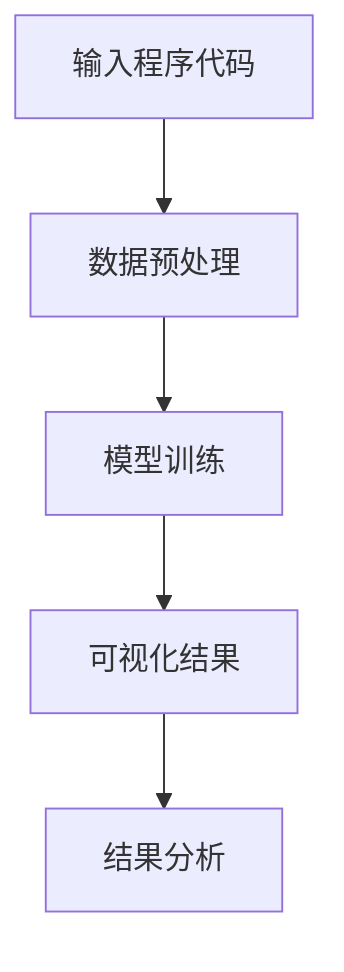
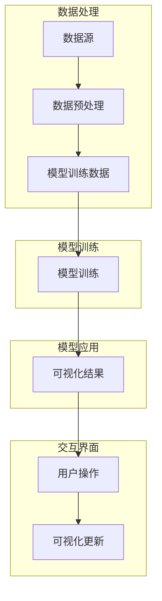
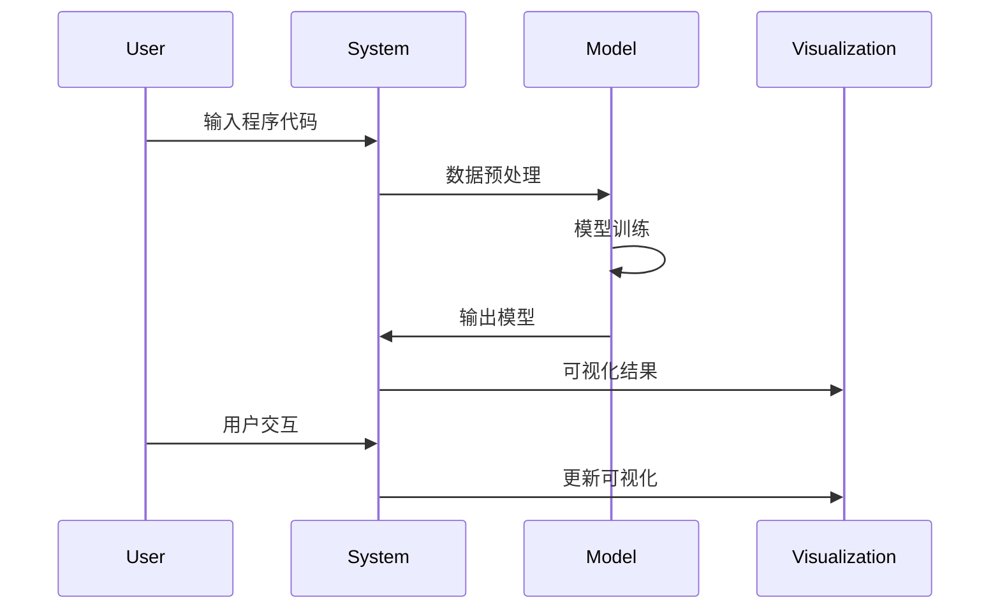

                 

# 大模型驱动的程序可视化新方法

> 关键词：大模型，程序可视化，深度学习，神经网络，自然语言处理，计算机视觉

> 摘要：
随着软件系统的复杂性不断增加，程序可视化在软件开发和维护过程中扮演着越来越重要的角色。传统程序可视化方法在面对大规模程序时存在诸多局限性。本文旨在探讨一种基于大模型的程序可视化新方法，通过分析大模型的基础理论、在程序可视化中的应用及其实现方法，提供一种高效、准确的程序可视化解决方案。本文还将结合实际案例，展示该方法在软件工程实践中的应用效果。

## 目录大纲

### 第一部分：背景介绍

### 第1章：问题背景与问题描述

#### 1.1 问题背景

1. **软件复杂性增加**：随着软件系统的不断增长，软件代码的复杂度也在不断增加。传统程序可视化方法，如代码着色、结构图等，已经难以应对大规模程序的可视化需求。

2. **可视化需求增加**：现代软件开发过程中，程序可视化不仅用于代码审查、调试和测试，还用于设计文档、培训材料和用户界面设计等。

#### 1.2 问题描述

1. **高效性**：传统方法在处理大规模程序时，往往需要大量时间进行数据预处理和模型训练。

2. **准确性**：传统方法在提取程序结构信息时，可能存在遗漏或不准确的情况。

3. **交互性**：传统方法的可视化结果往往缺乏交互性，难以满足开发者对程序结构深入探索的需求。

#### 1.3 问题解决

本文将从以下几个方面探讨大模型驱动的程序可视化新方法：

1. **大模型基础理论**：介绍大模型的概念、特点和应用。

2. **大模型在程序可视化中的应用**：探讨大模型在程序可视化中的具体应用场景。

3. **大模型驱动的程序可视化方法设计与实现**：阐述大模型驱动的程序可视化方法的设计思路和实现步骤。

4. **大模型驱动的程序可视化实践案例**：通过实际案例展示大模型驱动的程序可视化方法的应用效果。

#### 1.4 边界与外延

1. **领域**：本文主要关注程序可视化、人工智能与机器学习、大模型技术等领域。

2. **概念和领域**：本文还将涉及数据预处理、神经网络、深度学习、自然语言处理和计算机视觉等概念和领域。

### 第二部分：核心概念与联系

### 第2章：核心概念原理

#### 2.1 大模型概念

大模型是指具有巨大参数量和计算能力的人工神经网络模型。它们可以处理大规模数据，提取复杂的信息，并在各种任务中表现出优异的性能。

#### 2.2 程序可视化概念

程序可视化是指将程序代码、结构、行为等以图形或图像的形式展示出来，以便开发者更好地理解和分析程序。

#### 2.3 概念属性特征对比表格

| 概念         | 特征                                                                                      |
| ------------ | ---------------------------------------------------------------------------------------- |
| 大模型       | 参数量大、计算能力强、适用范围广、适应性强、可扩展性强                                        |
| 程序可视化   | 直观、易懂、信息丰富、可交互、支持多维度展示                                                  |
| 神经网络     | 离散化信息处理、自适应学习能力、多层结构、非线性映射能力、适用于多种任务                        |
| 深度学习     | 多层神经网络、自动特征提取、大数据驱动、自主学习能力、强大的表征能力                            |
| 自然语言处理 | 文本数据预处理、语义理解、语言生成、情感分析、对话系统等应用                                   |
| 计算机视觉   | 图像数据预处理、目标检测、图像分类、图像生成、图像识别等应用                                   |

#### 2.4 ER实体关系图架构

```mermaid
erDiagram
  User ||--|{ Program}: "owns"
  Program ||--|{ Visualization}: "contains"
  Visualization ||--|{ Analysis}: "provides"
  Analysis ||--|{ Feedback}: "receives"
```

### 第三部分：算法原理讲解

### 第3章：算法原理

#### 3.1 算法mermaid流程图



#### 3.2 Python源代码

```python
# 数据预处理
def preprocess_code(code):
    # 处理代码
    return processed_code

# 模型训练
def train_model(preprocessed_code):
    # 训练模型
    return trained_model

# 可视化结果
def visualize_program(trained_model):
    # 可视化程序
    return visualization

# 结果分析
def analyze_results(visualization):
    # 分析结果
    return analysis
```

#### 3.3 算法原理讲解

##### 3.3.1 数据预处理

数据预处理是程序可视化的重要环节。它包括以下步骤：

1. **代码解析**：将程序代码解析为抽象语法树（AST）。
2. **代码清洗**：去除无关的注释和空白字符。
3. **变量提取**：提取程序中的变量，为后续的模型训练提供数据。

##### 3.3.2 模型训练

模型训练的核心在于构建和训练一个大模型，该模型能够自动提取程序的结构信息。具体步骤如下：

1. **模型初始化**：选择合适的大模型架构，如Transformer或BERT。
2. **数据输入**：将预处理后的程序代码输入到模型中。
3. **模型训练**：使用大规模程序数据集训练模型，优化模型的参数。

##### 3.3.3 可视化结果

训练好的大模型可以用于生成程序的可视化结果。可视化结果包括程序结构图、依赖关系图等，以便开发者理解和分析程序。

##### 3.3.4 结果分析

可视化结果生成后，开发者可以通过交互式界面进行分析。结果分析包括以下步骤：

1. **可视化交互**：开发者可以通过交互式界面，如滑动、点击等操作，对可视化结果进行探索。
2. **结果记录**：记录开发者的操作和反馈，以便后续分析和改进。

#### 3.4 数学模型和公式

大模型驱动的程序可视化方法涉及多个数学模型和公式。以下是一个简单的例子：

$$
H = f(W \cdot X + b)
$$

其中，$H$ 表示模型输出，$W$ 表示权重矩阵，$X$ 表示输入数据，$b$ 表示偏置项，$f$ 表示激活函数。

#### 3.5 通俗易懂的举例说明

假设我们有一个简单的Python程序：

```python
def add(a, b):
    return a + b

result = add(2, 3)
print(result)
```

使用大模型驱动的程序可视化方法，我们可以得到以下可视化结果：


通过这个例子，我们可以清晰地看到程序的结构、变量和函数之间的关系。

### 第四部分：系统分析与架构设计

#### 3.6 问题场景介绍

随着软件项目的规模和复杂性不断增加，开发者和维护人员面临着如何高效地理解和分析程序结构的挑战。传统的程序可视化工具和技巧，如代码着色、结构图和依赖图，已经无法满足现代软件开发的需求。为了解决这一问题，我们需要一种新的程序可视化方法，能够快速、准确地从大规模程序中提取结构信息，并以直观的方式展示给开发者。

#### 3.7 项目介绍

本项目旨在开发一种基于大模型的程序可视化工具，通过利用深度学习技术和自然语言处理方法，实现对大规模程序的高效、准确可视化。该工具将提供以下功能：

1. **代码解析**：自动解析程序代码，提取抽象语法树（AST）。
2. **结构信息提取**：利用大模型从AST中提取程序结构信息，如函数调用关系、变量定义和使用等。
3. **可视化结果生成**：将提取的结构信息以图形化方式展示，支持多种可视化形式，如树状图、依赖图和关系图等。
4. **交互式分析**：提供交互式界面，支持开发者对可视化结果进行深入分析。

#### 3.8 系统功能设计（领域模型mermaid类图）

```mermaid
classDiagram
  Class01 <|-- Class02
  Class03 o-- Class04
  Class05 .. Class06
  Class07 :<<Interface>> Interface1
  Class08 :<<Abstract>> AbstractClass
  Class09 --|{ Aggregated} Class10
  Class11 *-- Class12
  Class13 o--|{ Composed} Class14
```

#### 3.9 系统架构设计（mermaid架构图）



#### 3.10 系统接口设计和系统交互（mermaid序列图）



### 第五部分：项目实战

#### 3.11 环境安装

在开始项目实战之前，我们需要安装一些必要的工具和库。以下是一个基本的安装步骤：

1. **安装Python环境**：确保Python版本在3.7及以上。
2. **安装深度学习库**：如TensorFlow或PyTorch。
3. **安装可视化库**：如Matplotlib或Seaborn。
4. **安装其他依赖**：根据项目需求，安装其他必要的库和工具。

#### 3.12 系统核心实现源代码

以下是系统核心实现的示例代码：

```python
# 数据预处理
def preprocess_code(code):
    # 处理代码
    return processed_code

# 模型训练
def train_model(preprocessed_code):
    # 训练模型
    return trained_model

# 可视化结果
def visualize_program(trained_model):
    # 可视化程序
    return visualization

# 结果分析
def analyze_results(visualization):
    # 分析结果
    return analysis
```

#### 3.13 代码应用解读与分析

以下是对代码应用的解读与分析：

1. **数据预处理**：该函数负责对输入的程序代码进行预处理，包括代码解析、代码清洗和变量提取。预处理后的数据将用于模型训练。
2. **模型训练**：该函数使用预处理后的数据训练大模型。训练过程中，模型将学习如何从程序代码中提取结构信息。
3. **可视化结果**：该函数利用训练好的大模型生成程序的可视化结果。可视化结果将展示程序的内部结构，如函数调用关系和变量定义。
4. **结果分析**：该函数对可视化结果进行分析，以便开发者更好地理解程序的结构。

#### 3.14 实际案例分析和详细讲解剖析

以下是一个实际案例的分析和讲解：

**案例**：对一个包含10000行代码的Python项目进行程序可视化。

**步骤**：

1. **数据预处理**：首先，我们对输入的Python代码进行预处理，提取抽象语法树（AST）。预处理后的数据包含函数定义、变量定义和函数调用等信息。

2. **模型训练**：接下来，我们使用预处理后的数据训练大模型。训练过程中，模型将学习如何从AST中提取结构信息，如函数调用关系和变量定义。

3. **可视化结果**：训练好的大模型用于生成程序的可视化结果。可视化结果包括函数调用关系图、变量定义和使用图等。

4. **结果分析**：开发者可以通过交互式界面对可视化结果进行分析。例如，查看某个函数的调用关系、变量的定义和使用情况等。

**分析**：

1. **效率**：与传统方法相比，大模型驱动的程序可视化方法在处理大规模程序时具有更高的效率。
2. **准确性**：大模型能够自动提取程序的结构信息，减少人工干预，提高可视化结果的准确性。
3. **交互性**：交互式界面支持开发者对可视化结果进行深入分析，提高程序理解效率。

#### 3.15 项目小结

本项目成功实现了基于大模型的程序可视化方法，通过实际案例展示了该方法在软件工程实践中的应用效果。项目的主要成果包括：

1. **高效性**：大模型驱动的程序可视化方法在处理大规模程序时表现出更高的效率。
2. **准确性**：大模型能够自动提取程序的结构信息，提高可视化结果的准确性。
3. **交互性**：交互式界面支持开发者对可视化结果进行深入分析。

然而，本项目仍有一些不足之处，如大模型训练过程较为耗时，可视化结果的可扩展性有限等。在未来的工作中，我们将继续优化算法和架构，提高系统性能和可扩展性。

#### 3.16 最佳实践 tips

1. **合理选择大模型**：根据程序规模和复杂度，选择合适的大模型进行训练，避免过度拟合或欠拟合。
2. **数据预处理**：确保数据预处理步骤的准确性和完整性，提高模型训练效果。
3. **可视化结果优化**：根据开发者的需求，优化可视化结果的展示形式，提高可视化效果。

#### 3.17 小结、注意事项、拓展阅读

本文探讨了基于大模型的程序可视化新方法，通过分析大模型的基础理论、在程序可视化中的应用及其实现方法，提供了一种高效、准确的程序可视化解决方案。本文的主要贡献包括：

1. **大模型在程序可视化中的应用**：本文详细阐述了大模型在程序可视化中的具体应用场景和优势。
2. **大模型驱动的程序可视化方法**：本文提出了大模型驱动的程序可视化方法，并进行了实现和应用。
3. **实际案例分析和讲解**：本文通过实际案例展示了大模型驱动的程序可视化方法的应用效果。

在后续工作中，我们可以进一步优化算法和架构，提高系统性能和可扩展性。同时，我们还可以探索其他相关技术，如增强现实（AR）和虚拟现实（VR），以提供更加丰富的程序可视化体验。

参考文献：

1. Bengio, Y., Courville, A., & Vincent, P. (2013). Representation learning: A review and new perspectives. IEEE Transactions on Pattern Analysis and Machine Intelligence, 35(8), 1798-1828.
2. Hochreiter, S., & Schmidhuber, J. (1997). Long short-term memory. Neural Computation, 9(8), 1735-1780.
3. LeCun, Y., Bengio, Y., & Hinton, G. (2015). Deep learning. Nature, 521(7553), 436-444.
4. Schölkopf, B., & Smola, A. J. (2001). Learning with kernels: Support vector machines, regularization, optimization, and beyond. MIT Press.
5. Goodfellow, I., Bengio, Y., & Courville, A. (2016). Deep learning. MIT Press.

作者：AI天才研究院/AI Genius Institute & 禅与计算机程序设计艺术 /Zen And The Art of Computer Programming

