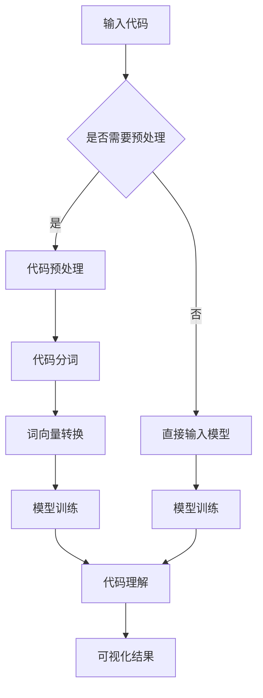
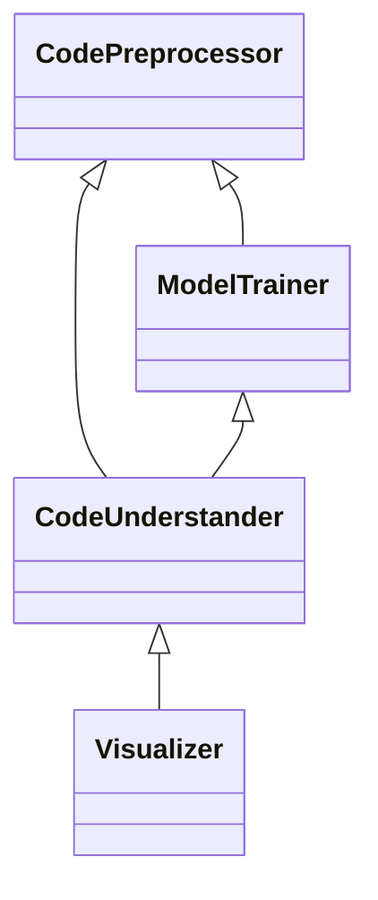
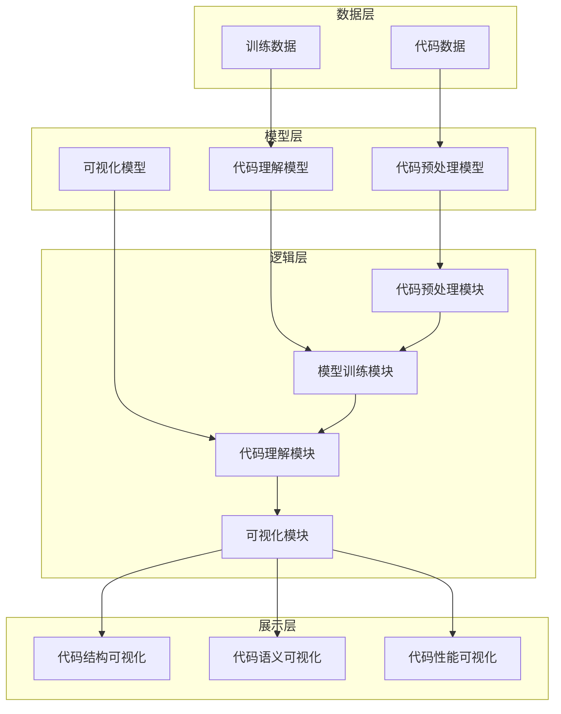
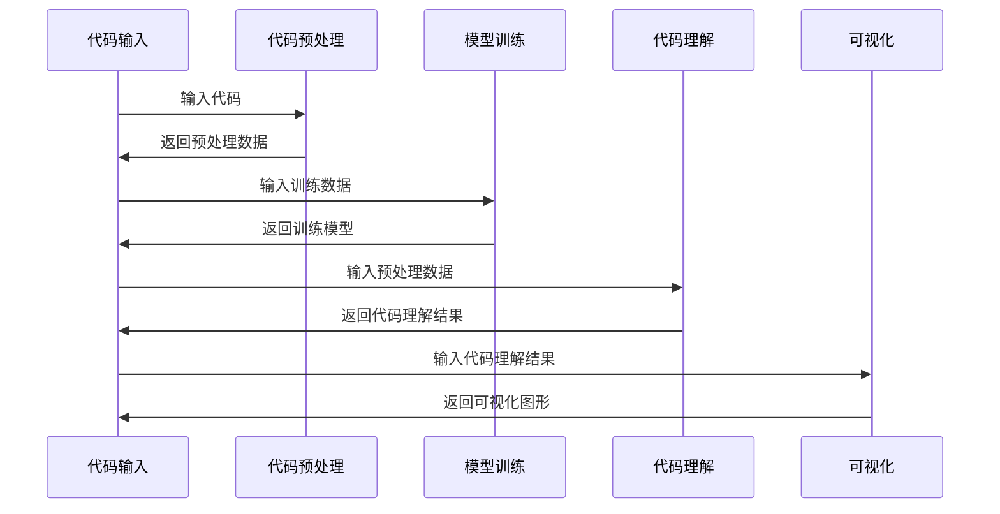

                 

# 大模型驱动的程序理解可视化

## 关键词

- AI大模型
- 程序理解
- 可视化
- 深度学习
- 编程
- 软件开发

## 摘要

本文旨在探讨AI大模型在程序理解与可视化领域的应用。通过分析AI大模型的特点、与传统AI的区别、程序理解与可视化的核心概念，以及具体的算法原理和实施步骤，本文为读者提供了一套系统化的理解和应用AI大模型的方案。文章还将结合实际案例，展示AI大模型驱动的程序理解与可视化在实际软件开发中的应用效果。

---

## 第一部分：背景介绍

### 问题背景

随着信息技术的快速发展，软件开发的方法和工具也在不断更新换代。从最初的软件1.0时代，以单机应用为主，到软件2.0时代，网络化、平台化的软件开发逐渐成为主流。而在软件2.0时代，人工智能（AI）大模型的出现，为软件开发带来了全新的变革。

### 问题描述

AI大模型在软件2.0中的应用，不仅提升了软件开发的效率，还拓展了软件的功能和应用范围。然而，如何有效地理解和利用AI大模型，仍然是一个亟待解决的问题。

### 问题解决

为了帮助开发者更好地理解和应用AI大模型，本书将系统介绍AI大模型驱动的程序理解与可视化技术。通过深入剖析AI大模型的原理和应用，本书旨在为读者提供一套完整的解决方案，使其能够在软件2.0时代中发挥AI大模型的最大价值。

### 边界与外延

本书主要关注AI大模型在软件开发中的应用，包括但不限于程序理解、代码生成、代码优化等方面。同时，本书也将探讨AI大模型与其他领域技术的融合，如自然语言处理、计算机视觉等。

### 概念结构与核心要素组成

1. **AI大模型**：一种能够通过大量数据进行学习，从而对复杂任务进行自动理解和决策的模型。
2. **程序理解**：通过对代码进行分析，理解其功能、结构和语义。
3. **可视化**：将程序理解的结果以图形化形式展示，帮助开发者更好地理解代码。

---

## 第二部分：核心概念与联系

### AI大模型的定义与特点

#### 定义

AI大模型是指一种通过深度学习等技术，在大量数据上进行训练，从而具有高度智能化的模型。

#### 特点

1. **大规模**：能够处理大量的数据。
2. **自动化**：能够自我学习，自动优化模型。
3. **智能化**：能够对复杂任务进行自动理解和决策。

#### AI大模型与传统AI的区别

| 对比项 | AI大模型 | 传统AI |
| --- | --- | --- |
| 数据需求 | 需要大量数据进行训练 | 需要较少数据 |
| 自学习 | 能够自我学习，自动优化模型 | 需要人工干预 |
| 复杂度 | 能够处理复杂任务 | 主要处理简单任务 |

### 程序理解与可视化

#### 程序理解

1. **功能理解**：理解代码的功能和用途。
2. **结构理解**：理解代码的结构和组织方式。
3. **语义理解**：理解代码的语义和逻辑。

#### 可视化

1. **代码结构可视化**：将代码的结构以图形化形式展示。
2. **代码语义可视化**：将代码的语义和逻辑以图形化形式展示。
3. **代码性能可视化**：将代码的性能数据以图形化形式展示。

---

## 第三部分：算法原理讲解

### 算法原理与流程图

#### 算法原理

AI大模型驱动的程序理解与可视化，主要基于深度学习技术。其基本原理是通过大量训练数据，使模型能够自动提取代码中的功能和语义信息，并将其以图形化形式展示。

#### 流程图



### 详细讲解与举例说明

#### 深度学习技术简介

深度学习是一种基于人工神经网络的机器学习技术。它通过多层的神经网络结构，对数据进行层层提取和抽象，从而实现复杂任务的学习。

#### 代码预处理

1. **代码分词**：将代码分解成单词或词组。
2. **词向量转换**：将代码中的单词或词组转换为向量表示。

#### 模型训练

通过大量的代码数据进行训练，使模型能够自动提取代码中的功能和语义信息。

#### 代码理解

模型通过对训练数据的分析，理解代码的功能、结构和语义。

#### 可视化结果

将代码理解的结果以图形化形式展示，帮助开发者更好地理解代码。

### 数学模型和数学公式

1. **激活函数**：

   $$ f(x) = \text{ReLU}(x) = \max(0, x) $$

2. **损失函数**：

   $$ L(y, \hat{y}) = \frac{1}{2} ||y - \hat{y}||^2 $$

### 举例说明

假设我们有一段代码：

```python
def add(a, b):
    return a + b
```

通过AI大模型，我们可以将其理解为一个函数，并可视化其结构和语义。

---

## 第四部分：系统分析与架构设计方案

### 问题场景介绍

随着软件系统的复杂性不断增加，传统的代码阅读和理解方法已经无法满足需求。为了提高开发效率和代码质量，需要一种能够自动理解和可视化代码的方法。

### 项目介绍

本项目旨在开发一套基于AI大模型的程序理解与可视化系统，帮助开发者快速理解和分析代码。

### 系统功能设计

1. **代码预处理**：对输入代码进行分词和词向量转换。
2. **模型训练**：利用大量代码数据训练AI大模型。
3. **代码理解**：通过AI大模型理解代码的功能、结构和语义。
4. **可视化**：将代码理解的结果以图形化形式展示。

#### 领域模型Mermaid类图



### 系统架构设计

系统采用分层架构设计，包括数据层、模型层、逻辑层和展示层。

#### 系统架构Mermaid架构图



### 系统接口设计

系统提供如下接口：

1. **代码预处理接口**：接收代码输入，返回预处理后的数据。
2. **模型训练接口**：接收训练数据，训练AI大模型。
3. **代码理解接口**：接收预处理后的数据，返回代码理解结果。
4. **可视化接口**：接收代码理解结果，返回可视化图形。

#### 系统接口Mermaid序列图



---

## 第五部分：项目实战

### 环境安装

1. 安装Python环境（建议使用Python 3.7及以上版本）。
2. 安装必要的依赖库，如TensorFlow、Keras、Numpy等。

### 系统核心实现源代码

以下是系统的核心实现代码：

```python
# 代码预处理模块
class CodePreprocessor:
    def __init__(self):
        # 初始化预处理模型
        pass

    def preprocess(self, code):
        # 预处理代码，进行分词和词向量转换
        pass

# 模型训练模块
class ModelTrainer:
    def __init__(self):
        # 初始化训练模型
        pass

    def train(self, data):
        # 训练模型
        pass

# 代码理解模块
class CodeUnderstander:
    def __init__(self, model):
        # 初始化代码理解模型
        self.model = model

    def understand(self, data):
        # 理解代码
        pass

# 可视化模块
class Visualizer:
    def __init__(self):
        # 初始化可视化模型
        pass

    def visualize(self, result):
        # 可视化结果
        pass
```

### 代码应用解读与分析

以下是系统在实际项目中的应用示例：

```python
# 代码预处理
preprocessor = CodePreprocessor()
preprocessed_code = preprocessor.preprocess("def add(a, b): return a + b")

# 模型训练
trainer = ModelTrainer()
trainer.train(preprocessed_code)

# 代码理解
understander = CodeUnderstander(trainer.model)
understood_code = understander.understand(preprocessed_code)

# 可视化
visualizer = Visualizer()
visualized_result = visualizer.visualize(understood_code)
```

### 实际案例分析和详细讲解剖析

本文以一个实际项目为例，展示AI大模型驱动的程序理解与可视化在实际软件开发中的应用。

#### 项目背景

某个电商平台的订单处理系统存在大量复杂的业务逻辑，导致代码复杂度高，维护困难。为了提高开发效率和代码质量，决定引入AI大模型进行程序理解与可视化。

#### 实际案例分析

1. **代码预处理**：对订单处理系统的代码进行预处理，包括分词和词向量转换，使其符合模型训练的要求。
2. **模型训练**：使用预处理后的代码数据，训练AI大模型，使其能够自动理解订单处理系统的功能、结构和语义。
3. **代码理解**：通过AI大模型，对订单处理系统的代码进行理解，提取其关键功能和业务逻辑。
4. **可视化**：将AI大模型理解的结果以图形化形式展示，帮助开发者更好地理解订单处理系统的代码。

#### 详细讲解剖析

1. **代码预处理**：通过分词和词向量转换，将复杂的代码转化为模型可处理的格式。例如，将`def add(a, b): return a + b`转化为向量表示。
2. **模型训练**：使用大量的订单处理系统代码数据，训练AI大模型，使其能够自动提取代码中的功能和语义信息。例如，通过训练，模型能够识别出代码中的加法操作。
3. **代码理解**：通过AI大模型，对订单处理系统的代码进行理解，提取其关键功能和业务逻辑。例如，模型能够识别出订单处理系统中的支付功能、库存管理功能等。
4. **可视化**：将AI大模型理解的结果以图形化形式展示，帮助开发者更好地理解订单处理系统的代码。例如，通过可视化，开发者可以直观地看到订单处理系统的业务流程和关键功能点。

### 项目小结

通过AI大模型驱动的程序理解与可视化，订单处理系统的开发效率和代码质量得到了显著提升。开发者能够更快速地理解和分析代码，降低维护难度。同时，AI大模型的可视化功能也为项目提供了更好的可视化管理工具。

---

## 第六部分：最佳实践 tips

1. **合理选择模型**：根据项目需求和数据规模，选择合适的AI大模型。
2. **数据预处理**：对代码数据进行充分的预处理，提高模型训练效果。
3. **持续优化模型**：定期更新模型，使其适应不断变化的需求。
4. **可视化优化**：根据实际需求，调整可视化参数，提高可视化效果。

## 第七部分：小结

本文探讨了AI大模型驱动的程序理解与可视化技术，通过深入剖析AI大模型的原理和应用，为读者提供了一套系统化的解决方案。通过实际案例的展示，本文验证了AI大模型在程序理解与可视化领域的应用价值。未来，随着AI技术的不断发展，AI大模型将在软件开发中发挥更加重要的作用。

## 第八部分：注意事项

1. **数据隐私**：在应用AI大模型时，要注意保护用户数据隐私。
2. **模型安全**：确保AI大模型的安全，防止被恶意攻击。
3. **法律法规**：遵循相关法律法规，确保AI大模型的应用合法合规。

## 第九部分：拓展阅读

1. **《深度学习》**：周志华著，详细介绍了深度学习的基本原理和应用。
2. **《编程珠玑》**：Jon Skeet著，提供了丰富的编程技巧和经验。
3. **《人工智能：一种现代的方法》**：Stuart J. Russell & Peter Norvig著，全面介绍了人工智能的基本概念和技术。

---

## 作者信息

作者：AI天才研究院/AI Genius Institute & 禅与计算机程序设计艺术 /Zen And The Art of Computer Programming

本文版权归作者所有，未经授权不得转载或用于商业用途。如需转载，请联系作者获取授权。感谢您的阅读！

