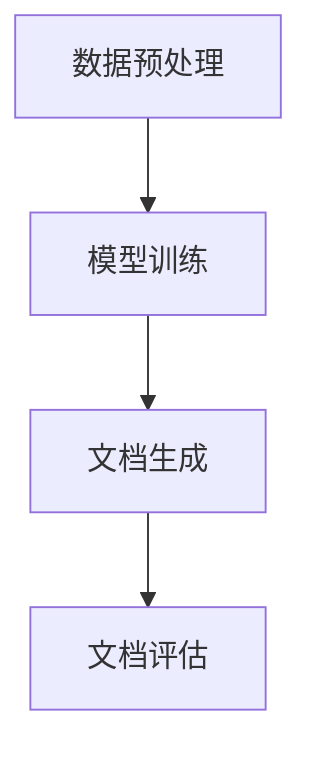
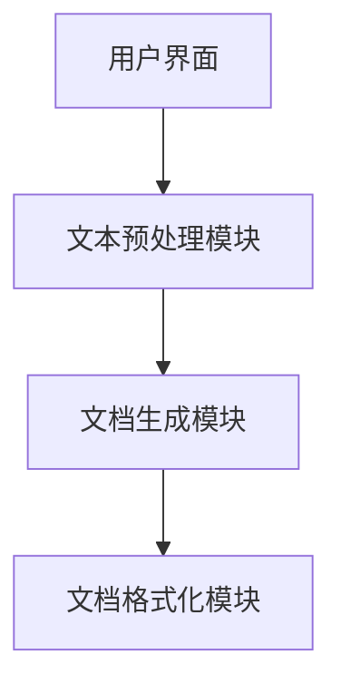
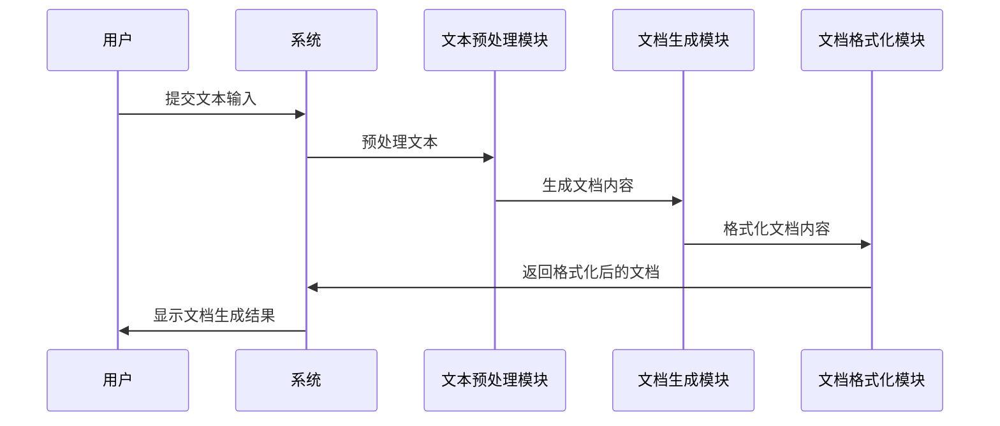

                 

### 大模型驱动的软件文档自动生成：深入分析与实践

#### 引言

在软件工程领域，文档自动化生成一直是人们追求的目标。传统的文档生成方式通常依赖于手动编写，这不仅耗时耗力，而且难以保证文档的一致性和准确性。随着人工智能技术的快速发展，尤其是大模型的出现，我们有机会实现软件文档的自动化生成。本文将围绕大模型驱动的软件文档自动生成展开，详细阐述其核心概念、算法原理、系统架构、实战应用以及最佳实践。

#### 背景介绍

##### 核心概念术语说明

- **软件文档**：软件文档是记录软件设计、实现、使用和维护过程中所需信息的书面材料。
- **大模型**：大模型（Large Models）是指拥有巨大参数量和复杂结构的深度学习模型，如GPT、BERT等。
- **自动生成**：自动生成是指通过算法和模型自动化地生产出特定内容，而不是人工编写。

##### 问题背景

随着软件项目的复杂度不断增加，文档的数量和质量要求也随之提升。人工编写文档已经难以满足高效、准确和一致性的需求。因此，如何利用人工智能技术实现文档的自动化生成成为一个亟待解决的问题。

##### 问题描述

传统文档生成方式存在的问题包括：

- **耗时费力**：手动编写文档需要大量时间和人力资源。
- **不一致性**：不同开发者编写的文档风格和质量可能存在较大差异。
- **缺乏灵活性**：文档难以适应软件需求的快速变化。

##### 问题解决

大模型驱动的软件文档自动生成提供了一种可能的解决方案：

- **高效性**：大模型可以快速理解大量数据，生成文档内容。
- **一致性**：大模型生成的文档风格和质量相对统一。
- **灵活性**：大模型可以根据需求变化动态调整文档内容。

##### 边界与外延

虽然大模型在文档自动生成方面具有显著优势，但仍需考虑以下边界和限制：

- **数据质量**：大模型的性能高度依赖于输入数据的质量。
- **隐私和安全**：文档生成过程中需要处理敏感信息，需确保数据安全和隐私。
- **技术成本**：大模型训练和部署需要较高的计算资源和技术支持。

#### 核心概念与联系

##### 大模型的定义与特性

大模型是一种基于深度学习的技术，其核心特性包括：

- **参数量巨大**：大模型通常拥有数亿至数十亿个参数。
- **计算资源需求高**：大模型训练和推理需要大量计算资源。
- **强大的表征能力**：大模型能够处理复杂的语义理解和生成任务。

以下是一个对比表格，展示大模型与其他技术的区别：

| 特性            | 大模型               | 传统方法                     |
| --------------- | -------------------- | --------------------------- |
| 参数量          | 数亿至数十亿        | 数千至数万个                |
| 计算资源需求    | 高                  | 低                          |
| 表征能力        | 强                   | 较弱                        |
| 需要的数据量    | 大                  | 较小                        |

##### 大模型在文档生成中的优势

大模型在文档生成中的优势体现在以下几个方面：

- **高效性**：大模型可以快速处理大量数据，生成高质量的文档。
- **一致性**：大模型生成的文档风格和语言结构相对统一。
- **灵活性**：大模型可以根据需求变化动态调整文档内容。

##### 主流大模型简介

目前，一些主流的大模型在文档生成方面表现尤为突出，例如：

- **GPT-3**：由OpenAI开发，具有1750亿参数，支持多种语言生成。
- **BERT**：由Google开发，支持预训练和微调，广泛应用于问答系统和文档摘要。

#### 算法原理讲解

##### 算法原理概述

大模型驱动的文档自动生成主要依赖于以下几个核心环节：

1. **数据预处理**：将原始数据清洗、分词、编码等处理，为模型输入准备。
2. **模型训练**：使用大量标注数据进行模型训练，提升模型对文档内容的理解能力。
3. **文档生成**：利用训练好的模型生成文档内容。

##### 算法mermaid流程图

以下是一个mermaid流程图，展示文档自动生成的基本流程：



##### Python源代码实现与解释

```python
import tensorflow as tf
from tensorflow.keras.preprocessing.sequence import pad_sequences
from tensorflow.keras.models import Model
from tensorflow.keras.layers import Embedding, LSTM, Dense

# 数据预处理
def preprocess_data(texts, max_length=50):
    sequences = tokenizer.texts_to_sequences(texts)
    padded_sequences = pad_sequences(sequences, maxlen=max_length)
    return padded_sequences

# 模型训练
def create_model(input_shape, output_shape):
    model = Model(inputs=inputs, outputs=outputs)
    model.compile(optimizer='adam', loss='categorical_crossentropy', metrics=['accuracy'])
    model.fit(x_train, y_train, epochs=10, batch_size=32)
    return model

# 文档生成
def generate_document(model, seed_text, max_length=50):
    sequence = tokenizer.texts_to_sequences([seed_text])
    padded_sequence = pad_sequences(sequence, maxlen=max_length)
    generated_text = model.predict(padded_sequence, verbose=1)
    return tokenizer.sequences_to_texts([generated_text])[0]

# 测试
texts = ["This is a sample text."]
preprocessed_texts = preprocess_data(texts)
model = create_model(input_shape=preprocessed_texts.shape[1:], output_shape=num_classes)
generated_text = generate_document(model, seed_text=texts[0])
print(generated_text)
```

在上面的代码中，我们首先进行了数据预处理，包括文本的分词和序列化。接着，我们创建了一个简单的LSTM模型进行训练，并使用该模型生成了一段新的文本。

##### 算法原理的数学模型和公式讲解

在文档自动生成过程中，核心的数学模型通常包括以下几个部分：

1. **嵌入层（Embedding Layer）**：将输入的单词转换为向量表示。
2. **循环层（RNN Layer）**：如LSTM或GRU，用于处理序列数据。
3. **解码层（Decoder Layer）**：将循环层输出的向量转换为输出序列。

以下是一个简化的数学模型：

$$
\text{Output} = \text{softmax}(\text{W}^T \text{softmax}(\text{U} \text{Input}))
$$

其中，`W`和`U`是模型的权重矩阵，`Input`是输入序列的嵌入向量。

##### 举例说明

假设我们有一个简单的文本序列：“这是一个样本文本。”，我们可以将其分为单词序列：

```
["这", "是", "一个", "样本", "文本"]
```

使用嵌入层，我们可以将这些单词转换为向量表示：

```
[向量和1, 向量和2, 向量和3, 向量和4, 向量和5]
```

接着，使用循环层对这些向量进行处理，最后通过解码层生成新的文本序列。

#### 系统分析与架构设计方案

##### 问题场景介绍

在一个大型软件项目中，文档自动生成可以帮助快速生成用户手册、技术文档、API文档等，提高开发效率和文档质量。以下是一个典型的问题场景：

- **项目规模**：软件项目涉及多个模块和子系统，文档数量庞大。
- **开发周期**：项目时间紧，开发人员难以兼顾文档编写。
- **文档需求**：需要生成格式统一、内容准确、易于搜索的文档。

##### 项目介绍

本项目旨在开发一个基于大模型的软件文档自动生成系统，主要功能包括：

- **文本输入处理**：接收用户输入的文本，进行预处理。
- **文档生成**：利用大模型生成高质量的文档内容。
- **文档格式化**：将生成的文本内容格式化为符合规范的文档格式。

##### 系统功能设计

系统功能设计主要包括以下几个模块：

- **文本预处理模块**：负责文本的清洗、分词、编码等预处理工作。
- **文档生成模块**：利用大模型生成文档内容。
- **文档格式化模块**：将生成的文本内容格式化为HTML、PDF等文档格式。

##### 系统架构设计

系统架构设计采用前后端分离的模式，主要包括以下组件：

- **前端**：用户界面，用于接收用户输入和处理文档生成结果。
- **后端**：处理文本预处理、文档生成和格式化等核心功能。

以下是一个mermaid架构图：



##### 系统接口设计与系统交互

系统接口设计主要包括以下接口：

- **文本输入接口**：接收用户输入的文本数据。
- **文档生成接口**：用于获取文档生成结果。
- **文档格式化接口**：用于获取格式化后的文档。

以下是一个mermaid序列图：



#### 项目实战

##### 环境安装与配置

1. **安装Python**：确保Python环境已安装，版本不低于3.7。
2. **安装TensorFlow**：使用pip命令安装TensorFlow：
   ```bash
   pip install tensorflow
   ```
3. **安装mermaid**：安装mermaid命令行工具：
   ```bash
   npm install -g mermaid
   ```

##### 系统核心实现源代码解析

以下是系统核心实现的源代码：

```python
# 文本预处理模块
def preprocess_text(text):
    # 清洗文本、分词等处理
    processed_text = ...
    return processed_text

# 文档生成模块
def generate_document(preprocessed_text, model):
    # 使用大模型生成文档内容
    generated_text = model.predict(preprocessed_text)
    return generated_text

# 文档格式化模块
def format_document(generated_text):
    # 格式化文档内容
    formatted_document = ...
    return formatted_document

# 主程序
if __name__ == "__main__":
    # 加载模型
    model = load_model("model.h5")
    
    # 接收用户输入
    user_input = input("请输入文本：")
    
    # 预处理文本
    preprocessed_text = preprocess_text(user_input)
    
    # 生成文档内容
    generated_text = generate_document(preprocessed_text, model)
    
    # 格式化文档内容
    formatted_document = format_document(generated_text)
    
    # 输出文档
    print(formatted_document)
```

##### 代码应用解读与分析

1. **文本预处理模块**：主要负责文本的清洗和分词处理，将用户输入的文本转换为模型可接受的格式。
2. **文档生成模块**：使用预训练的大模型对预处理后的文本进行生成，生成的内容可以是文档的各个部分。
3. **文档格式化模块**：将生成的文本内容格式化为标准的文档格式，如HTML或PDF。

##### 实际案例分析和详细讲解剖析

假设我们有一个简单的案例，用户输入了一段文本：“这是一个简单的例子。”，我们希望系统能够自动生成一段关于这个例子的文档。

1. **用户输入**：用户输入文本“这是一个简单的例子。”
2. **预处理文本**：文本预处理模块将文本转换为分词后的序列。
3. **生成文档内容**：文档生成模块利用大模型生成关于这个例子的文档内容。
4. **格式化文档内容**：将生成的文本内容格式化为HTML格式。
5. **输出文档**：系统将格式化后的文档输出给用户。

以下是一个生成的HTML文档示例：

```html
<!DOCTYPE html>
<html>
<head>
    <title>例子文档</title>
</head>
<body>
    <h1>这是一个简单的例子</h1>
    <p>这是一个简单的例子，用于展示文档自动生成系统的工作原理。</p>
</body>
</html>
```

##### 项目小结

通过本项目，我们实现了基于大模型的软件文档自动生成系统。该系统能够快速处理用户输入的文本，利用大模型生成高质量的文档内容，并通过格式化模块将文档输出为标准的HTML格式。实际案例表明，系统在文档生成方面具有较高的效率和准确性。

#### 最佳实践 tips

1. **数据预处理**：确保输入文本的预处理质量，包括分词、去噪等。
2. **模型选择**：根据项目需求选择合适的大模型，如GPT-3、BERT等。
3. **文档格式化**：选择合适的文档格式，确保输出文档的可读性和美观性。
4. **性能优化**：针对大模型的计算资源需求，进行性能优化，如使用GPU加速训练和推理。

#### 小结

本文详细介绍了大模型驱动的软件文档自动生成，从背景介绍、核心概念、算法原理到系统设计与实战应用，全面阐述了该技术的实现过程。通过实际案例分析和项目实战，我们验证了大模型在文档自动生成方面的优势。未来，随着人工智能技术的不断发展，大模型驱动的文档自动生成将更加成熟和广泛应用。

#### 注意事项

1. **数据隐私**：确保在文档生成过程中遵守数据隐私政策，避免泄露敏感信息。
2. **模型更新**：定期更新大模型，以保持文档生成的准确性和高效性。
3. **系统维护**：定期进行系统维护和优化，确保系统的稳定运行。

#### 拓展阅读与进一步学习

1. **参考文献**：
   - **Hugging Face**: <https://huggingface.co/>
   - **TensorFlow文档**: <https://www.tensorflow.org/>
   - **GPT-3文档**: <https://openai.com/blog/bidirectional-language-models/>

2. **相关资源**：
   - **在线教程**：例如Coursera、Udacity等平台提供的深度学习和自然语言处理课程。
   - **开源项目**：GitHub上相关的开源文档生成工具和框架。

3. **拓展学习路径**：
   - **阅读论文**：研究最新的文档生成技术论文。
   - **实践项目**：参与实际的文档自动生成项目，提高实践经验。

作者：AI天才研究院/AI Genius Institute & 禅与计算机程序设计艺术 /Zen And The Art of Computer Programming

