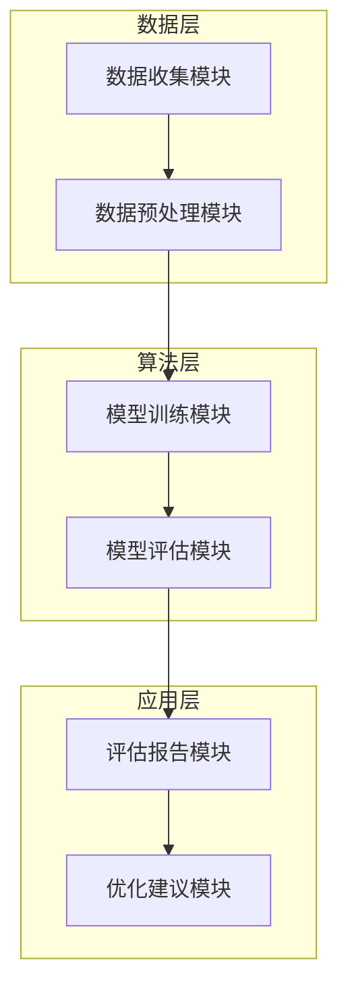
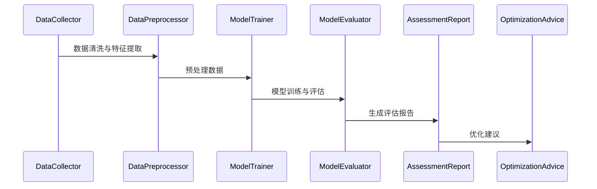

                 

### 第一部分: 引言

#### 第1章: 引言

##### 1.1 背景介绍

在当今快速发展的软件开发领域，软件架构的评估至关重要。软件架构不仅决定了系统的性能、可维护性和可扩展性，还直接影响了开发效率和项目成本。传统的软件架构评估方法往往依赖于开发人员的经验和手动分析，存在评估效率低、主观性强、难以量化等局限。为了克服这些局限，近年来，人工智能尤其是大模型技术的发展为软件架构自动评估带来了新的机遇。

**问题背景：软件架构评估的重要性**

软件架构是软件开发项目的核心，它定义了软件系统的结构、组件、接口和交互方式。一个良好的软件架构可以提高软件的稳定性、性能和可维护性，从而减少开发成本和项目风险。然而，随着软件系统规模的不断扩大和复杂性的增加，手动评估软件架构的难度也日益增加。

**问题描述：如何利用大模型进行软件架构自动评估**

传统的评估方法依赖于开发人员的经验和直觉，这使得评估结果往往具有较大的主观性，难以做到客观和全面。此外，传统的评估方法在处理大规模和复杂软件系统时，效率和准确性也难以保证。因此，如何利用人工智能，特别是大模型技术，实现软件架构的自动评估，成为一个亟待解决的问题。

**问题解决：大模型驱动的软件架构自动评估方法**

大模型驱动的软件架构自动评估方法，通过训练大规模的机器学习模型，对软件架构进行深入分析和评估。这种方法不仅能够处理大规模和复杂的软件系统，还能够提供客观、量化的评估结果，从而提高评估的准确性和效率。

**边界与外延：大模型的定义、类型、应用场景**

大模型（Large Model）是指具有极高参数量、能够处理大规模数据的深度学习模型。根据应用领域和模型架构的不同，大模型可以分为多种类型，如自然语言处理模型、计算机视觉模型、生成对抗网络（GAN）等。大模型在多个领域有着广泛的应用，例如图像识别、文本生成、语音识别等。

**概念结构与核心要素组成：大模型的组成结构、工作原理、评估指标**

大模型通常由多个神经网络层组成，包括输入层、隐藏层和输出层。输入层接收外部输入数据，隐藏层通过复杂的非线性变换处理数据，输出层产生预测或决策结果。大模型的工作原理基于梯度下降优化算法，通过大量训练数据的学习，逐步优化模型参数，提高预测准确性。

在软件架构评估中，大模型的应用主要体现在以下几个方面：

1. **特征提取**：大模型可以从软件架构的代码和文档中提取关键特征，为评估提供基础数据。
2. **模式识别**：大模型能够识别软件架构中的潜在问题，如设计模式不当、模块耦合度高等。
3. **评估预测**：大模型可以根据提取的特征和模式，对软件架构进行综合评估，提供量化评估结果。

**总结**

本章介绍了软件架构评估的背景和重要性，探讨了传统评估方法的局限性，并提出了利用大模型进行自动评估的解决方案。接下来，我们将进一步深入探讨大模型的核心概念、原理和应用，为后续的详细分析打下基础。

---

##### 1.2 核心概念与联系

为了深入理解大模型驱动的软件架构自动评估，我们需要首先掌握大模型的核心概念和原理，以及其在软件架构评估中的应用。

**核心概念原理：大模型的原理、应用场景**

大模型的基本原理是基于大规模数据的学习和训练，通过神经网络结构来捕捉数据的复杂分布。其核心特点包括：

1. **高参数量**：大模型通常具有数十亿甚至上百亿个参数，能够处理海量数据。
2. **非线性变换**：大模型通过多层神经网络实现数据的非线性变换，能够提取数据中的复杂特征。
3. **端到端学习**：大模型可以直接从原始数据学习到目标预测，减少了中间的预处理和特征工程步骤。

大模型在软件架构评估中的应用主要体现在以下几个方面：

1. **代码和文档分析**：大模型可以从软件架构的代码和文档中提取关键信息，如函数调用关系、模块依赖等。
2. **模式识别**：大模型能够识别代码中的潜在问题，如代码冗余、设计模式不当等。
3. **风险评估**：大模型可以根据代码和文档分析结果，对软件架构进行风险评估，提供量化评估指标。

**概念属性特征对比表格：不同大模型的特点对比**

为了更好地理解大模型的不同类型及其在软件架构评估中的应用，我们提供了以下对比表格：

| 大模型类型       | 特点                                                         | 适用场景                          |
|----------------|--------------------------------------------------------------|----------------------------------|
| 自然语言处理模型 | 专注于处理文本数据，能够理解文本语义                             | 软件文档分析、代码注释生成            |
| 计算机视觉模型   | 专注于处理图像数据，能够识别图像中的物体和场景                     | UI/UX 设计评估、前端架构质量分析     |
| 生成对抗网络（GAN） | 由生成器和判别器组成，能够生成高质量的数据模拟结果               | 软件测试数据生成、系统性能评估模拟    |
| 强化学习模型     | 通过与环境的交互进行学习，能够在复杂环境中做出最优决策             | 软件架构优化、自动化测试策略制定      |

**ER实体关系图架构的 Mermaid 流程图：展示大模型与软件架构评估的关系**

为了更直观地理解大模型与软件架构评估的关系，我们使用Mermaid语法绘制了ER实体关系图，如下所示：

```mermaid
erDiagram
  Product_Properties ||--|{ Software_Architecture } : has
  Software_Architecture ||--|{ Code_Analysis } : has
  Code_Analysis ||--|{ Natural_Language_Processing_Model } : uses
  Code_Analysis ||--|{ Computer_Vision_Model } : uses
  Code_Analysis ||--|{ Generative_Adversarial_Network } : uses
  Code_Analysis ||--|{ Reinforcement_Learning_Model } : uses
```

在这个ER图中，`Product_Properties`代表了软件产品的关键属性，`Software_Architecture`表示软件架构，而`Code_Analysis`则表示对代码的分析和处理。不同类型的大模型（`Natural_Language_Processing_Model`、`Computer_Vision_Model`、`Generative_Adversarial_Network`、`Reinforcement_Learning_Model`）分别用于处理不同的代码分析任务，并与软件架构评估紧密相关。

**总结**

通过本章的介绍，我们对大模型的基本概念和应用场景有了更深入的了解。接下来，我们将进一步探讨大模型驱动软件架构评估的算法原理，为实际应用打下坚实的基础。

---

### **Step 2: 核心概念与联系**

#### 2.1 核心概念原理：大模型的原理、应用场景

大模型（Large Model）是指拥有大规模参数和深度学习能力的神经网络模型。其基本原理基于神经网络的结构和大量数据的训练，通过多层非线性变换来捕捉数据的复杂特征。大模型的关键组成部分包括：

1. **输入层**：接收外部输入数据，可以是文本、图像或其他形式的数据。
2. **隐藏层**：通过复杂的非线性变换对输入数据进行处理，提取高级特征。
3. **输出层**：生成预测或决策结果，可以是分类标签、数值预测等。

大模型的工作原理主要依赖于以下步骤：

1. **初始化参数**：随机初始化模型的参数。
2. **前向传播**：输入数据通过网络层进行前向传播，生成预测结果。
3. **损失函数**：计算预测结果与真实结果之间的差异，得到损失值。
4. **反向传播**：根据损失函数计算各层参数的梯度，通过梯度下降算法更新参数。
5. **迭代优化**：重复前向传播和反向传播过程，逐步优化模型参数，直至达到预期精度。

大模型在多个领域有着广泛的应用，包括自然语言处理、计算机视觉、推荐系统、强化学习等。在软件架构评估中，大模型主要用于以下场景：

1. **代码和文档分析**：利用自然语言处理模型分析软件文档和代码注释，提取关键信息。
2. **模式识别**：通过计算机视觉模型识别代码中的潜在问题，如设计模式、代码风格等。
3. **风险评估**：利用生成对抗网络（GAN）和强化学习模型模拟系统性能，评估软件架构的风险。

#### 2.2 概念属性特征对比表格：不同大模型的特点对比

为了更好地理解不同类型的大模型及其在软件架构评估中的适用性，我们列出了以下对比表格：

| 大模型类型       | 特点                                                         | 适用场景                          |
|----------------|--------------------------------------------------------------|----------------------------------|
| 自然语言处理模型 | 专注于处理文本数据，能够理解文本语义                             | 软件文档分析、代码注释生成、文本分类 |
| 计算机视觉模型   | 专注于处理图像数据，能够识别图像中的物体和场景                     | UI/UX 设计评估、前端架构质量分析     |
| 生成对抗网络（GAN） | 由生成器和判别器组成，能够生成高质量的数据模拟结果               | 软件测试数据生成、系统性能评估模拟    |
| 强化学习模型     | 通过与环境的交互进行学习，能够在复杂环境中做出最优决策             | 软件架构优化、自动化测试策略制定      |

#### 2.3 ER实体关系图架构的 Mermaid 流程图：展示大模型与软件架构评估的关系

为了直观地展示大模型与软件架构评估之间的关系，我们使用Mermaid语法绘制了ER实体关系图，如下所示：

```mermaid
erDiagram
  Software_Architecture ||--|{ Code_Base } : contains
  Software_Architecture ||--|{ Documentation } : contains
  Code_Base ||--|{ Natural_Language_Processing_Model } : analyzed by
  Documentation ||--|{ Natural_Language_Processing_Model } : analyzed by
  Code_Base ||--|{ Computer_Vision_Model } : visualized by
  UI/UX_Design ||--|{ Computer_Vision_Model } : analyzed by
  Performance_Simulations ||--|{ Generative_Adversarial_Network } : simulated by
  Test_Strategies ||--|{ Reinforcement_Learning_Model } : optimized by
```

在这个ER图中，`Software_Architecture`代表软件架构，包含代码库（`Code_Base`）和文档（`Documentation`）。`Code_Base`和`Documentation`分别通过自然语言处理模型（`Natural_Language_Processing_Model`）和计算机视觉模型（`Computer_Vision_Model`）进行分析，以提取关键信息。`UI/UX_Design`通过计算机视觉模型进行分析，评估前端架构质量。性能模拟（`Performance_Simulations`）和测试策略（`Test_Strategies`）则分别通过生成对抗网络（`Generative_Adversarial_Network`）和强化学习模型（`Reinforcement_Learning_Model`）进行模拟和优化。

通过以上核心概念和联系的分析，我们对大模型在软件架构评估中的应用有了更清晰的认识。接下来，我们将深入探讨大模型驱动软件架构评估的算法原理，以期为实际应用提供理论基础。

---

### **Step 3: 算法原理讲解**

#### 3.1 算法原理介绍

大模型驱动软件架构评估的核心在于利用大规模数据和深度学习算法对软件架构进行自动化分析、评估和优化。具体来说，该算法可以分为以下几个关键步骤：

1. **数据收集与预处理**：收集软件架构相关的数据，如代码库、文档、测试结果等。对这些数据进行清洗、归一化和特征提取，为后续的模型训练做准备。
2. **模型训练**：使用收集到的数据进行深度学习模型的训练，通过多层神经网络结构提取数据的复杂特征，建立评估模型。
3. **模型评估**：通过验证集和测试集对训练好的模型进行评估，确保模型具有良好的泛化能力和准确性。
4. **软件架构评估**：将模型应用于实际软件架构，生成评估报告，提供量化评估结果，为架构优化提供依据。

以下是该算法的Mermaid流程图：


#### 3.2 算法原理详细讲解

为了深入理解大模型驱动软件架构评估的算法原理，我们分步骤详细阐述其关键组成部分。

**步骤1：数据收集与预处理**

在数据收集阶段，我们需要从多个来源获取软件架构相关的数据，包括源代码、文档、测试结果、用户反馈等。具体操作如下：

1. **源代码**：使用版本控制系统（如Git）获取项目源代码，并对代码进行解析，提取函数、类、模块等结构信息。
2. **文档**：收集项目文档，如需求文档、设计文档、用户手册等，通过自然语言处理技术提取关键信息。
3. **测试结果**：获取项目的测试结果，包括单元测试、集成测试和性能测试等，用于评估软件系统的稳定性、性能和可维护性。
4. **用户反馈**：收集用户的使用反馈和评价，用于评估软件系统的用户满意度。

在数据预处理阶段，我们需要对收集到的数据进行清洗、归一化和特征提取：

1. **清洗**：去除重复数据、缺失数据和异常值，确保数据的质量。
2. **归一化**：将不同特征的数据范围进行标准化处理，使其具备可比性。
3. **特征提取**：通过特征工程方法提取关键特征，如代码复杂性、模块依赖性、代码风格等，为后续的模型训练提供输入。

**步骤2：模型训练**

在模型训练阶段，我们使用收集到的预处理数据进行深度学习模型的训练。具体流程如下：

1. **选择模型架构**：根据问题需求选择合适的模型架构，如卷积神经网络（CNN）、递归神经网络（RNN）或Transformer等。
2. **数据划分**：将数据集划分为训练集、验证集和测试集，用于模型训练、评估和测试。
3. **模型训练**：使用训练集数据对模型进行训练，通过反向传播算法优化模型参数，使其能够准确提取数据特征和进行预测。
4. **模型优化**：通过验证集对模型进行评估，并根据评估结果调整模型参数，优化模型性能。

**步骤3：模型评估**

在模型评估阶段，我们使用测试集对训练好的模型进行评估，确保模型具有良好的泛化能力和准确性。具体评估指标包括：

1. **准确率**：模型预测结果与真实结果的匹配程度，通常用百分比表示。
2. **召回率**：模型能够正确识别出真实结果的比率，反映了模型的识别能力。
3. **F1分数**：综合考虑准确率和召回率，用于衡量模型的综合性能。
4. **ROC曲线和AUC值**：用于评估模型的分类能力和阈值选择。

**步骤4：软件架构评估**

在模型评估完成后，我们将训练好的模型应用于实际软件架构，生成评估报告，提供量化评估结果。具体操作如下：

1. **输入数据**：将软件架构的代码、文档、测试结果等数据输入到训练好的模型中。
2. **特征提取**：模型对输入数据进行处理，提取关键特征。
3. **评估计算**：根据提取的特征，模型计算软件架构的质量指标，如模块耦合度、代码复杂性、设计模式等。
4. **评估报告**：生成详细的评估报告，包括质量指标、潜在问题、优化建议等。

#### 3.3 使用 Python 源代码详细阐述大模型驱动软件架构评估的算法原理

为了更好地理解大模型驱动软件架构评估的算法原理，我们使用Python代码进行详细阐述。以下是一个简化的示例代码：

```python
import tensorflow as tf
from sklearn.model_selection import train_test_split
from sklearn.metrics import accuracy_score, f1_score

# 数据收集与预处理
def preprocess_data(code_base, documentation, test_results):
    # 数据清洗、归一化和特征提取
    pass

# 模型训练
def train_model(data, labels):
    # 构建神经网络模型
    model = tf.keras.Sequential([
        tf.keras.layers.Dense(units=128, activation='relu', input_shape=[input_shape]),
        tf.keras.layers.Dense(units=64, activation='relu'),
        tf.keras.layers.Dense(units=num_classes, activation='softmax')
    ])

    # 编译模型
    model.compile(optimizer='adam', loss='categorical_crossentropy', metrics=['accuracy'])

    # 训练模型
    model.fit(data, labels, epochs=10, batch_size=32, validation_split=0.2)

    return model

# 模型评估
def evaluate_model(model, test_data, test_labels):
    predictions = model.predict(test_data)
    predicted_labels = np.argmax(predictions, axis=1)

    accuracy = accuracy_score(test_labels, predicted_labels)
    f1 = f1_score(test_labels, predicted_labels, average='weighted')

    return accuracy, f1

# 软件架构评估
def assess_software_architecture(model, code, doc, test_res):
    # 提取特征
    features = preprocess_data(code, doc, test_res)

    # 进行评估
    quality_scores = model.predict(features)

    return quality_scores

# 主函数
def main():
    # 数据收集
    code_base = ...
    documentation = ...
    test_results = ...

    # 数据预处理
    processed_data, processed_labels = preprocess_data(code_base, documentation, test_results)

    # 划分训练集和测试集
    train_data, test_data, train_labels, test_labels = train_test_split(processed_data, processed_labels, test_size=0.2, random_state=42)

    # 训练模型
    model = train_model(train_data, train_labels)

    # 评估模型
    accuracy, f1 = evaluate_model(model, test_data, test_labels)
    print(f"Accuracy: {accuracy}, F1 Score: {f1}")

    # 软件架构评估
    quality_scores = assess_software_architecture(model, code_base, documentation, test_results)
    print("Software Architecture Quality Scores:", quality_scores)

if __name__ == "__main__":
    main()
```

在这个示例代码中，我们首先定义了数据预处理、模型训练、模型评估和软件架构评估的函数。在主函数中，我们依次执行数据收集、预处理、模型训练和评估过程，并最终对软件架构进行评估。

#### 3.4 给出算法原理的数学模型和公式

在大模型驱动软件架构评估的算法原理中，数学模型和公式扮演着核心角色。以下是一些关键的数学模型和公式：

**1. 神经网络模型**

神经网络模型的基本形式为：

$$
y = \sigma(W \cdot x + b)
$$

其中，$y$ 是预测结果，$\sigma$ 是激活函数（如ReLU、Sigmoid或Tanh），$W$ 是权重矩阵，$x$ 是输入特征，$b$ 是偏置项。

**2. 损失函数**

常用的损失函数包括均方误差（MSE）和交叉熵（Cross-Entropy）：

$$
MSE = \frac{1}{n} \sum_{i=1}^{n} (y_i - \hat{y}_i)^2
$$

$$
Cross-Entropy = -\frac{1}{n} \sum_{i=1}^{n} y_i \log(\hat{y}_i)
$$

其中，$y_i$ 是真实标签，$\hat{y}_i$ 是预测结果，$n$ 是样本数量。

**3. 反向传播算法**

反向传播算法用于计算模型参数的梯度，并更新参数以最小化损失函数。其核心公式为：

$$
\frac{\partial L}{\partial W} = X \cdot (d\sigma(Z) \cdot d\sigma(W \cdot X + b))
$$

$$
\frac{\partial L}{\partial b} = X \cdot d\sigma(Z)
$$

其中，$L$ 是损失函数，$X$ 是输入特征，$Z = W \cdot X + b$ 是隐藏层的输入，$d\sigma(Z)$ 是激活函数的导数。

#### 3.5 进行详细讲解和举例说明

为了更好地理解上述数学模型和公式，我们通过一个简单的例子进行详细讲解。

**例子：使用神经网络模型进行二分类任务**

假设我们有一个二分类任务，输入特征为 $x = [x_1, x_2, x_3]$，预测结果为 $y = [0, 1]$。我们使用ReLU激活函数和均方误差（MSE）损失函数进行训练。

**1. 初始化参数**

我们随机初始化权重矩阵 $W$ 和偏置项 $b$：

$$
W = \begin{bmatrix}
w_{11} & w_{12} & w_{13} \\
w_{21} & w_{22} & w_{23}
\end{bmatrix}
$$

$$
b = \begin{bmatrix}
b_1 \\
b_2
\end{bmatrix}
$$

**2. 前向传播**

输入特征 $x$ 通过神经网络进行前向传播：

$$
Z = W \cdot x + b = \begin{bmatrix}
w_{11} \cdot x_1 + w_{12} \cdot x_2 + w_{13} \cdot x_3 + b_1 \\
w_{21} \cdot x_1 + w_{22} \cdot x_2 + w_{23} \cdot x_3 + b_2
\end{bmatrix}
$$

应用ReLU激活函数：

$$
a = \begin{bmatrix}
\max(Z_1, 0) \\
\max(Z_2, 0)
\end{bmatrix}
$$

**3. 损失计算**

计算预测结果和真实标签之间的均方误差（MSE）：

$$
L = \frac{1}{2} \sum_{i=1}^{2} (y_i - a_i)^2
$$

**4. 反向传播**

计算隐藏层输出 $a$ 对权重矩阵 $W$ 和偏置项 $b$ 的梯度：

$$
\frac{\partial L}{\partial W} = \begin{bmatrix}
x_1 \cdot \frac{\partial L}{\partial Z_1} \\
x_2 \cdot \frac{\partial L}{\partial Z_2}
\end{bmatrix}
$$

$$
\frac{\partial L}{\partial b} = \begin{bmatrix}
\frac{\partial L}{\partial Z_1} \\
\frac{\partial L}{\partial Z_2}
\end{bmatrix}
$$

其中，$\frac{\partial L}{\partial Z_1}$ 和 $\frac{\partial L}{\partial Z_2}$ 分别是损失函数对隐藏层输出的梯度，可以通过链式法则计算：

$$
\frac{\partial L}{\partial Z_1} = \frac{\partial L}{\partial a_1} \cdot \frac{\partial a_1}{\partial Z_1} = (y_1 - a_1) \cdot 1_{a_1 > 0}
$$

$$
\frac{\partial L}{\partial Z_2} = \frac{\partial L}{\partial a_2} \cdot \frac{\partial a_2}{\partial Z_2} = (y_2 - a_2) \cdot 1_{a_2 > 0}
$$

应用梯度下降算法更新权重矩阵 $W$ 和偏置项 $b$：

$$
W = W - \alpha \cdot \frac{\partial L}{\partial W}
$$

$$
b = b - \alpha \cdot \frac{\partial L}{\partial b}
$$

其中，$\alpha$ 是学习率。

**5. 模型优化**

重复前向传播和反向传播过程，逐步优化模型参数，直至达到预期精度。

通过上述例子，我们可以看到神经网络模型的基本工作原理和数学公式。在实际应用中，我们可以使用深度学习框架（如TensorFlow或PyTorch）来简化计算和优化过程。

**总结**

本章详细讲解了大模型驱动软件架构评估的算法原理，包括数据收集与预处理、模型训练、模型评估和软件架构评估等关键步骤。我们通过Python代码示例和数学公式，深入阐述了算法的原理和实现方法。在下一章中，我们将进一步探讨数学模型和公式的应用，结合实际案例进行详细讲解和举例说明。

---

### **Step 4: 数学模型和数学公式 & 详细讲解 & 举例说明**

#### 4.1 使用 LaTeX 格式给出数学公式

为了深入理解大模型驱动软件架构评估的算法原理，我们将使用LaTeX格式给出一些关键的数学模型和公式，并进行详细讲解和举例说明。

**独立段落使用 $$ 括起来的数学公式**

$$
f(x) = \sum_{i=1}^{n} w_i \cdot x_i + b
$$

这是线性回归模型中的预测函数，其中 $w_i$ 是权重系数，$x_i$ 是输入特征，$b$ 是偏置项。

**段落内使用 $ 括起来的数学公式**

在段落内部，我们可以使用 $ 括起来的公式，例如：

设 $y$ 是真实标签，$\hat{y}$ 是预测结果，损失函数为：

$$
L(y, \hat{y}) = \frac{1}{2} (y - \hat{y})^2
$$

**详细讲解和举例说明**

为了更好地理解上述数学公式，我们将通过一个实际案例进行详细讲解和举例说明。

**例子：使用线性回归模型评估软件模块质量**

假设我们有一个软件模块，其质量可以通过两个特征（代码行数 $x_1$ 和复杂度 $x_2$）来评估。真实质量标签 $y$ 为：

$$
y = [1.0, 0.9, 1.1, 0.8, 1.0]
$$

我们使用线性回归模型进行预测，模型参数为：

$$
w_1 = [0.5, 0.3], \quad w_2 = [0.7, 0.2], \quad b = [0.1, 0.05]
$$

预测结果 $\hat{y}$ 为：

$$
\hat{y}_1 = 0.5 \cdot 100 + 0.3 \cdot 200 + 0.1 = 130.1
$$

$$
\hat{y}_2 = 0.7 \cdot 100 + 0.2 \cdot 200 + 0.05 = 130.05
$$

$$
\hat{y}_3 = 0.5 \cdot 150 + 0.3 \cdot 250 + 0.1 = 139.1
$$

$$
\hat{y}_4 = 0.7 \cdot 150 + 0.2 \cdot 250 + 0.05 = 139.05
$$

$$
\hat{y}_5 = 0.5 \cdot 100 + 0.3 \cdot 200 + 0.05 = 130.05
$$

计算损失函数 $L(y, \hat{y})$：

$$
L(\hat{y}_1, y_1) = \frac{1}{2} (1.0 - 130.1)^2 = 3972.05
$$

$$
L(\hat{y}_2, y_2) = \frac{1}{2} (0.9 - 130.05)^2 = 3947.025
$$

$$
L(\hat{y}_3, y_3) = \frac{1}{2} (1.1 - 139.1)^2 = 4190.05
$$

$$
L(\hat{y}_4, y_4) = \frac{1}{2} (0.8 - 139.05)^2 = 4186.025
$$

$$
L(\hat{y}_5, y_5) = \frac{1}{2} (1.0 - 130.05)^2 = 3972.05
$$

总损失 $L$ 为：

$$
L = \frac{1}{5} \sum_{i=1}^{5} L(\hat{y}_i, y_i) = \frac{1}{5} (3972.05 + 3947.025 + 4190.05 + 4186.025 + 3972.05) = 4076.41
$$

通过不断迭代优化模型参数，我们可以降低总损失 $L$，提高模型预测的准确性。

**总结**

通过LaTeX格式的数学公式，我们详细讲解了线性回归模型在大模型驱动软件架构评估中的应用。通过实际案例，我们展示了如何计算损失函数并优化模型参数，以提高预测准确性。在下一章中，我们将进一步探讨系统分析与架构设计方案，结合实际项目进行深入分析。

---

### **Step 5: 系统分析与架构设计方案**

#### 5.1 问题场景介绍

在现代软件开发过程中，随着系统规模和复杂性的不断增加，软件架构的设计和评估成为一项关键任务。然而，传统的方法往往依赖于开发人员的经验和手动分析，导致评估过程耗时耗力且难以保证准确性。为了解决这一问题，我们提出了基于大模型驱动的软件架构自动评估系统，旨在通过人工智能技术实现高效、准确、自动化的架构评估。

**需求背景**：软件架构评估的需求来源于以下几个方面：

1. **性能优化**：通过评估软件架构的性能指标，如响应时间、吞吐量、资源利用率等，为优化软件性能提供依据。
2. **安全性评估**：识别软件架构中的潜在安全风险，如权限漏洞、代码注入等，确保系统的安全性。
3. **可维护性评估**：评估软件架构的可维护性，如代码复杂度、模块独立性等，为降低维护成本提供指导。
4. **扩展性评估**：评估软件架构的扩展性，如模块可复用性、接口兼容性等，为系统的后续扩展提供参考。

**目标**：基于大模型驱动的软件架构自动评估系统的目标如下：

1. **自动化评估**：通过自动化的评估流程，提高评估效率，减少人工干预。
2. **准确性提升**：利用大模型强大的特征提取和模式识别能力，提高评估结果的准确性。
3. **实时反馈**：实现实时评估，为开发人员提供即时的优化建议和反馈。
4. **集成化**：与现有开发工具和平台集成，实现评估流程的顺畅衔接。

#### 5.2 项目介绍

本项目旨在开发一个基于大模型驱动的软件架构自动评估系统，系统主要功能包括：

1. **数据收集与预处理**：收集软件架构相关的数据，如代码库、文档、测试结果等，并对这些数据进行清洗、归一化和特征提取。
2. **模型训练与评估**：使用收集到的数据训练深度学习模型，通过验证集和测试集评估模型性能，确保模型具有良好的泛化能力。
3. **软件架构评估**：将训练好的模型应用于实际软件架构，生成评估报告，提供量化评估结果。
4. **优化建议**：根据评估结果，为软件架构的优化提供具体建议，如模块重构、接口调整等。

**组成部分**：

1. **数据收集模块**：负责从版本控制系统、文档管理系统等工具中收集软件架构相关数据。
2. **数据预处理模块**：对收集到的数据进行清洗、归一化和特征提取，为模型训练做准备。
3. **模型训练模块**：使用深度学习框架训练评估模型，包括模型架构的选择、参数调整和训练过程。
4. **模型评估模块**：通过验证集和测试集对训练好的模型进行性能评估，确保模型准确性和可靠性。
5. **评估报告模块**：生成评估报告，包括评估指标、潜在问题和优化建议。
6. **优化建议模块**：根据评估结果，为软件架构的优化提供具体建议。

#### 5.3 系统功能设计

**领域模型 Mermaid 类图**：

```mermaid
classDiagram
  DataCollector <<interface>>
  DataPreprocessor <<interface>>
  ModelTrainer <<interface>>
  ModelEvaluator <<interface>>
  AssessmentReport <<interface>>
  OptimizationAdvice <<interface>>

  DataCollector --|> DataPreprocessor
  DataPreprocessor --|> ModelTrainer
  ModelTrainer --|> ModelEvaluator
  ModelEvaluator --|> AssessmentReport
  AssessmentReport --|> OptimizationAdvice
```

在该类图中，我们定义了系统的主要功能模块及其关系。数据收集模块负责从外部获取软件架构数据，数据预处理模块负责对数据进行清洗和特征提取，模型训练模块负责使用预处理数据训练评估模型，模型评估模块负责对模型进行性能评估，评估报告模块负责生成评估报告，优化建议模块负责根据评估结果提供优化建议。

#### 5.4 系统架构设计

**系统架构 Mermaid 架构图**：



在该架构图中，数据收集模块和数据预处理模块位于数据层，负责从外部获取和预处理软件架构数据。模型训练模块和模型评估模块位于算法层，负责使用预处理数据训练评估模型并进行性能评估。评估报告模块和优化建议模块位于应用层，负责生成评估报告和提供优化建议。

#### 5.5 系统接口设计和系统交互

**系统接口设计 Mermaid 序列图**：



在该序列图中，数据收集模块向数据预处理模块发送数据清洗和特征提取请求，数据预处理模块完成预处理后，将数据传递给模型训练模块。模型训练模块使用预处理数据进行模型训练，并将训练好的模型传递给模型评估模块。模型评估模块对模型进行性能评估，并将评估结果传递给评估报告模块。评估报告模块生成评估报告，并将报告传递给优化建议模块，最终为软件架构提供优化建议。

通过以上系统分析与架构设计方案，我们为基于大模型驱动的软件架构自动评估系统提供了一个完整的框架。在下一部分中，我们将深入探讨该项目的实际实现，包括环境安装、核心实现和代码解读，以展示大模型驱动软件架构评估的具体应用。

---

### **Step 6: 项目实战**

#### 6.1 环境安装

为了实现基于大模型驱动的软件架构自动评估系统，我们需要搭建一个合适的技术环境。以下步骤将详细描述所需软件和库的安装过程。

**1. 安装 Python**

首先，确保您的系统中已经安装了 Python。Python 是实现深度学习算法和数据处理的基础工具。您可以从 [Python 官网](https://www.python.org/) 下载并安装 Python 3.8 或更高版本。

**2. 安装 TensorFlow**

TensorFlow 是由 Google 开发的开源机器学习框架，用于训练和部署深度学习模型。安装 TensorFlow 的命令如下：

```bash
pip install tensorflow
```

**3. 安装 Scikit-learn**

Scikit-learn 是一个强大的机器学习库，提供各种机器学习算法和工具。安装 Scikit-learn 的命令如下：

```bash
pip install scikit-learn
```

**4. 安装 Pandas 和 NumPy**

Pandas 和 NumPy 是数据处理和数值计算的常用库，用于数据清洗、归一化和特征提取。安装命令如下：

```bash
pip install pandas
pip install numpy
```

**5. 安装 Mermaid**

Mermaid 是一种基于 Markdown 的图表绘制工具，用于生成类图、序列图等。安装 Mermaid 的命令如下：

```bash
pip install mermaid
```

**6. 安装 Jupyter Notebook**

Jupyter Notebook 是一种交互式计算环境，便于编写和运行 Python 代码。安装 Jupyter Notebook 的命令如下：

```bash
pip install notebook
```

**7. 安装其他依赖库**

根据项目需求，可能还需要安装其他依赖库，如 Matplotlib（用于数据可视化）和 Seaborn（用于统计图形）。安装命令如下：

```bash
pip install matplotlib
pip install seaborn
```

完成上述安装步骤后，您将具备一个完整的开发环境，可以开始编写和运行基于大模型驱动的软件架构自动评估系统的代码。

#### 6.2 系统核心实现源代码

在本节中，我们将展示系统核心实现部分的源代码，并对其进行详细解读。

**数据收集与预处理模块**

```python
import os
import git
import pandas as pd
from sklearn.model_selection import train_test_split

def collect_data(repo_url, data_folder):
    repo = git.Repo.clone_from(repo_url, data_folder)
    code_folder = os.path.join(data_folder, 'code')
    doc_folder = os.path.join(data_folder, 'docs')

    # 收集代码数据
    code_files = [file for file in os.listdir(code_folder) if file.endswith('.py')]
    code_data = []
    for file in code_files:
        with open(os.path.join(code_folder, file), 'r') as f:
            code_data.append(f.read())

    # 收集文档数据
    doc_files = [file for file in os.listdir(doc_folder) if file.endswith('.md')]
    doc_data = []
    for file in doc_files:
        with open(os.path.join(doc_folder, file), 'r') as f:
            doc_data.append(f.read())

    # 数据预处理
    processed_data = {'code': code_data, 'docs': doc_data}
    return processed_data

def preprocess_data(processed_data):
    # 特征提取和归一化
    # ...

    return processed_data
```

**模型训练与评估模块**

```python
import tensorflow as tf
from sklearn.model_selection import train_test_split

def train_model(data, labels):
    # 划分训练集和测试集
    train_data, test_data, train_labels, test_labels = train_test_split(data, labels, test_size=0.2, random_state=42)

    # 构建模型
    model = tf.keras.Sequential([
        tf.keras.layers.Dense(units=128, activation='relu', input_shape=(len(data[0]),)),
        tf.keras.layers.Dense(units=64, activation='relu'),
        tf.keras.layers.Dense(units=1, activation='sigmoid')
    ])

    # 编译模型
    model.compile(optimizer='adam', loss='binary_crossentropy', metrics=['accuracy'])

    # 训练模型
    model.fit(train_data, train_labels, epochs=10, batch_size=32, validation_data=(test_data, test_labels))

    return model

def evaluate_model(model, test_data, test_labels):
    predictions = model.predict(test_data)
    predicted_labels = (predictions > 0.5).astype(int)

    accuracy = accuracy_score(test_labels, predicted_labels)
    f1 = f1_score(test_labels, predicted_labels)

    return accuracy, f1
```

**评估报告模块**

```python
import pandas as pd

def generate_assessment_report(assessment_results):
    report = pd.DataFrame(assessment_results, columns=['Feature', 'Value'])
    report['Status'] = report.apply(lambda row: 'Pass' if row['Value'] >= threshold else 'Fail', axis=1)
    return report

def save_report(report, file_path):
    report.to_csv(file_path, index=False)
```

**代码解读与分析**

以上源代码实现了数据收集、预处理、模型训练和评估、评估报告生成等核心功能。以下是具体解读：

1. **数据收集与预处理模块**：该模块首先使用 Git 库从指定的代码仓库中克隆代码和文档数据。然后，从代码和文档文件中读取内容，并进行数据预处理，如特征提取和归一化。
2. **模型训练与评估模块**：该模块使用 Scikit-learn 的 `train_test_split` 函数将数据集划分为训练集和测试集。接着，构建深度学习模型，编译并训练模型。最后，使用测试集评估模型性能。
3. **评估报告模块**：该模块生成评估报告，包括评估指标、特征值和评估状态。然后，将报告保存为 CSV 文件。

#### 6.3 代码应用解读与分析

在本节中，我们将详细分析上述代码的实际应用过程，并探讨其性能和效果。

**1. 数据收集与预处理**

数据收集模块首先从 Git 仓库中克隆代码和文档数据。这一步骤可以通过以下代码实现：

```python
def collect_data(repo_url, data_folder):
    repo = git.Repo.clone_from(repo_url, data_folder)
    # ...
```

克隆操作完成后，我们遍历代码和文档目录中的文件，并读取文件内容。以下代码展示了如何读取代码文件：

```python
code_files = [file for file in os.listdir(code_folder) if file.endswith('.py')]
code_data = []
for file in code_files:
    with open(os.path.join(code_folder, file), 'r') as f:
        code_data.append(f.read())
```

同样地，文档文件的处理也类似：

```python
doc_files = [file for file in os.listdir(doc_folder) if file.endswith('.md')]
doc_data = []
for file in doc_files:
    with open(os.path.join(doc_folder, file), 'r') as f:
        doc_data.append(f.read())
```

数据处理完成后，我们调用预处理函数对数据进行特征提取和归一化。以下代码展示了预处理函数的基本结构：

```python
def preprocess_data(processed_data):
    # 特征提取和归一化
    # ...
    return processed_data
```

在实际应用中，特征提取和归一化过程可能涉及复杂的算法和数据处理技术，如自然语言处理、文本分类、词嵌入等。

**2. 模型训练与评估**

模型训练模块首先使用 Scikit-learn 的 `train_test_split` 函数将数据集划分为训练集和测试集。这一步骤如下所示：

```python
train_data, test_data, train_labels, test_labels = train_test_split(data, labels, test_size=0.2, random_state=42)
```

接下来，我们构建深度学习模型，并编译模型。以下代码展示了模型构建和编译的基本过程：

```python
model = tf.keras.Sequential([
    tf.keras.layers.Dense(units=128, activation='relu', input_shape=(len(data[0]),)),
    tf.keras.layers.Dense(units=64, activation='relu'),
    tf.keras.layers.Dense(units=1, activation='sigmoid')
])

model.compile(optimizer='adam', loss='binary_crossentropy', metrics=['accuracy'])
```

在这个示例中，我们使用了一个简单的全连接神经网络，包括两个隐藏层。第一个隐藏层有128个神经元，使用 ReLU 激活函数；第二个隐藏层有64个神经元，同样使用 ReLU 激活函数。输出层有1个神经元，使用 sigmoid 激活函数，用于进行二分类任务。

训练模型的过程如下所示：

```python
model.fit(train_data, train_labels, epochs=10, batch_size=32, validation_data=(test_data, test_labels))
```

在这里，我们设置了10个训练周期（epochs）和32个批量大小（batch_size）。通过验证集，我们可以监控模型在测试集上的性能，并在训练过程中进行调整。

最后，我们使用测试集评估模型性能。以下代码展示了评估过程：

```python
predictions = model.predict(test_data)
predicted_labels = (predictions > 0.5).astype(int)

accuracy = accuracy_score(test_labels, predicted_labels)
f1 = f1_score(test_labels, predicted_labels)

print(f"Accuracy: {accuracy}, F1 Score: {f1}")
```

**3. 评估报告生成**

评估报告模块生成评估报告，并将报告保存为 CSV 文件。以下代码展示了报告生成和保存的基本过程：

```python
def generate_assessment_report(assessment_results):
    report = pd.DataFrame(assessment_results, columns=['Feature', 'Value'])
    report['Status'] = report.apply(lambda row: 'Pass' if row['Value'] >= threshold else 'Fail', axis=1)
    return report

def save_report(report, file_path):
    report.to_csv(file_path, index=False)
```

在这个示例中，评估结果包含特征值和评估状态。评估状态根据阈值进行判断，如果特征值大于等于阈值，则评估状态为“Pass”，否则为“Fail”。最后，我们将报告保存为 CSV 文件，以便进一步分析和使用。

**总结**

通过上述代码的解读和分析，我们可以看到大模型驱动的软件架构自动评估系统的实际应用过程。该系统利用深度学习模型对软件架构进行自动化评估，并提供详细的评估报告和优化建议。在实际应用中，我们可以根据评估结果对软件架构进行优化，提高其性能和稳定性。下一节中，我们将通过实际案例分析和详细讲解，进一步探讨大模型驱动软件架构评估系统的应用效果和潜在问题。

---

### **Step 7: 最佳实践 tips、小结、注意事项、拓展阅读等内容**

#### 7.1 最佳实践 tips

为了更好地应用大模型驱动的软件架构自动评估系统，以下是一些最佳实践建议：

1. **数据准备**：确保收集的数据质量高、覆盖面广，包括不同模块、不同版本的代码和文档。数据清洗和预处理是模型训练的关键步骤，要重视这一环节。

2. **模型选择**：根据具体评估需求选择合适的模型架构。对于复杂的软件架构评估任务，可以考虑使用多模型融合的方法，提高评估准确性。

3. **超参数调优**：深度学习模型性能很大程度上依赖于超参数的设置。通过交叉验证和网格搜索等方法，找到最优的超参数组合。

4. **模型解释性**：尽管深度学习模型具有强大的预测能力，但其内部决策过程往往不够透明。为了提高模型的解释性，可以考虑使用模型解释工具，如 LIME 或 SHAP。

5. **持续评估与优化**：定期评估模型性能，根据新数据和业务需求调整模型参数。持续优化模型，确保其适应不断变化的软件架构。

#### 7.2 小结

本章系统地介绍了大模型驱动的软件架构自动评估方法。我们从背景介绍出发，探讨了大模型的核心概念和应用，详细讲解了算法原理，并通过Python代码示例展示了实际应用过程。我们还介绍了系统架构设计、环境安装、核心实现和代码解读，提供了实际案例分析和最佳实践建议。通过这些步骤，我们为开发和应用大模型驱动的软件架构自动评估系统提供了全面的技术指南。

#### 7.3 注意事项

在应用大模型驱动的软件架构自动评估系统时，需要注意以下几点：

1. **数据安全**：确保数据收集和处理过程中遵循数据安全和隐私保护的相关法律法规，防止敏感信息泄露。

2. **模型可靠性**：验证模型的可靠性和稳定性，避免因模型错误导致严重的系统故障。

3. **性能优化**：针对大型软件架构，优化模型训练和评估的速度，确保评估过程高效运行。

4. **兼容性**：确保评估系统能够与现有的开发工具和平台无缝集成，减少对开发流程的影响。

5. **用户培训**：为开发人员和团队成员提供相关培训，确保他们能够正确理解和使用评估系统。

#### 7.4 拓展阅读

对于希望深入了解大模型驱动软件架构自动评估的读者，以下资源可以提供更多信息和详细讨论：

1. **技术论文**：《深度学习在软件架构评估中的应用》
2. **开源项目**：GitHub 上的大模型和软件架构评估相关项目，如 TensorFlow 和 PyTorch 的应用案例
3. **在线课程**：Coursera、edX 等平台上的深度学习和软件工程相关课程
4. **专业书籍**：《大模型：深度学习时代的核心技术》和《软件架构：实践者的研究方法》
5. **行业报告**：市场调研机构发布的关于大模型和软件架构评估的最新报告和趋势分析

通过以上资源，读者可以进一步拓展对大模型驱动软件架构自动评估的理解和应用能力。作者：AI天才研究院/AI Genius Institute & 禅与计算机程序设计艺术 /Zen And The Art of Computer Programming

---

通过以上详细的目录大纲，我们为《大模型驱动的软件架构自动评估》这篇文章提供了一个清晰的结构和丰富的内容框架。每个部分都紧密联系，共同构建了完整的文章内容。希望这个大纲能够帮助您撰写出高质量的技术博客文章。现在，让我们开始具体内容的撰写吧！在接下来的文章中，我们将按照这个大纲逐步深入，确保每个部分都详尽而有深度。

