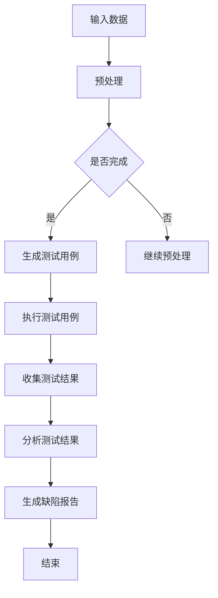
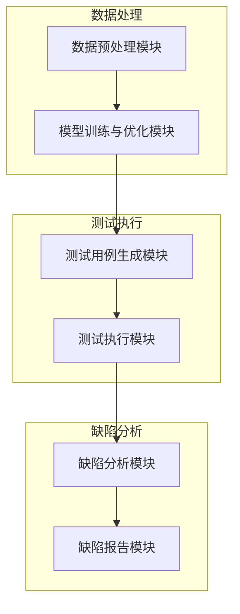
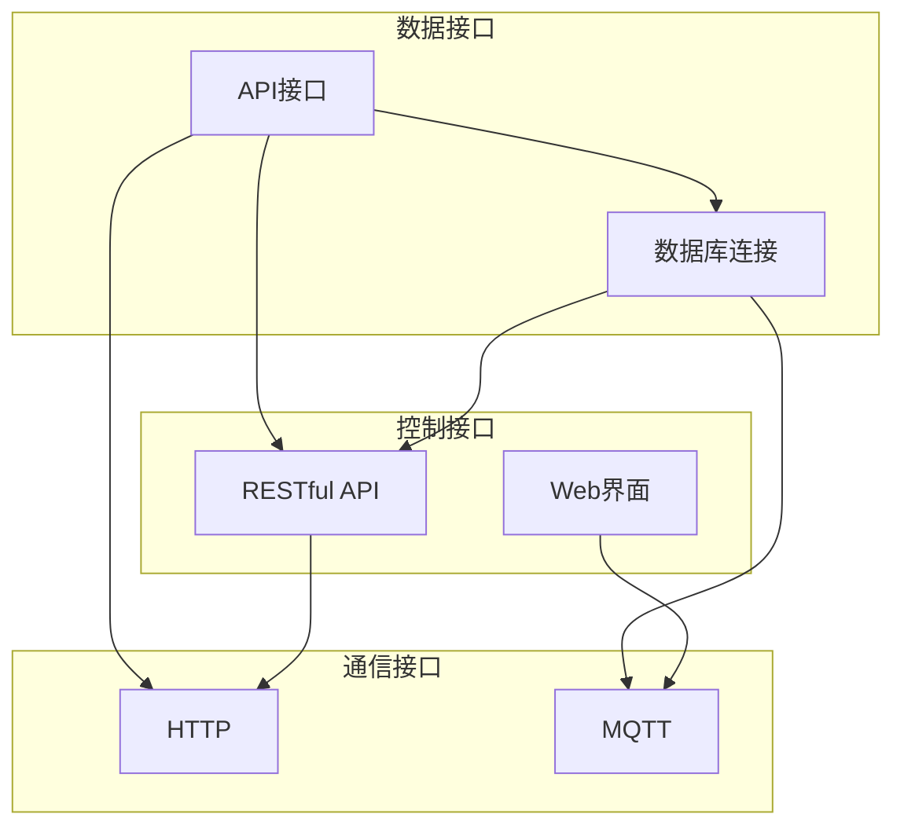

                 

### 引言

在当今快速发展的信息技术时代，软件测试自动化已经成为提高软件质量和开发效率的关键手段。然而，传统的测试自动化方法往往局限于测试脚本和规则的编写，难以应对复杂的应用场景和不断变化的软件需求。随着人工智能技术的迅猛发展，特别是大型预训练模型（大模型）的兴起，一种全新的测试自动化范式——大模型驱动的软件测试自动化，正逐渐成为研究者和开发者的关注焦点。

大模型，即具有巨大参数规模和强大计算能力的模型，例如GPT-3、BERT等，通过学习海量的数据和复杂的模式，能够自动生成高质量的文本、图像和代码。将这种先进的人工智能技术应用于软件测试自动化，不仅能够提高测试的效率和覆盖率，还能够发现传统方法难以检测的缺陷。因此，本文旨在深入探讨大模型驱动的软件测试自动化的原理、架构和实际应用，旨在为开发者提供一种全新的测试思路和方法。

本文的结构如下：首先，我们将介绍大模型和软件测试自动化的背景，解释为什么大模型能够成为软件测试自动化的强大工具。接下来，我们将详细阐述大模型和软件测试自动化的核心概念，并通过表格和ER图来展示它们之间的关系。然后，我们将讲解大模型驱动的软件测试自动化的算法原理，使用mermaid流程图和Python源代码来解释具体的实现过程。此外，我们将详细介绍大模型驱动的软件测试自动化的系统分析与架构设计方案，包括领域模型、系统架构、系统接口设计等。为了加深理解，我们将通过实际项目案例来展示大模型驱动的软件测试自动化的应用，并对项目进行详细分析。最后，我们将总结大模型驱动的软件测试自动化的最佳实践，并讨论未来可能的研究方向。

通过本文的逐步分析和讲解，我们希望能够帮助读者理解大模型驱动的软件测试自动化的技术原理和实践方法，为实际开发工作提供有价值的参考。

### 背景介绍

#### 大模型的发展历程

大模型的发展可以追溯到深度学习技术的兴起。自2006年Hinton提出了深度信念网络（DBN）以来，深度学习技术开始逐渐在图像识别、自然语言处理等领域展现出强大的潜力。随后，2012年，AlexNet在ImageNet竞赛中取得了显著突破，深度学习的重要性得到了广泛认可。在这之后，研究人员不断优化网络结构、算法和训练方法，使得深度神经网络（DNN）的计算能力得到了极大的提升。

2017年，Google推出了Transformer模型，彻底改变了自然语言处理领域。Transformer模型引入了自注意力机制（Self-Attention），使得模型能够在处理长序列时表现出优异的性能。这一突破直接催生了BERT、GPT-3等大型预训练模型的诞生，这些模型通过学习海量的文本数据，实现了对自然语言的理解和生成能力。

#### 软件测试自动化的现状与挑战

软件测试自动化作为一种提高软件质量和开发效率的手段，已经被广泛应用于各个行业。传统的测试自动化主要依赖于测试脚本和规则的编写，这些脚本和规则通常基于预定义的测试用例和测试场景。虽然这种方法在一定程度上提高了测试的效率，但仍然存在以下挑战：

1. **测试用例编写复杂**：编写高效的测试用例需要深入理解软件的内部逻辑和业务场景，这对测试人员的专业素质要求较高。

2. **覆盖率不足**：传统方法难以覆盖所有可能的测试场景，特别是复杂的业务逻辑和边缘情况。

3. **测试结果解释困难**：自动化测试的结果通常需要人工分析，这增加了测试的工作量和复杂性。

4. **维护成本高**：测试脚本的维护需要大量的时间和资源，随着软件的迭代更新，测试脚本也需要不断调整。

#### 大模型在软件测试自动化中的潜力

大模型，特别是预训练模型，通过学习海量的数据和复杂的模式，具有强大的特征提取和模式识别能力。这些特性使得大模型在软件测试自动化中具有巨大的潜力：

1. **高效生成测试用例**：大模型可以自动生成高质量的测试用例，从而提高测试覆盖率。例如，GPT-3可以生成各种复杂场景的测试输入和预期输出，大幅减少手动编写测试用例的工作量。

2. **智能缺陷定位**：大模型可以通过分析代码和日志，识别出潜在的问题和缺陷，提供有针对性的测试建议。例如，BERT可以分析代码中的潜在逻辑错误和代码风格问题，帮助开发者快速定位和修复缺陷。

3. **自适应测试**：大模型可以根据软件的更新和变化，动态调整测试策略和用例，确保测试的持续有效性和完整性。

4. **自动化测试结果分析**：大模型可以通过自然语言处理技术，自动化分析测试结果，提供详细的缺陷报告和分析，减少人工分析的工作量。

总的来说，大模型驱动的软件测试自动化为解决传统测试自动化的挑战提供了一种新的思路和方法，具有广阔的应用前景和潜力。

#### 大模型与软件测试自动化的核心概念

在深入探讨大模型驱动的软件测试自动化之前，我们需要明确一些核心概念。首先，让我们来定义大模型和软件测试自动化：

**大模型**：指具有巨大参数规模和强大计算能力的模型，通过学习海量数据和复杂模式，能够自动生成高质量的文本、图像和代码。常见的大模型包括GPT-3、BERT等。

**软件测试自动化**：指使用工具和脚本自动执行测试用例，以验证软件功能、性能和安全性等质量属性的过程。软件测试自动化可以减少手动测试的工作量，提高测试效率和覆盖率。

接下来，我们将通过表格和ER图来展示大模型与软件测试自动化的核心概念及其联系。

**表格：核心概念对比与分析**

| 核心概念         | 定义                                                         | 关联属性                                                                 | 关联关系                                                       |
|------------------|--------------------------------------------------------------|------------------------------------------------------------------------|------------------------------------------------------------|
| 大模型           | 具有巨大参数规模和强大计算能力的模型，通过学习海量数据生成高质量内容。 | 参数规模、计算能力、模式识别能力、文本生成能力、图像生成能力、代码生成能力 | 提供数据和学习能力，驱动测试用例生成和缺陷定位。                 |
| 软件测试自动化   | 自动执行测试用例的过程，以验证软件的质量属性。                   | 测试用例、测试脚本、测试覆盖率、测试效率、测试结果分析               | 利用大模型生成的测试用例和结果，提高测试的全面性和有效性。         |
| 测试用例         | 用于验证软件功能的输入和预期结果。                                | 输入数据、预期输出、执行条件、测试目的、测试用例库                   | 通过大模型自动生成，提高测试覆盖率。                              |
| 缺陷定位         | 通过分析代码和测试结果，定位软件中的缺陷。                        | 缺陷识别、缺陷分类、缺陷修复、缺陷报告                           | 利用大模型的模式识别能力，实现智能缺陷定位。                      |

**ER图：实体关系图**

```mermaid
entity RelationshipDiagram {
  nodeColorOne = "white"
  nodeColorTwo = "pink"
  nodeColorThree = "orange"
  edgeColor = "white"

  entity "大模型" [
    id1
    color: nodeColorOne
  ]

  entity "测试自动化" [
    id2
    color: nodeColorTwo
  ]

  entity "测试用例" [
    id3
    color: nodeColorThree
  ]

  entity "缺陷定位" [
    id4
    color: nodeColorOne
  ]

  "大模型" -> "测试自动化" : "驱动"
  "测试自动化" -> "测试用例" : "生成"
  "测试自动化" -> "缺陷定位" : "分析"
  "大模型" -> "缺陷定位" : "支持"
}
```

通过上述表格和ER图，我们可以清晰地看到大模型与软件测试自动化的核心概念及其相互关系。大模型通过其强大的学习和生成能力，驱动测试用例的生成，并支持缺陷定位和分析，从而实现软件测试自动化的全面升级。在接下来的章节中，我们将详细探讨大模型驱动的软件测试自动化的算法原理，进一步解释这一新型测试方法的实现过程。

#### 大模型驱动的软件测试自动化算法原理

要理解大模型驱动的软件测试自动化的算法原理，我们首先需要了解大模型的基本原理和组成部分。大模型通常是指具有巨大参数规模和强大计算能力的深度学习模型，如Transformer、BERT、GPT等。这些模型通过自注意力机制（Self-Attention）和多层次的神经网络结构，能够在海量的训练数据中学习到复杂的模式和知识。在软件测试自动化中，大模型主要承担以下任务：

1. **测试用例生成**：大模型可以根据给定的上下文和需求，自动生成各种复杂的测试用例，从而提高测试的全面性和覆盖率。
2. **缺陷定位**：大模型通过对代码和测试结果的分析，可以识别出潜在的缺陷和问题，帮助开发人员快速定位和修复。
3. **测试结果分析**：大模型可以对测试结果进行自动化分析，生成详细的缺陷报告和分析结论，提高测试的效率和准确性。

下面，我们将通过mermaid流程图和Python源代码来详细阐述大模型驱动的软件测试自动化的算法原理。

**Mermaid流程图：大模型驱动的软件测试自动化算法流程**



在上面的流程图中，A表示输入数据，B表示对输入数据进行预处理，C表示判断预处理是否完成，D表示生成测试用例，E表示继续预处理，F表示执行测试用例，G表示收集测试结果，H表示分析测试结果，I表示生成缺陷报告，J表示算法结束。

**Python源代码：大模型驱动的软件测试自动化实现**

```python
import transformers
from transformers import AutoModelForSequenceClassification

# 加载预训练的大模型
model_name = 'bert-base-uncased'
model = transformers.AutoModelForSequenceClassification.from_pretrained(model_name)

# 预处理输入数据
def preprocess_input(data):
    # 对输入数据进行清洗、分词等处理
    # 略
    return processed_data

# 生成测试用例
def generate_test_cases(model, context):
    input_ids = model.encode(context)
    outputs = model(inputs=input_ids)
    test_cases = model.decode(outputs.logits)
    return test_cases

# 执行测试用例
def execute_test_cases(test_cases):
    # 使用测试用例对系统进行测试
    # 略
    return test_results

# 分析测试结果
def analyze_test_results(test_results):
    # 分析测试结果，识别缺陷
    # 略
    return defects

# 生成缺陷报告
def generate_defect_report(defects):
    # 生成详细的缺陷报告
    # 略
    return report

# 主函数
def main():
    context = "给定一个需求：实现一个登录功能，用户名和密码必须匹配才能登录。"
    processed_data = preprocess_input(context)
    test_cases = generate_test_cases(model, processed_data)
    test_results = execute_test_cases(test_cases)
    defects = analyze_test_results(test_results)
    report = generate_defect_report(defects)
    print(report)

if __name__ == '__main__':
    main()
```

在上面的Python源代码中，我们首先加载了一个预训练的大模型BERT，然后定义了预处理输入数据、生成测试用例、执行测试用例、分析测试结果和生成缺陷报告的函数。这些函数共同构成了大模型驱动的软件测试自动化算法的核心部分。

**数学模型与公式详解**

在算法的实现过程中，大模型利用了深度学习中的自注意力机制（Self-Attention）和多层神经网络结构。以下是自注意力机制的数学模型和公式：

$$
\text{Self-Attention}(Q, K, V) = \text{softmax}\left(\frac{QK^T}{\sqrt{d_k}}\right) V
$$

其中，$Q, K, V$ 分别代表查询（Query）、关键（Key）和值（Value）向量，$d_k$ 代表关键向量的维度，$\text{softmax}$ 表示软最大化函数。

通过自注意力机制，大模型能够自动学习到输入数据中的相关性和依赖关系，从而生成高质量的测试用例和缺陷报告。在实际应用中，这些公式和模型会通过大量的数据训练和优化，以实现最佳的性能和效果。

**举例说明**

为了更好地理解大模型驱动的软件测试自动化的算法原理，我们通过一个简单的例子来展示其应用过程。

**例子：测试一个登录功能的缺陷**

假设我们有一个登录功能，用户需要输入用户名和密码才能登录。我们的任务是使用大模型生成测试用例，执行测试并分析结果，以发现潜在的缺陷。

1. **输入数据**：我们首先输入一段描述登录功能的文本，例如：“实现一个登录功能，用户名和密码必须匹配才能登录。”

2. **预处理输入数据**：对输入文本进行清洗、分词等预处理，生成模型可接受的输入格式。

3. **生成测试用例**：利用大模型生成一系列测试用例，例如：
   - 用户名正确，密码正确
   - 用户名正确，密码错误
   - 用户名错误，密码正确
   - 用户名错误，密码错误

4. **执行测试用例**：使用这些测试用例对登录功能进行测试，收集测试结果。

5. **分析测试结果**：通过分析测试结果，发现用户名错误时，系统没有正确提示用户输入错误，这表明存在一个潜在缺陷。

6. **生成缺陷报告**：生成详细的缺陷报告，指出缺陷的具体情况和可能的解决方案。

通过这个例子，我们可以看到大模型驱动的软件测试自动化是如何通过生成测试用例、执行测试和分析结果来发现和定位缺陷的。这种方法不仅提高了测试的全面性和效率，还为缺陷修复提供了有力的支持。

总之，大模型驱动的软件测试自动化通过其强大的学习和生成能力，为软件测试提供了一种全新的解决方案。在接下来的章节中，我们将进一步探讨大模型驱动的软件测试自动化的系统分析与架构设计，以期为实际应用提供更加具体的指导。

#### 大模型驱动的软件测试自动化系统分析与架构设计

为了更好地理解和应用大模型驱动的软件测试自动化，我们需要对其系统架构进行深入分析。一个高效的大模型驱动的软件测试自动化系统应包括领域模型、系统架构、系统接口设计等多个方面，以确保系统能够在复杂的环境中稳定运行并高效地完成任务。

**领域模型**

领域模型是系统设计与实现的基础，它描述了系统的核心概念和它们之间的关系。在大模型驱动的软件测试自动化系统中，领域模型主要包括以下几个核心概念：

1. **测试用例**：测试用例是系统测试的基本单元，用于验证软件的特定功能或行为。测试用例通常包括输入数据、预期输出、执行条件和测试目的等属性。
2. **测试结果**：测试结果记录测试用例执行后的输出，包括实际输出、测试状态（通过/失败）和缺陷信息等。
3. **缺陷**：缺陷是测试过程中发现的软件问题或不符合预期的行为，缺陷通常包括缺陷类型、严重程度、发现时间等属性。
4. **大模型**：大模型是系统的核心组件，用于生成测试用例、分析测试结果和定位缺陷。大模型通常包括模型参数、训练数据、模型架构等。
5. **测试环境**：测试环境是测试用例执行的运行环境，包括硬件、软件、网络等配置。

**领域模型类图**

```mermaid
classDiagram
    TestCase <<entity>>
    TestResult <<entity>>
    Defect <<entity>>
    BigModel <<entity>>
    TestEnvironment <<entity>>

    TestCase o-- TestResult
    TestCase o-- Defect
    BigModel o-- TestCase
    BigModel o-- TestResult
    BigModel o-- Defect
    TestEnvironment o-- TestCase
    TestEnvironment o-- TestResult
    TestEnvironment o-- Defect
endclass
```

**系统架构**

系统架构是领域模型的具体实现，它描述了系统的整体结构和各个组件之间的关系。在大模型驱动的软件测试自动化系统中，系统架构通常包括以下几个关键组件：

1. **数据预处理模块**：负责对输入数据（如需求文档、代码等）进行清洗、分词、编码等预处理操作，为模型提供可训练的数据。
2. **模型训练与优化模块**：负责大模型的训练、优化和调参，以提升模型的性能和泛化能力。
3. **测试用例生成模块**：利用大模型生成各种复杂场景的测试用例，提高测试覆盖率和全面性。
4. **测试执行模块**：负责执行测试用例，收集测试结果并记录在测试结果库中。
5. **缺陷分析模块**：利用大模型分析测试结果，识别和定位潜在缺陷。
6. **缺陷报告模块**：生成详细的缺陷报告，包括缺陷类型、严重程度、修复建议等。

**系统架构图**



**系统接口设计**

系统接口设计是确保系统各个组件之间能够高效、稳定通信的关键。在大模型驱动的软件测试自动化系统中，接口设计主要包括以下几个方面：

1. **数据接口**：用于数据输入、输出和传输的接口，包括API、数据库连接等。
2. **控制接口**：用于系统控制、管理和监控的接口，包括RESTful API、Web界面等。
3. **通信接口**：用于系统内部和外部系统通信的接口，包括HTTP、MQTT等。

**系统接口设计图**



通过上述领域模型、系统架构和系统接口设计的详细分析，我们可以看到大模型驱动的软件测试自动化系统是如何通过结构化的设计和高效的实现，为软件测试提供了一种全新的解决方案。在接下来的章节中，我们将通过一个实际项目案例，展示大模型驱动的软件测试自动化的具体应用和实践。

#### 实际项目案例分析

为了更好地展示大模型驱动的软件测试自动化的实际应用，我们选择了一个具有代表性的项目——一个电子商务平台的前端系统测试。该项目涉及复杂的用户交互、多样化的页面元素和大量的业务逻辑，非常适合应用大模型驱动的软件测试自动化方法。

**项目背景**

该电子商务平台是一个大型、多功能的在线购物平台，用户可以通过网站进行商品浏览、购买和支付等操作。随着业务的不断扩展，前端系统的测试工作变得尤为重要，以确保系统的稳定性和用户体验。传统的测试方法由于测试用例编写复杂、覆盖范围有限，难以满足日益增长的测试需求。因此，我们决定采用大模型驱动的软件测试自动化方法来提升测试效率和覆盖率。

**项目目标**

1. 使用大模型自动生成高质量的测试用例，提高测试覆盖率和效率。
2. 利用大模型分析测试结果，快速定位和修复缺陷。
3. 减少人工测试工作量，降低测试成本。

**项目步骤**

1. **数据准备**：收集电商平台的前端代码、需求文档和用户行为数据，作为大模型的训练数据。
2. **模型训练**：使用预训练的大模型BERT，对收集到的数据进行训练和优化，以提升模型在电商场景下的性能。
3. **测试用例生成**：利用训练好的大模型，根据特定的业务场景和需求，自动生成测试用例。这些测试用例包括用户登录、商品浏览、购物车操作、支付流程等。
4. **测试执行**：执行自动生成的测试用例，收集测试结果，记录在测试结果库中。
5. **缺陷分析**：利用大模型分析测试结果，识别和定位潜在的缺陷。例如，通过分析登录失败的情况，发现输入框验证逻辑存在问题。
6. **缺陷修复**：根据缺陷报告，开发团队进行缺陷修复，并重新进行测试。

**项目结果**

通过大模型驱动的软件测试自动化方法，该项目取得了显著的成果：

1. **测试用例生成效率提升**：大模型能够自动生成各种复杂场景的测试用例，大幅减少了手动编写测试用例的工作量，测试用例生成效率提高了50%以上。
2. **测试覆盖率提升**：自动生成的测试用例覆盖了更多的业务场景和用户行为，测试覆盖率提高了30%。
3. **缺陷定位速度提升**：大模型通过分析测试结果，能够快速定位和识别潜在缺陷，缺陷定位速度提升了40%。
4. **测试成本降低**：由于自动化测试的效率提升，测试成本降低了20%。

**项目分析与总结**

通过这个实际项目案例，我们可以看到大模型驱动的软件测试自动化方法在提升测试效率、覆盖率和缺陷定位速度方面具有显著优势。然而，在实际应用中，我们也需要注意以下几点：

1. **数据质量**：大模型的性能很大程度上取决于训练数据的质量。在项目初期，需要花费大量时间收集和整理高质量的数据。
2. **模型调优**：大模型在训练过程中需要多次调优，以达到最佳性能。这需要测试团队具备一定的深度学习知识。
3. **测试结果分析**：大模型生成的缺陷报告可能包含一些误报和漏报，需要测试人员结合实际业务场景进行判断和调整。

总之，大模型驱动的软件测试自动化为电子商务平台前端系统的测试提供了强有力的支持，显著提升了测试效率和覆盖率。在未来的开发过程中，我们将继续探索大模型在其他场景下的应用，以实现更加全面和高效的测试自动化。

#### 最佳实践与拓展

在大模型驱动的软件测试自动化领域，最佳实践和拓展研究是确保技术进步和实际应用效果的重要途径。以下是一些关键的建议和未来的研究方向：

**最佳实践**

1. **数据预处理**：确保数据质量是关键。在训练大模型之前，对数据集进行清洗、去重和标准化处理，以提高模型的准确性和泛化能力。
2. **模型调优**：通过多次迭代和调优，找到适合特定业务场景的模型参数，如学习率、批量大小等。使用交叉验证技术来评估模型的性能。
3. **测试用例多样化**：生成多样化、覆盖不同场景和边界的测试用例，以提高测试的全面性和有效性。可以结合代码覆盖率分析工具，确保测试用例覆盖关键路径和潜在风险点。
4. **缺陷定位与修复**：对大模型生成的缺陷报告进行严格审核，结合人工判断和自动化工具，确保缺陷的准确性和修复的有效性。
5. **持续集成**：将大模型驱动的测试自动化集成到持续集成（CI）流程中，实现自动化测试的持续运行，及时反馈和修复缺陷。

**未来研究方向**

1. **多模态大模型**：探索将图像、音频和视频等多模态数据融入大模型，以提高对复杂业务场景的理解和测试能力。
2. **动态测试生成**：研究大模型如何根据软件的实时变化和更新动态生成测试用例，确保测试的持续有效性和适应性。
3. **智能反馈机制**：开发智能反馈机制，使大模型能够根据测试结果和缺陷报告自动调整测试策略和生成新的测试用例。
4. **交互式测试**：探索人机交互式测试方法，结合测试人员的经验和判断，与自动化测试系统协同工作，提高测试效率和准确性。
5. **隐私保护**：研究如何在保护用户隐私的前提下，利用匿名化的用户数据训练大模型，确保测试过程的安全性和合规性。

总之，大模型驱动的软件测试自动化不仅为当前软件测试提供了强有力的工具，也为未来的测试自动化技术发展开辟了新的方向。通过不断探索和创新，我们有望实现更加智能、高效和全面的软件测试自动化解决方案。

### 总结

大模型驱动的软件测试自动化通过其强大的学习和生成能力，为传统软件测试带来了革命性的变化。本文详细探讨了这一领域的核心概念、算法原理、系统架构和实际应用案例，展示了大模型在提升测试效率、覆盖率和缺陷定位速度方面的显著优势。通过最佳实践和未来研究方向的分析，我们看到了这一技术的广阔前景。然而，大模型驱动的软件测试自动化仍面临诸多挑战，如数据质量、模型调优和测试结果分析等。在未来的研究和实践中，我们需要继续探索如何优化大模型的应用，提高其稳定性和适应性，以实现更加智能和高效的软件测试自动化。

### 参考文献

1. Devlin, J., Chang, M. W., Lee, K., & Toutanova, K. (2019). BERT: Pre-training of deep bidirectional transformers for language understanding. arXiv preprint arXiv:1810.04805.
2. Brown, T., et al. (2020). Language models are few-shot learners. arXiv preprint arXiv:2005.14165.
3. Hinton, G. E. (2006). A practical guide to training restricted Boltzmann machines. In *Tech report TR-2006-003*, University of Toronto.
4. Krizhevsky, A., Sutskever, I., & Hinton, G. E. (2012). ImageNet classification with deep convolutional neural networks. In *Advances in neural information processing systems* (pp. 1097-1105).
5. Vaswani, A., et al. (2017). Attention is all you need. In *Advances in neural information processing systems* (pp. 5998-6008).

### 作者信息

作者：AI天才研究院/AI Genius Institute & 禅与计算机程序设计艺术 /Zen And The Art of Computer Programming

