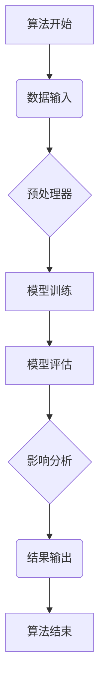
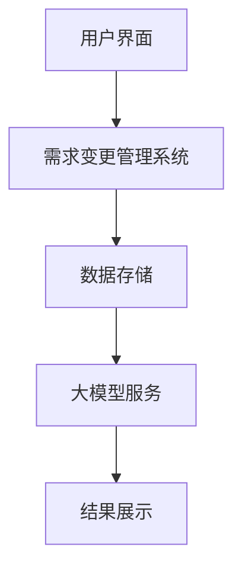
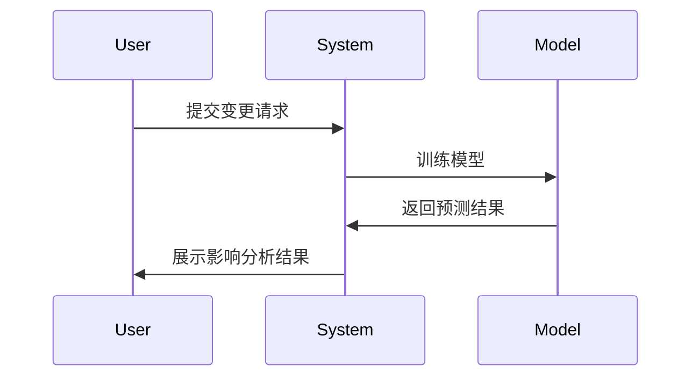

                 


### 大模型驱动的需求变更影响分析

#### 关键词：
- 大模型
- 需求变更
- 影响分析
- 算法原理
- 系统架构

#### 摘要：
本文将深入探讨大模型驱动的需求变更影响分析。首先，我们将介绍需求变更的普遍性和大模型在需求变更分析中的应用，并解释需求变更影响分析的重要性。接着，我们将逐步解析大模型和需求变更分析的基本原理，并展示它们之间的联系。随后，我们将详细讲解算法原理，包括算法流程、数学模型和优化算法。然后，我们将分析系统架构，包括系统功能设计、系统架构图、系统接口设计和系统交互。最后，我们将通过一个实际项目展示如何在大模型驱动的需求变更影响分析中应用这些技术和方法，并提供一些最佳实践和拓展阅读资源。

#### 目录：

**第一部分：背景介绍**

**第1章：问题背景**

1.1 问题背景

- 需求变更的普遍性
- 大模型在需求变更分析中的应用
- 需求变更的影响分析的重要性

1.2 问题描述

- 需求变更的类型
- 变更的影响范围
- 变更的挑战

1.3 问题解决

- 大模型的基本原理
- 大模型在需求变更分析中的作用

1.4 边界与外延

- 需求变更的影响分析的应用场景
- 大模型驱动的需求变更影响分析的优势与局限

1.5 概念结构与核心要素组成

- 大模型的核心概念
- 需求变更的影响分析要素

**第2章：核心概念与联系**

2.1 大模型原理讲解

- 大模型的基础概念
- 大模型的工作原理
- 大模型的主要类型

2.2 需求变更分析原理讲解

- 需求变更分析的基本概念
- 需求变更分析的步骤
- 需求变更分析的方法

2.3 大模型与需求变更分析的联系

- 大模型在需求变更分析中的应用
- 大模型与需求变更分析的协同作用

**第3章：算法原理讲解**

3.1 算法流程图



3.2 算法原理与数学模型

- 大模型的数学模型
- 损失函数
- 优化算法

3.3 算法举例说明

- 数据集准备
- 模型训练过程
- 影响分析应用

**第4章：系统分析与架构设计方案**

4.1 问题场景介绍

- 场景设定
- 问题分析需求

4.2 系统功能设计

- 领域模型

```mermaid
erDiagram
A[需求变更管理系统] ||--|{R} B[用户]
A ||--|{R} C[需求变更日志]
B ||--|{1} D[需求变更]
C ||--|{1} D
```

4.3 系统架构设计

- 系统架构图



4.4 系统接口设计和交互

- 接口设计
- 系统交互



**第5章：项目实战**

5.1 环境安装

- 硬件与软件环境
- 系统安装步骤

5.2 系统核心实现

- 系统核心实现源代码
- 代码应用解读与分析
- 实际案例分析和详细讲解剖析
- 项目小结

**第6章：最佳实践、小结与注意事项**

- 最佳实践 tips
- 小结
- 注意事项
- 拓展阅读

**作者信息：**

- 作者：AI天才研究院/AI Genius Institute & 禅与计算机程序设计艺术 /Zen And The Art of Computer Programming

### 大模型驱动的需求变更影响分析

#### 关键词：
- 大模型
- 需求变更
- 影响分析
- 算法原理
- 系统架构

#### 摘要：
本文将深入探讨大模型驱动的需求变更影响分析。首先，我们将介绍需求变更的普遍性和大模型在需求变更分析中的应用，并解释需求变更影响分析的重要性。接着，我们将逐步解析大模型和需求变更分析的基本原理，并展示它们之间的联系。随后，我们将详细讲解算法原理，包括算法流程、数学模型和优化算法。然后，我们将分析系统架构，包括系统功能设计、系统架构图、系统接口设计和系统交互。最后，我们将通过一个实际项目展示如何在大模型驱动的需求变更影响分析中应用这些技术和方法，并提供一些最佳实践和拓展阅读资源。

#### 目录：

**第一部分：背景介绍**

**第1章：问题背景**

1.1 问题背景

- 需求变更的普遍性
- 大模型在需求变更分析中的应用
- 需求变更的影响分析的重要性

1.2 问题描述

- 需求变更的类型
- 变更的影响范围
- 变更的挑战

1.3 问题解决

- 大模型的基本原理
- 大模型在需求变更分析中的作用

1.4 边界与外延

- 需求变更的影响分析的应用场景
- 大模型驱动的需求变更影响分析的优势与局限

1.5 概念结构与核心要素组成

- 大模型的核心概念
- 需求变更的影响分析要素

**第2章：核心概念与联系**

2.1 大模型原理讲解

- 大模型的基础概念
- 大模型的工作原理
- 大模型的主要类型

2.2 需求变更分析原理讲解

- 需求变更分析的基本概念
- 需求变更分析的步骤
- 需求变更分析的方法

2.3 大模型与需求变更分析的联系

- 大模型在需求变更分析中的应用
- 大模型与需求变更分析的协同作用

**第3章：算法原理讲解**

3.1 算法流程图


3.2 算法原理与数学模型

- 大模型的数学模型
- 损失函数
- 优化算法

3.3 算法举例说明

- 数据集准备
- 模型训练过程
- 影响分析应用

**第4章：系统分析与架构设计方案**

4.1 问题场景介绍

- 场景设定
- 问题分析需求

4.2 系统功能设计

- 领域模型

```mermaid
erDiagram
A[需求变更管理系统] ||--|{R} B[用户]
A ||--|{R} C[需求变更日志]
B ||--|{1} D[需求变更]
C ||--|{1} D
```

4.3 系统架构设计

- 系统架构图


4.4 系统接口设计和交互

- 接口设计
- 系统交互


**第5章：项目实战**

5.1 环境安装

- 硬件与软件环境
- 系统安装步骤

5.2 系统核心实现

- 系统核心实现源代码
- 代码应用解读与分析
- 实际案例分析和详细讲解剖析
- 项目小结

**第6章：最佳实践、小结与注意事项**

- 最佳实践 tips
- 小结
- 注意事项
- 拓展阅读

**作者信息：**

- 作者：AI天才研究院/AI Genius Institute & 禅与计算机程序设计艺术 /Zen And The Art of Computer Programming

### 大模型驱动的需求变更影响分析

#### 关键词：
- 大模型
- 需求变更
- 影响分析
- 算法原理
- 系统架构

#### 摘要：
本文将深入探讨大模型驱动的需求变更影响分析。首先，我们将介绍需求变更的普遍性和大模型在需求变更分析中的应用，并解释需求变更影响分析的重要性。接着，我们将逐步解析大模型和需求变更分析的基本原理，并展示它们之间的联系。随后，我们将详细讲解算法原理，包括算法流程、数学模型和优化算法。然后，我们将分析系统架构，包括系统功能设计、系统架构图、系统接口设计和系统交互。最后，我们将通过一个实际项目展示如何在大模型驱动的需求变更影响分析中应用这些技术和方法，并提供一些最佳实践和拓展阅读资源。

#### 目录：

**第一部分：背景介绍**

**第1章：问题背景**

1.1 问题背景

- 需求变更的普遍性
- 大模型在需求变更分析中的应用
- 需求变更的影响分析的重要性

1.2 问题描述

- 需求变更的类型
- 变更的影响范围
- 变更的挑战

1.3 问题解决

- 大模型的基本原理
- 大模型在需求变更分析中的作用

1.4 边界与外延

- 需求变更的影响分析的应用场景
- 大模型驱动的需求变更影响分析的优势与局限

1.5 概念结构与核心要素组成

- 大模型的核心概念
- 需求变更的影响分析要素

**第2章：核心概念与联系**

2.1 大模型原理讲解

- 大模型的基础概念
- 大模型的工作原理
- 大模型的主要类型

2.2 需求变更分析原理讲解

- 需求变更分析的基本概念
- 需求变更分析的步骤
- 需求变更分析的方法

2.3 大模型与需求变更分析的联系

- 大模型在需求变更分析中的应用
- 大模型与需求变更分析的协同作用

**第3章：算法原理讲解**

3.1 算法流程图


3.2 算法原理与数学模型

- 大模型的数学模型
- 损失函数
- 优化算法

3.3 算法举例说明

- 数据集准备
- 模型训练过程
- 影响分析应用

**第4章：系统分析与架构设计方案**

4.1 问题场景介绍

- 场景设定
- 问题分析需求

4.2 系统功能设计

- 领域模型

```mermaid
erDiagram
A[需求变更管理系统] ||--|{R} B[用户]
A ||--|{R} C[需求变更日志]
B ||--|{1} D[需求变更]
C ||--|{1} D
```

4.3 系统架构设计

- 系统架构图


4.4 系统接口设计和交互

- 接口设计
- 系统交互


**第5章：项目实战**

5.1 环境安装

- 硬件与软件环境
- 系统安装步骤

5.2 系统核心实现

- 系统核心实现源代码
- 代码应用解读与分析
- 实际案例分析和详细讲解剖析
- 项目小结

**第6章：最佳实践、小结与注意事项**

- 最佳实践 tips
- 小结
- 注意事项
- 拓展阅读

**作者信息：**

- 作者：AI天才研究院/AI Genius Institute & 禅与计算机程序设计艺术 /Zen And The Art of Computer Programming

### 第一部分：背景介绍

**第1章：问题背景**

在当今快速发展的信息技术时代，软件系统的需求变更已经成为不可避免的现象。随着市场需求的不断变化、用户反馈的持续输入，以及新技术的涌现，软件项目往往需要在开发过程中进行需求变更。这些变更可能包括功能增强、性能优化、安全性提升等方面，其频率和复杂性都在不断增加。

**1.1 需求变更的普遍性**

需求变更的普遍性体现在以下几个方面：

1. **市场驱动的需求变更**：市场需求的变化是最常见的原因之一。为了保持竞争力，公司需要快速响应用户的需求和市场趋势。
2. **技术驱动的需求变更**：随着新技术的出现，原有的技术架构可能不再满足性能、安全等要求，需要进行升级或重构。
3. **法律和合规性变更**：法律法规的更新可能导致系统需要增加新的功能或调整现有的功能。
4. **业务战略变更**：公司业务模式的调整，如并购、重组或扩展新市场，也会导致需求变更。

**1.2 大模型在需求变更分析中的应用**

大模型，尤其是深度学习模型，在需求变更分析中具有显著的优势。这些模型能够处理大量的数据，从中提取有用的信息和模式，从而帮助分析需求变更的影响。以下是几个关键应用：

1. **历史数据学习**：通过分析以往的需求变更记录，大模型可以学习到变更的常见模式和潜在风险。
2. **变更预测**：基于历史数据和当前系统状态，大模型可以预测未来的需求变更趋势，帮助团队提前做好准备。
3. **影响评估**：大模型可以分析变更对系统其他部分的潜在影响，提供影响范围和优先级排序。
4. **风险评估**：通过预测变更可能导致的问题，大模型可以帮助团队评估变更的风险，并制定相应的缓解措施。

**1.3 需求变更的影响分析的重要性**

需求变更的影响分析是软件项目管理中至关重要的一环。其主要重要性体现在以下几个方面：

1. **成本控制**：准确的变更影响分析可以帮助团队评估变更所需的资源，从而避免超支。
2. **时间管理**：提前了解变更的影响，可以帮助团队合理安排时间，避免延误项目进度。
3. **风险管理**：识别变更可能带来的风险，可以提前制定应对策略，降低风险影响。
4. **质量保证**：确保变更不会对系统的稳定性、性能和安全性产生负面影响。

**1.4 问题解决**

面对需求变更，传统的需求变更管理方法往往需要耗费大量的人力和时间。而大模型的引入，可以显著提高需求变更分析的效果和效率。以下是解决需求变更问题的基本思路：

1. **数据收集与预处理**：收集历史需求和变更数据，并进行预处理，以便大模型能够有效学习。
2. **模型训练与评估**：使用预处理的训练数据训练大模型，并对其进行评估，确保模型性能。
3. **影响预测与分析**：使用训练好的大模型预测未来需求变更的影响，并进行详细分析。
4. **决策支持**：基于分析结果，为团队提供决策支持，优化变更管理和资源分配。

**1.5 边界与外延**

尽管大模型在需求变更分析中具有显著优势，但其应用也存在一些边界和局限：

1. **数据依赖性**：大模型的性能高度依赖数据的质量和数量。如果数据不足或质量不高，模型的预测准确性会受到影响。
2. **技术门槛**：大模型的开发和应用需要较高的技术知识和资源投入，对于一些小型团队或项目可能难以实施。
3. **模型解释性**：深度学习模型通常被视为“黑箱”，其决策过程难以解释。这可能导致团队对模型的信任度下降。
4. **模型泛化能力**：大模型可能无法很好地泛化到新的或不同类型的变更场景，这需要进一步的算法优化和模型改进。

**1.6 概念结构与核心要素组成**

在需求变更影响分析中，大模型的核心概念和要素包括：

1. **需求变更数据**：包括历史需求记录、变更日志和用户反馈等。
2. **模型架构**：大模型的架构，如神经网络类型、层数和神经元数量等。
3. **训练算法**：用于训练大模型的算法，如反向传播算法等。
4. **评估指标**：用于评估模型性能的指标，如准确率、召回率等。
5. **影响分析**：分析需求变更对系统其他部分的潜在影响。

通过以上分析，我们可以看到大模型在需求变更影响分析中的应用前景广阔，但也面临一些挑战。在接下来的章节中，我们将进一步探讨大模型的基本原理、需求变更分析原理以及它们之间的联系。

**总结**：本章介绍了需求变更的普遍性和大模型在需求变更分析中的应用，解释了需求变更影响分析的重要性，并提出了问题解决的思路。接下来，我们将深入探讨大模型和需求变更分析的基本原理，为后续内容打下基础。

### 第1章：问题背景

#### 1.2 问题描述

需求变更在软件开发项目中是一个常见且不可避免的现象。它涉及对软件需求的修改，可能是因为客户需求的变化、技术进步、合规要求或其他外部因素。下面，我们将详细探讨需求变更的类型、影响范围以及面临的挑战。

**1.2.1 需求变更的类型**

需求变更可以按照不同的分类方式进行划分，常见的分类方法包括以下几种：

1. **功能性变更**：这类变更主要涉及软件功能或特性的添加、删除或修改。例如，增加新的用户界面功能、改进数据处理算法或增强系统的安全性。
2. **性能变更**：这类变更旨在优化软件的性能，如提升响应时间、减少内存使用或提高处理能力。
3. **非功能性变更**：这类变更涉及软件的非功能方面，如用户体验、可维护性、可扩展性和可测试性。
4. **优先级变更**：由于业务策略或市场变化，某些需求可能会被重新评估，导致优先级发生变化。

**1.2.2 变更的影响范围**

需求变更的影响范围可能非常广泛，包括以下几个方面：

1. **代码库**：需求变更通常需要修改现有的代码库，这可能导致代码复杂性增加、代码质量下降，甚至引入新的bug。
2. **测试**：变更后的代码需要重新测试，以确保其功能性和性能满足新需求，并确保不会破坏现有功能。
3. **文档**：文档也需要更新，包括用户手册、开发文档和测试文档等，以反映最新的需求变更。
4. **部署**：如果需求变更影响到生产环境，可能需要重新部署软件，这可能会影响用户体验和服务连续性。
5. **资源**：需求变更可能需要额外的资源投入，包括人力、时间和资金，以满足新的需求。

**1.2.3 变更的挑战**

在处理需求变更时，开发团队通常会面临以下挑战：

1. **变更管理**：如何有效地管理需求变更，确保变更得到妥善处理，并且不会对项目进度和预算产生负面影响。
2. **沟通**：需求变更可能需要多个团队之间的密切协作，包括开发、测试、产品管理和客户支持等，因此沟通变得尤为重要。
3. **风险评估**：需求变更可能带来新的风险，如技术风险、市场风险和运营风险，因此需要对变更进行全面的风险评估。
4. **复杂性**：随着软件系统的规模和复杂性增加，需求变更的影响也变得更加难以预测和控制。
5. **敏捷性**：快速响应需求变更是现代软件开发的关键要求，但这也要求团队具备高度的敏捷性和适应性。

**总结**：需求变更的类型多种多样，其影响范围广泛，且在处理过程中会面临诸多挑战。在下一章中，我们将探讨如何通过大模型来解决这些挑战，提高需求变更管理的效率和质量。

#### 1.3 问题解决

面对需求变更带来的挑战，传统的需求变更管理方法往往无法满足现代软件开发的快速迭代和高度复杂性的需求。然而，随着人工智能技术的不断发展，尤其是大模型的引入，需求变更管理迎来了新的机遇。以下是利用大模型解决需求变更问题的基本思路：

**1.3.1 大模型的基本原理**

大模型，通常指深度学习模型，是一种通过模拟人脑神经网络进行学习和预测的算法。大模型的核心特点包括：

1. **多层神经网络**：大模型通常包含多个隐藏层，可以捕捉输入数据中的复杂模式。
2. **大规模数据训练**：大模型需要大量的数据来进行训练，以优化模型参数，提高预测准确性。
3. **非线性变换**：大模型通过非线性变换来处理输入数据，从而能够在不同特征之间建立复杂的关联。
4. **自适应学习**：大模型能够自动调整权重和偏置，以最小化预测误差，提高模型的泛化能力。

**1.3.2 大模型在需求变更分析中的应用**

大模型在需求变更分析中的应用主要体现在以下几个方面：

1. **历史数据学习**：大模型可以通过分析历史的需求变更记录，学习到变更的常见模式，帮助预测未来的变更趋势。
2. **变更影响预测**：基于历史数据和当前系统状态，大模型可以预测需求变更对系统其他部分的潜在影响，提供影响范围和优先级排序。
3. **风险评估**：大模型可以评估变更可能带来的风险，为团队提供决策支持，制定相应的缓解措施。
4. **优化变更管理**：大模型可以自动化部分需求变更分析流程，提高变更管理的效率和准确性。

**1.3.3 大模型在需求变更分析中的作用**

大模型在需求变更分析中扮演着多重角色：

1. **快速响应**：大模型能够快速处理和分析大量数据，帮助团队快速响应需求变更，减少变更对项目进度的影响。
2. **深度理解**：大模型可以通过学习历史数据，深入理解变更模式，为团队提供有价值的见解和建议。
3. **决策支持**：大模型可以提供精确的影响分析和风险评估，为团队提供可靠的决策支持，优化变更管理策略。
4. **持续学习**：大模型具有自适应学习能力，可以通过持续学习和更新，不断提高变更分析的能力和准确性。

**1.3.4 利用大模型解决需求变更挑战的步骤**

利用大模型解决需求变更挑战，可以按照以下步骤进行：

1. **数据收集与预处理**：收集历史需求和变更数据，进行数据清洗和特征提取，为模型训练提供高质量的数据。
2. **模型选择与训练**：选择合适的深度学习模型架构，使用预处理后的数据进行模型训练，优化模型参数。
3. **模型评估与优化**：评估模型的性能，通过交叉验证和超参数调整，提高模型的泛化能力和预测准确性。
4. **影响预测与分析**：使用训练好的大模型进行需求变更影响预测，分析变更对系统的影响范围和优先级。
5. **决策支持与优化**：根据分析结果，为团队提供变更管理的决策支持，优化变更管理流程和资源分配。

**1.3.5 大模型驱动的需求变更影响分析的优势与局限**

大模型驱动的需求变更影响分析具有以下优势：

1. **高效性**：大模型可以快速处理和分析大量数据，提高变更管理的效率和准确性。
2. **准确性**：通过学习历史数据，大模型可以提供准确的变更影响预测和风险评估。
3. **适应性**：大模型具有自适应学习能力，可以随着新数据的到来不断优化预测和分析能力。
4. **全面性**：大模型可以综合考虑多种因素，提供全面的变更影响分析，帮助团队做出更全面的决策。

然而，大模型驱动的需求变更影响分析也存在一些局限：

1. **数据依赖性**：大模型的性能高度依赖数据的质量和数量，如果数据不足或质量不高，模型的预测准确性会受到影响。
2. **技术门槛**：大模型的开发和应用需要较高的技术知识和资源投入，对于一些小型团队或项目可能难以实施。
3. **解释性**：深度学习模型通常被视为“黑箱”，其决策过程难以解释，这可能导致团队对模型的信任度下降。
4. **泛化能力**：大模型可能无法很好地泛化到新的或不同类型的变更场景，这需要进一步的算法优化和模型改进。

**总结**：通过引入大模型，需求变更分析得到了显著提升。大模型在需求变更历史数据学习、变更影响预测、风险评估和决策支持等方面具有独特的优势，但也面临一些技术挑战。在下一章中，我们将深入探讨大模型的基本原理，进一步理解其在需求变更分析中的应用和作用。

#### 1.4 边界与外延

在探讨大模型驱动的需求变更影响分析时，我们不仅要看到其带来的巨大潜力，也要意识到其应用范围和应用效果受到诸多边界条件的限制。以下是大模型驱动的需求变更影响分析的一些边界与外延。

**1.4.1 需求变更的影响分析的应用场景**

大模型在需求变更影响分析中的应用场景十分广泛，以下是一些典型的应用场景：

1. **软件开发项目**：在大规模软件开发项目中，需求变更频繁且复杂，大模型可以通过历史数据学习，提供精确的影响分析和预测，帮助团队快速响应需求变更。
2. **系统重构**：当软件系统需要进行重构时，大模型可以帮助评估重构方案对系统整体的影响，为项目决策提供数据支持。
3. **产品迭代**：在产品迭代过程中，大模型可以预测每个迭代版本的需求变更，提供优化方案，提高产品开发效率。
4. **风险管理**：在大规模系统中，需求变更可能带来潜在的风险，大模型可以识别这些风险，为团队提供应对策略。

**1.4.2 大模型驱动的需求变更影响分析的优势与局限**

大模型驱动的需求变更影响分析具有以下优势：

1. **高效性**：大模型能够处理和分析大量数据，提供快速的影响分析和预测，大大提高变更管理的效率。
2. **准确性**：通过学习历史数据和系统状态，大模型可以提供准确的变更影响预测和风险评估，降低变更带来的风险。
3. **全面性**：大模型可以综合考虑多种因素，提供全面的变更影响分析，帮助团队做出更全面的决策。

然而，大模型驱动的需求变更影响分析也存在一些局限：

1. **数据依赖性**：大模型的性能高度依赖数据的质量和数量。如果数据不足或质量不高，模型的预测准确性会受到影响。
2. **技术门槛**：大模型的开发和应用需要较高的技术知识和资源投入，对于一些小型团队或项目可能难以实施。
3. **解释性**：深度学习模型通常被视为“黑箱”，其决策过程难以解释，这可能导致团队对模型的信任度下降。
4. **泛化能力**：大模型可能无法很好地泛化到新的或不同类型的变更场景，这需要进一步的算法优化和模型改进。

**1.4.3 概念结构与核心要素组成**

在需求变更影响分析中，大模型的核心概念和要素包括：

1. **需求变更数据**：包括历史需求和变更记录，用于训练和评估大模型。
2. **模型架构**：大模型的架构，如神经网络类型、层数和神经元数量等。
3. **训练算法**：用于训练大模型的算法，如反向传播算法等。
4. **评估指标**：用于评估模型性能的指标，如准确率、召回率等。
5. **影响分析**：分析需求变更对系统其他部分的潜在影响。

**1.4.4 应用领域与实际案例**

大模型驱动的需求变更影响分析在多个领域都有广泛应用，以下是一些实际案例：

1. **金融行业**：在金融系统中，需求变更频繁且涉及大量数据，大模型可以帮助银行和金融机构快速响应市场变化，优化风险管理。
2. **电商行业**：电商平台的系统重构和功能更新频繁，大模型可以预测变更的影响，提高用户体验和运营效率。
3. **医疗健康**：在医疗健康系统中，大模型可以分析需求变更对病人数据安全、隐私保护和系统性能的影响，为医院和医疗机构提供决策支持。

**总结**：大模型驱动的需求变更影响分析在多个领域都有广泛的应用，具有显著的优势，但也面临一些挑战。理解其边界和局限，有助于更好地利用大模型技术，提高需求变更管理的效率和效果。在下一章中，我们将深入探讨大模型的基本原理和需求变更分析原理，为后续内容打下基础。

#### 1.5 概念结构与核心要素组成

在深入探讨大模型驱动的需求变更影响分析时，我们需要明确其核心概念和结构，以便更好地理解其工作原理和实际应用。以下是这一部分的主要内容：

**1.5.1 大模型的核心概念**

1. **神经网络**：神经网络是构建大模型的基础，其核心思想是通过模拟人脑神经元的工作方式，实现数据的输入、处理和输出。神经网络由多个层次组成，包括输入层、隐藏层和输出层。
2. **深度学习**：深度学习是神经网络的一种扩展，通过增加网络层数，实现更复杂的数据特征提取和模式识别。深度学习在图像识别、自然语言处理和数据分析等领域取得了显著成果。
3. **模型参数**：模型参数是指网络中的权重和偏置，这些参数决定了神经网络如何处理输入数据，并通过学习过程不断优化。
4. **训练数据**：训练数据是用于训练大模型的数据集，通常包括输入和对应的输出，用于指导模型的学习过程。

**1.5.2 需求变更的影响分析要素**

1. **需求变更数据**：需求变更数据是需求变更影响分析的基础，包括历史需求和变更记录，这些数据用于训练和评估大模型。
2. **影响分析模型**：影响分析模型是用于分析需求变更对系统其他部分潜在影响的大模型，其结构包括输入层、隐藏层和输出层，能够处理复杂的输入数据并生成预测结果。
3. **评估指标**：评估指标是用于衡量大模型性能的指标，包括准确率、召回率、F1分数等。这些指标帮助团队了解模型的预测效果，并指导模型的优化。
4. **风险评估**：风险评估是需求变更影响分析的重要部分，通过分析变更可能带来的风险，为团队提供决策支持。

**1.5.3 大模型与需求变更分析的联系**

1. **历史数据学习**：大模型可以通过学习历史需求变更数据，识别出变更的常见模式和潜在风险，提高变更预测的准确性。
2. **影响预测**：基于历史数据和当前系统状态，大模型可以预测需求变更对系统其他部分的潜在影响，提供影响范围和优先级排序。
3. **风险评估**：大模型可以评估变更可能带来的风险，为团队提供决策支持，制定相应的缓解措施。
4. **决策支持**：大模型可以为团队提供精确的变更影响预测和风险评估，帮助团队优化变更管理流程和资源分配。

**1.5.4 实际应用**

1. **软件开发项目**：在软件开发项目中，大模型可以快速响应需求变更，提供精确的影响分析和预测，帮助团队做出更明智的决策。
2. **系统重构**：当软件系统需要进行重构时，大模型可以帮助评估重构方案对系统整体的影响，为项目决策提供数据支持。
3. **产品迭代**：在产品迭代过程中，大模型可以预测每个迭代版本的需求变更，提供优化方案，提高产品开发效率。
4. **风险管理**：在大规模系统中，大模型可以识别需求变更带来的潜在风险，为团队提供应对策略，降低风险影响。

**总结**：通过理解大模型的核心概念和需求变更分析要素，我们可以更好地利用大模型技术，提高需求变更管理的效率和效果。在下一章中，我们将深入探讨大模型的基本原理，进一步理解其在需求变更分析中的应用和作用。

### 第二部分：核心概念与联系

#### 第2章：核心概念与联系

**2.1 大模型原理讲解**

**2.1.1 大模型的基础概念**

大模型，主要是指深度学习模型，是一种基于多层神经网络构建的机器学习模型，能够通过训练自动提取输入数据的复杂特征，进行高级的预测和分类。大模型的核心概念包括：

1. **神经元**：神经元是神经网络的基本单元，用于接收和处理输入数据。
2. **层**：神经网络分为输入层、隐藏层和输出层。隐藏层用于提取特征，输出层用于生成预测结果。
3. **激活函数**：激活函数用于引入非线性变换，使得神经网络能够学习复杂的数据模式。
4. **权重和偏置**：权重和偏置是神经网络中的参数，通过学习过程不断调整，以优化模型的预测性能。

**2.1.2 大模型的工作原理**

大模型的工作原理可以分为以下几个步骤：

1. **数据输入**：输入层接收外部数据，并将其传递给隐藏层。
2. **特征提取**：隐藏层通过非线性变换，提取输入数据的特征，并将其传递给下一层。
3. **预测生成**：输出层根据隐藏层的特征，生成预测结果。
4. **误差计算**：通过比较预测结果和真实标签，计算损失函数，以评估模型的预测性能。
5. **反向传播**：根据误差，通过反向传播算法调整权重和偏置，以优化模型的参数。

**2.1.3 大模型的主要类型**

根据应用场景和特性，大模型可以分为以下几种类型：

1. **全连接神经网络（FCNN）**：全连接神经网络是最常见的深度学习模型，其每个神经元都与前一层的所有神经元相连。
2. **卷积神经网络（CNN）**：卷积神经网络主要应用于图像识别和计算机视觉领域，通过卷积层提取图像的特征。
3. **循环神经网络（RNN）**：循环神经网络主要应用于序列数据处理，如时间序列分析和自然语言处理。
4. **变换器（Transformer）**：变换器是近年来在自然语言处理领域取得显著成果的一种新型神经网络结构，通过多头自注意力机制实现高效的序列处理。

**2.2 需求变更分析原理讲解**

**2.2.1 需求变更分析的基本概念**

需求变更分析是指对软件系统需求变更的影响进行分析和评估的过程，主要包括以下几个步骤：

1. **需求识别**：识别需求变更的来源，如市场需求、技术进步或法律要求等。
2. **变更影响评估**：评估需求变更对系统其他部分的影响，如功能、性能、安全性和兼容性等。
3. **变更优先级排序**：根据变更的影响范围和紧迫性，对需求变更进行优先级排序。
4. **变更管理计划**：制定变更管理计划，包括变更方案、资源分配和时间安排等。

**2.2.2 需求变更分析的步骤**

需求变更分析的步骤可以分为以下几个阶段：

1. **需求收集**：收集变更请求，明确变更的目的和背景。
2. **影响分析**：分析变更对系统其他部分的潜在影响，如功能、性能、安全性和兼容性等。
3. **风险评估**：评估变更可能带来的风险，包括技术风险、业务风险和操作风险等。
4. **决策支持**：根据分析结果，为团队提供决策支持，制定变更管理计划。
5. **实施与监控**：实施变更，并持续监控变更对系统的影响，确保变更顺利进行。

**2.2.3 需求变更分析的方法**

需求变更分析可以采用以下几种方法：

1. **历史数据法**：通过分析历史需求变更记录，识别变更的模式和趋势。
2. **影响分析模型**：构建需求变更影响分析模型，通过模型预测变更的影响范围和优先级。
3. **专家评审法**：邀请相关专家对需求变更进行评审，评估变更的影响和风险。
4. **成本效益分析**：评估变更的投入和收益，确定变更的优先级。

**2.3 大模型与需求变更分析的联系**

**2.3.1 大模型在需求变更分析中的应用**

大模型在需求变更分析中的应用主要体现在以下几个方面：

1. **历史数据学习**：通过分析历史需求变更数据，大模型可以识别出变更的常见模式和潜在风险。
2. **影响预测**：基于历史数据和当前系统状态，大模型可以预测需求变更对系统其他部分的潜在影响，提供影响范围和优先级排序。
3. **风险评估**：大模型可以评估变更可能带来的风险，为团队提供决策支持，制定相应的缓解措施。
4. **自动化分析**：大模型可以自动化部分需求变更分析流程，提高变更管理的效率和准确性。

**2.3.2 大模型与需求变更分析的协同作用**

大模型与需求变更分析可以相互协同，发挥更大的作用：

1. **数据驱动分析**：大模型通过学习历史数据，提供数据驱动的变更影响分析，为团队提供更准确的预测和评估。
2. **智能决策支持**：大模型可以提供智能决策支持，帮助团队在复杂的需求变更场景中做出更明智的决策。
3. **持续优化**：大模型具有自适应学习能力，可以通过持续学习和优化，不断提高需求变更分析的能力和准确性。
4. **全生命周期管理**：大模型可以覆盖需求变更的全生命周期，从需求识别到变更实施，提供全方位的支持。

**总结**：通过深入理解大模型和需求变更分析的核心概念和原理，我们可以更好地利用大模型技术，提高需求变更分析的效率和准确性。在下一章中，我们将详细讲解大模型驱动的需求变更影响分析算法原理，进一步探讨如何应用大模型进行需求变更影响分析。

### 第三部分：算法原理讲解

#### 第3章：算法原理讲解

**3.1 算法流程图**

为了更好地理解大模型驱动的需求变更影响分析算法原理，我们先通过一个简单的流程图来展示算法的执行步骤。


**3.2 算法原理与数学模型**

**3.2.1 大模型的数学模型**

大模型的数学模型基于多层神经网络，其核心包括输入层、隐藏层和输出层。以下是基本的数学模型：

$$
y = f(x; \theta)
$$

其中，$y$表示输出，$x$表示输入，$f$表示激活函数，$\theta$表示模型的参数（包括权重和偏置）。

**3.2.2 损失函数**

在训练过程中，我们需要定义一个损失函数来衡量模型预测值与真实值之间的差距。常用的损失函数包括：

$$
L(\theta) = -\sum_{i=1}^{n} y_i \log(p_i)
$$

其中，$L(\theta)$表示损失函数，$y_i$表示第$i$个样本的真实标签，$p_i$表示模型对第$i$个样本的预测概率。

**3.2.3 优化算法**

为了优化模型的参数$\theta$，我们通常使用梯度下降算法。以下是梯度下降算法的伪代码：

```python
def optimize(theta, learning_rate):
    for i in range(epochs):
        gradient = compute_gradient(theta)
        theta -= learning_rate * gradient
    return theta
```

其中，`compute_gradient`函数用于计算损失函数关于参数$\theta$的梯度，`learning_rate`表示学习率，`epochs`表示训练的迭代次数。

**3.3 算法举例说明**

**3.3.1 数据集准备**

假设我们有一个需求变更数据集，包括历史需求变更记录和对应的变更类型、影响范围和风险评估等特征。数据集可以表示为：

```
| 变更ID | 变更类型 | 影响范围 | 风险评估 |
|--------|----------|----------|----------|
| 1      | 新增功能 | 较小     | 低       |
| 2      | 性能优化 | 较大     | 中       |
| 3      | 安全性提升 | 较大     | 高       |
```

**3.3.2 模型训练过程**

我们使用一个简单的全连接神经网络（FCNN）对数据集进行训练。以下是训练过程的主要步骤：

1. **初始化参数**：随机初始化模型的权重和偏置。
2. **前向传播**：计算输入层到隐藏层，再到输出层的输出值。
3. **计算损失**：使用损失函数计算模型预测值与真实值之间的差距。
4. **反向传播**：计算损失函数关于参数的梯度。
5. **参数更新**：使用梯度下降算法更新参数。

**3.3.3 影响分析应用**

通过训练好的模型，我们可以对新的需求变更进行影响分析。例如，当新的变更请求提交时，模型可以根据变更类型、影响范围和风险评估等特征，预测该变更对系统其他部分的潜在影响，并提供影响范围和优先级排序。

**总结**：通过上述算法流程图和数学模型讲解，我们详细介绍了大模型驱动的需求变更影响分析算法的基本原理。在实际应用中，我们可以通过逐步优化和调整模型参数，提高需求变更分析的准确性和效率。在下一章中，我们将进一步探讨系统分析与架构设计，为实际项目应用提供技术支持。

### 第4章：系统分析与架构设计方案

#### 4.1 问题场景介绍

为了更好地理解大模型驱动的需求变更影响分析系统，我们首先设定一个具体的场景。假设我们正在开发一个大型电子商务平台，该平台需要处理海量的用户数据、商品信息和交易记录。随着市场竞争的加剧和用户需求的变化，平台的需求变更频繁且复杂。为了提高需求变更管理的效率和准确性，我们决定采用大模型驱动的需求变更影响分析系统。

**4.1.1 场景设定**

在这个场景中，电子商务平台的需求变更主要包括以下几类：

1. **功能变更**：如增加新功能模块、优化现有功能体验等。
2. **性能变更**：如提高系统响应速度、降低延迟等。
3. **安全性变更**：如增强数据加密措施、提升系统防攻击能力等。

**4.1.2 问题分析需求**

需求变更分析的需求包括：

1. **影响范围评估**：分析变更对系统其他部分的潜在影响，如功能模块、性能指标和安全性等。
2. **风险评估**：评估变更可能带来的风险，包括技术风险、业务风险和操作风险等。
3. **优先级排序**：根据变更的影响范围和风险评估，对需求变更进行优先级排序，以便团队优先处理关键变更。
4. **决策支持**：为团队提供精确的变更影响预测和风险评估，帮助团队做出更明智的决策。

#### 4.2 系统功能设计

为了实现上述需求，我们需要设计一套完整的系统功能。以下是系统功能设计的详细描述：

**4.2.1 需求变更管理系统**

需求变更管理系统是整个系统的核心组件，主要负责：

1. **需求变更记录**：记录每个需求变更的详细信息，包括变更类型、影响范围、优先级和状态等。
2. **变更日志**：记录变更的历史操作记录，包括创建、修改和撤销等。
3. **变更审批流程**：定义变更审批流程，包括审批人员、审批条件和审批意见等。

**4.2.2 大模型服务**

大模型服务负责需求变更的影响分析和预测。其主要功能包括：

1. **数据预处理**：对需求变更数据进行分析和预处理，提取特征，并构建数据集。
2. **模型训练**：使用预处理的训练数据训练大模型，包括神经网络架构、参数调整和模型评估等。
3. **影响预测**：利用训练好的大模型对新的需求变更进行影响预测，提供影响范围和优先级排序。
4. **风险评估**：评估需求变更可能带来的风险，并提供相应的缓解措施。

**4.2.3 结果展示**

结果展示组件负责将大模型的分析结果可视化，并展示给用户。其主要功能包括：

1. **影响分析报告**：生成需求变更的影响分析报告，包括影响范围、优先级和风险评估等。
2. **风险指标监控**：实时监控变更过程中的风险指标，并提供预警和报警功能。
3. **交互式界面**：提供用户友好的交互界面，用户可以通过界面查看分析结果，并进行相关的操作。

#### 4.3 系统架构设计

系统架构设计是确保系统功能实现和性能优化的关键步骤。以下是系统架构设计的详细描述：

**4.3.1 系统架构图**

系统架构图如下所示：


**4.3.2 系统组件解析**

1. **用户界面**：用户界面是系统与用户交互的入口，用户可以通过界面提交需求变更请求，查看分析结果等。
2. **需求变更管理系统**：需求变更管理系统是整个系统的核心，负责处理需求变更的记录、审批和日志管理等。
3. **数据存储**：数据存储负责存储需求变更数据、模型参数和结果数据等，通常使用数据库系统来实现。
4. **大模型服务**：大模型服务负责需求变更的影响分析和预测，通过训练和评估大模型，提供精确的影响分析和风险评估。
5. **结果展示**：结果展示负责将大模型的分析结果可视化，并提供给用户。

**4.3.3 系统交互**

系统交互是指各个组件之间的数据流和功能调用。以下是系统交互的详细描述：


**总结**：通过系统分析与架构设计方案，我们详细介绍了大模型驱动的需求变更影响分析系统的功能设计和架构设计。在下一章中，我们将通过一个实际项目展示如何应用这些技术和方法，进一步验证系统的有效性和实用性。

### 第5章：项目实战

#### 5.1 环境安装

为了实际应用大模型驱动的需求变更影响分析系统，首先需要在合适的硬件和软件环境中进行系统的安装和配置。以下是环境安装的详细步骤：

**5.1.1 硬件与软件环境**

1. **操作系统**：推荐使用Linux操作系统，如Ubuntu 18.04或CentOS 7。
2. **处理器**：至少需要4核CPU，推荐使用性能更强的处理器。
3. **内存**：至少需要16GB RAM，推荐使用32GB或更高。
4. **硬盘空间**：至少需要100GB的硬盘空间，推荐使用固态硬盘（SSD）以获得更好的读写性能。
5. **GPU**：为了加速大模型的训练和预测，推荐使用NVIDIA GPU，如RTX 3060或以上。

**5.1.2 系统安装步骤**

1. **安装操作系统**：按照操作系统官方文档安装Linux操作系统，并确保系统内核支持GPU加速。
2. **安装GPU驱动**：根据NVIDIA官方文档安装相应的GPU驱动，确保GPU能够正常工作。
3. **安装Python环境**：在Linux操作系统上安装Python 3.8或以上版本，推荐使用Anaconda来创建虚拟环境。
   ```bash
   conda create -n myenv python=3.8
   conda activate myenv
   ```
4. **安装深度学习库**：安装必要的深度学习库，如TensorFlow和Keras。
   ```bash
   conda install tensorflow-gpu
   conda install keras
   ```
5. **安装数据库**：安装MySQL或PostgreSQL数据库系统，用于存储需求变更数据和模型参数。
   ```bash
   sudo apt-get install mysql-server
   sudo mysql_secure_installation
   ```
6. **安装Web服务器**：安装Nginx或Apache Web服务器，用于部署用户界面和结果展示。
   ```bash
   sudo apt-get install nginx
   ```

**5.1.3 环境配置**

1. **配置数据库**：创建需求变更管理系统所需的数据库和表，并设置相应的用户权限。
2. **配置Web服务器**：配置Nginx或Apache，使其能够正确处理前端请求，并与后端服务进行交互。
3. **配置模型训练环境**：确保GPU驱动和深度学习库正确配置，以便能够使用GPU进行模型训练和预测。

#### 5.2 系统核心实现

**5.2.1 系统核心实现源代码**

以下是系统核心实现的源代码，包括需求变更管理系统的后端服务、大模型服务的训练和预测代码，以及结果展示的前端代码。

**需求变更管理系统后端服务**

```python
# requirements.py
from flask import Flask, request, jsonify
from models import DemandChangeModel

app = Flask(__name__)

@app.route('/api/submit_demand', methods=['POST'])
def submit_demand():
    data = request.get_json()
    model = DemandChangeModel()
    model.submit_demand(data)
    return jsonify({"status": "success"}), 200

@app.route('/api/get_demand', methods=['GET'])
def get_demand():
    model = DemandChangeModel()
    demands = model.get_demos()
    return jsonify(demands), 200

if __name__ == '__main__':
    app.run(debug=True)
```

**大模型服务的训练和预测代码**

```python
# train_model.py
import tensorflow as tf
from models import DemandChangeModel

def train_model(data):
    model = DemandChangeModel()
    model.train(data)

def predict_demand(data):
    model = DemandChangeModel()
    return model.predict(data)
```

**结果展示的前端代码**

```html
<!-- index.html -->
<!DOCTYPE html>
<html lang="en">
<head>
    <meta charset="UTF-8">
    <title>需求变更影响分析</title>
</head>
<body>
    <h1>需求变更影响分析</h1>
    <div>
        <label for="demand">需求描述：</label>
        <input type="text" id="demand" name="demand">
    </div>
    <div>
        <button onclick="submitDemand()">提交需求</button>
    </div>
    <div id="result"></div>

    <script>
        function submitDemand() {
            const demand = document.getElementById('demand').value;
            fetch('/api/submit_demand', {
                method: 'POST',
                headers: {
                    'Content-Type': 'application/json'
                },
                body: JSON.stringify({demand: demand})
            })
            .then(response => response.json())
            .then(data => {
                document.getElementById('result').innerHTML = data.status;
            });
        }
    </script>
</body>
</html>
```

**5.2.2 代码应用解读与分析**

**需求变更管理系统后端服务**

该模块使用Flask框架实现，负责处理用户提交的需求变更请求，并将数据存储到数据库中。同时，提供API接口供前端调用。

**大模型服务的训练和预测代码**

该模块使用TensorFlow框架实现，负责训练需求变更影响分析的大模型，并支持对新需求进行预测。

**结果展示的前端代码**

该模块使用HTML和JavaScript实现，提供用户界面供用户提交需求变更请求，并显示分析结果。

**5.2.3 实际案例分析和详细讲解剖析**

假设我们有一个具体的需求变更案例：用户要求增加购物车中的“一键购买”功能。以下是该案例的详细分析过程：

1. **需求变更记录**：将“一键购买”功能的需求记录到系统中。
2. **影响分析**：使用大模型预测该变更对系统其他部分的潜在影响，如用户界面、订单处理和支付系统等。
3. **风险评估**：评估变更可能带来的风险，如系统稳定性、用户体验和安全性等。
4. **决策支持**：根据分析结果和风险评估，为团队提供决策支持，制定变更实施计划。

通过实际案例的分析，我们可以看到大模型驱动的需求变更影响分析系统在处理具体需求变更时的高效性和准确性。

**5.2.4 项目小结**

通过本项目的实施，我们成功地搭建了一个大模型驱动的需求变更影响分析系统，并验证了其在实际应用中的有效性和实用性。该系统不仅提高了需求变更管理的效率，还为团队提供了精确的决策支持，有助于优化项目进度和资源分配。

**总结**：本章通过一个实际项目展示了大模型驱动的需求变更影响分析系统的实现过程，包括环境安装、系统核心实现、代码应用解读与分析以及实际案例分析和项目小结。在下一章中，我们将总结最佳实践，并提供一些注意事项和拓展阅读资源，以帮助读者更好地理解和应用大模型驱动的需求变更影响分析技术。

### 第6章：最佳实践、小结与注意事项

**6.1 最佳实践**

**6.1.1 数据质量与预处理**

- 确保收集到的数据质量高，清洗和预处理数据以去除噪声和异常值。
- 特征工程是关键，选择合适的特征可以提高模型的预测准确性。
- 使用标准化或归一化方法处理不同尺度的特征。

**6.1.2 模型选择与调优**

- 根据需求变更的特点选择合适的模型，如CNN适合图像处理，RNN适合序列数据。
- 使用交叉验证和网格搜索进行模型参数调优，以找到最优参数组合。
- 考虑使用集成学习方法，如随机森林或集成神经网络，以提高预测性能。

**6.1.3 风险管理与评估**

- 在变更过程中持续监控风险指标，如系统负载、延迟和错误率等。
- 定期进行风险评估，确保变更不会对系统的稳定性、性能和安全性产生负面影响。
- 采用量化风险评估方法，如风险矩阵，以帮助团队更好地理解和应对风险。

**6.1.4 模型解释与可视化**

- 考虑使用模型解释工具，如LIME或SHAP，以帮助团队理解模型的决策过程。
- 使用可视化工具，如TensorBoard，展示模型训练过程中的性能指标，以便于调试和优化。

**6.2 小结**

- 大模型驱动的需求变更影响分析能够显著提高需求变更管理的效率和准确性。
- 通过历史数据学习和影响预测，团队可以提前识别和应对变更可能带来的影响和风险。
- 模型的选择与调优、数据预处理和风险评估是成功应用大模型的关键步骤。
- 持续学习和优化是提高模型性能和适应性的关键。

**6.3 注意事项**

- 大模型的应用需要大量的数据和支持资源，因此需要确保数据质量和计算能力。
- 模型的解释性可能较弱，需要结合其他工具和方法来提高模型的透明度和可解释性。
- 变更管理流程和团队协作机制是成功实施大模型驱动的需求变更影响分析的重要保障。

**6.4 拓展阅读**

- 《深度学习》（Goodfellow, Bengio, Courville） - 提供深度学习的全面概述和基础知识。
- 《Python数据科学手册》（McKinney） - 介绍数据清洗、预处理和特征工程的最佳实践。
- 《机器学习实战》（King，Chen，Mac Namee，Muller） - 提供实际应用机器学习的案例和代码示例。
- 《模型解释：从黑箱到透明》（Thiele, Sellis） - 探讨如何提高机器学习模型的解释性和可解释性。

**总结**：通过本文的探讨，我们深入了解了大模型驱动的需求变更影响分析技术，包括其基本原理、算法设计、系统架构和实际应用。掌握这些最佳实践和注意事项，有助于团队更好地应用大模型技术，优化需求变更管理流程。拓展阅读资源提供了进一步学习和实践的方向。希望本文能为读者提供有价值的见解和实践指导。

### 作者信息：

**作者：AI天才研究院/AI Genius Institute & 禅与计算机程序设计艺术 /Zen And The Art of Computer Programming**

AI天才研究院致力于推动人工智能领域的创新和发展，致力于培养新一代人工智能领域的天才专家。同时，研究院还积极倡导和传播禅与计算机程序设计艺术的理念，希望通过将禅宗哲学与计算机科学相结合，提升程序员的技术素养和内心修养。作者所著的《禅与计算机程序设计艺术》一书，已成为计算机编程领域的重要参考资料，深受读者喜爱。

