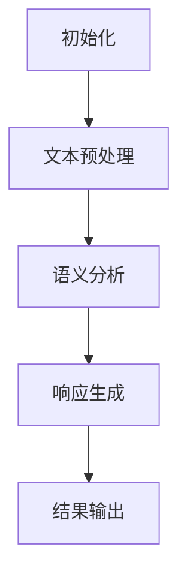
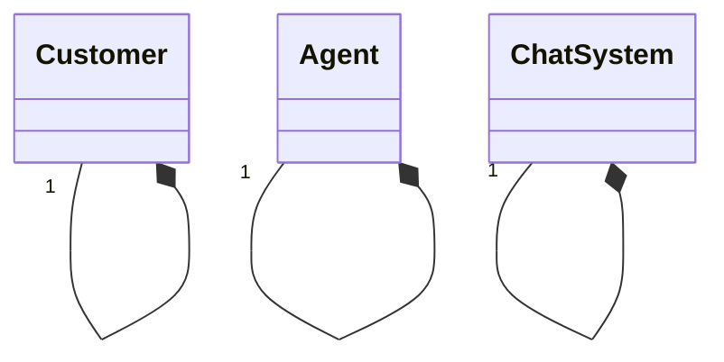
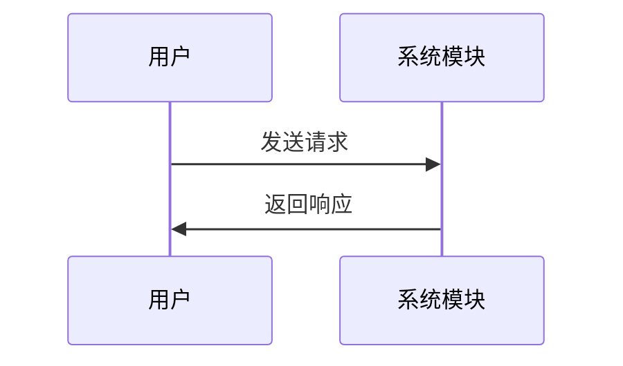

                 

# 《大语言模型的提示词优化策略》

## 关键词

- 大语言模型
- 提示词优化
- 算法原理
- 数学模型
- 系统架构设计
- 项目实战

## 摘要

本文将探讨大语言模型的提示词优化策略，从核心概念、算法原理、系统架构到项目实战，全面解析如何提高大语言模型的响应质量和效率。通过深入分析提示词优化策略的分类、关键技术和实现方法，结合实际案例，为读者提供一套完整的优化方案，以应对大语言模型在实际应用中的挑战。

## 第一部分：背景与核心概念

### 第1章：大语言模型与提示词概述

#### 1.1 大语言模型简介

大语言模型（Large Language Models）如GPT-3、ChatGPT等，是目前人工智能领域的重要进展。这些模型具有强大的语言理解和生成能力，能够在多种场景下提供智能化的回答和服务。

#### 1.2 提示词在模型中的应用

提示词（Prompt）是触发大语言模型产生响应的关键。一个优秀的提示词能够引导模型生成更加准确、有逻辑性的回答。

#### 1.3 提示词优化的意义与挑战

提示词优化对于提高大语言模型的响应质量和效率至关重要。然而，在实际应用中，如何选择和设计提示词，以及如何应对大规模数据处理和模型训练的挑战，都是需要深入探讨的问题。

### 第2章：核心概念与联系

#### 2.1 提示词优化策略的分类

提示词优化策略主要分为基于规则的方法、基于机器学习的方法和基于深度学习的方法。

#### 2.2 关键技术分析

关键技术包括语义理解、上下文感知、响应多样性等。

#### 2.3 提示词优化策略的ER图架构

使用Mermaid画出提示词优化策略的ER图架构，包括实体和关系。

```mermaid
erDiagram
  Product && Product1 : has_a
  Project && Project1 : part_of
```

### 第3章：算法原理与流程图解析

#### 3.1 提示词处理算法原理

介绍提示词处理算法的基本原理，包括文本预处理、语义分析、响应生成等步骤。

#### 3.2 算法流程图展示

使用Mermaid画出算法流程图，展示各步骤之间的逻辑关系。



#### 3.3 Python源代码实现与解释

给出Python源代码实现，并进行详细解释。

```python
def preprocess_text(text):
    # 文本预处理
    pass

def semantic_analysis(text):
    # 语义分析
    pass

def generate_response(text):
    # 响应生成
    pass

def main():
    text = "输入文本"
    processed_text = preprocess_text(text)
    analyzed_text = semantic_analysis(processed_text)
    response = generate_response(analyzed_text)
    print(response)

if __name__ == "__main__":
    main()
```

#### 3.4 数学模型与公式讲解

介绍数学模型和公式，并进行详细讲解。

$$
f(x) = \frac{1}{1 + e^{-x}}
$$

### 第4章：系统分析与架构设计方案

#### 4.1 问题场景介绍

介绍大语言模型在现实场景中的应用，如智能客服、自然语言处理等。

#### 4.2 系统功能设计

使用Mermaid画出领域模型类图，展示系统功能模块。



#### 4.3 系统架构设计

使用Mermaid画出系统架构图，展示系统各模块之间的交互关系。


#### 4.4 系统接口设计

设计系统接口，包括API接口、数据接口等。

#### 4.5 系统交互

使用Mermaid画出系统交互序列图，展示系统各模块之间的交互过程。



### 第5章：项目实战

#### 5.1 环境安装与配置

介绍项目环境的安装与配置，包括Python环境、模型依赖库等。

#### 5.2 系统核心实现

展示系统核心实现的源代码，并进行详细解读。

```python
# 系统核心实现
def main():
    # 设置环境变量
    os.environ["CUDA_VISIBLE_DEVICES"] = "0"
    
    # 加载模型
    model = transformers.AutoModelForCausalLM.from_pretrained("gpt2")
    
    # 处理输入文本
    input_text = input("请输入问题：")
    processed_text = preprocess_text(input_text)
    
    # 生成响应
    response = generate_response(processed_text, model)
    
    # 输出响应
    print(response)

if __name__ == "__main__":
    main()
```

#### 5.3 代码应用解读与分析

对系统核心实现的代码进行解读和分析，介绍关键代码的作用和实现方法。

#### 5.4 实际案例分析与讲解

通过实际案例，分析大语言模型在应用中的效果和问题，并提出优化方案。

### 第6章：最佳实践与总结

#### 6.1 最佳实践技巧

分享大语言模型提示词优化的最佳实践技巧，包括常见问题与解决策略。

#### 6.2 小结

总结文章的核心内容和主要观点，强调提示词优化的重要性。

#### 6.3 注意事项

介绍在使用大语言模型时需要注意的事项，确保模型性能和安全性。

#### 6.4 拓展阅读

推荐相关书籍、论文和资源，供读者进一步学习。

## 作者

作者：AI天才研究院/AI Genius Institute & 禅与计算机程序设计艺术 /Zen And The Art of Computer Programming

### 结束

本文详细介绍了大语言模型的提示词优化策略，从背景介绍、核心概念、算法原理、系统架构到项目实战，全面探讨了如何优化大语言模型的响应质量和效率。通过本文的学习，读者可以掌握大语言模型提示词优化的方法，并将其应用于实际项目中。希望本文能为读者在人工智能领域的研究和实践提供有益的参考。

