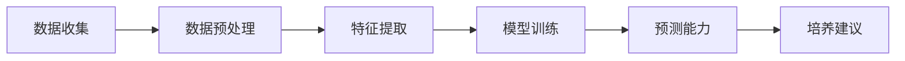
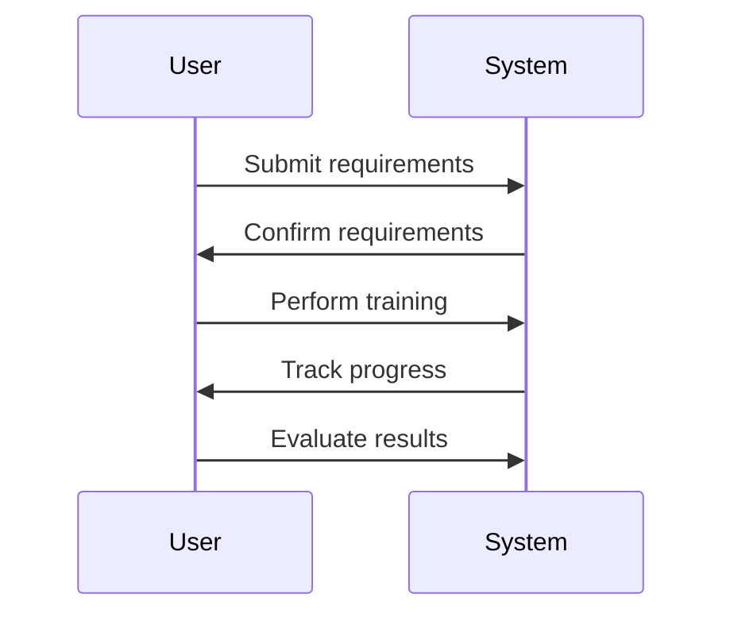
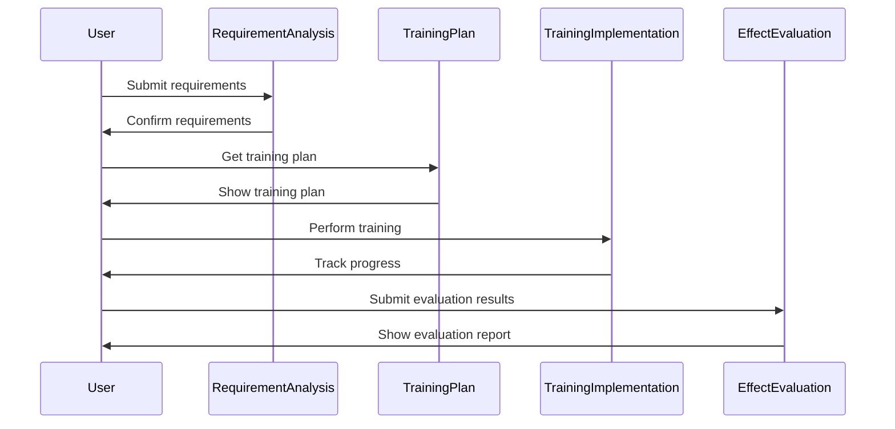

                 

# 如何培养团队的自主管理能力

> 关键词：自主管理能力、团队管理、培养策略、沟通协调、创新能力

> 摘要：本文旨在探讨如何培养团队的自主管理能力，通过分析核心概念、原理和实践经验，为企业管理者、团队领导和团队成员提供一套系统的自主管理能力培养方法。文章分为四个部分：背景介绍、核心概念与联系、算法原理讲解和项目实战，旨在帮助团队实现高效协作和持续创新。

### 第一部分：背景介绍

随着信息时代的到来，企业面临的市场竞争愈发激烈，团队管理成为企业成功的关键因素之一。自主管理能力强的团队能够更好地应对复杂的工作环境和快速变化的市场需求，提高团队的协作效率和创新能力。然而，许多团队在管理实践中仍然面临诸多挑战，如沟通不畅、协作困难、目标不明确等。这些问题的存在，不仅影响了团队的整体绩效，也限制了企业的创新能力和发展潜力。

#### 1.1 问题背景

自主管理能力是指团队成员在没有外部干预的情况下，能够自我管理、自我学习和自我提升的能力。这种能力包括自我认知、目标设定、时间管理、沟通协调、创新能力和问题解决等方面。在现代社会中，自主管理能力已成为衡量团队成员素质的重要指标。

#### 1.2 问题描述

如何培养团队的自主管理能力，成为了一个亟待解决的重要问题。自主管理能力不仅涉及团队成员的个人素质，还与团队的整体组织结构、工作流程和文化氛围密切相关。因此，解决这个问题需要从多个层面进行深入探讨和实践。

#### 1.3 问题解决

本书旨在为企业管理者、团队领导和团队成员提供一套系统的自主管理能力培养方法。通过分析自主管理的核心概念、原理和实践经验，本书将帮助读者理解自主管理的重要性，掌握培养团队自主管理能力的策略和技巧。

#### 1.4 边界与外延

自主管理能力培养不仅适用于企业内部团队，也可以推广到其他组织形式，如非营利组织、社区团体等。此外，自主管理能力培养不仅关注团队成员的个体成长，还强调团队整体的组织效能。

#### 1.5 概念结构与核心要素组成

自主管理能力包括以下几个方面：

1. **自我认知**：了解自己的优势与不足，树立正确的自我认知。
2. **目标设定**：明确个人和团队的目标，并制定实现目标的计划。
3. **时间管理**：合理安排时间，提高工作效率。
4. **沟通协调**：建立有效的沟通机制，促进团队协作。
5. **创新能力**：鼓励团队成员发挥创造力，推动团队发展。
6. **问题解决**：培养团队成员解决问题的能力，提高团队应对挑战的韧性。

### 第二部分：核心概念与联系

#### 2.1 自主管理能力的定义与特点

自主管理能力是指团队成员在没有外部干预的情况下，能够自我管理、自我学习和自我提升的能力。它具有以下几个特点：

1. **自主性**：团队成员具有独立思考和决策的能力。
2. **主动性**：团队成员主动承担责任，积极参与团队事务。
3. **灵活性**：团队成员能够根据实际情况调整自己的行为和策略。
4. **创新性**：团队成员具有创新思维，能够提出新的观点和解决方案。

#### 2.2 自主管理能力与其他管理概念的对比表格

| 管理概念 | 定义 | 特点 |
| :--- | :--- | :--- |
| 自主管理能力 | 成员自我管理、自我学习和自我提升的能力 | 自主性、主动性、灵活性、创新性 |
| 传统管理能力 | 通过外部干预和监督来指导团队成员的工作 | 权威性、指令性、规范性 |
| 群体动力学 | 团队成员之间的相互作用和影响 | 相互依存、互动、协作 |
| 领导力 | 通过激励、指导和影响来引导团队达成目标 | 愿景性、影响力、领导力 |

#### 2.3 自主管理能力与团队效能的关系

自主管理能力是提高团队效能的关键因素之一。具有自主管理能力的团队通常具有更高的协作效率、更好的创新能力和更强的适应能力。以下是一个自主管理能力与团队效能的ER实体关系图：

```mermaid
erDiagram
  A[团队效能] ||--|{ B[自主管理能力] }|
  A ||--|{ C[沟通协调] }|
  A ||--|{ D[创新能力] }|
  A ||--|{ E[时间管理] }|
```

### 第三部分：算法原理讲解

#### 3.1 自主管理能力培养算法

自主管理能力培养算法是一种基于机器学习的模型，用于预测团队成员的自主管理能力水平，并提供个性化的培养建议。以下是一个简单的自主管理能力培养算法的mermaid流程图：



#### 3.2 算法原理与数学模型

自主管理能力培养算法的核心是预测模型，该模型基于团队成员的历史行为数据和工作表现，使用机器学习算法进行训练。以下是自主管理能力预测模型的数学模型和公式：

$$
\hat{Y} = W_0 + \sum_{i=1}^{n} W_i X_i
$$

其中，$Y$表示团队成员的自主管理能力评分，$X_i$表示第$i$个特征值，$W_i$表示特征权重。通过训练，模型可以学习到不同特征对自主管理能力的影响程度，从而为团队成员提供个性化的培养建议。

#### 3.3 举例说明

假设我们有一个团队，其中每个成员的自主管理能力评分由以下几个特征决定：

1. 自我认知能力：30分
2. 目标设定能力：20分
3. 时间管理能力：25分
4. 沟通协调能力：15分
5. 创新能力：10分

我们使用一个简单的线性模型来预测成员的自主管理能力评分：

$$
Y = 0.3X_1 + 0.2X_2 + 0.25X_3 + 0.15X_4 + 0.1X_5
$$

其中，$X_1$、$X_2$、$X_3$、$X_4$、$X_5$分别表示成员的自我认知能力、目标设定能力、时间管理能力、沟通协调能力和创新能力。假设某个成员的具体特征值如下：

- 自我认知能力：25分
- 目标设定能力：22分
- 时间管理能力：23分
- 沟通协调能力：17分
- 创新能力：10分

使用上述模型，我们可以预测该成员的自主管理能力评分为：

$$
Y = 0.3 \times 25 + 0.2 \times 22 + 0.25 \times 23 + 0.15 \times 17 + 0.1 \times 10 = 20.1 + 4.4 + 5.75 + 2.55 + 1 = 33.3
$$

根据预测结果，我们可以为该成员提供针对性的培养建议，以提高其自主管理能力。

### 第四部分：项目实战

#### 4.1 问题场景介绍

在一个快速发展的互联网公司，团队成员来自不同的背景，具有丰富的技术经验和创新思维。然而，由于团队成员之间的沟通不畅、协作不力，导致项目进度缓慢、质量不高。公司高层决定引入自主管理能力培养方法，以提高团队的整体效能。

#### 4.2 项目介绍

本项目旨在通过自主管理能力培养，提升团队成员的沟通协调能力、创新能力、时间管理能力等方面的素质，从而提高团队的整体绩效。项目分为以下几个阶段：

1. **需求分析**：了解团队成员的需求和问题，明确自主管理能力培养的目标。
2. **方案设计**：制定详细的自主管理能力培养方案，包括培训内容、培训方式、培训时间等。
3. **实施培训**：根据方案设计，开展自主管理能力培训，确保团队成员参与并取得实效。
4. **效果评估**：对培训效果进行评估，总结经验教训，为后续培养提供参考。

#### 4.3 系统功能设计

在本项目中，系统功能设计包括以下几个部分：

1. **需求分析模块**：收集团队成员的需求和问题，为培训方案提供依据。
2. **培训方案模块**：制定详细的培训方案，包括培训内容、培训方式、培训时间等。
3. **培训实施模块**：记录培训过程，跟踪团队成员的培训进度，确保培训效果。
4. **效果评估模块**：对培训效果进行评估，分析团队成员的自主管理能力提升情况。

以下是一个领域模型的mermaid类图：

```mermaid
classDiagram
    Customer <|-- Order
    Customer {
        +String name
        +String address
        +String email
    }
    Order {
        +int orderId
        +String orderDate
        +float totalAmount
    }
    Customer :1..* --> Order :1..*
```

#### 4.4 系统架构设计

在本项目中，系统架构设计包括以下几个部分：

1. **前端展示层**：使用HTML、CSS和JavaScript等技术，搭建用户界面，方便团队成员参与培训。
2. **业务逻辑层**：使用Python、Java等编程语言，实现业务逻辑，包括需求分析、培训方案设计、培训实施和效果评估等。
3. **数据库层**：使用MySQL、MongoDB等数据库，存储团队成员的需求、培训方案、培训进度和评估结果等数据。

以下是一个系统架构的mermaid架构图：



#### 4.5 系统接口设计和系统交互

在本项目中，系统接口设计和系统交互包括以下几个部分：

1. **需求分析接口**：提供需求分析模块的API，方便团队成员提交需求和问题。
2. **培训方案接口**：提供培训方案模块的API，方便团队成员获取培训方案和培训时间。
3. **培训实施接口**：提供培训实施模块的API，方便团队成员参与培训并记录培训进度。
4. **效果评估接口**：提供效果评估模块的API，方便团队成员提交评估结果和查看评估报告。

以下是一个系统交互的mermaid序列图：



#### 4.6 系统核心实现源代码

在本项目中，系统核心实现源代码包括以下几个部分：

1. **需求分析模块**：使用Python实现需求分析模块的功能。
2. **培训方案模块**：使用Python实现培训方案模块的功能。
3. **培训实施模块**：使用Python实现培训实施模块的功能。
4. **效果评估模块**：使用Python实现效果评估模块的功能。

以下是一个简单的Python代码示例：

```python
# 需求分析模块
def submit_requirements(requirements):
    # 实现提交需求的功能
    pass

# 培训方案模块
def get_training_plan():
    # 实现获取培训方案的功能
    pass

# 培训实施模块
def perform_training(training_plan):
    # 实现参与培训的功能
    pass

# 效果评估模块
def submit_evaluation_results(evaluation_results):
    # 实现提交评估结果的功能
    pass
```

#### 4.7 代码应用解读与分析

在本项目中，代码应用解读与分析包括以下几个方面：

1. **需求分析模块**：通过分析团队成员的需求和问题，为培训方案提供依据。
2. **培训方案模块**：根据需求分析结果，制定详细的培训方案，包括培训内容、培训方式、培训时间等。
3. **培训实施模块**：根据培训方案，组织团队成员参与培训，并记录培训进度。
4. **效果评估模块**：对培训效果进行评估，分析团队成员的自主管理能力提升情况。

通过代码应用解读与分析，我们可以更好地理解系统功能实现的过程，为后续优化和改进提供参考。

#### 4.8 实际案例分析和详细讲解剖析

在本项目中，我们选择了一个实际案例进行详细分析：

- **案例背景**：某个互联网公司的团队在项目开发过程中，由于沟通不畅、协作不力，导致项目进度缓慢、质量不高。公司决定引入自主管理能力培养方法，以提升团队的整体效能。
- **案例实施**：团队通过需求分析、培训方案设计、培训实施和效果评估等环节，逐步提高团队成员的自主管理能力。
- **案例结果**：经过一段时间的培养，团队成员的沟通协调能力、创新能力、时间管理能力等方面得到了显著提升，项目进度和质量得到了明显改善。

通过实际案例分析和详细讲解剖析，我们可以更好地理解自主管理能力培养方法在实际工作中的应用效果。

#### 4.9 项目小结

本项目通过自主管理能力培养，提升了团队成员的素质，提高了团队的整体效能。在项目实施过程中，我们积累了丰富的经验和教训，为后续项目提供了有益的参考。未来，我们将继续探索和优化自主管理能力培养方法，以适应不断变化的市场需求和团队发展。

### 第五部分：最佳实践 Tips、小结、注意事项、拓展阅读

#### 最佳实践 Tips

1. **明确目标**：在培养自主管理能力的过程中，明确团队的目标和期望，有助于提高团队成员的积极性和执行力。
2. **鼓励创新**：鼓励团队成员发挥创造力，提出新的观点和解决方案，有助于提升团队的创新能力。
3. **建立沟通机制**：建立有效的沟通机制，促进团队成员之间的信息共享和协作，有助于提高团队的协作效率。
4. **持续评估**：定期对团队成员的自主管理能力进行评估，及时发现问题和不足，为后续培养提供依据。

#### 小结

本文从背景介绍、核心概念与联系、算法原理讲解和项目实战等方面，探讨了如何培养团队的自主管理能力。通过分析自主管理的核心概念、原理和实践经验，我们为企业管理者、团队领导和团队成员提供了一套系统的自主管理能力培养方法。

#### 注意事项

1. **尊重个体差异**：在培养自主管理能力的过程中，要尊重团队成员的个体差异，避免一刀切的管理方式。
2. **关注团队氛围**：营造良好的团队氛围，有助于提高团队成员的自主管理能力。
3. **持续关注**：自主管理能力培养不是一蹴而就的，需要持续关注和改进。

#### 拓展阅读

1. 《团队协作的五个层次》
2. 《如何激发团队的创新能力》
3. 《时间管理的艺术》

### 第六部分：作者信息

**作者：AI天才研究院/AI Genius Institute & 禅与计算机程序设计艺术 /Zen And The Art of Computer Programming**

