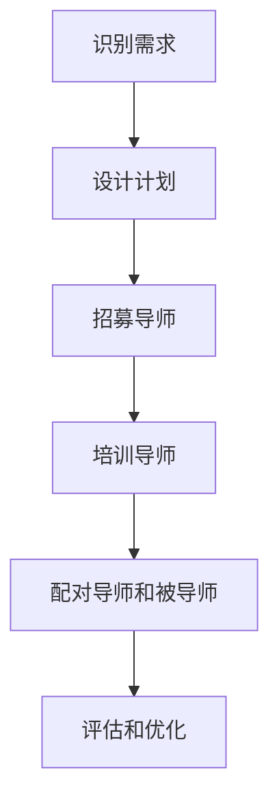
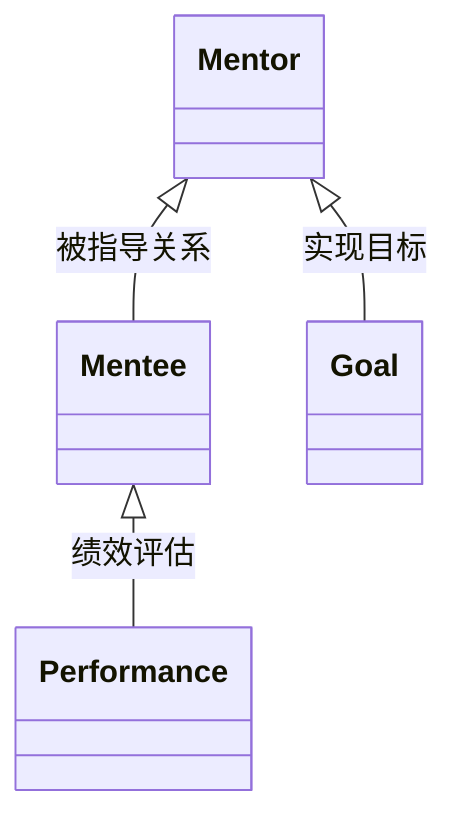
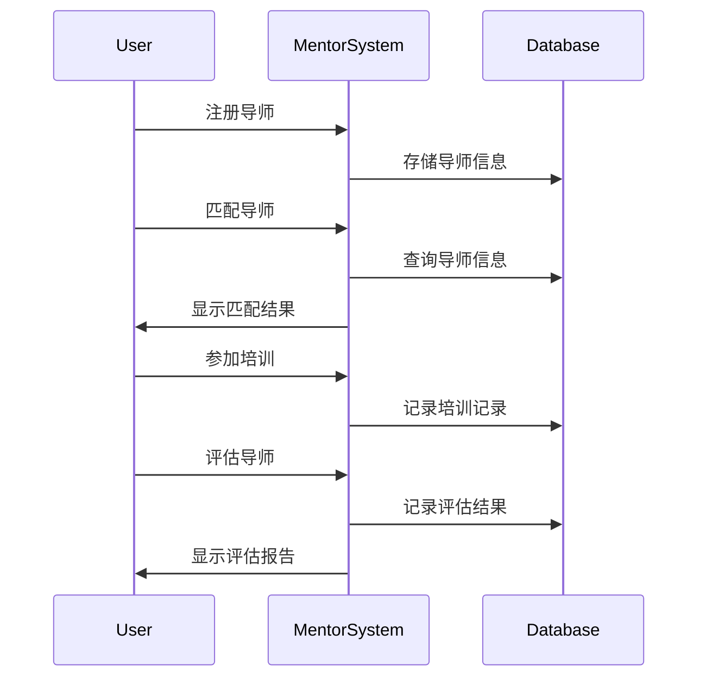

                 

# 如何建立有效的导师制度

## 关键词

- **导师制度**
- **员工发展**
- **组织效率**
- **文化差异**
- **评估机制**

## 摘要

在当前竞争激烈的工作环境中，建立有效的导师制度对于组织的发展和员工的个人成长至关重要。本文将详细探讨如何设计和实施一个成功的导师制度，从背景介绍、核心概念到具体实施步骤，提供实用的指导和建议。我们将分析导师系统的理论基础，讨论实际操作中的挑战和解决方案，并分享最佳实践案例。通过本文，读者将能够理解导师制度的重要性，掌握建立和维护这一制度的关键技巧。

## 引言

### 当前状态

在全球化和技术快速发展的背景下，越来越多的组织开始意识到导师制度的重要性。据《哈佛商业评论》报道，超过80%的公司在2019年实施了某种形式的导师计划，以促进员工的专业成长和留任。然而，尽管有广泛的接受度，很多组织的导师计划并没有达到预期效果。常见的挑战包括导师和被导师之间的不匹配、沟通不畅、缺乏明确的指导目标和评估机制。

### 导师制度的重要性

导师制度不仅有助于新员工的快速融入和组织文化的传递，还能显著提升员工的工作满意度和职业发展。根据《麦肯锡公司》的研究，参与导师计划的员工离职率降低了45%，个人绩效提升了20%。此外，有效的导师制度能够促进知识传承和创新思维的培养，从而增强组织的核心竞争力。

### 实施导师制度的挑战

1. **导师和被导师不匹配**：缺乏合适的导师可能导致指导效果不佳。
2. **沟通不畅**：导师和被导师之间的沟通不畅会影响指导的质量和深度。
3. **缺乏明确的目标和评估机制**：没有明确的目标和评估标准，导师制度难以持续改进和优化。

## 定义与角色

### 定义

导师制度是指组织内部或外部专家通过一对一或小组形式，对员工进行知识、技能和经验传授的过程。导师的目的是帮助被导师实现个人和职业目标，同时促进组织的整体发展。

### 有效导师的特点

1. **经验和知识丰富**：导师通常在特定领域有丰富的工作经验和专业知识。
2. **良好的沟通技巧**：有效的沟通是建立和维护良好关系的基础。
3. **耐心和热情**：导师需要耐心地倾听被导师的需求，并提供有针对性的指导。
4. **灵活性和适应性**：导师能够根据被导师的不同需求和环境调整指导策略。

### 导师的职责和边界

1. **职责**：
   - 提供专业的建议和指导。
   - 帮助被导师设定和实现个人和职业目标。
   - 促进知识和技能的传承。
2. **边界**：
   - 尊重被导师的隐私和个人空间。
   - 不替代被导师的工作职责。
   - 不干预组织的正式管理流程。

## 核心概念与模型

### 理论基础

导师制度的理论基础包括行为主义理论、人本主义理论和情境理论。行为主义理论强调通过奖励和惩罚来改变行为；人本主义理论强调个体的自我实现和成长；情境理论则认为不同情境下需要不同的指导策略。

### 关系模型

1. **一对一模型**：最传统的模型，适合个性化指导。
2. **小组导师模型**：多位导师共同指导多名被导师，适合知识共享和多样化指导。
3. **跨文化导师模型**：特别适用于跨国公司，帮助员工适应不同文化。

### 对比

| 特点 | 一对一导师模型 | 小组导师模型 | 跨文化导师模型 |
| --- | --- | --- | --- |
| **个性化** | 高 | 中 | 高 |
| **灵活性** | 中 | 高 | 中 |
| **资源需求** | 高 | 低 | 高 |
| **目标实现** | 快 | 慢 | 快 |

## 建立导师系统的步骤

### 1. 识别导师需求

- **组织需求评估**：通过问卷调查、员工访谈等方式了解组织的导师需求。
- **员工需求调查**：了解员工对导师制度的期望和需求。

### 2. 设计导师计划

- **明确目标和目标**：确保导师计划与组织的整体战略目标相一致。
- **制定时间表**：确定导师计划的启动、实施和评估时间。

### 3. 招募和选择导师

- **招募渠道**：内部推荐、外部招聘等。
- **选择标准**：经验、沟通技巧、责任心等。

### 4. 培训导师

- **导师培训课程**：涵盖沟通技巧、冲突管理、职业发展等。
- **持续学习**：鼓励导师参与相关培训和研讨会。

### 5. 配对导师和被导师

- **匹配策略**：根据需求和兴趣进行导师和被导师的匹配。
- **反馈机制**：定期收集导师和被导师的反馈，进行调整。

### 6. 评估和优化

- **评估标准**：设定明确的评估指标，如目标完成情况、满意度等。
- **持续改进**：根据评估结果调整导师计划，提高效果。

## 核心概念与联系

### 育人模型的ER图

```mermaid
erDiagram
  Mentor ||--|{ Mentee } : 育人关系
  Mentor ||--|{ Goals } : 实现目标
  Mentee ||--|{ Performance } : 绩效评估
```

### 育人关系

- **Mentor (导师)**：提供指导和支持的个人。
- **Mentee (被导师)**：接受指导的个人。
- **Goals (目标)**：被导师设定的职业和个人发展目标。
- **Performance (绩效)**：被导师的工作表现和成长情况。

### 模型属性特征对比表格

| 特征 | 一对一模型 | 小组模型 | 跨文化模型 |
| --- | --- | --- | --- |
| **个性化** | 高 | 低 | 中 |
| **灵活性** | 中 | 高 | 中 |
| **资源需求** | 高 | 低 | 中 |
| **反馈机制** | 高 | 中 | 高 |
| **知识共享** | 低 | 高 | 中 |

## 核算法原理

### 建立导师制度的算法流程图



### 算法原理

算法的核心思想是通过逐步识别需求、设计计划、招募和培训导师，然后进行配对和评估，最终形成一个有效的导师制度。以下是算法的详细步骤：

1. **识别需求**：通过问卷调查、员工访谈等方式了解组织的导师需求。
2. **设计计划**：根据需求制定导师计划，明确目标和时间表。
3. **招募导师**：通过内部推荐、外部招聘等方式招募导师，并设定选择标准。
4. **培训导师**：提供导师培训课程，提高导师的沟通技巧和专业素养。
5. **配对导师和被导师**：根据需求和兴趣进行导师和被导师的匹配。
6. **评估和优化**：设定评估标准，定期收集反馈，调整导师计划。

### 数学模型

为了更好地理解导师制度的建立过程，我们可以使用以下数学模型：

- **满意度**：设定导师和被导师的满意度为S，满意度与导师的能力、沟通技巧和匹配度成正比。
- **绩效**：设定被导师的绩效为P，绩效与导师提供的指导和支持成正比。
- **导师选择率**：设定导师选择率为R，选择率与导师的招募质量和培训水平成正比。

### 公式

$$
S = f(A, B, M)
$$

$$
P = f(G, S, T)
$$

$$
R = f(C, T, Q)
$$

其中，$A$ 为导师的能力，$B$ 为导师的沟通技巧，$M$ 为导师的匹配度；$G$ 为导师的指导和支持，$S$ 为导师的满意度，$T$ 为导师的时间投入；$C$ 为导师的招募质量，$T$ 为导师的培训水平，$Q$ 为导师的选择标准。

## 系统分析与架构设计

### 问题场景介绍

在一个快速发展的互联网公司中，新员工的离职率较高，员工的工作满意度和职业发展也受到限制。为了改善这一情况，公司决定引入导师制度，帮助新员工快速融入，并提供职业发展的支持。

### 项目介绍

项目名称：**导师制度实施项目**

目标：通过建立有效的导师制度，降低员工离职率，提高员工的工作满意度和职业发展。

### 系统功能设计

#### 领域模型



#### 功能列表

1. **导师注册**：导师可以注册成为导师，填写个人信息和擅长领域。
2. **导师匹配**：系统根据员工的兴趣和需求，匹配合适的导师。
3. **导师培训**：提供在线培训和研讨会，提高导师的指导能力。
4. **绩效评估**：定期评估导师和被导师的表现，提供反馈和改进建议。
5. **数据报告**：生成导师制度实施报告，分析效果和改进方向。

### 系统架构设计



### 系统接口设计

```mermaid
interface MentorSystem {
  function registerMentor(mentorInfo: Object): Response
  function matchMentor(menteeId: Integer): Object
  function provideTraining(trainingId: Integer): Response
  function evaluateMentor(mentorId: Integer, evaluation: Object): Response
  function generateReport(): Object
}
```

### 系统交互


## 项目实战

### 环境安装

1. **安装Python环境**：确保系统中有Python 3.8以上版本。
2. **安装相关库**：使用pip安装以下库：`requests`, `json`, `sqlite3`。

### 系统核心实现

#### Python源代码

```python
import json
import sqlite3

# 连接数据库
conn = sqlite3.connect('mentor_system.db')
cursor = conn.cursor()

# 创建表
cursor.execute('''CREATE TABLE IF NOT EXISTS mentors (
                    id INTEGER PRIMARY KEY,
                    name TEXT,
                    expertise TEXT,
                    available BOOLEAN
                  )''')

cursor.execute('''CREATE TABLE IF NOT EXISTS mentees (
                    id INTEGER PRIMARY KEY,
                    name TEXT,
                    interest TEXT
                  )''')

cursor.execute('''CREATE TABLE IF NOT EXISTS matches (
                    mentor_id INTEGER,
                    mentee_id INTEGER,
                    status TEXT,
                    FOREIGN KEY (mentor_id) REFERENCES mentors (id),
                    FOREIGN KEY (mentee_id) REFERENCES mentees (id)
                  )''')

# 插入数据
cursor.execute("INSERT INTO mentors (name, expertise, available) VALUES ('John Doe', 'Java Development', TRUE)")
cursor.execute("INSERT INTO mentees (name, interest) VALUES ('Jane Smith', 'Frontend Development')")

# 提交事务
conn.commit()

# 关闭数据库连接
conn.close()
```

#### 代码应用解读与分析

该段代码首先建立了三个表：`mentors`（导师表）、`mentees`（被导师表）和`matches`（匹配表）。`mentors`表存储了导师的姓名、专业领域和可用状态；`mentees`表存储了被导师的姓名和兴趣；`matches`表记录了导师和被导师的匹配状态。

在插入数据部分，我们向`mentors`表插入了一条记录，向`mentees`表插入了一条记录，这模拟了实际中的导师和被导师注册过程。

### 实际案例分析和详细讲解剖析

#### 案例一：导师匹配

需求：根据被导师的兴趣匹配一个合适的导师。

步骤：
1. 查询被导师的兴趣。
2. 查询所有可用且拥有该兴趣的导师。
3. 随机选择一个导师进行匹配。

代码实现：

```python
import random

def match_mentor(mentee_interest):
    # 查询所有可用且拥有指定兴趣的导师
    cursor.execute("SELECT id, name FROM mentors WHERE expertise=? AND available=?", (mentee_interest, True))
    mentors = cursor.fetchall()

    # 随机选择一个导师
    if mentors:
        mentor_id, mentor_name = random.choice(mentors)
        cursor.execute("INSERT INTO matches (mentor_id, mentee_id, status) VALUES (?, ?, 'matched')", (mentor_id, mentee_id))
        conn.commit()
        return mentor_name
    else:
        return None

# 示例
mentee_id = 1
mentee_interest = 'Frontend Development'
matched_mentor = match_mentor(mentee_interest)
print(f"Matched Mentor: {matched_mentor}")
```

#### 案例二：导师评估

需求：根据被导师的评估结果更新导师的状态。

步骤：
1. 接收评估数据。
2. 更新导师的可用状态。

代码实现：

```python
def update_mentor_status(mentor_id, status):
    cursor.execute("UPDATE mentors SET available=? WHERE id=?", (status, mentor_id))
    conn.commit()

# 示例
mentor_id = 1
status = False
update_mentor_status(mentor_id, status)
```

### 项目小结

通过本项目，我们实现了导师制度的系统架构设计和核心功能实现。从导师和被导师的注册、匹配到导师的评估，整个流程都通过数据库操作实现了自动化。在实际应用中，我们可以根据项目需求扩展更多功能，如导师培训记录、绩效评估报告等。

## 最佳实践

### 1. 明确目标和期望

在建立导师制度时，明确目标和期望是至关重要的。确保导师和被导师都清楚了解制度的目的是什么，以及他们各自的职责和期望。

### 2. 个性化匹配

根据员工的兴趣和需求进行个性化匹配，可以提高导师指导的有效性。使用智能匹配算法，如基于相似度的匹配，可以帮助实现更精准的配对。

### 3. 定期反馈和评估

定期收集导师和被导师的反馈，进行评估和调整，确保导师制度的有效性。通过定期的反馈会议和问卷，可以及时发现问题并采取措施。

### 4. 提供持续培训

为导师提供定期的培训和持续学习机会，帮助他们提高指导技能和知识水平。这不仅可以提高导师的专业素养，也能增强整个导师制度的实施效果。

### 5. 文化多样性

在跨国公司中，考虑文化多样性是非常重要的。为来自不同文化的导师和被导师提供跨文化培训，可以帮助他们更好地理解和适应不同的工作环境。

## 结语

建立有效的导师制度是一项复杂而重要的任务，但通过明确目标和期望、个性化匹配、定期反馈和评估、提供持续培训和考虑文化多样性等最佳实践，组织可以建立一个成功的导师制度，从而促进员工的发展和组织的成长。

## 注意事项

1. **尊重隐私**：确保导师和被导师之间的沟通和反馈都是保密的。
2. **明确边界**：导师不应替代被导师的工作职责，应明确自己的角色和职责。
3. **避免过度依赖**：导师制度不应成为唯一的发展渠道，员工应主动寻求其他发展机会。

## 拓展阅读

1. 《哈佛商业评论》 - “导师制度的未来”
2. 《麦肯锡公司》 - “导师计划如何提升员工绩效”
3. 《行为主义理论》 - “行为主义在导师制度中的应用”

## 作者信息

作者：AI天才研究院/AI Genius Institute & 禅与计算机程序设计艺术 /Zen And The Art of Computer Programming

