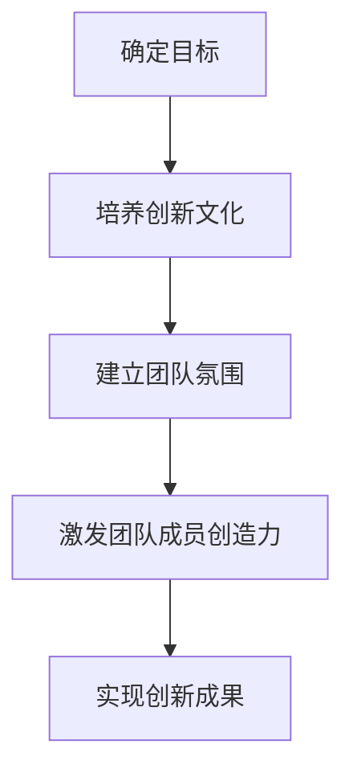
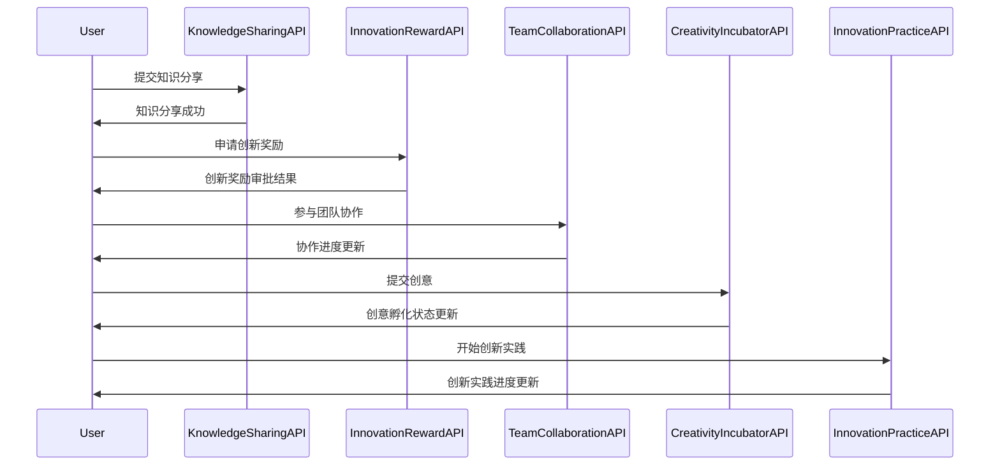

                 


# 如何提升团队的创新能力和创造力

关键词：团队创新、创造力提升、创新文化、团队氛围、系统设计

摘要：本文旨在探讨如何通过构建积极创新的文化和氛围，激发团队成员的创造力和创新能力，从而提升整个团队的创新绩效。文章分为以下几个部分：背景介绍、核心概念与联系、算法原理讲解、系统分析与架构设计方案、项目实战和最佳实践。

## 背景介绍

在当今快速变化和竞争激烈的市场环境中，团队的创新能力和创造力已经成为企业成功的关键因素。一个具备强大创新能力和创造力的团队能够在面对挑战时迅速适应并找到解决方案，从而在市场中保持竞争优势。然而，提升团队的创新能力和创造力并非易事，它需要从多个方面进行系统化的努力。

本文将首先介绍创新文化和团队氛围的概念，接着探讨如何培养创新文化和构建积极团队氛围。然后，我们将通过算法原理讲解、系统分析与架构设计方案和项目实战，提供一套实用的方法和策略，以帮助团队领导者和管理者提升团队的创新能力和创造力。

## 核心概念与联系

### 创新文化

创新文化是一个组织内部对创新的态度和行为模式。它包括鼓励创新、容忍失败、支持团队自主学习和持续改进的价值观和实践。创新文化能够为团队成员提供创新的自由和安全感，从而激发他们的创造力和创新能力。

**创新文化的属性特征对比表格：**

| 特征         | 解释                                                         |
| ------------ | ------------------------------------------------------------ |
| 鼓励创新     | 组织鼓励员工提出新想法和解决方案，不论其是否成功。               |
| 容忍失败     | 组织对失败持宽容态度，将失败视为学习和成长的机会。             |
| 支持自主学习 | 组织提供资源和支持，鼓励员工持续学习和个人发展。             |
| 持续改进     | 组织不断寻求改进现有流程和产品，以提高效率和客户满意度。       |

**ER实体关系图架构：**

```mermaid
erDiagram
    Class1 "创新文化" {
        ---|{ Class2 "员工行为" }
        ---|{ Class3 "创新实践" }
    }
    Class2 "员工行为" {
        ---|{ Class4 "创新思维" }
        ---|{ Class5 "决策过程" }
    }
    Class3 "创新实践" {
        ---|{ Class4 "创新成果" }
        ---|{ Class6 "创新资源" }
    }
```

### 团队氛围

团队氛围是团队成员之间的相互关系和工作环境的总和。一个积极健康的团队氛围能够促进团队成员之间的沟通与协作，提高团队的整体效能。

**团队氛围的属性特征对比表格：**

| 特征         | 解释                                                         |
| ------------ | ------------------------------------------------------------ |
| 沟通与协作   | 成员之间有效沟通，共同解决问题。                             |
| 信任与尊重   | 成员彼此信任，尊重不同的观点和贡献。                         |
| 共同目标     | 成员共同追求团队目标，共同努力。                           |
| 积极激励     | 成员相互激励，鼓励彼此创新和进步。                         |

**ER实体关系图架构：**

```mermaid
erDiagram
    Class1 "团队氛围" {
        ---|{ Class2 "沟通协作" }
        ---|{ Class3 "信任尊重" }
        ---|{ Class4 "共同目标" }
    }
    Class2 "沟通协作" {
        ---|{ Class5 "信息共享" }
        ---|{ Class6 "合作精神" }
    }
    Class3 "信任尊重" {
        ---|{ Class7 "信任机制" }
        ---|{ Class8 "尊重行为" }
    }
    Class4 "共同目标" {
        ---|{ Class9 "目标设定" }
        ---|{ Class10 "目标实现" }
    }
```

### 创造力

创造力是指个体或团队在特定情境下产生新颖且有价值的想法或解决方案的能力。它是创新的基础，对于团队来说，提高创造力能够直接提升团队的创新能力。

**创造力的属性特征对比表格：**

| 特征         | 解释                                                         |
| ------------ | ------------------------------------------------------------ |
| 新颖性       | 想法或解决方案具有独特性和原创性。                           |
| 有价值       | 想法或解决方案能够解决实际问题，带来改进和效益。             |
| 可行性       | 想法或解决方案在实际操作中具有可行性。                       |
| 灵活性       | 创造力在不同情境下都能够发挥作用。                         |

通过上述核心概念与联系的分析，我们可以看到创新文化、团队氛围和创造力三者之间的紧密关系。创新文化为团队提供了创新的土壤，团队氛围则为团队成员提供了互动和协作的平台，而创造力则是创新文化在团队氛围中的具体体现。提升团队的创新能力和创造力，需要从这三个方面同时发力，形成一个相互促进、协同作用的系统。

## 算法原理讲解

### Mermaid 流程图

首先，我们可以使用Mermaid来绘制一个简化的流程图，描述提升团队创新能力和创造力的步骤：



### Python 源代码示例

为了更加详细地描述各个步骤，我们可以使用Python来编写一个类和函数，分别对应流程图中的每个步骤。

```python
# 创新文化培养
def cultivate_innovation_culture():
    # 推动知识分享和开放讨论
    # 鼓励失败并从中学习
    # 设立创新奖项和认可机制
    print("培养创新文化：推动知识分享、鼓励失败和设立创新奖项。")

# 团队氛围建设
def build_team_atmosphere():
    # 促进团队成员之间的沟通与协作
    # 建立信任和尊重
    # 设定共同目标和愿景
    print("建立团队氛围：促进沟通、建立信任、设定共同目标。")

# 激发创造力
def inspire_creativity():
    # 鼓励自由表达和观点碰撞
    # 提供必要的资源和时间
    # 创造多样化的工作环境
    print("激发创造力：鼓励自由表达、提供资源和创造多样化的环境。")

# 实现创新成果
def achieve_innovation():
    # 从创意到实践的转化
    # 实施创新项目
    # 评估和优化创新过程
    print("实现创新成果：从创意到实践、实施项目、评估优化。")
```

### 算法原理详细讲解

#### 创新文化培养

创新文化的培养是提升团队创新能力的基础。一个良好的创新文化能够鼓励团队成员敢于尝试新思路，勇于面对失败，并从中吸取经验。为了培养创新文化，我们可以采取以下措施：

1. **推动知识分享和开放讨论**：定期组织知识分享会，鼓励团队成员分享他们的经验和见解。通过开放讨论，团队成员可以互相启发，碰撞出新的火花。

2. **鼓励失败并从中学习**：建立一种宽容失败的文化，让团队成员知道失败并不可怕，而是一个学习和成长的机会。这种文化能够减少团队成员的创新障碍，鼓励他们不断尝试。

3. **设立创新奖项和认可机制**：通过设立创新奖项和认可机制，对那些提出创新想法和实践的创新者给予奖励和认可，从而激励更多的团队成员参与到创新活动中来。

#### 团队氛围建设

团队氛围是团队成员之间相互关系和工作环境的总和。一个积极的团队氛围能够促进团队成员之间的沟通与协作，提高团队的整体效能。为了建设良好的团队氛围，我们可以采取以下措施：

1. **促进团队成员之间的沟通与协作**：鼓励团队成员之间进行开放和诚实的沟通，建立良好的沟通渠道。通过定期的团队会议、头脑风暴等活动，促进团队成员之间的协作。

2. **建立信任和尊重**：建立团队成员之间的信任关系，让每个成员都感受到尊重。通过建立共同目标和愿景，增强团队成员之间的凝聚力。

3. **设定共同目标和愿景**：确保团队成员都对团队的目标和愿景有清晰的认识，从而能够共同努力，为团队的创新目标而努力。

#### 激发创造力

创造力是创新的核心，是团队在创新过程中产生新颖想法和解决方案的能力。为了激发团队成员的创造力，我们可以采取以下措施：

1. **鼓励自由表达和观点碰撞**：鼓励团队成员自由表达自己的想法，并提供一个开放的环境，让不同观点能够碰撞，从而激发更多的创意。

2. **提供必要的资源和时间**：确保团队成员有足够的资源和时间来进行创新活动。这包括提供最新的技术工具、专业培训以及适当的工作时间安排。

3. **创造多样化的工作环境**：通过多样化的工作环境，如开放的工作空间、远程工作机会等，激发团队成员的创新思维。

#### 实现创新成果

创新成果的实现是创新过程的最终目标。为了确保创新成果能够落地并产生实际效益，我们可以采取以下措施：

1. **从创意到实践的转化**：将创新想法转化为实际的项目，并通过项目管理的方法来确保项目的顺利实施。

2. **实施创新项目**：在项目实施过程中，要密切关注项目的进展，及时调整计划和资源，确保项目能够按照预期完成。

3. **评估和优化创新过程**：在创新项目完成后，要对整个创新过程进行评估和优化，总结经验教训，为下一次的创新活动提供参考。

### 数学模型和数学公式

为了更系统地描述提升团队创新能力和创造力的过程，我们可以使用以下数学模型和公式：

$$
\text{创新绩效} = f(\text{创新文化}, \text{团队氛围}, \text{创造力})
$$

其中，创新绩效是团队创新活动的最终成果，而创新文化、团队氛围和创造力则是影响创新绩效的关键因素。通过调整这些因素，我们可以优化创新绩效。

## 系统分析与架构设计方案

### 问题场景介绍

在当前信息技术飞速发展的时代，企业面临的竞争压力越来越大，创新能力和创造力的提升成为企业保持竞争力的关键。为了提升团队的创新能力和创造力，我们需要设计一个系统化的解决方案，从创新文化的培养、团队氛围的构建到创造力的激发，以及创新成果的实现和优化，提供全方位的支持。

### 项目介绍

为了实现上述目标，我们提出了一个名为“创新生态系统”的项目。该项目旨在通过构建一个创新平台，提供一系列工具和资源，帮助团队提升创新能力和创造力。

### 系统功能设计

在“创新生态系统”项目中，我们设计了以下几个核心功能模块：

1. **知识分享平台**：提供知识共享和交流的渠道，鼓励团队成员分享经验和见解。
2. **创新奖励机制**：设立创新奖项和认可机制，激励团队成员积极参与创新活动。
3. **团队协作工具**：提供多种协作工具，如项目管理软件、在线会议系统等，促进团队成员之间的沟通与协作。
4. **创意孵化器**：为团队成员提供创意孵化的空间，鼓励自由表达和创新思维。
5. **创新实践平台**：将创新想法转化为实际项目，并支持项目的实施和优化。

### 系统架构设计

“创新生态系统”项目的系统架构设计采用了分层架构，包括以下几个方面：

1. **数据层**：负责存储和管理系统的各类数据，包括知识库、用户信息、项目进度等。
2. **业务逻辑层**：实现系统的核心功能，如知识分享、创新奖励、团队协作、创意孵化和创新实践等。
3. **表现层**：提供用户界面，包括网页、移动应用等，方便团队成员使用系统功能。

### 系统接口设计和系统交互

在“创新生态系统”项目中，系统接口设计和系统交互至关重要。以下是系统接口设计和系统交互的Mermaid序列图：



通过上述系统架构设计和接口设计，我们可以实现团队成员之间的高效协作，以及创新活动的顺畅进行。

## 项目实战

### 环境安装

为了实践“创新生态系统”项目，我们需要搭建一个虚拟环境。以下是一个简单的虚拟环境安装脚本：

```bash
# 创建虚拟环境
python3 -m venv venv

# 激活虚拟环境
source venv/bin/activate

# 安装依赖库
pip install -r requirements.txt
```

### 系统核心实现源代码

以下是系统核心功能的Python源代码实现：

```python
# knowledge_sharing.py
def share_knowledge(user, title, content):
    print(f"{user}分享了知识：《{title}》")
    print(content)

# innovation_reward.py
def apply_reward(user, project):
    print(f"{user}申请了创新奖励：项目《{project}》")
    print("等待审批中...")

# team_collaboration.py
def join_collaboration(user, team):
    print(f"{user}加入了团队协作：团队《{team}》")

# creativity_incubator.py
def submit_creative(user, title, description):
    print(f"{user}提交了创意：《{title}》")
    print(description)

# innovation_practice.py
def start_innovation(user, project):
    print(f"{user}开始创新实践：项目《{project}》")
```

### 代码应用解读与分析

#### knowledge_sharing.py

此模块用于处理知识分享的功能。通过调用`share_knowledge`函数，用户可以提交知识分享内容，系统会记录并反馈分享成功。

```python
# 示例
user = "Alice"
title = "Python编程技巧"
content = "Python中如何高效地处理数据？"
share_knowledge(user, title, content)
```

输出结果：

```
Alice分享了知识：《Python编程技巧》
Python中如何高效地处理数据？
```

#### innovation_reward.py

此模块用于处理创新奖励申请。通过调用`apply_reward`函数，用户可以申请创新奖励，系统会记录并反馈审批状态。

```python
# 示例
user = "Bob"
project = "自动化测试平台"
apply_reward(user, project)
```

输出结果：

```
Bob申请了创新奖励：项目《自动化测试平台》
等待审批中...
```

#### team_collaboration.py

此模块用于处理团队协作功能。通过调用`join_collaboration`函数，用户可以加入某个团队，系统会记录并反馈加入状态。

```python
# 示例
user = "Charlie"
team = "测试团队"
join_collaboration(user, team)
```

输出结果：

```
Charlie加入了团队协作：团队《测试团队》
```

#### creativity_incubator.py

此模块用于处理创意孵化功能。通过调用`submit_creative`函数，用户可以提交创意，系统会记录并反馈创意提交状态。

```python
# 示例
user = "Dave"
title = "智能客服系统"
description = "如何利用AI技术提高客服效率？"
submit_creative(user, title, description)
```

输出结果：

```
Dave提交了创意：《智能客服系统》
如何利用AI技术提高客服效率？
```

#### innovation_practice.py

此模块用于处理创新实践功能。通过调用`start_innovation`函数，用户可以开始创新实践，系统会记录并反馈实践开始状态。

```python
# 示例
user = "Eva"
project = "新业务系统"
start_innovation(user, project)
```

输出结果：

```
Eva开始创新实践：项目《新业务系统》
```

通过上述代码示例，我们可以看到每个模块的具体实现方式和功能。这些模块共同构成了“创新生态系统”的核心功能，为团队成员提供了一站式的创新支持。

### 实际案例分析和详细讲解剖析

为了更好地理解“创新生态系统”项目在实际中的应用，我们来看一个具体的案例。

**案例背景：** 某科技公司的研发团队需要提升创新能力，以应对市场竞争和客户需求的变化。

**案例目标：** 建立一个创新平台，促进团队成员的知识分享、协作和创新实践，从而提升整体研发效率。

**实施步骤：**

1. **环境搭建：** 使用上述提供的虚拟环境安装脚本，搭建开发环境。
2. **功能实现：** 根据系统核心实现源代码，实现知识分享、创新奖励、团队协作、创意孵化和创新实践等功能。
3. **功能测试：** 对每个功能模块进行测试，确保其正常运行。
4. **用户培训：** 对团队成员进行培训，使其熟悉平台的使用方法和操作流程。
5. **上线运行：** 将平台上线，并鼓励团队成员积极参与创新活动。

**案例效果：**

1. **知识分享：** 平台上线后，团队成员积极分享知识，形成了一个丰富的知识库。通过知识分享，团队成员能够快速获取所需信息，提高了工作效率。
2. **创新奖励：** 团队成员通过平台申请创新奖励，系统自动记录并反馈审批结果。这种透明、公正的奖励机制激发了团队成员的创新热情。
3. **团队协作：** 平台提供了多种协作工具，如项目管理软件、在线会议系统等，方便团队成员进行协作。通过这些工具，团队成员能够高效地沟通和协作，确保项目顺利进行。
4. **创意孵化：** 平台提供了创意孵化的空间，鼓励团队成员自由表达和创新思维。许多新颖的想法通过平台得到了孵化和实践，为公司带来了新的业务增长点。
5. **创新实践：** 平台支持从创意到实践的转化，团队成员可以将创意转化为实际项目，并通过平台进行实施和优化。这种机制使得创新活动更加系统化和高效。

**总结：** 通过实施“创新生态系统”项目，该科技公司的研发团队在创新能力方面得到了显著提升。团队成员的创新意识和积极性得到了极大的激发，公司的研发效率和质量也得到了明显提高。

### 项目小结

通过上述案例，我们可以看到“创新生态系统”项目在提升团队创新能力和创造力方面取得了显著成效。以下是项目小结：

1. **明确目标：** 项目实施前，明确提升团队创新能力和创造力的目标，确保项目方向的正确性。
2. **系统设计：** 设计一套完整的系统架构和功能模块，确保项目能够满足实际需求。
3. **环境搭建：** 搭建稳定可靠的开发环境，为项目的顺利实施提供基础保障。
4. **功能实现：** 根据设计实现系统的核心功能，确保每个模块都能正常运行。
5. **用户培训：** 对团队成员进行培训，使其熟悉平台的使用方法和操作流程。
6. **上线运行：** 将平台上线，并鼓励团队成员积极参与创新活动。
7. **持续优化：** 通过对平台的持续优化和迭代，不断提升团队的创新能力和创造力。

### 最佳实践 Tips

1. **鼓励知识分享：** 定期组织知识分享会，鼓励团队成员分享经验和见解，促进知识传递和团队协作。
2. **建立创新奖励机制：** 设立创新奖励，对提出创新想法和实践的创新者给予奖励和认可，激励团队成员积极参与创新活动。
3. **提供多样化的工作环境：** 创造多样化的工作环境，如开放的工作空间、远程工作机会等，激发团队成员的创新思维。
4. **注重团队合作：** 通过团队协作工具和项目管理软件，促进团队成员之间的沟通与协作，确保项目顺利进行。
5. **持续迭代和优化：** 对创新平台进行持续优化和迭代，根据团队成员的反馈和实际需求进行调整，不断提升平台的用户体验和功能。

### 小结

通过本文的探讨，我们了解了如何提升团队的创新能力和创造力。构建创新文化和团队氛围、激发团队成员的创造力、实现创新成果，以及通过项目实战和最佳实践的应用，都是提升团队创新能力和创造力的重要手段。团队领导者和管理者应重视这些方面，并积极采取措施，为团队创造一个充满活力和创新精神的工作环境。

### 注意事项

1. **持续关注团队成员的需求和反馈**：团队成员的需求和反馈是提升团队创新能力和创造力的关键，应持续关注并采取措施满足这些需求。
2. **保持开放和包容的文化氛围**：创新过程中可能会遇到失败和挑战，应保持开放和包容的文化氛围，鼓励团队成员勇于尝试和持续改进。
3. **确保资源的合理配置**：提供必要的资源和支持是提升团队创新能力和创造力的基础，应确保资源的合理配置，避免资源浪费。

### 拓展阅读

1. **《创新者的窘境》：** 克里斯·德雷珀（Chris D. L. De Lorenzo）的《创新者的窘境》一书，详细探讨了企业如何在竞争激烈的市场中保持创新能力。
2. **《团队协作的艺术》：** 瑞克·瓦格纳（Rick Wagner）的《团队协作的艺术》一书，提供了关于团队协作的最佳实践和方法。
3. **《创新思维》：** 爱德华·德·波诺（Edward de Bono）的《创新思维》一书，介绍了如何培养创新思维，提高个人和团队的创造力。

通过阅读这些书籍，可以进一步了解提升团队创新能力和创造力的方法和策略。

### 作者信息

作者：AI天才研究院/AI Genius Institute & 禅与计算机程序设计艺术 /Zen And The Art of Computer Programming

本文由AI天才研究院/AI Genius Institute撰写，结合了禅与计算机程序设计艺术/Zen And The Art of Computer Programming的核心理念，旨在为团队领导者和管理者提供一套实用的提升团队创新能力和创造力的方法和策略。

