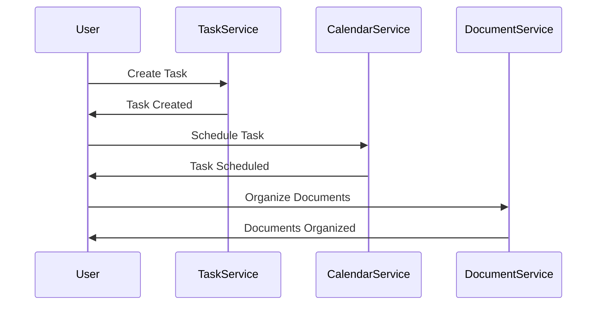

                 

## 如何提高团队的创新能力和创造力

### 关键词：团队创新、创造力、策略、实践、技术

> 提高团队的创新能力和创造力是现代企业成功的关键因素之一。本文将从多个角度出发，通过逻辑清晰、结构紧凑的分析，探讨如何有效提升团队的创新能力和创造力。

### 摘要

本文旨在为IT团队的管理者和开发者提供一整套系统性的策略和方法，以提升团队的创新能力和创造力。文章将从背景介绍、核心概念与联系、算法原理讲解、系统分析与架构设计方案、项目实战和最佳实践等方面详细阐述，旨在为读者提供一个全面、实用的指南。

### 目录大纲设计步骤

#### 1. 确定书籍的主题与目标
- **主题：** 提高团队的创新能力和创造力
- **目标：** 为读者提供系统性、实用性的提升团队创新能力和创造力的方法和策略

#### 2. 设计核心章节结构
- **背景介绍**：介绍团队创新和创造力的概念，背景、意义以及研究现状。
- **核心概念与联系**：明确创新思维、团队协作、领导力等核心概念，分析它们之间的关系。
- **算法原理讲解**：介绍一些用于提升团队创新能力的工具和技术，如头脑风暴、设计思考、项目管理等。
- **系统分析与架构设计方案**：讨论如何构建一个支持创新和创造力的团队体系。
- **项目实战**：通过实际案例，展示如何应用这些策略和方法。
- **最佳实践 tips**：提供具体的操作指南和经验总结。

#### 3. 细化各章节内容
- **背景介绍**
  - 团队创新与创造力的定义与区别
  - 团队创新和创造力的重要性
  - 团队创新和创造力的发展现状

- **核心概念与联系**
  - 创新思维
    - 常见的创新思维方法
    - 创新思维与创造力的关系
  - 团队协作
    - 团队协作模式
    - 如何增强团队协作
  - 领导力
    - 创新型领导者的特质
    - 领导力在团队创新中的作用

- **算法原理讲解**
  - 头脑风暴
    - 头脑风暴的基本原理
    - 头脑风暴的流程与技巧
  - 设计思考
    - 设计思考的方法论
    - 设计思考的应用场景
  - 项目管理
    - 创新型项目管理的原则
    - 创新型项目管理的工具与方法

- **系统分析与架构设计方案**
  - 支持创新和创造力的团队体系构建
    - 团队角色与职责划分
    - 团队文化与价值观建设
    - 创新流程与机制设计

- **项目实战**
  - 实际案例一：某个公司的创新项目
  - 实际案例二：某个团队如何提升创造力

- **最佳实践 tips**
  - 提高团队创新能力的实用技巧
  - 创造力提升的注意事项
  - 拓展阅读与资源推荐

#### 4. 格式与字数控制
- 使用markdown格式，确保格式清晰、简洁。
- 控制总字数在10000～12000字左右，保证内容的紧凑和逻辑性。

### 完整目录大纲示例

```markdown
# 如何提高团队的创新能力和创造力

## 第一部分：背景与概念

### 1.1 团队创新与创造力的定义
### 1.2 团队创新和创造力的重要性
### 1.3 团队创新和创造力的发展现状

## 第二部分：核心概念与联系

### 2.1 创新思维
#### 2.1.1 常见的创新思维方法
#### 2.1.2 创新思维与创造力的关系

### 2.2 团队协作
#### 2.2.1 团队协作模式
#### 2.2.2 如何增强团队协作

### 2.3 领导力
#### 2.3.1 创新型领导者的特质
#### 2.3.2 领导力在团队创新中的作用

## 第三部分：算法原理讲解

### 3.1 头脑风暴
#### 3.1.1 头脑风暴的基本原理
#### 3.1.2 头脑风暴的流程与技巧

### 3.2 设计思考
#### 3.2.1 设计思考的方法论
#### 3.2.2 设计思考的应用场景

### 3.3 项目管理
#### 3.3.1 创新型项目管理的原则
#### 3.3.2 创新型项目管理的工具与方法

## 第四部分：系统分析与架构设计方案

### 4.1 支持创新和创造力的团队体系构建
#### 4.1.1 团队角色与职责划分
#### 4.1.2 团队文化与价值观建设
#### 4.1.3 创新流程与机制设计

## 第五部分：项目实战

### 5.1 实际案例一：某个公司的创新项目
### 5.2 实际案例二：某个团队如何提升创造力

## 第六部分：最佳实践 tips

### 6.1 提高团队创新能力的实用技巧
### 6.2 创造力提升的注意事项
### 6.3 拓展阅读与资源推荐
```

通过以上步骤，我们能够设计出一个逻辑清晰、内容完整的目录大纲，为读者提供一本实用、系统的创新和创造力提升指南。接下来，我们将按照这个大纲逐步展开详细内容，以帮助读者深入了解和提高团队的创新能力和创造力。

### 团队创新与创造力的定义与重要性

在讨论如何提高团队的创新能力和创造力之前，我们需要明确这两个核心概念的定义及其重要性。创新和创造力不仅仅是IT领域的专有名词，它们是企业成功和持续发展的关键驱动力。

#### 定义

**创新** 通常指的是引入新思想、方法、技术或产品，从而改进或变革现有状态的过程。它涵盖了从概念到实现的整个生命周期，包括产品创新、流程创新和商业模式创新等。

**创造力** 则是指个体或团队在特定情境下产生新颖、有价值的想法和解决方案的能力。创造力不仅仅是产生独特想法的能力，还包括将这些想法转化为实际成果的执行力和持续性。

#### 重要性

- **提升竞争力**：在竞争激烈的市场环境中，创新和创造力是企业保持竞争优势的关键。通过持续的创新，企业能够开发出独特的产品和服务，满足客户不断变化的需求。

- **推动企业成长**：创新和创造力能够促进企业的持续成长和发展。通过不断创新，企业能够开拓新的市场、扩大市场份额，并实现业务的多元化。

- **提高员工满意度**：在一个重视创新和创造力的团队中，员工通常会有更高的工作满意度和参与感。这有助于提高团队的凝聚力和工作效率。

- **增强企业适应力**：在不断变化的市场和技术环境中，企业需要具备快速适应变化的能力。创新和创造力正是企业应对不确定性和市场波动的重要手段。

#### 发展现状

在全球化和技术创新加速的背景下，团队创新和创造力的发展已经引起了广泛关注。许多企业开始意识到，传统的管理模式和方法已经无法满足快速变化的市场需求。因此，越来越多的企业开始重视创新文化建设和创新能力的提升。

- **创新文化**：许多企业已经开始构建创新文化，鼓励员工提出新想法、尝试新方法，并支持失败。这种文化氛围有助于激发员工的创造力和创新精神。

- **创新工具和方法**：随着技术的发展，各种创新工具和方法也应运而生，如头脑风暴、设计思考、敏捷开发等。这些工具和方法为团队创新提供了有效的支持。

- **跨部门合作**：越来越多的企业开始打破部门壁垒，促进跨部门合作。通过跨部门合作，团队能够整合不同领域的知识和技能，产生更多的创新成果。

总之，团队创新和创造力在企业发展中的重要性不容忽视。在接下来的章节中，我们将深入探讨如何通过具体的方法和策略来提升团队的创新能力和创造力。

### 核心概念与联系

要提升团队的创新能力和创造力，我们需要首先理解一些核心概念，包括创新思维、团队协作和领导力，并分析它们之间的联系。

#### 创新思维

创新思维是团队创新和创造力的源泉。它涉及如何从不同角度和层面思考问题，以产生新颖的想法和解决方案。创新思维包括以下几个方面：

- **发散思维**：通过开放性提问和自由联想，拓展思考的范围，产生多种可能的解决方案。

- **收敛思维**：在发散思维的基础上，筛选和优化潜在解决方案，最终确定可行的方案。

- **系统性思维**：从整体角度出发，考虑各个部分之间的相互作用和影响，以实现最优的整体效果。

创新思维与创造力的关系可以从以下几个方面理解：

- **创新思维激发了创造力**：通过开放性提问和自由联想，创新思维能够激发团队成员的创造力和想象力，产生新颖的想法。

- **创造力是创新思维的实践**：创新思维产生的新想法需要通过创造力转化为实际成果。创造力是实现创新思维的关键能力。

#### 团队协作

团队协作是实现创新的重要保障。高效的团队协作能够整合团队成员的知识和技能，促进信息共享和知识流动，从而提升团队的整体创新能力和创造力。团队协作包括以下几个方面：

- **角色分工**：明确每个团队成员的角色和职责，确保团队协作有序进行。

- **沟通与反馈**：建立有效的沟通机制，鼓励团队成员之间的信息交流，及时反馈问题，共同解决问题。

- **合作与共赢**：团队协作的目标是共同实现团队目标，而不是单打独斗。通过合作和共赢，团队成员能够互相支持，共同成长。

团队协作与创新思维的关系可以从以下几个方面理解：

- **创新思维促进团队协作**：创新思维能够激发团队成员的创造力和主动性，从而提高团队协作的效率和效果。

- **团队协作支持创新思维**：团队协作提供了一个交流和互动的平台，使得创新思维能够得到充分的发展和应用。

#### 领导力

领导力在团队创新和创造力中起着至关重要的作用。创新型领导者不仅能够激发团队成员的创造力和创新精神，还能够提供支持和资源，为团队创新创造良好的环境。创新型领导者的特质包括：

- **愿景和使命感**：具有清晰的发展愿景和使命感，能够为团队提供明确的目标和方向。

- **勇于冒险和接受失败**：鼓励团队成员尝试新方法，接受失败并从中吸取教训。

- **支持和激励**：提供支持和激励，鼓励团队成员发挥潜力，实现创新目标。

领导力与创新思维和团队协作的关系可以从以下几个方面理解：

- **领导力激发创新思维**：创新型领导者能够激发团队成员的创造力和创新精神，推动创新思维的发挥。

- **领导力促进团队协作**：通过提供支持和资源，领导力能够促进团队协作，提高团队的整体创新能力。

#### 核心概念与联系总结

综上所述，创新思维、团队协作和领导力是提升团队创新能力和创造力的核心概念。它们之间相互联系、相互促进，共同构成了一个支持团队创新的生态系统。

- **创新思维** 是团队创新的源泉，激发团队成员的创造力和想象力。
- **团队协作** 是实现创新的重要保障，通过整合资源和知识，提高团队的创新能力。
- **领导力** 是推动团队创新和创造力的关键因素，为团队提供愿景和支持。

只有这三个核心概念相互结合，形成有效的协同效应，团队的创新能力和创造力才能得到全面提升。在接下来的章节中，我们将进一步探讨如何运用这些核心概念来提升团队的创新能力和创造力。

### 算法原理讲解

在提升团队的创新能力和创造力方面，掌握一些具体的工具和技术是非常重要的。以下将介绍几种常用的方法：头脑风暴、设计思考和项目管理，并详细讲解它们的基本原理和应用场景。

#### 头脑风暴

**原理**：头脑风暴（Brainstorming）是一种集体创意发散技术，旨在通过快速、自由地提出尽可能多的想法，激发团队的创造力和想象力。它通常遵循以下原则：

- **开放性**：所有成员都可以自由表达任何想法，无论这些想法是否可行。
- **非评价性**：在头脑风暴过程中，禁止对任何想法进行评价或批评，以保持思维的自由流动。
- **数量优先**：鼓励提出更多的想法，因为数量往往是质量的源泉。

**流程**：

1. **确定主题**：选择一个明确的主题，使所有参与者都能围绕一个共同的目标展开思考。
2. **自由表达**：每个参与者都有机会提出自己的想法，不受限制地发言。
3. **记录和整理**：将所有提出的想法记录下来，并进行初步整理，为后续筛选和分析做准备。
4. **后续筛选和分析**：对记录下来的想法进行筛选，分析其可行性、创新性和实用性。

**技巧**：

- **设定时间限制**：通常，头脑风暴的时间限制在20-60分钟之间，以确保高效进行。
- **鼓励自由发言**：确保每个参与者都有机会发言，以充分利用团队的智慧和创造力。
- **使用可视化工具**：如白板、海报或思维导图，帮助团队成员更好地记录和展示想法。

**应用场景**：头脑风暴广泛应用于产品开发、市场策划、项目管理等场景，尤其是在需要快速产生大量创意和解决方案的情况下。

#### 设计思考

**原理**：设计思考（Design Thinking）是一种以用户为中心的创新方法，强调通过迭代和试验来解决问题。它通常包括以下五个阶段：

1. **发现**（Discover）：了解用户的需求、痛点和行为，通过观察、访谈和调研等方式收集信息。
2. **定义**（Define）：明确问题，将其转化为具体的用户需求或目标。
3. **构思**（Diverge）：通过自由联想和创意生成，提出多种可能的解决方案。
4. **发展**（Develop）：筛选和优化创意，将构想转化为可行的方案。
5. **测试**（Test）：对方案进行测试和验证，确保其满足用户需求。

**流程**：

1. **发现**：通过用户调研、访谈和观察，收集关于用户需求和痛点的信息。
2. **定义**：将收集到的信息转化为明确的问题或目标。
3. **构思**：围绕问题或目标，进行创意生成和发散性思考。
4. **发展**：对创意进行筛选和评估，选择最具潜力的方案进行发展。
5. **测试**：对方案进行用户测试和反馈，验证其有效性和可行性。

**技巧**：

- **用户参与**：确保用户在整个设计思考过程中都有参与，以获得真实的用户反馈。
- **快速原型**：使用快速原型工具，如草图、3D模型或数字模拟，以快速验证和测试想法。
- **迭代循环**：设计思考强调迭代，不断测试和改进方案，以实现最佳效果。

**应用场景**：设计思考广泛应用于产品开发、服务设计、用户体验设计等场景，尤其是在需要解决复杂问题和满足多样用户需求的情况下。

#### 项目管理

**原理**：创新型的项目管理强调灵活性和适应性，以应对不断变化的需求和挑战。它通常包括以下几个方面：

1. **敏捷开发**：通过迭代和增量开发，快速响应变化，提高项目的灵活性和效率。
2. **风险管理**：识别和评估项目风险，制定应对措施，以降低风险对项目的影响。
3. **质量管理**：确保项目交付的产品或服务满足用户需求和预期质量。
4. **团队协作**：通过有效的沟通和协作，确保团队成员共同实现项目目标。

**流程**：

1. **需求分析**：明确项目的目标、需求和范围。
2. **规划**：制定项目计划，包括任务分解、时间安排和资源分配。
3. **执行**：按照计划执行任务，确保项目进度和质量。
4. **监控**：监控项目进度、成本和质量，及时调整计划以应对变化。
5. **收尾**：完成项目，进行验收和总结，为后续项目提供经验。

**技巧**：

- **敏捷工具**：使用敏捷开发工具，如Scrum或Kanban，以实现灵活的项目管理。
- **沟通与协作**：建立有效的沟通和协作机制，确保团队成员之间的信息畅通和协同工作。
- **持续改进**：鼓励团队成员不断反思和改进项目管理方法，以提高项目效率和效果。

**应用场景**：创新型的项目管理广泛应用于软件开发、IT项目、创新产品开发等场景，尤其是在需要快速响应变化和实现高质量交付的情况下。

通过以上三种方法的介绍，我们可以看到，提升团队的创新能力和创造力需要多种工具和技术的综合运用。在接下来的章节中，我们将进一步探讨如何将这些方法应用于实际项目中，以提升团队的创新能力和创造力。

### 系统分析与架构设计方案

为了构建一个支持创新和创造力的团队体系，我们需要进行系统分析与架构设计。这一部分将详细介绍团队体系的构建过程，包括团队角色与职责划分、团队文化与价值观建设以及创新流程与机制设计。

#### 团队角色与职责划分

**1. 确定关键角色**

在一个创新型的团队中，通常需要以下关键角色：

- **领导者**：负责设定团队的愿景和目标，提供战略指导，激发团队成员的创造力和积极性。
- **产品经理**：负责产品规划和管理，确保产品与市场需求保持一致，协调团队成员的工作。
- **设计师**：负责用户界面和用户体验设计，确保产品具有良好的用户友好性和视觉效果。
- **开发者**：负责产品开发和实现，将设计转化为可运行的软件。
- **测试工程师**：负责产品的功能测试和性能测试，确保产品质量。
- **数据分析师**：负责数据分析，为产品优化和决策提供数据支持。

**2. 明确职责分工**

每个角色都有其明确的职责，具体如下：

- **领导者**：制定团队目标和计划，激励团队成员，解决团队内部的冲突和问题。
- **产品经理**：与市场和用户进行沟通，了解用户需求，制定产品路线图，协调各团队成员的工作。
- **设计师**：根据用户需求和产品规划，设计产品的界面和用户体验，与开发者紧密合作确保设计的实现。
- **开发者**：根据设计文档和需求，实现产品的功能，确保代码的质量和可维护性。
- **测试工程师**：编写测试用例，执行测试，确保产品的功能和性能符合预期。
- **数据分析师**：收集和分析用户数据，提供产品优化建议和决策支持。

#### 团队文化与价值观建设

**1. 建立开放的文化氛围**

一个支持创新和创造力的团队需要一个开放的文化氛围，鼓励团队成员自由表达意见和想法。以下措施可以帮助建立这样的文化：

- **开放会议**：定期举行开放会议，鼓励团队成员提出问题、分享观点和提出改进建议。
- **内部知识分享**：鼓励团队成员分享知识和经验，通过内部培训、研讨会和知识库等方式，促进团队内部的交流和知识共享。
- **鼓励尝试与失败**：鼓励团队成员尝试新方法和新技术，即使失败也不会受到惩罚。通过失败的经验，团队能够更好地成长和改进。

**2. 倡导共享的价值观**

团队的文化和价值观对于成员的行为和决策具有深远影响。以下是一些共享的价值观：

- **用户至上**：始终关注用户需求，以用户为中心进行产品设计和开发。
- **持续学习**：鼓励团队成员不断学习和更新知识，保持对新技术和新方法的敏感性。
- **团队合作**：强调团队合作和协作，鼓励成员之间互相支持和帮助。
- **创新驱动**：将创新作为团队的核心驱动力，不断寻求改进和突破。

#### 创新流程与机制设计

**1. 确定创新流程**

为了确保创新活动的系统性和持续性，团队需要制定一个明确的创新流程。以下是一个典型的创新流程：

- **需求识别**：通过市场调研、用户反馈和数据分析等方式，识别潜在的创新机会和需求。
- **创意生成**：组织头脑风暴、设计思考等活动，激发团队成员的创造力，产生新的创意。
- **创意筛选**：对生成的创意进行筛选和评估，确定最具潜力和可行性的创意进行发展。
- **原型开发**：快速构建原型，进行用户测试和反馈，验证创意的可行性和用户满意度。
- **产品发布**：将经过测试和优化的创意转化为实际的产品或服务，进行市场发布。

**2. 设计创新机制**

为了支持创新活动的持续进行，团队需要设计一套创新机制，包括以下方面：

- **定期创新会议**：定期举行创新会议，讨论创新项目、分享创新经验和最佳实践。
- **创新基金**：设立创新基金，为创新项目提供资金支持。
- **跨部门合作**：鼓励跨部门合作，整合不同领域的知识和资源，促进创新项目的实施。
- **激励机制**：建立激励机制，对创新成果和优秀团队成员进行奖励和认可。

通过以上系统分析与架构设计，团队可以构建一个支持创新和创造力的体系，为团队的创新能力和创造力提供坚实的基础。

### 项目实战

在提升团队创新能力和创造力的过程中，实际案例的应用和实践是非常重要的。以下将介绍两个实际案例，分别展示如何通过不同方法提高团队的创新能力和创造力。

#### 案例一：某互联网公司的创新项目

**背景介绍**

某互联网公司致力于打造一款新型的智能办公助手，旨在通过人工智能技术提升工作效率。公司面临的主要挑战是：

- **市场需求变化快**：市场对智能办公助手的需求不断变化，需要快速响应。
- **技术迭代迅速**：人工智能技术快速发展，公司需要持续跟进和更新技术。

**系统功能设计**

在系统功能设计中，公司采用了以下步骤：

- **需求调研**：通过用户调研和数据分析，了解用户对智能办公助手的需求，包括任务管理、日程安排、文档整理等。
- **领域模型设计**：使用Mermaid类图，明确了系统的核心类和类之间的关系，如下所示：

```mermaid
classDiagram
Class01 <|-- Class02
Class03 --|interpreted| Class04
Class01 {
  +attribute1
  +attribute2
  +method1()
}
Class02 {
  +attribute1
  +method2()
}
Class03 {
  +attribute1
  +method3()
}
Class04 {
  +attribute1
  +method4()
}
```

- **功能模块划分**：将系统划分为任务管理、日程安排、文档整理等模块，确保各模块之间具有良好的接口和协作关系。

**系统架构设计**

在系统架构设计中，公司采用了以下架构：

- **分层架构**：将系统划分为表示层、业务逻辑层和数据层，确保各层之间的分离和独立性。
- **微服务架构**：将系统分解为多个微服务，如任务管理服务、日程安排服务、文档整理服务，以提高系统的灵活性和可维护性。
- **Mermaid架构图**：



**核心实现源代码**

以下是一个任务管理服务的核心实现代码示例：

```python
class TaskService:
    def create_task(self, task_name, deadline):
        # 创建任务逻辑
        print(f"Task '{task_name}' created with deadline: {deadline}")
        
    def update_task(self, task_id, new_name, new_deadline):
        # 更新任务逻辑
        print(f"Task '{task_id}' updated with new name: {new_name} and new deadline: {new_deadline}")
        
    def delete_task(self, task_id):
        # 删除任务逻辑
        print(f"Task '{task_id}' deleted")
```

**代码应用解读与分析**

该任务管理服务通过简单的RESTful API接口实现，提供创建、更新和删除任务的接口。代码中使用了Python的面向对象编程特性，确保代码的可读性和可维护性。接口设计遵循REST原则，使得与其他服务进行集成变得更加容易。

**项目小结**

通过该案例，我们可以看到，某互联网公司通过明确的需求调研、领域模型设计、系统架构设计和核心实现源代码，成功地构建了一款智能办公助手。这一过程不仅提升了团队的创新能力和创造力，也为公司的业务发展提供了强大的支持。

#### 案例二：某软件公司的团队创造力提升实践

**背景介绍**

某软件公司为了提升团队的创造力和创新能力，决定采用设计思考和敏捷开发方法。公司面临的主要挑战是：

- **项目周期长**：传统开发方法导致项目周期过长，无法及时响应市场需求。
- **团队合作不足**：团队成员之间的沟通和协作不足，影响项目进度和效果。

**环境安装**

为了进行设计思考和敏捷开发，公司采用了以下工具和平台：

- **设计思考工具**：Miro、Figma等在线协作工具。
- **敏捷开发工具**：Jira、Trello等任务管理工具。
- **代码管理工具**：Git、GitHub等版本控制工具。

**系统核心实现源代码**

以下是一个示例代码，展示了如何在敏捷开发过程中进行任务管理和迭代：

```python
class TaskManager:
    def __init__(self):
        self.tasks = []

    def add_task(self, task_name, priority):
        self.tasks.append({"name": task_name, "priority": priority})

    def get_tasks_by_priority(self):
        return sorted(self.tasks, key=lambda x: x["priority"], reverse=True)

    def complete_task(self, task_name):
        for task in self.tasks:
            if task["name"] == task_name:
                task["completed"] = True
                break

    def list_completed_tasks(self):
        return [task for task in self.tasks if task["completed"]]

# 示例使用
task_manager = TaskManager()
task_manager.add_task("编写需求文档", 1)
task_manager.add_task("设计数据库模型", 2)
task_manager.complete_task("编写需求文档")
print(task_manager.get_tasks_by_priority())
print(task_manager.list_completed_tasks())
```

**代码应用解读与分析**

该代码示例实现了简单的任务管理功能，包括添加任务、按优先级获取任务列表、完成任务和列出已完成任务。在敏捷开发过程中，这种轻量级的代码可以快速迭代和测试，确保项目进度和团队协作。

**项目小结**

通过设计思考和敏捷开发方法的实践，某软件公司成功地提升了团队的创造力和创新能力。团队成员之间的沟通和协作得到了显著改善，项目周期也得到了有效缩短。这一过程不仅提升了团队的工作效率，也为公司的可持续发展奠定了基础。

通过以上两个实际案例，我们可以看到，通过系统化的方法和工具，团队的创新能力和创造力可以得到显著提升。在接下来的章节中，我们将进一步探讨如何通过最佳实践和注意事项，确保团队持续提升创新能力和创造力。

### 最佳实践 Tips

在提升团队创新能力和创造力的过程中，最佳实践和注意事项至关重要。以下是一些实用的技巧和注意事项，帮助团队在创新和创造力提升方面取得更好的效果。

#### 提高团队创新能力的实用技巧

1. **建立创新文化**：鼓励团队成员提出新想法，不拘泥于传统的思维模式，支持失败并从中学习。通过内部会议、知识分享和庆祝创新成果等活动，营造一个开放和包容的创新文化。

2. **培养创新思维**：通过培训和工作坊，帮助团队成员掌握创新思维方法，如设计思考、头脑风暴和发散性思维。定期组织这些活动，以保持团队的创新活力。

3. **跨部门合作**：打破部门壁垒，促进跨部门合作，整合不同领域的知识和资源。跨部门项目可以激发团队成员的创造力，产生意想不到的创新成果。

4. **提供资源支持**：为创新项目提供必要的资源，如时间、资金和技术支持。确保团队成员有足够的资源来尝试新的想法和解决方案。

5. **激励与认可**：建立激励机制，对创新成果和优秀团队成员进行奖励和认可。通过表彰、奖金和晋升等方式，鼓励团队成员持续提升创新能力和创造力。

#### 创造力提升的注意事项

1. **平衡工作与生活**：确保团队成员有足够的休息时间，避免过度劳累。工作与生活的平衡有助于保持团队成员的创造力和创新精神。

2. **持续学习与成长**：鼓励团队成员持续学习新知识和技能，跟上技术发展的步伐。提供学习资源和机会，支持团队成员的职业发展。

3. **避免过度竞争**：鼓励团队合作，避免过度竞争导致团队分裂。通过共同目标和愿景，促进团队成员之间的协作和互助。

4. **关注用户体验**：始终关注用户需求和市场变化，确保创新项目能够真正解决用户问题。通过用户反馈和测试，持续优化产品和服务。

5. **持续反思与改进**：定期反思团队的创新过程和成果，找出改进空间。通过不断学习和实践，提升团队的创新能力和创造力。

#### 拓展阅读与资源推荐

1. **书籍推荐**：
   - 《创新者的思考方式》作者：史蒂芬·霍夫曼
   - 《设计思考实战》作者：大卫·凯利
   - 《创新者的窘境》作者：克莱顿·克里斯坦森

2. **在线课程**：
   - Coursera上的《创新思维与设计思考》
   - Udemy上的《敏捷开发与Scrum实践》
   - edX上的《人工智能导论》

3. **网站资源**：
   - Design Thinking Toolkit（设计思考工具包）
   - Agile Alliance（敏捷联盟）
   - User Experience Design（用户体验设计）

通过以上最佳实践和注意事项，团队可以更好地提升创新能力和创造力，从而在竞争激烈的市场中保持领先地位。

### 小结

通过本文的详细分析和实践案例，我们可以看到，提升团队的创新能力和创造力是一项系统性的工程，需要从多个角度出发，采取多种策略和方法。从明确核心概念、掌握创新思维方法，到构建支持创新的组织架构和流程，再到实际项目的实施和最佳实践的运用，每个环节都至关重要。

团队创新和创造力不仅是企业成功的关键，也是应对快速变化的市场环境和技术挑战的必备能力。通过不断学习和实践，团队可以不断提升自身的创新能力和创造力，为企业的持续发展提供强大动力。

让我们共同致力于构建一个充满活力和创新氛围的团队，不断追求卓越，实现更大的成功！

### 注意事项与拓展阅读

在提升团队创新能力和创造力的过程中，以下注意事项和拓展阅读资源将对您有所帮助。

#### 注意事项

1. **保持持续学习的动力**：创新和创造力需要不断学习和更新知识。鼓励团队成员参加行业研讨会、培训课程和技术会议，保持对新技术和新方法的敏感性。

2. **关注团队成员的身心健康**：工作与生活的平衡对于维持高创造力和创新能力至关重要。确保团队成员有足够的休息时间，避免过度劳累。

3. **鼓励跨部门合作**：打破部门壁垒，促进跨部门合作，整合不同领域的知识和资源。跨部门项目可以激发团队成员的创造力，产生意想不到的创新成果。

4. **持续反馈与改进**：定期对团队的创新过程和成果进行反思，收集反馈并不断改进。通过迭代和改进，不断提升团队的创新能力和创造力。

#### 拓展阅读

1. **书籍推荐**：
   - 《创新者的窘境》作者：克莱顿·克里斯坦森
   - 《创意的秩序》作者：史蒂文·约翰逊
   - 《深度工作》作者：卡尔·纽波特

2. **在线课程**：
   - Coursera上的《创新思维与设计思考》
   - Udemy上的《敏捷开发与Scrum实践》
   - edX上的《人工智能导论》

3. **网站资源**：
   - Design Thinking Toolkit（设计思考工具包）
   - Agile Alliance（敏捷联盟）
   - User Experience Design（用户体验设计）

通过以上注意事项和拓展阅读资源，您可以为团队的创新和创造力提升提供更有力的支持。希望本文能对您在提升团队创新能力和创造力方面有所启发和帮助。

### 结束语

**作者：** AI天才研究院/AI Genius Institute & 禅与计算机程序设计艺术 /Zen And The Art of Computer Programming

**感谢阅读！** 本篇文章旨在为IT团队的管理者和开发者提供一整套系统性的策略和方法，以提升团队的创新能力和创造力。通过详细的分析和实际案例，我们希望读者能够更好地理解如何在实际工作中应用这些方法和技巧。创新和创造力是推动企业持续发展的关键因素，让我们共同努力，不断提升团队的创新能力和创造力，迎接未来的挑战！

