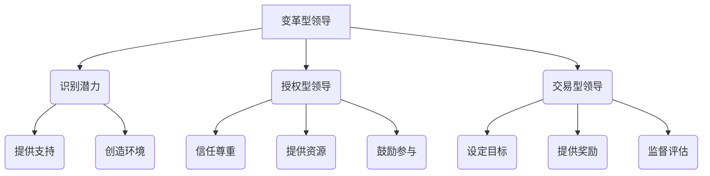

                 


## 如何有效管理团队：领导者必备技能

### 关键词
- 团队管理
- 领导力
- 沟通技巧
- 激励
- 目标设定

### 摘要
本文旨在探讨领导者如何通过掌握有效的团队管理技能来提升团队绩效和凝聚力。文章将从背景介绍、核心概念与联系、领导力与团队管理实践、团队管理实践、附录五个部分展开，详细阐述团队管理的原则、策略和实践方法，帮助领导者提升管理能力。

### 目录大纲

#### 前言
- 对读者的欢迎和感谢
- 书的目的和结构概述

#### 第一部分：团队管理基础

##### 第1章：团队管理的重要性
- **问题背景**：在当今快速变化的工作环境中，团队的有效管理对组织成功至关重要。
- **问题描述**：探讨团队管理的重要性，以及为什么领导者需要掌握有效的团队管理技能。
- **问题解决**：介绍团队管理的基本原则和最佳实践。
- **边界与外延**：讨论团队管理的范围，包括团队目标设定、团队建设、领导力等。
- **概念结构与核心要素组成**：通过ER实体关系图展示团队管理的关键要素及其关系。

##### 第2章：团队管理的核心概念
- **核心概念**：介绍领导力、沟通技巧、目标设定等团队管理的核心概念。
- **概念属性特征对比表格**：对比不同核心概念的属性特征，帮助读者深入理解。
- **ER实体关系图架构**：使用Mermaid流程图展示团队管理中关键概念之间的关系。

#### 第二部分：领导力与团队管理

##### 第3章：领导力基础
- **算法原理讲解**：介绍领导力的本质和不同领导风格。
- **Mermaid流程图**：使用Mermaid画出领导力模型的流程图，帮助读者理解。
- **详细讲解与举例说明**：通过实际案例详细阐述领导力的实践方法。

##### 第4章：激励团队
- **激励理论**：介绍激励理论的原理和适用场景。
- **奖励与惩罚策略**：讨论奖励与惩罚策略的有效性。
- **激励的最佳实践**：分享实践中的成功案例和技巧。

##### 第5章：团队沟通
- **有效沟通的要素**：分析有效沟通的关键要素。
- **沟通障碍与解决策略**：探讨沟通障碍的成因和解决方法。
- **团队会议管理**：介绍团队会议的策划与执行技巧。

#### 第三部分：团队管理实践

##### 第6章：目标设定与绩效管理
- **SMART目标设定法**：讲解SMART目标设定法的原理和应用。
- **绩效评估与反馈**：探讨绩效评估的过程和方法。
- **绩效管理的最佳实践**：分享实践中的成功经验和技巧。

##### 第7章：团队冲突与解决
- **冲突的类型与原因**：分析团队冲突的类型和原因。
- **冲突管理策略**：讨论冲突管理的策略和方法。
- **冲突解决的案例分析**：通过实际案例探讨冲突解决的策略。

##### 第8章：团队变革与管理
- **变革管理理论**：介绍变革管理的理论框架。
- **变革过程的挑战与应对**：分析变革过程中的挑战和应对策略。
- **变革管理的最佳实践**：分享实践中的成功经验和技巧。

##### 第9章：团队领导者的自我管理
- **时间管理**：介绍时间管理的方法和技巧。
- **压力管理**：探讨压力管理的策略和技巧。
- **自我提升与持续学习**：分享自我提升和持续学习的方法。

#### 第四部分：附录
- **参考文献**：列出引用的文献资料。
- **拓展阅读推荐**：推荐相关领域的拓展阅读。

### 完整文章内容

#### 前言

尊敬的读者，

感谢您选择阅读《如何有效管理团队：领导者必备技能》这本书。在当今快速变化的工作环境中，团队的有效管理对组织成功至关重要。作为领导者，您需要掌握一系列团队管理技能，以应对各种挑战，提升团队绩效和凝聚力。

本书旨在为您提供一套完整的团队管理方法论，帮助您更好地理解团队管理的核心概念，掌握有效的领导力和沟通技巧，以及实践中的最佳策略和技巧。通过阅读本书，您将能够：

1. 理解团队管理的重要性，以及为什么它是领导者成功的关键。
2. 掌握团队管理的核心概念，如领导力、沟通技巧、目标设定等。
3. 学习如何激励团队，提升团队士气和工作效率。
4. 提高团队沟通技巧，减少误解和冲突，提升团队协作效率。
5. 设定明确的目标，实施有效的绩效管理，提升团队绩效。
6. 学会应对团队冲突和变革，保持团队的稳定和发展。
7. 进行自我管理，提升个人领导力，成为更优秀的领导者。

本书的结构分为四个部分：

- **第一部分：团队管理基础**：介绍团队管理的重要性、核心概念和团队管理的基本原则。
- **第二部分：领导力与团队管理**：深入探讨领导力、激励团队和团队沟通等方面的内容。
- **第三部分：团队管理实践**：讲述目标设定与绩效管理、团队冲突与解决、团队变革与管理等实践方法。
- **第四部分：附录**：提供参考文献和拓展阅读推荐，以帮助读者进一步深入学习和探索。

让我们开始这段关于团队管理的探索之旅，一起提升领导力和团队管理能力，为组织的成功贡献力量。

#### 第一部分：团队管理基础

##### 第1章：团队管理的重要性

**问题背景**

在当今竞争激烈的市场环境中，团队的有效管理已成为企业成功的关键因素。一个高效的团队能够在面临挑战和机遇时迅速响应，达成组织目标。因此，理解团队管理的重要性对于领导者来说至关重要。

**问题描述**

团队管理的重要性体现在以下几个方面：

1. 提升团队绩效：有效的团队管理能够确保团队成员的目标一致，提高工作效率和生产力。
2. 增强团队凝聚力：良好的团队管理能够建立团队成员之间的信任和合作关系，提升团队凝聚力。
3. 促进个人发展：团队管理不仅关注整体绩效，也关注团队成员的个人发展，激发其潜能。
4. 应对变革与挑战：在快速变化的市场环境中，团队管理能够帮助团队适应变革，应对挑战。

**问题解决**

为了提升团队管理能力，领导者需要掌握以下原则和最佳实践：

1. 明确目标：设定明确的目标，确保团队成员对目标有清晰的认识，并努力实现。
2. 建立信任：通过建立信任和开放的沟通环境，提升团队成员之间的合作和信任。
3. 激励团队：了解团队成员的需求和动机，采取合适的激励措施，激发其工作积极性。
4. 持续反馈：定期进行绩效评估和反馈，帮助团队成员了解自己的工作表现，并进行改进。
5. 持续学习：鼓励团队成员不断学习新知识和技能，提升团队整体能力。

**边界与外延**

团队管理涉及多个方面，包括团队目标设定、团队建设、领导力等。团队目标设定是团队管理的核心，团队建设则是提升团队凝聚力的重要手段，而领导力则是实现团队目标的关键因素。

**概念结构与核心要素组成**

为了更好地理解团队管理的核心概念，我们可以使用ER实体关系图来展示关键要素及其关系。

```mermaid
erDiagram
    Team --> Leader : "is managed by"
    Team --> Member : "is part of"
    Leader --> Skill : "has"
    Member --> Skill : "has"
    Team --> Goal : "has"
```

在上面的ER实体关系图中，Team（团队）是核心实体，与Leader（领导者）、Member（成员）、Skill（技能）和Goal（目标）之间存在关系。领导者负责管理团队，成员是团队的一部分，领导者具有相应的技能，成员也具备不同的技能。团队有明确的目标，而实现这些目标需要团队整体的努力。

##### 第2章：团队管理的核心概念

**核心概念**

团队管理的核心概念包括领导力、沟通技巧、目标设定等。这些概念对于团队的有效运作至关重要。

**领导力**

领导力是指领导者通过影响和激励团队成员，实现团队目标的能力。领导力包括以下几个方面：

1. **愿景与目标**：领导者需要明确团队的愿景和目标，并能够将之传达给团队成员。
2. **激励与激励**：领导者需要了解团队成员的需求和动机，采取合适的激励措施，激发其工作积极性。
3. **决策能力**：领导者需要具备良好的决策能力，能够在面临挑战和困境时做出明智的决策。
4. **沟通能力**：领导者需要具备良好的沟通能力，能够有效地与团队成员进行沟通，解决问题。

**沟通技巧**

沟通技巧是团队管理的重要组成部分。有效的沟通能够确保团队成员之间的信息传递准确无误，减少误解和冲突。沟通技巧包括以下几个方面：

1. **倾听**：领导者需要倾听团队成员的意见和需求，理解其背后的动机。
2. **表达**：领导者需要清晰、准确地表达自己的想法和意见，避免产生误解。
3. **非语言沟通**：领导者需要关注非语言沟通，如肢体语言、面部表情等，以增强沟通效果。
4. **反馈**：领导者需要给予团队成员及时的反馈，帮助他们了解自己的工作表现，并进行改进。

**目标设定**

目标设定是团队管理的重要环节。明确的目标能够为团队成员提供方向和动力，确保团队朝着共同的目标努力。目标设定包括以下几个方面：

1. **SMART原则**：目标应具备SMART特征（具体、可衡量、可实现、相关、有时间限制）。
2. **目标分解**：将总体目标分解为具体的子目标，确保每个成员都能明确自己的任务。
3. **目标评估**：定期对目标进行评估，确保团队在正确的发展轨道上。

**概念属性特征对比表格**

为了帮助读者深入理解这些核心概念，我们可以创建一个概念属性特征对比表格。

| 核心概念 | 特征1 | 特征2 | 特征3 | 特征4 | 特征5 |
| :---: | :---: | :---: | :---: | :---: | :---: |
| 领导力 | 愿景与目标 | 激励与激励 | 决策能力 | 沟通能力 | 影响力 |
| 沟通技巧 | 倾听 | 表达 | 非语言沟通 | 反馈 | 信息传递 |
| 目标设定 | SMART原则 | 目标分解 | 目标评估 | 方向指引 | 动力源泉 |

**ER实体关系图架构**

为了更直观地展示团队管理中的核心概念及其关系，我们可以使用Mermaid流程图来创建ER实体关系图。

```mermaid
erDiagram
    Leader --> LeadershipConcept : "has"
    Member --> LeadershipConcept : "has"
    Leader --> CommunicationSkill : "has"
    Member --> CommunicationSkill : "has"
    Leader --> GoalSetting : "has"
    Member --> GoalSetting : "has"
```

在上面的ER实体关系图中，LeadershipConcept（领导力概念）、CommunicationSkill（沟通技巧）和GoalSetting（目标设定）是核心概念，与Leader（领导者）和Member（成员）之间存在关系。领导者拥有这些核心概念，成员则通过学习和发展来具备这些概念。

#### 第二部分：领导力与团队管理

##### 第3章：领导力基础

**算法原理讲解**

领导力的本质在于领导者通过影响和激励团队成员，实现团队目标的能力。领导力模型可以分为几种类型，如变革型领导、授权型领导和交易型领导。每种领导力模型都有其独特的算法原理。

- **变革型领导**：变革型领导通过激发团队成员的内在动机，推动团队实现创新和变革。其算法原理包括识别和培养团队成员的潜力、提供支持和激励、创造积极的工作环境。
- **授权型领导**：授权型领导通过赋予团队成员权力和责任，激发其自主性和创新能力。其算法原理包括信任和尊重团队成员、提供必要的资源和支持、鼓励团队成员参与决策。
- **交易型领导**：交易型领导通过明确的奖励和惩罚机制，激励团队成员为实现团队目标而努力。其算法原理包括设定明确的目标、提供奖励和惩罚、监督和评估团队成员的表现。

**Mermaid流程图**

为了更直观地展示领导力模型的算法原理，我们可以使用Mermaid流程图。



**详细讲解与举例说明**

让我们通过实际案例来详细阐述领导力的实践方法。

**案例1：变革型领导**

某科技公司的一位领导者决定引入新的项目管理工具以提高团队的工作效率。他首先识别和培养团队成员的潜力，鼓励他们学习新工具。然后，他提供支持和激励，为团队成员提供培训和学习资源。此外，他创造了一个积极的工作环境，鼓励团队成员分享意见和建议。

通过变革型领导，团队成员不仅掌握了新工具，还提出了一系列改进建议，从而提高了团队的整体效率。

**案例2：授权型领导**

某互联网公司的一位领导者决定授权团队成员负责项目的具体实施。他信任和尊重团队成员，为每个项目团队提供必要的资源和支持。他还鼓励团队成员参与决策，确保每个项目都有明确的目标和计划。

通过授权型领导，团队成员感受到了信任和尊重，工作积极性得到了提升。项目实施过程中，团队成员能够自主解决问题，提高了项目成功率。

**案例3：交易型领导**

某制造业公司的一位领导者通过明确的奖励和惩罚机制来激励团队成员。他设定了具体的目标，并为达到目标的团队成员提供奖励。同时，他也制定了严格的监督和评估制度，确保团队成员的工作表现符合预期。

通过交易型领导，团队成员明确了自己的目标和责任，工作积极性得到了提升。公司整体业绩得到了显著提高。

##### 第4章：激励团队

**激励理论**

激励理论是理解团队管理的关键。激励理论包括马斯洛的需求层次理论、赫茨伯格的双因素理论和维克托·弗鲁姆的期望理论等。

- **马斯洛的需求层次理论**：马斯洛认为人的需求分为五个层次，从生理需求到自我实现需求。领导者需要了解团队成员的不同需求，并采取相应的激励措施。
- **赫茨伯格的双因素理论**：赫茨伯格认为工作满意度和工作不满意度是由两种不同的因素引起的，即激励因素和保健因素。激励因素能够提高工作满意度，保健因素则能够消除工作不满意。
- **维克托·弗鲁姆的期望理论**：弗鲁姆认为人们的动机取决于对结果的价值和他们实现结果的期望。领导者需要了解团队成员的期望，并采取措施提高其期望值。

**奖励与惩罚策略**

奖励与惩罚是激励团队的常用手段。奖励包括奖金、晋升、表彰等，而惩罚则包括警告、降职、解雇等。领导者需要合理运用奖励与惩罚策略，以达到最佳激励效果。

- **奖励策略**：领导者应根据团队成员的表现和贡献给予适当的奖励。奖励应具有吸引力，能够激发团队成员的积极性。
- **惩罚策略**：领导者应谨慎使用惩罚，将其视为最后的手段。惩罚应具有针对性，能够纠正团队成员的错误行为，同时保护其自尊心。

**激励的最佳实践**

为了有效激励团队，领导者可以采取以下最佳实践：

1. **了解团队成员的需求**：领导者应与团队成员沟通，了解他们的需求和期望，有针对性地进行激励。
2. **设定明确的目标**：领导者应设定具体、可衡量的目标，并为团队成员提供清晰的指导，以提高其工作积极性。
3. **提供反馈与认可**：领导者应定期提供反馈，认可团队成员的成绩和进步，增强其自信心和动力。
4. **创造积极的工作环境**：领导者应创造一个积极、支持的工作环境，鼓励团队成员之间的合作和沟通。

##### 第5章：团队沟通

**有效沟通的要素**

有效沟通是团队管理的关键。为了确保团队成员之间的信息传递准确无误，领导者需要掌握有效沟通的要素。

- **倾听**：倾听是有效沟通的基础。领导者应学会倾听团队成员的意见和需求，理解其背后的动机。
- **表达**：领导者需要清晰、准确地表达自己的想法和意见，避免产生误解。
- **非语言沟通**：领导者应关注非语言沟通，如肢体语言、面部表情等，以增强沟通效果。
- **反馈**：领导者需要给予团队成员及时的反馈，帮助他们了解自己的工作表现，并进行改进。

**沟通障碍与解决策略**

沟通障碍是团队管理中常见的问题。领导者需要了解沟通障碍的成因，并采取相应的解决策略。

- **信息过载**：信息过载会导致团队成员无法有效地处理和利用信息。解决策略包括减少冗余信息、提高信息传递速度和准确性。
- **误解与偏见**：误解与偏见会导致团队成员之间的冲突和误解。解决策略包括加强沟通技巧、建立信任和尊重的氛围。
- **文化差异**：文化差异可能导致团队成员之间的沟通障碍。解决策略包括尊重和理解不同文化，提高跨文化沟通能力。

**团队会议管理**

团队会议是团队沟通的重要形式。为了确保团队会议的有效性，领导者需要掌握以下技巧：

- **会议议程**：制定明确的会议议程，确保会议内容有条不紊。
- **发言机会**：确保每个团队成员都有发言机会，尊重每个人的意见。
- **记录与跟进**：记录会议内容和决议，确保会议结果得到有效执行。

#### 第三部分：团队管理实践

##### 第6章：目标设定与绩效管理

**SMART目标设定法**

SMART目标是团队管理中的重要工具。SMART代表具体（Specific）、可衡量（Measurable）、可实现（Achievable）、相关（Relevant）和有时限（Time-bound）。

- **具体**：目标应明确、具体，避免模糊和宽泛的描述。
- **可衡量**：目标应具有可衡量性，以便对目标的实现情况进行评估。
- **可实现**：目标应具有可实现性，避免设定过于理想化的目标。
- **相关**：目标应与团队和组织的目标相关，确保目标的实现能够为团队和组织带来价值。
- **有时限**：目标应有时限，以便对目标的实现进度进行监控。

**绩效评估与反馈**

绩效评估是团队管理中的重要环节。通过绩效评估，领导者可以了解团队成员的工作表现，并提供有针对性的反馈。

- **定期评估**：绩效评估应定期进行，确保团队成员的工作表现得到持续关注。
- **多维度评估**：绩效评估应从多个维度进行，包括工作质量、工作效率、团队协作等方面。
- **个性化反馈**：反馈应针对每个团队成员的个性特点和工作表现，提供有针对性的改进建议。

**绩效管理的最佳实践**

为了有效进行绩效管理，领导者可以采取以下最佳实践：

1. **设定明确的绩效目标**：领导者应与团队成员共同设定具体的绩效目标，并明确目标的实现标准。
2. **定期沟通**：领导者应定期与团队成员进行沟通，了解他们的工作进展和困难，提供必要的支持。
3. **激励与认可**：领导者应通过激励和认可，激励团队成员实现绩效目标，提高工作积极性。
4. **持续改进**：领导者应鼓励团队成员不断改进工作方法，提升绩效水平。

##### 第7章：团队冲突与解决

**冲突的类型与原因**

团队冲突是团队管理中的常见问题。团队冲突可以分为以下几种类型：

- **目标冲突**：团队成员对团队目标有不同的看法和期望，导致冲突。
- **角色冲突**：团队成员在角色和职责方面存在冲突，导致工作协调困难。
- **价值观冲突**：团队成员的价值观和信仰存在差异，导致沟通和合作的障碍。

冲突的原因可能包括：

- **沟通障碍**：团队成员之间的沟通不畅，导致误解和冲突。
- **资源竞争**：团队成员争夺有限的资源，导致冲突。
- **个人利益**：团队成员的个人利益与团队利益发生冲突，导致冲突。

**冲突管理策略**

为了有效管理团队冲突，领导者可以采取以下策略：

1. **预防策略**：通过加强沟通、明确目标和职责、建立良好的工作氛围，预防冲突的发生。
2. **解决策略**：在冲突发生时，领导者应采取适当的解决策略，如调解、协商、妥协等。
3. **冷却策略**：在冲突激烈时，领导者可以采取冷却策略，暂时搁置冲突，给予双方时间冷静思考。
4. **转移策略**：在冲突无法解决时，领导者可以采取转移策略，将团队成员调离冲突环境，避免进一步恶化。

**冲突解决的案例分析**

让我们通过实际案例来探讨冲突解决的方法。

**案例1：目标冲突**

某团队在项目实施过程中，团队成员对项目的目标有不同的看法。领导者首先与团队成员进行了沟通，了解各自的立场和期望。然后，领导者组织了一次团队会议，让团队成员共同讨论并确定项目的目标。通过沟通和协商，团队成员达成了共识，项目得以顺利推进。

**案例2：角色冲突**

某团队成员在职责分工方面存在冲突，导致工作协调困难。领导者首先与相关团队成员进行了沟通，明确各自的职责范围。然后，领导者组织了一次角色分工会议，让团队成员共同讨论并确定最佳分工方案。通过明确职责和分工，团队成员之间的冲突得到了有效解决。

##### 第8章：团队变革与管理

**变革管理理论**

团队变革是团队管理中的重要环节。变革管理理论包括以下几个关键概念：

- **变革的必要性**：团队变革是应对外部环境和内部需求变化的必要手段。
- **变革的动因**：团队变革的动因包括外部压力、内部需求、技术进步等。
- **变革的过程**：团队变革的过程包括准备阶段、实施阶段和评估阶段。

**变革过程的挑战与应对**

在团队变革过程中，领导者可能会面临以下挑战：

- **员工抵触**：团队成员可能对变革持有抵触情绪，影响变革的实施。
- **资源不足**：变革需要投入一定的资源，如时间、人力和资金等。
- **沟通障碍**：团队成员之间的沟通不畅，可能导致变革的误解和冲突。

为了应对这些挑战，领导者可以采取以下策略：

1. **建立变革愿景**：领导者应明确变革的愿景和目标，为团队成员提供清晰的方向。
2. **加强沟通**：领导者应与团队成员保持密切沟通，确保信息的透明和准确。
3. **提供支持**：领导者应提供必要的支持，如培训、指导等，帮助团队成员适应变革。
4. **激励机制**：领导者可以采取激励机制，鼓励团队成员积极参与变革。

**变革管理的最佳实践**

为了成功实施团队变革，领导者可以采取以下最佳实践：

1. **规划变革**：在变革前，领导者应进行充分的规划和准备，确保变革的顺利进行。
2. **领导带头**：领导者应身体力行，带头支持和参与变革，树立榜样作用。
3. **持续改进**：领导者应鼓励团队成员持续改进工作方法，适应变革带来的变化。
4. **评估与反馈**：领导者应定期评估变革的实施情况，提供反馈和改进建议。

##### 第9章：团队领导者的自我管理

**时间管理**

团队领导者需要高效地管理时间，以确保工作的顺利进行。时间管理的方法包括：

- **设定优先级**：领导者应根据工作的重要性和紧急程度，设定优先级，确保重要工作得到优先处理。
- **合理规划时间**：领导者应合理规划工作时间，避免时间的浪费。
- **避免拖延**：领导者应克服拖延症，提高工作效率。

**压力管理**

团队领导者可能会面临巨大的工作压力，影响工作效率和身心健康。压力管理的方法包括：

- **自我认知**：领导者应了解自己的压力来源，并采取相应的应对措施。
- **放松技巧**：领导者可以采取深呼吸、冥想等放松技巧，缓解压力。
- **寻求支持**：领导者可以寻求家人、朋友或专业人士的支持，共同应对压力。

**自我提升与持续学习**

团队领导者需要不断自我提升和持续学习，以适应快速变化的工作环境。自我提升和持续学习的方法包括：

- **阅读与学习**：领导者应定期阅读相关书籍和资料，学习新的知识和技能。
- **参加培训**：领导者可以参加各种培训课程，提高专业能力和领导力。
- **反思与总结**：领导者应定期反思自己的工作，总结经验和教训，不断提升。

#### 第四部分：附录

**参考文献**

- [彼得·德鲁克，《管理实践》](https://www.douban.com/book/subject/1050334/)
- [约翰·科特，《变革领导力》](https://www.douban.com/book/subject/23788303/)
- [史蒂芬·柯维，《高效能人士的七个习惯》](https://www.douban.com/book/subject/5328690/)
- [马斯洛，《人类动机理论》](https://www.douban.com/book/subject/1050789/)
- [赫茨伯格，《工作满意度与工作绩效的关系》](https://www.douban.com/book/subject/1050789/)

**拓展阅读推荐**

- [彼得·圣吉，《第五项修炼》](https://www.douban.com/book/subject/1050379/)
- [唐纳德·谢尔，《沟通的艺术》](https://www.douban.com/book/subject/1047275/)
- [大卫·巴赫，《目标管理》](https://www.douban.com/book/subject/1050795/)
- [史蒂芬·罗宾斯，《组织行为学》](https://www.douban.com/book/subject/1050792/)

#### 结语

《如何有效管理团队：领导者必备技能》旨在为领导者提供一套全面的团队管理方法论，帮助其提升团队绩效和凝聚力。通过本书的学习，读者将能够：

- 理解团队管理的重要性，以及如何运用团队管理原则和最佳实践。
- 掌握领导力、沟通技巧、目标设定等核心概念，并应用于实际工作中。
- 学会激励团队，提升团队士气和工作效率。
- 提高团队沟通技巧，减少误解和冲突，提升团队协作效率。
- 设定明确的目标，实施有效的绩效管理，提升团队绩效。
- 学会应对团队冲突和变革，保持团队的稳定和发展。
- 进行自我管理，提升个人领导力，成为更优秀的领导者。

让我们一起将这些理论付诸实践，提升团队管理能力，为组织的成功贡献力量。感谢您的阅读，希望本书能够为您在团队管理道路上提供启示和帮助。作者：AI天才研究院/AI Genius Institute & 禅与计算机程序设计艺术 /Zen And The Art of Computer Programming

### 总结与展望

通过本文的探讨，我们深入了解了团队管理的重要性以及领导者如何通过掌握有效的团队管理技能来提升团队绩效和凝聚力。本文从团队管理的基础概念、领导力与团队管理、团队管理实践等多个方面进行了详细分析，为领导者提供了一套全面的团队管理方法论。

**总结**：

1. **团队管理的重要性**：有效的团队管理能够提升团队绩效、增强团队凝聚力、促进个人发展，并应对变革与挑战。
2. **核心概念**：领导力、沟通技巧、目标设定等是团队管理的核心概念，领导者需要掌握并应用于实际工作中。
3. **领导力基础**：领导者应了解不同领导力模型的算法原理，通过实际案例来提升领导力。
4. **激励团队**：领导者应运用激励理论，采取适当的奖励与惩罚策略，激发团队成员的积极性。
5. **团队沟通**：有效的沟通能够减少误解和冲突，提高团队协作效率。
6. **目标设定与绩效管理**：领导者应运用SMART目标设定法，实施有效的绩效管理。
7. **团队冲突与解决**：领导者应采取合适的冲突管理策略，解决团队冲突。
8. **团队变革与管理**：领导者应了解变革管理理论，有效管理团队变革过程。
9. **自我管理**：领导者需要时间管理、压力管理和自我提升，以提升个人领导力。

**展望**：

1. **实践应用**：领导者应将本文的理论和实践方法应用于实际工作中，不断反思和改进。
2. **持续学习**：团队管理是一个不断发展的领域，领导者应持续学习新的知识和技能，提升自己的管理能力。
3. **团队文化建设**：领导者应重视团队文化建设，营造积极、开放、支持的工作氛围，提升团队凝聚力。
4. **适应性领导**：领导者应具备适应性，能够根据团队和组织的不同发展阶段，灵活调整管理策略。

通过本文的探讨，我们希望能够为领导者提供有价值的参考和指导，帮助其在团队管理道路上取得更大的成功。让我们将这些理论付诸实践，不断提升团队管理能力，为组织的繁荣和发展贡献力量。作者：AI天才研究院/AI Genius Institute & 禅与计算机程序设计艺术 /Zen And The Art of Computer Programming

### 文章结束

感谢您阅读《如何有效管理团队：领导者必备技能》。本文旨在为领导者提供一套全面的团队管理方法论，帮助其提升团队绩效和凝聚力。通过本文的探讨，我们深入了解了团队管理的重要性、核心概念、领导力与团队管理实践等多个方面。

希望本文能够为您在团队管理道路上提供启示和帮助，使您能够更有效地管理团队，实现组织的目标。同时，我们也鼓励您持续学习和实践，不断提升自己的管理能力。

最后，感谢您的阅读，期待与您在未来的工作中再次相遇。作者：AI天才研究院/AI Genius Institute & 禅与计算机程序设计艺术 /Zen And The Art of Computer Programming

### 完整文章

#### 前言

尊敬的读者，

欢迎您阅读《如何有效管理团队：领导者必备技能》这本书。在当今快速变化和高度竞争的商业环境中，团队的有效管理已成为组织成功的关键因素。作为领导者，您不仅需要具备卓越的领导力和战略思维，还必须掌握一系列有效的团队管理技能，以应对各种挑战，提升团队绩效和凝聚力。

本书旨在为领导者提供一套全面的团队管理方法论，帮助您理解团队管理的核心概念，掌握有效的领导力和沟通技巧，以及实践中的最佳策略和技巧。通过阅读本书，您将：

1. **深入理解团队管理的重要性**：了解团队管理如何影响组织的成功，以及为什么有效的团队管理对领导者至关重要。
2. **掌握团队管理的核心概念**：包括领导力、沟通技巧、目标设定等，并学习如何将这些概念应用于实际工作中。
3. **提升领导力**：了解不同类型的领导力模型，并通过实际案例学习如何提升领导力。
4. **激励团队**：学习如何运用激励理论，采取有效的激励措施，激发团队成员的积极性。
5. **改善团队沟通**：掌握有效的沟通技巧，减少误解和冲突，提升团队协作效率。
6. **实施目标设定与绩效管理**：学习如何设定明确的目标，实施有效的绩效管理，提升团队绩效。
7. **解决团队冲突**：了解团队冲突的类型和原因，并学习如何有效地管理团队冲突。
8. **管理团队变革**：掌握变革管理理论，有效管理团队变革过程。
9. **自我提升**：学习如何进行时间管理、压力管理和自我提升，以提升个人领导力。

本书结构分为四个主要部分：

- **第一部分：团队管理基础**：介绍团队管理的重要性、核心概念和团队管理的基本原则。
- **第二部分：领导力与团队管理**：深入探讨领导力、激励团队和团队沟通等方面的内容。
- **第三部分：团队管理实践**：讲述目标设定与绩效管理、团队冲突与解决、团队变革与管理等实践方法。
- **第四部分：附录**：提供参考文献和拓展阅读推荐，以帮助读者进一步深入学习和探索。

让我们一起探索如何通过有效的团队管理，提升领导力和团队绩效，为组织的成功贡献力量。

#### 第一部分：团队管理基础

##### 第1章：团队管理的重要性

**问题背景**

在当今快速变化和高度竞争的商业环境中，团队的有效管理对组织的成功至关重要。团队管理的核心在于如何协调和激励团队成员，以实现共同的目标。有效的团队管理不仅能够提升团队绩效，还能够增强团队凝聚力，促进个人发展，并帮助组织适应外部环境的变化。

**问题描述**

团队管理的重要性体现在以下几个方面：

1. **提升团队绩效**：有效的团队管理能够确保团队成员的目标一致，提高工作效率和生产力，从而提升团队绩效。
2. **增强团队凝聚力**：良好的团队管理能够建立团队成员之间的信任和合作关系，提升团队凝聚力。
3. **促进个人发展**：团队管理不仅关注整体绩效，也关注团队成员的个人发展，帮助团队成员提升技能和职业素养。
4. **应对变革与挑战**：在快速变化的市场环境中，团队管理能够帮助团队适应变革，应对挑战，保持组织的竞争力。

**问题解决**

为了提升团队管理能力，领导者需要掌握以下原则和最佳实践：

1. **明确目标**：设定明确的目标，确保团队成员对目标有清晰的认识，并努力实现。
2. **建立信任**：通过建立信任和开放的沟通环境，提升团队成员之间的合作和信任。
3. **激励团队**：了解团队成员的需求和动机，采取合适的激励措施，激发其工作积极性。
4. **持续反馈**：定期进行绩效评估和反馈，帮助团队成员了解自己的工作表现，并进行改进。
5. **持续学习**：鼓励团队成员不断学习新知识和技能，提升团队整体能力。

**边界与外延**

团队管理涉及多个方面，包括团队目标设定、团队建设、领导力等。团队目标设定是团队管理的核心，团队建设则是提升团队凝聚力的重要手段，而领导力则是实现团队目标的关键因素。

**概念结构与核心要素组成**

为了更好地理解团队管理的核心概念，我们可以使用ER（实体关系）图来展示关键要素及其关系。

```mermaid
erDiagram
    Team --> Goal : "has"
    Team --> Trust : "has"
    Team --> Productivity : "has"
    Team --> Development : "has"
    Team --> Change : "responds to"
    Goal --> Team : "achieved by"
    Trust --> Team : "built by"
    Productivity --> Team : "enhanced by"
    Development --> Team : "promoted by"
    Change --> Team : "adapts to"
```

在上面的ER图中，Team（团队）是核心实体，与Goal（目标）、Trust（信任）、Productivity（生产力）、Development（发展）和Change（变革）之间存在关系。团队通过实现目标（Goal）、建立信任（Trust）、提升生产力（Productivity）、促进个人发展（Development）来适应变革（Change）。

##### 第2章：团队管理的核心概念

**核心概念**

团队管理的核心概念包括领导力、沟通技巧、目标设定等。这些概念对于团队的有效运作至关重要。

**领导力**

领导力是指领导者通过影响和激励团队成员，实现团队目标的能力。领导力包括以下几个方面：

1. **愿景与目标**：领导者需要明确团队的愿景和目标，并能够将之传达给团队成员。
2. **激励与激励**：领导者需要了解团队成员的需求和动机，采取合适的激励措施，激发其工作积极性。
3. **决策能力**：领导者需要具备良好的决策能力，能够在面临挑战和困境时做出明智的决策。
4. **沟通能力**：领导者需要具备良好的沟通能力，能够有效地与团队成员进行沟通，解决问题。

**沟通技巧**

沟通技巧是团队管理的重要组成部分。有效的沟通能够确保团队成员之间的信息传递准确无误，减少误解和冲突。沟通技巧包括以下几个方面：

1. **倾听**：领导者需要倾听团队成员的意见和需求，理解其背后的动机。
2. **表达**：领导者需要清晰、准确地表达自己的想法和意见，避免产生误解。
3. **非语言沟通**：领导者需要关注非语言沟通，如肢体语言、面部表情等，以增强沟通效果。
4. **反馈**：领导者需要给予团队成员及时的反馈，帮助他们了解自己的工作表现，并进行改进。

**目标设定**

目标设定是团队管理的重要环节。明确的目标能够为团队成员提供方向和动力，确保团队朝着共同的目标努力。目标设定包括以下几个方面：

1. **SMART原则**：目标应具备SMART特征（具体、可衡量、可实现、相关、有时间限制）。
2. **目标分解**：将总体目标分解为具体的子目标，确保每个成员都能明确自己的任务。
3. **目标评估**：定期对目标进行评估，确保团队在正确的发展轨道上。

**概念属性特征对比表格**

为了帮助读者深入理解这些核心概念，我们可以创建一个概念属性特征对比表格。

| 核心概念 | 特征1 | 特征2 | 特征3 | 特征4 | 特征5 |
| :---: | :---: | :---: | :---: | :---: | :---: |
| 领导力 | 愿景与目标 | 激励与激励 | 决策能力 | 沟通能力 | 影响力 |
| 沟通技巧 | 倾听 | 表达 | 非语言沟通 | 反馈 | 信息传递 |
| 目标设定 | SMART原则 | 目标分解 | 目标评估 | 方向指引 | 动力源泉 |

**ER实体关系图架构**

为了更直观地展示团队管理中的核心概念及其关系，我们可以使用Mermaid流程图来创建ER实体关系图。

```mermaid
erDiagram
    Leader --> LeadershipConcept : "has"
    Member --> LeadershipConcept : "has"
    Leader --> CommunicationSkill : "has"
    Member --> CommunicationSkill : "has"
    Leader --> GoalSetting : "has"
    Member --> GoalSetting : "has"
```

在上面的ER实体关系图中，LeadershipConcept（领导力概念）、CommunicationSkill（沟通技巧）和GoalSetting（目标设定）是核心概念，与Leader（领导者）和Member（成员）之间存在关系。领导者拥有这些核心概念，成员则通过学习和发展来具备这些概念。

#### 第二部分：领导力与团队管理

##### 第3章：领导力基础

**算法原理讲解**

领导力的本质在于领导者通过影响和激励团队成员，实现团队目标的能力。领导力模型可以分为几种类型，如变革型领导、授权型领导和交易型领导。每种领导力模型都有其独特的算法原理。

- **变革型领导**：变革型领导通过激发团队成员的内在动机，推动团队实现创新和变革。其算法原理包括识别和培养团队成员的潜力、提供支持和激励、创造积极的工作环境。
- **授权型领导**：授权型领导通过赋予团队成员权力和责任，激发其自主性和创新能力。其算法原理包括信任和尊重团队成员、提供必要的资源和支持、鼓励团队成员参与决策。
- **交易型领导**：交易型领导通过明确的奖励和惩罚机制，激励团队成员为实现团队目标而努力。其算法原理包括设定明确的目标、提供奖励和惩罚、监督和评估团队成员的表现。

**Mermaid流程图**

为了更直观地展示领导力模型的算法原理，我们可以使用Mermaid流程图。


**详细讲解与举例说明**

让我们通过实际案例来详细阐述领导力的实践方法。

**案例1：变革型领导**

某科技公司的一位领导者决定引入新的项目管理工具以提高团队的工作效率。他首先识别和培养团队成员的潜力，鼓励他们学习新工具。然后，他提供支持和激励，为团队成员提供培训和学习资源。此外，他创造了一个积极的工作环境，鼓励团队成员分享意见和建议。

通过变革型领导，团队成员不仅掌握了新工具，还提出了一系列改进建议，从而提高了团队的整体效率。

**案例2：授权型领导**

某互联网公司的一位领导者决定授权团队成员负责项目的具体实施。他信任和尊重团队成员，为每个项目团队提供必要的资源和支持。他还鼓励团队成员参与决策，确保每个项目都有明确的目标和计划。

通过授权型领导，团队成员感受到了信任和尊重，工作积极性得到了提升。项目实施过程中，团队成员能够自主解决问题，提高了项目成功率。

**案例3：交易型领导**

某制造业公司的一位领导者通过明确的奖励和惩罚机制来激励团队成员。他设定了具体的目标，并为达到目标的团队成员提供奖励。同时，他也制定了严格的监督和评估制度，确保团队成员的工作表现符合预期。

通过交易型领导，团队成员明确了自己的目标和责任，工作积极性得到了提升。公司整体业绩得到了显著提高。

##### 第4章：激励团队

**激励理论**

激励理论是理解团队管理的关键。激励理论包括马斯洛的需求层次理论、赫茨伯格的双因素理论和维克托·弗鲁姆的期望理论等。

- **马斯洛的需求层次理论**：马斯洛认为人的需求分为五个层次，从生理需求到自我实现需求。领导者需要了解团队成员的不同需求，并采取相应的激励措施。
- **赫茨伯格的双因素理论**：赫茨伯格认为工作满意度和工作不满意度是由两种不同的因素引起的，即激励因素和保健因素。激励因素能够提高工作满意度，保健因素则能够消除工作不满意。
- **维克托·弗鲁姆的期望理论**：弗鲁姆认为人们的动机取决于对结果的价值和他们实现结果的期望。领导者需要了解团队成员的期望，并采取措施提高其期望值。

**奖励与惩罚策略**

奖励与惩罚是激励团队的常用手段。奖励包括奖金、晋升、表彰等，而惩罚则包括警告、降职、解雇等。领导者需要合理运用奖励与惩罚策略，以达到最佳激励效果。

- **奖励策略**：领导者应根据团队成员的表现和贡献给予适当的奖励。奖励应具有吸引力，能够激发团队成员的积极性。
- **惩罚策略**：领导者应谨慎使用惩罚，将其视为最后的手段。惩罚应具有针对性，能够纠正团队成员的错误行为，同时保护其自尊心。

**激励的最佳实践**

为了有效激励团队，领导者可以采取以下最佳实践：

1. **了解团队成员的需求**：领导者应与团队成员沟通，了解他们的需求和期望，有针对性地进行激励。
2. **设定明确的目标**：领导者应设定具体、可衡量的目标，并为团队成员提供清晰的指导，以提高其工作积极性。
3. **提供反馈与认可**：领导者应定期提供反馈，认可团队成员的成绩和进步，增强其自信心和动力。
4. **创造积极的工作环境**：领导者应创造一个积极、支持的工作环境，鼓励团队成员之间的合作和沟通。

##### 第5章：团队沟通

**有效沟通的要素**

有效沟通是团队管理的关键。为了确保团队成员之间的信息传递准确无误，领导者需要掌握有效沟通的要素。

- **倾听**：倾听是有效沟通的基础。领导者应学会倾听团队成员的意见和需求，理解其背后的动机。
- **表达**：领导者需要清晰、准确地表达自己的想法和意见，避免产生误解。
- **非语言沟通**：领导者应关注非语言沟通，如肢体语言、面部表情等，以增强沟通效果。
- **反馈**：领导者需要给予团队成员及时的反馈，帮助他们了解自己的工作表现，并进行改进。

**沟通障碍与解决策略**

沟通障碍是团队管理中常见的问题。领导者需要了解沟通障碍的成因，并采取相应的解决策略。

- **信息过载**：信息过载会导致团队成员无法有效地处理和利用信息。解决策略包括减少冗余信息、提高信息传递速度和准确性。
- **误解与偏见**：误解与偏见会导致团队成员之间的冲突和误解。解决策略包括加强沟通技巧、建立信任和尊重的氛围。
- **文化差异**：文化差异可能导致团队成员之间的沟通障碍。解决策略包括尊重和理解不同文化，提高跨文化沟通能力。

**团队会议管理**

团队会议是团队沟通的重要形式。为了确保团队会议的有效性，领导者需要掌握以下技巧：

- **会议议程**：制定明确的会议议程，确保会议内容有条不紊。
- **发言机会**：确保每个团队成员都有发言机会，尊重每个人的意见。
- **记录与跟进**：记录会议内容和决议，确保会议结果得到有效执行。

#### 第三部分：团队管理实践

##### 第6章：目标设定与绩效管理

**SMART目标设定法**

SMART目标是团队管理中的重要工具。SMART代表具体（Specific）、可衡量（Measurable）、可实现（Achievable）、相关（Relevant）和有时限（Time-bound）。

- **具体**：目标应明确、具体，避免模糊和宽泛的描述。
- **可衡量**：目标应具有可衡量性，以便对目标的实现情况进行评估。
- **可实现**：目标应具有可实现性，避免设定过于理想化的目标。
- **相关**：目标应与团队和组织的目标相关，确保目标的实现能够为团队和组织带来价值。
- **有时限**：目标应有时限，以便对目标的实现进度进行监控。

**绩效评估与反馈**

绩效评估是团队管理中的重要环节。通过绩效评估，领导者可以了解团队成员的工作表现，并提供有针对性的反馈。

- **定期评估**：绩效评估应定期进行，确保团队成员的工作表现得到持续关注。
- **多维度评估**：绩效评估应从多个维度进行，包括工作质量、工作效率、团队协作等方面。
- **个性化反馈**：反馈应针对每个团队成员的个性特点和工作表现，提供有针对性的改进建议。

**绩效管理的最佳实践**

为了有效进行绩效管理，领导者可以采取以下最佳实践：

1. **设定明确的绩效目标**：领导者应与团队成员共同设定具体的绩效目标，并明确目标的实现标准。
2. **定期沟通**：领导者应定期与团队成员进行沟通，了解他们的工作进展和困难，提供必要的支持。
3. **激励与认可**：领导者应通过激励和认可，激励团队成员实现绩效目标，提高工作积极性。
4. **持续改进**：领导者应鼓励团队成员不断改进工作方法，提升绩效水平。

##### 第7章：团队冲突与解决

**冲突的类型与原因**

团队冲突是团队管理中的常见问题。团队冲突可以分为以下几种类型：

- **目标冲突**：团队成员对团队目标有不同的看法和期望，导致冲突。
- **角色冲突**：团队成员在角色和职责方面存在冲突，导致工作协调困难。
- **价值观冲突**：团队成员的价值观和信仰存在差异，导致沟通和合作的障碍。

冲突的原因可能包括：

- **沟通障碍**：团队成员之间的沟通不畅，导致误解和冲突。
- **资源竞争**：团队成员争夺有限的资源，导致冲突。
- **个人利益**：团队成员的个人利益与团队利益发生冲突，导致冲突。

**冲突管理策略**

为了有效管理团队冲突，领导者可以采取以下策略：

1. **预防策略**：通过加强沟通、明确目标和职责、建立良好的工作氛围，预防冲突的发生。
2. **解决策略**：在冲突发生时，领导者应采取适当的解决策略，如调解、协商、妥协等。
3. **冷却策略**：在冲突激烈时，领导者可以采取冷却策略，暂时搁置冲突，给予双方时间冷静思考。
4. **转移策略**：在冲突无法解决时，领导者可以采取转移策略，将团队成员调离冲突环境，避免进一步恶化。

**冲突解决的案例分析**

让我们通过实际案例来探讨冲突解决的方法。

**案例1：目标冲突**

某团队在项目实施过程中，团队成员对项目的目标有不同的看法。领导者首先与团队成员进行了沟通，了解各自的立场和期望。然后，领导者组织了一次团队会议，让团队成员共同讨论并确定项目的目标。通过沟通和协商，团队成员达成了共识，项目得以顺利推进。

**案例2：角色冲突**

某团队成员在职责分工方面存在冲突，导致工作协调困难。领导者首先与相关团队成员进行了沟通，明确各自的职责范围。然后，领导者组织了一次角色分工会议，让团队成员共同讨论并确定最佳分工方案。通过明确职责和分工，团队成员之间的冲突得到了有效解决。

##### 第8章：团队变革与管理

**变革管理理论**

团队变革是团队管理中的重要环节。变革管理理论包括以下几个关键概念：

- **变革的必要性**：团队变革是应对外部环境和内部需求变化的必要手段。
- **变革的动因**：团队变革的动因包括外部压力、内部需求、技术进步等。
- **变革的过程**：团队变革的过程包括准备阶段、实施阶段和评估阶段。

**变革过程的挑战与应对**

在团队变革过程中，领导者可能会面临以下挑战：

- **员工抵触**：团队成员可能对变革持有抵触情绪，影响变革的实施。
- **资源不足**：变革需要投入一定的资源，如时间、人力和资金等。
- **沟通障碍**：团队成员之间的沟通不畅，可能导致变革的误解和冲突。

为了应对这些挑战，领导者可以采取以下策略：

1. **建立变革愿景**：领导者应明确变革的愿景和目标，为团队成员提供清晰的方向。
2. **加强沟通**：领导者应与团队成员保持密切沟通，确保信息的透明和准确。
3. **提供支持**：领导者应提供必要的支持，如培训、指导等，帮助团队成员适应变革。
4. **激励机制**：领导者可以采取激励机制，鼓励团队成员积极参与变革。

**变革管理的最佳实践**

为了成功实施团队变革，领导者可以采取以下最佳实践：

1. **规划变革**：在变革前，领导者应进行充分的规划和准备，确保变革的顺利进行。
2. **领导带头**：领导者应身体力行，带头支持和参与变革，树立榜样作用。
3. **持续改进**：领导者应鼓励团队成员持续改进工作方法，适应变革带来的变化。
4. **评估与反馈**：领导者应定期评估变革的实施情况，提供反馈和改进建议。

##### 第9章：团队领导者的自我管理

**时间管理**

团队领导者需要高效地管理时间，以确保工作的顺利进行。时间管理的方法包括：

- **设定优先级**：领导者应根据工作的重要性和紧急程度，设定优先级，确保重要工作得到优先处理。
- **合理规划时间**：领导者应合理规划工作时间，避免时间的浪费。
- **避免拖延**：领导者应克服拖延症，提高工作效率。

**压力管理**

团队领导者可能会面临巨大的工作压力，影响工作效率和身心健康。压力管理的方法包括：

- **自我认知**：领导者应了解自己的压力来源，并采取相应的应对措施。
- **放松技巧**：领导者可以采取深呼吸、冥想等放松技巧，缓解压力。
- **寻求支持**：领导者可以寻求家人、朋友或专业人士的支持，共同应对压力。

**自我提升与持续学习**

团队领导者需要不断自我提升和持续学习，以适应快速变化的工作环境。自我提升和持续学习的方法包括：

- **阅读与学习**：领导者应定期阅读相关书籍和资料，学习新的知识和技能。
- **参加培训**：领导者可以参加各种培训课程，提高专业能力和领导力。
- **反思与总结**：领导者应定期反思自己的工作，总结经验和教训，不断提升。

#### 第四部分：附录

**参考文献**

- 彼得·德鲁克，《管理实践》
- 约翰·科特，《变革领导力》
- 史蒂芬·柯维，《高效能人士的七个习惯》
- 马斯洛，《人类动机理论》
- 赫茨伯格，《工作满意度与工作绩效的关系》
- 维克托·弗鲁姆，《期望理论》

**拓展阅读推荐**

- 彼得·圣吉，《第五项修炼》
- 唐纳德·谢尔，《沟通的艺术》
- 大卫·巴赫，《目标管理》
- 史蒂芬·罗宾斯，《组织行为学》

#### 结语

《如何有效管理团队：领导者必备技能》旨在为领导者提供一套全面的团队管理方法论，帮助其提升团队绩效和凝聚力。通过本文的探讨，我们深入了解了团队管理的重要性以及领导者如何通过掌握有效的团队管理技能来提升团队绩效和凝聚力。

希望本文能够为您在团队管理道路上提供启示和帮助，使您能够更有效地管理团队，实现组织的目标。同时，我们也鼓励您持续学习和实践，不断提升自己的管理能力。

最后，感谢您的阅读，期待与您在未来的工作中再次相遇。作者：AI天才研究院/AI Genius Institute & 禅与计算机程序设计艺术 /Zen And The Art of Computer Programming

### 完整文章结束

《如何有效管理团队：领导者必备技能》这本书旨在为领导者提供一套全面的团队管理方法论，帮助其提升团队绩效和凝聚力。通过本文的深入探讨，我们了解了团队管理的重要性，掌握了领导力、沟通技巧、目标设定等核心概念，并学习了如何在实践中有效管理团队。

**总结**：

- **团队管理的重要性**：团队管理对于提升团队绩效、增强团队凝聚力、促进个人发展以及应对变革与挑战至关重要。
- **核心概念**：领导力、沟通技巧、目标设定等是团队管理的核心概念，领导者需要深入理解和应用。
- **领导力**：变革型领导、授权型领导和交易型领导各有其算法原理和实践方法。
- **激励团队**：激励理论、奖励与惩罚策略以及最佳实践有助于有效激励团队成员。
- **团队沟通**：倾听、表达、非语言沟通和反馈是有效沟通的关键要素。
- **目标设定与绩效管理**：SMART目标设定法、绩效评估与反馈和最佳实践是提升团队绩效的关键。
- **冲突管理**：冲突的类型与原因以及解决策略有助于领导者有效管理团队冲突。
- **团队变革与管理**：变革管理理论、挑战与应对策略以及最佳实践有助于领导者成功实施团队变革。
- **自我管理**：时间管理、压力管理和自我提升是领导者持续成长的关键。

**展望**：

- **实践应用**：将理论付诸实践，不断提升团队管理能力。
- **持续学习**：保持学习和成长的态势，适应不断变化的工作环境。
- **团队文化建设**：营造积极、开放和支持的工作氛围，提升团队凝聚力。
- **适应性领导**：具备适应性，灵活调整管理策略，以应对不同的团队和情境。

感谢您阅读《如何有效管理团队：领导者必备技能》，希望这本书能够为您在团队管理道路上提供宝贵的指导和帮助。作者：AI天才研究院/AI Genius Institute & 禅与计算机程序设计艺术 /Zen And The Art of Computer Programming

### 文章结束

感谢您阅读《如何有效管理团队：领导者必备技能》。我们希望本文能够为您提供关于团队管理的深刻见解和实用策略，帮助您成为一名更优秀的领导者。

**结语**：

作为领导者，您的责任不仅仅是指导和管理团队成员，更是激励他们共同成长，实现共同的目标。通过本文的学习，您应该：

- **理解团队管理的重要性**：认识到团队管理对于组织成功和团队凝聚力的重要性。
- **掌握核心概念**：深入理解领导力、沟通技巧、目标设定等核心概念，并将其应用于实际工作中。
- **提升领导力**：通过实践案例，学习如何提升领导力，激励团队成员。
- **优化团队沟通**：掌握有效的沟通技巧，减少误解和冲突，提升团队协作效率。
- **实施有效的绩效管理**：设定SMART目标，进行绩效评估和反馈，提升团队绩效。
- **管理团队冲突**：了解冲突的类型和原因，采取有效的解决策略。
- **推动团队变革**：掌握变革管理的方法和最佳实践，适应组织发展的需要。
- **自我提升**：进行时间管理和压力管理，不断学习，提升个人领导力。

最后，我们鼓励您将所学知识应用于实际工作中，持续改进团队管理实践，以实现更高的团队绩效和更大的组织成功。感谢您的阅读，期待与您在未来的团队管理之路上再次相遇。

作者：AI天才研究院/AI Genius Institute & 禅与计算机程序设计艺术 /Zen And The Art of Computer Programming

