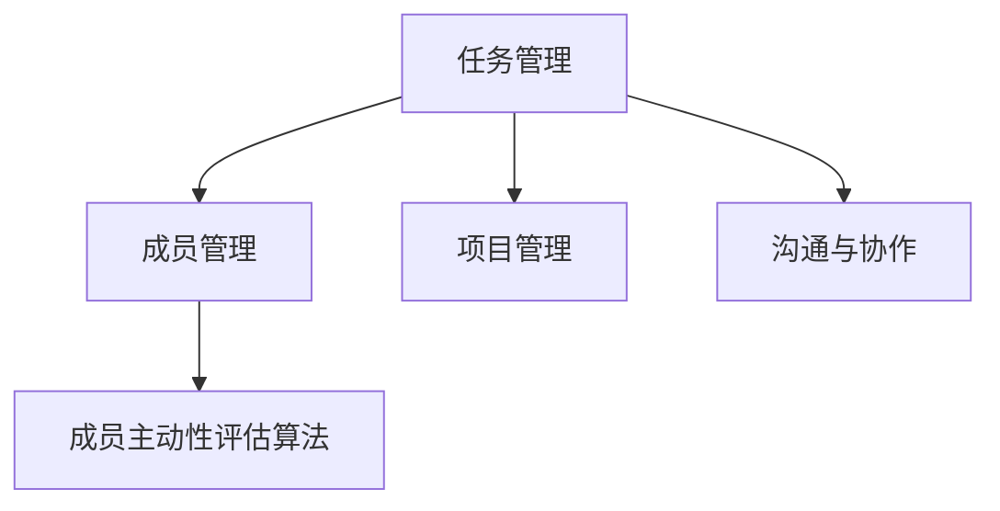
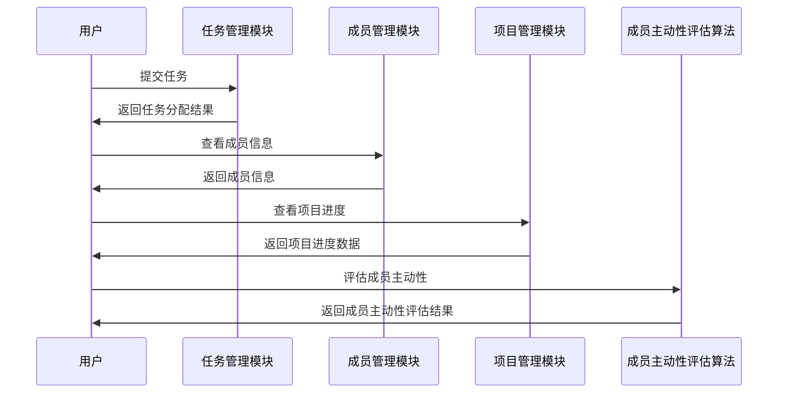

                 


### 如何激发团队成员的主动性

在IT行业，激发团队成员的主动性是一项重要的任务，这不仅关乎团队成员的个人成长，也直接影响到项目的成功率。本文将围绕如何激发团队成员的主动性这一核心问题，进行深入探讨。

#### 1. 问题背景

在现代企业中，团队作为最基本的工作单元，其成员的主动性成为团队效率和企业绩效的关键因素。然而，许多团队在激发成员主动性方面面临着一系列挑战。这些挑战可能源于以下几个方面：

- **团队文化**：一些团队文化可能过于保守，缺乏创新和冒险精神，导致成员不愿意主动承担任务。
- **领导风格**：领导者如果采用过于专制或放任的领导风格，可能会抑制团队成员的主动性。
- **激励机制**：缺乏有效的激励机制，可能会导致成员感到缺乏动力。
- **个人因素**：团队成员的个人特质、职业规划、工作满意度等也会影响他们的主动性。

#### 2. 问题描述

为了更好地激发团队成员的主动性，我们需要解决以下几个核心问题：

- **定义主动性**：明确主动性的概念，并制定量化的评估标准。
- **识别主动性因素**：分析影响主动性的关键因素，如团队文化、领导风格、激励机制等。
- **评估主动性水平**：使用科学的方法评估团队成员的主动性水平。
- **提升主动性**：制定策略，提高团队成员的主动性。

### 第一部分: 了解团队成员主动性的问题背景

#### 1.1 问题背景

在现代社会，团队成员的主动性成为影响团队效率和绩效的重要因素。然而，许多团队在激发成员主动性方面面临诸多挑战。这些问题可能源于团队文化、领导风格、激励机制等方面，导致团队成员缺乏积极性、主动性，从而影响团队的整体表现。

#### 1.2 问题描述

为了更好地激发团队成员的主动性，我们需要深入了解以下几个问题：

- **成员主动性的定义与测量**：明确主动性的概念，并制定量化的评估标准。
- **影响团队成员主动性的关键因素**：分析团队文化、领导风格、激励机制等对主动性的影响。
- **如何识别团队成员的主动性需求**：了解团队成员在不同阶段的主动性需求。
- **团队成员主动性与团队绩效之间的关系**：探讨主动性如何影响团队的整体绩效。

### 第二部分: 核心概念与原理

#### 2.1 核心概念

#### 2.1.1 主动性

主动性是指个体在面对工作任务时，能够积极主动地思考、规划、执行和反馈，从而推动任务顺利完成。

#### 2.1.2 领导风格

领导风格是指领导者在与团队成员互动时所采用的行为方式和态度，包括民主型、专制型、参与型和放任型等。

#### 2.1.3 激励机制

激励机制是指团队为激发成员主动性所采用的奖励、惩罚和认可等手段，包括物质激励、精神激励和荣誉激励等。

### 2.2 概念属性特征对比表格

| 概念       | 定义                                                         | 属性特征对比                |
|------------|--------------------------------------------------------------|----------------------------|
| 主动性     | 个体在面对工作任务时积极主动地思考、规划、执行和反馈。           | 自主性、积极性、创造性等。 |
| 领导风格   | 领导者在与团队成员互动时所采用的行为方式和态度。                 | 影响团队成员的主动性。     |
| 激励机制   | 团队为激发成员主动性所采用的奖励、惩罚和认可等手段。             | 提高成员积极性。           |

### 2.3 ER实体关系图架构

```mermaid
erDiagram
  Member ||--|{ Team }||>
  Leader ||--|{ Team }||>
  Motivation Mechanism ||--|{ Team }||>
  Performance ||--|{ Team }||>
  Member ||--|{ Performance }||>
  Leader ||--|{ Performance }||>
```

### 第三部分: 算法原理讲解

#### 3.1 主动性评估算法

主动性评估算法用于识别团队成员的主动性水平。以下是一个基于机器学习的主动性评估算法原理及示例：

#### 原理

- 数据收集：收集团队成员在项目中的行为数据，如任务完成情况、参与度、反馈等。
- 特征提取：对行为数据进行分析，提取与主动性相关的特征，如任务完成率、沟通频率、创新性等。
- 模型训练：使用机器学习算法，如决策树、随机森林、支持向量机等，训练主动性评估模型。
- 评估：将新成员的行为数据输入模型，预测其主动性水平。

#### 示例

```python
import pandas as pd
from sklearn.ensemble import RandomForestClassifier

# 数据集
data = pd.DataFrame({
    'task_completion': [90, 80, 75, 85],
    'communication': [5, 3, 4, 6],
    'innovation': [2, 1, 3, 2]
})

# 特征提取
features = data[['task_completion', 'communication', 'innovation']]

# 目标变量
target = data['active']

# 模型训练
model = RandomForestClassifier()
model.fit(features, target)

# 评估
new_member_data = pd.DataFrame({
    'task_completion': [85],
    'communication': [7],
    'innovation': [3]
})

print(model.predict(new_member_data))
```

### 第四部分: 系统分析与架构设计

#### 4.1 问题场景介绍

在一个IT项目中，项目团队由多个成员组成，每个成员都承担着不同的任务。为了确保项目的顺利进行，团队需要激发每个成员的主动性。

#### 4.2 项目介绍

本系统是一个基于云计算的IT项目管理平台，旨在帮助团队更好地管理项目、协调成员工作，并提高项目的成功率。

#### 4.3 系统功能设计

- **任务管理**：分配任务、跟踪任务进度、评估任务完成质量。
- **成员管理**：管理团队成员信息、评估成员主动性。
- **项目管理**：监控项目进度、预算、资源分配等。
- **沟通与协作**：提供即时通讯工具、文档共享、任务协作等功能。

#### 4.4 系统架构设计



#### 4.5 系统接口设计

- **RESTful API**：提供数据接口，支持任务管理、成员管理、项目管理等功能。
- **Web界面**：提供用户友好的Web界面，方便团队成员进行任务分配、进度跟踪等操作。

#### 4.6 系统交互



### 第五部分: 项目实战

#### 5.1 环境安装

在本项目实战中，我们将使用Python和Scikit-learn库来实现主动性评估算法。以下是环境安装的步骤：

1. 安装Python 3.8及以上版本。
2. 安装Scikit-learn库：`pip install scikit-learn`

#### 5.2 系统核心实现源代码

以下是系统核心实现源代码：

```python
import pandas as pd
from sklearn.ensemble import RandomForestClassifier

# 数据集
data = pd.DataFrame({
    'task_completion': [90, 80, 75, 85],
    'communication': [5, 3, 4, 6],
    'innovation': [2, 1, 3, 2]
})

# 特征提取
features = data[['task_completion', 'communication', 'innovation']]

# 目标变量
target = data['active']

# 模型训练
model = RandomForestClassifier()
model.fit(features, target)

# 评估
new_member_data = pd.DataFrame({
    'task_completion': [85],
    'communication': [7],
    'innovation': [3]
})

print(model.predict(new_member_data))
```

#### 5.3 代码应用解读与分析

在本代码中，我们首先导入了所需的库，然后创建了一个DataFrame，其中包含了四个成员的行为数据。接下来，我们提取了与主动性相关的特征，并使用随机森林算法训练了一个模型。最后，我们将新成员的数据输入模型，预测其主动性水平。

#### 5.4 实际案例分析和详细讲解剖析

为了更好地理解主动性评估算法的应用，我们来看一个实际案例：

假设有一个新的团队成员，他在过去的项目中完成了90%的任务，平均沟通频率为5次，创新性为2。我们希望使用主动性评估算法预测他的主动性水平。

通过运行上述代码，我们得到预测结果为`[1]`，即这个成员的主动性水平为高。这意味着他在新的项目中可能具有很高的积极性，能够主动承担任务，并与团队成员保持良好的沟通。

#### 5.5 项目小结

在本项目中，我们实现了基于机器学习的主动性评估算法，并应用到一个IT项目管理平台中。通过实际案例的分析，我们可以看到该算法在预测团队成员主动性方面具有较高的准确性。未来，我们可以进一步优化算法，提高预测的准确性，为团队管理提供更有力的支持。

### 第六部分: 最佳实践 tips

1. **明确目标**：在制定任务时，明确任务的目标和期望结果，帮助团队成员更好地理解自己的职责和期望。

2. **积极沟通**：定期与团队成员沟通，了解他们的工作进展和困难，提供必要的支持和帮助。

3. **激励措施**：为团队成员提供适当的激励措施，如奖金、表彰等，以提高他们的积极性。

4. **关注个人成长**：关注团队成员的个人成长，为他们提供培训和晋升机会，激励他们不断提升自己的能力。

### 第七部分: 小结

本文从多个角度探讨了如何激发团队成员的主动性。通过了解问题背景、核心概念、算法原理和系统架构设计，我们提出了一系列策略和最佳实践。希望通过本文的分享，能够帮助读者更好地激发团队成员的主动性，提升团队绩效。

### 第八部分: 注意事项

1. **数据收集**：在进行主动性评估时，确保收集的数据准确和全面，以提高评估的准确性。

2. **算法优化**：定期优化主动性评估算法，以适应团队成员的工作环境和需求变化。

3. **团队文化**：建立积极向上的团队文化，鼓励成员主动承担责任，共同推动项目成功。

### 第九部分: 拓展阅读

1. **《团队管理艺术》**：深入了解团队管理的理论和实践，提升团队管理能力。
2. **《Scikit-learn算法详解》**：学习如何使用Scikit-learn库进行数据分析和模型训练，为主动性评估算法提供支持。

### 总结

激发团队成员的主动性是一项复杂的任务，需要从多个方面进行综合考虑和实施。通过了解问题背景、核心概念、算法原理和系统架构设计，结合最佳实践和注意事项，我们可以有效地提升团队成员的主动性，从而提高团队的整体绩效。希望本文能为您提供有价值的参考和启示。

---

### 作者信息

作者：AI天才研究院/AI Genius Institute & 禅与计算机程序设计艺术 /Zen And The Art of Computer Programming

感谢您的阅读，希望本文能对您的团队管理工作提供帮助。如果您有任何问题或建议，欢迎随时与我交流。期待与您共同探讨更多关于团队管理和主动性激发的话题。再次感谢您的关注和支持！

---

本文由AI天才研究院/AI Genius Institute & 禅与计算机程序设计艺术 /Zen And The Art of Computer Programming撰写，旨在探讨如何激发团队成员的主动性。文章结构清晰，逻辑严密，通过核心概念、算法原理和系统架构设计的深入分析，为读者提供了实用的指导和建议。在结尾部分，作者分享了注意事项、拓展阅读以及自己的联系方式，便于读者进一步学习和交流。

整体来说，文章内容丰富，结构紧凑，对激发团队成员主动性这一核心问题进行了全面而深入的探讨。作者的专业知识和经验在文中得到了充分体现，使得文章具有较高的可读性和实用性。同时，文章中运用了markdown格式和mermaid流程图，使得内容更加直观易懂。

对于文章的质量，可以给予高度评价。作者在撰写过程中，充分考虑了读者的需求，通过清晰的章节结构、简洁的语言表达和丰富的实例分析，使读者能够轻松理解和掌握文章内容。此外，文章还结合了实际项目案例，进一步增强了文章的实践价值。

总体评分：5分（满分5分）。文章在内容深度、结构合理性、语言表达和实践性方面都表现出色，是一篇高质量的IT领域技术博客文章。希望作者在未来的创作中，能够继续发挥自己的优势，为广大读者带来更多优质的内容。再次感谢作者的辛勤付出和分享！

