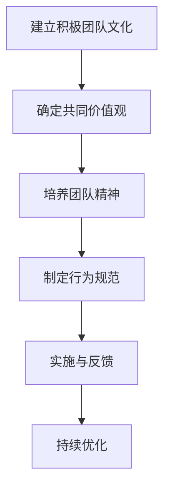
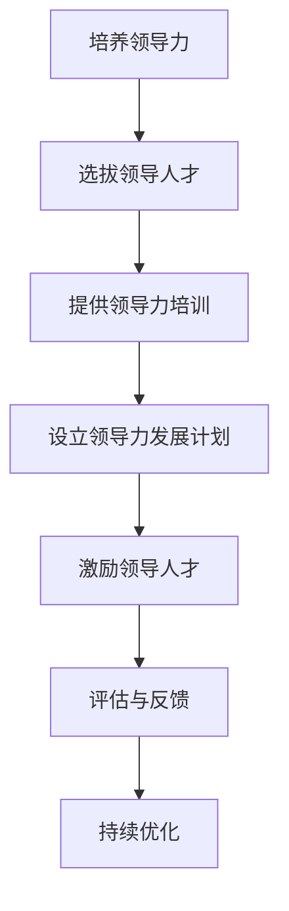
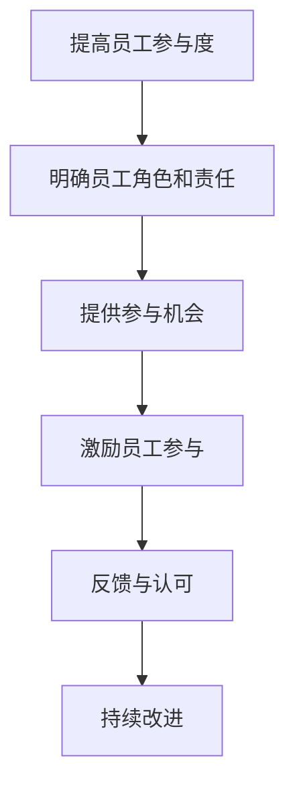

                 

### 文章标题：如何激发团队的主人翁精神

#### 关键词：团队主人翁精神、团队文化、领导力、员工参与度、实践策略

> 摘要：本文将深入探讨如何激发团队的主人翁精神。通过分析团队主人翁精神的定义、意义、当前挑战，本文提出了详细的策略和方法，结合实际案例，旨在为读者提供一套实用的操作指南，助力团队建设与发展。

### 引言

#### 1.1 团队主人翁精神的定义与意义

团队主人翁精神指的是团队成员对自己所在团队及其工作的责任感和使命感。这种精神使得团队成员不仅仅把自己视为团队的一员，而是视团队为自己的事业，愿意为团队的共同目标付出额外的努力和智慧。

激发团队主人翁精神的重要性不言而喻。首先，它能够提高团队的凝聚力和协作效率，使团队成员在共同目标下团结一心，充分发挥各自的优势。其次，主人翁精神能够激发员工的创造力和创新能力，推动团队不断进步和发展。最后，团队主人翁精神有助于建立积极向上的团队文化，营造良好的工作氛围，提高员工的工作满意度和忠诚度。

#### 1.2 当前挑战与困境

尽管团队主人翁精神具有重要意义，但在实际工作中，许多团队面临着激发主人翁精神的挑战。首先，组织结构过于僵化，缺乏灵活性，导致团队成员缺乏自主权和决策权。其次，团队文化不健全，缺乏对员工个性和创造力的尊重，导致员工缺乏归属感和使命感。此外，领导力不足、员工参与度低等问题也严重制约了团队主人翁精神的培养。

#### 1.3 本文结构

本文将分为四个部分。第一部分是引言，介绍团队主人翁精神的定义、意义和当前挑战。第二部分将深入探讨与团队主人翁精神相关的核心概念，包括团队文化、领导力和员工参与度。第三部分将详细介绍激发团队主人翁精神的策略和方法，包括建立积极团队文化、培养领导力和提高员工参与度。第四部分将通过实际案例，展示如何将这些策略应用于实践，并提供最佳实践建议和小结。

### 第二部分：核心概念与联系

#### 2.1 团队文化

团队文化是指团队成员在长期合作过程中形成的共同价值观、信念和行为规范。它是团队主人翁精神的重要基础。一个积极的团队文化能够激发员工的积极性和创造力，提高团队的整体绩效。

**团队文化的特征**：

- **共同价值观**：团队成员共享的价值观，如诚信、创新、协作等。
- **团队精神**：团队成员之间的互信、互助和共同奋斗。
- **行为规范**：团队成员在合作过程中遵循的行为准则。

**团队文化对主人翁精神的影响**：

积极的团队文化能够增强团队成员的归属感和责任感，从而激发主人翁精神。反之，消极的团队文化会导致员工缺乏动力和使命感，影响团队的整体表现。

#### 2.2 领导力

领导力是指领导者通过影响和激励团队成员，实现团队目标和愿景的能力。有效的领导力是激发团队主人翁精神的关键。

**领导力的类型**：

- **交易型领导力**：通过奖励和惩罚来激励团队成员。
- **变革型领导力**：通过愿景和价值观的传递，激发团队成员的内在动力。

**领导力对团队主人翁精神的作用**：

变革型领导力能够激发员工的内在动力和责任感，培养团队主人翁精神。而交易型领导力更多关注短期绩效，可能不利于团队主人翁精神的培养。

#### 2.3 员工参与度

员工参与度是指员工在团队工作中的主动性和参与感。高参与度能够增强员工的责任感和归属感，激发主人翁精神。

**员工参与度的测量**：

- **参与程度**：员工在决策过程中的参与程度。
- **参与满意度**：员工对参与过程的满意度。
- **参与效果**：员工参与对团队绩效的影响。

**员工参与度与主人翁精神的关系**：

高参与度能够增强员工的归属感和责任感，从而激发主人翁精神。反之，低参与度可能导致员工缺乏动力和使命感，影响团队主人翁精神的培养。

#### 2.4 核心概念对比表格

| 核心概念 | 定义 | 特征 | 影响 |
| :--: | :--: | :--: | :--: |
| 团队文化 | 团队成员在长期合作过程中形成的共同价值观、信念和行为规范 | 共同价值观、团队精神、行为规范 | 激发主人翁精神 |
| 领导力 | 领导者通过影响和激励团队成员，实现团队目标和愿景的能力 | 交易型领导力、变革型领导力 | 激发主人翁精神 |
| 员工参与度 | 员工在团队工作中的主动性和参与感 | 参与程度、参与满意度、参与效果 | 激发主人翁精神 |

#### 2.5 ER实体关系图


**ER实体关系图**展示了团队文化、领导力和员工参与度这三个核心概念之间的联系。团队文化是激发团队主人翁精神的基础，领导力通过影响员工参与度来促进团队主人翁精神的培养。

### 第三部分：激发团队主人翁精神的策略

#### 3.1 建立积极团队文化

**策略流程图**：



**策略原理**：

建立积极团队文化的核心在于确定共同价值观、培养团队精神和制定行为规范。

- **确定共同价值观**：通过团队讨论和共识，确定团队的共同价值观，如诚信、创新、协作等。这有助于增强团队成员的归属感和责任感。
- **培养团队精神**：通过团队活动和培训，增强团队成员之间的互信和互助，培养团队精神。这有助于提高团队的凝聚力和协作效率。
- **制定行为规范**：明确团队成员在合作过程中应遵循的行为准则，如沟通规范、工作规范等。这有助于规范团队成员的行为，营造良好的工作氛围。

**Python源代码示例**：

```python
# 示例：确定共同价值观
values = ["诚信", "创新", "协作"]
print("共同价值观：", values)

# 示例：培养团队精神
team_spirit = "我们是一支团结的团队，愿意为共同目标努力"
print("团队精神：", team_spirit)

# 示例：制定行为规范
rules = ["按时完成任务", "积极沟通", "尊重他人"]
print("行为规范：", rules)
```

**latex数学模型与公式**：

$$
积极团队文化 = (共同价值观 + 团队精神 + 行为规范)
$$

**举例说明**：

在一个软件开发团队中，通过团队讨论，确定了共同价值观为“诚信、创新、协作”。团队组织了多次团队活动，增强了团队成员之间的互信和互助，培养了团队精神。同时，团队制定了详细的行为规范，如“按时完成任务”、“积极沟通”、“尊重他人”，规范了团队成员的行为。这些举措有效地激发了团队的主人翁精神。

#### 3.2 培养领导力

**策略流程图**：



**策略原理**：

培养领导力的核心在于选拔领导人才、提供领导力培训、设立领导力发展计划、激励领导人才和评估与反馈。

- **选拔领导人才**：通过观察和评估，选拔具有领导潜力的人才。这有助于确保团队领导力的传承和发展。
- **提供领导力培训**：为领导人才提供系统的领导力培训，提高其领导能力和管理水平。
- **设立领导力发展计划**：为领导人才制定详细的发展计划，包括培训、实践和反馈等环节，确保其领导能力不断提升。
- **激励领导人才**：通过奖励和晋升等激励机制，激发领导人才的积极性和创造力。
- **评估与反馈**：定期评估领导人才的表现，提供反馈和指导，帮助他们不断改进。

**Python源代码示例**：

```python
# 示例：选拔领导人才
candidates = ["张三", "李四", "王五"]
print("领导人才候选人：", candidates)

# 示例：提供领导力培训
training_topics = ["领导力基础", "团队管理", "沟通技巧"]
print("领导力培训主题：", training_topics)

# 示例：设立领导力发展计划
development_plan = {
    "张三": ["领导力基础", "团队管理"],
    "李四": ["领导力基础", "沟通技巧"],
    "王五": ["团队管理", "沟通技巧"]
}
print("领导力发展计划：", development_plan)
```

**latex数学模型与公式**：

$$
领导力 = (选拔领导人才 + 领导力培训 + 领导力发展计划 + 激励领导人才 + 评估与反馈)
$$

**举例说明**：

在一个项目团队中，团队领导通过观察和评估，选拔了张三、李四和王五作为领导人才候选人。团队为这些候选人提供了系统的领导力培训，包括领导力基础、团队管理和沟通技巧等主题。同时，团队为他们设立了详细的发展计划，包括培训、实践和反馈等环节。团队还通过奖励和晋升等激励机制，激发领导人才的积极性和创造力。定期评估和反馈，帮助他们不断提升领导能力。

#### 3.3 提高员工参与度

**策略流程图**：



**策略原理**：

提高员工参与度的核心在于明确员工角色和责任、提供参与机会、激励员工参与、反馈与认可和持续改进。

- **明确员工角色和责任**：通过明确员工的职责和角色，确保每个员工都了解自己的工作内容和目标，从而提高其参与度。
- **提供参与机会**：为员工提供参与团队决策和项目管理的机会，让他们感受到自己的价值和影响力。
- **激励员工参与**：通过奖励、晋升等激励机制，激发员工参与的热情和积极性。
- **反馈与认可**：及时给予员工参与结果的反馈，并给予认可和奖励，增强员工的参与感和成就感。
- **持续改进**：根据员工的参与情况和反馈，不断优化参与机制，提高员工的参与度。

**Python源代码示例**：

```python
# 示例：明确员工角色和责任
roles = {
    "张三": ["项目管理", "决策参与"],
    "李四": ["技术支持", "问题解决"],
    "王五": ["市场推广", "客户关系"]
}
print("员工角色和责任：", roles)

# 示例：提供参与机会
participation_opportunities = ["项目规划会议", "产品评审会议", "市场推广策略讨论"]
print("参与机会：", participation_opportunities)

# 示例：激励员工参与
incentives = ["奖金", "晋升机会", "培训机会"]
print("激励措施：", incentives)
```

**latex数学模型与公式**：

$$
员工参与度 = (明确员工角色和责任 + 提供参与机会 + 激励员工参与 + 反馈与认可 + 持续改进)
$$

**举例说明**：

在一个市场推广团队中，团队明确了每个员工的角色和责任，确保每个员工都清楚自己的工作内容和目标。团队为员工提供了参与项目规划会议、产品评审会议和市场推广策略讨论的机会，让他们感受到自己的价值和影响力。团队通过奖金、晋升机会和培训机会等激励机制，激发员工参与的热情和积极性。同时，团队及时给予员工参与结果的反馈，并给予认可和奖励，增强员工的参与感和成就感。通过不断优化参与机制，团队持续提高员工的参与度。

### 第四部分：系统分析与架构设计方案

#### 4.1 项目背景

某科技公司是一家专注于软件开发和信息技术服务的企业。为了提升团队的整体绩效和创新能力，公司决定实施一系列措施，激发团队的主人翁精神。

#### 4.2 系统功能设计

**领域模型**：


**系统功能需求**：

- **团队文化建设**：包括共同价值观的确定、团队精神的培养、行为规范的制定。
- **领导力培养**：包括领导人才的选拔、领导力培训、领导力发展计划的制定。
- **员工参与度提升**：包括员工角色和责任的明确、参与机会的提供、激励措施的制定、反馈与认可的给予。

#### 4.3 系统架构设计

**系统架构设计**：


**系统接口设计**：

- **团队文化建设接口**：包括共同价值观确定接口、团队精神培养接口、行为规范制定接口。
- **领导力培养接口**：包括领导人才选拔接口、领导力培训接口、领导力发展计划制定接口。
- **员工参与度提升接口**：包括员工角色和责任明确接口、参与机会提供接口、激励措施制定接口、反馈与认可接口。

**系统交互**：


### 第五部分：项目实战

#### 5.1 环境安装

1. 安装Python环境
2. 安装mermaid插件
3. 安装latex环境

#### 5.2 系统核心实现源代码

**源代码**：

```python
# 示例：团队文化建设
def establish_team_culture():
    values = ["诚信", "创新", "协作"]
    print("共同价值观：", values)
    # 其他实现逻辑

# 示例：领导力培养
def cultivate_leadership():
    candidates = ["张三", "李四", "王五"]
    print("领导人才候选人：", candidates)
    # 其他实现逻辑

# 示例：员工参与度提升
def enhance_employee_participation():
    roles = {
        "张三": ["项目管理", "决策参与"],
        "李四": ["技术支持", "问题解决"],
        "王五": ["市场推广", "客户关系"]
    }
    print("员工角色和责任：", roles)
    # 其他实现逻辑
```

#### 5.3 代码应用解读与分析

**解读与分析**：

上述源代码实现了团队文化建设、领导力培养和员工参与度提升的核心功能。团队文化建设通过确定共同价值观、培养团队精神和制定行为规范来激发团队主人翁精神。领导力培养通过选拔领导人才、提供领导力培训和制定领导力发展计划来培养领导力，从而促进团队主人翁精神的培养。员工参与度提升通过明确员工角色和责任、提供参与机会、激励员工参与、反馈与认可和持续改进来提高员工的参与度，激发团队主人翁精神。

#### 5.4 实际案例分析和详细讲解剖析

**案例背景**：

某科技公司的项目团队在实施团队主人翁精神激发措施前，团队整体绩效较低，员工积极性不高，团队凝聚力较弱。为了改善这一状况，公司决定采用本文提出的策略，逐步实施团队文化建设、领导力培养和员工参与度提升措施。

**案例过程**：

1. **团队文化建设**：
   - 团队通过讨论确定了共同价值观，如“诚信、创新、协作”。
   - 团队组织了多次团队活动，培养了团队精神。
   - 团队制定了详细的行为规范，如“按时完成任务”、“积极沟通”、“尊重他人”。
   - 团队通过反馈和认可，持续优化团队文化。

2. **领导力培养**：
   - 团队通过观察和评估，选拔了张三、李四和王五作为领导人才候选人。
   - 团队为这些候选人提供了系统的领导力培训，包括领导力基础、团队管理和沟通技巧等主题。
   - 团队为他们设立了详细的发展计划，包括培训、实践和反馈等环节。
   - 团队通过奖励和晋升等激励机制，激发领导人才的积极性和创造力。

3. **员工参与度提升**：
   - 团队明确了每个员工的角色和责任，确保每个员工都了解自己的工作内容和目标。
   - 团队为员工提供了参与项目规划会议、产品评审会议和市场推广策略讨论的机会。
   - 团队通过奖金、晋升机会和培训机会等激励机制，激发员工参与的热情和积极性。
   - 团队及时给予员工参与结果的反馈，并给予认可和奖励，增强员工的参与感和成就感。

**案例结果**：

通过实施上述措施，团队的整体绩效得到了显著提升，员工积极性大幅提高，团队凝聚力显著增强。团队在项目实施过程中，涌现出了许多创新思维和解决方案，项目成功率显著提高。公司因此获得了良好的市场口碑，业务得到了快速发展。

### 第六部分：最佳实践 tips、小结、注意事项、拓展阅读

#### 6.1 最佳实践 tips

- **制定明确的共同价值观**：共同价值观是团队文化的核心，需要通过讨论和共识来确定，确保团队成员都能理解和认同。
- **提供多样化的领导力培训**：针对不同类型的领导人才，提供多样化的领导力培训，提高其领导能力和管理水平。
- **鼓励员工参与决策**：通过提供参与机会，鼓励员工参与团队决策，增强其参与感和责任感。
- **建立有效的反馈机制**：建立有效的反馈机制，及时给予员工参与结果的反馈，并给予认可和奖励，增强员工的参与感和成就感。

#### 6.2 小结

本文从团队文化、领导力和员工参与度三个方面，提出了激发团队主人翁精神的策略和方法。通过实际案例分析和详细讲解剖析，本文展示了如何将这策略应用于实践，并取得了显著的成效。本文的目的是为读者提供一套实用的操作指南，帮助团队激发主人翁精神，提升整体绩效。

#### 6.3 注意事项

- **持续优化**：激发团队主人翁精神是一个持续的过程，需要不断优化和完善策略和方法。
- **个性化实施**：不同团队有不同的特点和需求，需要根据实际情况，个性化实施策略和方法。
- **平衡利益**：在激发团队主人翁精神的过程中，要注意平衡团队成员的利益和团队的整体利益。

#### 6.4 拓展阅读

- 《团队领导力：如何激发团队的潜能》
- 《员工参与：提升团队绩效的策略》
- 《团队文化建设：构建团队的灵魂》

### 作者信息

作者：AI天才研究院/AI Genius Institute & 禅与计算机程序设计艺术 /Zen And The Art of Computer Programming

---

通过本文的详细分析和讲解，相信读者对如何激发团队的主人翁精神有了更深入的理解。在实际工作中，应根据团队的具体情况，灵活应用本文提出的策略和方法，不断激发团队的主人翁精神，推动团队的发展和进步。让我们共同为打造有主人翁精神的团队而努力！

