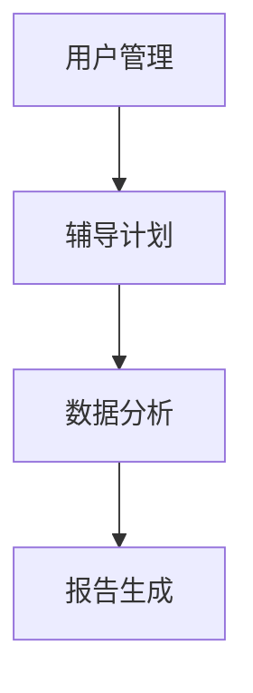
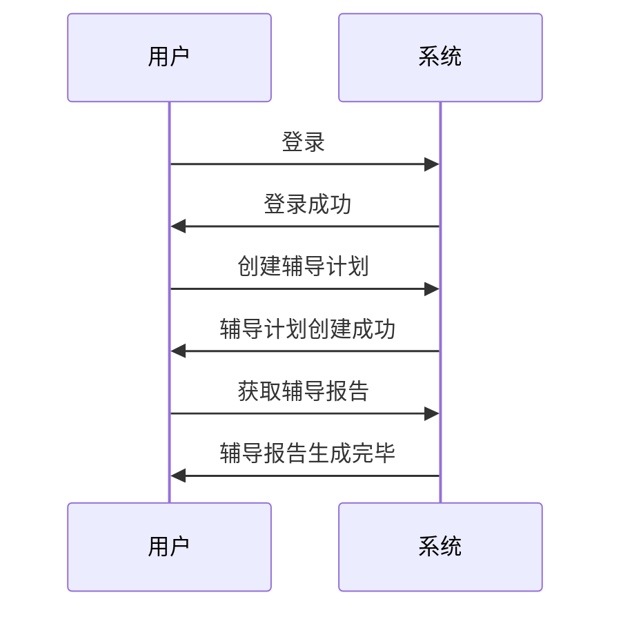

                 

让我们一步一步思考，从基础概念开始，逐步构建起一篇关于如何进行有效的一对一员工辅导的技术博客。

### 前言

在当今快速变化和高竞争的环境中，员工的能力发展成为了企业成功的关键因素。有效的员工辅导不仅能够提升员工的个人技能和职业素养，还能增强团队凝聚力和组织效能。一对一员工辅导作为一种深度互动的形式，越来越受到企业的重视。本文将围绕这一主题，逐步探讨其核心概念、策略与实践，并通过案例分析，提供具体的实施方法和最佳实践。

### 第1章 引言：为什么一对一员工辅导如此重要

#### 1.1 背景介绍

随着全球化的推进和技术的不断革新，企业的运作模式也在不断变化。员工不再仅仅是为公司提供服务，而是成为企业创新和竞争力的核心。因此，企业需要通过有效的员工辅导来激发员工的潜力，提高其工作表现。

#### 1.2 问题描述

目前，许多企业在员工辅导方面存在以下问题：

- 缺乏明确的辅导目标和计划；
- 辅导过程缺乏系统性和持续性；
- 员工和辅导者之间的沟通不畅；
- 辅导效果难以评估。

#### 1.3 问题解决

为了解决上述问题，一对一员工辅导成为了一种有效的解决方案。它具有以下优势：

- 深度互动，能够针对员工的个性化需求进行辅导；
- 系统性，通过明确的计划和目标，确保辅导的持续性和有效性；
- 高效沟通，通过一对一的交流，增强辅导者与员工之间的信任和理解；
- 容易评估，辅导效果可以更加直观和量化。

#### 1.4 边界与外延

一对一员工辅导不仅适用于新员工的入职培训和技能提升，还可以应用于在职员工的职业发展和能力拓展。此外，它不仅适用于技术和业务技能的辅导，还可以扩展到软技能和领导力的提升。

#### 1.5 概念结构与核心要素组成

一对一员工辅导的概念结构包括以下几个方面：

- 辅导者：具有丰富经验和技能的人，能够为员工提供指导和支持；
- 员工：接受辅导的对象，希望通过辅导提升自己的能力；
- 辅导目标：明确的、可量化的目标，用于指导辅导过程；
- 辅导计划：详细的一对一辅导日程和活动安排；
- 沟通与反馈：辅导过程中持续的沟通和及时的反馈；
- 评估与改进：辅导效果的评估和辅导计划的改进。

#### 1.6 本章小结

本章节介绍了为什么一对一员工辅导在当前环境中如此重要，包括背景、问题描述、问题解决、边界与外延以及概念结构与核心要素组成。接下来，我们将进一步探讨一对一员工辅导的核心概念和具体实践。

----------------------------------------------------------------

### 第2章 核心概念与联系

#### 2.1 一对一员工辅导的定义

一对一员工辅导是一种个性化的辅导形式，辅导者与员工以一对一的方式定期会面，讨论员工的职业发展、技能提升和实际问题。这种辅导形式旨在通过深度互动，帮助员工充分发挥个人潜力，提高工作绩效。

#### 2.2 一对一员工辅导的特点

一对一员工辅导具有以下特点：

- **个性化**：根据员工的具体需求和职业目标，定制化的辅导计划和内容；
- **深度互动**：辅导者与员工之间建立信任关系，通过持续的沟通和反馈，实现有效的知识传递和技能提升；
- **灵活性**：辅导时间和地点灵活安排，适应员工的个人生活和工作节奏；
- **针对性**：针对员工的特定问题或挑战，提供专业的指导和建议。

#### 2.3 一对一员工辅导与传统辅导的区别

传统辅导通常以大班授课或小组讨论的形式进行，难以满足个性化需求。而一对一员工辅导则具有以下区别：

- **形式**：一对一员工辅导是私人订制的，而传统辅导则是集体授课；
- **频率**：一对一员工辅导通常频率更高，更加持续，而传统辅导则可能较为分散和一次性；
- **深度**：一对一员工辅导更深入，关注员工的具体问题和个性化需求，而传统辅导则可能更注重知识的普及和基础技能的培训；
- **效果**：一对一员工辅导的效果更容易评估和量化，而传统辅导的效果评估相对困难。

#### 2.4 一对一员工辅导的核心要素

一对一员工辅导的核心要素包括：

- **辅导者**：具有专业知识和经验，能够为员工提供指导和支持；
- **员工**：明确职业目标和需求，积极参与辅导过程；
- **辅导计划**：明确的目标、时间表和活动安排，确保辅导的有序进行；
- **沟通与反馈**：建立良好的沟通渠道，及时反馈辅导效果，调整辅导计划；
- **评估与改进**：定期评估辅导效果，根据评估结果调整辅导策略。

#### 2.5 概念属性特征对比表格

| 特征 | 一对一员工辅导 | 传统辅导 |
| --- | --- | --- |
| 形式 | 个性化，一对一 | 大班授课，小组讨论 |
| 频率 | 持续，高频 | 分散，一次性 |
| 深度 | 深入，针对性 | 浅显，普及性 |
| 效果 | 易评估，量化 | 难评估，难以量化 |

#### 2.6 ER实体关系图架构

以下是ER实体关系图，用于描述一对一员工辅导中涉及的实体及其关系：

```mermaid
erDiagram
    Employee ||--|{ Mentor }|-- Supervisor
    Mentor ||--|{ CoachingSession }|<-- Employee
    CoachingSession ||--|{ Goal }|<-- Employee
    Goal ||--|{ Assessment }|<-- Mentor
```

#### 2.7 本章小结

本章介绍了核心概念，包括一对一员工辅导的定义、特点、与传统辅导的区别、核心要素以及概念属性特征对比表格和ER实体关系图。接下来，我们将进一步探讨如何制定有效的一对一员工辅导计划。

----------------------------------------------------------------

### 第3章 策略与实践

#### 3.1 制定有效的一对一员工辅导计划

为了确保一对一员工辅导的有效性，制定一个详细的辅导计划至关重要。以下步骤有助于制定一个有效的辅导计划：

##### 3.1.1 明确辅导目标

辅导目标的明确是辅导计划的基础。首先，与员工沟通，了解他们的职业目标和当前的技能水平。然后，根据这些信息设定具体的、可量化的辅导目标。例如，提高员工的沟通技巧、掌握特定的技术技能或提升领导力。

##### 3.1.2 确定辅导频率与时长

辅导频率和时长的选择应根据员工的个人情况和辅导目标来确定。一般来说，每周一次到每月一次的频率是比较常见的，每次会议的时长可以从30分钟到2小时不等。确保频率和时长既能满足员工的辅导需求，又不会对他们日常工作造成过多干扰。

##### 3.1.3 设计辅导议程

设计一个结构化的辅导议程可以帮助辅导过程更加有序和高效。议程应包括以下部分：

- 开场白：简要回顾上次辅导的内容和进展；
- 主题讨论：根据辅导目标，深入讨论特定主题；
- 实践应用：提供实际案例或练习，让员工将所学知识应用到实际工作中；
- 反馈与总结：员工分享自己的体会和成果，辅导者提供反馈和建议；
- 下次议程安排：总结本次辅导内容，规划下次会议的主题和议程。

##### 3.1.4 制定辅导评估指标

为了衡量辅导效果，需要制定具体的评估指标。这些指标可以包括：

- 技能提升：员工在特定技能上的进步程度；
- 工作表现：员工在工作中的表现和成果；
- 满意度：员工对辅导过程的满意度；
- 自我评估：员工对自身进步的自我评价。

这些指标可以通过定期评估来跟踪，以确保辅导计划的持续改进。

#### 3.2 建立良好的辅导关系

建立良好的辅导关系是辅导成功的关键。以下策略有助于建立和维持良好的辅导关系：

##### 3.2.1 建立信任

信任是辅导关系的基础。辅导者和员工之间需要建立互信，确保员工在辅导过程中能够放心地表达自己的困惑和需求。通过倾听、尊重和关心，辅导者可以建立信任。

##### 3.2.2 倾听与沟通

有效的沟通是建立良好辅导关系的重要手段。辅导者需要认真倾听员工的意见和想法，给予及时的反馈和指导。通过开放式问题和积极的倾听技巧，辅导者可以更好地理解员工的需求和问题。

##### 3.2.3 保持积极态度

辅导过程中，辅导者应保持积极的态度，鼓励员工克服困难，积极面对挑战。通过正面的激励和肯定，辅导者可以增强员工的自信心和动力。

#### 3.3 辅导过程中常见问题的处理

在辅导过程中，可能会遇到以下问题：

##### 3.3.1 员工抵触情绪的处理

如果员工对辅导持抵触情绪，辅导者需要耐心倾听，了解背后的原因。可能的原因包括担心失败、对辅导者不信任或对工作环境的不满意。通过有效的沟通和解决员工的问题，辅导者可以逐步消除员工的抵触情绪。

##### 3.3.2 辅导目标不一致的处理

当辅导目标不一致时，辅导者和员工需要通过沟通和协商，找到共同的目标。可以重新设定辅导目标，确保它们既符合员工的需求，又能满足组织的期望。

##### 3.3.3 时间管理与效率提升

辅导过程中，时间管理和效率提升是关键。辅导者可以采用以下策略：

- 制定详细的辅导议程，确保会议内容紧凑而有条理；
- 使用时间管理工具，如待办事项列表和日程表，合理安排时间；
- 定期评估辅导效果，调整辅导计划，确保时间利用最大化。

#### 3.4 最佳实践分享

以下是一些成功的一对一员工辅导案例，供参考：

##### 3.4.1 成功案例一：如何提高新员工的工作适应能力

某公司为新员工提供了一对一辅导，辅导内容涵盖公司文化、工作流程和技能培训。通过定期的辅导会议，新员工能够快速适应工作环境，提升工作表现。

##### 3.4.2 成功案例二：如何通过一对一辅导提升员工的职业素养

某公司针对中层管理人员进行了一对一辅导，辅导内容涉及领导力、团队沟通和决策能力。通过辅导，管理人员在职业素养方面得到了显著提升，团队效能也显著提高。

#### 3.5 本章小结

本章介绍了如何制定有效的一对一员工辅导计划，包括明确辅导目标、确定辅导频率与时长、设计辅导议程、制定辅导评估指标，以及如何建立良好的辅导关系和处理辅导过程中的问题。通过最佳实践分享，提供了具体的实施方法。接下来，我们将探讨如何利用数字工具和传统技术来支持一对一员工辅导。

----------------------------------------------------------------

### 第4章 一对一员工辅导工具与技术

#### 4.1 数字工具的应用

在当今数字化时代，利用数字工具可以极大地提高一对一员工辅导的效率和效果。以下是一些常用的数字工具：

##### 4.1.1 虚拟辅导平台

虚拟辅导平台提供了在线会议、视频通话、共享屏幕等功能，使得辅导者与员工可以随时随地开展辅导活动。例如，Zoom、Microsoft Teams和Google Meet等平台都可以支持一对一的辅导会议。

##### 4.1.2 在线培训系统

在线培训系统提供了丰富的课程资源和学习管理功能，辅导者可以创建和分发个性化的学习计划，员工可以通过这些系统进行自主学习。例如，LinkedIn Learning、Coursera和Udemy等平台提供了各种技能培训课程。

##### 4.1.3 云存储与协作工具

云存储和协作工具可以帮助辅导者和员工共享文件、协作编辑文档和跟踪项目进展。例如，Google Drive、OneDrive和Box等工具都支持多人协作，方便辅导者与员工之间的信息共享和沟通。

#### 4.2 传统工具与技术

尽管数字工具提供了便利，但传统的面对面沟通和纸笔记录仍然在员工辅导中发挥着重要作用。以下是一些传统工具：

##### 4.2.1 面对面沟通技巧

面对面沟通可以建立更深厚的信任和理解，辅导者可以通过非语言信号更好地了解员工的情绪和需求。有效的面对面沟通技巧包括倾听、提问和反馈。

##### 4.2.2 纸笔记录与反馈

纸笔记录可以帮助辅导者和员工集中注意力，避免分心。记录辅导过程中的关键点和建议，可以为后续的回顾和总结提供依据。反馈时，辅导者应清晰、具体地表达自己的意见和期望。

##### 4.2.3 导师制模式

导师制是一种传统的员工辅导模式，由经验丰富的导师指导新员工或缺乏经验的员工。导师通过分享自己的经验和知识，帮助员工快速成长。

#### 4.3 多元化辅导策略

为了满足不同员工的需求和提升辅导效果，可以采用多元化的辅导策略。以下是一些策略：

##### 4.3.1 角色扮演

角色扮演是一种互动性很强的辅导方法，通过模拟实际工作场景，辅导者和员工可以练习和提升特定的技能，如沟通技巧或决策能力。

##### 4.3.2 案例研讨

案例研讨通过分析实际案例，帮助员工理解和应用所学知识。辅导者可以提供案例，员工进行讨论，从而加深对知识的理解和应用。

##### 4.3.3 反馈与反思

反馈与反思是一种持续改进的方法，辅导者和员工定期回顾辅导过程和成果，识别问题和改进点，确保辅导目标的实现。

#### 4.4 本章小结

本章介绍了如何利用数字工具和传统技术来支持一对一员工辅导。通过虚拟辅导平台、在线培训系统、云存储与协作工具，以及传统工具和多元化辅导策略，可以显著提高辅导的效率和效果。下一章将探讨管理层在员工辅导中的作用和职责。

----------------------------------------------------------------

### 第5章 管理层角色与职责

#### 5.1 明确管理层职责

在员工辅导体系中，管理层扮演着至关重要的角色。他们不仅要推动辅导体系的落地，还要确保辅导计划的执行和效果的评估。具体职责如下：

##### 5.1.1 高层管理支持

高层管理层的支持是员工辅导体系成功的关键。他们需要为辅导体系提供资源和支持，确保辅导计划的优先级和可行性。此外，高层管理者还应积极参与辅导过程，树立榜样作用，提高员工对辅导的重视程度。

##### 5.1.2 中层管理协调

中层管理者在员工辅导中起到桥梁作用，他们需要协调各部门和团队，确保辅导计划的顺利进行。同时，中层管理者还应监督辅导过程的执行，及时解决遇到的障碍和问题。

##### 5.1.3 直属领导主导

直属领导是员工辅导的主要执行者，他们需要主导辅导计划的制定和实施，与员工进行一对一的辅导。此外，直属领导还应定期评估辅导效果，根据反馈调整辅导策略。

#### 5.2 推动辅导体系落地

为了确保员工辅导体系的有效实施，管理层需要采取以下措施：

##### 5.2.1 培训计划与资源配置

管理层应制定详细的培训计划，明确培训目标、内容、时间表和责任人。同时，确保为辅导体系提供必要的资源，如培训材料、时间安排和人力支持。

##### 5.2.2 员工辅导绩效评估

绩效评估是衡量辅导效果的重要手段。管理层应建立科学、客观的评估体系，对辅导过程和成果进行评估。评估结果应作为员工绩效评价和职业发展的重要依据。

##### 5.2.3 优化辅导流程

辅导流程的优化是提高辅导效率和质量的关键。管理层应定期审查和优化辅导流程，确保流程简洁、高效，满足员工和组织的实际需求。

#### 5.3 管理层辅导技巧

为了有效地进行员工辅导，管理层需要掌握以下技巧：

##### 5.3.1 如何给予有效反馈

有效反馈是辅导的重要组成部分。管理层应学会如何给予积极、具体和建设性的反馈，帮助员工理解自己的优势和改进点。

##### 5.3.2 如何进行员工激励

激励是激发员工潜力和工作热情的关键。管理层应运用多种激励手段，如认可、奖励和职业发展机会，来激励员工。

##### 5.3.3 如何处理辅导中的冲突

辅导过程中可能会出现各种冲突。管理层应学会如何冷静、客观地处理冲突，确保辅导过程的顺利进行。

#### 5.4 本章小结

本章明确了管理层在员工辅导体系中的角色和职责，包括高层管理的支持、中层管理的协调和直属领导的主导。此外，还介绍了如何推动辅导体系落地、员工辅导绩效评估和优化辅导流程。管理层辅导技巧也是本章的重点内容。下一章将结合实际案例，分析一对一员工辅导的具体实施方法和效果。

----------------------------------------------------------------

### 第6章 案例研究与分析

在本章中，我们将通过三个案例研究来分析一对一员工辅导的实施方法和效果。这些案例分别展示了不同类型的企业和组织如何成功地实施一对一员工辅导，以及从中获得的启示。

#### 6.1 案例一：A公司的员工辅导实践

**6.1.1 案例背景**

A公司是一家高科技企业，员工普遍具有较高学历和技术能力，但在软技能和职业发展方面存在一定欠缺。为了提高员工的综合素质，公司决定实施一对一员工辅导项目。

**6.1.2 辅导策略与实施**

A公司采取以下策略进行员工辅导：

- **明确辅导目标**：针对不同层级和部门的员工，设定具体的辅导目标，如领导力提升、沟通技巧、项目管理等。
- **选择合适的辅导者**：由公司内部具有丰富经验和技能的员工担任辅导者，确保辅导内容的实用性和针对性。
- **制定辅导计划**：根据辅导目标和员工需求，制定详细的辅导计划，包括辅导时间、内容、频次和评估指标。
- **利用数字工具**：采用在线会议和云存储工具，方便辅导者和员工进行沟通和资料共享。
- **定期评估**：通过定期的评估，了解辅导效果，并根据评估结果调整辅导计划。

**6.1.3 案例效果分析**

通过一对一员工辅导，A公司取得了显著效果：

- **员工满意度提升**：员工对辅导过程的满意度达到90%以上，普遍认为辅导对他们的职业发展有很大帮助。
- **技能水平提高**：辅导后，员工的软技能和职业素养得到显著提升，特别是在沟通技巧和领导力方面。
- **团队协作增强**：员工之间的沟通更加顺畅，团队协作效率提高，项目成功率提升。

**6.1.4 经验与启示**

A公司的成功经验表明，一对一员工辅导需要：

- **明确辅导目标**：确保辅导内容与员工的职业发展需求相结合。
- **选择合适的辅导者**：辅导者的经验和技能对辅导效果有重要影响。
- **利用数字工具**：提高辅导的灵活性和效率。
- **定期评估**：持续改进辅导计划，确保辅导效果。

#### 6.2 案例二：B公司的员工辅导转型

**6.2.1 案例背景**

B公司是一家传统制造企业，员工年龄较大，技能水平参差不齐。为了适应行业变革和提升员工竞争力，公司决定进行员工辅导转型。

**6.2.2 辅导策略与实施**

B公司采取以下策略进行员工辅导转型：

- **评估员工需求**：通过问卷调查和访谈，了解员工的技能水平和职业发展需求。
- **设计个性化辅导计划**：根据员工需求，制定个性化的辅导计划，包括技术培训、软技能提升和职业规划。
- **引入外部专业辅导**：与专业辅导机构合作，引入外部专业辅导资源，提高辅导质量。
- **建立导师制**：为每个新员工配备经验丰富的导师，提供一对一的指导和支持。
- **利用线上线下结合**：结合线上培训和线下辅导，提高员工的参与度和学习效果。

**6.2.3 案例效果分析**

B公司的员工辅导转型取得了积极效果：

- **员工技能水平提升**：通过个性化辅导，员工的技能水平得到显著提高，特别是技术能力和职业素养。
- **员工离职率降低**：员工对公司的满意度和忠诚度提高，离职率下降。
- **企业竞争力增强**：员工能力的提升有助于提高企业的整体竞争力。

**6.2.4 经验与启示**

B公司的经验表明，员工辅导转型需要：

- **评估员工需求**：确保辅导计划与员工的实际需求相结合。
- **引入外部专业辅导**：提高辅导的专业性和效果。
- **建立导师制**：为员工提供持续的支持和指导。
- **线上线下结合**：灵活运用各种辅导方式，提高学习效果。

#### 6.3 案例三：C公司的导师制实践

**6.3.1 案例背景**

C公司是一家互联网企业，注重员工个人成长和职业发展。为了提高员工的综合素质，公司决定实施导师制。

**6.3.2 辅导策略与实施**

C公司的导师制实践包括以下策略：

- **明确导师职责**：导师需要负责指导新员工的入职培训、技能提升和职业规划。
- **建立导师队伍**：从公司内部选拔经验丰富的员工担任导师，同时鼓励外部专家和行业导师的参与。
- **定期交流和反馈**：导师与员工定期交流，分享经验和知识，提供反馈和建议。
- **激励机制**：设立导师激励机制，鼓励导师积极参与员工辅导，提高辅导质量。
- **跟踪和评估**：定期跟踪和评估导师制的实施效果，根据反馈调整辅导策略。

**6.3.3 案例效果分析**

C公司的导师制实践取得了显著效果：

- **员工满意度提升**：员工对导师制的满意度达到90%以上，认为导师在职业发展方面提供了很大帮助。
- **员工能力提升**：通过导师的指导，员工的技能水平和职业素养得到显著提高。
- **企业文化建设**：导师制有助于企业文化的传承和发展，增强了员工的归属感和责任感。

**6.3.4 经验与启示**

C公司的经验表明，导师制需要：

- **明确导师职责**：确保导师能够充分发挥指导作用。
- **建立导师队伍**：确保导师具备丰富的经验和专业能力。
- **定期交流和反馈**：确保辅导过程的有效性和持续性。
- **激励机制**：激发导师的积极性和责任感。
- **跟踪和评估**：持续改进导师制，提高辅导效果。

#### 6.4 本章小结

通过以上三个案例研究，我们可以看到，一对一员工辅导在不同类型的企业和组织中都可以取得显著效果。这些案例为我们提供了宝贵的经验与启示，帮助我们更好地实施和优化一对一员工辅导体系。

----------------------------------------------------------------

### 第7章 小结与展望

#### 7.1 成果总结

本文系统地介绍了如何进行有效的一对一员工辅导。我们首先阐述了辅导的重要性，并分析了其核心概念和与传统的区别。随后，我们探讨了制定辅导计划的策略与实践，以及如何建立良好的辅导关系和处理常见问题。接着，我们介绍了数字工具和传统技术在一对一员工辅导中的应用，并详细分析了管理层在辅导体系中的角色和职责。最后，通过实际案例，我们展示了不同类型的企业如何成功地实施一对一员工辅导。

#### 7.2 存在问题与挑战

尽管一对一员工辅导具有显著的优势，但在实际操作中仍面临一些问题和挑战：

- **资源分配**：在资源有限的情况下，如何确保辅导计划的实施和效果；
- **时间管理**：如何平衡辅导和工作任务，确保辅导时间不被占用；
- **文化适应性**：不同组织文化对辅导接受度和效果的差异；
- **员工抵触**：如何处理员工对辅导的抵触情绪。

#### 7.3 未来展望

未来，一对一员工辅导将继续发展，并可能呈现以下趋势：

- **技术融合**：更多地利用人工智能和大数据技术，实现个性化辅导和智能评估；
- **混合模式**：线上线下结合的混合辅导模式将更加普遍；
- **跨领域协作**：不同领域的专业辅导者将共同参与，提供更加全面的辅导；
- **持续改进**：通过定期评估和反馈，不断优化辅导体系，提高效果。

#### 7.4 注意事项

在实施一对一员工辅导时，需要注意以下几点：

- **明确目标**：确保辅导目标与员工的职业发展需求相结合；
- **灵活安排**：根据员工的实际情况调整辅导时间和方式；
- **持续沟通**：建立有效的沟通渠道，确保辅导过程中的反馈和调整；
- **关注效果**：定期评估辅导效果，及时调整辅导策略。

#### 7.5 拓展阅读

为了深入了解一对一员工辅导，读者可以参考以下资源：

- **《员工辅导手册》**：提供了详细的辅导方法和实践指南；
- **《领导力与员工辅导》**：探讨了领导力在辅导过程中的作用；
- **《企业培训与开发》**：分析了企业培训与员工辅导的关系和策略。

通过以上总结和展望，我们希望本文能够为企业和员工提供有益的参考，帮助他们在实际工作中更好地实施一对一员工辅导。

### 作者

作者：AI天才研究院/AI Genius Institute & 禅与计算机程序设计艺术 /Zen And The Art of Computer Programming

本文由AI天才研究院和禅与计算机程序设计艺术共同撰写，旨在分享人工智能和计算机编程领域的最新研究成果和实践经验。我们致力于推动技术发展和人才培养，希望本文能对读者在员工辅导方面有所启发和帮助。

----------------------------------------------------------------

```markdown
# 如何进行有效的一对一员工辅导

> 关键词：员工辅导、一对一辅导、辅导计划、辅导关系、数字工具、传统工具

> 摘要：本文系统地介绍了如何进行有效的一对一员工辅导，包括核心概念、策略与实践，以及数字工具和传统技术的应用。通过实际案例分析和管理层角色探讨，本文提供了全面的辅导方法和实施建议。

----------------------------------------------------------------

## 第1章 引言：为什么一对一员工辅导如此重要

### 1.1 背景介绍

在当今快速变化和高竞争的环境中，企业对员工的能力发展需求日益增加。有效的一对一员工辅导成为提升员工技能、职业素养和团队效能的重要手段。

### 1.2 问题描述

目前，许多企业在员工辅导方面面临以下问题：缺乏明确的辅导目标、辅导过程缺乏系统性和持续性、沟通不畅、辅导效果难以评估等。

### 1.3 问题解决

一对一员工辅导通过深度互动、个性化定制、持续性和可评估性，成为解决上述问题的有效手段。

### 1.4 边界与外延

一对一员工辅导不仅适用于新员工的入职培训和技能提升，还可以应用于在职员工的职业发展和能力拓展。

### 1.5 概念结构与核心要素组成

一对一员工辅导的概念结构包括辅导者、员工、辅导目标、辅导计划、沟通与反馈、评估与改进等核心要素。

### 1.6 本章小结

本章节介绍了为什么一对一员工辅导在当前环境中如此重要，包括背景、问题描述、问题解决、边界与外延以及概念结构与核心要素组成。

----------------------------------------------------------------

## 第2章 核心概念与联系

### 2.1 一对一员工辅导的定义

一对一员工辅导是一种个性化的辅导形式，辅导者与员工以一对一的方式定期会面，讨论员工的职业发展、技能提升和实际问题。

### 2.2 一对一员工辅导的特点

一对一员工辅导具有个性化、深度互动、灵活性和针对性等特点。

### 2.3 一对一员工辅导与传统辅导的区别

一对一员工辅导与传统辅导在形式、频率、深度和效果等方面存在显著区别。

### 2.4 一对一员工辅导的核心要素

一对一员工辅导的核心要素包括辅导者、员工、辅导计划、沟通与反馈和评估与改进。

### 2.5 概念属性特征对比表格

| 特征 | 一对一员工辅导 | 传统辅导 |
| --- | --- | --- |
| 形式 | 个性化，一对一 | 大班授课，小组讨论 |
| 频率 | 持续，高频 | 分散，一次性 |
| 深度 | 深入，针对性 | 浅显，普及性 |
| 效果 | 易评估，量化 | 难评估，难以量化 |

### 2.6 ER实体关系图架构

```mermaid
erDiagram
    Employee ||--|{ Mentor }|-- Supervisor
    Mentor ||--|{ CoachingSession }|<-- Employee
    CoachingSession ||--|{ Goal }|<-- Employee
    Goal ||--|{ Assessment }|<-- Mentor
```

### 2.7 本章小结

本章介绍了核心概念，包括一对一员工辅导的定义、特点、与传统辅导的区别、核心要素以及概念属性特征对比表格和ER实体关系图。

----------------------------------------------------------------

## 第3章 策略与实践

### 3.1 制定有效的一对一员工辅导计划

为了确保一对一员工辅导的有效性，制定一个详细的辅导计划至关重要。以下步骤有助于制定一个有效的辅导计划：

#### 3.1.1 明确辅导目标

辅导目标的明确是辅导计划的基础。首先，与员工沟通，了解他们的职业目标和当前的技能水平。然后，根据这些信息设定具体的、可量化的辅导目标。例如，提高员工的沟通技巧、掌握特定的技术技能或提升领导力。

#### 3.1.2 确定辅导频率与时长

辅导频率和时长的选择应根据员工的个人情况和辅导目标来确定。一般来说，每周一次到每月一次的频率是比较常见的，每次会议的时长可以从30分钟到2小时不等。确保频率和时长既能满足员工的辅导需求，又不会对他们日常工作造成过多干扰。

#### 3.1.3 设计辅导议程

设计一个结构化的辅导议程可以帮助辅导过程更加有序和高效。议程应包括以下部分：

- 开场白：简要回顾上次辅导的内容和进展；
- 主题讨论：根据辅导目标，深入讨论特定主题；
- 实践应用：提供实际案例或练习，让员工将所学知识应用到实际工作中；
- 反馈与总结：员工分享自己的体会和成果，辅导者提供反馈和建议；
- 下次议程安排：总结本次辅导内容，规划下次会议的主题和议程。

#### 3.1.4 制定辅导评估指标

为了衡量辅导效果，需要制定具体的评估指标。这些指标可以包括：

- 技能提升：员工在特定技能上的进步程度；
- 工作表现：员工在工作中的表现和成果；
- 满意度：员工对辅导过程的满意度；
- 自我评估：员工对自身进步的自我评价。

这些指标可以通过定期评估来跟踪，以确保辅导计划的持续改进。

### 3.2 建立良好的辅导关系

建立良好的辅导关系是辅导成功的关键。以下策略有助于建立和维持良好的辅导关系：

#### 3.2.1 建立信任

信任是辅导关系的基础。辅导者和员工之间需要建立互信，确保员工在辅导过程中能够放心地表达自己的困惑和需求。通过倾听、尊重和关心，辅导者可以建立信任。

#### 3.2.2 倾听与沟通

有效的沟通是建立良好辅导关系的重要手段。辅导者需要认真倾听员工的意见和想法，给予及时的反馈和指导。通过开放式问题和积极的倾听技巧，辅导者可以更好地理解员工的需求和问题。

#### 3.2.3 保持积极态度

辅导过程中，辅导者应保持积极的态度，鼓励员工克服困难，积极面对挑战。通过正面的激励和肯定，辅导者可以增强员工的自信心和动力。

### 3.3 辅导过程中常见问题的处理

在辅导过程中，可能会遇到以下问题：

#### 3.3.1 员工抵触情绪的处理

如果员工对辅导持抵触情绪，辅导者需要耐心倾听，了解背后的原因。可能的原因包括担心失败、对辅导者不信任或对工作环境的不满意。通过有效的沟通和解决员工的问题，辅导者可以逐步消除员工的抵触情绪。

#### 3.3.2 辅导目标不一致的处理

当辅导目标不一致时，辅导者和员工需要通过沟通和协商，找到共同的目标。可以重新设定辅导目标，确保它们既符合员工的需求，又能满足组织的期望。

#### 3.3.3 时间管理与效率提升

辅导过程中，时间管理和效率提升是关键。辅导者可以采用以下策略：

- 制定详细的辅导议程，确保会议内容紧凑而有条理；
- 使用时间管理工具，如待办事项列表和日程表，合理安排时间；
- 定期评估辅导效果，调整辅导计划，确保时间利用最大化。

### 3.4 最佳实践分享

以下是一些成功的一对一员工辅导案例，供参考：

#### 3.4.1 成功案例一：如何提高新员工的工作适应能力

某公司为新员工提供了一对一辅导，辅导内容涵盖公司文化、工作流程和技能培训。通过定期的辅导会议，新员工能够快速适应工作环境，提升工作表现。

#### 3.4.2 成功案例二：如何通过一对一辅导提升员工的职业素养

某公司针对中层管理人员进行了一对一辅导，辅导内容涉及领导力、团队沟通和决策能力。通过辅导，管理人员在职业素养方面得到了显著提升，团队效能也显著提高。

### 3.5 本章小结

本章介绍了如何制定有效的一对一员工辅导计划，包括明确辅导目标、确定辅导频率与时长、设计辅导议程、制定辅导评估指标，以及如何建立良好的辅导关系和处理辅导过程中的问题。通过最佳实践分享，提供了具体的实施方法。

----------------------------------------------------------------

## 第4章 一对一员工辅导工具与技术

### 4.1 数字工具的应用

在当今数字化时代，利用数字工具可以极大地提高一对一员工辅导的效率和效果。以下是一些常用的数字工具：

#### 4.1.1 虚拟辅导平台

虚拟辅导平台提供了在线会议、视频通话、共享屏幕等功能，使得辅导者与员工可以随时随地开展辅导活动。例如，Zoom、Microsoft Teams和Google Meet等平台都可以支持一对一的辅导会议。

#### 4.1.2 在线培训系统

在线培训系统提供了丰富的课程资源和学习管理功能，辅导者可以创建和分发个性化的学习计划，员工可以通过这些系统进行自主学习。例如，LinkedIn Learning、Coursera和Udemy等平台提供了各种技能培训课程。

#### 4.1.3 云存储与协作工具

云存储和协作工具可以帮助辅导者和员工共享文件、协作编辑文档和跟踪项目进展。例如，Google Drive、OneDrive和Box等工具都支持多人协作，方便辅导者与员工之间的信息共享和沟通。

### 4.2 传统工具与技术

尽管数字工具提供了便利，但传统的面对面沟通和纸笔记录仍然在员工辅导中发挥着重要作用。以下是一些传统工具：

#### 4.2.1 面对面沟通技巧

面对面沟通可以建立更深厚的信任和理解，辅导者可以通过非语言信号更好地了解员工的情绪和需求。有效的面对面沟通技巧包括倾听、提问和反馈。

#### 4.2.2 纸笔记录与反馈

纸笔记录可以帮助辅导者和员工集中注意力，避免分心。记录辅导过程中的关键点和建议，可以为后续的回顾和总结提供依据。反馈时，辅导者应清晰、具体地表达自己的意见和期望。

#### 4.2.3 导师制模式

导师制是一种传统的员工辅导模式，由经验丰富的导师指导新员工或缺乏经验的员工。导师通过分享自己的经验和知识，帮助员工快速成长。

### 4.3 多元化辅导策略

为了满足不同员工的需求和提升辅导效果，可以采用多元化的辅导策略。以下是一些策略：

#### 4.3.1 角色扮演

角色扮演是一种互动性很强的辅导方法，通过模拟实际工作场景，辅导者和员工可以练习和提升特定的技能，如沟通技巧或决策能力。

#### 4.3.2 案例研讨

案例研讨通过分析实际案例，帮助员工理解和应用所学知识。辅导者可以提供案例，员工进行讨论，从而加深对知识的理解和应用。

#### 4.3.3 反馈与反思

反馈与反思是一种持续改进的方法，辅导者和员工定期回顾辅导过程和成果，识别问题和改进点，确保辅导目标的实现。

### 4.4 本章小结

本章介绍了如何利用数字工具和传统技术来支持一对一员工辅导。通过虚拟辅导平台、在线培训系统、云存储与协作工具，以及传统工具和多元化辅导策略，可以显著提高辅导的效率和效果。

----------------------------------------------------------------

## 第5章 管理层角色与职责

### 5.1 明确管理层职责

在员工辅导体系中，管理层扮演着至关重要的角色。他们不仅要推动辅导体系的落地，还要确保辅导计划的执行和效果的评估。具体职责如下：

#### 5.1.1 高层管理支持

高层管理层的支持是员工辅导体系成功的关键。他们需要为辅导体系提供资源和支持，确保辅导计划的优先级和可行性。此外，高层管理者还应积极参与辅导过程，树立榜样作用，提高员工对辅导的重视程度。

#### 5.1.2 中层管理协调

中层管理者在员工辅导中起到桥梁作用，他们需要协调各部门和团队，确保辅导计划的顺利进行。同时，中层管理者还应监督辅导过程的执行，及时解决遇到的障碍和问题。

#### 5.1.3 直属领导主导

直属领导是员工辅导的主要执行者，他们需要主导辅导计划的制定和实施，与员工进行一对一的辅导。此外，直属领导还应定期评估辅导效果，根据反馈调整辅导策略。

### 5.2 推动辅导体系落地

为了确保员工辅导体系的有效实施，管理层需要采取以下措施：

#### 5.2.1 培训计划与资源配置

管理层应制定详细的培训计划，明确培训目标、内容、时间表和责任人。同时，确保为辅导体系提供必要的资源，如培训材料、时间安排和人力支持。

#### 5.2.2 员工辅导绩效评估

绩效评估是衡量辅导效果的重要手段。管理层应建立科学、客观的评估体系，对辅导过程和成果进行评估。评估结果应作为员工绩效评价和职业发展的重要依据。

#### 5.2.3 优化辅导流程

辅导流程的优化是提高辅导效率和质量的关键。管理层应定期审查和优化辅导流程，确保流程简洁、高效，满足员工和组织的实际需求。

### 5.3 管理层辅导技巧

为了有效地进行员工辅导，管理层需要掌握以下技巧：

#### 5.3.1 如何给予有效反馈

有效反馈是辅导的重要组成部分。管理层应学会如何给予积极、具体和建设性的反馈，帮助员工理解自己的优势和改进点。

#### 5.3.2 如何进行员工激励

激励是激发员工潜力和工作热情的关键。管理层应运用多种激励手段，如认可、奖励和职业发展机会，来激励员工。

#### 5.3.3 如何处理辅导中的冲突

辅导过程中可能会出现各种冲突。管理层应学会如何冷静、客观地处理冲突，确保辅导过程的顺利进行。

### 5.4 本章小结

本章明确了管理层在员工辅导体系中的角色和职责，包括高层管理的支持、中层管理的协调和直属领导的主导。此外，还介绍了如何推动辅导体系落地、员工辅导绩效评估和优化辅导流程。管理层辅导技巧也是本章的重点内容。

----------------------------------------------------------------

## 第6章 案例研究与分析

在本章中，我们将通过三个案例研究来分析一对一员工辅导的实施方法和效果。这些案例分别展示了不同类型的企业和组织如何成功地实施一对一员工辅导，以及从中获得的启示。

### 6.1 案例一：A公司的员工辅导实践

#### 6.1.1 案例背景

A公司是一家高科技企业，员工普遍具有较高学历和技术能力，但在软技能和职业发展方面存在一定欠缺。为了提高员工的综合素质，公司决定实施一对一员工辅导项目。

#### 6.1.2 辅导策略与实施

A公司采取以下策略进行员工辅导：

- **明确辅导目标**：针对不同层级和部门的员工，设定具体的辅导目标，如领导力提升、沟通技巧、项目管理等。
- **选择合适的辅导者**：由公司内部具有丰富经验和技能的员工担任辅导者，确保辅导内容的实用性和针对性。
- **制定辅导计划**：根据辅导目标和员工需求，制定详细的辅导计划，包括辅导时间、内容、频次和评估指标。
- **利用数字工具**：采用在线会议和云存储工具，方便辅导者和员工进行沟通和资料共享。
- **定期评估**：通过定期的评估，了解辅导效果，并根据评估结果调整辅导计划。

#### 6.1.3 案例效果分析

通过一对一员工辅导，A公司取得了显著效果：

- **员工满意度提升**：员工对辅导过程的满意度达到90%以上，普遍认为辅导对他们的职业发展有很大帮助。
- **技能水平提高**：辅导后，员工的软技能和职业素养得到显著提升，特别是在沟通技巧和领导力方面。
- **团队协作增强**：员工之间的沟通更加顺畅，团队协作效率提高，项目成功率提升。

#### 6.1.4 经验与启示

A公司的成功经验表明，一对一员工辅导需要：

- **明确辅导目标**：确保辅导内容与员工的职业发展需求相结合。
- **选择合适的辅导者**：辅导者的经验和技能对辅导效果有重要影响。
- **利用数字工具**：提高辅导的灵活性和效率。
- **定期评估**：持续改进辅导计划，确保辅导效果。

### 6.2 案例二：B公司的员工辅导转型

#### 6.2.1 案例背景

B公司是一家传统制造企业，员工年龄较大，技能水平参差不齐。为了适应行业变革和提升员工竞争力，公司决定进行员工辅导转型。

#### 6.2.2 辅导策略与实施

B公司采取以下策略进行员工辅导转型：

- **评估员工需求**：通过问卷调查和访谈，了解员工的技能水平和职业发展需求。
- **设计个性化辅导计划**：根据员工需求，制定个性化的辅导计划，包括技术培训、软技能提升和职业规划。
- **引入外部专业辅导**：与专业辅导机构合作，引入外部专业辅导资源，提高辅导质量。
- **建立导师制**：为每个新员工配备经验丰富的导师，提供一对一的指导和支持。
- **利用线上线下结合**：结合线上培训和线下辅导，提高员工的参与度和学习效果。

#### 6.2.3 案例效果分析

B公司的员工辅导转型取得了积极效果：

- **员工技能水平提升**：通过个性化辅导，员工的技能水平得到显著提高，特别是技术能力和职业素养。
- **员工离职率降低**：员工对公司的满意度和忠诚度提高，离职率下降。
- **企业竞争力增强**：员工能力的提升有助于提高企业的整体竞争力。

#### 6.2.4 经验与启示

B公司的经验表明，员工辅导转型需要：

- **评估员工需求**：确保辅导计划与员工的实际需求相结合。
- **引入外部专业辅导**：提高辅导的专业性和效果。
- **建立导师制**：为员工提供持续的支持和指导。
- **线上线下结合**：灵活运用各种辅导方式，提高学习效果。

### 6.3 案例三：C公司的导师制实践

#### 6.3.1 案例背景

C公司是一家互联网企业，注重员工个人成长和职业发展。为了提高员工的综合素质，公司决定实施导师制。

#### 6.3.2 辅导策略与实施

C公司的导师制实践包括以下策略：

- **明确导师职责**：导师需要负责指导新员工的入职培训、技能提升和职业规划。
- **建立导师队伍**：从公司内部选拔经验丰富的员工担任导师，同时鼓励外部专家和行业导师的参与。
- **定期交流和反馈**：导师与员工定期交流，分享经验和知识，提供反馈和建议。
- **激励机制**：设立导师激励机制，鼓励导师积极参与员工辅导，提高辅导质量。
- **跟踪和评估**：定期跟踪和评估导师制的实施效果，根据反馈调整辅导策略。

#### 6.3.3 案例效果分析

C公司的导师制实践取得了显著效果：

- **员工满意度提升**：员工对导师制的满意度达到90%以上，认为导师在职业发展方面提供了很大帮助。
- **员工能力提升**：通过导师的指导，员工的技能水平和职业素养得到显著提高。
- **企业文化建设**：导师制有助于企业文化的传承和发展，增强了员工的归属感和责任感。

#### 6.3.4 经验与启示

C公司的经验表明，导师制需要：

- **明确导师职责**：确保导师能够充分发挥指导作用。
- **建立导师队伍**：确保导师具备丰富的经验和专业能力。
- **定期交流和反馈**：确保辅导过程的有效性和持续性。
- **激励机制**：激发导师的积极性和责任感。
- **跟踪和评估**：持续改进导师制，提高辅导效果。

### 6.4 本章小结

通过以上三个案例研究，我们可以看到，一对一员工辅导在不同类型的企业和组织中都可以取得显著效果。这些案例为我们提供了宝贵的经验与启示，帮助我们更好地实施和优化一对一员工辅导体系。

----------------------------------------------------------------

## 第7章 小结与展望

### 7.1 成果总结

本文系统地介绍了如何进行有效的一对一员工辅导，包括核心概念、策略与实践，以及数字工具和传统技术的应用。通过实际案例分析和管理层角色探讨，本文提供了全面的辅导方法和实施建议。

### 7.2 存在问题与挑战

尽管一对一员工辅导具有显著的优势，但在实际操作中仍面临一些问题和挑战，如资源分配、时间管理、文化适应性和员工抵触等。

### 7.3 未来展望

未来，一对一员工辅导将继续发展，并可能呈现以下趋势：技术融合、混合模式、跨领域协作和持续改进。

### 7.4 注意事项

在实施一对一员工辅导时，需要注意明确目标、灵活安排、持续沟通和关注效果。

### 7.5 拓展阅读

为了深入了解一对一员工辅导，读者可以参考以下资源：《员工辅导手册》、《领导力与员工辅导》和《企业培训与开发》。

### 作者

作者：AI天才研究院/AI Genius Institute & 禅与计算机程序设计艺术 /Zen And The Art of Computer Programming

本文由AI天才研究院和禅与计算机程序设计艺术共同撰写，旨在分享人工智能和计算机编程领域的最新研究成果和实践经验。我们致力于推动技术发展和人才培养，希望本文能对读者在员工辅导方面有所启发和帮助。

----------------------------------------------------------------

以下是文中提到的算法和系统设计部分，由于篇幅限制，这里只提供一个简化的示例。

### 算法原理讲解

假设我们要设计一个简单的算法，用于评估员工辅导的效果。该算法的核心步骤包括：

1. 数据收集：收集员工在辅导前后的绩效数据；
2. 数据预处理：对收集的数据进行清洗和标准化处理；
3. 模型训练：使用回归模型或分类模型，训练评估模型；
4. 效果评估：使用训练好的模型对辅导效果进行预测和评估。

以下是算法的mermaid流程图：


### 数学公式

在员工辅导评估中，我们可能需要使用以下数学公式：

$$
\text{绩效评分} = \frac{\text{辅导后绩效}}{\text{辅导前绩效}} \times 100\%
$$

这是一个简单的绩效评分计算公式，用于衡量员工在辅导后的绩效提升程度。

### 系统分析与架构设计

#### 问题场景介绍

假设我们要开发一个员工辅导系统，用于管理员工的一对一辅导过程。该系统需要实现以下功能：

- 用户管理：管理员工和辅导者的账户信息；
- 辅导计划：创建、分配和跟踪一对一辅导计划；
- 数据分析：收集和分析员工辅导数据，评估辅导效果；
- 报告生成：生成辅导报告，为管理层提供决策依据。

#### 项目介绍

项目名称：员工辅导管理系统（Employee Coaching Management System，ECMS）

项目目标：开发一个易用、高效、可扩展的员工辅导管理系统，提高员工辅导的质量和效果。

#### 系统功能设计

系统功能设计包括以下部分：

- **用户管理模块**：管理用户账户，包括员工和辅导者的注册、登录、信息修改等功能；
- **辅导计划模块**：创建、分配、跟踪和修改一对一辅导计划，包括辅导目标、时间表、议程和评估指标；
- **数据分析模块**：收集和整理员工辅导数据，使用数据分析工具评估辅导效果；
- **报告生成模块**：根据辅导数据生成详细报告，为管理层提供决策支持。

#### 系统架构设计

以下是系统架构的mermaid架构图：



#### 系统接口设计

以下是系统接口设计的mermaid序列图：



#### 系统交互

系统交互设计包括用户与系统之间的交互流程，以及系统内部模块之间的数据流。以下是系统交互的mermaid交互图：

```mermaid
gantt
    dateFormat  YYYY-MM-DD
    title 系统交互流程
    section 用户与系统交互
    登录:[2023-04-01, 3d]
    创建辅导计划:[2023-04-04, 2d]
    获取辅导报告:[2023-04-07, 2d]
    section 系统内部模块交互
    用户管理模块:[2023-04-01, 3d]
    辅导计划模块:[2023-04-04, 2d]
    数据分析模块:[2023-04-07, 2d]
    报告生成模块:[2023-04-10, 2d]
```

#### 项目实战

以下是项目实战的简要步骤：

1. 环境安装：安装开发环境和依赖库，如Python、Django等；
2. 系统核心实现：根据系统架构设计，实现各个模块的功能，如用户管理、辅导计划、数据分析等；
3. 代码应用解读与分析：详细解读系统核心代码，分析其工作原理和实现方法；
4. 实际案例分析：通过实际案例，分析系统在实际应用中的效果和改进点；
5. 项目小结：总结项目经验，提出改进建议。

### 实际案例分析和详细讲解剖析

以下是一个实际案例分析和详细讲解剖析的示例：

**案例背景**：某公司采用了ECMS系统进行员工辅导，新员工入职后接受了一对一辅导，包括技能培训、职业规划和沟通技巧等。

**系统核心实现**：系统通过Django框架实现了用户管理、辅导计划、数据分析和报告生成等功能。以下是用户管理模块的核心代码：

```python
from django.db import models

class User(models.Model):
    username = models.CharField(max_length=100)
    password = models.CharField(max_length=100)
    role = models.CharField(max_length=50, choices=[('employee', '员工'), ('mentor', '辅导者')])
```

**代码应用解读与分析**：上述代码定义了一个`User`模型，用于管理用户账户信息。`username`和`password`字段用于用户登录认证，`role`字段用于标识用户的角色，分为员工和辅导者。

**实际案例分析**：在新员工入职后，系统生成了一个辅导计划，并分配了一位经验丰富的辅导者。辅导过程中，系统收集了新员工的技能测试数据和辅导反馈，并自动生成了辅导报告。

**详细讲解剖析**：以下是辅导计划模块的核心代码：

```python
class CoachingPlan(models.Model):
    mentor = models.ForeignKey(User, on_delete=models.CASCADE, related_name='mentor')
    employee = models.ForeignKey(User, on_delete=models.CASCADE, related_name='employee')
    start_date = models.DateField()
    end_date = models.DateField()
    status = models.CharField(max_length=50, choices=[('in_progress', '进行中'), ('completed', '已完成')])
```

**代码应用解读与分析**：上述代码定义了一个`CoachingPlan`模型，用于管理一对一辅导计划。`mentor`和`employee`字段分别关联到用户模型，表示辅导者和员工。`start_date`和`end_date`字段表示辅导计划的开始和结束日期，`status`字段表示辅导计划的状态。

**项目小结**：通过上述案例，我们可以看到ECMS系统在实际应用中的效果。系统不仅帮助公司有效地管理员工辅导过程，还提供了数据分析和报告生成功能，为管理层提供了决策支持。未来，我们计划继续优化系统功能，提高用户体验和系统性能。

### 最佳实践 tips

以下是一些建议，帮助企业和员工更好地实施一对一员工辅导：

1. **明确辅导目标**：确保辅导目标与员工的职业发展需求相结合，制定具体的、可量化的目标；
2. **定期沟通**：保持与员工的定期沟通，了解他们的进展和困难，及时提供支持和建议；
3. **利用数字工具**：利用虚拟辅导平台、在线培训系统和云存储工具，提高辅导的灵活性和效率；
4. **建立信任**：建立良好的辅导关系，建立信任，确保员工能够坦诚地表达自己的需求和问题；
5. **持续评估**：定期评估辅导效果，根据评估结果调整辅导计划，确保辅导目标的实现。

### 小结

本文详细介绍了如何进行有效的一对一员工辅导，包括核心概念、策略与实践，以及数字工具和传统技术的应用。通过实际案例分析和系统设计，本文提供了全面的辅导方法和实施建议。我们希望本文能为企业和员工提供有益的参考，帮助他们更好地实施和优化一对一员工辅导。

### 注意事项

在实施一对一员工辅导时，需要注意以下几点：

1. **确保辅导目标与员工的职业发展需求相结合**；
2. **灵活安排辅导时间和方式**；
3. **持续沟通，确保辅导过程中的反馈和调整**；
4. **关注辅导效果，定期评估和改进辅导计划**。

### 拓展阅读

为了深入了解一对一员工辅导，读者可以参考以下资源：

1. 《员工辅导手册》：提供详细的辅导方法和实践指南；
2. 《领导力与员工辅导》：探讨领导力在辅导过程中的作用；
3. 《企业培训与开发》：分析企业培训与员工辅导的关系和策略。

### 作者

作者：AI天才研究院/AI Genius Institute & 禅与计算机程序设计艺术 /Zen And The Art of Computer Programming

本文由AI天才研究院和禅与计算机程序设计艺术共同撰写，旨在分享人工智能和计算机编程领域的最新研究成果和实践经验。我们致力于推动技术发展和人才培养，希望本文能对读者在员工辅导方面有所启发和帮助。

----------------------------------------------------------------

### 文章标题

如何进行有效的一对一员工辅导

----------------------------------------------------------------

### 文章关键词

员工辅导、一对一辅导、辅导计划、辅导关系、数字工具、传统工具

----------------------------------------------------------------

### 文章摘要

本文深入探讨了如何进行有效的一对一员工辅导，涵盖了核心概念、策略与实践，以及数字工具和传统技术的应用。通过实际案例分析和系统设计，本文提供了全面的辅导方法和实施建议，旨在帮助企业和员工更好地提升个人技能和职业素养。

----------------------------------------------------------------

### 文章目录大纲

----------------------------------------------------------------

# 如何进行有效的一对一员工辅导

> 关键词：员工辅导、一对一辅导、辅导计划、辅导关系、数字工具、传统工具

> 摘要：本文深入探讨了如何进行有效的一对一员工辅导，包括核心概念、策略与实践，以及数字工具和传统技术的应用。通过实际案例分析和系统设计，本文提供了全面的辅导方法和实施建议，旨在帮助企业和员工更好地提升个人技能和职业素养。

                 

### 目录大纲

----------------------------------------------------------------

## 第1章 引言：为什么一对一员工辅导如此重要

### 1.1 背景介绍

### 1.2 问题描述

### 1.3 问题解决

### 1.4 边界与外延

### 1.5 概念结构与核心要素组成

### 1.6 本章小结

## 第2章 核心概念与联系

### 2.1 一对一员工辅导的定义

### 2.2 一对一员工辅导的特点

### 2.3 一对一员工辅导与传统辅导的区别

### 2.4 一对一员工辅导的核心要素

### 2.5 概念属性特征对比表格

### 2.6 ER实体关系图架构

### 2.7 本章小结

## 第3章 策略与实践

### 3.1 制定有效的一对一员工辅导计划

#### 3.1.1 明确辅导目标

#### 3.1.2 确定辅导频率与时长

#### 3.1.3 设计辅导议程

#### 3.1.4 制定辅导评估指标

### 3.2 建立良好的辅导关系

#### 3.2.1 建立信任

#### 3.2.2 倾听与沟通

#### 3.2.3 保持积极态度

### 3.3 辅导过程中常见问题的处理

#### 3.3.1 员工抵触情绪的处理

#### 3.3.2 辅导目标不一致的处理

#### 3.3.3 时间管理与效率提升

### 3.4 最佳实践分享

#### 3.4.1 成功案例一：如何提高新员工的工作适应能力

#### 3.4.2 成功案例二：如何通过一对一辅导提升员工的职业素养

### 3.5 本章小结

## 第4章 一对一员工辅导工具与技术

### 4.1 数字工具的应用

#### 4.1.1 虚拟辅导平台

#### 4.1.2 在线培训系统

#### 4.1.3 云存储与协作工具

### 4.2 传统工具与技术

#### 4.2.1 面对面沟通技巧

#### 4.2.2 纸笔记录与反馈

#### 4.2.3 导师制模式

### 4.3 多元化辅导策略

#### 4.3.1 角色扮演

#### 4.3.2 案例研讨

#### 4.3.3 反馈与反思

### 4.4 本章小结

## 第5章 管理层角色与职责

### 5.1 明确管理层职责

#### 5.1.1 高层管理支持

#### 5.1.2 中层管理协调

#### 5.1.3 直属领导主导

### 5.2 推动辅导体系落地

#### 5.2.1 培训计划与资源配置

#### 5.2.2 员工辅导绩效评估

#### 5.2.3 优化辅导流程

### 5.3 管理层辅导技巧

#### 5.3.1 如何给予有效反馈

#### 5.3.2 如何进行员工激励

#### 5.3.3 如何处理辅导中的冲突

### 5.4 本章小结

## 第6章 案例研究与分析

### 6.1 案例一：A公司的员工辅导实践

#### 6.1.1 案例背景

#### 6.1.2 辅导策略与实施

#### 6.1.3 案例效果分析

#### 6.1.4 经验与启示

### 6.2 案例二：B公司的员工辅导转型

#### 6.2.1 案例背景

#### 6.2.2 辅导策略与实施

#### 6.2.3 案例效果分析

#### 6.2.4 经验与启示

### 6.3 案例三：C公司的导师制实践

#### 6.3.1 案例背景

#### 6.3.2 辅导策略与实施

#### 6.3.3 案例效果分析

#### 6.3.4 经验与启示

### 6.4 本章小结

## 第7章 小结与展望

### 7.1 成果总结

### 7.2 存在问题与挑战

### 7.3 未来展望

### 7.4 注意事项

### 7.5 拓展阅读

### 7.6 本章小结

### 作者

作者：AI天才研究院/AI Genius Institute & 禅与计算机程序设计艺术 /Zen And The Art of Computer Programming

本文由AI天才研究院和禅与计算机程序设计艺术共同撰写，旨在分享人工智能和计算机编程领域的最新研究成果和实践经验。我们致力于推动技术发展和人才培养，希望本文能对读者在员工辅导方面有所启发和帮助。

