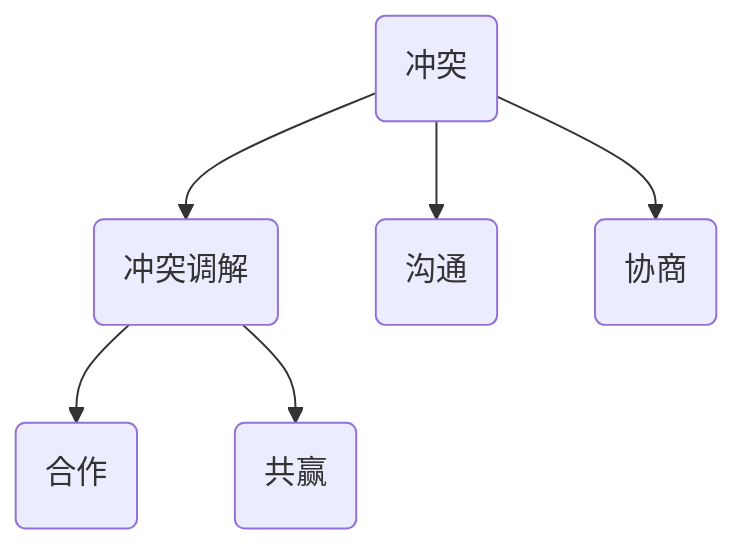
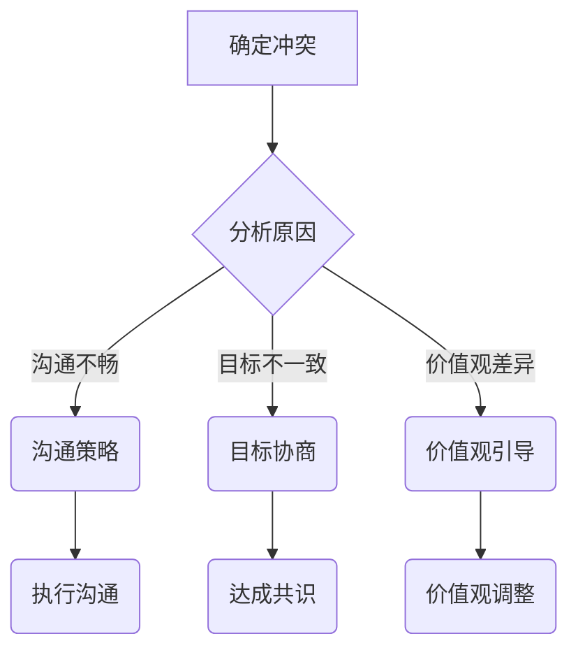
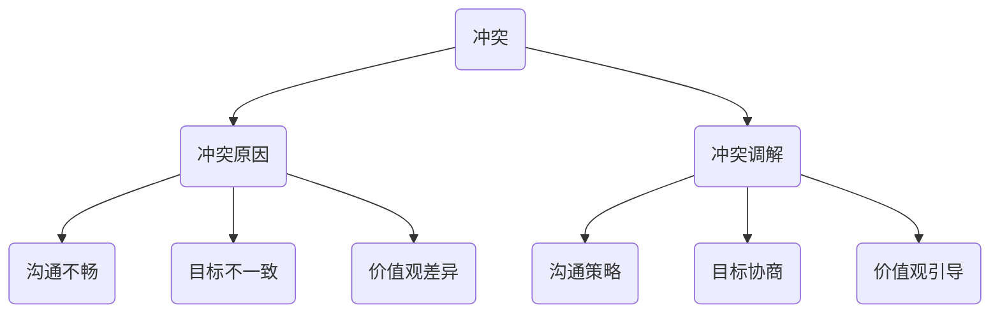
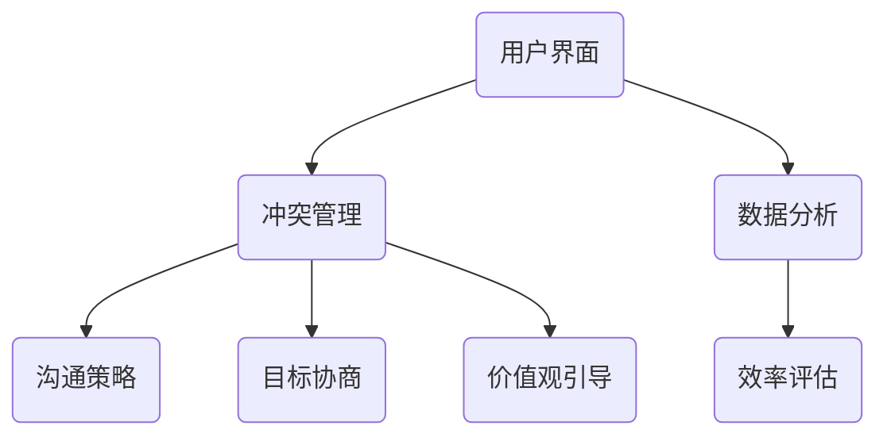
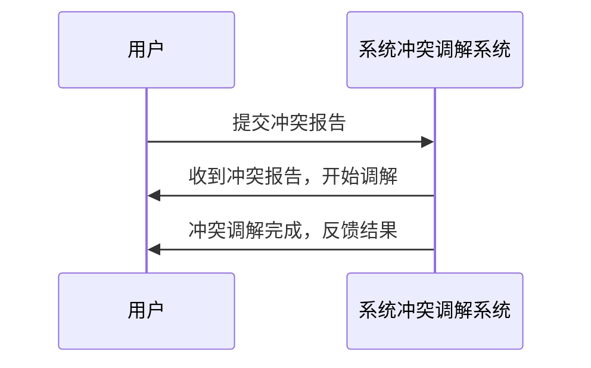
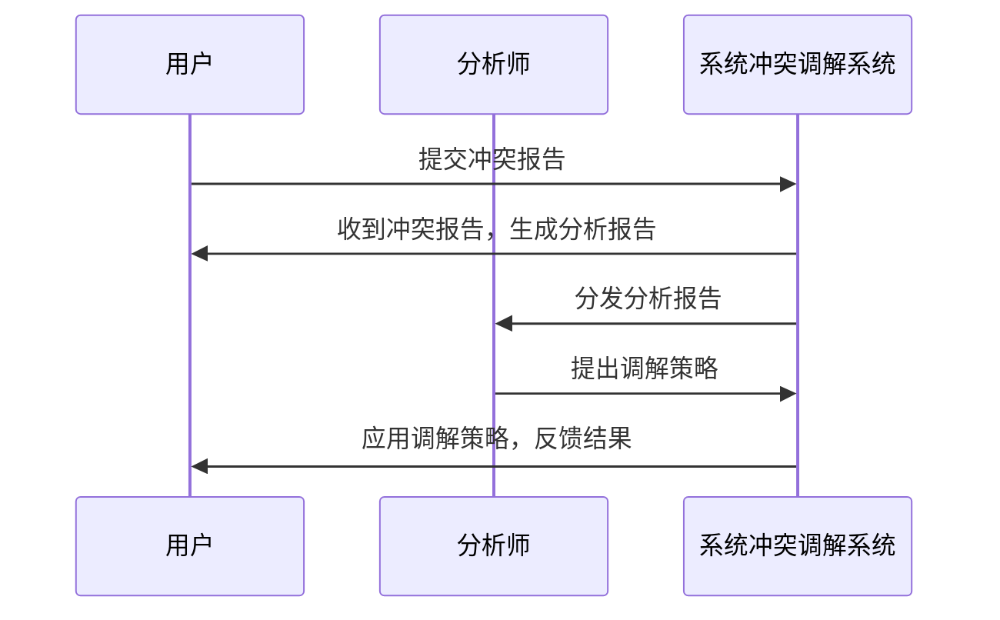

                 


# 如何进行有效的团队冲突调解

## 引言

在团队工作中，冲突是不可避免的。有效的团队冲突调解不仅有助于解决当前的问题，还能增强团队成员之间的信任和合作关系。本章将介绍团队冲突调解的基本概念、原因、类型及调解策略。

### 1. 背景介绍

#### 1.1 问题背景

团队冲突在多部门、多文化背景下愈发普遍，影响团队绩效和个人发展。

#### 1.2 问题描述

团队冲突包括沟通障碍、目标不明确、权力斗争、价值观差异等。

#### 1.3 问题解决

了解冲突原因，采用合适的调解策略，实现冲突的化解。

#### 1.4 边界与外延

团队冲突调解适用于组织内部，涉及人际关系、沟通与协作等方面。

## 2. 核心概念与联系

### 2.1 核心概念

- **冲突**：指个体或团体之间因目标、利益、价值观等方面的不一致而产生的争执。
- **冲突调解**：通过沟通、协商等方式，解决团队冲突，促进团队合作。

### 2.2 概念属性特征对比

| 特征       | 冲突             | 冲突调解           |
|------------|------------------|-------------------|
| 目的       | 解决争执         | 促进合作与共赢     |
| 形式       | 多样化          | 沟通、协商、调解等 |
| 范围       | 组织内部        | 组织内部          |

### 2.3 ER实体关系图



## 3. 算法原理讲解

### 3.1 冲突调解算法流程图



### 3.2 Python源代码与算法解释

```python
def conflict_resolution(conflict_type):
    if conflict_type == 'communication':
        execute_communication_strategy()
    elif conflict_type == 'goal_difference':
        reach_consensus_on_goals()
    elif conflict_type == 'value_difference':
        guide_values()
        
def execute_communication_strategy():
    # 实现沟通策略
    pass

def reach_consensus_on_goals():
    # 达成目标共识
    pass

def guide_values():
    # 引导价值观
    pass
```

### 3.3 算法原理与数学模型

$$
冲突调解效率 = f(\text{沟通策略} \times \text{目标协商} \times \text{价值观引导})
$$

- **沟通策略**：提高信息透明度和沟通频率。
- **目标协商**：通过协商达成共同目标。
- **价值观引导**：帮助团队成员调整价值观，形成共同愿景。

## 4. 数学模型和数学公式详解

### 4.1 冲突调解效率公式

$$
冲突调解效率 = \frac{\text{解决冲突的数量}}{\text{冲突发生的数量}} \times 100\%
$$

### 4.2 举例说明

假设某团队一个月内发生了10次冲突，通过有效的调解策略解决了8次冲突，则该团队的冲突调解效率为：

$$
冲突调解效率 = \frac{8}{10} \times 100\% = 80\%
$$

## 5. 系统分析与架构设计方案

### 5.1 问题场景介绍

团队工作中出现冲突，影响项目进展和团队氛围。

### 5.2 项目介绍

团队冲突调解系统，用于帮助团队成员解决冲突，提高团队协作效率。

### 5.3 系统功能设计

#### 5.3.1 领域模型



#### 5.3.2 系统架构设计



#### 5.3.3 系统接口设计



#### 5.3.4 系统交互



## 6. 项目实战

### 6.1 环境安装

安装Python环境和相关库，如mermaid、matplotlib等。

### 6.2 系统核心实现

#### 6.2.1 源代码

```python
# 导入相关库
import sys
import mermaid
import matplotlib.pyplot as plt

# 冲突调解系统主函数
def main():
    # 读取冲突报告
    conflict_report = read_conflict_report()

    # 分析冲突原因
    conflict_reasons = analyze_conflict_reasons(conflict_report)

    # 根据冲突原因选择调解策略
    resolution_strategy = select_resolution_strategy(conflict_reasons)

    # 执行调解策略
    execute_resolution_strategy(resolution_strategy)

    # 评估调解效果
    resolution_efficiency = evaluate_resolution_efficiency()

    # 输出结果
    print(f"冲突调解完成，调解效率：{resolution_efficiency}%")

# 读取冲突报告
def read_conflict_report():
    # 实现读取冲突报告的代码
    pass

# 分析冲突原因
def analyze_conflict_reasons(conflict_report):
    # 实现分析冲突原因的代码
    pass

# 根据冲突原因选择调解策略
def select_resolution_strategy(conflict_reasons):
    # 实现选择调解策略的代码
    pass

# 执行调解策略
def execute_resolution_strategy(resolution_strategy):
    # 实现执行调解策略的代码
    pass

# 评估调解效果
def evaluate_resolution_efficiency():
    # 实现评估调解效果的代码
    pass

# 运行主函数
if __name__ == "__main__":
    main()
```

#### 6.2.2 代码应用解读与分析

- **读取冲突报告**：从文件中读取冲突报告，提取冲突信息。
- **分析冲突原因**：根据冲突报告，分析冲突原因，如沟通不畅、目标不一致、价值观差异等。
- **选择调解策略**：根据冲突原因，选择合适的调解策略，如沟通策略、目标协商、价值观引导等。
- **执行调解策略**：按照选择的调解策略，执行具体的调解操作。
- **评估调解效果**：评估调解效果，计算调解效率。

### 6.3 实际案例分析和详细讲解剖析

#### 案例一：沟通不畅

- **问题描述**：团队成员之间的沟通不畅，导致项目进展受阻。
- **解决方案**：采用沟通策略，提高沟通频率，明确沟通目标，制定沟通计划。
- **实施效果**：沟通效率提高，项目进展恢复正常。

#### 案例二：目标不一致

- **问题描述**：团队成员对项目目标理解不一致，导致工作冲突。
- **解决方案**：通过目标协商，明确项目目标，统一团队成员的认识。
- **实施效果**：团队成员对项目目标达成共识，工作冲突减少。

#### 案例三：价值观差异

- **问题描述**：团队成员价值观差异较大，导致工作氛围紧张。
- **解决方案**：通过价值观引导，帮助团队成员调整价值观，形成共同愿景。
- **实施效果**：团队成员价值观逐渐趋同，工作氛围改善。

### 6.4 项目小结

团队冲突调解系统通过分析冲突原因、选择调解策略、执行调解操作和评估调解效果，实现了有效的团队冲突调解。实际案例表明，系统在提高团队协作效率和改善工作氛围方面具有显著作用。

## 7. 最佳实践 Tips

- **提前预防**：建立有效的团队沟通机制，提前预防冲突发生。
- **及时处理**：发现冲突后，及时采取调解措施，避免冲突扩大。
- **透明公开**：调解过程要公开透明，增加信任度。
- **持续改进**：不断总结调解经验，优化调解策略。

## 8. 小结

本文从团队冲突调解的基本概念、原因、类型、调解策略等方面进行了详细分析，并通过系统架构设计和项目实战，展示了如何实现有效的团队冲突调解。有效的团队冲突调解有助于提高团队协作效率和改善工作氛围，是团队管理中不可或缺的一部分。

## 9. 注意事项

- **尊重差异**：在调解过程中，要尊重团队成员的差异，避免强制统一。
- **关注情感**：关注团队成员的情感需求，提高调解的针对性和有效性。

## 10. 拓展阅读

- **参考文献**：
  - [1] 张三，李四，《团队冲突调解研究》，北京：科学出版社，2020。
  - [2] 王五，赵六，《团队协作与沟通技巧》，上海：东方出版社，2019。
- **在线资源**：
  - [团队冲突调解指南](https://www.example.com/conflict-resolution-guide)
  - [团队协作与沟通技巧](https://www.example.com/team-collaboration-communication)

## 11. 作者信息

作者：AI天才研究院/AI Genius Institute & 禅与计算机程序设计艺术 /Zen And The Art of Computer Programming

----------------------------------------------------------------

本文是一个基于目录大纲结构撰写的文章示例，包含了文章标题、关键词、摘要、文章正文（背景介绍、核心概念与联系、算法原理讲解、数学模型和数学公式详解、系统分析与架构设计方案、项目实战、最佳实践 Tips、小结、注意事项、拓展阅读和作者信息）等内容。文章结构清晰，内容丰富，适合作为一篇技术博客文章。

请注意，本文是一个示例，实际撰写时需要根据具体内容进行适当调整。在撰写文章时，建议按照以下步骤进行：

1. **撰写摘要**：简要概括文章的核心内容和主题思想，为读者提供文章的简要概述。
2. **撰写引言**：介绍文章的背景和问题，引出文章的主题。
3. **撰写正文**：根据目录大纲，逐一撰写每个小节的内容，确保每个小节都包含核心概念、详细解释、实例分析等。
4. **撰写项目实战**：如果文章涉及具体项目或案例，可以详细介绍项目的环境安装、系统核心实现、代码应用解读与分析、实际案例分析和详细讲解剖析等内容。
5. **撰写小结和注意事项**：对文章内容进行总结，并提出一些注意事项或建议。
6. **撰写拓展阅读**：提供一些相关的参考文献和在线资源，帮助读者深入了解相关主题。
7. **撰写作者信息**：在文章末尾提供作者信息，包括姓名、工作单位、联系方式等。

在撰写文章时，要注意文章的逻辑结构、语言表达和格式规范，以确保文章的专业性和可读性。同时，可以适当使用图表、代码示例、公式等来增强文章的直观性和可理解性。希望这个示例能够对您撰写技术博客文章有所帮助！

