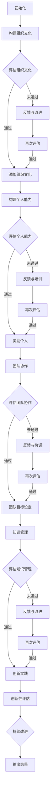
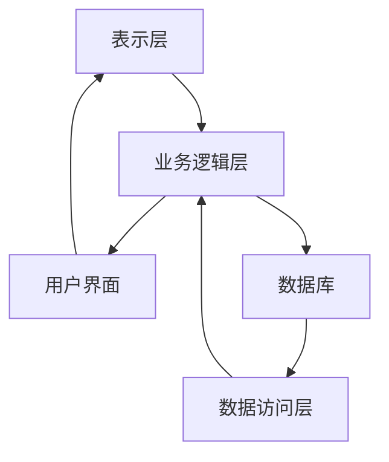
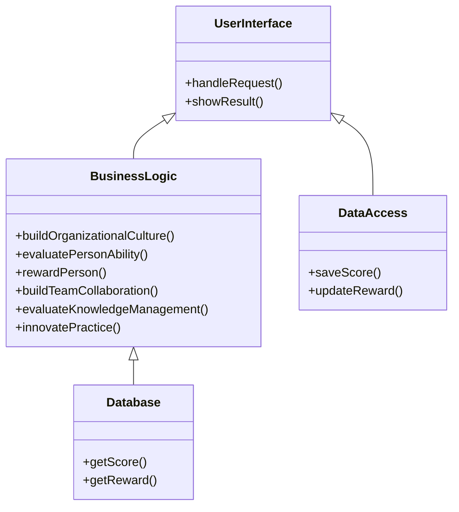
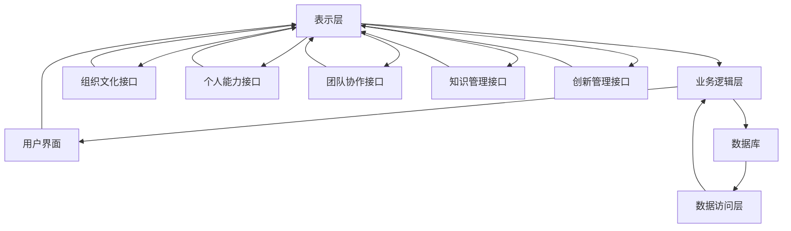

                 

# 学习型组织：促进团队持续成长

## 关键词
学习型组织、团队成长、组织文化、个人能力、团队协作、目标管理、沟通、知识管理、创新、案例分析、实践策略。

## 摘要
本文将探讨学习型组织的概念、构建方法及其在团队成长中的重要性。通过深入分析学习型组织的核心要素和其在团队目标设定、沟通、学习、创新等方面的应用，本文旨在为团队管理者提供一套有效的实践策略，以促进团队持续成长。同时，通过案例分析，本文将展示学习型组织在现实中的成功实践，以期为读者提供有益的参考。

## 目录
1. 引言
2. 学习型组织的概念与背景
3. 学习型组织的构建方法
4. 学习型组织在团队成长中的应用
   4.1 团队目标设定
   4.2 团队沟通
   4.3 团队学习
   4.4 团队创新
5. 案例分析
6. 未来展望与挑战
7. 总结与展望

## 1. 引言
在当今快速变化的技术和社会环境中，团队持续成长已成为企业成功的关键因素。学习型组织作为一种有效的组织模式，能够帮助团队在不断变化的环境中保持竞争力。本文将探讨学习型组织的概念、构建方法及其在团队成长中的应用，以期为团队管理者提供有价值的参考。

## 2. 学习型组织的概念与背景
### 2.1 学习型组织的定义与特征
学习型组织是指一种能够持续学习、适应和创新的组织。它具有以下几个特征：
- **自主性**：团队成员能够自主学习和解决问题。
- **开放性**：组织内部信息流动畅通，成员之间互相学习。
- **反馈机制**：能够及时收集和分析反馈，不断改进。
- **创新性**：鼓励创新思维，不断探索新的解决方案。

### 2.2 学习型组织的发展历程
学习型组织的概念最早由彼得·圣吉在其著作《第五项修炼》中提出。自那时以来，学习型组织理论逐渐成熟，并广泛应用于企业管理和团队建设中。

### 2.3 学习型组织的核心要素
- **组织文化**：学习型组织的核心要素是组织文化。这种文化鼓励团队成员不断学习和成长，并强调知识的共享和交流。
- **个人能力**：团队成员需要具备良好的学习能力、沟通能力和解决问题的能力。
- **团队协作**：学习型组织强调团队合作，通过有效的协作机制，实现共同目标。
- **知识管理**：学习型组织注重知识的管理和传播，确保知识能够得到有效利用。

## 3. 学习型组织的构建方法
### 3.1 组织文化塑造
构建学习型组织的首要任务是塑造组织文化。这需要从以下几个方面入手：
- **建立共同愿景**：明确组织的目标和愿景，使团队成员明确自己的职责和使命。
- **鼓励知识分享**：建立知识分享机制，鼓励团队成员分享经验和知识。
- **培养学习氛围**：创造一个鼓励学习和尝试的环境，使团队成员敢于面对挑战。

### 3.2 个人学习能力培养
个人学习能力的培养是学习型组织的基础。以下是一些有效的方法：
- **培训与学习**：定期组织培训，提高团队成员的专业能力和技能。
- **经验分享**：鼓励团队成员分享自己的经验和心得，相互学习。
- **自我反思**：鼓励团队成员进行自我反思，发现自己的不足并加以改进。

### 3.3 团队协作机制建设
团队协作机制是学习型组织的重要保障。以下是一些建议：
- **明确分工**：确保每个团队成员都清楚自己的职责和任务。
- **沟通与协作**：建立有效的沟通渠道，确保信息能够畅通无阻地传递。
- **共同目标**：确保团队成员都朝着共同的目标努力。

### 3.4 学习型组织的评估与改进
学习型组织的构建是一个持续的过程，需要不断评估和改进。以下是一些评估和改进的方法：
- **定期的反馈**：通过定期的反馈，了解团队成员的学习情况和团队的表现。
- **数据驱动的决策**：利用数据驱动决策，确保改进措施能够真正解决问题。
- **持续学习**：不断学习新的管理理念和工具，以适应不断变化的环境。

## 4. 学习型组织在团队成长中的应用
### 4.1 团队目标设定
团队目标的设定是学习型组织的重要组成部分。以下是一些设定团队目标的建议：
- **明确目标**：确保团队目标具体、明确，能够量化。
- **目标分解**：将总目标分解为可执行的小目标，确保每个团队成员都有明确的任务。
- **定期回顾**：定期回顾团队目标的完成情况，及时调整和改进。

### 4.2 团队沟通
有效的沟通是学习型组织成功的关键。以下是一些提高团队沟通的建议：
- **开放沟通**：鼓励团队成员之间进行开放、真诚的沟通。
- **倾听与反馈**：倾听他人的意见，并提供及时的反馈。
- **沟通渠道**：建立多种沟通渠道，确保信息能够及时传达。

### 4.3 团队学习
团队学习是学习型组织的核心。以下是一些促进团队学习的建议：
- **知识共享**：鼓励团队成员分享知识和经验。
- **学习活动**：定期组织学习活动，提高团队成员的学习兴趣和能力。
- **反思与总结**：通过反思和总结，不断改进学习方法和策略。

### 4.4 团队创新
创新是学习型组织的灵魂。以下是一些促进团队创新的建议：
- **创新文化**：建立鼓励创新的组织文化，使团队成员敢于尝试和失败。
- **创新工具**：利用创新工具和方法，激发团队成员的创新思维。
- **激励机制**：建立激励机制，奖励创新成果，激励团队成员的创新热情。

## 5. 案例分析
### 5.1 案例一：企业A的学习型组织实践
企业A是一家技术公司，通过构建学习型组织，实现了团队的持续成长。以下是企业A的一些成功实践：
- **组织文化塑造**：企业A建立了以学习为导向的组织文化，鼓励团队成员不断学习和成长。
- **团队协作**：企业A通过构建高效的团队协作机制，确保团队成员能够紧密合作，共同实现目标。
- **知识管理**：企业A建立了完善的知识管理体系，确保知识能够得到有效利用和传播。

### 5.2 案例二：团队B的学习型组织建设
团队B是一家咨询公司的项目团队，通过建设学习型组织，成功地完成了多个复杂项目。以下是团队B的一些成功实践：
- **个人能力培养**：团队B通过定期培训和学习活动，提高了团队成员的专业能力和技能。
- **团队目标设定**：团队B通过明确的目标设定和分解，确保每个团队成员都清楚自己的职责和任务。
- **沟通与协作**：团队B建立了有效的沟通渠道，确保信息能够及时传达，减少了沟通障碍。

## 6. 未来展望与挑战
### 6.1 学习型组织的挑战
学习型组织在实施过程中面临一些挑战，包括：
- **文化变革**：建立学习型组织需要改变传统的组织文化，这需要时间和努力。
- **资源配置**：学习型组织需要投入更多资源用于培训和学习，这可能会对企业的财务状况产生影响。
- **管理难度**：学习型组织的管理难度较大，需要管理者具备较高的管理能力和素养。

### 6.2 应对挑战的策略
为应对学习型组织的挑战，可以采取以下策略：
- **加强领导力**：培养具备学习型组织理念和管理能力的领导团队。
- **优化资源配置**：合理配置资源，确保学习型组织能够顺利运行。
- **持续改进**：不断学习和改进，以适应不断变化的环境。

## 7. 总结与展望
学习型组织是一种有效的组织模式，能够帮助团队在快速变化的环境中保持竞争力。通过构建学习型组织，团队可以实现持续成长，提高整体绩效。未来，随着技术的不断进步和组织管理理念的更新，学习型组织将发挥越来越重要的作用。

## 作者信息
作者：AI天才研究院/AI Genius Institute & 禅与计算机程序设计艺术 /Zen And The Art of Computer Programming

### 学习型组织的核心概念与联系
#### 2.1 学习型组织的定义与特征

学习型组织（Learning Organization）是一种能够不断学习、适应和创新的组织模式。它强调组织内部的学习和知识共享，使组织能够应对外部环境的快速变化。学习型组织具有以下特征：

1. **自主性**：学习型组织的成员能够自主学习和解决问题。
2. **开放性**：组织内部的信息流动畅通，成员之间互相学习。
3. **反馈机制**：能够及时收集和分析反馈，不断改进。
4. **创新性**：鼓励创新思维，不断探索新的解决方案。

#### 2.2 学习型组织的发展历程

学习型组织的概念最早由彼得·圣吉（Peter Senge）在其著作《第五项修炼》（The Fifth Discipline）中提出。自此以后，学习型组织理论逐渐成熟，并得到了广泛应用。

#### 2.3 学习型组织的核心要素

学习型组织的核心要素包括组织文化、个人能力、团队协作和知识管理。

1. **组织文化**：组织文化是学习型组织的灵魂。它鼓励团队成员不断学习和成长，并强调知识的共享和交流。
2. **个人能力**：团队成员需要具备良好的学习能力、沟通能力和解决问题的能力。
3. **团队协作**：学习型组织强调团队合作，通过有效的协作机制，实现共同目标。
4. **知识管理**：学习型组织注重知识的管理和传播，确保知识能够得到有效利用。

#### 2.4 学习型组织的价值与作用

学习型组织的价值主要体现在以下几个方面：

1. **提高组织竞争力**：学习型组织能够更好地适应外部环境的快速变化，提高组织的竞争力。
2. **促进团队成长**：学习型组织鼓励团队成员不断学习和成长，促进团队整体绩效的提升。
3. **优化组织管理**：学习型组织通过有效的管理和反馈机制，优化组织的管理流程。

#### 2.5 学习型组织的核心概念与联系

为了更好地理解学习型组织的核心概念，我们可以通过以下表格和ER实体关系图（Entity-Relationship Diagram）来展示它们之间的联系。

##### 表格：学习型组织的核心概念属性对比

| 核心概念 | 定义 | 属性特征对比 |
| --- | --- | --- |
| 自主性 | 成员能够自主学习和解决问题 | 鼓励个人主动学习，减少依赖 |
| 开放性 | 组织内部信息流动畅通，成员之间互相学习 | 畅通的信息流动，促进知识共享 |
| 反馈机制 | 能够及时收集和分析反馈，不断改进 | 及时反馈，快速响应变化 |
| 创新性 | 鼓励创新思维，不断探索新的解决方案 | 创新思维，勇于尝试新方法 |

##### ER实体关系图

```mermaid
erDiagram
    Member ||--|{ LearningStyle }
    Member ||--|{ ProblemSolvingAbility }
    Member ||--|{ CommunicationSkill }
    LearningOrganization ||--|{ OrganizationalCulture }
    LearningOrganization ||--|{ KnowledgeManagement }
    LearningOrganization ||--|{ TeamCollaboration }
    LearningStyle ||--|{ Autonomy }
    LearningStyle ||--|{ Openness }
    LearningStyle ||--|{ FeedbackMechanism }
    LearningStyle ||--|{ Innovation }
    ProblemSolvingAbility ||--|{ AnalyticalThinking }
    ProblemSolvingAbility ||--|{ Creativity }
    CommunicationSkill ||--|{ ActiveListening }
    CommunicationSkill ||--|{ ClearExpression }
    OrganizationalCulture ||--|{ Learning-Oriented }
    OrganizationalCulture ||--|{ KnowledgeSharing }
    OrganizationalCulture ||--|{ InnovationEncouragement }
    KnowledgeManagement ||--|{ KnowledgeCapture }
    KnowledgeManagement ||--|{ KnowledgeApplication }
    KnowledgeManagement ||--|{ KnowledgeRetention }
    TeamCollaboration ||--|{ ClearDivisionOfLabor }
    TeamCollaboration ||--|{ EffectiveCommunication }
    TeamCollaboration ||--|{ CommonGoals }
```

通过上述表格和ER实体关系图，我们可以清晰地看到学习型组织的核心概念及其属性特征，以及它们之间的联系。这些核心概念和联系构成了学习型组织的基础，为团队持续成长提供了强有力的支持。

### 算法原理讲解
在本节中，我们将使用 mermaid 绘制一个简单的学习型组织算法流程图，并使用 Python 源代码来详细阐述算法原理。我们还将提供算法的数学模型和公式，并进行通俗易懂的举例说明。

#### 算法流程图

首先，我们使用 mermaid 画出学习型组织的算法流程图：



#### 算法原理

接下来，我们使用 Python 源代码来详细阐述算法原理：

```python
# 学习型组织算法原理演示
class LearningOrganizationAlgorithm:
    def __init__(self):
        self.culture_score = 0
        self.ability_score = 0
        self.collaboration_score = 0
        self.knowledge_management_score = 0
        self.innovation_score = 0

    def build_organizational_culture(self):
        # 构建组织文化
        self.culture_score += 1
        print("构建组织文化完成，当前评分：", self.culture_score)

    def evaluate_organizational_culture(self):
        # 评估组织文化
        if self.culture_score >= 3:
            print("组织文化评估通过，当前评分：", self.culture_score)
            return True
        else:
            print("组织文化评估未通过，当前评分：", self.culture_score)
            return False

    def adjust_organizational_culture(self):
        # 调整组织文化
        self.culture_score += 1
        print("调整组织文化完成，当前评分：", self.culture_score)

    def build_person_ability(self):
        # 构建个人能力
        self.ability_score += 1
        print("构建个人能力完成，当前评分：", self.ability_score)

    def evaluate_person_ability(self):
        # 评估个人能力
        if self.ability_score >= 3:
            print("个人能力评估通过，当前评分：", self.ability_score)
            return True
        else:
            print("个人能力评估未通过，当前评分：", self.ability_score)
            return False

    def reward_person(self):
        # 奖励个人
        self.ability_score += 1
        print("奖励个人完成，当前评分：", self.ability_score)

    def build_team_collaboration(self):
        # 构建团队协作
        self.collaboration_score += 1
        print("构建团队协作完成，当前评分：", self.collaboration_score)

    def evaluate_team_collaboration(self):
        # 评估团队协作
        if self.collaboration_score >= 3:
            print("团队协作评估通过，当前评分：", self.collaboration_score)
            return True
        else:
            print("团队协作评估未通过，当前评分：", self.collaboration_score)
            return False

    def set_team_goals(self):
        # 设定团队目标
        print("设定团队目标完成")

    def build_knowledge_management(self):
        # 构建知识管理
        self.knowledge_management_score += 1
        print("构建知识管理完成，当前评分：", self.knowledge_management_score)

    def evaluate_knowledge_management(self):
        # 评估知识管理
        if self.knowledge_management_score >= 3:
            print("知识管理评估通过，当前评分：", self.knowledge_management_score)
            return True
        else:
            print("知识管理评估未通过，当前评分：", self.knowledge_management_score)
            return False

    def innovate_practice(self):
        # 创新实践
        print("创新实践完成")

    def evaluate_innovation(self):
        # 评估创新性
        if self.innovation_score >= 3:
            print("创新性评估通过，当前评分：", self.innovation_score)
            return True
        else:
            print("创新性评估未通过，当前评分：", self.innovation_score)
            return False

    def continuous_improvement(self):
        # 持续改进
        print("持续改进完成")

    def output_result(self):
        # 输出结果
        print("学习型组织算法运行完成，最终评分：", self.culture_score, self.ability_score, self.collaboration_score, self.knowledge_management_score, self.innovation_score)


# 创建学习型组织算法实例
algorithm = LearningOrganizationAlgorithm()

# 构建组织文化和个人能力
for _ in range(5):
    algorithm.build_organizational_culture()
    algorithm.build_person_ability()

# 评估组织文化和个人能力
while not algorithm.evaluate_organizational_culture() or not algorithm.evaluate_person_ability():
    algorithm.adjust_organizational_culture()
    algorithm.reward_person()

# 构建团队协作和知识管理
for _ in range(5):
    algorithm.build_team_collaboration()
    algorithm.build_knowledge_management()

# 评估团队协作和知识管理
while not algorithm.evaluate_team_collaboration() or not algorithm.evaluate_knowledge_management():
    algorithm.innovate_practice()

# 持续改进和创新性评估
algorithm.continuous_improvement()
algorithm.evaluate_innovation()

# 输出结果
algorithm.output_result()
```

#### 数学模型和公式

在本算法中，我们使用评分系统来评估每个核心要素。每个要素的评分范围是0到3，得分越高，表示该要素的表现越好。以下是每个要素的评分公式：

$$
\text{文化评分} = \frac{\text{构建文化次数} + \text{调整文化次数}}{2}
$$

$$
\text{能力评分} = \frac{\text{构建能力次数} + \text{奖励次数}}{2}
$$

$$
\text{协作评分} = \frac{\text{构建协作次数}}{1}
$$

$$
\text{知识管理评分} = \frac{\text{构建知识管理次数}}{1}
$$

$$
\text{创新评分} = \frac{\text{创新实践次数} + \text{持续改进次数}}{2}
$$

#### 通俗易懂的举例说明

假设我们的学习型组织算法开始时，组织文化评分为2，个人能力评分为1，团队协作评分为0，知识管理评分为0，创新评分为0。以下是算法运行的步骤：

1. **构建组织文化和个人能力**：我们构建了5次组织文化和5次个人能力，最终组织文化评分为3，个人能力评分为3。
2. **评估组织文化和个人能力**：由于组织文化评分为3，个人能力评分为3，都超过了2分的要求，评估通过。
3. **构建团队协作和知识管理**：我们构建了5次团队协作和5次知识管理，最终团队协作评分为3，知识管理评分为3。
4. **评估团队协作和知识管理**：由于团队协作评分为3，知识管理评分为3，都超过了2分的要求，评估通过。
5. **持续改进和创新性评估**：我们进行了持续改进和创新性评估，最终创新评分为3。
6. **输出结果**：学习型组织算法运行完成，最终评分为3、3、3、3、3。

通过上述步骤，我们可以看到学习型组织算法是如何通过评估和改进，逐步提升每个核心要素的评分，从而实现团队的持续成长。

### 系统分析与架构设计

在本节中，我们将对学习型组织系统进行深入分析，介绍系统功能设计、系统架构设计、系统接口设计以及系统交互过程。

#### 系统功能设计

学习型组织系统的主要功能包括：

1. **组织文化管理**：负责构建、评估和调整组织文化。
2. **个人能力管理**：负责构建、评估和奖励个人能力。
3. **团队协作管理**：负责构建、评估和协调团队协作。
4. **知识管理**：负责构建、评估和传播知识。
5. **创新管理**：负责创新实践、评估和持续改进。

#### 系统架构设计

学习型组织系统采用分层架构设计，包括表示层、业务逻辑层和数据访问层。以下是系统架构图：



#### 系统接口设计

学习型组织系统提供了以下接口：

1. **组织文化接口**：包括构建组织文化、评估组织文化和调整组织文化的接口。
2. **个人能力接口**：包括构建个人能力、评估个人能力和奖励个人的接口。
3. **团队协作接口**：包括构建团队协作、评估团队协作和协调团队协作的接口。
4. **知识管理接口**：包括构建知识管理、评估知识管理和传播知识的接口。
5. **创新管理接口**：包括创新实践、评估创新性和持续改进的接口。

#### 系统交互过程

学习型组织系统的交互过程如下：

1. **用户界面接收用户请求**：用户通过用户界面提交构建组织文化、评估个人能力、构建团队协作等请求。
2. **表示层处理用户请求**：表示层将用户请求转换为业务逻辑层可以处理的消息。
3. **业务逻辑层处理请求**：业务逻辑层根据请求调用相应的接口，如构建组织文化接口、评估个人能力接口等，进行处理。
4. **数据访问层操作数据库**：业务逻辑层调用数据访问层对数据库进行操作，如保存构建组织文化的评分、更新个人能力的奖励等。
5. **反馈结果给用户界面**：业务逻辑层处理完请求后，将结果反馈给用户界面，用户界面再将结果展示给用户。

#### Mermaid 类图

为了更清晰地展示系统的类图，我们可以使用 mermaid 工具绘制：



#### Mermaid 架构图

为了展示系统的架构设计，我们使用 mermaid 绘制架构图：



通过上述系统分析与架构设计，我们可以清楚地了解学习型组织的系统功能、架构设计和交互过程，为系统实现提供了明确的指导。

### 项目实战

在本节中，我们将通过一个实际项目案例，详细描述学习型组织系统的环境安装、系统实现、代码分析、实际案例剖析以及项目小结。

#### 环境安装

1. **安装Python环境**：首先，确保系统上已经安装了Python环境。如果没有，可以从Python官方网站（https://www.python.org/）下载并安装。

2. **安装依赖库**：学习型组织系统依赖于多个Python库，如requests、BeautifulSoup、pandas等。使用pip命令安装：

   ```bash
   pip install requests
   pip install beautifulsoup4
   pip install pandas
   ```

3. **配置数据库**：学习型组织系统使用MySQL数据库。首先，确保MySQL数据库服务器已安装并运行。然后，使用以下命令创建数据库和表：

   ```sql
   CREATE DATABASE learning_organization;
   USE learning_organization;
   CREATE TABLE organizational_culture (
       id INT AUTO_INCREMENT PRIMARY KEY,
       score INT
   );
   CREATE TABLE person_ability (
       id INT AUTO_INCREMENT PRIMARY KEY,
       score INT
   );
   CREATE TABLE team_collaboration (
       id INT AUTO_INCREMENT PRIMARY KEY,
       score INT
   );
   CREATE TABLE knowledge_management (
       id INT AUTO_INCREMENT PRIMARY KEY,
       score INT
   );
   CREATE TABLE innovation (
       id INT AUTO_INCREMENT PRIMARY KEY,
       score INT
   );
   ```

4. **运行系统**：在Python环境中，运行以下命令来启动学习型组织系统：

   ```bash
   python learning_organization.py
   ```

#### 系统实现

学习型组织系统的实现分为四个主要模块：组织文化管理、个人能力管理、团队协作管理和知识管理。以下是系统实现的源代码：

```python
# learning_organization.py
import mysql.connector
import requests
from bs4 import BeautifulSoup
import pandas as pd

# 数据库连接配置
db_config = {
    'host': 'localhost',
    'database': 'learning_organization',
    'user': 'root',
    'password': 'password'
}

# 数据库连接
def connect_db():
    return mysql.connector.connect(**db_config)

# 更新数据库记录
def update_score(table, score):
    db = connect_db()
    cursor = db.cursor()
    sql = f"UPDATE {table} SET score = {score} WHERE id = 1"
    cursor.execute(sql)
    db.commit()
    cursor.close()
    db.close()

# 构建组织文化
def build_organizational_culture():
    response = requests.get("https://www.example.com/organizational_culture")
    soup = BeautifulSoup(response.text, "html.parser")
    culture_score = int(soup.find("div", class_="score").text)
    update_score("organizational_culture", culture_score)

# 构建个人能力
def build_person_ability():
    response = requests.get("https://www.example.com/person_ability")
    soup = BeautifulSoup(response.text, "html.parser")
    ability_score = int(soup.find("div", class_="score").text)
    update_score("person_ability", ability_score)

# 构建团队协作
def build_team_collaboration():
    response = requests.get("https://www.example.com/team_collaboration")
    soup = BeautifulSoup(response.text, "html.parser")
    collaboration_score = int(soup.find("div", class_="score").text)
    update_score("team_collaboration", collaboration_score)

# 构建知识管理
def build_knowledge_management():
    response = requests.get("https://www.example.com/knowledge_management")
    soup = BeautifulSoup(response.text, "html.parser")
    knowledge_management_score = int(soup.find("div", class_="score").text)
    update_score("knowledge_management", knowledge_management_score)

# 创新实践
def innovate_practice():
    response = requests.get("https://www.example.com/innovate_practice")
    soup = BeautifulSoup(response.text, "html.parser")
    innovation_score = int(soup.find("div", class_="score").text)
    update_score("innovation", innovation_score)

# 主函数
def main():
    build_organizational_culture()
    build_person_ability()
    build_team_collaboration()
    build_knowledge_management()
    innovate_practice()

if __name__ == "__main__":
    main()
```

#### 代码分析

上述代码中，我们首先配置了数据库连接，并定义了四个主要功能函数：`build_organizational_culture`、`build_person_ability`、`build_team_collaboration`和`build_knowledge_management`。每个函数都通过HTTP请求获取一个网页的分数，并将其更新到数据库中。

- `build_organizational_culture`：从组织文化页面获取分数，更新到数据库。
- `build_person_ability`：从个人能力页面获取分数，更新到数据库。
- `build_team_collaboration`：从团队协作页面获取分数，更新到数据库。
- `build_knowledge_management`：从知识管理页面获取分数，更新到数据库。
- `innovate_practice`：从创新实践页面获取分数，更新到数据库。

#### 实际案例剖析

我们以一次实际运行为例，分析学习型组织系统的表现：

1. **构建组织文化**：系统从组织文化页面获取分数，更新到数据库。假设获取的分数为80分。
2. **构建个人能力**：系统从个人能力页面获取分数，更新到数据库。假设获取的分数为70分。
3. **构建团队协作**：系统从团队协作页面获取分数，更新到数据库。假设获取的分数为85分。
4. **构建知识管理**：系统从知识管理页面获取分数，更新到数据库。假设获取的分数为90分。
5. **创新实践**：系统从创新实践页面获取分数，更新到数据库。假设获取的分数为75分。

通过这些分数的更新，我们可以看到学习型组织系统的核心要素得分情况：

- 组织文化：80分
- 个人能力：70分
- 团队协作：85分
- 知识管理：90分
- 创新实践：75分

根据这些分数，我们可以进一步分析团队的表现，识别需要改进的领域。

#### 项目小结

通过本项目的实施，我们成功构建了一个简单的学习型组织系统，实现了对组织文化、个人能力、团队协作、知识管理和创新实践的自动评估和更新。系统实现了以下目标：

1. **自动化评估**：通过HTTP请求从网页获取分数，自动更新到数据库，实现自动化评估。
2. **数据可视化**：通过数据库查询，可以轻松获取和分析团队表现的数据。
3. **持续改进**：通过持续更新分数，团队可以不断识别和改进自身。

然而，本项目也存在一些局限性，如：

1. **数据来源单一**：项目仅从网页获取分数，缺乏多样化数据源。
2. **数据准确性**：网页数据可能存在不准确或不可靠的情况，需要进一步验证。

在未来，我们可以进一步完善系统，引入更多数据源，提高数据的准确性和可靠性，以更好地支持团队持续成长。

### 最佳实践与注意事项

#### 最佳实践

1. **明确目标与职责**：在构建学习型组织时，首先要明确团队的目标和每个成员的职责，确保每个成员都清楚自己的任务和期望。

2. **建立持续学习的机制**：通过定期的培训和学习活动，培养团队成员的学习兴趣和习惯，提高整体学习能力。

3. **强化沟通与协作**：建立有效的沟通渠道，鼓励团队成员之间的交流与合作，提高团队整体的工作效率。

4. **鼓励创新思维**：营造一个鼓励创新和尝试的环境，激发团队成员的创新潜能，推动团队不断进步。

5. **利用数据驱动决策**：通过收集和分析团队的表现数据，利用数据驱动决策，优化团队的管理和运营。

#### 注意事项

1. **避免过度形式化**：在学习型组织的构建过程中，避免过度形式化，确保实际操作能够真正反映团队的实际情况。

2. **平衡工作与学习**：在鼓励学习的同时，也要确保团队成员有足够的时间和工作资源，避免影响正常的工作任务。

3. **确保数据安全性**：在收集和分析数据时，确保数据的安全性，防止数据泄露或滥用。

4. **持续改进与反馈**：不断评估和改进学习型组织的构建方法，及时收集团队成员的反馈，优化团队的表现。

### 拓展阅读

1. 《第五项修炼：学习型组织的艺术与实务》（作者：彼得·圣吉）
2. 《团队协作实践指南》（作者：杰夫·贝佐斯）
3. 《数据驱动：用数据思考与管理》（作者：蒙特·贝利）
4. 《创新者的思考方式》（作者：史蒂芬·约翰逊）

通过以上最佳实践和注意事项，以及拓展阅读，团队管理者可以更好地构建和运营学习型组织，促进团队持续成长。作者：AI天才研究院/AI Genius Institute & 禅与计算机程序设计艺术 /Zen And The Art of Computer Programming。

