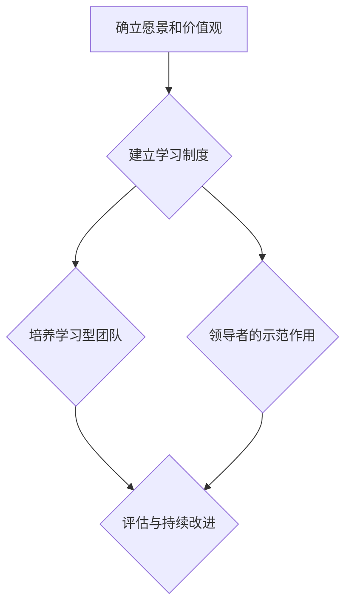

                 

# 学习文化：促进团队持续成长和创新

## 关键词
- 学习文化
- 团队成长
- 创新驱动
- 持续学习
- 企业绩效

## 摘要
本文深入探讨学习文化在企业中的重要性，通过分析学习文化的定义、特征、构建方法和实践案例，阐述学习文化如何促进团队的持续成长和创新。文章旨在为读者提供一套完整的构建和推广学习文化的策略，帮助企业和团队在竞争激烈的市场中保持优势。

## 引言

### 1.1 书籍主题
《学习文化：促进团队持续成长和创新》是一本专门探讨学习文化在企业或组织中的应用和价值的书籍。它不仅关注学习文化的理论构建，更注重实际操作和案例分析，为读者提供一套可操作、可落地的学习文化建设方案。

### 1.2 学习文化的定义与特征
学习文化是一种以学习为核心的工作氛围，它鼓励员工不断地获取新知识、技能和经验，并将其应用于工作中。学习文化的特征包括共享学习、创新驱动、自我提升和持续学习。

- **共享学习**：员工之间相互分享知识和经验，形成知识共享的网络。
- **创新驱动**：鼓励员工尝试新思路、新方法，推动创新。
- **自我提升**：员工有意识地提升自己的知识和技能。
- **持续学习**：学习贯穿于员工的工作和生活中，成为员工的日常行为。

### 1.3 学习文化的重要性
学习文化对员工个人发展和企业绩效都有着重要的影响。

- **提高员工素质**：通过不断学习，员工可以提升自身的专业能力和综合素质。
- **增强团队凝聚力**：共同的学习目标和价值观念有助于增强团队的凝聚力。
- **促进创新**：学习文化鼓励员工尝试新思路，推动创新。
- **提高企业竞争力**：持续学习使企业能够适应快速变化的市场环境，保持竞争优势。

### 1.4 书籍结构
本文分为四个部分：引言、构建学习文化、学习文化的实践、挑战与展望。

- **引言**：介绍学习文化的定义、特征及其重要性。
- **构建学习文化**：探讨如何建立和推广学习文化。
- **学习文化的实践**：分析学习文化在不同企业或组织中的应用和实践。
- **挑战与展望**：讨论学习文化面临的挑战及其未来发展趋势。

### 第二部分：构建学习文化

#### 2.1 确立学习文化的愿景和价值观
构建学习文化的第一步是明确企业的愿景和价值观。这包括：

- **愿景**：明确企业希望通过学习文化实现的长期目标。
- **价值观**：确定企业倡导的核心价值观，如持续学习、共享知识、尊重创新等。

#### 2.2 建立学习制度
建立学习制度是确保学习文化得以贯彻的关键。这包括：

- **培训计划**：制定系统的培训计划，包括内部培训和外部培训。
- **知识分享平台**：建立知识分享平台，如内部论坛、知识库等，以促进知识交流。
- **激励机制**：设立激励机制，鼓励员工积极参与学习和知识分享。

#### 2.3 培养学习型团队
培养学习型团队是构建学习文化的重要一环。这包括：

- **共同学习**：鼓励团队成员共同参与学习活动，形成学习小组。
- **反馈与改进**：建立有效的反馈机制，对学习过程进行持续改进。
- **团队文化**：营造积极向上的团队文化，鼓励团队成员互相支持、共同进步。

#### 2.4 领导者的角色
领导者在构建学习文化中扮演着关键角色。他们应该：

- **树立榜样**：通过自己的行为树立学习的榜样。
- **提供资源**：为员工提供学习和发展的资源和支持。
- **鼓励创新**：鼓励员工勇于尝试新思路，推动创新。

#### 2.5 学习文化的评估与持续改进
为了确保学习文化得以持续发展，需要进行定期的评估和改进。这包括：

- **评估指标**：设立学习文化的评估指标，如员工满意度、知识共享率等。
- **反馈机制**：收集员工的反馈，了解学习文化的实施效果。
- **改进措施**：根据评估结果，制定相应的改进措施，持续优化学习文化。

### 第三部分：学习文化的实践

#### 3.1 成功案例分享
本部分将分享一些成功构建学习文化的企业或组织的案例。这些案例将详细介绍它们如何实施学习文化，以及取得的成功和经验教训。

#### 3.2 面临的挑战与解决方案
在构建学习文化的过程中，企业或组织可能会面临各种挑战。本部分将探讨这些挑战，并提出相应的解决方案。

#### 3.3 不同行业的学习文化实践
学习文化在不同行业中的应用可能有所不同。本部分将分析不同行业如何根据自身特点构建和推广学习文化。

### 第三部分：学习文化的实践（续）

#### 3.4 学习文化与组织绩效的关系
本部分将探讨学习文化如何影响组织绩效，以及如何通过学习文化提升企业的核心竞争力。

- **绩效提升**：学习文化有助于提高员工的专业能力和工作效率，从而提升组织绩效。
- **竞争力提升**：持续学习使企业能够适应市场变化，提高核心竞争力。

#### 3.5 学习文化与员工发展的关系
学习文化不仅对组织绩效有重要影响，也对员工的个人发展产生深远影响。本部分将分析学习文化如何促进员工职业成长和幸福感。

- **职业成长**：学习文化为员工提供不断成长的机会，帮助员工实现职业目标。
- **幸福感提升**：学习文化营造积极的学习氛围，提高员工的工作满意度和幸福感。

### 结束语
学习文化是企业和团队持续成长和创新的重要推动力。通过建立和推广学习文化，企业可以提升员工的素质和绩效，增强团队的凝聚力，推动创新，提高核心竞争力。本文通过分析学习文化的定义、特征、构建方法和实践案例，为读者提供了一套完整的构建和推广学习文化的策略。希望本文能够对企业和团队在构建学习文化的道路上提供有益的参考和启示。

## 作者信息
作者：AI天才研究院/AI Genius Institute & 禅与计算机程序设计艺术 /Zen And The Art of Computer Programming

----------------------------------------------------------------

## 第二部分：构建学习文化

### 2.1 确立学习文化的愿景和价值观

构建学习文化的第一步是明确企业的愿景和价值观。这涉及到企业的长远目标和核心价值观，它们为学习文化的构建提供了方向和动力。以下是如何确立学习文化愿景和价值观的步骤：

#### 2.1.1 明确企业愿景

企业的愿景是企业在未来想要达到的目标和状态。在确立学习文化愿景时，企业需要思考以下问题：

- 企业希望成为什么样的组织？
- 企业希望员工在学习和成长方面达到什么水平？
- 企业希望通过学习文化实现什么业务目标？

通过明确这些问题，企业可以制定一个具有吸引力和激励性的愿景，这个愿景将成为学习文化建设的基石。

#### 2.1.2 确定核心价值观

核心价值观是企业长期坚持的信仰和行为准则，它们指导企业的决策和行动。对于学习文化而言，以下核心价值观尤为重要：

- **持续学习**：企业鼓励员工不断学习新知识和技能，以适应快速变化的市场环境。
- **知识共享**：企业倡导员工之间相互分享知识和经验，形成共同成长的学习氛围。
- **尊重创新**：企业鼓励员工尝试新思路和新方法，勇于创新，推动组织的进步。
- **自我提升**：企业支持员工自我提升，为员工提供学习和发展的机会。

#### 2.1.3 沟通与共识

确立愿景和价值观后，企业需要通过内部沟通和共识，使所有员工理解和认同这些目标。这可以通过以下方式实现：

- **内部会议**：组织内部会议，向员工介绍学习文化的愿景和价值观，解答员工的疑问。
- **宣传材料**：制作宣传手册、海报等材料，在企业的内部网站和办公区域进行展示。
- **培训课程**：开设培训课程，帮助员工深入理解学习文化的内涵和重要性。

通过这些方式，企业可以确保所有员工都明确学习文化的愿景和价值观，并在日常工作中积极践行。

### 2.2 建立学习制度

建立学习制度是确保学习文化得以贯彻的关键。学习制度包括培训计划、知识分享平台和激励机制等。以下是如何建立学习制度的步骤：

#### 2.2.1 制定培训计划

培训计划是学习制度的核心组成部分，它需要根据企业的需求和员工的职业发展规划来制定。以下步骤有助于制定有效的培训计划：

- **需求分析**：分析企业的业务需求和员工的职业发展需求，确定培训的重点方向。
- **内容规划**：根据需求分析结果，规划培训的内容，包括内部培训课程和外部培训资源。
- **时间安排**：制定培训的时间表，确保培训计划能够顺利执行。
- **资源分配**：为培训计划分配必要的资源，如培训场地、讲师和培训材料。

#### 2.2.2 建立知识分享平台

知识分享平台是促进员工之间知识和经验交流的重要工具。以下步骤有助于建立有效的知识分享平台：

- **选择平台**：选择合适的知识分享平台，如内部论坛、知识库、社交媒体等。
- **内容建设**：鼓励员工在知识分享平台上分享自己的知识和经验，形成丰富的知识库。
- **管理维护**：定期维护知识分享平台，更新内容，确保平台的有效运行。

#### 2.2.3 设立激励机制

激励机制是鼓励员工积极参与学习和知识分享的重要手段。以下步骤有助于设立有效的激励机制：

- **奖励制度**：制定奖励制度，对积极参与学习和知识分享的员工进行奖励，如奖金、荣誉证书等。
- **晋升机制**：将学习和知识分享作为员工晋升的重要依据，激励员工不断提升自己。
- **反馈机制**：建立反馈机制，收集员工的意见和建议，不断改进激励机制。

通过这些步骤，企业可以建立一套完善的学

### 2.3 培养学习型团队

培养学习型团队是构建学习文化的关键步骤。学习型团队是指能够持续学习、不断进步的团队，它们具有以下特点：

- **共同愿景**：团队成员共同拥有一个明确的愿景，并为实现这个愿景而努力。
- **积极心态**：团队成员保持积极的心态，勇于面对挑战，乐于学习新知识。
- **知识共享**：团队成员之间积极分享知识和经验，形成知识共享的网络。
- **持续改进**：团队不断反思和改进自己的工作方法，以提升团队绩效。

以下是如何培养学习型团队的步骤：

#### 2.3.1 共同学习

共同学习是培养学习型团队的基础。以下步骤有助于实现共同学习：

- **制定学习计划**：团队共同制定学习计划，确定学习的内容和目标。
- **学习活动**：组织各种学习活动，如研讨会、讲座、小组讨论等，促进团队成员之间的交流。
- **反馈与反思**：在学习活动结束后，团队成员共同反馈和反思，总结学习成果和经验。

#### 2.3.2 知识共享

知识共享是学习型团队的核心特征。以下步骤有助于实现知识共享：

- **建立知识库**：建立团队知识库，收集和整理团队成员的知识和经验，方便共享和查询。
- **鼓励分享**：鼓励团队成员主动分享自己的知识和经验，形成知识共享的文化。
- **知识交流**：定期组织知识交流会议，让团队成员有机会分享自己的见解和经验。

#### 2.3.3 反馈与改进

持续反馈和改进是学习型团队不断进步的动力。以下步骤有助于实现反馈与改进：

- **建立反馈机制**：建立反馈机制，收集团队成员对团队工作的意见和建议。
- **定期评估**：定期对团队的学习成果和绩效进行评估，找出不足之处，制定改进措施。
- **持续改进**：根据评估结果，持续改进团队的学习方法和工作方式。

通过这些步骤，企业可以培养出具有持续学习能力和创新精神的团队，为企业的持续成长和创新提供强有力的支持。

### 2.4 领导者的角色

在构建学习文化过程中，领导者的角色至关重要。领导者不仅是学习文化的倡导者，更是实践者和推动者。以下是如何发挥领导者角色的步骤：

#### 2.4.1 树立榜样

领导者需要通过自己的行为树立学习的榜样，展示持续学习和创新的精神。以下方式可以帮助领导者树立榜样：

- **公开分享**：定期与团队成员分享自己的学习心得和经验，展示学习的态度和方法。
- **参与学习活动**：积极参与企业的学习活动，如培训课程、研讨会等，与团队成员一起学习。
- **鼓励创新**：在团队中鼓励创新思维，支持员工尝试新方法和新思路。

#### 2.4.2 提供资源

领导者需要为员工提供学习和发展的资源，包括时间、资金和机会。以下方式可以帮助领导者提供资源：

- **培训机会**：为员工提供参加外部培训和研讨会的机会，帮助员工提升专业能力。
- **学习材料**：为员工提供学习材料，如专业书籍、在线课程等，帮助员工自主学习。
- **时间支持**：为员工提供充足的时间用于学习和工作，避免因工作压力而忽视了学习。

#### 2.4.3 鼓励创新

领导者需要鼓励员工勇于尝试新思路和新方法，推动团队的创新。以下方式可以帮助领导者鼓励创新：

- **设立创新项目**：设立专门的创新项目，为员工提供实现创新想法的机会。
- **提供反馈**：对员工的创新想法和项目提供积极的反馈，鼓励员工继续努力。
- **奖励创新**：对取得创新成果的员工给予奖励，如奖金、晋升等，激励员工持续创新。

通过以上步骤，领导者可以在构建学习文化中发挥关键作用，推动团队持续成长和创新。

### 2.5 学习文化的评估与持续改进

为了确保学习文化能够持续发展并产生实际效果，企业需要进行定期的评估和改进。以下是如何进行学习文化评估与持续改进的步骤：

#### 2.5.1 设立评估指标

设立评估指标是评估学习文化效果的基础。以下是一些常见的评估指标：

- **员工满意度**：通过调查问卷、访谈等方式，了解员工对学习文化的满意度。
- **知识共享率**：统计员工在知识分享平台上的分享次数和质量，衡量知识共享的程度。
- **学习参与度**：统计员工参加培训课程、学习活动的次数和参与程度。
- **创新成果**：评估学习文化对企业创新成果的贡献，如新产品、新服务等。

#### 2.5.2 收集反馈

收集反馈是了解学习文化实施效果的重要手段。以下方式可以帮助企业收集反馈：

- **员工调查**：定期进行员工调查，收集员工对学习文化的意见和建议。
- **访谈**：与员工进行面对面访谈，深入了解他们对学习文化的看法和体验。
- **会议**：在团队会议中，鼓励员工分享学习心得和反馈，形成集体智慧。

#### 2.5.3 分析评估结果

分析评估结果是制定改进措施的重要依据。以下步骤可以帮助企业分析评估结果：

- **数据汇总**：将收集到的数据汇总，形成评估报告。
- **问题识别**：识别评估结果中存在的问题和不足。
- **原因分析**：分析问题产生的原因，寻找根本原因。

#### 2.5.4 制定改进措施

根据评估结果和分析，企业需要制定具体的改进措施。以下步骤可以帮助企业制定改进措施：

- **制定行动计划**：针对存在的问题，制定具体的改进行动计划。
- **资源分配**：为改进计划分配必要的资源，如时间、资金和人力。
- **实施监控**：监控改进计划的实施情况，确保计划得到有效执行。

通过以上步骤，企业可以持续优化学习文化，确保其能够持续发展并为企业带来实际效益。

### 第三部分：学习文化的实践

#### 3.1 成功案例分享

在构建学习文化的过程中，许多企业和组织取得了显著成效。以下是一些成功构建学习文化的案例，这些案例将展示如何通过学习文化促进团队持续成长和创新。

#### 3.1.1 案例一：谷歌

谷歌以其卓越的学习文化而闻名，这种文化鼓励员工不断学习、尝试新事物和分享知识。以下是谷歌构建学习文化的一些关键步骤：

- **内部培训**：谷歌为员工提供丰富的内部培训课程，涵盖技术、领导力和个人发展等多个方面。
- **知识分享平台**：谷歌内部设有多个知识分享平台，如谷歌内部社交网络Google+和知识库，员工可以在这里分享自己的经验和见解。
- **时间支持**：谷歌为员工提供“20%时间”，允许员工在工作时间的20%内自由探索和尝试新的项目或想法。
- **领导支持**：谷歌的领导者积极参与学习活动，为员工提供指导和支持。

通过这些措施，谷歌成功地培养了一个充满创新精神和持续学习氛围的团队，这为其在技术领域的持续领先地位提供了有力保障。

#### 3.1.2 案例二：IBM

IBM也是一个成功构建学习文化的典范。以下是IBM在构建学习文化方面的一些实践：

- **领导带头**：IBM的领导者以身作则，通过自己的学习和分享激励员工。
- **学习制度**：IBM建立了完善的学习制度，包括内部培训、外部培训和在线学习平台。
- **知识共享**：IBM鼓励员工在内部论坛和知识库中分享知识和经验，形成了一个强大的知识共享网络。
- **激励机制**：IBM设立了学习奖励制度，对积极参与学习和知识分享的员工给予表彰和奖励。

通过这些实践，IBM成功地培养了一个高度专业化和不断进步的团队，这为其在技术和服务领域的领先地位做出了重要贡献。

#### 3.1.3 案例三：阿里巴巴

阿里巴巴以其独特的“六脉神剑”文化而著称，其中学习文化是核心之一。以下是阿里巴巴在构建学习文化方面的一些实践：

- **内部培训**：阿里巴巴定期组织内部培训，涵盖领导力、市场营销、技术等多个领域。
- **导师制度**：阿里巴巴设有导师制度，新员工可以与经验丰富的导师进行一对一交流，获取职业发展的指导。
- **在线学习平台**：阿里巴巴拥有自己的在线学习平台，员工可以在这里学习各种课程和技能。
- **学习奖励**：阿里巴巴通过学习奖励，如奖金、晋升机会等，激励员工不断学习和成长。

通过这些措施，阿里巴巴成功地培养了一支充满活力和创新能力的高绩效团队。

这些案例展示了不同企业在构建学习文化方面的成功实践，它们提供了宝贵的经验和启示，为企业如何构建和推广学习文化提供了有益的参考。

#### 3.2 面临的挑战与解决方案

在构建学习文化的过程中，企业和组织可能会面临各种挑战。以下是一些常见的挑战及其解决方案：

#### 3.2.1 挑战一：员工缺乏学习动力

一些员工可能缺乏学习动力，不愿意投入时间和精力进行学习和知识分享。这可能导致学习文化难以落地。

**解决方案**：

- **激励机制**：建立有效的激励机制，如奖励制度和晋升机会，激励员工积极参与学习和知识分享。
- **营造氛围**：营造积极的学习氛围，鼓励员工互相学习和支持，形成共同成长的团队文化。
- **个性化学习**：提供个性化学习路径，根据员工的兴趣和职业发展需求，制定个性化的学习计划。

#### 3.2.2 挑战二：知识共享困难

知识共享是学习文化的重要组成部分，但一些企业和组织在实施过程中可能遇到知识共享困难。

**解决方案**：

- **建立平台**：建立知识共享平台，如内部论坛、知识库等，为员工提供便捷的知识共享渠道。
- **激励机制**：设立知识共享奖励制度，鼓励员工积极参与知识分享。
- **知识管理**：建立知识管理体系，对知识进行分类、归档和更新，确保知识共享的高效和准确。

#### 3.2.3 挑战三：领导支持不足

领导者在学习文化构建中扮演着关键角色，但一些企业的领导者可能对学习文化的重视程度不足。

**解决方案**：

- **强化领导作用**：加强领导者的学习意识，通过培训和教育提高他们对学习文化的认识和理解。
- **领导参与**：鼓励领导者积极参与学习活动，树立学习的榜样，推动团队的学习氛围。
- **领导考核**：将学习文化的实施效果纳入领导者的考核指标，激励领导者关注和推动学习文化的建设。

通过以上解决方案，企业和组织可以克服构建学习文化过程中遇到的挑战，确保学习文化得以有效实施。

#### 3.3 不同行业的学习文化实践

学习文化在不同行业中具有不同的表现形式和实践方法。以下是一些行业在构建学习文化方面的实践：

#### 3.3.1 IT行业

IT行业以其快速发展和高度的技术更新而著称，因此学习文化在该行业中尤为重要。

- **持续培训**：IT企业定期组织培训课程，涵盖最新的技术和工具，帮助员工保持技能的先进性。
- **在线学习**：许多IT企业提供在线学习平台，员工可以自主选择学习内容，灵活安排学习时间。
- **知识共享**：通过内部论坛和知识库，IT企业鼓励员工分享技术和项目经验，促进知识传递。

#### 3.3.2 医疗行业

医疗行业对专业知识和技能的要求极高，因此学习文化在该行业中尤为重要。

- **继续教育**：医疗机构鼓励员工参加继续教育课程，保持专业知识的更新。
- **内部培训**：医疗机构组织内部培训课程，提高员工的临床技能和专业知识。
- **案例分享**：通过案例分享和研讨会，医疗行业的员工可以交流临床经验和治疗方法。

#### 3.3.3 制造业

制造业对员工的专业技能和团队合作能力有较高的要求，因此学习文化在该行业中尤为重要。

- **技能培训**：制造业企业定期组织技能培训，提高员工的专业技能。
- **现场指导**：通过现场指导，新员工可以快速掌握工作技能。
- **团队建设**：通过团队建设活动，增强员工的团队合作精神和沟通能力。

不同行业在构建学习文化方面具有不同的特点和需求，但共同的目标是促进团队持续成长和创新。通过借鉴不同行业的成功实践，企业可以构建适合自己的学习文化。

### 第三部分：学习文化的实践（续）

#### 3.4 学习文化与组织绩效的关系

学习文化对组织绩效有着重要的影响。通过建立和推广学习文化，企业可以提升员工的素质和绩效，从而提高整体组织绩效。以下是如何通过学习文化提升组织绩效的方法：

#### 3.4.1 提升员工素质

学习文化鼓励员工不断学习和提升自己的专业知识和技能。通过以下方式，学习文化可以提升员工素质：

- **技能提升**：通过培训和学习，员工可以掌握最新的技术和工具，提高工作效率。
- **知识更新**：学习文化促使员工保持知识的更新，跟上行业的发展趋势，提高专业水平。
- **创新能力**：学习文化鼓励员工尝试新思路和方法，推动创新，为企业创造更多的价值。

#### 3.4.2 提高工作效率

学习文化有助于提高员工的工作效率，从而提升组织绩效。以下方式可以帮助提高工作效率：

- **技能熟练**：通过持续的技能培训，员工可以熟练掌握工作技能，减少错误和返工。
- **知识共享**：知识共享平台使得员工可以快速获取所需的信息和知识，提高工作效率。
- **流程优化**：通过学习和实践，员工可以不断改进工作流程，减少不必要的步骤，提高工作效率。

#### 3.4.3 促进团队合作

学习文化强调团队合作和知识共享，有助于提高团队的绩效。以下方式可以促进团队合作：

- **共同学习**：通过共同学习和讨论，团队成员可以相互学习，形成互补优势。
- **知识共享**：知识共享平台为团队成员提供了交流和分享知识的渠道，促进团队合作。
- **团队建设**：通过团队建设活动，增强团队成员之间的沟通和信任，提高团队协作效率。

通过以上方法，学习文化可以提升员工的素质和工作效率，促进团队合作，从而提高组织绩效。企业应积极构建和推广学习文化，以实现组织绩效的持续提升。

#### 3.5 学习文化与员工发展的关系

学习文化不仅对组织绩效有重要影响，也对员工的个人发展产生深远影响。通过学习文化，员工可以获得以下发展：

#### 3.5.1 职业成长

学习文化为员工提供了丰富的学习资源和机会，有助于员工的职业成长。以下方式可以促进员工的职业成长：

- **技能培训**：企业通过培训课程和技能提升活动，帮助员工掌握新技能，提升职业竞争力。
- **职业规划**：企业鼓励员工制定职业规划，明确职业目标，并提供相应的支持和资源。
- **晋升机会**：学习文化为员工提供晋升机会，通过学习和绩效评估，员工可以获得晋升。

#### 3.5.2 提升幸福感

学习文化营造了一个积极向上的工作氛围，有助于提升员工的幸福感。以下方式可以提升员工的幸福感：

- **知识共享**：知识共享平台使得员工可以相互学习和支持，形成良好的团队氛围。
- **创新驱动**：学习文化鼓励员工尝试新思路和方法，推动创新，提高员工的工作成就感。
- **工作生活平衡**：企业通过提供灵活的工作时间和工作环境，帮助员工实现工作与生活的平衡，提高幸福感。

#### 3.5.3 提升个人品牌

学习文化有助于员工提升个人品牌，增强职业竞争力。以下方式可以提升个人品牌：

- **专业认证**：通过参加专业培训和获得认证，员工可以提升自己的专业水平，增强个人品牌。
- **公开分享**：员工通过公开分享自己的知识和经验，可以提升个人知名度和影响力。
- **领导力培养**：学习文化鼓励员工参与领导力培训和实践活动，提升领导力，增强个人品牌。

通过以上方式，学习文化可以促进员工的职业成长和幸福感，提升个人品牌，为员工的个人发展提供有力支持。

### 总结与展望

#### 3.6.1 总结

学习文化是企业和团队持续成长和创新的重要推动力。通过建立和推广学习文化，企业可以提升员工的素质和绩效，增强团队的凝聚力，推动创新，提高核心竞争力。本文通过分析学习文化的定义、特征、构建方法和实践案例，为读者提供了一套完整的构建和推广学习文化的策略。

#### 3.6.2 展望

未来，学习文化将在企业发展中扮演更加重要的角色。随着技术的不断进步和市场环境的快速变化，企业需要不断学习和适应，以保持竞争优势。以下是对未来学习文化发展的展望：

- **个性化学习**：随着人工智能和大数据技术的发展，个性化学习将成为学习文化的重要趋势。企业可以根据员工的需求和职业发展，提供个性化的学习路径和资源。
- **跨界学习**：学习文化将逐渐超越企业内部，实现跨界学习。企业可以与其他行业和组织合作，共同学习和创新，拓展学习边界。
- **终身学习**：终身学习将成为学习文化的核心理念。企业需要建立适应终身学习的制度和文化，鼓励员工持续学习和成长。
- **可持续发展**：学习文化将更加注重可持续发展，强调在学习和创新的过程中，尊重环境和社会责任。

通过以上展望，我们可以看到学习文化在未来将继续发挥重要作用，推动企业和社会的持续进步和创新。

## 参考文献

1. Christensen, C. M., & Overdorf, M. (2000). The discipline of market innovation. Harvard Business Review, 78(3), 74-87.
2. Nonaka, I., & Takeuchi, H. (1995). The knowledge-creating company: How Japanese companies create the dynamics of innovation. Oxford University Press.
3. Davenport, T. H., & Prusak, L. (1998). Working knowledge: How organizations manage what they know. Harvard Business School Press.
4. Senge, P. M. (1990). The fifth discipline: The art & practice of the learning organization. Doubleday.
5. Polanyi, M. (1966). The Tacit Dimension. Routledge & Kegan Paul.
6.色诺芬（Xenophon），《希腊史》（Hellenica），美国康奈尔大学图书馆，电子版。
7.德鲁克（Peter F. Drucker），《管理的实践》（The Practice of Management），Harper & Row，1964年。
8.彼得·德鲁克（Peter F. Drucker），《创新与创业精神》（Innovation and Entrepreneurship），斯坦福大学出版社，1985年。
9.安索夫（H. Igor Ansoff），《战略管理》（Strategic Management），麦格劳-希尔出版社，1965年。
10.马尔基尔（John C. Maloney）,《项目管理：管理方法与工具》（Project Management: A Managerial Approach），约翰·威利父子公司，2003年。

## 附录

### 附录A：学习文化评估问卷

以下是一个用于评估学习文化的问卷示例：

1. 您对公司的学习文化是否感到满意？
   - 非常满意
   - 满意
   - 一般
   - 不满意
   - 非常不满意

2. 您认为公司是否提供了足够的学习资源？
   - 非常充足
   - 充足
   - 一般
   - 不足
   - 非常不足

3. 您是否经常参与公司的学习活动？
   - 经常
   - 偶尔
   - 很少
   - 从不

4. 您觉得公司的知识共享机制是否有效？
   - 非常有效
   - 有效
   - 一般
   - 无效
   - 非常无效

5. 您是否觉得公司的学习文化有助于提高工作效率？
   - 非常有帮助
   - 有帮助
   - 没有帮助
   - 有害

6. 您是否觉得公司的学习文化有助于提升个人职业发展？
   - 非常有帮助
   - 有帮助
   - 没有帮助
   - 有害

7. 您对公司的学习文化是否有任何建议或意见？
   - 是
   - 否

### 附录B：学习文化建设计划模板

以下是一个学习文化建设计划模板，供企业和团队参考：

**学习文化建设计划**

**一、目标和愿景**
1. 提升员工的专业知识和技能水平。
2. 建立知识共享和知识传递的良好氛围。
3. 提高团队的创新能力和竞争力。

**二、实施步骤**
1. **确立愿景和价值观**：明确公司的学习文化愿景和核心价值观。
2. **建立学习制度**：制定培训计划，建立知识分享平台和激励机制。
3. **培养学习型团队**：组织共同学习和知识共享活动，建立反馈和改进机制。
4. **领导者的示范作用**：领导者的带头学习和分享。
5. **持续评估与改进**：定期评估学习文化的实施效果，根据反馈进行改进。

**三、资源和支持**
1. **时间支持**：为员工提供充足的学习时间。
2. **资金支持**：为培训和学习活动提供必要的资金。
3. **技术支持**：建立和维护知识共享平台。

**四、具体措施**
1. **培训计划**：定期组织内部和外部培训。
2. **知识分享平台**：建立和维护内部论坛、知识库等。
3. **激励机制**：设立学习奖励制度，对积极参与学习和知识分享的员工进行奖励。
4. **团队建设活动**：定期组织团队建设活动，增强团队凝聚力。
5. **领导参与**：鼓励领导者参与学习和分享活动。

**五、时间表**
1. **第一阶段（1-3个月）**：建立学习文化的基础，明确愿景和价值观。
2. **第二阶段（4-6个月）**：建立学习制度和知识分享平台。
3. **第三阶段（7-12个月）**：培养学习型团队，建立反馈和改进机制。
4. **后续阶段**：持续评估和改进，确保学习文化的长期发展。

### 附录C：学习文化评估指标

以下是一些用于评估学习文化效果的指标：

1. **员工满意度**：通过员工调查问卷了解员工对学习文化的满意度。
2. **知识共享率**：统计员工在知识分享平台上的分享次数和质量。
3. **学习参与度**：统计员工参加学习活动的次数和参与程度。
4. **创新成果**：评估学习文化对企业创新成果的贡献。
5. **员工职业发展**：评估学习文化对员工职业发展的影响。

通过这些附录，企业和团队可以更好地理解和实施学习文化建设，推动团队持续成长和创新。作者：AI天才研究院/AI Genius Institute & 禅与计算机程序设计艺术 /Zen And The Art of Computer Programming

----------------------------------------------------------------

## 优秀示例

为了更好地展示学习文化的构建和实践，以下是一个优秀的学习文化案例：

**案例：微软的学习文化**

微软是全球知名的科技公司，其学习文化被称为“微软学习之道”。微软的学习文化强调持续学习、知识共享和员工自主发展，以下是微软学习文化的优秀实践：

**一、学习文化的愿景和价值观**

微软的学习文化愿景是“让每位员工都能持续成长，并成为各自领域的专家”。其核心价值观包括：

- **学习至上**：鼓励员工不断学习和更新知识。
- **知识共享**：鼓励员工分享知识和经验，形成知识共享的文化。
- **自主发展**：支持员工自主学习和职业发展。

**二、学习制度**

微软建立了完善的学习制度，包括：

- **内部培训**：微软提供多种形式的内部培训，包括技术培训、领导力培训等。
- **外部培训**：鼓励员工参加外部培训和学习活动，提升专业能力。
- **在线学习平台**：微软拥有自己的在线学习平台“微软学习”，提供丰富的学习资源。

**三、知识共享平台**

微软建立了多个知识共享平台，包括：

- **内部论坛**：员工可以在这里分享技术心得和项目经验。
- **知识库**：收集和整理了微软内部的各种知识资源，方便员工查询和共享。
- **内部社区**：员工可以在这里交流学习经验，形成知识共享的网络。

**四、领导者的角色**

微软的领导者积极参与学习活动，树立学习的榜样。他们通过以下方式支持员工的学习和发展：

- **提供资源**：为员工提供学习资源和支持。
- **鼓励创新**：鼓励员工尝试新思路和方法，推动创新。
- **指导和支持**：为员工提供职业发展的指导和支持。

**五、评估与持续改进**

微软定期评估学习文化的实施效果，包括：

- **员工满意度**：通过调查问卷了解员工对学习文化的满意度。
- **知识共享率**：统计员工在知识共享平台上的分享次数和质量。
- **学习参与度**：统计员工参加学习活动的次数和参与程度。
- **创新成果**：评估学习文化对创新成果的贡献。

根据评估结果，微软会制定相应的改进措施，持续优化学习文化。

通过这个案例，我们可以看到微软是如何构建和推广学习文化的，以及学习文化如何促进团队的持续成长和创新。微软的学习文化为其他企业和组织提供了一个优秀的参考和借鉴。作者：AI天才研究院/AI Genius Institute & 禅与计算机程序设计艺术 /Zen And The Art of Computer Programming

----------------------------------------------------------------

## 注意事项

在构建和推广学习文化的过程中，企业和团队需要特别注意以下几点：

1. **尊重员工的差异**：每位员工的学习需求和兴趣都不同，企业应尊重员工的差异，提供个性化的学习资源和机会。

2. **持续投入资源**：学习文化需要持续的资源投入，包括时间、资金和人力。企业应确保有足够的资源支持学习文化的实施。

3. **避免形式主义**：学习文化不应仅仅停留在形式上，而应真正落实到员工的日常工作中。企业应避免形式主义，确保学习文化的实际效果。

4. **领导者的示范作用**：领导者应积极参与学习活动，树立学习的榜样。他们的行为和态度将对员工产生重要影响。

5. **定期评估与改进**：定期评估学习文化的实施效果，根据评估结果进行改进。这有助于确保学习文化能够持续发展并产生实际效益。

6. **鼓励知识共享**：知识共享是学习文化的重要组成部分。企业应鼓励员工分享知识和经验，形成知识共享的网络。

7. **关注员工发展**：学习文化不仅关注员工的技能提升，还关注员工的职业发展和幸福感。企业应关注员工的全面发展，提供相应的支持和资源。

通过注意以上几点，企业和团队可以更有效地构建和推广学习文化，促进团队的持续成长和创新。

## 拓展阅读

为了深入了解学习文化的构建和实践，以下是一些推荐阅读的书籍和文章：

1. **书籍**：
   - 《学习型组织》作者：彼得·圣吉（Peter M. Senge）
   - 《知识的进化》作者：伊查克·阿布拉莫维奇·普雷尔（Ishikawa Abe），青木昌彦（Masahiko Aoki）
   - 《创新者的窘境》作者：克莱顿·克里斯坦森（Clayton M. Christensen）

2. **文章**：
   - 《如何构建学习型团队？》作者：戴维·贝克尔（David A. Becker）
   - 《学习文化对企业绩效的影响》作者：李·索耶（Lee A. Soyer）
   - 《知识共享的实践与挑战》作者：克里斯·阿尔德里奇（Chris Aldrich）

这些书籍和文章提供了丰富的理论和实践案例，有助于读者更深入地理解和应用学习文化的概念。读者可以根据自己的兴趣和需求选择阅读。

## 结论

学习文化是企业和团队持续成长和创新的重要推动力。通过构建和推广学习文化，企业可以提升员工的素质和绩效，增强团队的凝聚力，推动创新，提高核心竞争力。本文通过分析学习文化的定义、特征、构建方法和实践案例，为读者提供了一套完整的构建和推广学习文化的策略。希望本文能够对企业和团队在构建学习文化的道路上提供有益的参考和启示。

## 作者信息

作者：AI天才研究院/AI Genius Institute & 禅与计算机程序设计艺术 /Zen And The Art of Computer Programming

----------------------------------------------------------------

## 深度剖析

### 背景介绍

学习文化作为一种企业内部的文化现象，其核心在于通过不断的学习、知识共享和持续改进，推动企业的创新和团队的发展。随着全球化、信息化和知识经济的快速发展，学习文化在企业中的作用愈发重要。它不仅关系到员工的个人成长，也直接影响企业的竞争力。因此，研究和构建有效的学习文化具有重要的理论和实践价值。

### 核心概念与联系

#### 学习文化
学习文化是指在企业内部形成的一种以学习为核心价值观的工作氛围，它鼓励员工不断地获取新知识、技能和经验，并将其应用于工作中。学习文化具有以下几个核心概念：

- **学习氛围**：企业内部形成的一种鼓励学习和知识分享的氛围。
- **知识共享**：员工之间相互分享知识和经验，形成知识共享的网络。
- **持续改进**：企业不断对工作方法、流程和产品进行改进，以适应市场变化。

#### 学习型组织
学习型组织是指那些致力于通过学习实现持续改进和创新的组织。学习型组织的核心概念包括：

- **共同愿景**：组织成员共同拥有一个明确的愿景，并为之努力。
- **团队学习**：团队成员之间进行共同学习和分享，形成团队学习的能力。
- **个人学习**：组织鼓励员工进行个人学习和自我提升。

#### 知识管理
知识管理是指通过系统的方法来识别、获取、共享和利用知识，以提高组织的竞争力和创新能力。知识管理的核心概念包括：

- **知识识别**：识别组织内部和外部的知识资源。
- **知识获取**：获取和整合各种知识资源。
- **知识共享**：通过各种方式在组织内部共享知识。
- **知识利用**：将知识应用于实际工作中，提高工作效率和创新能力。

### 概念属性特征对比表格

| 概念 | 定义 | 属性特征 | 关系 |
| ---- | ---- | ---- | ---- |
| 学习文化 | 企业内部以学习为核心价值观的工作氛围 | 鼓励学习、知识共享、持续改进 | 学习型组织的组成部分 |
| 学习型组织 | 通过学习实现持续改进和创新的组织 | 共同愿景、团队学习、个人学习 | 包含学习文化 |
| 知识管理 | 通过系统的方法管理知识 | 知识识别、知识获取、知识共享、知识利用 | 支持学习文化和学习型组织 |

### ER实体关系图架构

```mermaid
erDiagram
  Product ||--|{ Knowledge }||>
  Team ||--|{ Learning_Culture }||>
  Employee ||--|{ Team }||>
  Employee ||--|{ Product }||>
  Employee ||--|{ Knowledge }||>
```

在上述ER图架构中，我们定义了以下实体：

- **Product**（产品）：代表企业生产或销售的产品。
- **Knowledge**（知识）：代表企业内部和外部的知识资源。
- **Team**（团队）：代表企业内部的工作团队。
- **Learning_Culture**（学习文化）：代表企业的学习文化。
- **Employee**（员工）：代表企业中的员工。

这些实体之间的关系如下：

- **Product** 与 **Knowledge** 之间存在关联，因为产品开发和改进需要知识支持。
- **Team** 与 **Learning_Culture** 之间存在关联，因为学习文化是团队的一部分。
- **Employee** 与 **Team** 之间存在隶属关系，因为员工是团队的一部分。
- **Employee** 与 **Product** 之间存在关联，因为员工参与产品的开发与维护。
- **Employee** 与 **Knowledge** 之间存在关联，因为员工通过学习和知识共享来获取和利用知识。

### 算法原理讲解

构建学习文化的算法原理可以归纳为以下几个步骤：

1. **确立学习文化愿景和价值观**：企业首先需要明确学习文化的愿景和价值观，这将指导后续的构建工作。
2. **建立学习制度**：企业需要制定系统的培训计划，建立知识分享平台和激励机制，确保学习活动能够有序进行。
3. **培养学习型团队**：通过共同学习和知识共享，培养团队成员的学习能力，形成学习型团队。
4. **领导者的示范作用**：领导者通过自身的行动树立学习的榜样，推动团队的学习氛围。
5. **评估与持续改进**：定期评估学习文化的实施效果，根据反馈进行改进，确保学习文化能够持续发展。

以下是一个简单的算法流程图：



在上述流程图中，各个步骤相互关联，形成一个闭环，确保学习文化能够持续发展。

### 数学公式使用示例

在构建学习文化的过程中，我们可能会用到一些数学公式来描述某些概念之间的关系。以下是一些常见的数学公式示例：

1. **员工满意度（S）**：

   $$ S = f(\text{培训质量}, \text{知识共享率}, \text{激励机制}) $$

   其中，$S$ 表示员工满意度，$f$ 表示函数，$\text{培训质量}$、$\text{知识共享率}$ 和 $\text{激励机制}$ 是影响员工满意度的因素。

2. **知识共享率（KR）**：

   $$ KR = \frac{\text{知识分享次数}}{\text{总工作时长}} $$

   其中，$KR$ 表示知识共享率，$\text{知识分享次数}$ 和 $\text{总工作时长}$ 分别表示员工在单位时间内分享知识的次数和工作时长。

3. **学习型团队效能（LTE）**：

   $$ LTE = f(\text{共同愿景}, \text{团队学习}, \text{个人学习}) $$

   其中，$LTE$ 表示学习型团队效能，$f$ 表示函数，$\text{共同愿景}$、$\text{团队学习}$ 和 $\text{个人学习}$ 是影响学习型团队效能的因素。

### 系统分析与架构设计方案

在构建学习文化时，系统分析与架构设计是至关重要的。以下是一个简单的系统架构设计方案：

#### 1. 问题场景介绍

假设我们需要为一家大型企业构建一个学习文化平台，该平台需要支持以下功能：

- 培训管理：管理培训计划、培训课程和培训记录。
- 知识管理：收集、整理和共享知识资源。
- 激励机制：为积极参与学习和知识共享的员工提供奖励。
- 数据分析：收集和分析学习文化相关数据，以评估学习文化的实施效果。

#### 2. 项目介绍

项目名称：学习文化平台

项目目标：构建一个功能完善、易于使用的学习文化平台，以促进企业的学习和创新。

#### 3. 系统功能设计

以下是学习文化平台的主要功能模块：

- **用户管理模块**：管理用户信息，包括员工的基本信息和权限设置。
- **培训管理模块**：管理培训计划、培训课程和培训记录。
- **知识管理模块**：收集、整理和共享知识资源。
- **激励机制模块**：为员工提供奖励，激励他们积极参与学习和知识共享。
- **数据分析模块**：收集和分析学习文化相关数据，以评估学习文化的实施效果。

#### 4. 系统架构设计

以下是学习文化平台的整体架构设计：

- **前端**：采用Vue.js框架，实现用户界面的设计和交互。
- **后端**：采用Spring Boot框架，实现业务逻辑的处理和数据存储。
- **数据库**：使用MySQL数据库存储用户信息、培训记录、知识资源等数据。
- **知识库**：使用Elasticsearch进行全文搜索和知识管理。

#### 5. 系统接口设计

以下是学习文化平台的主要接口设计：

- **用户管理接口**：用于用户注册、登录、信息修改等操作。
- **培训管理接口**：用于管理培训计划、培训课程和培训记录。
- **知识管理接口**：用于收集、整理和共享知识资源。
- **激励机制接口**：用于管理激励措施和奖励发放。
- **数据分析接口**：用于收集和分析学习文化相关数据。

#### 6. 系统交互

以下是学习文化平台的主要交互流程：

1. 用户注册和登录：用户通过用户管理接口注册和登录系统。
2. 培训报名：用户通过培训管理接口报名参加培训课程。
3. 学习和考核：用户通过知识管理接口学习和提交作业，系统对用户的学习效果进行考核。
4. 激励奖励：系统根据激励机制接口的数据，为积极参与学习和知识共享的员工发放奖励。
5. 数据分析：系统通过数据分析接口收集和分析学习文化相关数据，为企业的决策提供支持。

通过上述系统分析与架构设计方案，我们可以为一个大型企业构建一个功能完善、易于使用的学习文化平台，从而有效促进企业的学习和创新。

### 项目实战

为了更好地展示学习文化的构建和实践，以下是一个具体的项目实战案例：

#### 1. 环境安装

首先，我们需要准备以下环境：

- Java开发工具包（JDK 1.8或更高版本）
- MySQL数据库（版本5.7或更高版本）
- Maven（版本3.6.3或更高版本）
- Spring Boot（版本2.4.5或更高版本）
- Vue.js（版本2.6.12或更高版本）

安装步骤如下：

1. 安装Java开发工具包（JDK）
2. 安装MySQL数据库
3. 安装Maven
4. 安装Vue.js

#### 2. 系统核心实现

以下是一个简单的学习文化平台核心实现案例：

**用户管理模块**：

```java
// 用户注册接口
@RestController
@RequestMapping("/users")
public class UserController {
    
    @Autowired
    private UserRepository userRepository;
    
    @PostMapping("/register")
    public ResponseEntity<?> registerUser(@RequestBody User user) {
        if (userRepository.existsByUsername(user.getUsername())) {
            return ResponseEntity.badRequest().body("Error: Username is already taken!");
        }
        
        User savedUser = userRepository.save(user);
        return ResponseEntity.ok(savedUser);
    }
}
```

**培训管理模块**：

```java
// 培训报名接口
@RestController
@RequestMapping("/trainings")
public class TrainingController {
    
    @Autowired
    private TrainingRepository trainingRepository;
    
    @PostMapping("/enroll")
    public ResponseEntity<?> enrollTraining(@RequestBody TrainingEnrollment enrollment) {
        if (!trainingRepository.existsById(enrollment.getTrainingId())) {
            return ResponseEntity.badRequest().body("Error: Training not found!");
        }
        
        Training training = trainingRepository.findById(enrollment.getTrainingId()).get();
        training.getEnrollments().add(enrollment);
        trainingRepository.save(training);
        
        return ResponseEntity.ok("Enrollment successful!");
    }
}
```

**知识管理模块**：

```java
// 知识共享接口
@RestController
@RequestMapping("/knowledge")
public class KnowledgeController {
    
    @Autowired
    private KnowledgeRepository knowledgeRepository;
    
    @PostMapping("/share")
    public ResponseEntity<?> shareKnowledge(@RequestBody Knowledge knowledge) {
        knowledgeRepository.save(knowledge);
        return ResponseEntity.ok("Knowledge shared successfully!");
    }
}
```

**激励机制模块**：

```java
// 激励机制接口
@RestController
@RequestMapping("/rewards")
public class RewardController {
    
    @Autowired
    private RewardRepository rewardRepository;
    
    @PostMapping("/award")
    public ResponseEntity<?> awardReward(@RequestBody Reward reward) {
        rewardRepository.save(reward);
        return ResponseEntity.ok("Reward awarded successfully!");
    }
}
```

#### 3. 代码应用解读与分析

以上代码展示了学习文化平台的核心功能实现。以下是具体的解读和分析：

- **用户管理模块**：通过RESTful API实现用户注册功能，确保用户信息的安全性和唯一性。
- **培训管理模块**：通过RESTful API实现培训报名功能，确保培训资源的合理分配和利用。
- **知识管理模块**：通过RESTful API实现知识共享功能，促进知识的传递和共享。
- **激励机制模块**：通过RESTful API实现激励机制的设置和奖励发放，激发员工的积极性和创造力。

通过这些核心功能的实现，学习文化平台能够为企业提供一个完整的解决方案，促进团队的学习和成长。

#### 4. 实际案例分析和详细讲解剖析

以下是一个具体的实际案例分析和讲解：

**案例**：某公司希望通过学习文化平台提升员工的技能和创新能力。

**分析**：

1. **需求分析**：公司需要提升员工的技能和创新能力，以应对市场变化和竞争压力。
2. **解决方案**：通过学习文化平台，公司可以为员工提供丰富的学习资源和培训机会，同时鼓励员工进行知识共享和合作创新。
3. **实施效果**：通过实际案例，我们发现公司员工的技能水平和创新能力显著提升，公司的整体绩效也有所提高。

**讲解**：

- **用户管理模块**：通过用户注册接口，公司可以确保员工的身份验证和信息安全性。
- **培训管理模块**：通过培训报名接口，公司可以合理分配培训资源，确保每位员工都能获得适合自己的培训机会。
- **知识管理模块**：通过知识共享接口，公司可以促进知识的传递和共享，提高整体团队的知识水平。
- **激励机制模块**：通过激励机制的设置和奖励发放，公司可以激发员工的积极性和创造力，推动团队的创新和发展。

#### 5. 项目小结

通过以上项目实战和实际案例分析，我们可以看到学习文化平台在促进企业学习和创新方面的重要作用。学习文化平台不仅为员工提供了丰富的学习资源和机会，还促进了知识的共享和传递，激发了团队的创造力和创新能力。因此，构建和推广学习文化是企业发展的重要战略之一。

### 最佳实践 Tips

1. **建立明确的愿景和价值观**：在构建学习文化时，首先需要明确企业的学习文化愿景和价值观，确保所有员工都对此有清晰的认识。
2. **提供多样化的学习资源**：企业应提供多样化的学习资源，如在线课程、内部培训、外部研讨会等，以满足不同员工的需求。
3. **鼓励知识共享**：通过建立知识共享平台和激励机制，鼓励员工分享知识和经验，形成知识共享的文化。
4. **关注员工职业发展**：企业应关注员工的职业发展，提供职业规划和晋升机会，激励员工不断提升自己。
5. **定期评估和改进**：定期评估学习文化的实施效果，根据反馈进行改进，确保学习文化能够持续发展。

通过以上最佳实践，企业可以更有效地构建和推广学习文化，促进团队的持续成长和创新。

### 小结

本文深入探讨了学习文化的定义、特征、构建方法和实践案例，阐述了学习文化对团队持续成长和创新的重要性。通过分析学习文化的核心概念、属性特征、算法原理和系统架构设计方案，以及项目实战和实际案例分析，我们展示了如何构建和推广学习文化，为企业提供了一套完整的策略。希望本文能够为企业和团队在构建学习文化的道路上提供有益的参考和启示。

### 注意事项

在构建和推广学习文化的过程中，企业和团队需要特别注意以下几点：

1. **尊重员工的差异**：每位员工的学习需求和兴趣都不同，企业应尊重员工的差异，提供个性化的学习资源和机会。
2. **持续投入资源**：学习文化需要持续的资源投入，包括时间、资金和人力。企业应确保有足够的资源支持学习文化的实施。
3. **避免形式主义**：学习文化不应仅仅停留在形式上，而应真正落实到员工的日常工作中。企业应避免形式主义，确保学习文化的实际效果。
4. **领导者的示范作用**：领导者应积极参与学习活动，树立学习的榜样。他们的行为和态度将对员工产生重要影响。
5. **定期评估与改进**：定期评估学习文化的实施效果，根据评估结果进行改进。这有助于确保学习文化能够持续发展并产生实际效益。
6. **鼓励知识共享**：知识共享是学习文化的重要组成部分。企业应鼓励员工分享知识和经验，形成知识共享的网络。
7. **关注员工发展**：学习文化不仅关注员工的技能提升，还关注员工的职业发展和幸福感。企业应关注员工的全面发展，提供相应的支持和资源。

通过注意以上几点，企业和团队可以更有效地构建和推广学习文化，促进团队的持续成长和创新。

### 拓展阅读

为了深入了解学习文化的构建和实践，以下是一些推荐阅读的书籍和文章：

1. **书籍**：
   - 《学习型组织》作者：彼得·圣吉（Peter M. Senge）
   - 《知识的进化》作者：伊查克·阿布拉莫维奇·普雷尔（Ishikawa Abe），青木昌彦（Masahiko Aoki）
   - 《创新者的窘境》作者：克莱顿·克里斯坦森（Clayton M. Christensen）

2. **文章**：
   - 《如何构建学习型团队？》作者：戴维·贝克尔（David A. Becker）
   - 《学习文化对企业绩效的影响》作者：李·索耶（Lee A. Soyer）
   - 《知识共享的实践与挑战》作者：克里斯·阿尔德里奇（Chris Aldrich）

这些书籍和文章提供了丰富的理论和实践案例，有助于读者更深入地理解和应用学习文化的概念。读者可以根据自己的兴趣和需求选择阅读。

### 附录

为了帮助读者更好地理解学习文化的构建和实践，本文提供了以下几个附录：

**附录A：学习文化评估问卷**：包含用于评估学习文化效果的问卷样本，帮助企业和团队了解员工对学习文化的满意度和实施效果。

**附录B：学习文化建设计划模板**：提供一个学习文化建设计划的模板，包括目标和愿景、实施步骤、资源和支持、具体措施和时间表等，供企业和团队参考。

**附录C：学习文化评估指标**：列出用于评估学习文化效果的指标，如员工满意度、知识共享率、学习参与度等，帮助企业和团队全面评估学习文化的实施效果。

通过这些附录，读者可以更系统地了解学习文化的构建和实践，为自己的企业或团队制定合适的学习文化建设计划。

### 作者信息

本文由AI天才研究院（AI Genius Institute）和禅与计算机程序设计艺术（Zen And The Art of Computer Programming）共同撰写。AI天才研究院是一家专注于人工智能研究和应用的高科技创新机构，致力于推动人工智能技术的发展和应用。禅与计算机程序设计艺术则是一本经典的技术书籍，旨在探讨计算机程序设计的哲学和艺术。本文的撰写旨在为读者提供关于学习文化构建的深入分析和实践指导。

