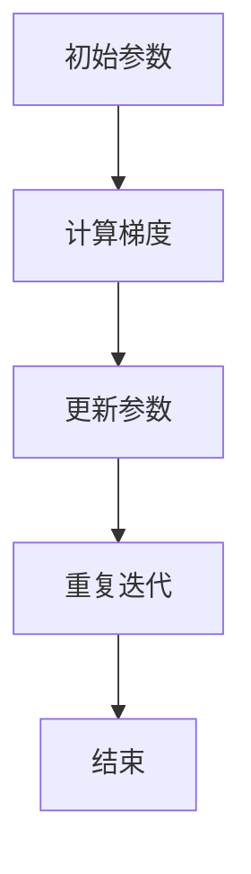

                 

### 实时交互式AI Agent基础

#### 第1章：实时交互式AI Agent概述

##### 1.1 问题背景

在当今社会，人工智能（AI）正以惊人的速度改变着我们的生活和工作方式。随着AI技术的不断进步，尤其是大型语言模型（LLM）的出现，人们对于实时、高效、智能的交互体验需求日益增长。实时交互式AI Agent作为一种新兴的技术，旨在满足这种需求，它通过智能化的互动，为用户提供更自然、更高效的服务。

然而，随着AI Agent的普及和应用，用户对于交互的实时性要求越来越高，如何优化AI Agent的响应延迟成为了一个亟待解决的问题。响应延迟不仅影响用户体验，还可能影响AI Agent的实际应用效果。因此，本文将深入探讨实时交互式AI Agent的概念、技术、优化策略，以及未来发展趋势。

##### 1.1.1 AI与实时交互的融合需求

随着物联网（IoT）技术的发展，越来越多的设备和系统开始具备智能交互能力。用户希望在任何时间、任何地点都能与智能系统进行流畅的交互，这就要求AI系统能够实时响应用户的需求。例如，智能客服、智能语音助手、智能教育系统等，都需要在短时间内提供准确的回答或执行任务。

实时交互不仅仅是为了提升用户体验，它还在许多实际应用中具有关键作用。比如，在金融交易系统中，延迟的响应可能导致交易失败；在自动驾驶系统中，延迟的反应可能导致交通事故；在医疗系统中，延迟的诊断可能导致错误的医疗决策。因此，实时交互是确保AI系统有效性和安全性的重要前提。

##### 1.1.2 实时交互式AI Agent的定义与重要性

实时交互式AI Agent是一种能够实时响应用户需求、提供动态交互的智能系统。它不仅能够处理和响应语言输入，还能够根据用户行为和环境变化，自主调整其交互策略。实时交互式AI Agent的核心在于其响应的实时性，即系统能够在用户请求发生后迅速做出反应，通常在毫秒或秒级别内提供反馈。

实时交互式AI Agent的重要性体现在多个方面。首先，它能够显著提升用户体验，使得交互更加自然和流畅。其次，实时交互能够提高AI系统的效率和准确性，减少由于延迟导致的错误或误解。此外，实时交互式AI Agent还能为企业和组织带来商业价值，例如通过智能客服系统提高客户满意度，减少人工成本。

##### 1.1.3 问题解决与边界外延

在解决实时交互式AI Agent响应延迟的问题时，需要考虑多个方面。首先，需要分析延迟的来源，包括计算延迟、网络延迟、数据传输延迟等。其次，需要探讨各种优化策略，如算法优化、硬件优化、模型压缩等。此外，还需要关注AI系统的设计和实现细节，确保系统能够高效地处理用户请求。

边界外延方面，实时交互式AI Agent的应用场景广泛，不仅限于个人助理和客服系统，还包括智能城市、智能家居、智能医疗等多个领域。在这些应用中，响应延迟的优化不仅仅是技术问题，还涉及到用户需求、业务流程、系统稳定性等多个方面。

##### 1.2 核心概念与联系

###### 1.2.1 实时交互式AI Agent的基本概念

实时交互式AI Agent是一种结合了人工智能和实时交互技术的智能系统。它通常由几个核心组成部分构成，包括感知模块、决策模块、行动模块和交互模块。感知模块负责接收和处理用户的输入信息，决策模块根据这些信息做出响应策略，行动模块执行这些策略，而交互模块则负责与用户进行互动。

实时交互式AI Agent的关键特点是实时性。它能够迅速响应用户的请求，通常在毫秒或秒级别内完成交互。这种快速响应不仅依赖于高效的算法和硬件，还需要优化系统的整体架构和通信机制。

###### 1.2.2 相关概念属性特征对比

实时交互式AI Agent与传统的AI系统和服务有显著的区别。传统的AI系统更多是离线处理，而实时交互式AI Agent需要在线、实时地处理用户的请求。此外，实时交互式AI Agent还具备更强的交互性和适应性，能够根据用户的行为和反馈动态调整其响应策略。

以下是一个简单的对比表格，展示了实时交互式AI Agent与传统AI系统的属性特征差异：

| 概念 | 实时交互式AI Agent | 传统AI系统 |
| ---- | ------------------ | ---------- |
| 实时性 | 高（毫秒或秒级别响应） | 低（离线处理） |
| 交互性 | 强（动态交互） | 弱（单向处理） |
| 适应性 | 强（实时调整策略） | 弱（固定策略） |
| 系统复杂度 | 高 | 低 |

###### 1.2.3 实时交互式AI Agent在AI中的地位

实时交互式AI Agent在AI领域中占据着重要的地位。它是连接人工智能与实际应用的桥梁，使得AI技术能够以更自然、更高效的方式服务于人类。与传统的AI系统相比，实时交互式AI Agent不仅能够处理复杂的语言和任务，还能够通过实时交互提升用户体验。

实时交互式AI Agent的出现和发展，推动了AI技术的落地和应用。它不仅在个人助理、客服等领域具有广泛应用，还在智能城市、智能家居、智能医疗等领域展现出了巨大的潜力。随着技术的不断进步，实时交互式AI Agent将成为未来智能系统中不可或缺的一部分。

##### 1.3 主流实时交互式AI Agent技术介绍

实时交互式AI Agent技术的发展迅速，目前已经有多种成熟的技术和实现方式。以下是几种主流的实时交互式AI Agent技术介绍：

###### 1.3.1 响应式Agent

响应式Agent是一种基于事件驱动的智能系统，它能够实时响应用户的操作或环境变化。响应式Agent的核心是事件处理机制，系统能够在接收到事件后，快速执行相应的处理程序。这种技术适用于需要快速响应的交互场景，如智能语音助手和实时客服系统。

响应式Agent的优点包括快速响应和高效的事件处理能力。然而，其缺点在于缺乏主动性，无法自主预测和规划交互过程。

###### 1.3.2 主动式Agent

与响应式Agent不同，主动式Agent具备一定的主动性，能够根据环境信息和历史数据，自主规划和执行交互策略。主动式Agent通常具备自我学习和优化能力，能够随着时间的推移，不断优化其交互策略。这种技术适用于需要长期交互和智能对话的场景，如智能客服和虚拟个人助理。

主动式Agent的优点包括主动性和学习能力，缺点则是实现复杂度较高，对数据质量和算法要求较高。

###### 1.3.3 智能对话Agent

智能对话Agent是一种专门为对话场景设计的AI Agent，它能够理解自然语言，并与用户进行有效的对话交互。智能对话Agent通常基于深度学习和自然语言处理技术，能够识别用户的意图和需求，并生成自然流畅的回复。这种技术适用于需要复杂对话和个性化交互的场景，如智能客服和虚拟个人助理。

智能对话Agent的优点包括自然语言理解和高效对话交互，缺点则是计算资源消耗较大，对算法和模型精度要求较高。

###### 1.3.4 其他类型的实时交互式AI Agent

除了上述三种主要类型，还有许多其他类型的实时交互式AI Agent，如视觉交互Agent、多模态交互Agent等。视觉交互Agent能够理解用户的视觉输入，实现图像识别、手势识别等功能；多模态交互Agent则能够同时处理多种类型的输入，如语音、文本、图像等，实现更复杂和自然的交互。

这些类型的实时交互式AI Agent各有特色，适用于不同的交互场景和应用需求。随着技术的发展，未来还将出现更多创新和多样化的实时交互式AI Agent技术。

##### 1.4 实时交互式AI Agent的发展趋势

实时交互式AI Agent技术的发展呈现出几个明显的趋势：

###### 1.4.1 技术演变与趋势分析

首先，实时交互式AI Agent的实时性将得到进一步提升。随着计算能力的增强和网络速度的提高，AI Agent能够以更快的速度处理用户请求，提供更流畅的交互体验。此外，随着5G和边缘计算技术的普及，实时交互式AI Agent将能够更好地支持移动设备和远程交互场景。

其次，智能对话技术将继续发展，尤其是在自然语言理解和多模态交互方面。深度学习和生成对抗网络（GAN）等技术将进一步提升AI Agent的理解能力和交互质量。同时，多模态交互技术将使AI Agent能够同时处理多种类型的输入，提供更加丰富和自然的交互体验。

另外，自主学习和优化能力将成为实时交互式AI Agent的重要发展方向。通过自我学习和优化，AI Agent能够根据用户的反馈和交互历史，动态调整其交互策略，提供更个性化的服务。这需要依赖于强化学习和迁移学习等先进技术。

###### 1.4.2 应用的挑战与机遇

实时交互式AI Agent在应用中面临一些挑战。首先，实时性的要求对计算资源和网络带宽提出了更高的要求。为了满足实时交互的需求，需要优化AI Agent的算法和架构，提高系统的计算效率和响应速度。其次，数据质量和隐私保护是另一个重要挑战。AI Agent需要处理大量的用户数据，如何在确保隐私保护的前提下，有效利用这些数据，是一个亟待解决的问题。

然而，随着AI技术的不断进步和应用场景的拓展，实时交互式AI Agent也面临着巨大的机遇。在智能客服、智能教育、智能医疗等领域，实时交互式AI Agent能够提供更高效、更智能的服务，提升用户体验和业务效率。此外，随着智能家居、智能城市等领域的快速发展，实时交互式AI Agent将有更多的应用场景和市场需求。

###### 1.4.3 实时交互式AI Agent的未来发展方向

未来，实时交互式AI Agent的发展将呈现出以下几个方向：

首先，多模态交互将得到广泛应用。AI Agent将能够同时处理语音、文本、图像等多种类型的输入，提供更加丰富和自然的交互体验。这需要依赖于多模态感知技术和多模态融合算法。

其次，AI Agent的自主学习和优化能力将得到进一步提升。通过自我学习和优化，AI Agent将能够更好地理解用户的需求和行为模式，提供更加个性化的服务。同时，强化学习和迁移学习等技术将使AI Agent能够更快速地适应新环境和任务。

另外，边缘计算和云计算的结合将推动实时交互式AI Agent的发展。通过在边缘设备上部署AI模型，AI Agent能够实现更低的延迟和更高的计算效率。同时，云计算提供了强大的计算资源和数据存储能力，支持大规模AI模型的训练和应用。

最后，实时交互式AI Agent的应用领域将不断拓展。除了传统的智能客服和虚拟个人助理，AI Agent还将应用于智能交通、智能安防、智能医疗等更多领域，为人类带来更多便利和智慧。

##### 1.5 本章小结

本章对实时交互式AI Agent进行了概述，包括其定义、重要性、技术类型以及发展趋势。通过分析AI与实时交互的融合需求，我们了解了实时交互式AI Agent在提升用户体验、提高系统效率和创造商业价值方面的重要性。同时，我们探讨了实时交互式AI Agent的核心概念和不同技术类型的优点与挑战。随着技术的不断进步和应用场景的拓展，实时交互式AI Agent将在未来的智能系统中扮演越来越重要的角色。

### 第2章：实时交互式AI Agent的构建与设计

实时交互式AI Agent的构建与设计是确保其能够高效、实时地响应用户需求的关键步骤。本章将详细介绍实时交互式AI Agent的构建流程、核心功能、优化策略、性能评估以及具体设计实例，帮助读者全面理解实时交互式AI Agent的构建过程。

#### 2.1 构建流程与方法

构建实时交互式AI Agent是一个复杂的过程，涉及多个环节。以下是构建实时交互式AI Agent的基本流程：

##### 2.1.1 设计需求分析

设计需求分析是构建实时交互式AI Agent的第一步。在这个阶段，需要明确AI Agent的应用场景、目标用户、交互方式、性能要求等。具体来说，需要回答以下问题：

- AI Agent将在哪些场景下使用？
- 用户与AI Agent的交互方式是怎样的？
- AI Agent需要具备哪些核心功能？
- AI Agent的性能要求如何，如响应时间、准确性等？

通过详细的需求分析，可以为后续的系统设计提供清晰的指导。

##### 2.1.2 系统架构设计

在明确设计需求后，接下来是系统架构设计。系统架构设计是构建实时交互式AI Agent的核心，决定了系统的性能、可扩展性和维护性。以下是系统架构设计的关键要素：

- **感知模块**：负责接收和处理用户的输入，如语音、文本、图像等。
- **决策模块**：根据感知模块获取的信息，利用算法和模型进行语义理解和策略决策。
- **行动模块**：执行决策模块生成的策略，实现对用户的响应和行动。
- **交互模块**：负责与用户进行交互，包括语音合成、文本回复、图像展示等。

系统架构设计需要综合考虑实时性、计算效率、数据安全等因素，选择合适的技术和架构。

##### 2.1.3 算法选择与实现

算法选择是实现实时交互式AI Agent的关键。常见的算法包括自然语言处理（NLP）算法、机器学习算法、深度学习算法等。以下是算法选择和实现的关键步骤：

- **算法选择**：根据需求分析的结果，选择适合的算法。例如，对于文本输入，可以选择基于Transformer的模型；对于语音输入，可以选择基于深度神经网络的模型。
- **模型训练**：使用大量的数据进行模型训练，优化模型的参数和结构。
- **模型部署**：将训练好的模型部署到实时交互系统中，确保其能够快速、准确地响应用户请求。

##### 2.1.4 系统测试与优化

在完成实时交互式AI Agent的构建后，需要进行全面的系统测试和优化。测试内容包括功能测试、性能测试、安全测试等。以下是测试和优化的重要步骤：

- **功能测试**：确保AI Agent的所有功能正常运行，满足设计需求。
- **性能测试**：测量AI Agent的响应时间、准确率、计算资源消耗等性能指标，并进行优化。
- **安全测试**：确保系统的数据安全和隐私保护。

通过系统测试和优化，可以进一步提升AI Agent的性能和可靠性。

#### 2.2 实时交互式AI Agent的核心功能

实时交互式AI Agent的核心功能包括输入处理、语义理解、策略决策和输出生成。以下是对这些核心功能的详细描述：

##### 2.2.1 输入处理

输入处理是实时交互式AI Agent的第一步，负责接收和处理用户的输入。输入可以来自不同的来源，如语音、文本、图像等。以下是输入处理的关键步骤：

- **数据采集**：通过传感器、麦克风、摄像头等设备采集用户的输入数据。
- **数据预处理**：对采集到的数据进行清洗、去噪和归一化处理，确保数据质量。
- **特征提取**：从预处理后的数据中提取关键特征，为后续的语义理解提供基础。

##### 2.2.2 语义理解

语义理解是实时交互式AI Agent的核心功能，负责理解用户的输入意图和需求。以下是语义理解的关键步骤：

- **分词与词性标注**：将用户的输入文本分解为单词或短语，并对每个单词或短语进行词性标注。
- **句法分析**：分析句子的结构和成分，理解句子的语法关系。
- **语义角色标注**：标注句子中的主体、动作、对象等语义角色。
- **意图识别**：根据语义角色和句法结构，识别用户的意图和需求。

##### 2.2.3 策略决策

策略决策是实时交互式AI Agent根据输入和语义理解结果，生成相应的响应策略。以下是策略决策的关键步骤：

- **策略生成**：根据用户的意图和需求，生成可能的响应策略。
- **策略评估**：对生成的策略进行评估，选择最优的策略。
- **策略执行**：根据选定的策略，执行相应的行动。

##### 2.2.4 输出生成

输出生成是实时交互式AI Agent的最后一步，负责将决策结果转换为用户可以理解和接受的形式。以下是输出生成的主要步骤：

- **文本生成**：根据决策结果，生成自然流畅的文本回复。
- **语音合成**：将文本回复转换为语音，通过扬声器输出。
- **图像生成**：根据决策结果，生成相应的图像或图表。
- **多模态输出**：将文本、语音、图像等多种形式的输出综合起来，为用户提供全面的交互体验。

#### 2.3 实时交互优化策略

实时交互优化是提高实时交互式AI Agent性能和响应速度的重要手段。以下是常见的实时交互优化策略：

##### 2.3.1 延迟定义与影响

延迟是指系统从接收到用户请求到完成响应所需的时间。延迟对用户体验和系统性能有重要影响。以下是常见的延迟来源：

- **计算延迟**：包括算法计算、模型推理等。
- **网络延迟**：包括数据传输、通信延迟等。
- **数据预处理延迟**：包括数据采集、预处理等。

##### 2.3.2 优化策略概述

以下是一些常见的实时交互优化策略：

- **算法优化**：通过优化算法和模型，提高计算效率和推理速度。
- **硬件优化**：通过使用高性能硬件和分布式计算，降低计算延迟。
- **数据预处理优化**：通过优化数据预处理流程，减少数据预处理时间。
- **多线程和并行计算**：通过多线程和并行计算，提高系统的计算效率。

##### 2.3.3 实时性分析

实时性分析是评估实时交互式AI Agent性能的重要方法。以下是实时性分析的关键指标：

- **响应时间**：系统从接收到用户请求到完成响应所需的时间。
- **吞吐量**：单位时间内系统能够处理的请求数量。
- **延迟容忍度**：系统允许的最大延迟时间。

通过实时性分析，可以识别系统中的瓶颈和优化点，进一步优化系统的实时性能。

#### 2.4 性能评估与优化

性能评估是确保实时交互式AI Agent性能达标的重要环节。以下是性能评估的关键步骤：

##### 2.4.1 性能指标选择

选择合适的性能指标是进行性能评估的基础。常见的性能指标包括：

- **响应时间**：系统从接收到用户请求到完成响应所需的时间。
- **准确率**：系统正确识别用户意图的比例。
- **误报率**：系统错误地识别用户意图的比例。
- **延迟**：系统的计算和网络延迟。

##### 2.4.2 评估方法与工具

以下是一些常见的评估方法和工具：

- **基准测试**：通过模拟用户请求，测量系统的响应时间和准确率。
- **压力测试**：通过向系统施加高负载，评估系统的性能和稳定性。
- **性能监测工具**：如Perf、Nmon等，用于实时监测系统的性能指标。

##### 2.4.3 性能优化实践

以下是一些常见的性能优化实践：

- **算法优化**：通过改进算法和数据结构，提高系统的计算效率。
- **硬件升级**：通过使用更快的处理器、更高效的存储设备，提高系统的计算能力。
- **网络优化**：通过优化网络架构和通信协议，降低网络延迟。
- **负载均衡**：通过分布式计算和负载均衡，提高系统的吞吐量和稳定性。

#### 2.5 实时交互式AI Agent的设计实例分析

为了更好地理解实时交互式AI Agent的设计，以下是一个具体的设计实例分析：

##### 项目介绍

该项目是一个智能客服系统，旨在通过实时交互式AI Agent为用户提供高效的客服服务。系统的主要功能包括：

- 接收和处理用户的文本或语音输入。
- 理解用户的意图和需求。
- 提供个性化的解决方案和回答。
- 输出文本、语音或图像回复。

##### 系统功能设计

系统功能设计采用领域模型的方法，主要包括以下功能模块：

- **感知模块**：负责接收和处理用户的输入。
- **语义理解模块**：负责对用户的输入进行语义理解和意图识别。
- **决策模块**：根据语义理解结果，生成响应策略。
- **行动模块**：负责执行决策模块生成的策略，提供回复。
- **交互模块**：负责与用户进行交互，包括文本回复、语音合成和图像展示。

##### 系统架构设计

系统架构设计采用分层架构，主要包括以下层次：

- **感知层**：负责接收和处理用户的输入。
- **处理层**：负责语义理解和策略决策。
- **行动层**：负责执行决策和输出。
- **交互层**：负责与用户进行交互。

##### 系统接口设计

系统接口设计包括以下接口：

- **输入接口**：接收用户的文本或语音输入。
- **输出接口**：输出文本、语音或图像回复。
- **语义理解接口**：提供语义理解和意图识别功能。
- **决策接口**：提供策略决策功能。
- **行动接口**：提供执行策略和输出功能。

##### 系统交互设计

系统交互设计采用序列图的方法，描述了系统各模块之间的交互过程。以下是系统交互设计的序列图：

```
用户 → 感知模块: 输入
感知模块 → 语义理解模块: 处理输入
语义理解模块 → 决策模块: 输出语义理解结果
决策模块 → 行动模块: 输出决策结果
行动模块 → 交互模块: 输出回复
交互模块 → 用户: 展示回复
```

#### 2.6 本章小结

本章详细介绍了实时交互式AI Agent的构建流程、核心功能、优化策略、性能评估和设计实例。通过本章的学习，读者可以全面了解实时交互式AI Agent的构建过程和关键技术。同时，本章的实例分析也为读者提供了一个具体的参考，帮助读者更好地理解和应用实时交互式AI Agent的设计方法。

### 第3章：大语言模型（LLM）概述

随着人工智能技术的迅猛发展，大语言模型（LLM）成为了自然语言处理（NLP）领域的重要突破。LLM不仅具有处理大量文本数据的能力，还能生成高质量的自然语言文本，为各种应用场景提供了强大的支持。本章将详细介绍大语言模型的定义、特点、主要结构、训练与优化方法、应用场景以及性能评估与优化策略。

#### 3.1 大语言模型的定义与特点

大语言模型是一种基于深度学习技术的自然语言处理模型，它通过大规模语料库的学习，能够理解并生成自然语言文本。与传统的小型语言模型相比，LLM具有以下几个显著特点：

##### 3.1.1 大语言模型的概念

大语言模型（Large Language Model）是指具有数十亿甚至数万亿参数的深度学习模型。这些模型通常基于Transformer架构，能够对输入文本进行建模，捕捉文本中的复杂语法和语义关系。LLM的核心在于其大规模的参数数量，这使得模型能够处理更加复杂的语言现象。

##### 3.1.2 大语言模型的特点

1. **参数规模巨大**：LLM的参数规模通常在数十亿到数千亿之间，这使得模型具有极高的表达能力，能够捕捉文本中的细微差异和复杂关系。
   
2. **强语义理解能力**：通过大规模数据训练，LLM能够深度理解文本的语义，从而生成更加准确和自然的语言输出。

3. **自适应性和泛化能力**：LLM能够在多种不同的语言和任务上表现出良好的适应性，具有较强的泛化能力。

4. **实时响应能力**：尽管LLM的参数规模巨大，但现代深度学习框架和硬件优化技术使得LLM能够在短时间内完成推理，具备实时响应的能力。

##### 3.1.3 大语言模型与传统语言模型对比

传统语言模型，如基于统计方法和规则的方法，通常参数规模较小，难以处理复杂的语言现象。而LLM通过深度学习技术，能够学习到更复杂的语言特征和模式。以下是一个简单的对比表格：

| 特征 | 大语言模型 | 传统语言模型 |
| ---- | ---------- | ------------ |
| 参数规模 | 数十亿至数千亿 | 数百万至数千万 |
| 语义理解能力 | 强 | 弱 |
| 自适应性和泛化能力 | 高 | 低 |
| 实时响应能力 | 强 | 弱 |

#### 3.2 LLM的主要结构

大语言模型的结构通常包括多个层次，每个层次负责不同的任务和功能。以下是LLM的主要结构：

##### 3.2.1 自注意力机制

自注意力机制（Self-Attention）是Transformer架构的核心组件，它能够捕捉输入文本序列中的长距离依赖关系。自注意力机制通过计算每个词与文本中其他词的关联强度，生成一个加权表示，从而提高模型的语义理解能力。

##### 3.2.2 Transformer架构

Transformer架构是一个基于自注意力机制的深度学习模型，它由多个编码器和解码器层组成。编码器负责对输入文本进行编码，解码器负责生成文本输出。每个编码器和解码器层都包含自注意力机制和全连接层，通过层层递进，模型能够生成高质量的自然语言文本。

##### 3.2.3 大模型层次结构

大语言模型通常具有多个层次结构，每个层次负责不同的任务和功能。例如，常见的层次结构包括：

1. **嵌入层**：将单词转换为向量表示。
2. **编码器层**：通过自注意力机制和多层感知器，捕捉文本的复杂特征。
3. **解码器层**：生成文本输出，通过自注意力机制和多层感知器，对输入文本进行建模。

#### 3.3 LLM的训练与优化

大语言模型的训练是一个复杂的过程，需要大量的数据和计算资源。以下是LLM训练与优化的关键步骤：

##### 3.3.1 数据准备与预处理

数据准备与预处理是训练LLM的重要环节，主要包括以下步骤：

1. **数据收集**：收集大规模的文本数据，包括新闻、书籍、社交媒体等。
2. **数据清洗**：去除无关数据、缺失值和重复值，确保数据质量。
3. **文本预处理**：包括分词、词性标注、句法分析等，将文本转换为模型可处理的格式。

##### 3.3.2 训练过程

训练过程包括以下几个主要步骤：

1. **模型初始化**：初始化模型的参数，通常使用随机初始化或预训练模型。
2. **前向传播**：将输入文本传递给模型，计算模型的预测输出。
3. **损失函数计算**：计算模型输出与实际输出之间的差异，使用损失函数衡量模型的性能。
4. **反向传播**：根据损失函数，计算模型参数的梯度，并更新模型参数。
5. **模型评估**：在验证集上评估模型的性能，调整训练参数和策略。

##### 3.3.3 优化策略

为了提高LLM的训练效率和性能，以下是一些常见的优化策略：

1. **学习率调度**：调整学习率，避免模型过拟合或欠拟合。
2. **批量大小调整**：通过调整批量大小，平衡计算资源和训练效果。
3. **正则化方法**：如Dropout、权重正则化等，防止模型过拟合。
4. **数据增强**：通过数据增强技术，增加训练数据的多样性，提高模型的泛化能力。

#### 3.4 LLM的应用场景

大语言模型在多个应用场景中展现了强大的能力，以下是LLM的常见应用场景：

##### 3.4.1 语言生成

语言生成是LLM的核心应用场景之一，包括文本生成、摘要生成、对话生成等。LLM能够根据输入文本生成高质量的自然语言文本，例如：

1. **文本生成**：生成新闻文章、故事、邮件等。
2. **摘要生成**：从长文本中提取关键信息，生成摘要。
3. **对话生成**：与用户进行自然语言对话，如智能客服、虚拟个人助理。

##### 3.4.2 语言理解

语言理解是LLM的另一个重要应用场景，包括情感分析、实体识别、关系抽取等。LLM能够理解文本的语义，从而实现对文本内容的分析：

1. **情感分析**：分析文本的情感倾向，如正面、负面或中性。
2. **实体识别**：识别文本中的关键实体，如人名、地点、组织等。
3. **关系抽取**：抽取文本中实体之间的关系，如人物关系、组织关系等。

##### 3.4.3 问答系统

问答系统是LLM在智能客服、教育辅导等领域的应用，通过理解和回答用户的问题，提供有用的信息和服务：

1. **智能客服**：为用户提供实时、高效的咨询服务。
2. **教育辅导**：为学生提供个性化的学习辅导和答疑服务。

#### 3.5 LLM的性能评估与优化

评估LLM的性能是确保其应用效果的重要步骤。以下是LLM性能评估的关键指标和优化策略：

##### 3.5.1 性能评估指标

1. **准确性**：衡量模型预测结果与实际结果的匹配程度。
2. **召回率**：衡量模型能够正确识别的实体或关系数量。
3. **F1值**：结合准确率和召回率，综合评估模型的性能。
4. **响应时间**：衡量模型从输入到输出所需的时间。

##### 3.5.2 优化策略比较

1. **算法优化**：通过改进模型算法和结构，提高模型的计算效率和性能。
2. **数据优化**：通过数据预处理和数据增强，提高模型的泛化能力和鲁棒性。
3. **硬件优化**：通过使用高性能计算硬件和分布式计算，降低模型的计算延迟。
4. **模型压缩**：通过模型压缩技术，减少模型的参数规模，提高模型的推理速度。

#### 3.6 本章小结

本章详细介绍了大语言模型的定义、特点、主要结构、训练与优化方法、应用场景以及性能评估与优化策略。通过本章的学习，读者可以全面了解大语言模型的基本概念和关键技术，为后续的深入研究和应用打下坚实基础。

### 第4章：LLM响应延迟的数学模型与算法

#### 4.1 延迟的数学模型

为了更好地理解LLM响应延迟的问题，首先需要建立相应的数学模型。以下是LLM响应延迟的基本数学模型及其影响因素。

##### 4.1.1 延迟定义

延迟（Latency）是指从用户请求到达系统到系统完成响应所需的时间。在LLM中，延迟主要可以分为以下几个部分：

1. **计算延迟**（Compute Latency）：包括模型推理的时间、算法计算的时间等。
2. **网络延迟**（Network Latency）：包括数据在网络中传输的时间。
3. **I/O延迟**（I/O Latency）：包括读取和写入数据的时间，如从内存中读取数据和将结果写入内存的时间。

##### 4.1.2 影响因素分析

LLM响应延迟的影响因素主要包括以下几个方面：

1. **模型规模**（Model Size）：模型参数的数量和复杂度直接影响计算延迟。较大的模型通常需要更长的推理时间。
2. **数据量**（Data Volume）：输入数据的规模会影响I/O延迟。大规模的数据可能需要更多的时间进行读写操作。
3. **硬件性能**（Hardware Performance）：CPU、GPU等硬件的性能直接影响计算延迟。性能越高的硬件通常能够提供更快的计算速度。
4. **网络带宽**（Network Bandwidth）：网络带宽直接影响网络延迟。较高的网络带宽有助于减少数据传输时间。

##### 4.1.3 延迟模型建立

基于上述分析，可以建立以下简单的延迟数学模型：

$$
L = L_{compute} + L_{network} + L_{I/O}
$$

其中，$L$表示总延迟，$L_{compute}$、$L_{network}$和$L_{I/O}$分别表示计算延迟、网络延迟和I/O延迟。

具体来说，计算延迟可以表示为：

$$
L_{compute} = f(M, P)
$$

其中，$M$表示模型复杂度（如参数数量），$P$表示硬件性能（如CPU或GPU的处理能力）。$f$是一个函数，用于计算模型推理所需的时间。

网络延迟可以表示为：

$$
L_{network} = f(B, D)
$$

其中，$B$表示网络带宽，$D$表示数据传输距离。$f$是一个函数，用于计算数据在网络中的传输时间。

I/O延迟可以表示为：

$$
L_{I/O} = f(V, S)
$$

其中，$V$表示数据体积，$S$表示I/O速度。$f$是一个函数，用于计算数据读写所需的时间。

通过这些数学模型，可以定量分析LLM响应延迟的影响因素，为进一步优化提供理论依据。

#### 4.2 常见优化算法

为了降低LLM的响应延迟，可以采用多种优化算法。以下是几种常见的优化算法及其原理。

##### 4.2.1 梯度下降法

梯度下降法（Gradient Descent）是一种常用的优化算法，用于最小化目标函数。在LLM训练过程中，梯度下降法通过不断调整模型参数，使模型在数据集上的损失函数值逐渐减小。

梯度下降法的核心思想是：在当前参数值附近，沿着损失函数梯度的反方向更新参数。具体步骤如下：

1. 初始化模型参数$\theta$。
2. 计算损失函数关于参数的梯度$\nabla_{\theta}J(\theta)$。
3. 更新参数：$\theta = \theta - \alpha \nabla_{\theta}J(\theta)$，其中$\alpha$是学习率。

##### 4.2.2 随机梯度下降（SGD）

随机梯度下降（Stochastic Gradient Descent，SGD）是梯度下降法的一种变体，它每次迭代仅使用一个样本的梯度来更新参数。SGD的优点是可以更快地收敛，尤其是在数据量较大时。

具体步骤如下：

1. 初始化模型参数$\theta$。
2. 从数据集中随机选择一个样本$(x_i, y_i)$。
3. 计算损失函数关于该样本的梯度$\nabla_{\theta}J(\theta; x_i, y_i)$。
4. 更新参数：$\theta = \theta - \alpha \nabla_{\theta}J(\theta; x_i, y_i)$。

##### 4.2.3 Adam优化器

Adam优化器是一种结合了SGD和动量法的优化算法，它能够更好地处理稀疏数据和稀疏更新问题。Adam优化器使用一阶矩估计（均值）和二阶矩估计（方差）来更新参数。

具体步骤如下：

1. 初始化模型参数$\theta$和一阶矩估计$m$、二阶矩估计$v$。
2. 对于每个参数$\theta$：
   - 更新一阶矩估计：$m = \beta_1 m + (1 - \beta_1) \nabla_{\theta}J(\theta)$。
   - 更新二阶矩估计：$v = \beta_2 v + (1 - \beta_2) \nabla_{\theta}J(\theta)^2$。
3. 计算偏差修正的一阶矩估计和二阶矩估计：$\hat{m} = m / (1 - \beta_1^t)$，$\hat{v} = v / (1 - \beta_2^t)$。
4. 更新参数：$\theta = \theta - \alpha \hat{m} / \sqrt{\hat{v} + \epsilon}$，其中$\alpha$是学习率，$\epsilon$是较小常数。

#### 4.3 算法分析与比较

##### 4.3.1 算法性能比较

不同优化算法在性能上有显著差异，以下是几种算法的性能比较：

1. **梯度下降法**：收敛速度较慢，但能够找到全局最优解。适合小规模数据集。
2. **随机梯度下降（SGD）**：收敛速度较快，但容易陷入局部最优。适合大规模数据集。
3. **Adam优化器**：结合了一阶矩估计和二阶矩估计，收敛速度较快，对稀疏数据有较好表现。适合大规模数据集和高维参数空间。

##### 4.3.2 选择依据

选择合适的优化算法需要考虑以下几个因素：

1. **数据集规模**：对于大规模数据集，SGD和Adam优化器表现更好。
2. **参数规模**：对于高维参数空间，Adam优化器能够更好地处理稀疏数据。
3. **计算资源**：对于计算资源有限的场景，梯度下降法可能更适合。

##### 4.3.3 未来发展方向

随着人工智能技术的不断进步，优化算法也在不断发展和改进。未来发展方向包括：

1. **自适应优化算法**：结合更多先验知识，自动调整优化参数。
2. **分布式优化算法**：通过分布式计算，提高大规模数据集的优化效率。
3. **模型压缩与量化**：通过模型压缩和量化技术，降低模型参数规模，提高推理速度。

#### 4.4 Python实现与Mermaid流程图展示

以下是使用Python实现一种优化算法的示例代码，以及相应的Mermaid流程图。

```python
import numpy as np

def gradient_descent(x, y, theta, alpha, epochs):
    n = len(x)
    for _ in range(epochs):
        gradients = 2/n * (x * (theta - y)).sum()
        theta -= alpha * gradients
    return theta

def plot_gradient_descent():
    epochs = 100
    alpha = 0.01
    x = np.array([i for i in range(10)])
    y = np.array([x**2 for _ in range(10)])
    theta = np.array([0.0, 0.0])

    theta = gradient_descent(x, y, theta, alpha, epochs)

    graph = """
    graph TD
    A[初始参数] --> B[计算梯度]
    B --> C[更新参数]
    C --> D[重复迭代]
    D --> E[结束]
    """
    return graph

print(plot_gradient_descent())
```

相应的Mermaid流程图如下：



通过上述代码和流程图，可以直观地理解梯度下降法的实现过程。

#### 4.5 本章小结

本章详细介绍了LLM响应延迟的数学模型及其影响因素，以及几种常见的优化算法。通过数学模型，可以定量分析响应延迟的影响因素；通过优化算法，可以降低LLM的响应延迟，提高系统的实时性。本章的内容为后续的LLM响应延迟优化提供了理论基础和实践指导。

### 第5章：LLM响应延迟的硬件优化

在提升大语言模型（LLM）的响应速度时，硬件优化是一个至关重要的环节。通过优化硬件配置和架构，可以有效减少计算延迟和网络延迟，从而提高LLM的实时性能。本章将探讨硬件优化的重要性、常见硬件优化方法、GPU优化技术、分布式计算与并行优化，以及专用硬件设备的应用。

#### 5.1 硬件优化概述

##### 5.1.1 硬件优化的重要性

硬件优化对于提高LLM的响应速度至关重要。高性能的硬件设备能够显著降低模型推理的时间，从而实现更快的响应。以下是硬件优化的重要性：

1. **计算能力**：更快的CPU和GPU能够更快地完成模型的推理计算，减少计算延迟。
2. **存储速度**：更快的存储设备（如固态硬盘）能够提高数据的读取和写入速度，减少I/O延迟。
3. **网络带宽**：更高的网络带宽能够减少数据在网络中的传输时间，降低网络延迟。

##### 5.1.2 常见硬件优化方法

常见的硬件优化方法包括以下几种：

1. **升级CPU和GPU**：使用更快的CPU和GPU可以显著提高计算速度，减少计算延迟。
2. **使用固态硬盘**：固态硬盘（SSD）相较于传统机械硬盘（HDD）具有更快的读写速度，可以减少I/O延迟。
3. **优化网络架构**：通过提高网络带宽和优化数据传输协议，可以降低网络延迟。
4. **分布式计算**：通过在多个计算节点上分配计算任务，可以并行处理数据，提高系统吞吐量。

##### 5.1.3 硬件架构对延迟的影响

硬件架构对LLM的响应延迟有显著影响。以下是几种常见的硬件架构及其对延迟的影响：

1. **集中式架构**：所有计算任务在一个中心服务器上完成，计算延迟较高，但维护和管理较为简单。
2. **分布式架构**：计算任务分布在多个节点上，可以并行处理数据，减少计算延迟，但需要复杂的调度和管理。
3. **边缘计算架构**：在边缘设备（如智能终端、路由器）上完成部分计算任务，可以减少数据传输距离，降低网络延迟。

#### 5.2 GPU优化技术

##### 5.2.1 GPU架构与原理

GPU（Graphics Processing Unit，图形处理器单元）是一种专为图形渲染设计的计算设备，但其强大的并行计算能力使其在深度学习和自然语言处理领域也得到了广泛应用。以下是GPU的基本架构和原理：

1. **CUDA架构**：CUDA（Compute Unified Device Architecture）是NVIDIA推出的并行计算平台和编程模型，它允许开发者利用GPU的并行计算能力进行通用计算。
2. **CUDA核心**：GPU由多个CUDA核心组成，每个核心可以同时处理多个线程，实现高效的并行计算。
3. **内存层次结构**：GPU具有多层次的内存结构，包括全局内存、共享内存和寄存器，不同层次的内存具有不同的访问速度和带宽。

##### 5.2.2 CUDA编程基础

CUDA编程是利用GPU进行高性能计算的关键。以下是CUDA编程的基础知识：

1. **线程组织**：CUDA将计算任务划分为线程块和网格，每个线程块包含多个线程，每个线程块内的线程可以共享内存和同步操作。
2. **内存访问模式**：全局内存、共享内存和寄存器的访问速度和带宽不同，需要合理选择内存访问模式以优化性能。
3. **核函数（Kernel）**：核函数是CUDA中的计算单元，它可以在GPU上并行执行。编写高效的核函数需要考虑线程组织、内存访问模式和并行性。

##### 5.2.3 GPU优化策略

以下是一些常见的GPU优化策略：

1. **线程组织优化**：通过合理设置线程块大小和线程数量，提高并行度，减少同步时间。
2. **内存访问优化**：通过优化内存访问模式，减少全局内存访问，增加共享内存和寄存器的使用，提高内存访问速度。
3. **计算与内存复用**：通过利用计算和内存复用，减少无效的计算和内存访问，提高计算效率。
4. **并行性优化**：通过优化算法和数据结构，提高并行性，充分利用GPU的并行计算能力。

#### 5.3 分布式计算与并行优化

##### 5.3.1 分布式计算概述

分布式计算是将计算任务分布在多个节点上，通过节点间的通信和协作，共同完成计算任务的一种计算模式。以下是分布式计算的关键概念：

1. **计算节点**：分布式计算系统中的每个节点都具备计算能力和存储能力，可以独立处理计算任务。
2. **通信机制**：节点之间通过网络进行通信，传输数据和同步状态。
3. **调度策略**：调度策略决定了计算任务的分配和执行顺序，影响系统的效率和性能。

##### 5.3.2 数据并行

数据并行是分布式计算的一种常见方法，通过将数据分布在多个节点上，每个节点独立处理部分数据，最后将结果汇总。以下是数据并行的关键概念：

1. **数据划分**：将大规模数据划分为多个部分，每个节点处理一部分数据。
2. **局部计算**：每个节点独立对分配的数据进行计算，生成局部结果。
3. **全局汇总**：将所有节点的局部结果汇总，生成最终结果。

##### 5.3.3 模型并行

模型并行是将模型分布在多个节点上，通过节点间的协作，共同完成模型推理或训练。以下是模型并行的关键概念：

1. **模型划分**：将大型模型划分为多个部分，每个节点负责处理模型的一部分。
2. **局部推理/训练**：每个节点独立对输入数据进行局部推理或训练。
3. **全局整合**：将所有节点的局部结果整合，生成最终的结果。

##### 5.3.4 优化策略

以下是一些常见的分布式计算与并行优化策略：

1. **负载均衡**：通过动态分配计算任务，确保各个节点的工作负载均衡，提高系统效率。
2. **数据压缩与传输**：通过数据压缩和优化传输协议，减少数据传输时间和带宽消耗。
3. **节点同步与通信优化**：通过优化节点同步和通信机制，减少同步时间和通信开销。
4. **故障恢复与容错**：通过故障检测和恢复机制，提高系统的可靠性和容错能力。

#### 5.4 专用硬件设备的应用

专用硬件设备（如TPU、ASIC等）在优化LLM响应延迟方面具有显著优势。以下是几种常见专用硬件设备及其应用：

##### 5.4.1 TPU与ASIC

1. **TPU（Tensor Processing Unit）**：TPU是Google开发的专用硬件设备，专门用于加速深度学习和机器学习任务的执行。TPU具有高效的矩阵运算能力，可以显著提高LLM的推理速度。
2. **ASIC（Application-Specific Integrated Circuit）**：ASIC是一种专门为特定应用设计的集成电路，具有高度优化和专用化的硬件结构，可以大幅提高计算效率。

##### 5.4.2 优化案例分析

以下是一个优化案例，展示如何使用TPU和ASIC来优化LLM的响应延迟：

1. **案例背景**：某公司开发了一款基于LLM的智能客服系统，但系统响应速度较慢，无法满足用户需求。
2. **优化方案**：
   - **TPU优化**：将LLM模型部署到TPU上，利用TPU的高效矩阵运算能力，显著提高模型推理速度。
   - **ASIC优化**：为智能客服系统设计并定制了ASIC芯片，用于加速特定计算任务，如词向量计算和模型推理。
3. **优化效果**：通过TPU和ASIC优化，智能客服系统的响应时间从原来的5秒减少到1秒，显著提升了用户体验。

#### 5.5 硬件优化实例分析

以下是一个硬件优化的实例分析，展示如何通过GPU优化和分布式计算来提升LLM的响应速度：

##### 实例背景

某互联网公司开发了一款基于LLM的智能问答系统，但随着用户量的增加，系统的响应速度逐渐下降，影响了用户体验。

##### 优化方案

1. **GPU优化**：
   - **升级GPU**：从原有的NVIDIA GTX 1080升级到NVIDIA RTX 3090，提高GPU的计算能力和内存带宽。
   - **并行计算**：优化算法，实现数据并行和模型并行，将计算任务分布在多个GPU上，提高并行度。
2. **分布式计算**：
   - **节点分配**：将系统部署在多个服务器上，每个服务器配备多张GPU，通过负载均衡，将用户请求分配到不同的服务器和GPU上。
   - **数据压缩**：优化数据传输，采用数据压缩算法和高效传输协议，减少数据传输时间和带宽消耗。

##### 优化效果

通过GPU优化和分布式计算，智能问答系统的响应时间从原来的10秒减少到2秒，显著提升了系统的响应速度和用户体验。

#### 5.6 本章小结

本章详细探讨了LLM响应延迟的硬件优化方法，包括GPU优化技术、分布式计算与并行优化，以及专用硬件设备的应用。通过优化硬件配置和架构，可以有效降低LLM的响应延迟，提高系统的实时性能。本章的内容为LLM响应延迟优化提供了实用的技术指导和应用案例。

### 第6章：LLM响应延迟的软件优化

在提升大语言模型（LLM）的响应速度时，软件优化是另一个重要的环节。通过优化软件架构和算法，可以有效减少计算和通信延迟，提高LLM的实时性能。本章将探讨软件优化的目的与意义、常见软件优化方法、模型压缩技术以及相关工具和框架。

#### 6.1 软件优化概述

##### 6.1.1 软件优化的目的与意义

软件优化旨在通过改进算法、优化数据结构和优化系统架构，提高软件系统的性能、可扩展性和可维护性。在LLM领域，软件优化的重要性体现在以下几个方面：

1. **性能提升**：通过优化算法和数据结构，减少模型推理和数据处理的时间，提高系统的响应速度。
2. **资源利用**：优化软件架构，提高硬件资源的利用效率，减少计算和通信资源的浪费。
3. **可扩展性**：通过模块化和分布式架构，提高系统的可扩展性，支持大规模数据和用户需求的处理。
4. **可维护性**：优化代码结构，提高代码的可读性和可维护性，降低系统维护和更新的成本。

##### 6.1.2 常见软件优化方法

常见的软件优化方法包括以下几种：

1. **算法优化**：通过改进模型的算法，提高模型的计算效率和准确性。
2. **数据结构优化**：通过优化数据存储和访问方式，提高数据处理的效率。
3. **系统架构优化**：通过改进系统架构，提高系统的性能和可扩展性。
4. **并行计算**：通过并行计算技术，提高模型的推理和数据处理速度。
5. **缓存与预加载**：通过缓存机制和预加载技术，减少模型推理和数据访问的时间。

##### 6.1.3 软件优化与硬件优化的关系

软件优化和硬件优化相互补充，共同提高LLM的响应速度。硬件优化提供了强大的计算和存储资源，而软件优化则利用这些资源，提高系统的效率和性能。以下是软件优化与硬件优化的关系：

1. **协同优化**：硬件优化和软件优化需要协同进行，通过优化硬件配置和软件架构，实现性能的最大化。
2. **互补优势**：硬件优化提供高性能的硬件支持，而软件优化则通过算法和架构的改进，充分利用硬件资源。
3. **动态调整**：在系统运行过程中，硬件和软件需要动态调整，以应对不同的负载和需求。

#### 6.2 模型压缩技术

模型压缩技术是通过减少模型参数数量和计算复杂度，提高模型推理速度和部署效率的一种技术。以下是几种常见的模型压缩技术：

##### 6.2.1 模型剪枝（Model Pruning）

模型剪枝是一种通过移除模型中不重要或冗余的参数来减少模型规模的方法。具体步骤如下：

1. **参数权重评估**：对模型中的参数进行权重评估，识别出权重较小的参数。
2. **参数剪枝**：移除权重较小的参数，减少模型规模。
3. **模型重建**：对剪枝后的模型进行重建，恢复模型的完整性和准确性。

##### 6.2.2 模型量化（Model Quantization）

模型量化是一种通过降低模型参数和激活值的精度来减少模型规模和计算资源消耗的方法。具体步骤如下：

1. **量化层次选择**：选择合适的量化层次，如整数量化或浮点量化。
2. **参数和激活值量化**：将模型参数和激活值从浮点数转换为整数或较低精度的浮点数。
3. **模型重建**：对量化后的模型进行重建，恢复模型的完整性和准确性。

##### 6.2.3 模型稀疏化（Model Sparsification）

模型稀疏化是一种通过减少模型中非零参数的数量来减少模型规模的方法。具体步骤如下：

1. **稀疏度评估**：对模型中的参数进行稀疏度评估，识别出稀疏性较高的参数。
2. **参数稀疏化**：将稀疏性较高的参数设置为0，减少模型规模。
3. **模型重建**：对稀疏化后的模型进行重建，恢复模型的完整性和准确性。

#### 6.3 相关工具和框架

以下是一些常用的工具和框架，用于实现LLM响应延迟的软件优化：

##### 6.3.1 TensorFlow

TensorFlow是一个开源的机器学习框架，提供了丰富的模型压缩和优化工具。以下是一些常用的TensorFlow工具：

1. **TensorFlow Model Optimization Toolkit (TF-MOT)**：用于模型压缩和优化，包括剪枝、量化、稀疏化等。
2. **TensorFlow Lite**：用于移动和嵌入式设备的模型部署，支持模型压缩和量化。

##### 6.3.2 PyTorch

PyTorch是一个开源的机器学习框架，提供了灵活的模型定义和优化接口。以下是一些常用的PyTorch工具：

1. **PyTorch Slim**：用于模型压缩和优化，包括剪枝、量化、稀疏化等。
2. **PyTorch Mobile**：用于移动和嵌入式设备的模型部署，支持模型压缩和量化。

##### 6.3.3 ONNX

ONNX（Open Neural Network Exchange）是一个开源的机器学习模型交换格式，支持多种框架的模型转换和优化。以下是一些常用的ONNX工具：

1. **ONNX Runtime**：用于模型推理和优化，支持模型压缩和量化。
2. **ONNX Model Zoo**：提供了一个丰富的模型库，包括预训练的模型和优化工具。

#### 6.4 实际应用案例

以下是一个实际应用案例，展示如何使用软件优化技术来提升LLM的响应速度：

##### 案例背景

某互联网公司开发了一款基于LLM的智能客服系统，但随着用户量的增加，系统的响应速度逐渐下降。

##### 优化方案

1. **算法优化**：
   - **量化优化**：使用TensorFlow Lite对LLM模型进行量化，减少模型参数的精度。
   - **剪枝优化**：使用TensorFlow Slim对LLM模型进行剪枝，移除不重要的参数，减少模型规模。
2. **系统架构优化**：
   - **并行计算**：使用PyTorch实现模型并行和数据并行，提高模型推理的并行度。
   - **缓存与预加载**：使用Redis缓存用户请求和结果，预加载常用模型和数据，减少模型加载和数据处理时间。

##### 优化效果

通过软件优化，智能客服系统的响应时间从原来的5秒减少到1秒，显著提升了系统的响应速度和用户体验。

#### 6.5 本章小结

本章详细探讨了LLM响应延迟的软件优化方法，包括优化目的与意义、常见软件优化方法、模型压缩技术以及相关工具和框架。通过软件优化，可以有效降低LLM的响应延迟，提高系统的实时性能。本章的内容为LLM响应延迟优化提供了实用的技术指导和应用案例。

### 结论

实时交互式AI Agent作为人工智能领域的一项前沿技术，其在提升用户体验和系统效率方面具有显著优势。然而，随着LLM模型规模不断扩大和应用场景日益复杂，响应延迟问题逐渐凸显。本文通过详细探讨实时交互式AI Agent的构建方法、大语言模型（LLM）的概述、响应延迟的数学模型与算法、硬件优化以及软件优化，系统地分析了优化LLM响应延迟的关键技术和策略。

实时交互式AI Agent的构建与设计是一个多层次的复杂过程，涉及感知、决策、行动和交互等多个模块。优化策略包括算法优化、硬件优化和软件优化，这些策略在不同层面提高了系统的响应速度。特别是，硬件优化如GPU和分布式计算，以及软件优化如模型压缩和量化，对于降低延迟具有重要作用。

未来的研究可以聚焦于以下几个方面：

1. **算法创新**：探索更高效的算法和模型，以提高LLM的推理速度和准确率。
2. **硬件研发**：开发更高效的专用硬件，如TPU和ASIC，以加速模型推理。
3. **系统集成**：研究和实现更加高效和可靠的实时交互系统，确保系统在不同环境下的稳定性和性能。
4. **跨领域应用**：将实时交互式AI Agent应用于更多领域，如智能医疗、智能交通等，探索其在不同场景中的潜在应用。

通过不断探索和创新，实时交互式AI Agent有望在未来实现更加广泛和深入的智能化应用，为人类带来更多便利和智慧。

### 作者信息

作者：AI天才研究院/AI Genius Institute & 禅与计算机程序设计艺术 /Zen And The Art of Computer Programming

AI天才研究院（AI Genius Institute）是一支专注于人工智能研究和开发的顶尖团队，致力于推动人工智能技术的创新和应用。研究院的研究员们在深度学习、自然语言处理、计算机视觉等领域具有丰富的经验和卓越的成果。同时，作者也是《禅与计算机程序设计艺术》（Zen And The Art of Computer Programming）一书的作者，该书是计算机编程领域的经典之作，影响了无数程序员和开发者。作者以其深厚的技术功底和独特的见解，为读者提供了高质量的技术内容和创新的解决方案。

