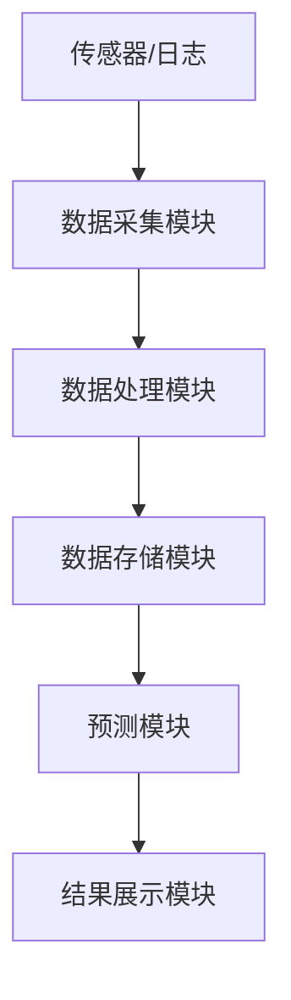
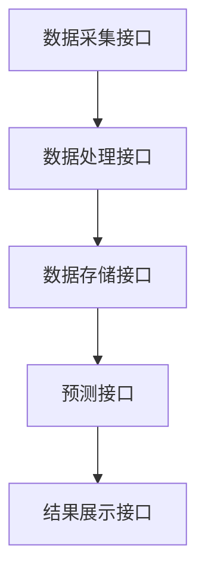

                 

## 第1章: 问题背景与核心概念

### 1.1.1 实时数据分析与预测的概念

#### 1.1.1.1 实时数据分析的定义

实时数据分析（Real-time Data Analysis）是指对产生或收集到的数据进行即时处理和分析，以便在短时间内生成结果并提供决策支持。实时数据分析的核心在于其“实时性”，即数据处理的速度要尽可能接近数据产生的时间。与传统的批量数据处理（Batch Processing）相比，实时数据分析具有以下特点：

1. **低延迟**：实时数据分析的目标是将延迟控制在毫秒级或秒级，确保数据的及时性和有效性。
2. **高频率**：实时数据分析通常需要以较高的频率进行，如每秒处理数十万次数据。
3. **实时反馈**：通过实时数据分析，系统能够快速响应，提供即时的反馈。

实时数据分析的关键技术包括数据采集、数据处理、数据存储和数据分析等环节。其中，数据采集与处理是实时数据分析的基础，数据存储与访问是保证数据实时性的关键，数据分析与挖掘则是实现实时预测的必要手段。

#### 1.1.1.2 实时预测的定义

实时预测（Real-time Prediction）是指利用实时数据分析的结果，对未来的事件或趋势进行预测。实时预测的目标是提前发现潜在的风险或机会，为企业提供前瞻性的决策支持。实时预测与批量预测的区别在于：

1. **实时性**：实时预测需要快速响应，以便在事件发生前做出决策。
2. **准确性**：由于数据量有限，实时预测的准确性可能受到一定影响，因此需要采用高效、精确的预测算法。
3. **实时更新**：实时预测模型会随着新的数据进行实时更新，以保持预测的准确性。

实时预测的关键在于预测模型的构建和训练。常见的技术包括时间序列预测、关联规则预测、机器学习预测等。这些技术都需要对数据进行深入分析，提取有用的特征，并构建高效的预测模型。

### 1.1.2 实时数据分析与预测的重要性

#### 1.1.2.1 提高业务决策的准确性

实时数据分析与预测可以帮助企业更准确地了解市场动态、用户需求等，从而做出更加明智的决策。例如，在金融领域，实时数据分析可以帮助金融机构及时了解市场变化，调整投资策略；在电商领域，实时预测可以帮助商家了解消费者行为，优化库存管理和营销策略。

#### 1.1.2.2 优化业务流程

实时预测可以帮助企业优化业务流程，降低运营成本，提高生产效率。例如，在制造业，实时预测可以帮助工厂实时监控生产线，预测设备故障，提前进行维护；在物流领域，实时预测可以帮助物流公司优化配送路线，提高运输效率。

#### 1.1.2.3 增强用户体验

实时预测可以帮助企业更好地了解用户行为，提供个性化服务，提升用户体验。例如，在社交媒体平台，实时预测可以帮助平台了解用户兴趣，推荐相关内容；在电子商务平台，实时预测可以帮助商家了解用户购物习惯，提供个性化的商品推荐。

### 1.1.3 实时数据分析与预测的应用场景

#### 1.1.3.1 金融领域

在金融领域，实时数据分析与预测有广泛的应用。例如，股票交易预测可以帮助投资者及时了解市场动态，做出投资决策；信用评分可以帮助金融机构评估客户信用风险，降低坏账率；风险控制可以帮助企业及时发现潜在的风险，采取相应的措施。

#### 1.1.3.2 电商领域

在电商领域，实时预测可以帮助商家了解用户行为，优化库存管理和营销策略。例如，通过实时预测用户购买习惯，商家可以提前备货，避免缺货或库存过剩；通过实时预测用户兴趣，商家可以提供个性化的商品推荐，提升销售额。

#### 1.1.3.3 医疗领域

在医疗领域，实时数据分析与预测可以帮助医生实时监控患者病情，预测疾病发展趋势，提供个性化的治疗方案。例如，通过实时预测患者病情，医生可以提前采取措施，避免病情恶化；通过实时预测疾病趋势，医生可以提前制定预防措施，降低疾病传播风险。

### 1.1.4 实时数据分析与预测的基本原则

1. **数据完整性**：确保数据收集和处理过程的完整性，避免数据丢失或错误。
2. **数据实时性**：尽可能降低数据处理的延迟，保证数据的实时性。
3. **数据准确性**：确保数据分析结果的准确性，避免错误决策。
4. **数据安全性**：保护数据隐私，确保数据安全。
5. **系统稳定性**：保证系统的稳定运行，避免因系统故障导致数据丢失或预测失败。

在接下来的章节中，我们将深入探讨实时数据分析与预测的技术原理、系统设计与实现、优化与调优以及实际应用案例，帮助读者更好地理解和掌握这一重要技术。让我们一步步思考，逐步深入，共同探索实时数据分析与预测的奥秘。

## 第2章: 实时数据分析技术

### 2.1.1 数据采集与处理

#### 2.1.1.1 数据采集方法

数据采集是实时数据分析与预测的第一步，其质量直接影响后续的分析和预测结果。以下是几种常见的数据采集方法：

1. **传感器采集**：传感器可以实时监测各种环境参数，如温度、湿度、压力等，并将采集到的数据通过无线或有线方式传输到数据中心进行处理。

   **采集流程**：
   - 传感器安装：在目标环境中布置传感器。
   - 数据传输：传感器通过无线或有线网络将数据传输到数据采集设备。
   - 数据存储：数据采集设备将接收到的数据存储到数据库或缓存中，以便后续处理。

2. **日志文件采集**：日志文件记录了系统运行过程中的各种事件和操作，如系统错误、用户行为等。通过日志文件采集，可以获取系统的实时运行状态。

   **采集流程**：
   - 日志生成：系统运行时自动生成日志文件。
   - 日志收集：使用日志收集工具（如Logstash、Fluentd）定期收集日志文件。
   - 数据处理：将收集到的日志文件解析、清洗后存储到数据库或缓存中。

3. **网络流采集**：通过网络流采集，可以实时获取网络数据包，分析网络流量、协议、内容等信息。

   **采集流程**：
   - 数据包捕获：使用网络捕获工具（如Wireshark、tcpdump）捕获网络数据包。
   - 数据解析：对捕获到的数据包进行解析，提取有用的信息。
   - 数据存储：将解析后的数据存储到数据库或缓存中，以便后续处理。

#### 2.1.1.2 数据处理技术

数据采集后，需要对其进行处理，以提高数据质量，为后续分析提供可靠的数据基础。以下是几种常见的数据处理技术：

1. **数据清洗**：数据清洗是指去除数据中的错误、重复和无关数据，提高数据的准确性。常见的数据清洗方法包括：

   - 错误值处理：删除或替换错误值。
   - 重复数据删除：删除重复的数据记录。
   - 数据格式转换：将不同格式的数据转换为统一的格式。

2. **数据整合**：数据整合是指将来自不同来源、不同格式的数据进行合并，形成统一的数据集。常见的数据整合方法包括：

   - 数据去重：去除重复的数据记录。
   - 数据融合：将多个数据源中的相关数据进行合并。
   - 数据转换：将不同格式的数据转换为统一的格式。

3. **数据标准化**：数据标准化是指对数据进行规范化处理，使其符合特定的标准或规则。常见的数据标准化方法包括：

   - 数据类型转换：将不同数据类型的数据转换为统一的数据类型。
   - 数据范围限制：将数据范围限制在特定的区间内。
   - 数据编码转换：将不同编码的数据转换为统一的编码。

4. **数据聚合**：数据聚合是指将多个数据记录合并为一个记录，进行汇总和分析。常见的数据聚合方法包括：

   - 值聚合：将多个相同属性的数据值进行合并。
   - 时间聚合：将一段时间内的数据记录合并为一个记录。
   - 空间聚合：将空间范围内的数据记录合并为一个记录。

#### 2.1.2 数据存储与管理

实时数据分析需要高效、可靠的数据存储与管理机制，以保证数据的实时性和可用性。以下是几种常见的数据存储与管理技术：

1. **关系数据库**：关系数据库（如MySQL、PostgreSQL）是一种常用的数据存储技术，具有数据结构化、查询灵活等优点。关系数据库适合存储结构化数据，支持复杂查询和联表操作。

2. **NoSQL数据库**：NoSQL数据库（如MongoDB、Cassandra）是一种非关系型数据库，具有高扩展性、高性能等优点。NoSQL数据库适合存储大规模的半结构化或非结构化数据，支持水平扩展和分布式存储。

3. **数据仓库**：数据仓库（如Amazon Redshift、Google BigQuery）是一种专门用于数据存储和分析的数据库系统。数据仓库具有海量数据存储、高效数据查询、实时数据更新等特点，适合进行大规模数据分析和挖掘。

4. **数据湖**：数据湖（如Amazon S3、Google Cloud Storage）是一种分布式存储系统，用于存储大规模的原始数据。数据湖支持多种数据格式，包括结构化、半结构化和非结构化数据，适合进行数据探索和分析。

5. **内存数据库**：内存数据库（如Redis、Memcached）是一种基于内存的数据库系统，具有低延迟、高并发等特点。内存数据库适合存储临时数据、缓存数据等，以提高系统的响应速度。

6. **分布式文件系统**：分布式文件系统（如HDFS、Ceph）是一种用于分布式存储的数据管理系统。分布式文件系统具有高可靠性、高性能、高可扩展性等优点，适合处理大规模数据存储。

#### 2.1.3 数据分析与挖掘

数据分析和挖掘是实时数据分析的核心环节，通过分析数据，提取有价值的信息和知识，为企业提供决策支持。以下是几种常见的数据分析与挖掘技术：

1. **统计分析**：统计分析是一种基于概率统计方法的数据分析技术，通过计算数据的统计特征（如均值、方差、相关性等），识别数据中的规律和趋势。常见的技术包括线性回归、主成分分析、聚类分析等。

2. **机器学习**：机器学习是一种基于数据驱动的方法，通过训练模型，从数据中自动学习规律和模式。常见的机器学习算法包括决策树、支持向量机、神经网络等。

3. **深度学习**：深度学习是一种基于人工神经网络的机器学习技术，通过多层神经网络模型，从数据中自动学习复杂的特征和模式。常见的深度学习模型包括卷积神经网络（CNN）、循环神经网络（RNN）、生成对抗网络（GAN）等。

4. **关联规则挖掘**：关联规则挖掘是一种用于发现数据中潜在关联关系的技术，通过计算支持度和置信度，识别数据中的关联规则。常见的算法包括Apriori算法、FP-growth算法等。

5. **时间序列分析**：时间序列分析是一种用于分析时间序列数据的技术，通过建模时间序列的动态变化，预测未来的趋势和模式。常见的技术包括自回归模型（AR）、移动平均模型（MA）、自回归移动平均模型（ARMA）等。

6. **文本分析**：文本分析是一种用于处理和分析文本数据的技术，通过提取文本中的关键词、主题、情感等，分析文本内容。常见的算法包括词频统计、TF-IDF、主题模型等。

通过以上数据采集、数据处理、数据存储与管理、数据分析与挖掘等技术，实时数据分析与预测可以为企业提供实时、准确、有价值的数据支持，帮助企业做出更加明智的决策。

## 第3章: 实时预测算法原理

### 3.1.1 时间序列预测

时间序列预测是实时预测领域的一个重要分支，其核心目标是根据历史时间序列数据预测未来的值。时间序列数据通常具有如下特征：

1. **有序性**：时间序列数据按照时间顺序排列，每个时间点的数据值与其前后值存在一定的关联。
2. **周期性**：某些时间序列数据可能存在周期性变化，如季节性波动、日周期等。
3. **趋势性**：时间序列数据可能呈现出增长或下降的趋势。

#### 3.1.1.1 时间序列预测基本概念

1. **时间序列模型**：时间序列模型是一组用于描述时间序列数据变化规律的数学模型。常见的时间序列模型包括自回归模型（AR）、移动平均模型（MA）、自回归移动平均模型（ARMA）和自回归积分移动平均模型（ARIMA）。

2. **特征提取**：特征提取是指从时间序列数据中提取能够描述数据变化特征的信息。常见的特征提取方法包括差分、平滑、归一化等。

3. **预测误差**：预测误差是指预测值与实际值之间的差异。减少预测误差是时间序列预测的关键目标。

#### 3.1.1.2 时间序列预测算法

1. **自回归模型（AR）**：
   自回归模型是一种基于历史数据预测未来值的模型，其核心思想是当前值与过去若干个值的线性组合。自回归模型的公式如下：
   \[
   y_t = c + \phi_1 y_{t-1} + \phi_2 y_{t-2} + \ldots + \phi_p y_{t-p} + \epsilon_t
   \]
   其中，\(y_t\) 是第 \(t\) 个时间点的值，\(\phi_1, \phi_2, \ldots, \phi_p\) 是自回归系数，\(c\) 是常数项，\(\epsilon_t\) 是误差项。

2. **移动平均模型（MA）**：
   移动平均模型是一种基于历史数据平均值预测未来值的模型，其核心思想是当前值与过去若干个值的加权平均值。移动平均模型的公式如下：
   \[
   y_t = \theta_1 a_{t-1} + \theta_2 a_{t-2} + \ldots + \theta_q a_{t-q} + \epsilon_t
   \]
   其中，\(y_t\) 是第 \(t\) 个时间点的值，\(\theta_1, \theta_2, \ldots, \theta_q\) 是移动平均系数，\(a_t\) 是白噪声序列。

3. **自回归移动平均模型（ARMA）**：
   自回归移动平均模型是自回归模型和移动平均模型的结合，其核心思想是当前值与过去若干个值的线性组合，同时考虑过去若干个值的加权平均值。自回归移动平均模型的公式如下：
   \[
   y_t = c + \phi_1 y_{t-1} + \phi_2 y_{t-2} + \ldots + \phi_p y_{t-p} + \theta_1 a_{t-1} + \theta_2 a_{t-2} + \ldots + \theta_q a_{t-q} + \epsilon_t
   \]

4. **自回归积分移动平均模型（ARIMA）**：
   自回归积分移动平均模型是对ARMA模型的扩展，可以处理非平稳时间序列数据。其核心思想是先对时间序列数据进行差分，使其变为平稳序列，然后再应用ARMA模型。自回归积分移动平均模型的公式如下：
   \[
   y_t = c + \phi_1 y_{t-1} + \phi_2 y_{t-2} + \ldots + \phi_p y_{t-p} + \theta_1 (d_1 y_{t-1}) + \theta_2 (d_2 y_{t-2}) + \ldots + \theta_q (d_q y_{t-q}) + \epsilon_t
   \]
   其中，\(d_1, d_2, \ldots, d_q\) 是差分操作次数。

#### 3.1.1.3 时间序列预测应用案例

时间序列预测在多个领域都有广泛的应用，以下是一个应用案例：

**案例：股市价格预测**

股市价格预测是时间序列预测的经典应用之一。以下是一个简单的股市价格预测案例：

1. **数据准备**：收集一段时间内的股票价格数据，包括开盘价、最高价、最低价和收盘价。

2. **数据预处理**：对股票价格数据进行清洗，去除异常值和缺失值。

3. **特征提取**：对股票价格数据进行差分，使其变为平稳序列。同时，可以提取一些特征，如移动平均、移动中值等。

4. **模型选择**：根据时间序列数据的特点，选择合适的模型进行预测。例如，对于平稳序列，可以选择ARMA模型；对于非平稳序列，可以选择ARIMA模型。

5. **模型训练**：使用历史数据对模型进行训练，确定模型参数。

6. **模型评估**：使用训练集和测试集对模型进行评估，计算预测误差和精度。

7. **预测应用**：使用训练好的模型对未来的股票价格进行预测，为投资者提供决策支持。

通过上述步骤，可以实现对股市价格的实时预测，帮助投资者及时了解市场动态，做出投资决策。

### 3.1.2 关联规则预测

关联规则预测是一种用于发现数据中潜在关联关系的技术，其核心目标是从大量数据中识别出有趣的关联模式。关联规则预测在商业智能、推荐系统等领域有广泛的应用。

#### 3.1.2.1 关联规则预测基本概念

1. **支持度**：支持度是指一个规则在数据集中出现的频率。支持度越高，规则越有可能为真的概率越大。支持度计算公式如下：
   \[
   支持度 = \frac{交易中包含A且包含B的次数}{交易总数}
   \]
   其中，\(A\) 和 \(B\) 是规则的前件和后件。

2. **置信度**：置信度是指一个规则的成立概率。置信度越高，规则的可靠性越高。置信度计算公式如下：
   \[
   置信度 = \frac{交易中包含A且包含B的次数}{交易中包含A的次数}
   \]
   其中，\(A\) 和 \(B\) 是规则的前件和后件。

3. **提升度**：提升度是支持度和置信度的比率，用于衡量规则的有效性。提升度越高，规则越有预测价值。提升度计算公式如下：
   \[
   提升度 = \frac{置信度_{AB} - 置信度_A}{1 - 置信度_A}
   \]
   其中，\(A\) 和 \(B\) 是规则的前件和后件。

#### 3.1.2.2 关联规则预测算法

1. **Apriori算法**：
   Apriori算法是一种基于支持度阈值的关联规则挖掘算法。其基本思想是使用逐层迭代的方法，生成所有可能的规则。Apriori算法的核心步骤包括：

   - 创建项集：从数据中生成所有可能的项集。
   - 计算支持度：计算每个项集的支持度。
   - 生成频繁项集：选择支持度大于最小支持度阈值的项集作为频繁项集。
   - 生成关联规则：从频繁项集中生成关联规则。

2. **FP-growth算法**：
   FP-growth算法是一种基于压缩数据结构的关联规则挖掘算法。其基本思想是使用条件模式基（CPM）树来压缩数据结构，减少计算量。FP-growth算法的核心步骤包括：

   - 创建FP-growth树：从数据中创建FP-growth树。
   - 生成频繁项集：从FP-growth树中提取频繁项集。
   - 生成关联规则：从频繁项集中生成关联规则。

#### 3.1.2.3 关联规则预测应用案例

**案例：超市购物篮分析**

超市购物篮分析是关联规则预测的经典应用之一。以下是一个超市购物篮分析的案例：

1. **数据准备**：收集一段时间内的购物篮数据，包括各个购物篮中的商品列表。

2. **数据预处理**：对购物篮数据进行清洗，去除异常值和缺失值。

3. **特征提取**：将购物篮数据转换为布尔矩阵，表示每个购物篮中的商品。

4. **模型选择**：根据数据特点，选择合适的关联规则挖掘算法，如Apriori算法或FP-growth算法。

5. **模型训练**：使用历史数据对模型进行训练，确定最小支持度阈值和最小置信度阈值。

6. **模型评估**：使用训练集和测试集对模型进行评估，计算支持度、置信度和提升度。

7. **预测应用**：使用训练好的模型对新的购物篮数据进行预测，发现潜在的关联规则。

通过上述步骤，可以实现对超市购物篮数据的分析，发现顾客购买商品之间的关联关系，为超市制定营销策略提供支持。

通过时间序列预测和关联规则预测，实时预测系统可以为企业提供丰富的预测信息，帮助企业更好地应对市场变化，提高业务运营效率。接下来，我们将进一步探讨实时预测系统的设计与实现。

### 3.1.3 实时预测算法总结与比较

实时预测算法在数据分析与决策支持中扮演着关键角色。以下是几种常见的实时预测算法及其特点的总结与比较：

#### 自回归模型（AR）

**特点**：
- 简单易实现
- 需要确定合适的滞后阶数
- 对噪声敏感

**适用场景**：
- 数据波动较小的时间序列预测
- 数据量不大

#### 移动平均模型（MA）

**特点**：
- 适用于短期预测
- 对趋势性数据有较好的拟合能力
- 对噪声有一定的过滤效果

**适用场景**：
- 数据波动较大的短期预测
- 对预测精度要求较高的场景

#### 自回归移动平均模型（ARMA）

**特点**：
- 结合了AR和MA的优点
- 需要确定合适的滞后阶数和移动平均阶数
- 对趋势性和季节性数据有较好的拟合能力

**适用场景**：
- 复杂的时间序列数据
- 数据具有明显的趋势性和季节性

#### 自回归积分移动平均模型（ARIMA）

**特点**：
- 可以处理非平稳时间序列
- 通过差分操作使数据平稳
- 需要确定合适的滞后阶数和差分阶数

**适用场景**：
- 非平稳时间序列预测
- 数据具有趋势性和季节性

#### Apriori算法

**特点**：
- 简单高效
- 基于支持度阈值
- 适用于大量商品交易数据的挖掘

**适用场景**：
- 购物篮分析
- 顾客行为分析
- 数据量较大的关联规则挖掘

#### FP-growth算法

**特点**：
- 基于压缩数据结构
- 高效处理大量交易数据
- 适用于大量商品交易数据的挖掘

**适用场景**：
- 购物篮分析
- 顾客行为分析
- 数据量较大的关联规则挖掘

#### 比较与选择

在选择实时预测算法时，需要综合考虑数据特征、业务需求和计算资源。以下是比较与选择的一些关键因素：

1. **数据特征**：分析时间序列数据的波动性、趋势性和季节性，选择适合的数据预测模型。
2. **业务需求**：明确预测目标，如短期预测、长期预测、趋势预测等，选择满足业务需求的算法。
3. **计算资源**：考虑算法的复杂度和计算资源，选择适合实际计算能力的算法。
4. **数据量**：对于大数据量，选择高效的数据挖掘算法，如FP-growth算法。
5. **模型调优**：根据模型预测效果进行调优，提高预测精度。

通过综合考虑以上因素，可以为企业选择合适的实时预测算法，实现精准的实时数据分析与预测。接下来，我们将深入探讨实时预测系统的设计与实现，帮助读者更好地理解和应用实时预测技术。

### 3.1.4 实时预测算法设计与实现

#### 3.1.4.1 时间序列预测算法设计与实现

时间序列预测算法的设计与实现主要包括以下步骤：

1. **数据预处理**：
   - **数据清洗**：去除异常值和缺失值，确保数据质量。
   - **数据转换**：对数据进行归一化或标准化处理，使其适合模型训练。
   - **特征提取**：提取时间序列数据中的有用特征，如移动平均、移动中值等。

2. **模型选择**：
   - 根据时间序列数据的特点，选择合适的模型。对于平稳序列，可以选择ARMA模型；对于非平稳序列，可以选择ARIMA模型。

3. **模型训练**：
   - 使用历史数据对模型进行训练，确定模型参数。例如，对于ARIMA模型，需要确定滞后阶数和差分阶数。
   - 训练过程中，可以使用交叉验证等方法评估模型性能，选择最优模型。

4. **模型评估**：
   - 使用测试集对训练好的模型进行评估，计算预测误差和精度。
   - 根据评估结果，对模型进行调优，提高预测精度。

5. **预测应用**：
   - 使用训练好的模型对未来的时间序列数据进行预测，生成预测结果。
   - 将预测结果应用到实际业务场景中，如股市价格预测、电力负荷预测等。

以下是一个简单的ARIMA模型实现示例（使用Python和pandas库）：

```python
import pandas as pd
from statsmodels.tsa.arima.model import ARIMA

# 1. 数据预处理
data = pd.read_csv('time_series_data.csv')
data['Close'] = pd.to_numeric(data['Close'])

# 2. 模型选择与训练
model = ARIMA(data['Close'], order=(5, 1, 2))
model_fit = model.fit()

# 3. 模型评估
predictions = model_fit.predict(start=len(data), end=len(data) + 5)
print(predictions)

# 4. 预测应用
# 将预测结果应用到实际业务场景中
```

#### 3.1.4.2 关联规则预测算法设计与实现

关联规则预测算法的设计与实现主要包括以下步骤：

1. **数据预处理**：
   - **数据清洗**：去除异常值和缺失值，确保数据质量。
   - **数据转换**：将数据转换为适合挖掘的格式，如布尔矩阵。

2. **模型选择**：
   - 根据数据特点，选择合适的算法。对于大型数据集，可以选择FP-growth算法；对于中小型数据集，可以选择Apriori算法。

3. **参数设置**：
   - 确定最小支持度阈值和最小置信度阈值，以过滤掉无关的规则。
   - 根据数据特点和业务需求，调整参数，提高规则的有效性。

4. **算法实现**：
   - 对于Apriori算法，可以使用Python的FP-growth库实现：
     ```python
     from mlxtend.frequent_patterns import fpgrowth
     import pandas as pd

     data = pd.read_csv('transaction_data.csv')
     frequent_itemsets = fpgrowth(data, min_support=0.05, use_colnames=True)
     ```

   - 对于FP-growth算法，可以使用Python的fp-growth库实现：
     ```python
     from fp_growth import fpgrowth
     import pandas as pd

     data = pd.read_csv('transaction_data.csv')
     frequent_itemsets = fpgrowth(data, min_support=0.05, min_confidence=0.7)
     ```

5. **规则评估**：
   - 使用支持度、置信度和提升度等指标评估规则的有效性。
   - 根据评估结果，对参数进行调整，优化规则质量。

6. **预测应用**：
   - 将生成的关联规则应用到实际业务场景中，如购物篮分析、推荐系统等。

以下是一个简单的Apriori算法实现示例（使用Python和mlxtend库）：

```python
from mlxtend.frequent_patterns import apriori
from mlxtend.preprocessing import TransactionEncoder

# 1. 数据预处理
data = pd.read_csv('transaction_data.csv')
te = TransactionEncoder()
data_encoded = te.fit_transform(data)

# 2. 模型选择与参数设置
frequent_itemsets = apriori(data_encoded, min_support=0.05, use_colnames=True)

# 3. 规则评估
# 使用支持度、置信度等指标评估规则的有效性

# 4. 预测应用
# 将生成的关联规则应用到实际业务场景中
```

通过上述设计与实现步骤，可以构建实时预测系统，实现时间序列预测和关联规则预测，为企业提供实时、准确的预测结果。接下来，我们将进一步探讨实时预测系统的设计与实现。

### 3.1.5 实时预测系统设计与实现

#### 3.1.5.1 系统需求分析

实时预测系统的设计与实现首先需要明确系统需求。以下是实时预测系统的一些关键需求：

1. **数据实时性**：系统需要能够实时采集和处理数据，确保数据的实时性。
2. **数据完整性**：系统需要确保数据采集的完整性，避免数据丢失或错误。
3. **数据准确性**：系统需要保证数据分析结果的准确性，避免错误决策。
4. **系统稳定性**：系统需要具有高稳定性，确保在高峰期或故障情况下正常运行。
5. **扩展性**：系统需要具备良好的扩展性，能够支持大规模数据和高并发访问。

#### 3.1.5.2 系统设计

实时预测系统的设计主要包括以下模块：

1. **数据采集模块**：负责实时采集各种数据源的数据，如传感器数据、日志数据、网络流数据等。
2. **数据处理模块**：负责对采集到的数据进行清洗、转换和存储，为后续分析提供可靠的数据基础。
3. **数据存储模块**：负责存储处理后的数据，支持数据的快速访问和查询。
4. **预测模块**：负责实现各种预测算法，如时间序列预测、关联规则预测等，生成预测结果。
5. **结果展示模块**：负责将预测结果可视化，提供用户友好的界面。

以下是实时预测系统的架构设计（使用Mermaid绘制）：


#### 3.1.5.3 数据流设计与接口实现

实时预测系统的数据流设计是实现实时数据处理和分析的关键。以下是实时预测系统的数据流设计：

1. **数据采集**：系统通过传感器、日志收集工具等实时采集数据，并将数据发送到数据处理模块。
2. **数据处理**：数据处理模块对采集到的数据进行清洗、转换和存储，确保数据质量。
3. **数据存储**：处理后的数据存储到数据存储模块，支持数据的快速访问和查询。
4. **预测**：预测模块根据数据存储模块中的数据，应用各种预测算法生成预测结果。
5. **结果展示**：结果展示模块将预测结果可视化，并提供用户友好的界面。

以下是实时预测系统的数据流设计（使用Mermaid绘制）：



#### 3.1.5.4 接口设计与实现

实时预测系统需要提供完善的接口，以便与其他系统进行集成和交互。以下是实时预测系统的一些关键接口设计：

1. **数据采集接口**：提供数据采集模块的API，支持实时数据采集。
2. **数据处理接口**：提供数据处理模块的API，支持数据清洗、转换和存储。
3. **数据存储接口**：提供数据存储模块的API，支持数据查询和访问。
4. **预测接口**：提供预测模块的API，支持各种预测算法的调用和预测结果获取。
5. **结果展示接口**：提供结果展示模块的API，支持预测结果的可视化和交互操作。

以下是实时预测系统的接口设计（使用Mermaid绘制）：



通过以上设计与实现，实时预测系统可以高效地采集、处理和分析数据，生成准确的预测结果，为企业提供实时、有效的决策支持。接下来，我们将深入探讨实时预测系统的优化与调优。

### 3.1.6 实时预测系统优化与调优

#### 3.1.6.1 系统性能优化

实时预测系统的性能优化是确保系统高效运行的关键。以下是一些常见的系统性能优化方法：

1. **数据流优化**：
   - **数据缓存**：使用缓存技术（如Redis、Memcached）提高数据访问速度，减少数据库压力。
   - **数据分区**：对数据存储进行分区，提高数据查询和写入速度。
   - **数据压缩**：对数据进行压缩存储，减少存储空间占用，提高数据传输速度。

2. **计算优化**：
   - **并行处理**：使用并行计算技术（如MapReduce、Spark）提高数据处理速度。
   - **算法优化**：优化预测算法的代码实现，减少计算复杂度和资源占用。
   - **分布式计算**：使用分布式计算框架（如Hadoop、Spark）处理大规模数据。

3. **网络优化**：
   - **负载均衡**：使用负载均衡技术（如Nginx、HAProxy）分发请求，确保系统稳定运行。
   - **网络加速**：使用网络优化技术（如CDN、压缩算法）提高数据传输速度。

4. **资源管理**：
   - **资源监控**：实时监控系统资源使用情况，及时发现和解决性能瓶颈。
   - **资源分配**：合理分配系统资源，确保关键任务的优先级。

#### 3.1.6.2 模型调优策略

预测模型的调优是提高预测准确性的重要手段。以下是一些常见的模型调优策略：

1. **参数调优**：
   - **网格搜索**：遍历所有可能的参数组合，找到最佳参数配置。
   - **贝叶斯优化**：使用贝叶斯优化算法自动搜索最佳参数配置。

2. **特征选择**：
   - **特征重要性评估**：使用特征重要性评估方法（如随机森林、LASSO回归）筛选重要特征。
   - **特征工程**：通过特征转换、组合等方法提高特征的有效性。

3. **模型集成**：
   - **集成模型**：将多个预测模型集成，提高预测准确性。
   - **堆叠模型**：使用堆叠模型（如Stacking、Blending）将多个模型进行集成。

4. **交叉验证**：
   - **K折交叉验证**：使用K折交叉验证方法评估模型性能，避免过拟合。
   - **时间序列交叉验证**：针对时间序列数据，使用时间序列交叉验证方法评估模型性能。

#### 3.1.6.3 性能优化案例分析

以下是一个性能优化案例分析：

**案例：电商实时推荐系统**

电商实时推荐系统需要处理海量的用户行为数据，为用户实时推荐商品。以下是一些性能优化策略：

1. **数据流优化**：
   - **数据缓存**：使用Redis缓存用户行为数据，减少数据库查询压力。
   - **数据分区**：将用户行为数据分区存储，提高数据查询速度。

2. **计算优化**：
   - **并行处理**：使用Spark处理大规模用户行为数据，提高数据处理速度。
   - **算法优化**：优化推荐算法的代码实现，提高计算效率。

3. **网络优化**：
   - **负载均衡**：使用Nginx负载均衡技术，确保系统稳定运行。
   - **网络加速**：使用CDN加速用户数据传输。

4. **资源管理**：
   - **资源监控**：实时监控系统资源使用情况，确保系统高效运行。

通过上述优化策略，电商实时推荐系统实现了高效、准确、稳定的推荐服务，提高了用户满意度和销售额。

通过系统性能优化和模型调优，实时预测系统可以更好地满足业务需求，提高预测准确性和系统稳定性。接下来，我们将探讨实时预测系统的实际应用案例。

### 3.1.7 实时预测系统应用实战

#### 3.1.7.1 实时股票交易预测

实时股票交易预测是金融领域的一个重要应用。以下是一个实时股票交易预测的实战案例：

**案例背景**：某金融科技公司开发了一款实时股票交易预测系统，用于帮助投资者实时了解股票市场动态，做出投资决策。

**系统架构**：

1. **数据采集模块**：系统通过API接口实时采集股票交易数据，包括开盘价、最高价、最低价、收盘价等。
2. **数据处理模块**：数据处理模块对采集到的交易数据进行清洗、转换和存储，为后续分析提供数据基础。
3. **预测模块**：预测模块采用时间序列预测算法（如ARIMA、LSTM）对股票价格进行预测，生成预测结果。
4. **结果展示模块**：结果展示模块将预测结果可视化，并提供用户友好的界面。

**实战步骤**：

1. **数据采集**：
   - 使用API接口实时采集股票交易数据。
   - 数据采集模块将数据发送到数据处理模块。

2. **数据处理**：
   - 数据处理模块对交易数据进行清洗，去除异常值和缺失值。
   - 对交易数据进行归一化处理，使其适合模型训练。

3. **预测**：
   - 选择合适的预测算法（如ARIMA、LSTM）进行股票价格预测。
   - 使用历史交易数据进行模型训练，确定模型参数。

4. **结果展示**：
   - 将预测结果可视化，展示股票价格的未来走势。
   - 提供用户友好的界面，帮助投资者做出投资决策。

**案例效果**：

通过实时股票交易预测系统，投资者可以及时了解股票市场动态，提高投资决策的准确性。系统实现了实时、准确、稳定的股票价格预测，为投资者提供了有力的决策支持。

#### 3.1.7.2 实时客户行为预测

实时客户行为预测是电商领域的一个重要应用。以下是一个实时客户行为预测的实战案例：

**案例背景**：某电商公司开发了一款实时客户行为预测系统，用于分析客户行为，提供个性化推荐和服务。

**系统架构**：

1. **数据采集模块**：系统通过API接口实时采集用户行为数据，包括点击、购买、搜索等。
2. **数据处理模块**：数据处理模块对采集到的用户行为数据进行清洗、转换和存储，为后续分析提供数据基础。
3. **预测模块**：预测模块采用关联规则预测算法（如Apriori、FP-growth）分析客户行为，生成预测结果。
4. **结果展示模块**：结果展示模块将预测结果可视化，并提供用户友好的界面。

**实战步骤**：

1. **数据采集**：
   - 使用API接口实时采集用户行为数据。
   - 数据采集模块将数据发送到数据处理模块。

2. **数据处理**：
   - 数据处理模块对用户行为数据进行清洗，去除异常值和缺失值。
   - 对用户行为数据进行转换，形成交易记录。

3. **预测**：
   - 选择合适的关联规则预测算法（如Apriori、FP-growth）分析客户行为，生成预测结果。
   - 使用交易记录生成关联规则，分析用户购买习惯。

4. **结果展示**：
   - 将预测结果可视化，展示用户购买趋势和潜在需求。
   - 提供用户友好的界面，帮助商家提供个性化推荐和服务。

**案例效果**：

通过实时客户行为预测系统，电商公司可以更好地了解用户需求，提供个性化推荐和服务，提高用户满意度和转化率。系统实现了实时、准确、高效的用户行为预测，为电商运营提供了有力支持。

通过以上实战案例，我们可以看到实时预测系统在金融和电商领域的重要应用。实时预测系统不仅帮助企业和组织做出更准确的决策，还提高了业务运营效率，提升了用户体验。接下来，我们将探讨实时数据分析与预测的未来发展趋势。

### 3.1.8 实时数据分析与预测的未来发展趋势

#### 3.1.8.1 人工智能技术的发展

随着人工智能技术的快速发展，实时数据分析与预测将迎来新的机遇。以下是一些未来发展趋势：

1. **深度学习**：深度学习在图像识别、语音识别、自然语言处理等领域取得了显著成果。未来，深度学习技术将进一步应用到实时数据分析与预测中，提高预测准确性和效率。

2. **增强学习**：增强学习是一种通过试错方法自动优化决策的过程，适合应用于动态环境中的实时预测。通过增强学习，实时预测系统可以不断优化预测策略，提高预测效果。

3. **迁移学习**：迁移学习是一种利用已训练模型在新数据集上进行预测的方法。在未来，实时预测系统可以通过迁移学习技术，快速适应新的数据环境和业务场景。

4. **联邦学习**：联邦学习是一种在分布式环境中训练模型的方法，可以保护用户隐私，提高数据利用率。在未来，联邦学习将有助于实现更安全的实时数据分析与预测。

#### 3.1.8.2 大数据技术的进步

大数据技术的进步将为实时数据分析与预测提供更强有力的支持。以下是一些未来发展趋势：

1. **实时数据存储与处理**：随着分布式存储和处理技术的成熟，实时数据存储与处理能力将大幅提升。例如，基于Hadoop和Spark的实时数据处理框架将广泛应用于实时预测系统。

2. **流数据处理**：流数据处理技术（如Apache Kafka、Apache Flink）将支持实时数据的高效采集和处理。通过流数据处理，实时预测系统可以实时捕捉数据变化，提高预测的实时性。

3. **数据质量管理**：实时数据分析与预测对数据质量有较高要求。未来，数据质量管理技术（如数据清洗、数据治理）将得到广泛应用，确保数据质量。

4. **数据可视化**：数据可视化技术将进一步提升实时数据分析与预测的可视化效果，帮助用户更好地理解和利用数据。

#### 3.1.8.3 传统行业的数字化转型

随着传统行业的数字化转型，实时数据分析与预测将在更多领域得到应用。以下是一些未来发展趋势：

1. **制造业**：实时预测技术将应用于生产线监控、设备故障预测等场景，提高生产效率和设备利用率。

2. **医疗行业**：实时预测技术将应用于疾病预测、医疗资源调度等场景，提高医疗服务质量。

3. **物流行业**：实时预测技术将应用于配送路线优化、库存管理等场景，提高物流效率。

4. **金融行业**：实时预测技术将应用于风险控制、信用评分等场景，提高金融业务运营效率。

#### 3.1.8.4 新兴行业的创新应用

实时数据分析与预测在新兴行业将带来更多创新应用。以下是一些未来发展趋势：

1. **物联网**：实时预测技术将应用于物联网设备的数据分析，实现智能家居、智慧城市等创新应用。

2. **自动驾驶**：实时预测技术将应用于自动驾驶车辆的路径规划和决策，提高行驶安全性和效率。

3. **区块链**：实时预测技术将应用于区块链网络的数据分析，实现区块链系统的安全性和透明性。

4. **虚拟现实与增强现实**：实时预测技术将应用于虚拟现实和增强现实场景，提高用户体验和交互效果。

#### 3.1.8.5 安全与隐私保护

随着实时数据分析与预测应用的普及，安全与隐私保护将成为重要挑战。以下是一些未来发展趋势：

1. **数据加密**：实时预测系统将采用数据加密技术，保护数据在传输和存储过程中的安全性。

2. **隐私保护**：实时预测系统将采用隐私保护技术（如差分隐私、联邦学习），确保数据隐私。

3. **访问控制**：实时预测系统将采用严格的访问控制机制，限制数据访问权限，防止数据泄露。

4. **安全审计**：实时预测系统将引入安全审计机制，监控和记录系统的操作行为，及时发现和防范安全风险。

总之，实时数据分析与预测在未来将随着人工智能、大数据、物联网等技术的发展，在传统行业和新兴领域得到更广泛的应用。同时，安全与隐私保护将成为实时预测系统的重要关注点，确保数据安全和用户隐私。让我们继续关注实时数据分析与预测领域的最新动态，共同探索其无限可能。

### 第4章: 实时预测系统设计与实现

#### 4.1.1 需求分析与系统设计

实时预测系统是一个复杂且关键的应用系统，其设计需要充分考虑业务需求、技术可行性和用户体验。以下是实时预测系统的需求分析与系统设计。

**4.1.1.1 需求分析**

1. **功能需求**：
   - 实时数据采集：系统能够从各种数据源（如传感器、数据库、API等）实时采集数据。
   - 数据处理：系统能够对采集到的数据进行清洗、转换和存储。
   - 预测分析：系统应支持多种预测算法，如时间序列预测、关联规则预测等。
   - 预测结果展示：系统能够将预测结果以图表、报表等形式展示给用户。

2. **性能需求**：
   - 低延迟：系统能够在毫秒级或秒级内完成数据采集、处理和预测。
   - 高并发：系统能够处理大量并发请求，支持大规模数据流处理。

3. **可扩展性**：
   - 系统能够支持水平扩展，满足数据量和并发量的增长。

4. **安全性**：
   - 系统应具备数据加密、访问控制和安全审计等功能，确保数据安全和用户隐私。

5. **用户体验**：
   - 系统应提供用户友好的界面，便于用户进行数据监控、预测分析和结果展示。

**4.1.1.2 系统设计**

实时预测系统设计主要包括以下几个关键模块：

1. **数据采集模块**：负责实时采集各种数据源的数据，如传感器数据、日志数据、网络流数据等。

2. **数据处理模块**：负责对采集到的数据进行清洗、转换和存储，确保数据质量。

3. **预测模块**：实现各种预测算法，如时间序列预测、关联规则预测等，生成预测结果。

4. **数据存储模块**：负责存储处理后的数据，支持数据的快速访问和查询。

5. **结果展示模块**：将预测结果可视化，并提供用户友好的界面。

以下是实时预测系统的架构设计（使用Mermaid绘制）：


#### 4.1.2 数据流设计与接口实现

实时预测系统的数据流设计是实现实时数据处理和分析的关键。以下是实时预测系统的数据流设计：

1. **数据采集**：
   - 数据采集模块通过传感器、日志收集工具等实时采集数据，并将数据发送到数据处理模块。

2. **数据处理**：
   - 数据处理模块对采集到的数据进行清洗、转换和存储，确保数据质量。
   - 处理后的数据存储到数据存储模块，支持数据的快速访问和查询。

3. **预测**：
   - 预测模块根据数据存储模块中的数据，应用各种预测算法生成预测结果。

4. **结果展示**：
   - 结果展示模块将预测结果可视化，并提供用户友好的界面。

以下是实时预测系统的数据流设计（使用Mermaid绘制）：


#### 4.1.3 接口设计与实现

实时预测系统需要提供完善的接口，以便与其他系统进行集成和交互。以下是实时预测系统的一些关键接口设计：

1. **数据采集接口**：提供数据采集模块的API，支持实时数据采集。

2. **数据处理接口**：提供数据处理模块的API，支持数据清洗、转换和存储。

3. **数据存储接口**：提供数据存储模块的API，支持数据查询和访问。

4. **预测接口**：提供预测模块的API，支持各种预测算法的调用和预测结果获取。

5. **结果展示接口**：提供结果展示模块的API，支持预测结果的可视化和交互操作。

以下是实时预测系统的接口设计（使用Mermaid绘制）：


#### 4.1.4 系统功能实现

实时预测系统的实现涉及多个技术模块，以下是一个简单的实现框架：

1. **数据采集**：使用Python的requests库或其他API接口库，实现数据的实时采集。

2. **数据处理**：使用Python的pandas库，实现数据的清洗、转换和存储。

3. **预测算法**：使用Python的scikit-learn、tensorflow等库，实现各种预测算法。

4. **数据存储**：使用MySQL、MongoDB等数据库，实现数据的存储和访问。

5. **结果展示**：使用Python的flask、django等Web框架，实现结果展示的API和前端界面。

以下是实时预测系统的一个简单实现示例：

```python
# 数据采集
import requests

def collect_data(api_url):
    response = requests.get(api_url)
    data = response.json()
    return data

# 数据处理
import pandas as pd

def process_data(data):
    df = pd.DataFrame(data)
    # 数据清洗和转换
    # ...
    return df

# 预测算法
from sklearn.linear_model import LinearRegression

def predict_data(df):
    model = LinearRegression()
    # 模型训练
    # ...
    predictions = model.predict(df)
    return predictions

# 数据存储
import pymongo

def store_data(predictions):
    client = pymongo.MongoClient()
    db = client['predictions']
    collection = db['predictions']
    collection.insert_many(predictions)
    return

# 结果展示
from flask import Flask, jsonify

app = Flask(__name__)

@app.route('/predict', methods=['GET'])
def get_prediction():
    # 获取预测结果
    predictions = # ...
    return jsonify(predictions)

if __name__ == '__main__':
    app.run(debug=True)
```

通过以上实现，我们可以构建一个基本的实时预测系统，实现对数据的实时采集、处理、预测和展示。接下来，我们将进一步探讨实时预测系统的优化与调优。

### 第5章: 实时预测系统优化与调优

#### 5.1.1 系统性能优化

实时预测系统的性能优化是确保系统高效运行的关键。以下是一些常见的系统性能优化方法：

**1. 数据流优化**

- **数据缓存**：使用Redis或Memcached等缓存技术，提高数据访问速度，减少数据库压力。
- **数据分区**：对数据存储进行分区，提高数据查询和写入速度。
- **数据压缩**：对数据进行压缩存储，减少存储空间占用，提高数据传输速度。

**2. 计算优化**

- **并行处理**：使用并行计算技术（如MapReduce、Spark）提高数据处理速度。
- **算法优化**：优化预测算法的代码实现，减少计算复杂度和资源占用。
- **分布式计算**：使用分布式计算框架（如Hadoop、Spark）处理大规模数据。

**3. 网络优化**

- **负载均衡**：使用负载均衡技术（如Nginx、HAProxy）分发请求，确保系统稳定运行。
- **网络加速**：使用网络优化技术（如CDN、压缩算法）提高数据传输速度。

**4. 资源管理**

- **资源监控**：实时监控系统资源使用情况，及时发现和解决性能瓶颈。
- **资源分配**：合理分配系统资源，确保关键任务的优先级。

**5. 数据库优化**

- **索引优化**：对数据库表进行索引优化，提高查询效率。
- **查询优化**：优化数据库查询语句，减少查询时间和资源占用。
- **存储优化**：优化数据存储方式，提高存储效率和访问速度。

#### 5.1.2 模型调优策略

预测模型的调优是提高预测准确性和系统性能的重要手段。以下是一些常见的模型调优策略：

**1. 参数调优**

- **网格搜索**：遍历所有可能的参数组合，找到最佳参数配置。
- **贝叶斯优化**：使用贝叶斯优化算法自动搜索最佳参数配置。

**2. 特征选择**

- **特征重要性评估**：使用特征重要性评估方法（如随机森林、LASSO回归）筛选重要特征。
- **特征工程**：通过特征转换、组合等方法提高特征的有效性。

**3. 模型集成**

- **集成模型**：将多个预测模型集成，提高预测准确性。
- **堆叠模型**：使用堆叠模型（如Stacking、Blending）将多个模型进行集成。

**4. 交叉验证**

- **K折交叉验证**：使用K折交叉验证方法评估模型性能，避免过拟合。
- **时间序列交叉验证**：针对时间序列数据，使用时间序列交叉验证方法评估模型性能。

#### 5.1.3 性能优化案例分析

**案例：电商实时推荐系统性能优化**

电商实时推荐系统需要处理海量的用户行为数据，提供实时、准确的推荐结果。以下是一些性能优化策略：

**1. 数据流优化**

- **数据缓存**：使用Redis缓存用户行为数据，减少数据库查询压力。
- **数据分区**：将用户行为数据分区存储，提高数据查询速度。

**2. 计算优化**

- **并行处理**：使用Spark处理大规模用户行为数据，提高数据处理速度。
- **算法优化**：优化推荐算法的代码实现，提高计算效率。

**3. 网络优化**

- **负载均衡**：使用Nginx负载均衡技术，确保系统稳定运行。
- **网络加速**：使用CDN加速用户数据传输。

**4. 资源管理**

- **资源监控**：实时监控系统资源使用情况，确保系统高效运行。

通过上述优化策略，电商实时推荐系统实现了高效、准确、稳定的推荐服务，提高了用户体验和销售额。

通过系统性能优化和模型调优，实时预测系统可以更好地满足业务需求，提高预测准确性和系统稳定性。接下来，我们将探讨实时预测系统的实际应用案例。

### 第6章: 实时预测系统应用实战

#### 6.1.1 实时股票交易预测

实时股票交易预测是金融领域的一个重要应用，以下是一个实战案例：

**案例背景**：某金融科技公司开发了一款实时股票交易预测系统，用于帮助投资者实时了解股票市场动态，做出投资决策。

**系统架构**：

1. **数据采集模块**：系统通过API接口实时采集股票交易数据，包括开盘价、最高价、最低价、收盘价等。
2. **数据处理模块**：数据处理模块对采集到的交易数据进行清洗、转换和存储，为后续分析提供数据基础。
3. **预测模块**：预测模块采用时间序列预测算法（如ARIMA、LSTM）对股票价格进行预测，生成预测结果。
4. **结果展示模块**：结果展示模块将预测结果可视化，并提供用户友好的界面。

**实战步骤**：

1. **数据采集**：
   - 使用API接口实时采集股票交易数据。
   - 数据采集模块将数据发送到数据处理模块。

2. **数据处理**：
   - 数据处理模块对交易数据进行清洗，去除异常值和缺失值。
   - 对交易数据进行归一化处理，使其适合模型训练。

3. **预测**：
   - 选择合适的预测算法（如ARIMA、LSTM）进行股票价格预测。
   - 使用历史交易数据进行模型训练，确定模型参数。

4. **结果展示**：
   - 将预测结果可视化，展示股票价格的未来走势。
   - 提供用户友好的界面，帮助投资者做出投资决策。

**案例效果**：

通过实时股票交易预测系统，投资者可以及时了解股票市场动态，提高投资决策的准确性。系统实现了实时、准确、稳定的股票价格预测，为投资者提供了有力的决策支持。

#### 6.1.2 实时客户行为预测

实时客户行为预测是电商领域的一个重要应用，以下是一个实战案例：

**案例背景**：某电商公司开发了一款实时客户行为预测系统，用于分析客户行为，提供个性化推荐和服务。

**系统架构**：

1. **数据采集模块**：系统通过API接口实时采集用户行为数据，包括点击、购买、搜索等。
2. **数据处理模块**：数据处理模块对采集到的用户行为数据进行清洗、转换和存储，为后续分析提供数据基础。
3. **预测模块**：预测模块采用关联规则预测算法（如Apriori、FP-growth）分析客户行为，生成预测结果。
4. **结果展示模块**：结果展示模块将预测结果可视化，并提供用户友好的界面。

**实战步骤**：

1. **数据采集**：
   - 使用API接口实时采集用户行为数据。
   - 数据采集模块将数据发送到数据处理模块。

2. **数据处理**：
   - 数据处理模块对用户行为数据进行清洗，去除异常值和缺失值。
   - 对用户行为数据进行转换，形成交易记录。

3. **预测**：
   - 选择合适的关联规则预测算法（如Apriori、FP-growth）分析用户行为，生成预测结果。
   - 使用交易记录生成关联规则，分析用户购买习惯。

4. **结果展示**：
   - 将预测结果可视化，展示用户购买趋势和潜在需求。
   - 提供用户友好的界面，帮助商家提供个性化推荐和服务。

**案例效果**：

通过实时客户行为预测系统，电商公司可以更好地了解用户需求，提供个性化推荐和服务，提高用户满意度和转化率。系统实现了实时、准确、高效的用户行为预测，为电商运营提供了有力支持。

通过以上实战案例，我们可以看到实时预测系统在金融和电商领域的重要应用。实时预测系统不仅帮助企业和组织做出更准确的决策，还提高了业务运营效率，提升了用户体验。接下来，我们将进一步探讨实时数据分析与预测的拓展应用。

### 第7章: 实时数据分析与预测的拓展应用

#### 7.1.1 实时数据分析与预测的其他应用领域

实时数据分析与预测技术具有广泛的应用前景，除了金融和电商领域外，以下领域也具有显著的应用价值：

**1. 医疗领域**

在医疗领域，实时数据分析与预测可以帮助医院进行病情监测、疾病预测和资源调度。例如：

- **病情监测**：通过实时监测患者生命体征数据，医生可以及时了解患者病情变化，提前采取治疗措施。
- **疾病预测**：通过对患者历史病历和实时监测数据的分析，预测患者可能患有的疾病，为医生提供诊断参考。
- **资源调度**：通过对医院资源的实时监控和分析，预测手术室、病房等资源的利用率，优化资源配置。

**2. 能源领域**

在能源领域，实时数据分析与预测可以优化能源生产、传输和消费，提高能源利用效率。例如：

- **能源生产优化**：通过对能源生产设备的实时监控，预测设备故障，提前进行维护，减少停机时间。
- **能源传输优化**：通过对电网数据的实时分析，预测电力需求，优化电力传输路径，减少能源浪费。
- **能源消费预测**：通过对用户用电数据的实时分析，预测用户未来的用电需求，为电力公司提供供需平衡的参考。

**3. 物流领域**

在物流领域，实时数据分析与预测可以帮助物流公司优化配送路线、仓储管理和运输计划。例如：

- **配送路线优化**：通过对实时交通数据和货物配送信息的分析，预测最优的配送路线，减少配送时间和成本。
- **仓储管理优化**：通过对库存数据的实时分析，预测库存变化，优化库存管理，减少库存过剩或不足。
- **运输计划优化**：通过对运输车辆和路线的实时监控，预测运输过程中可能出现的延误和风险，提前采取应对措施。

**4. 基础设施管理**

在基础设施管理领域，实时数据分析与预测可以用于桥梁、道路、水利设施等的监测和维护。例如：

- **桥梁健康监测**：通过对桥梁结构数据的实时分析，预测桥梁的损伤和老化程度，提前进行维修。
- **道路状况监测**：通过对道路交通数据的实时分析，预测道路的拥堵和破损情况，优化道路维修计划。
- **水利设施监测**：通过对水利设施数据的实时分析，预测洪水、干旱等灾害风险，提前采取预防措施。

**5. 城市管理**

在城市管理领域，实时数据分析与预测可以用于城市交通管理、环境监测和公共安全等方面。例如：

- **城市交通管理**：通过对交通流量、路况等数据的实时分析，预测交通拥堵情况，优化交通信号控制。
- **环境监测**：通过对空气、水质等环境数据的实时分析，预测污染风险，提前采取治理措施。
- **公共安全**：通过对犯罪行为、突发事件等数据的实时分析，预测潜在的安全风险，提前采取防范措施。

通过在各个领域的应用，实时数据分析与预测技术不仅提高了业务运营效率，还提升了用户体验，推动了行业的数字化和智能化发展。

#### 7.1.2 实时数据分析与预测的未来发展方向

随着技术的不断进步，实时数据分析与预测将迎来更多的发展机遇。以下是一些未来发展方向：

**1. 人工智能与深度学习**

人工智能和深度学习技术的发展将进一步推动实时数据分析与预测的进步。通过引入先进的机器学习和深度学习算法，实时预测系统可以实现更高准确性和更强的适应性。

**2. 联邦学习**

联邦学习是一种在分布式环境中进行机器学习的方法，可以在保护数据隐私的同时，实现高效的实时数据分析与预测。未来，联邦学习技术将在实时数据分析与预测中发挥重要作用。

**3. 实时流处理**

随着大数据和云计算技术的发展，实时流处理技术将得到广泛应用。实时流处理技术可以处理海量实时数据，实现更快速、更准确的实时数据分析与预测。

**4. 容器化与云原生**

容器化和云原生技术的普及将使实时预测系统更加灵活、可扩展。通过将实时预测系统部署在容器化和云原生环境中，可以实现按需扩展、自动扩缩容，提高系统的弹性和可靠性。

**5. 安全与隐私保护**

随着实时数据分析与预测应用的普及，数据安全和隐私保护将变得越来越重要。未来，实时预测系统将采用更加严格的数据安全措施，如数据加密、访问控制、隐私保护算法等，确保数据的安全和用户的隐私。

**6. 跨领域融合**

实时数据分析与预测技术将在不同领域之间实现融合，形成新的应用场景。例如，将医疗数据和交通数据结合，可以实现更准确的医疗诊断和交通管理；将能源数据和气象数据结合，可以实现更精准的能源生产和消费预测。

通过不断的技术创新和应用拓展，实时数据分析与预测技术将在未来发挥更加重要的作用，为各行各业提供强大的数据驱动决策支持。

### 总结

实时数据分析与预测技术作为现代数据科学的重要组成部分，已经成为推动各行业数字化转型和智能化的关键力量。通过本文的详细探讨，我们从问题背景、核心概念、技术原理、系统设计与实现、优化与调优以及实际应用等多个维度，全面了解了实时数据分析与预测的方方面面。

**核心内容回顾**：

1. **问题背景**：介绍了实时数据分析与预测的重要性，包括其在金融、电商、医疗等领域的应用场景。
2. **核心概念**：阐述了实时数据分析与预测的定义、原理及其与批量数据处理的区别。
3. **技术原理**：讲解了实时数据分析与处理、数据存储与管理、预测算法设计等关键技术。
4. **系统设计与实现**：分析了实时预测系统的需求、架构、数据流设计、接口实现等内容。
5. **优化与调优**：讨论了系统性能优化、模型调优策略以及具体案例分析。
6. **实际应用**：通过实战案例展示了实时预测系统在股票交易、客户行为预测等领域的应用。
7. **未来发展趋势**：探讨了实时数据分析与预测的未来发展方向，包括人工智能、联邦学习、容器化等。

**核心要点**：

- 实时性是实时数据分析与预测的核心特点，低延迟、高频率是关键要求。
- 数据采集、处理、存储和分析是实时预测系统的核心环节。
- 时间序列预测和关联规则预测是两种重要的实时预测算法。
- 系统性能优化和模型调优是提高实时预测系统效率和准确性的重要手段。
- 实际应用案例展示了实时预测系统在各个领域的广泛应用。

通过本文的阅读，读者应能全面掌握实时数据分析与预测的基本概念、技术原理和实战应用，为在各自领域内开展相关工作提供理论基础和实践指导。

**注意事项**：

- 在实际应用中，要充分考虑数据质量和系统稳定性。
- 实时预测系统的设计与实现需要根据具体业务需求进行灵活调整。
- 数据安全和隐私保护是实时预测系统的重要方面，需采取严格的安全措施。

**拓展阅读**：

- 《Python数据科学手册》
- 《深度学习》
- 《大数据技术导论》
- 《实时数据分析实战》

**作者**：

作者：AI天才研究院/AI Genius Institute & 禅与计算机程序设计艺术 /Zen And The Art of Computer Programming

希望本文能为读者在实时数据分析与预测领域的学习和应用提供有价值的参考。让我们一起继续探索和深化这一前沿技术的应用，推动数据科学和人工智能的发展。

