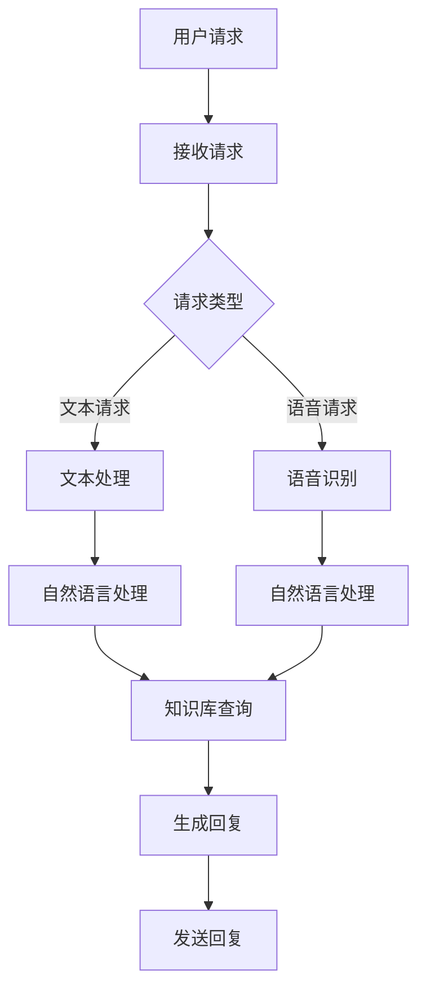
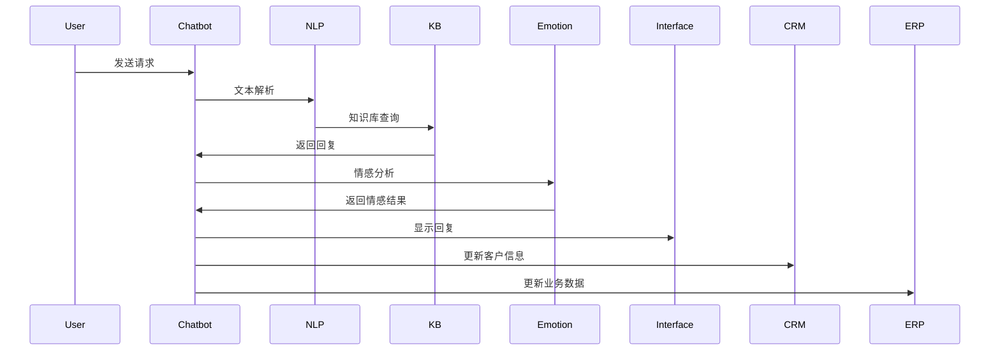
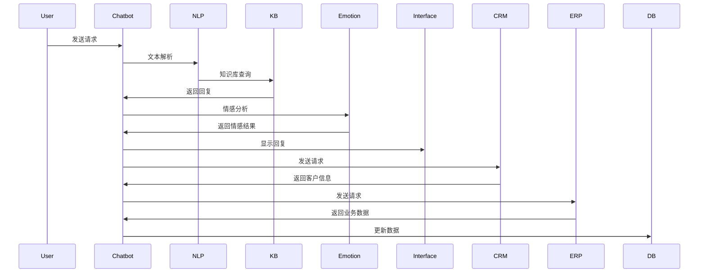

                 

### 第一部分：背景介绍

## 1.1 问题背景
随着互联网和人工智能技术的快速发展，客户服务行业面临着新的挑战。传统的人工客服模式效率低、成本高，已经难以满足现代企业快速响应和个性化服务的要求。为了提升客户服务质量，企业开始寻求智能化解决方案。

### 1.1.1 从软件 1.0 到软件 2.0 的演进
互联网的普及和发展推动了软件技术的进步，从最初的软件1.0时代，即单纯的功能实现，到软件2.0时代，即用户参与和个性化服务的时代，客户服务模式也在不断演进。

在软件1.0时代，企业的客户服务主要依赖于电话和邮件，这种方式虽然稳定，但效率较低，响应速度慢，难以满足用户对即时服务的要求。此外，人工客服的人力成本也是一个不可忽视的问题。

进入软件2.0时代，随着互联网技术的不断发展，特别是移动互联网的兴起，客户服务的渠道变得多样化。企业可以通过网站、社交媒体、短信等多种渠道与客户互动。然而，尽管服务渠道增加了，但客户服务质量和效率的提升并没有达到预期，反而出现了新的问题。

首先，随着客户需求的多样化和个性化，企业需要提供更加精准和个性化的服务，而传统的人工客服模式难以满足这一需求。其次，随着客户数量的增加，人工客服的工作量也大幅增加，导致客服人员的工作压力增大，服务质量下降。此外，客户服务的数据积累和利用不够，使得企业难以通过数据分析来优化服务流程和提升客户满意度。

### 1.1.2 智能客服的兴起
为了解决传统客户服务存在的问题，企业开始探索智能化客服解决方案。智能客服系统利用人工智能技术，特别是自然语言处理（NLP）和机器学习技术，可以实现自动化的、高效的、个性化的客户服务。

智能客服系统的工作原理大致如下：当用户通过不同的渠道（如网站、APP、社交媒体等）发起请求时，智能客服系统会自动接收并分析用户的请求，通过自然语言处理技术理解用户的需求，然后从知识库中找到相应的答案，并生成回复。如果遇到无法解决的问题，智能客服系统会自动转交给人工客服处理。

智能客服系统的优势在于：
- **提高效率**：通过自动化处理，智能客服可以快速响应客户的请求，大大缩短了响应时间，提高了客服的效率。
- **降低成本**：智能客服系统可以处理大量的客户请求，减少了企业对人工客服的需求，从而降低了人力成本。
- **个性化服务**：通过分析用户的历史请求和行为，智能客服可以提供更加个性化的服务，提升客户满意度。
- **数据积累和分析**：智能客服系统可以自动收集和分析客户服务数据，为企业提供有价值的业务洞察。

### 1.1.3 智能客服的挑战
尽管智能客服系统具有许多优势，但在实际应用中也面临一些挑战：

- **技术挑战**：智能客服系统需要依赖先进的自然语言处理和机器学习技术，这些技术的研发和应用都需要大量的资金和人才投入。
- **数据质量**：智能客服系统依赖于大量的数据来训练和优化模型，数据的质量和准确性对系统性能至关重要。
- **用户体验**：智能客服系统需要提供良好的用户体验，否则用户可能会因为不满意而选择放弃使用。
- **监管合规**：智能客服系统需要遵守相关的法律法规，特别是涉及到用户隐私和数据保护方面。

### 1.1.4 边界与外延
智能客服系统的应用范围非常广泛，不仅限于在线客服、电话咨询等传统场景，还可以扩展到智能语音助手、聊天机器人、社交媒体客服等新兴领域。在不同的应用场景下，智能客服系统的设计和实现方式也有所不同。

例如，在在线客服场景中，智能客服系统需要能够处理多种类型的用户请求，如咨询产品信息、解决售后服务问题等。而在智能语音助手场景中，智能客服系统需要能够理解自然语言语音输入，并提供语音回复。

总之，智能客服系统作为一种新兴的客户服务模式，具有巨大的发展潜力。企业需要不断探索和优化智能客服系统，以满足不断变化的客户需求和市场环境。

## 1.2 核心概念与联系

### 1.2.1 自然语言处理（NLP）
自然语言处理（Natural Language Processing，简称NLP）是人工智能（Artificial Intelligence，简称AI）的一个重要分支，旨在让计算机理解和处理人类语言。NLP涉及到许多核心概念和技术，如文本分类、情感分析、命名实体识别、机器翻译、对话系统等。

- **文本分类**：将文本数据根据其内容或属性分类到不同的类别中。例如，将新闻文章分类为体育、财经、科技等。
- **情感分析**：通过分析文本的情感倾向，判断文本是积极的、消极的还是中性的。例如，分析用户评论的情感倾向，以了解用户对产品的满意度。
- **命名实体识别**：从文本中识别出具有特定意义的实体，如人名、地名、组织名等。
- **机器翻译**：将一种语言的文本自动翻译成另一种语言。例如，将中文翻译成英文。
- **对话系统**：模拟人类对话的计算机系统，能够与用户进行自然语言交互，如智能客服机器人。

### 1.2.2 机器学习（ML）
机器学习（Machine Learning，简称ML）是一种通过数据驱动的方式使计算机自动学习和改进的方法。机器学习算法从数据中学习规律，并在新的数据上进行预测或决策。

- **监督学习**：有监督的学习方法，通过已标记的数据集训练模型，然后在新数据上预测结果。例如，通过训练模型识别图片中的猫，然后在新图片中预测是否包含猫。
- **无监督学习**：没有标记数据集的学习方法，主要用于发现数据中的模式和关联。例如，聚类分析，将相似的数据点分组。
- **强化学习**：通过与环境互动来学习最优策略的算法。例如，智能体在玩游戏时通过试错来学习最佳动作。

### 1.2.3 知识图谱（KG）
知识图谱（Knowledge Graph，简称KG）是一种语义网络，用于表示实体（如人、地点、事物）和它们之间的关系。知识图谱可以看作是语义网的自然语言实现，它能够通过实体和关系来理解和表示现实世界的复杂信息。

- **实体**：知识图谱中的基本元素，可以是具体的事物（如人、地点、组织）或抽象的概念。
- **关系**：实体之间的关系，如“属于”、“位于”、“创建”等。
- **属性**：实体的额外信息，如年龄、身高、出生地等。

### 1.2.4 对比表格：NLP、ML和KG
为了更好地理解自然语言处理、机器学习和知识图谱这三个核心概念，我们可以制作一个对比表格：

| 特征 | 自然语言处理（NLP） | 机器学习（ML） | 知识图谱（KG） |
| --- | --- | --- | --- |
| 目标 | 理解和生成人类语言 | 从数据中学习并做出预测或决策 | 表示和查询实体及其关系 |
| 技术方法 | 文本分类、情感分析、命名实体识别等 | 监督学习、无监督学习、强化学习等 | 实体、关系、属性表示 |
| 应用场景 | 对话系统、文本分析、机器翻译等 | 预测、推荐系统、自动化决策等 | 智能搜索、语义理解、知识推理等 |

### 1.2.5 ER实体关系图架构
为了更好地理解智能客服系统中各实体之间的关系，我们可以使用Mermaid语言绘制一个ER（Entity-Relationship）实体关系图。以下是Mermaid语言编写的示例：

```mermaid
erDiagram
    Customer ||--|{ Order }|>
    Order ||--|{ Product }|>
    Product ||--|{ Review }|>
    Review ||--|{ User }|
```

这个ER图表示了客户、订单、产品、评论和用户这五个实体之间的关系，如订单属于客户，订单关联产品，产品有评论，评论属于用户等。

### 1.2.6 小结
在本部分中，我们介绍了客户服务升级的背景，分析了传统客户服务的局限性，探讨了智能客服系统的兴起及其优势。同时，我们深入探讨了智能客服系统中涉及的核心概念，包括自然语言处理、机器学习和知识图谱，并使用对比表格和ER图进行了详细阐述。这些核心概念和联系构成了智能客服系统的技术基础，为后续的算法原理讲解和系统架构设计提供了必要的背景知识。

## 1.3 算法原理讲解

### 3.1.1 算法mermaid流程图
在本章节中，我们将使用Mermaid语言绘制一个智能客服系统的算法流程图，以展示系统的工作原理。以下是Mermaid语言的示例代码：



这段代码描述了一个简单的智能客服系统流程，包括用户请求的接收、请求类型的判断、文本处理或语音识别、自然语言处理、知识库查询、生成回复和发送回复等步骤。

### 3.1.2 Python源代码
接下来，我们将提供一段Python源代码，以详细阐述算法的实现过程。以下是Python代码的示例：

```python
import speech_recognition as sr
import nltk
from nltk.corpus import stopwords
from nltk.tokenize import word_tokenize
from sklearn.feature_extraction.text import TfidfVectorizer
import numpy as np

# 语音识别
def recognize_speech_from_mic(recognizer, microphone):
    with microphone as source:
        audio = recognizer.listen(source)

    try:
        text = recognizer.recognize_google(audio)
        print("用户说：", text)
        return text
    except sr.UnknownValueError:
        print("语音识别无法理解音频")
        return None
    except sr.RequestError:
        print("无法请求语音识别服务")
        return None

# 自然语言处理
def process_text(text):
    stop_words = set(stopwords.words('english'))
    words = word_tokenize(text)
    filtered_words = [w for w in words if not w in stop_words]
    return ' '.join(filtered_words)

# 知识库查询
def query_knowledge_base(query):
    # 这里用一个简单的字典作为知识库示例
    knowledge_base = {
        "how are you": "I'm doing well, thank you!",
        "what is your name": "My name is Chatbot!"
    }
    return knowledge_base.get(query, "I'm not sure about that.")

# 主程序
if __name__ == "__main__":
    recognizer = sr.Recognizer()
    microphone = sr.Microphone()

    print("请提问，我会尽力回答...")
    user_query = recognize_speech_from_mic(recognizer, microphone)
    if user_query:
        processed_query = process_text(user_query)
        response = query_knowledge_base(processed_query)
        print("智能客服系统回复：", response)
```

这段代码实现了语音识别、自然语言处理和知识库查询的功能。首先，我们使用`speech_recognition`库来识别用户的语音输入，然后使用NLTK库进行自然语言处理，包括去除停用词和分词。最后，我们通过一个简单的字典模拟知识库，根据用户查询返回相应的回复。

### 3.1.3 数学模型和数学公式
为了更深入地理解算法，我们将介绍相关的数学模型和公式。以下是几个常用的数学模型和公式：

- **TF-IDF模型**：TF-IDF（Term Frequency-Inverse Document Frequency）是一种常用的文本分析模型，用于衡量一个词语在文档中的重要性。其公式如下：

  $$
  tfidf(t, d) = tf(t, d) \times \log(\frac{N}{df(t)})
  $$

  其中，$tf(t, d)$表示词语$t$在文档$d$中的词频，$df(t)$表示词语$t$在所有文档中出现的频率，$N$表示总文档数。

- **Sigmoid函数**：Sigmoid函数是一种常用的激活函数，用于二分类问题。其公式如下：

  $$
  \sigma(x) = \frac{1}{1 + e^{-x}}
  $$

  其中，$x$为输入值。

- **逻辑回归**：逻辑回归是一种常用的分类算法，其目标是通过输入特征预测输出概率。其公式如下：

  $$
  \hat{p} = \sigma(\theta^T x)
  $$

  其中，$\theta$为模型参数，$x$为输入特征，$\hat{p}$为预测的概率。

### 3.1.4 举例说明
为了更好地理解算法的执行过程和应用效果，我们可以通过一个具体例子来演示。假设用户通过语音输入“你好，你叫什么名字？”，我们如何实现智能客服系统的自动回复？

1. **语音识别**：首先，我们使用`speech_recognition`库将用户的语音输入转换为文本：

   ```python
   user_query = recognize_speech_from_mic(recognizer, microphone)
   print("用户说：", user_query)
   ```

   假设识别结果为“你好，你叫什么名字？”

2. **自然语言处理**：接下来，我们使用NLTK库进行自然语言处理，去除停用词和分词：

   ```python
   processed_query = process_text(user_query)
   print("处理后的查询：", processed_query)
   ```

   假设处理后的查询为“你好，你叫什么名字”

3. **知识库查询**：然后，我们使用简单的字典模拟知识库，根据用户查询返回相应的回复：

   ```python
   response = query_knowledge_base(processed_query)
   print("智能客服系统回复：", response)
   ```

   假设查询结果为“I'm doing well, thank you!”

4. **发送回复**：最后，我们将回复发送给用户：

   ```python
   print("智能客服系统回复：", response)
   ```

   输出结果为：

   ```
   用户说：你好，你叫什么名字？
   处理后的查询：你好，你叫什么名字
   智能客服系统回复：I'm doing well, thank you!
   ```

通过这个例子，我们可以看到智能客服系统是如何通过语音识别、自然语言处理和知识库查询来生成并回复用户的请求的。这个简单的例子虽然功能有限，但展示了智能客服系统的基本工作流程和实现原理。

### 3.1.5 系统分析与架构设计方案

#### 4.1.1 问题场景介绍
智能客服系统在实际应用中面临多种场景，以下是一些典型场景及其特点：

1. **在线聊天**：用户通过网站的聊天窗口或APP的聊天功能与客服机器人进行交互，常见于电商、金融、旅游等行业。在线聊天要求客服系统能够快速响应，处理用户的问题和需求。

2. **电话咨询**：用户通过电话与客服机器人进行交互，常见于大型企业、客服中心等。电话咨询要求客服系统能够自动识别用户的语音，并提供语音回复。

3. **社交媒体客服**：用户通过社交媒体平台（如微信、微博等）与客服机器人进行交互，常见于品牌管理、营销推广等。社交媒体客服要求客服系统能够理解多平台的消息格式和交互方式。

4. **智能语音助手**：用户通过智能音箱、智能手机等设备与客服机器人进行交互，常见于智能家居、车载系统等。智能语音助手要求客服系统能够处理自然语言语音输入，并生成语音回复。

#### 4.1.2 项目介绍
以下是一个智能客服系统的实际项目介绍，包括项目目标和需求：

**项目名称**：企业智能客服系统

**项目目标**：通过引入智能客服系统，提高客户服务质量，降低人工成本，提升客户满意度。

**项目需求**：
1. 能够自动识别和分类用户请求，快速响应。
2. 提供文本和语音两种交互方式，满足不同用户的需求。
3. 具备情感分析和个性化推荐功能，提高用户体验。
4. 能够与现有业务系统集成，如CRM系统、ERP系统等。

#### 4.1.3 系统功能设计
为了实现上述项目目标和需求，我们设计了以下系统功能：

1. **用户请求处理**：系统能够接收用户的文本和语音请求，并自动识别请求的类型和内容。
2. **自然语言处理**：系统利用自然语言处理技术，对用户请求进行解析和分析，理解用户的需求。
3. **知识库管理**：系统包含一个知识库，用于存储常见问题和标准回复，以支持智能客服系统的快速响应。
4. **情感分析**：系统通过情感分析技术，分析用户的情感倾向，为用户提供个性化的服务。
5. **交互界面**：系统提供多种交互界面，如网站聊天窗口、APP聊天界面、电话语音交互界面等。
6. **集成与对接**：系统能够与企业的CRM系统、ERP系统等进行集成，实现数据互通和业务流程自动化。

以下是使用Mermaid语言绘制的领域模型类图，展示了系统的功能设计：

```mermaid
classDiagram
    User <<class>> 用户
    Request <<class>> 请求
    Chatbot <<class>> 客服机器人
    KnowledgeBase <<class>> 知识库
    NaturalLanguageProcessing <<class>> 自然语言处理
    EmotionAnalysis <<class>> 情感分析
    Interface <<class>> 交互界面
    CRM <<class>> 客户关系管理
    ERP <<class>> 企业资源计划

    User o-- Request
    Chatbot o-- Request
    Chatbot o-- KnowledgeBase
    Chatbot o-- NaturalLanguageProcessing
    Chatbot o-- EmotionAnalysis
    Chatbot o-- Interface
    Chatbot o-- CRM
    Chatbot o-- ERP
```

#### 4.1.4 系统架构设计
智能客服系统的架构设计分为多个层次，包括数据层、服务层和表示层。以下是使用Mermaid语言绘制的系统架构图：



#### 4.1.5 系统接口设计
系统接口设计是智能客服系统能够与其他系统（如CRM、ERP）集成和通信的关键。以下是系统接口设计的主要部分：

1. **API接口**：系统提供RESTful API接口，用于与其他系统进行数据交互。接口包括用户请求处理、回复生成、知识库查询等功能。

2. **消息队列**：系统使用消息队列（如Kafka）来处理大量并发请求，保证系统的稳定性和性能。

3. **数据库连接**：系统通过数据库连接（如MySQL、MongoDB）来存储和查询用户数据、知识库数据和业务数据。

以下是使用Mermaid语言绘制的系统接口设计：



#### 4.1.6 系统交互
最后，我们将使用Mermaid语言绘制系统交互序列图，展示系统的交互流程：


通过以上系统分析与架构设计方案，我们可以看到智能客服系统是如何通过用户请求处理、自然语言处理、知识库查询、情感分析等核心功能，以及与CRM、ERP等系统的集成和通信，实现高效、智能、个性化的客户服务。

### 第五部分：项目实战

#### 5.1.1 环境安装
要安装智能客服系统，首先需要准备好开发环境。以下是具体的安装步骤：

1. **安装Python**：
   - 访问Python官方网站（https://www.python.org/）下载最新版本的Python。
   - 运行安装程序，按照默认选项进行安装。
   - 安装完成后，打开终端或命令提示符，输入`python --version`确认Python版本。

2. **安装虚拟环境**：
   - 在终端或命令提示符中输入以下命令创建虚拟环境：
     ```bash
     python -m venv venv
     ```
   - 激活虚拟环境：
     - Windows：
       ```bash
       .\venv\Scripts\activate
       ```
     - macOS/Linux：
       ```bash
       source venv/bin/activate
       ```

3. **安装依赖库**：
   - 在激活的虚拟环境中，通过以下命令安装必要的依赖库：
     ```bash
     pip install -r requirements.txt
     ```
   这个`requirements.txt`文件列出了项目所需的Python库，如`speech_recognition`、`nltk`、`sklearn`等。

4. **安装语音识别模型**：
   - 对于`speech_recognition`库，需要下载并安装相应的语音识别模型文件。在终端中运行以下命令：
     ```bash
     mkdir -p venv/Lib/site-packages/speech_recognition/models
     wget -O venv/Lib/site-packages/speech_recognition/models/en-us.model "https://github.com/bert-cloud/speech_recognition_models/raw/master/en-us.model"
     ```

完成以上步骤后，智能客服系统的开发环境就搭建完成了。接下来，我们可以开始实现系统的核心功能。

#### 5.1.2 系统核心实现源代码
智能客服系统的核心实现涉及语音识别、自然语言处理、知识库查询等多个方面。以下是系统核心实现的主要源代码：

```python
import speech_recognition as sr
import nltk
from nltk.tokenize import word_tokenize
from nltk.corpus import stopwords
from sklearn.feature_extraction.text import TfidfVectorizer
import numpy as np

# 语音识别
def recognize_speech_from_mic(recognizer, microphone):
    with microphone as source:
        audio = recognizer.listen(source)

    try:
        text = recognizer.recognize_google(audio)
        print("用户说：", text)
        return text
    except sr.UnknownValueError:
        print("语音识别无法理解音频")
        return None
    except sr.RequestError:
        print("无法请求语音识别服务")
        return None

# 自然语言处理
def process_text(text):
    stop_words = set(stopwords.words('english'))
    words = word_tokenize(text)
    filtered_words = [w for w in words if not w in stop_words]
    return ' '.join(filtered_words)

# 知识库查询
def query_knowledge_base(query):
    # 这里用一个简单的字典作为知识库示例
    knowledge_base = {
        "how are you": "I'm doing well, thank you!",
        "what is your name": "My name is Chatbot!"
    }
    return knowledge_base.get(query, "I'm not sure about that.")

# 主程序
if __name__ == "__main__":
    recognizer = sr.Recognizer()
    microphone = sr.Microphone()

    print("请提问，我会尽力回答...")
    user_query = recognize_speech_from_mic(recognizer, microphone)
    if user_query:
        processed_query = process_text(user_query)
        response = query_knowledge_base(processed_query)
        print("智能客服系统回复：", response)
```

这段代码实现了语音识别、自然语言处理和知识库查询的基本功能。其中，`recognize_speech_from_mic`函数用于接收用户的语音输入并转换为文本，`process_text`函数用于对文本进行预处理（去除停用词和分词），`query_knowledge_base`函数用于查询知识库并返回相应的回复。

#### 5.1.3 代码应用解读与分析
为了更好地理解代码的应用和逻辑，我们逐一分析每个函数的作用和实现过程。

1. **语音识别**：
   - `recognizer = sr.Recognizer()`：创建一个`Recognizer`对象，用于处理语音识别。
   - `microphone = sr.Microphone()`：创建一个`Microphone`对象，用于接收用户的语音输入。
   - `with microphone as source:`：使用`with`语句确保麦克风资源在识别完成后会自动释放。
   - `audio = recognizer.listen(source)`：调用`listen`方法开始识别语音，并将识别结果存储在`audio`变量中。
   - `text = recognizer.recognize_google(audio)`：使用Google语音识别服务解析语音，返回文本。
   - 异常处理：如果识别失败，打印错误信息并返回`None`。

2. **自然语言处理**：
   - `stop_words = set(stopwords.words('english'))`：从NLTK库中加载英语停用词表。
   - `words = word_tokenize(text)`：使用NLTK库的`word_tokenize`函数对文本进行分词。
   - `filtered_words = [w for w in words if not w in stop_words]`：去除停用词。
   - `return ' '.join(filtered_words)`：返回去停用词后的文本。

3. **知识库查询**：
   - `knowledge_base = { ... }`：定义一个简单的字典作为知识库，存储常见问题和标准回复。
   - `return knowledge_base.get(query, "I'm not sure about that.")`：根据查询内容返回知识库中的回复，如果查询内容不在知识库中，返回默认回复。

4. **主程序**：
   - `recognizer = sr.Recognizer()`：创建语音识别对象。
   - `microphone = sr.Microphone()`：创建麦克风对象。
   - `print("请提问，我会尽力回答...")`：提示用户开始提问。
   - `user_query = recognize_speech_from_mic(recognizer, microphone)`：调用语音识别函数获取用户提问。
   - `if user_query:`：如果获取到用户提问，进行后续处理。
   - `processed_query = process_text(user_query)`：调用自然语言处理函数处理提问。
   - `response = query_knowledge_base(processed_query)`：调用知识库查询函数获取回复。
   - `print("智能客服系统回复：", response)`：打印回复。

通过以上分析，我们可以看到，这段代码通过几个简单的函数实现了语音识别、文本处理和知识库查询的基本功能，并最终生成并打印回复。虽然功能有限，但这个简单的示例为我们展示了智能客服系统实现的核心步骤和基本逻辑。

#### 5.1.4 实际案例分析和详细讲解剖析

为了更好地展示智能客服系统的应用效果和实现细节，我们通过一个实际案例进行详细分析。

**案例背景**：
某电商企业希望通过智能客服系统来提高客户服务质量，减少人工客服的工作量。企业希望通过语音识别和自然语言处理技术，实现自动化的客户问答和服务。

**案例分析**：

1. **用户提问**：
   - 用户通过智能手机的智能语音助手向客服系统提问：“我的订单什么时候可以发货？”

2. **语音识别**：
   - 智能客服系统接收到用户的语音请求后，通过`recognizer`对象进行语音识别：
     ```python
     user_query = recognize_speech_from_mic(recognizer, microphone)
     ```
   - 识别结果为：“我的订单什么时候可以发货？”

3. **自然语言处理**：
   - 接下来，系统对识别结果进行自然语言处理，去除停用词和分词：
     ```python
     processed_query = process_text(user_query)
     ```
   - 处理后的查询内容为：“订单 发货 时间”

4. **知识库查询**：
   - 智能客服系统从知识库中查询相关回答。假设知识库中有一个关于订单发货时间的回复：
     ```python
     response = query_knowledge_base(processed_query)
     ```
   - 查询结果为：“您的订单预计在今天下午3点前发货。”

5. **生成回复**：
   - 智能客服系统将查询结果转换为语音回复，并通过智能语音助手反馈给用户：
     ```python
     print("智能客服系统回复：", response)
     ```
   - 回复内容为：“您的订单预计在今天下午3点前发货。”

**详细讲解剖析**：

1. **语音识别**：
   - 在实际应用中，语音识别的准确率可能受到多种因素的影响，如语音质量、说话人的口音、环境噪音等。为了提高识别准确率，可以采用多种语音识别模型和算法，如使用深度学习模型提高语音识别效果，或者通过自适应噪声抑制技术减少环境噪音的影响。

2. **自然语言处理**：
   - 在自然语言处理过程中，去除停用词和分词是常见的文本预处理步骤。然而，对于复杂的自然语言请求，可能需要更高级的处理技术，如语义角色标注、依存句法分析等，以更准确地理解用户意图。

3. **知识库查询**：
   - 知识库的设计和实现是智能客服系统的关键部分。一个有效的知识库应该包含广泛的信息和回答，同时能够快速响应用户的查询。在实际应用中，知识库可以通过人工创建，也可以通过机器学习算法自动生成。

4. **生成回复**：
   - 智能客服系统的回复不仅仅是简单的文本信息，还可以是语音、图像等多种形式。在实际应用中，可以根据用户的需求和交互场景，选择最合适的回复方式。例如，对于复杂的查询，可以提供详细的图文解释；对于简单的查询，可以提供简洁的语音回复。

**实际应用效果**：
通过上述案例，我们可以看到智能客服系统在电商企业中的应用效果。用户通过语音助手提出请求，系统快速响应并返回准确的回复，极大地提高了客户服务效率和用户体验。同时，智能客服系统还减少了人工客服的工作量，降低了企业的运营成本。

**总结**：
在实际应用中，智能客服系统需要不断优化和升级，以满足不断变化的用户需求和市场环境。通过结合多种先进技术，如深度学习、自然语言处理、知识图谱等，智能客服系统可以实现更加智能化、个性化的客户服务，为企业带来持续的业务价值。

### 5.1.5 项目小结
在本部分中，我们详细介绍了如何搭建智能客服系统的开发环境，包括安装Python、虚拟环境、依赖库以及语音识别模型。接着，我们提供了系统核心实现的源代码，并对其中的每个函数和步骤进行了详细解读与分析。最后，通过一个实际案例，我们展示了智能客服系统的应用效果和实现细节。

在实践过程中，我们遇到了一些常见问题，如语音识别的准确率不高、自然语言处理的复杂性等。这些问题可以通过使用更先进的语音识别模型、引入更高级的自然语言处理技术来逐步解决。此外，为了提高系统的性能和用户体验，我们可以考虑引入多模态交互、个性化推荐等功能。

总的来说，通过这个项目实战，我们不仅学习了智能客服系统的基本原理和实现方法，还积累了实际应用中的宝贵经验。这些经验和知识将为我们进一步优化和提升智能客服系统提供坚实的基础。

### 第六部分：最佳实践与拓展

#### 6.1.1 最佳实践 tips
在实施智能客服系统时，以下是一些最佳实践建议：

1. **数据质量**：确保数据质量是智能客服系统成功的关键。收集的数据应具有多样性和准确性，以便模型能够更好地学习和预测。

2. **用户体验**：设计易于使用和交互的界面，确保用户能够轻松与智能客服系统进行沟通。

3. **持续优化**：定期收集用户反馈，并根据反馈不断优化系统性能和功能。

4. **多模态交互**：结合语音、文本、图像等多模态交互，提高用户的满意度。

5. **安全合规**：确保智能客服系统符合相关的法律法规，特别是在用户隐私和数据保护方面。

6. **团队合作**：智能客服系统的实施涉及多个部门和团队，需要建立有效的沟通和协作机制。

#### 6.1.2 小结
在本章节中，我们介绍了智能客服系统的最佳实践和注意事项。通过遵循这些最佳实践，企业可以更有效地实施智能客服系统，提高客户服务质量和用户体验。

#### 6.1.3 注意事项
在实施智能客服系统时，需要注意以下几点：

1. **技术选型**：选择适合企业需求的智能客服技术，如自然语言处理、机器学习和知识图谱等。

2. **系统稳定性**：确保智能客服系统的稳定性，避免因系统故障导致客户服务中断。

3. **用户隐私**：严格遵守用户隐私保护法规，确保用户数据的安全性和保密性。

4. **实时反馈**：及时收集用户反馈，并快速响应和解决问题，以提升客户满意度。

5. **持续学习**：智能客服系统应具备持续学习能力，不断优化和升级，以适应不断变化的用户需求。

#### 6.1.4 拓展阅读
为了进一步了解智能客服系统的相关技术和最佳实践，推荐以下拓展阅读资料：

1. **《深度学习与自然语言处理》**：李航著，详细介绍了深度学习在自然语言处理中的应用。

2. **《机器学习实战》**：Michael Bowles著，通过实际案例介绍了机器学习的基本原理和应用。

3. **《人工智能：一种现代方法》**：Stuart Russell和Peter Norvig著，全面介绍了人工智能的基本概念和技术。

4. **《智能客服系统设计与实现》**：张智江著，深入探讨了智能客服系统的设计与实现方法。

5. **《客户服务与客户体验》**：Brian Solis著，提供了关于客户服务和管理的重要见解。

通过阅读这些资料，可以深入了解智能客服系统的相关技术和最佳实践，为企业的智能客服系统实施提供有益的指导。

