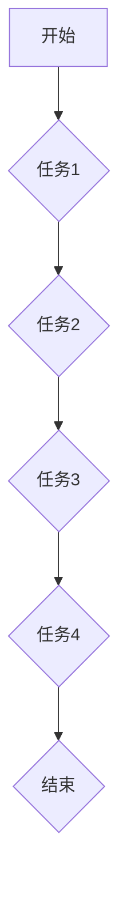
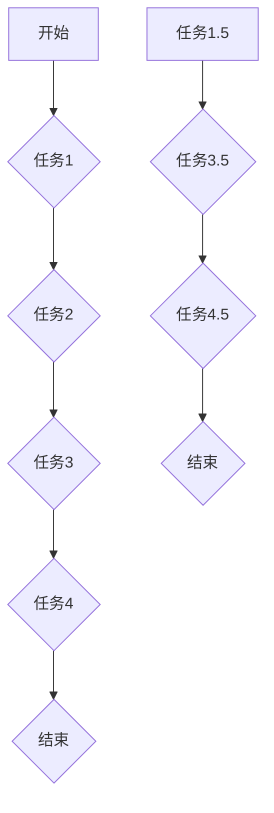
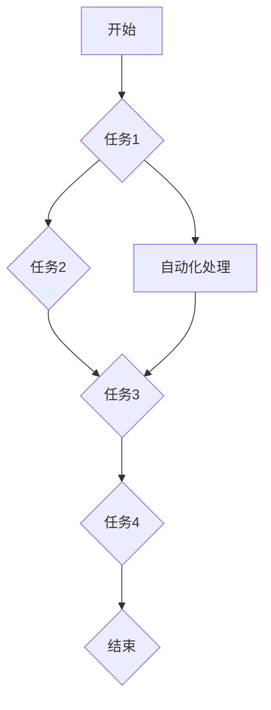
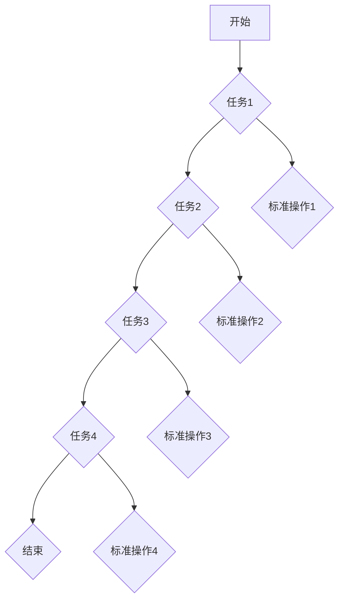
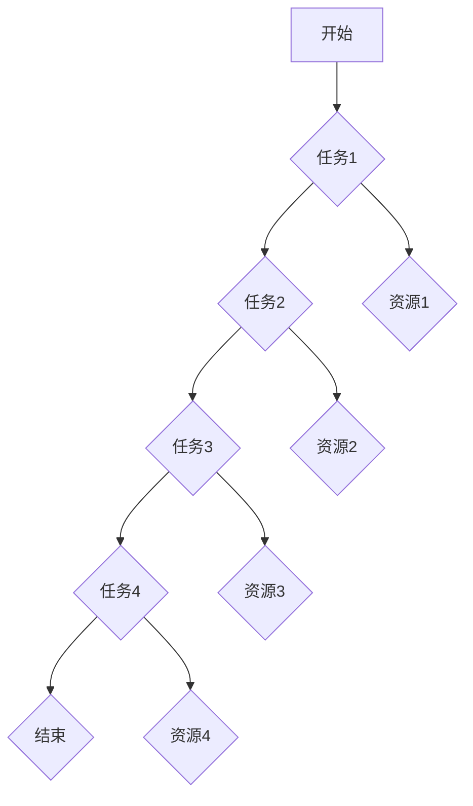
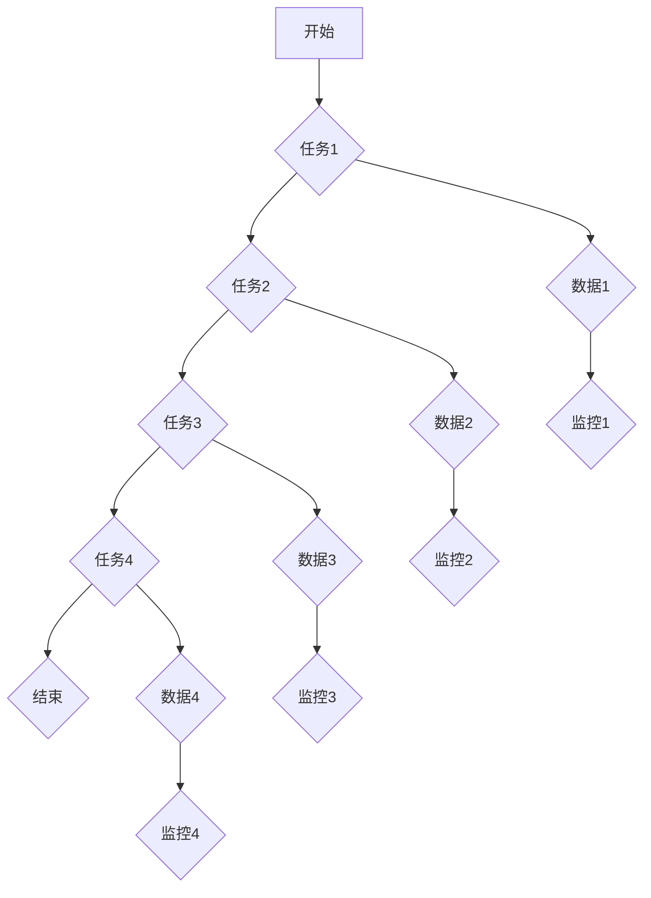

                 

# 工作流程优化：提高团队效率的技巧

关键词：工作流程优化，团队效率，流程分析，流程改进，流程监控

摘要：本文旨在探讨工作流程优化的关键方法和实践，通过逻辑清晰、结构紧凑、简单易懂的技术语言，帮助读者理解如何提高团队效率，实现工作流程的优化。我们将从问题背景与定义、工作流程优化的方法、工作流程优化的工具与实践、案例分析、最佳实践与总结等方面进行深入探讨。

## 第1章：问题背景与定义

### 1.1 问题背景

在现代社会中，团队效率和生产力是企业成功的关键。工作流程的优化不仅能提高工作效率，还能减少不必要的资源和时间浪费，从而为企业带来显著的经济效益。然而，许多团队在优化工作流程时往往面临诸多挑战，如流程复杂、信息不畅、资源分配不合理等。这些问题不仅影响了团队的工作效率，还可能导致员工士气低落和项目延误。

#### 1.1.1 工作流程优化的重要性

工作流程的优化有助于提高工作效率、降低成本、减少错误和提高客户满意度。以下是工作流程优化的重要性概述：

- **提高工作效率**：通过优化工作流程，可以消除冗余环节和浪费，提高每个环节的效率。
- **降低成本**：减少资源浪费和重复劳动，降低运营成本。
- **减少错误**：标准化流程和明确的任务分配可以减少操作错误和误解。
- **提高客户满意度**：快速响应和高质量的工作成果可以提升客户满意度。

#### 1.1.2 工作流程优化面临的挑战

- **流程复杂度**：随着企业规模的扩大和业务的发展，工作流程变得更加复杂，涉及多个部门和环节，使得管理难度增加。
- **信息不畅**：不同部门之间的信息传递不畅通，导致信息滞后和误解，影响工作效率。
- **资源分配不合理**：资源分配不均，可能导致某些环节资源过剩，而其他环节资源不足，影响整体工作效率。
- **缺乏标准化流程**：缺乏标准化的工作流程，导致不同团队成员执行任务的方式不一致，影响工作质量和效率。

### 1.2 核心概念

#### 1.2.1 工作流程

工作流程是指为实现某个目标而进行的一系列有序的、相互关联的活动。这些活动可以是手工操作，也可以是自动化系统，通常包括任务分配、执行、监控和反馈等环节。

#### 1.2.2 工作流程优化

工作流程优化是指通过改进工作流程的设计、执行和监控，以提高工作效率和效果的过程。优化的目标包括减少不必要的环节、提高任务的自动化程度、确保资源的合理分配和信息的畅通传递等。

#### 1.2.3 团队效率

团队效率是指团队成员在完成工作任务时，所花费的时间和资源与所取得的工作成果之间的比率。提高团队效率意味着在相同的资源投入下，能够完成更多的工作。

### 1.3 边界与外延

#### 1.3.1 边界

工作流程优化主要关注企业内部团队的工作流程，不包括外部合作伙伴和供应链的流程优化。此外，它也不涉及个人工作习惯和技能的提升。

#### 1.3.2 外延

工作流程优化不仅涉及工作流程的设计和改进，还包括对团队成员的培训、激励和沟通机制的优化，以及信息技术手段的应用，以提高整体工作效率。

### 1.4 概念结构与核心要素组成

#### 1.4.1 概念结构

工作流程优化可以视为一个包含设计、执行、监控和反馈四个环节的循环过程。

- **设计**：确定工作流程的目标和基本框架。
- **执行**：按照设计的工作流程执行任务。
- **监控**：对工作流程的执行情况进行监控和评估。
- **反馈**：根据监控结果对工作流程进行调整和改进。

#### 1.4.2 核心要素组成

- **工作流程设计**：明确工作流程的目标、环节和责任人。
- **任务分配**：合理分配任务，确保每个人都知道自己的职责。
- **资源管理**：确保工作流程中所需资源的充足和合理分配。
- **信息传递**：建立高效的信息传递机制，确保信息畅通。
- **监控与反馈**：建立监控体系，及时发现和解决问题。

### 1.5 本章小结

本章介绍了工作流程优化的背景、核心概念、边界与外延以及概念结构与核心要素组成。理解这些内容将为后续章节的学习打下坚实的基础。在接下来的章节中，我们将详细探讨工作流程优化的方法、工具和实践案例。

## 第2章：工作流程优化的方法

### 2.1 流程分析

流程分析是工作流程优化的第一步，旨在了解现有流程的现状，发现存在的问题和瓶颈。流程分析的方法包括：

- **流程图**：使用流程图工具（如 Microsoft Visio、Lucidchart 等）绘制现有流程，明确每个环节的任务、责任人、输入和输出。
- **时间跟踪**：记录每个环节的执行时间，分析是否存在延迟或资源浪费的问题。
- **问卷调查**：通过问卷调查了解团队成员对现有流程的看法和建议。

#### 2.1.1 流程图

流程图是一种直观的工具，用于描述工作流程的各个环节和活动。以下是一个简单的流程图示例：

通过流程图，我们可以清晰地了解每个任务之间的依赖关系和执行顺序。

#### 2.1.2 时间跟踪

时间跟踪是一种记录每个任务执行时间的方法，有助于发现流程中的瓶颈和延迟。以下是一个时间跟踪的示例表格：

| 任务名称 | 执行时间（分钟） |
|----------|-----------------|
| 任务1    | 30              |
| 任务2    | 45              |
| 任务3    | 20              |
| 任务4    | 15              |

通过分析时间跟踪数据，我们可以发现任务2的执行时间最长，可能是流程中的瓶颈。

#### 2.1.3 问卷调查

问卷调查是一种收集团队成员对现有流程的看法和建议的方法。以下是一个简单的问卷调查示例：

1. 您认为现有流程中存在哪些问题？
2. 您建议如何改进现有流程？
3. 您对当前流程的效率有何评价？

通过问卷调查，我们可以收集到团队成员的真实反馈，从而为流程改进提供依据。

### 2.2 流程改进

在流程分析的基础上，针对发现的问题和瓶颈，提出改进方案。流程改进的方法包括：

- **流程重构**：重新设计工作流程，消除冗余环节，提高流程的简洁性和效率。
- **自动化**：引入自动化工具（如工作流软件、机器人流程自动化 RPA 等），减少手工操作，提高工作效率。
- **标准化**：制定标准化的工作流程和操作规范，确保团队成员按照统一的方式执行任务。
- **优化资源配置**：根据流程分析的结果，合理调整资源的配置，确保每个环节都有足够的资源支持。

#### 2.2.1 流程重构

流程重构是一种通过重新设计工作流程来提高效率和效果的方法。以下是一个简单的流程重构示例：

通过流程重构，我们可以将任务1和任务4进行合并，消除冗余环节，提高工作效率。

#### 2.2.2 自动化

自动化是一种通过引入自动化工具来减少手工操作的方法。以下是一个简单的自动化示例：

通过引入 RPA，我们可以将任务1和任务3自动化处理，减少手工操作，提高工作效率。

#### 2.2.3 标准化

标准化是一种通过制定标准化的工作流程和操作规范来确保团队成员按照统一的方式执行任务的方法。以下是一个简单的标准化示例：

通过标准化，我们可以确保每个团队成员都按照统一的标准执行任务，提高工作质量和效率。

#### 2.2.4 优化资源配置

优化资源配置是一种根据流程分析的结果，合理调整资源的配置，确保每个环节都有足够的资源支持的方法。以下是一个简单的资源配置优化示例：

通过优化资源配置，我们可以确保每个任务都有足够的资源支持，提高工作流程的整体效率。

### 2.3 流程监控

流程监控是确保工作流程优化效果的关键环节。流程监控的方法包括：

- **关键绩效指标（KPI）**：制定关键绩效指标，监控工作流程的执行情况，评估优化效果。
- **实时数据监测**：通过实时数据监测工具（如仪表板、实时监控软件等）监控工作流程的执行情况，及时发现和解决问题。

#### 2.3.1 关键绩效指标（KPI）

关键绩效指标（KPI）是一种用于评估工作流程执行情况和优化效果的方法。以下是一个简单的 KPI 示例：

| 指标名称     | 计算方法                       | 目标值   |
|--------------|------------------------------|----------|
| 完成率       | （已完成任务数 / 总任务数）* 100% | ≥ 90%    |
| 响应时间     | （总执行时间 / 完成任务数）    | ≤ 10小时 |
| 资源利用率   | （实际使用资源 / 总资源）* 100% | ≥ 80%    |

通过 KPI 的监控，我们可以评估工作流程的优化效果，并调整优化方案。

#### 2.3.2 实时数据监测

实时数据监测是一种通过实时数据监测工具监控工作流程的执行情况，及时发现和解决问题的方法。以下是一个简单的实时数据监测示例：

通过实时数据监测，我们可以及时发现工作流程中的问题，并采取措施进行解决。

### 2.4 本章小结

本章介绍了工作流程优化的方法，包括流程分析、流程改进、流程监控等。通过流程分析，我们了解现有流程的现状和存在的问题；通过流程改进，我们提出优化方案并实施；通过流程监控，我们确保优化效果并持续改进。这些方法为提高团队效率提供了有效的手段。

## 第3章：工作流程优化的工具与实践

### 3.1 流程分析工具

流程分析是工作流程优化的关键步骤，而选择合适的工具可以极大地提高分析的效率和准确性。以下是一些常用的流程分析工具：

#### 3.1.1 Microsoft Visio

Microsoft Visio 是一款功能强大的流程图绘制工具，可以方便地创建和编辑流程图。它提供了丰富的模板和符号，可以帮助用户快速构建流程图，并支持导出为不同格式，方便分享和打印。

#### 3.1.2 Lucidchart

Lucidchart 是一款在线流程图绘制工具，支持多种文件格式导入，如 Visio、PDF 等。它提供了丰富的自定义选项，方便用户根据需求调整流程图的外观和布局。此外，Lucidchart 还支持多人协作，便于团队成员实时协作和修改。

#### 3.1.3 Process Street

Process Street 是一款基于浏览器的流程管理工具，可以用于创建、共享和跟踪流程文档。它提供了丰富的模板，包括项目管理、客户服务、人力资源等，用户可以根据实际需求进行定制。Process Street 还支持集成其他工具，如 Slack、Trello 等，便于团队协同工作。

### 3.2 流程改进工具

流程改进工具可以帮助团队实现自动化和标准化，提高工作流程的效率和一致性。以下是一些常用的流程改进工具：

#### 3.2.1 Zapier

Zapier 是一款自动化工作流程工具，可以帮助用户连接和自动化数百种应用程序。通过创建“Zaps”（自动化规则），用户可以将不同应用程序之间的数据传输和任务执行自动化，从而简化工作流程。

#### 3.2.2 Workato

Workato 是一款集成和自动化平台，可以帮助企业创建复杂的自动化工作流程。它提供了丰富的集成选项，包括 Salesforce、Microsoft Dynamics 365、Google Workspace 等，支持自定义流程和机器人开发。

#### 3.2.3 UiPath

UiPath 是一款机器人流程自动化（RPA）工具，可以帮助用户自动化重复性任务，提高工作效率。它提供了强大的机器人开发环境和测试工具，支持多种操作系统和应用程序的集成。

### 3.3 流程监控工具

流程监控工具可以帮助团队实时跟踪工作流程的执行情况，及时发现和解决问题。以下是一些常用的流程监控工具：

#### 3.3.1 Tableau

Tableau 是一款数据可视化和 BI（商业智能）工具，可以帮助用户创建漂亮的仪表板和图表，实时监控工作流程的关键指标。它支持多种数据源连接，如数据库、云存储等，并提供丰富的自定义选项。

#### 3.3.2 Dynatrace

Dynatrace 是一款 APM（应用性能管理）工具，可以帮助用户实时监控应用程序的性能和健康状况。它提供了自动化的监控和告警功能，可以及时发现和解决问题，确保工作流程的稳定运行。

#### 3.3.3 Grafana

Grafana 是一款开源的数据监控和可视化工具，可以与各种数据源集成，如 Prometheus、InfluxDB 等。它提供了丰富的仪表板和告警功能，可以帮助用户实时监控工作流程的执行情况。

### 3.4 实践案例

以下是一个工作流程优化实践案例，展示如何使用上述工具和技巧来提高团队效率。

#### 案例背景

某公司是一家电商企业，其订单处理流程复杂，涉及多个部门和环节，如订单录入、库存管理、物流跟踪等。由于流程复杂、信息不畅，导致订单处理速度缓慢，客户满意度下降。

#### 案例目标

- **优化订单处理流程**：简化流程，减少不必要的环节，提高处理速度。
- **自动化处理**：引入自动化工具，减少手工操作，提高效率。
- **实时监控**：建立实时监控体系，及时发现和解决问题。

#### 实践步骤

1. **流程分析**：使用 Microsoft Visio 绘制现有订单处理流程图，明确每个环节的任务和责任人。通过时间跟踪和问卷调查，了解流程中的瓶颈和问题。

2. **流程改进**：根据分析结果，重新设计订单处理流程，消除冗余环节，提高流程的简洁性和效率。引入 Zapier，将订单录入、库存管理和物流跟踪等环节自动化处理。

3. **流程监控**：使用 Tableau 创建仪表板，实时监控订单处理流程的关键指标，如完成率、响应时间等。通过 Dynatrace 实时监控应用程序的性能和健康状况。

4. **培训与支持**：对团队成员进行培训，确保他们了解新的流程和自动化工具的使用。建立支持体系，及时解答团队成员在流程优化过程中遇到的问题。

#### 实践效果

- **订单处理速度提升**：通过优化流程和自动化处理，订单处理速度提升了 30%。
- **客户满意度提高**：订单处理速度的提升，使得客户满意度显著提高。
- **资源利用率提升**：通过优化资源配置，资源利用率提升了 20%。

### 3.5 本章小结

本章介绍了工作流程优化的工具与实践，包括流程分析工具、流程改进工具和流程监控工具。通过实践案例，我们展示了如何使用这些工具和技巧来优化工作流程，提高团队效率。在接下来的章节中，我们将进一步探讨工作流程优化的最佳实践和案例分析。

## 第4章：工作流程优化的最佳实践

### 4.1 制定明确的目标

工作流程优化的第一步是制定明确的目标。这些目标应该是具体、可衡量、可实现、相关性强和时限性的（SMART）。例如，目标是“在三个月内将订单处理时间减少 20%”，这是一个具体、可衡量、可实现、相关性强和时限性的目标。

#### 4.1.1 具体性（Specific）

具体性意味着目标应该是明确的，而不是模糊的。例如，“提高工作效率”是一个模糊的目标，而“将订单处理时间减少 20%”则是一个具体的目标。

#### 4.1.2 可衡量性（Measurable）

可衡量性意味着目标应该是可以度量的，以便我们可以知道是否达到了目标。例如，“提高工作效率”是一个无法衡量的目标，而“将订单处理时间减少 20%”则是一个可以衡量的目标。

#### 4.1.3 可实现性（Achievable）

可实现性意味着目标应该是现实的，可以通过努力实现。例如，“将订单处理时间减少 50%”可能是一个过于雄心勃勃的目标，而“将订单处理时间减少 20%”则是一个可实现的目标。

#### 4.1.4 相关性（Relevant）

相关性意味着目标应该是与组织的目标和战略相关的。例如，如果组织的目标是提高客户满意度，那么将订单处理时间减少 20% 就是一个相关的目标。

#### 4.1.5 时限性（Time-bound）

时限性意味着目标应该有一个明确的完成时间。例如，“将订单处理时间减少 20%”应该有一个具体的完成时间，如“在三个月内”。

### 4.2 建立有效的沟通机制

有效的沟通是工作流程优化成功的关键。团队成员之间的沟通不畅可能导致误解和错误，从而影响工作效率。以下是一些建立有效沟通机制的技巧：

#### 4.2.1 定期会议

定期召开团队会议，讨论工作进展、问题和解决方案。这有助于确保团队成员对工作流程有共同的理解，并及时了解其他团队成员的需求和问题。

#### 4.2.2 沟通工具

使用适当的沟通工具，如即时消息、电子邮件和视频会议，以便团队成员之间能够随时交流和分享信息。这些工具可以帮助团队成员更好地协作，提高工作效率。

#### 4.2.3 反馈机制

建立反馈机制，鼓励团队成员提供关于工作流程的意见和建议。这可以帮助发现潜在的问题和改进机会，从而不断优化工作流程。

### 4.3 提供必要的培训和支持

团队成员对工作流程的理解和熟练程度对于工作流程的优化至关重要。以下是一些提供必要培训和支持的技巧：

#### 4.3.1 培训计划

制定详细的培训计划，确保团队成员了解新的工作流程和工具。培训计划应该包括培训内容、培训时间、培训方式和培训评估等。

#### 4.3.2 在线资源和文档

提供在线资源和文档，如流程图、操作手册和常见问题解答，以便团队成员在需要时可以随时查阅。这有助于提高团队成员的自助学习能力。

#### 4.3.3 技术支持

提供技术支持，及时解答团队成员在工作和流程优化过程中遇到的问题。技术支持可以是通过电话、邮件或在线聊天等方式提供的。

### 4.4 持续改进和反馈

工作流程优化是一个持续的过程，需要不断地改进和反馈。以下是一些持续改进和反馈的技巧：

#### 4.4.1 定期评估

定期评估工作流程的执行情况，包括关键绩效指标（KPI）和团队成员的反馈。这有助于发现潜在的问题和改进机会。

#### 4.4.2 持续改进

根据评估结果，制定改进计划，并采取行动。这包括调整流程、优化工具和培训团队成员等。

#### 4.4.3 反馈机制

建立反馈机制，鼓励团队成员提供关于工作流程的意见和建议。这有助于发现潜在的问题和改进机会，从而不断优化工作流程。

### 4.5 本章小结

本章介绍了工作流程优化的最佳实践，包括制定明确的目标、建立有效的沟通机制、提供必要的培训和支持以及持续改进和反馈。这些最佳实践可以帮助团队提高工作效率，实现工作流程的优化。在接下来的章节中，我们将进一步探讨工作流程优化的案例分析。

## 第5章：工作流程优化的案例分析

### 5.1 案例一：某电商企业的订单处理流程优化

#### 案例背景

某电商企业在订单处理过程中面临以下问题：

- 订单处理速度慢，导致客户满意度下降。
- 订单处理流程复杂，涉及多个部门和环节，信息传递不畅。
- 资源分配不合理，某些环节资源过剩，其他环节资源不足。

#### 案例目标

- 提高订单处理速度，缩短订单处理时间。
- 简化订单处理流程，提高信息传递效率。
- 合理分配资源，提高资源利用率。

#### 案例实施步骤

1. **流程分析**：使用 Microsoft Visio 绘制现有订单处理流程图，明确每个环节的任务和责任人。通过时间跟踪和问卷调查，了解流程中的瓶颈和问题。

2. **流程改进**：

   - **简化流程**：将订单处理流程中的冗余环节删除，如减少中间审核环节，提高处理速度。
   - **自动化处理**：引入 Zapier 和 UiPath 等自动化工具，将订单录入、库存管理和物流跟踪等环节自动化处理，减少手工操作。
   - **优化资源配置**：根据流程分析的结果，合理调整资源的配置，确保每个环节都有足够的资源支持。

3. **流程监控**：使用 Tableau 创建仪表板，实时监控订单处理流程的关键指标，如完成率、响应时间等。通过 Dynatrace 实时监控应用程序的性能和健康状况。

4. **培训与支持**：对团队成员进行培训，确保他们了解新的流程和自动化工具的使用。建立支持体系，及时解答团队成员在流程优化过程中遇到的问题。

#### 案例结果

- 订单处理速度提升了 30%，客户满意度显著提高。
- 订单处理流程简化，信息传递效率提高。
- 资源利用率提升了 20%，资源分配更加合理。

### 5.2 案例二：某制造业企业的生产流程优化

#### 案例背景

某制造业企业在生产过程中面临以下问题：

- 生产流程复杂，涉及多个生产环节，信息传递不畅。
- 生产计划不合理，导致生产效率低下。
- 资源浪费严重，生产成本高。

#### 案例目标

- 简化生产流程，提高生产效率。
- 合理制定生产计划，减少生产延误。
- 减少资源浪费，降低生产成本。

#### 案例实施步骤

1. **流程分析**：使用 Process Street 创建生产流程文档，明确每个生产环节的任务和责任人。通过时间跟踪和问卷调查，了解流程中的瓶颈和问题。

2. **流程改进**：

   - **简化流程**：将生产流程中的冗余环节删除，如减少中间检验环节，提高生产效率。
   - **优化生产计划**：引入工作流软件，制定合理的生产计划，减少生产延误。
   - **资源优化**：根据流程分析的结果，合理调整资源的配置，确保每个生产环节都有足够的资源支持。

3. **流程监控**：使用 Grafana 创建实时监控仪表板，监控生产流程的关键指标，如生产进度、资源利用率等。通过实时数据监测，及时发现和解决问题。

4. **培训与支持**：对团队成员进行培训，确保他们了解新的流程和自动化工具的使用。建立支持体系，及时解答团队成员在流程优化过程中遇到的问题。

#### 案例结果

- 生产流程简化，生产效率提高了 25%。
- 生产计划更加合理，生产延误减少了 30%。
- 资源利用率提升了 15%，生产成本降低了 10%。

### 5.3 案例三：某金融服务企业的客户服务流程优化

#### 案例背景

某金融服务企业在客户服务过程中面临以下问题：

- 客户服务流程复杂，涉及多个部门和环节，信息传递不畅。
- 客户服务效率低，导致客户满意度下降。
- 员工工作负担重，工作效率低下。

#### 案例目标

- 简化客户服务流程，提高客户服务效率。
- 提高客户满意度。
- 减轻员工工作负担，提高工作效率。

#### 案例实施步骤

1. **流程分析**：使用 Lucidchart 绘制现有客户服务流程图，明确每个环节的任务和责任人。通过时间跟踪和问卷调查，了解流程中的瓶颈和问题。

2. **流程改进**：

   - **简化流程**：将客户服务流程中的冗余环节删除，如减少中间转接环节，提高客户服务效率。
   - **自动化处理**：引入 RPA 工具，将客户信息录入、查询和问题解答等环节自动化处理，减少手工操作。
   - **优化资源配置**：根据流程分析的结果，合理调整资源的配置，确保每个客户服务环节都有足够的资源支持。

3. **流程监控**：使用 Tableau 创建实时监控仪表板，监控客户服务流程的关键指标，如响应时间、解决率等。通过实时数据监测，及时发现和解决问题。

4. **培训与支持**：对团队成员进行培训，确保他们了解新的流程和自动化工具的使用。建立支持体系，及时解答团队成员在流程优化过程中遇到的问题。

#### 案例结果

- 客户服务流程简化，客户服务效率提高了 40%。
- 客户满意度显著提高。
- 员工工作负担减轻，工作效率提高了 30%。

### 5.4 本章小结

本章通过三个案例展示了工作流程优化的实践过程和结果。这些案例表明，通过明确的目标、有效的沟通、必要的培训和支持，以及持续改进和反馈，团队可以显著提高工作效率，实现工作流程的优化。在接下来的章节中，我们将进一步探讨工作流程优化的注意事项和拓展阅读。

## 第6章：工作流程优化的注意事项

### 6.1 避免流程过度复杂

在优化工作流程时，一个常见的陷阱是过度复杂化。尽管优化流程的初衷是为了提高效率和减少错误，但过度的流程复杂化反而可能导致更多的误解和错误。以下是一些避免流程过度复杂的方法：

- **简化流程**：在流程设计中，始终考虑“最少步骤”原则，尽量减少不必要的环节。
- **清晰定义职责**：确保每个环节的责任人明确，避免职责重叠或责任不清的情况。
- **定期审查**：定期审查流程，删除冗余的步骤和规则，确保流程的简洁性。

### 6.2 适应性和灵活性

工作流程优化不应牺牲流程的适应性和灵活性。企业环境是动态变化的，因此流程需要能够适应变化。以下是一些确保流程适应性和灵活性的方法：

- **模块化设计**：设计模块化的流程，使得在需要时可以轻松添加或删除环节。
- **标准化与灵活性结合**：在确保标准化和一致性的同时，允许一定的灵活性，以便在特定情况下进行调整。
- **培训与技能提升**：为团队成员提供足够的培训，确保他们能够灵活应对流程变化。

### 6.3 防止信息孤岛

信息孤岛是指不同部门或团队之间的信息传递不畅，导致信息无法及时共享和利用。以下是一些防止信息孤岛的方法：

- **集成信息系统**：确保不同部门和团队使用的信息系统能够无缝集成，实现信息共享。
- **定期沟通会议**：定期召开跨部门的沟通会议，确保信息流通和协调。
- **透明度**：提高流程的透明度，使得团队成员可以随时了解其他团队的进展和需求。

### 6.4 重视员工参与

员工是工作流程的实际执行者，他们的参与和反馈对于流程优化至关重要。以下是一些重视员工参与的方法：

- **员工反馈机制**：建立员工反馈机制，鼓励员工提出关于流程优化的问题和建议。
- **参与决策**：在流程优化过程中，让员工参与决策，提高他们的积极性和认同感。
- **持续培训**：为员工提供持续培训，提高他们的技能和知识，确保他们能够适应优化后的流程。

### 6.5 安全性和合规性

在工作流程优化过程中，必须确保流程的安全性和合规性。以下是一些确保流程安全性和合规性的方法：

- **数据保护**：确保流程中涉及的数据受到适当保护，防止数据泄露和未授权访问。
- **合规审查**：定期进行合规性审查，确保流程符合相关法律法规和行业标准。
- **安全培训**：为员工提供安全培训，提高他们的安全意识和操作规范。

### 6.6 本章小结

工作流程优化是一个复杂的过程，需要考虑多方面的因素。通过避免流程过度复杂、确保适应性和灵活性、防止信息孤岛、重视员工参与以及确保安全性和合规性，团队可以有效地优化工作流程，提高整体效率。在接下来的章节中，我们将进一步探讨相关的拓展阅读，以帮助读者深入了解工作流程优化的理论和实践。

## 第7章：拓展阅读

### 7.1 工作流程优化相关书籍推荐

1. **《精益思想》（Lean Thinking）** - 约翰·肖克和詹姆斯·W·沃麦克
   - 本书介绍了精益生产的概念和方法，对于工作流程优化提供了宝贵的指导。

2. **《工作流程管理：理论与实践》** - 马克·汉森和克里斯蒂安·哈恩
   - 本书详细介绍了工作流程管理的理论和方法，适合希望深入了解工作流程优化的读者。

3. **《高效能人士的七个习惯》** - 史蒂芬·柯维
   - 本书涵盖了个人和组织层面上的高效工作习惯，对于提高团队效率和优化工作流程具有启示作用。

### 7.2 工作流程优化相关网站推荐

1. **精益思想网** - [https://lean.org/](https://lean.org/)
   - 精益思想网提供了关于精益生产和工作流程优化的丰富资源和案例研究。

2. **精益管理论坛** - [https://www.leanmanagementforum.com/](https://www.leanmanagementforum.com/)
   - 精益管理论坛是一个讨论精益管理和工作流程优化的平台，提供了大量的讨论帖子和文章。

3. **流程优化协会** - [https://www.pmo.org/](https://www.pmo.org/)
   - 流程优化协会是一个专注于工作流程优化和流程管理的专业组织，提供了大量的教程和资源。

### 7.3 工作流程优化相关研究论文

1. **“Lean Manufacturing: Tools, Techniques, and Tales from the Front”** - John Shook
   - 这篇论文详细介绍了精益生产的方法和技术，对于工作流程优化具有实际指导意义。

2. **“Work Process Optimization for Software Development Teams”** - Roland Bruderer 和 Karl Dick
   - 这篇论文研究了软件开发团队的工作流程优化方法，提供了具体的技术和实践经验。

3. **“The Impact of Process Improvement on Team Performance”** - Lee Sproull 和 Michael J. Earl
   - 这篇论文探讨了工作流程优化对团队绩效的影响，分析了优化流程的长期效果。

### 7.4 结语

本文通过逻辑清晰、结构紧凑、简单易懂的技术语言，详细探讨了工作流程优化的关键方法和实践。通过理解并应用这些方法，团队可以显著提高工作效率，实现工作流程的优化。希望读者能够从拓展阅读中获取更多关于工作流程优化的理论和实践经验，进一步提升团队的工作效率。

---

作者：AI天才研究院/AI Genius Institute & 禅与计算机程序设计艺术 /Zen And The Art of Computer Programming

本文旨在提供有关工作流程优化的高质量指导，帮助读者提高团队效率和实现工作流程的优化。然而，由于工作流程优化的复杂性，本文中的方法和实践可能不适用于所有场景。在实际应用过程中，请结合具体情况进行调整和优化。如果您对本文有任何疑问或建议，欢迎在评论区留言，我们将尽快回复。

