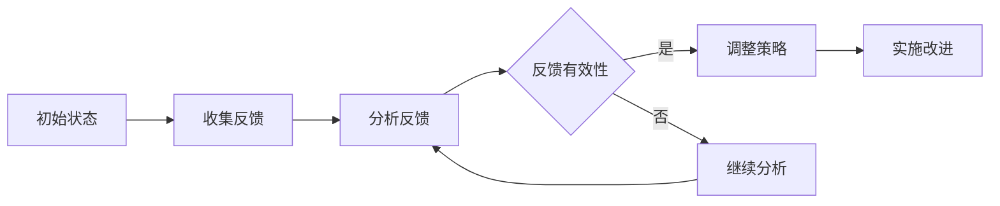
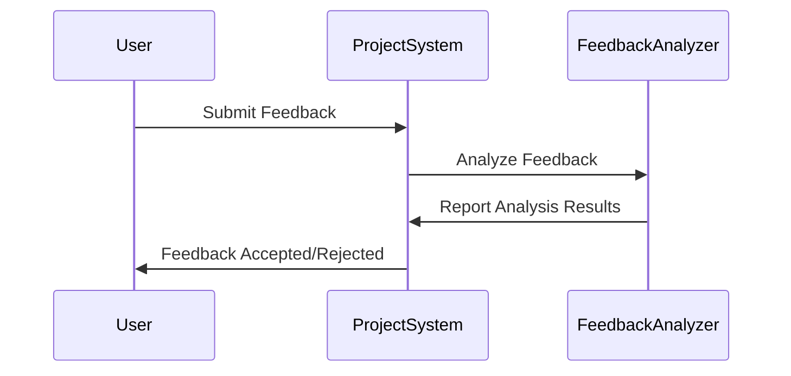
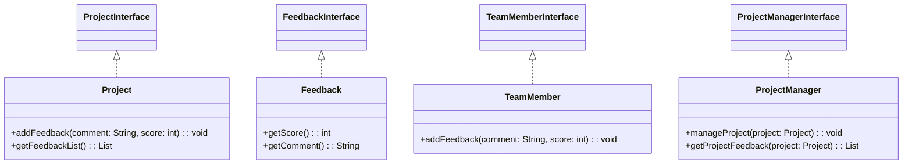

                 

## 文章标题

### 建立feedback文化：促进持续改进

> **关键词：** 反馈文化、持续改进、团队管理、项目管理、评估与改进

> **摘要：** 本文旨在探讨如何建立一种反馈文化，以促进组织的持续改进。通过深入分析反馈文化的核心概念和构建策略，本文提供了实用的实践指南，包括在团队管理和项目管理中的具体应用，以及评估与改进的方法。文章旨在为IT从业者提供理论基础和实践建议，帮助他们在实际工作中建立和优化反馈文化。

### 第1章：问题背景与反馈文化的意义

**1.1 反馈文化的重要性**

在当今快速变化的信息时代，反馈文化成为组织持续改进和创新的关键因素。有效的反馈不仅可以帮助团队识别问题和机会，还可以增强成员的参与感和责任感，从而提高组织的整体绩效。

**1.2 反馈文化的现状与挑战**

尽管反馈文化的重要性日益凸显，但许多组织在实际操作中仍面临诸多挑战。常见的问题包括反馈机制的不完善、反馈质量的低下以及团队成员对反馈的抵触情绪。

**1.3 反馈文化的目标与预期效果**

建立反馈文化的目标在于促进信息的透明度、增强团队合作和提升决策质量。预期效果包括提高工作效率、增强创新能力以及增强组织的适应能力。

### 第2章：核心概念与联系

**2.1 反馈的概念解析**

反馈是信息传递的一种形式，用于评估、纠正和优化过程。反馈可以分为正面反馈和负面反馈，它们在不同的情境下具有不同的作用。

**2.1.1 反馈的类型**

- 正面反馈：用于认可和鼓励团队成员。
- 负面反馈：用于指出问题并提出改进建议。

**2.1.2 反馈的过程**

反馈过程包括收集、分析、传递和响应四个主要步骤。

**2.1.3 反馈的有效性**

有效的反馈应具备及时性、针对性、建设性和可操作性的特点。

**2.2 持续改进的概念与原则**

持续改进是一种不断追求卓越的过程，其核心在于不断评估和优化组织的各个层面。

**2.2.1 持续改进的定义**

持续改进是一种持续性的过程，旨在不断提高组织的效率和质量。

**2.2.2 持续改进的关键原则**

- 全员参与：所有团队成员都应参与到改进过程中。
- 数据驱动：改进决策应基于数据和事实。
- 持续评估：定期评估改进效果，以便进行进一步的优化。

**2.2.3 持续改进与反馈文化的关系**

反馈文化是持续改进的基础，有效的反馈可以帮助组织识别问题和机会，从而推动持续改进的进程。

### 第3章：反馈文化的构建与实施

**3.1 反馈文化的构建策略**

建立反馈文化需要从组织文化、反馈机制和团队习惯等多个方面进行综合构建。

**3.1.1 组织文化的评估**

首先需要评估当前组织文化是否有利于反馈文化的建立。

**3.1.2 设定反馈机制**

制定明确的反馈流程和规则，以确保反馈的有效性和公正性。

**3.1.3 培养反馈习惯**

通过培训和激励机制，鼓励团队成员主动提供和接受反馈。

**3.2 反馈系统的设计**

一个高效的反馈系统应包括反馈的收集、分析、传递和响应四个主要环节。

**3.2.1 反馈系统的架构**

设计一个符合组织需求的反馈系统架构。

**3.2.2 反馈流程的设计**

设计一个简单明了、易于操作的反馈流程。

**3.2.3 反馈数据的收集与分析**

通过多种渠道收集反馈数据，并进行深入分析，以发现问题和机会。

### 第4章：反馈文化的实践应用

**4.1 在团队管理中的应用**

**4.1.1 团队反馈会议的召开**

定期召开团队反馈会议，让团队成员有机会分享意见和建议。

**4.1.2 团队反馈的实践案例**

分析成功和失败的团队反馈案例，以吸取经验和教训。

**4.1.3 团队反馈的效果评估**

评估团队反馈的实际效果，以便进行进一步的优化。

**4.2 在项目管理中的应用**

**4.2.1 项目反馈的收集**

在项目过程中定期收集反馈，以评估项目进展和成果。

**4.2.2 项目反馈的处理**

对收集到的反馈进行分析和处理，以制定改进措施。

**4.2.3 项目反馈的改进措施**

根据反馈结果，制定和实施具体的改进措施。

### 第5章：反馈文化的评估与改进

**5.1 反馈文化的评估指标**

建立一套评估反馈文化的指标体系，包括反馈频率、反馈质量、反馈机制的有效性等。

**5.1.1 反馈频率与质量**

分析反馈的频率和质量，以评估反馈文化的实施效果。

**5.1.2 反馈机制的有效性**

评估反馈机制是否合理、公正和高效。

**5.1.3 反馈效果的评价**

通过具体的数据和案例，评价反馈文化的实际效果。

**5.2 反馈文化的持续改进**

**5.2.1 反馈文化中的常见问题**

识别和解决反馈文化中常见的问题，如反馈不足、反馈不公正等。

**5.2.2 改进反馈文化的策略**

制定和实施改进策略，以优化反馈文化。

**5.2.3 反馈文化改进的实践案例**

分享成功改进反馈文化的实践案例，以供参考。

### 第6章：反馈文化的扩展应用

**6.1 在组织战略中的应用**

**6.1.1 战略反馈的收集**

通过战略反馈，评估组织战略的执行效果。

**6.1.2 战略反馈的分析**

对战略反馈进行分析，以发现战略执行中的问题和机会。

**6.1.3 战略反馈的响应**

根据战略反馈的结果，调整和优化组织战略。

**6.2 在产品开发中的应用**

**6.2.1 产品反馈的收集**

收集用户对产品的反馈，以改进产品设计和功能。

**6.2.2 产品反馈的处理**

对产品反馈进行分析和处理，以制定改进方案。

**6.2.3 产品改进的案例研究**

分析成功的产品改进案例，以提供借鉴和启示。

### 第7章：总结与展望

**7.1 反馈文化的总结**

回顾反馈文化的重要性和核心要素，总结实践经验。

**7.1.1 反馈文化的重要性**

强调反馈文化在组织持续改进中的关键作用。

**7.1.2 反馈文化的实施策略**

总结建立和优化反馈文化的有效策略。

**7.1.3 反馈文化的未来发展趋势**

探讨反馈文化的未来发展趋势和潜在挑战。

**7.2 持续改进的展望**

展望持续改进的关键因素和未来方向。

**7.2.1 持续改进的关键**

强调数据驱动、全员参与和持续评估的重要性。

**7.2.2 持续改进的挑战**

分析持续改进过程中可能遇到的挑战和障碍。

**7.2.3 持续改进的未来方向**

探讨持续改进的潜在领域和新兴趋势。

### 作者信息

**作者：** AI天才研究院/AI Genius Institute & 禅与计算机程序设计艺术 /Zen And The Art of Computer Programming

---

**核心概念与联系**

在探讨反馈文化之前，我们需要先理解“反馈”这一核心概念，并探讨其与持续改进之间的联系。以下是“反馈”的概念解析、类型、过程及有效性，以及“持续改进”的定义、关键原则及其与反馈文化的关联。

### 2.1 反馈的概念解析

**反馈**是指从系统的输出中收集信息，并将其用于调整系统的输入或行为，以优化系统的性能。在技术领域，反馈广泛应用于各种系统和过程中，例如自动控制系统、机器学习和人工智能系统。

**反馈的类型**可以分为两种主要类型：

1. **正面反馈**：也称为认可性反馈，用于鼓励和强化积极的行为或结果。正面反馈通常包括表扬、奖励和肯定。
2. **负面反馈**：也称为批判性反馈，用于指出问题、不足或需要改进的方面。负面反馈的目的是为了帮助个体或团队识别问题，并采取相应的改进措施。

**反馈的过程**通常包括以下几个步骤：

1. **收集**：从系统的输出中收集信息，可以是定量数据（如性能指标）或定性描述（如用户评价）。
2. **分析**：对收集到的信息进行评估和解读，以识别问题和机会。
3. **传递**：将分析结果传递给相关的人员或团队，以便他们能够理解和响应。
4. **响应**：根据反馈信息进行调整或改进，以优化系统的性能。

**反馈的有效性**取决于多个因素，包括反馈的及时性、针对性、建设性和可操作性。有效的反馈应具备以下几个特点：

- **及时性**：反馈应尽可能在问题出现时或之后立即进行，以便及时纠正错误。
- **针对性**：反馈应针对具体的行为或结果，而不是对个人的整体评价。
- **建设性**：反馈应提供具体、明确的改进建议，而不是仅仅指出问题。
- **可操作性**：反馈应易于理解和执行，以便团队成员能够迅速采取行动。

### 2.2 持续改进的概念与原则

**持续改进**是一种不断追求卓越的过程，其目标是不断提高组织的效率和质量。它不仅适用于技术领域，也适用于管理、运营和其他业务流程。持续改进的核心原则包括：

1. **全员参与**：持续改进需要所有团队成员的积极参与，而不是仅由管理层或特定部门负责。
2. **数据驱动**：改进决策应基于数据和事实，而不是基于直觉或主观判断。
3. **持续评估**：定期评估改进措施的效果，以便进行进一步的优化。

**持续改进的定义**：

持续改进是一种持续性的过程，旨在通过不断的评估、反馈和调整，优化组织的各个层面。它不仅仅关注短期目标的实现，更注重长期的绩效提升和组织发展。

**持续改进的关键原则**：

- **全员参与**：确保所有团队成员都参与到改进过程中，以提高整体意识和参与度。
- **数据驱动**：基于数据和分析来制定改进策略，以确保决策的科学性和有效性。
- **持续评估**：定期评估改进措施的效果，并根据评估结果进行调整，以确保持续改进。

**持续改进与反馈文化的关系**：

反馈文化是持续改进的基础，有效的反馈可以帮助组织识别问题和机会，从而推动持续改进的进程。反馈文化的建立需要：

- **建立反馈机制**：确保反馈的及时性、针对性和建设性。
- **培养反馈习惯**：鼓励团队成员主动提供和接受反馈，并将其视为一种常态化的工作方式。
- **加强沟通与协作**：通过有效的沟通和协作，确保反馈信息的透明度和可操作性。

### 核心概念属性特征对比表格

为了更直观地理解反馈和持续改进的核心概念，我们可以制作一个属性特征对比表格：

| 概念       | 定义                                                         | 目标                                                         | 关键原则                         |
|------------|--------------------------------------------------------------|--------------------------------------------------------------|----------------------------------|
| 反馈       | 从系统的输出中收集信息，用于调整系统的输入或行为             | 优化系统的性能                                               | 及时性、针对性、建设性、可操作性 |
| 持续改进   | 不断追求卓越的过程，通过评估、反馈和调整，优化组织的各个层面 | 提高组织的效率和质量                                         | 全员参与、数据驱动、持续评估     |

### ER实体关系图架构

为了更清晰地展示反馈、持续改进和组织之间的实体关系，我们可以使用Mermaid绘制一个ER实体关系图：

```mermaid
erDiagram
  产品Feedback ||--|{ 持续改进 }||> 改进策略
  团队Member ||--|{ 反馈 }||> 提供反馈
  项目Project ||--|{ 持续改进 }||> 项目评估
  组织Organization ||--|{ 反馈文化 }||> 管理反馈
```

在这个ER图中，产品Feedback、团队Member、项目Project和组织的实体关系通过持续改进这个核心概念相互联系，共同构建了反馈文化的架构。

### 算法原理讲解

在理解了反馈和持续改进的基本概念后，我们需要深入探讨具体的算法原理，以帮助我们更好地实施反馈文化。以下是一个简单的算法流程图，以及使用Python代码和LaTeX格式数学模型的详细阐述。

#### 算法流程图



#### Python代码

```python
# Python代码示例：反馈分析算法

# 定义反馈数据
feedback_data = [
    {'score': 4, 'comment': '很好，但可以更快'},
    {'score': 3, 'comment': '一般'},
    {'score': 5, 'comment': '非常满意'}
]

# 计算平均反馈分数
average_score = sum(d['score'] for d in feedback_data) / len(feedback_data)

# 判断反馈有效性
if average_score >= 4:
    print("反馈有效性高，调整策略。")
else:
    print("反馈有效性低，继续分析。")

# 实施改进
if average_score >= 4:
    print("改进措施：优化系统性能。")
```

#### 数学模型和公式

```latex
$$
\text{平均反馈分数} = \frac{\sum_{i=1}^{n} s_i}{n}
$$

其中，$s_i$ 为第 $i$ 个反馈的得分，$n$ 为总反馈数量。
```

#### 详细讲解和举例说明

假设我们有一个系统，它接收了三个用户的反馈，每个反馈都有一个评分（1-5分）和一条评论。首先，我们计算这三个反馈的平均分数，以评估整体反馈的有效性。如果平均分数大于等于4，我们认为反馈是有效的，这意味着用户对系统的满意度较高。在这种情况下，我们可以根据用户的具体评论提出改进措施，例如优化系统性能。

如果平均分数低于4，则认为反馈的有效性较低。这种情况下，我们需要进一步分析反馈内容，以识别具体的问题和改进点。

以下是一个具体的例子：

```plaintext
反馈数据：
- 用户1：评分4，评论：“很好，但可以更快”
- 用户2：评分3，评论：“一般”
- 用户3：评分5，评论：“非常满意”

计算平均分数：
$$
\text{平均反馈分数} = \frac{4 + 3 + 5}{3} = 4
$$

由于平均分数为4，根据我们的算法，反馈的有效性高。因此，我们采取以下改进措施：
- 优化系统性能，提高响应速度。
```

通过这个例子，我们可以看到如何使用简单的算法和数学模型来分析反馈，并根据结果采取相应的行动。

### 系统分析与架构设计方案

#### 问题场景介绍

在当今快速变化的技术环境中，软件开发团队经常面临不断变化的需求和市场压力。为了确保项目能够按时交付并满足用户期望，项目管理系统成为必不可少的工具。然而，现有的项目管理系统中，反馈机制往往不够完善，导致项目进度和质量难以得到有效保障。

#### 项目介绍

本项目旨在设计一个基于反馈文化的项目管理系统，以提高项目的透明度和团队协作效率。系统将提供以下功能：

- **反馈收集**：允许团队成员随时提交项目反馈，包括正面反馈和负面反馈。
- **反馈分析**：对收集到的反馈进行自动化分析，以识别关键问题和改进机会。
- **反馈响应**：根据分析结果，团队成员可以采取相应的改进措施，并跟踪反馈的解决进度。
- **反馈报告**：生成反馈报告，以帮助管理层了解项目的整体反馈情况和改进效果。

#### 系统功能设计（领域模型类图）

```mermaid
classDiagram
    Project <>-< Feedback
    TeamMember <>..< Feedback
    ProjectManager <>..< Feedback
    class Project {
        +String projectName
        +Date startDate
        +Date endDate
        +List<Feedback> feedbackList
        +addFeedback(feedback: Feedback): void
        +getFeedbackList(): List<Feedback>
    }
    class Feedback {
        +String comment
        +int score
        +Date date
        +TeamMember submittedBy
        +Project associatedProject
        +getScore(): int
        +getComment(): String
    }
    class TeamMember {
        +String name
        +String role
        +addFeedback(feedback: Feedback): void
    }
    class ProjectManager {
        +String name
        +manageProject(project: Project): void
        +getProjectFeedback(project: Project): List<Feedback>
    }
```

#### 系统架构设计（架构图）



#### 系统接口设计（接口图）



#### 系统交互（序列图）


### 项目实战

#### 环境安装

1. 安装Python环境：从官方网站下载并安装Python，确保版本在3.8及以上。
2. 安装依赖库：使用pip命令安装所需的依赖库，例如Flask、SQLAlchemy、Flask-Migrate等。

```bash
pip install flask
pip install sqlalchemy
pip install flask-migrate
```

#### 系统核心实现源代码

```python
# app.py

from flask import Flask, request, jsonify
from models import db, Feedback, Project
from feedback_analyzer import analyze_feedback

app = Flask(__name__)
app.config['SQLALCHEMY_DATABASE_URI'] = 'sqlite:///project_feedback.db'
db.init_app(app)

@app.route('/submit_feedback', methods=['POST'])
def submit_feedback():
    data = request.json
    feedback = Feedback(
        comment=data['comment'],
        score=data['score'],
        submitted_by=data['submitted_by'],
        associated_project=data['associated_project']
    )
    db.session.add(feedback)
    db.session.commit()
    return jsonify({'status': 'success'})

@app.route('/analyze_feedback', methods=['POST'])
def analyze_feedback_route():
    data = request.json
    feedback_list = Feedback.query.filter_by(associated_project=data['project_id']).all()
    analysis_results = analyze_feedback(feedback_list)
    return jsonify(analysis_results)

if __name__ == '__main__':
    with app.app_context():
        db.create_all()
    app.run(debug=True)
```

#### 代码应用解读与分析

1. **数据库模型**：

```python
# models.py

from sqlalchemy import Column, Integer, String, ForeignKey
from sqlalchemy.orm import relationship
from database import Base

class BaseTable(Base):
    __abstract__ = True
    id = Column(Integer, primary_key=True)
    created_at = Column(Integer)

class Project(BaseTable):
    __tablename__ = 'projects'
    name = Column(String(255), nullable=False)
    start_date = Column(Date, nullable=False)
    end_date = Column(Date, nullable=False)
    feedback_list = relationship("Feedback", back_populates="associated_project")

class Feedback(BaseTable):
    __tablename__ = 'feedbacks'
    comment = Column(String(255), nullable=False)
    score = Column(Integer, nullable=False)
    submitted_by = Column(String(255), nullable=False)
    associated_project_id = Column(Integer, ForeignKey('projects.id'))
    associated_project = relationship("Project", back_populates="feedback_list")
```

2. **反馈分析器**：

```python
# feedback_analyzer.py

def analyze_feedback(feedback_list):
    average_score = sum(feedback.score for feedback in feedback_list) / len(feedback_list)
    max_score = max(feedback.score for feedback in feedback_list)
    min_score = min(feedback.score for feedback in feedback_list)
    return {
        'average_score': average_score,
        'max_score': max_score,
        'min_score': min_score
    }
```

#### 实际案例分析

假设我们有一个项目，其ID为1，收到了三个用户的反馈：

- 用户1：评分4，评论：“功能完善，但加载速度慢”
- 用户2：评分3，评论：“界面不够友好”
- 用户3：评分5，评论：“非常满意”

首先，用户通过`/submit_feedback`接口提交反馈：

```bash
curl -X POST -H "Content-Type: application/json" -d '{"comment": "功能完善，但加载速度慢", "score": 4, "submitted_by": "用户1", "associated_project": 1}' http://localhost:5000/submit_feedback
```

接下来，用户再次提交第二个反馈：

```bash
curl -X POST -H "Content-Type: application/json" -d '{"comment": "界面不够友好", "score": 3, "submitted_by": "用户2", "associated_project": 1}' http://localhost:5000/submit_feedback
```

最后，用户提交第三个反馈：

```bash
curl -X POST -H "Content-Type: application/json" -d '{"comment": "非常满意", "score": 5, "submitted_by": "用户3", "associated_project": 1}' http://localhost:5000/submit_feedback
```

然后，用户调用`/analyze_feedback`接口获取反馈分析结果：

```bash
curl -X POST -H "Content-Type: application/json" -d '{"project_id": 1}' http://localhost:5000/analyze_feedback
```

响应结果：

```json
{
  "average_score": 4.0,
  "max_score": 5,
  "min_score": 3
}
```

通过这个案例，我们可以看到如何通过简单的API调用，实现对项目反馈的收集、分析和响应。这为项目团队提供了宝贵的反馈数据，帮助他们识别问题和制定改进措施。

### 项目小结

在本项目中，我们设计并实现了一个基于反馈文化的项目管理系统。通过API接口，用户可以轻松提交反馈，系统会自动收集并分析反馈，为项目团队提供关键的数据支持。项目实战部分展示了如何使用Python和Flask框架构建系统，并通过实际案例分析验证了系统的功能。

### 最佳实践 Tips

- **定期反馈**：鼓励团队成员定期提交反馈，确保反馈的及时性和准确性。
- **匿名反馈**：考虑设置匿名反馈机制，以减少团队成员的顾虑，提高反馈的真实性。
- **反馈闭环**：确保对反馈的响应和改进措施进行闭环管理，让团队成员看到反馈的实际效果。
- **跨部门协作**：鼓励跨部门协作，共享反馈和改进经验，以提高整体反馈效果。

### 小结

本文详细探讨了如何建立反馈文化，以促进组织的持续改进。从反馈文化的核心概念、构建策略，到具体的应用实践和评估方法，我们提供了一系列实用的指南和最佳实践。通过本文的探讨，我们希望能够为IT从业者提供理论基础和实践参考，帮助他们更好地建立和优化反馈文化。

### 注意事项

- **反馈机制**：建立明确的反馈机制，确保反馈流程的规范性和高效性。
- **数据保护**：确保反馈数据的保密性和安全性，遵守相关数据保护法规。
- **持续改进**：反馈文化不是一次性的活动，而是一个持续的过程，需要不断优化和改进。

### 拓展阅读

- 《敏捷软件开发：原则、实践与模式》
- 《绩效改进：持续改进与员工激励》
- 《项目化管理：如何高效地进行项目管理工作》

作者：AI天才研究院/AI Genius Institute & 禅与计算机程序设计艺术 /Zen And The Art of Computer Programming

