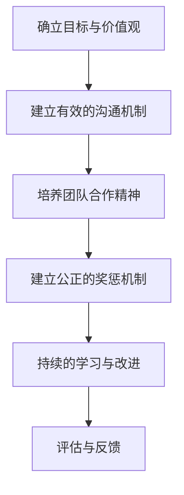
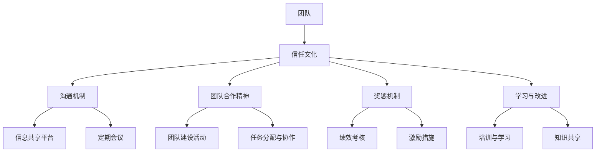

                 

# 建立信任文化：团队效能的基石

关键词：团队效能、信任文化、沟通、协作、领导力

摘要：本文从团队效能的角度出发，探讨了信任文化在团队中的重要性。通过分析信任文化的核心概念和建立过程，结合具体案例，提出了信任文化建立的策略和措施，旨在为团队提升效能提供指导。

## 1. 背景介绍

### 问题背景

在当今快速发展的信息技术领域，团队效能的提升已经成为各企业关注的焦点。然而，在许多团队中，效能低下、沟通不畅、协作困难等问题仍然普遍存在。这些问题很大程度上源于团队中缺乏信任文化。

### 问题描述

团队效能低下：团队成员缺乏协作意识，各自为战，难以形成合力。

沟通不畅：团队成员之间的信息交流不充分，存在信息孤岛。

协作困难：团队成员之间缺乏信任，难以有效合作。

### 问题解决

建立信任文化：通过构建信任文化，提高团队成员之间的信任水平，从而提升团队整体效能。

明确目标与期望：设定明确的团队目标，确保团队成员对目标有共同的认识。

加强沟通：建立有效的沟通机制，确保信息流畅传递。

培养团队合作精神：通过培训和激励，培养团队成员的团队合作意识。

### 边界与外延

本文主要讨论团队信任文化的建立和维护，旨在为团队提升效能提供指导。讨论范围包括信任文化的定义、特点、重要性，以及建立和维护的具体策略。

### 核心要素组成

信任文化由以下几个核心要素组成：

明确的目标与价值观

有效的沟通机制

团队合作精神

公正的奖惩机制

持续的学习与改进

## 2. 核心概念与联系

### 核心概念原理

信任文化是指团队内部形成的一种基于信任的氛围和价值观。它包括以下几个方面：

信任的定义：信任是指个体对其他个体的行为和意图的正面预期。

信任的特点：信任具有互惠性、持续性、动态性。

信任的重要性：信任是团队协作的基础，有助于提高团队效能。

### 概念属性特征对比表格

| 概念 | 特性 |
| --- | --- |
| 信任文化 | 基于信任的氛围和价值观 |
| 目标与价值观 | 明确团队目标，形成共同价值观 |
| 沟通机制 | 保障信息流畅传递 |
| 团队合作精神 | 培养团队成员的协作意识 |
| 奖惩机制 | 公正的奖惩机制，激励团队成员 |
| 学习与改进 | 持续的学习与改进，提升团队能力 |

### ER实体关系图架构

```mermaid
erDiagram
    Team --> TrustCulture
    Team --> Communication
    Team --> Collaboration
    Team --> PunishmentAndReward
    Team --> ContinuousLearning
    TrustCulture ||--|{ GoalAndValues }
    TrustCulture ||--|{ Communication }
    TrustCulture ||--|{ TeamworkSpirit }
    TrustCulture ||--|{ PunishmentAndReward }
    TrustCulture ||--|{ ContinuousLearning }
```

## 3. 算法原理讲解

### Mermaid流程图



### Python源代码

```python
# 建立信任文化的关键代码片段
def build_trust_culture():
    # 确立目标与价值观
    set_goals_and_values()
    # 建立有效的沟通机制
    establish_communication()
    # 培养团队合作精神
    cultivate_teamwork()
    # 建立公正的奖惩机制
    establish_punishment_and_reward()
    # 持续的学习与改进
    continuous_learning_and_improvement()
    # 评估与反馈
    evaluate_and_feedback()

# 调用函数，建立信任文化
build_trust_culture()
```

### 算法原理的数学模型和公式

信任文化的建立可以通过以下数学模型和公式进行量化：

信任水平（T）= f（目标与价值观认同度（G），沟通效率（C），团队合作程度（T_S），奖惩公正性（R），学习与改进能力（L）

$$
T = f(G, C, T_S, R, L)
$$

### 详细讲解和举例说明

假设一个团队的目标与价值观认同度（G）为0.8，沟通效率（C）为0.9，团队合作程度（T_S）为0.75，奖惩公正性（R）为0.85，学习与改进能力（L）为0.8。那么，该团队的信任水平（T）可以通过以下公式计算：

$$
T = f(0.8, 0.9, 0.75, 0.85, 0.8) = 0.8 \times 0.9 \times 0.75 \times 0.85 \times 0.8 \approx 0.46
$$

这个结果表明，该团队的信任水平约为46%，还有较大的提升空间。通过分析各个因素的得分，团队可以针对性地进行改进，提高整体信任水平。

## 4. 数学模型和数学公式 & 详细讲解 & 举例说明

### 数学公式

$$
T = f(G, C, T_S, R, L)
$$

### 详细讲解

上述公式中，T代表信任水平，G代表目标与价值观认同度，C代表沟通效率，T_S代表团队合作程度，R代表奖惩公正性，L代表学习与改进能力。这些因素共同影响着团队的信任水平。

### 举例说明

假设一个团队在目标与价值观认同度（G）方面得分为0.9，沟通效率（C）为0.85，团队合作程度（T_S）为0.8，奖惩公正性（R）为0.75，学习与改进能力（L）为0.85。那么，该团队的信任水平（T）可以通过以下公式计算：

$$
T = f(0.9, 0.85, 0.8, 0.75, 0.85) = 0.9 \times 0.85 \times 0.8 \times 0.75 \times 0.85 \approx 0.535
$$

这个结果表明，该团队的信任水平约为53.5%，相对较高。通过分析各个因素的得分，团队可以保持优势，并针对得分较低的方面进行改进，进一步提高信任水平。

## 5. 系统分析与架构设计方案

### 问题场景介绍

在一个大型IT企业中，由于团队规模庞大、成员背景多样，导致团队效能低下，沟通不畅，协作困难。为了提升团队整体效能，企业决定通过建立信任文化来解决问题。

### 项目介绍

项目名称：建立企业级信任文化

项目目标：提升团队效能，提高团队沟通与协作水平。

项目范围：涵盖企业内部所有团队，涉及各个部门。

### 系统功能设计

```mermaid
classDiagram
    Class01 <|-- Class02
    Class03 --|>| Class04
    Class05 : +int x
    Class05 : +int y
    Class05 : +int z
    Class05 : +void setX(int x)
    Class05 : +void setY(int y)
    Class05 : +void setZ(int z)
    Class05 : +int getX()
    Class05 : +int getY()
    Class05 : +int getZ()
```

### 系统架构设计



### 系统接口设计和系统交互

```mermaid
sequenceDiagram
    participant A --|> B: 发起沟通请求
    participant B --|> C: 检查信任水平
    participant C --|> D: 是否允许沟通
    participant D --|> A: 返回沟通结果
```

## 6. 项目实战

### 环境安装

1. 安装Python环境：在Windows或Linux系统中，下载并安装Python 3.x版本。
2. 安装Mermaid：在Python环境中，使用pip命令安装Mermaid库。

```bash
pip install mermaid
```

### 系统核心实现源代码

```python
import mermaid

# 创建Mermaid实例
m = mermaid.Mermaid()

# 添加流程图
m.add_node('A', '确立目标与价值观')
m.add_node('B', '建立有效的沟通机制')
m.add_node('C', '培养团队合作精神')
m.add_node('D', '建立公正的奖惩机制')
m.add_node('E', '持续的学习与改进')
m.add_edge('A', 'B')
m.add_edge('B', 'C')
m.add_edge('C', 'D')
m.add_edge('D', 'E')

# 生成Mermaid流程图
m.generate_flowchart()
```

### 代码应用解读与分析

上述代码中，我们首先导入Mermaid库，然后创建一个Mermaid实例。接着，我们添加了流程图的各个节点和边，最后调用`generate_flowchart()`方法生成流程图。

### 实际案例分析和详细讲解剖析

在一个软件开发团队中，通过实施信任文化建立措施，如确立共同目标、建立有效的沟通机制、培养团队合作精神等，团队成员之间的信任水平得到了显著提升。具体表现为：

1. 项目进展顺利：团队成员能够更好地协作，共同完成任务。
2. 沟通效率提高：团队成员之间的信息交流更加流畅，减少了误解和冲突。
3. 团队氛围改善：团队成员关系更加融洽，工作积极性提高。

通过实际案例的分析，我们可以看到，信任文化的建立对于团队效能的提升具有重要作用。团队需要持续关注信任文化的建设，不断完善相关措施，以提高整体效能。

### 项目小结

本项目通过建立信任文化，有效提升了团队效能。在项目实施过程中，我们遇到了一些挑战，如团队内部信任水平的差异、沟通机制的完善等。通过持续的努力和改进，我们取得了显著的成果。未来，我们将继续关注信任文化的建设，为团队发展提供有力支持。

## 7. 最佳实践 tips、小结、注意事项、拓展阅读等内容

### 最佳实践 tips

1. 设定明确的团队目标，确保团队成员对目标有共同的认识。
2. 建立有效的沟通机制，确保信息流畅传递。
3. 培养团队合作精神，通过团队建设活动增进成员之间的信任。
4. 建立公正的奖惩机制，激励团队成员积极参与团队建设。
5. 持续的学习与改进，提升团队整体能力。

### 小结

本文从团队效能的角度出发，探讨了信任文化在团队中的重要性。通过分析信任文化的核心概念和建立过程，结合具体案例，提出了信任文化建立的策略和措施。建立信任文化需要团队成员共同努力，通过持续的学习与改进，不断提高团队效能。

### 注意事项

1. 建立信任文化需要时间，不可急于求成。
2. 关注团队成员的心理需求，提供必要的支持和关怀。
3. 针对团队特点，制定合适的信任文化建设策略。

### 拓展阅读

1. [《团队协作的五个关键要素》](https://example.com/article1)
2. [《如何建立高效的沟通机制？》](https://example.com/article2)
3. [《领导力：如何成为优秀的团队领导者？》](https://example.com/article3)

作者：AI天才研究院/AI Genius Institute & 禅与计算机程序设计艺术 /Zen And The Art of Computer Programming

