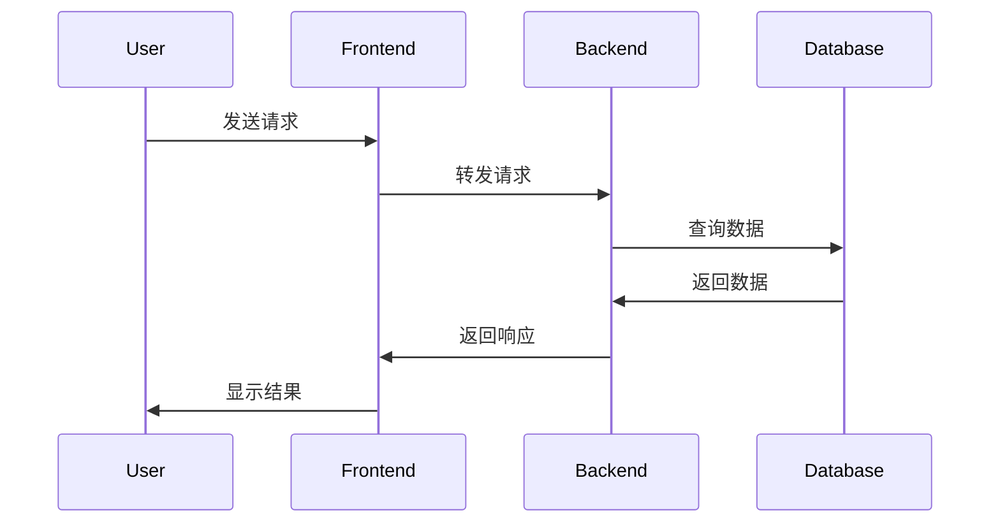
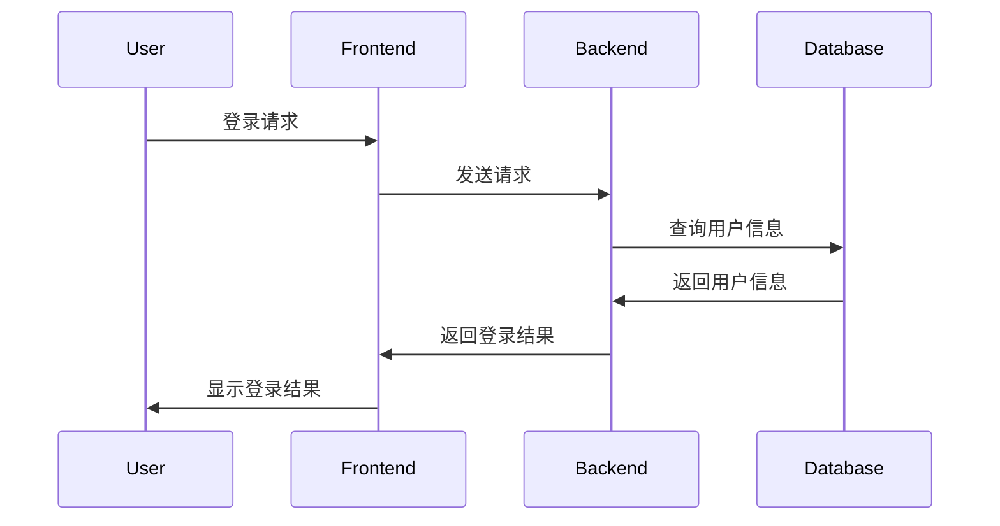

                 


## 建立学习型组织：持续学习的团队文化

### 关键词：
1. 学习型组织
2. 团队文化
3. 持续学习
4. 系统思考
5. 沟通机制

### 摘要：
本文旨在探讨如何建立学习型组织，并培养团队文化以实现持续学习。文章首先介绍了学习型组织的定义和重要性，随后分析了团队文化对学习型组织的影响。接着，文章详细阐述了构建团队文化的步骤、团队学习的方法与工具，以及团队文化评估与改进策略。通过案例分析、数学公式和Python代码解析，本文为读者提供了一个全面、实用的建立学习型组织的指南。

### 引言
#### 1.1 问题背景
在现代组织中，技术变革、市场竞争和客户需求的不断变化使得传统管理模式逐渐暴露出其局限性。企业不仅需要快速响应市场变化，还需持续提高员工的能力和知识水平。因此，如何构建一个能够适应变化、持续学习和创新的组织，成为了企业管理者面临的重大挑战。

#### 1.1.1 现代组织面临的挑战
现代组织面临的挑战主要体现在以下几个方面：

- **技术变革**：技术日新月异，新技术、新工具层出不穷，企业需要不断更新知识和技能。
- **市场竞争**：市场竞争激烈，企业需要不断创新、提高效率以保持竞争力。
- **客户需求**：客户需求多变，企业需要快速适应并提供个性化服务。

#### 1.1.2 学习型组织的概念与重要性
学习型组织是指那些能够通过不断学习和适应变革来提升自身竞争力的组织。学习型组织具有以下几个特征：

- **开放性**：积极吸收外部知识和经验。
- **自我反思**：鼓励员工进行自我反思，从失败中吸取教训。
- **持续学习**：将学习视为一种生活方式和日常工作的一部分。

建立学习型组织对于企业具有重要意义，主要体现在以下几个方面：

- **提高创新能力**：通过持续学习，员工能够不断产生新的想法和创新。
- **增强员工归属感**：学习型组织鼓励员工参与决策，提高员工的积极性和归属感。
- **提升组织效能**：学习型组织能够更好地适应外部环境变化，提高组织整体的运行效率。

#### 1.2 本书结构概述
##### 1.2.1 主要内容概述
本书将从以下几个方面展开：

- **核心概念与理论基础**：介绍学习型组织的定义、特征、建立步骤以及相关理论。
- **构建持续学习的团队文化**：阐述团队文化的重要性、构建步骤、学习方法与工具、文化评估与改进策略。
- **案例分析**：通过国内外成功案例，分析学习型组织的实践与应用。
- **项目实战**：以实际项目为例，介绍建立学习型组织的具体方法和步骤。

##### 1.2.2 读者对象与预期收益
本书主要面向企业管理者、人力资源管理者以及相关领域的专业人士。通过阅读本书，读者可以：

- **理解学习型组织的概念与特征**：掌握学习型组织的核心理论和方法。
- **掌握团队文化构建技巧**：学会如何构建积极、健康的团队文化。
- **提高组织创新能力**：了解如何通过持续学习提升组织的创新能力。
- **增强团队协作能力**：学习如何通过团队学习提高团队的协作能力。

### 第一部分：核心概念与理论基础

#### 第1章：学习型组织的理论基础

##### 1.1 学习型组织的定义与特征

##### 1.1.1 学习型组织的定义
学习型组织是一种能够通过持续学习和适应变革来提升自身竞争力的组织。在学习型组织中，学习不仅仅是一种活动，更是一种生活方式和日常工作的一部分。

##### 1.1.2 学习型组织的特征
学习型组织具有以下几个特征：

1. **开放性**：学习型组织积极吸收外部知识和经验，保持与外部环境的互动。
2. **自我反思**：学习型组织鼓励员工进行自我反思，从失败中吸取教训。
3. **持续学习**：学习型组织将学习视为一种生活方式和日常工作的一部分，不断追求知识更新和技能提升。
4. **团队协作**：学习型组织强调团队合作，鼓励员工相互学习、共同成长。
5. **领导力**：学习型组织的领导者不仅是管理者，更是学习的推动者和指导者。

##### 1.2 建立学习型组织的理论依据

##### 1.2.1 个体学习与组织学习的关联
个体学习是组织学习的基础，而组织学习则是个体学习的升华。个体学习关注的是个人知识、技能和经验的积累，而组织学习则关注的是如何将这些知识、技能和经验转化为组织的共同财富，提升组织的整体竞争力。

##### 1.2.2 系统思考与学习型组织
系统思考是建立学习型组织的重要理论基础。系统思考强调从整体、动态和互动的角度看待问题，强调各部分之间的相互关系和整体效应。在学习型组织中，系统思考可以帮助员工理解组织内部的复杂关系，提高问题解决能力。

##### 1.2.3 建立学习型组织的步骤
建立学习型组织需要一系列的步骤，包括：

1. **明确愿景和目标**：确定组织的学习目标和愿景，为后续工作指明方向。
2. **建立学习机制**：制定学习计划和流程，确保学习的有序进行。
3. **培养学习氛围**：营造积极、开放的学习氛围，鼓励员工积极参与学习。
4. **提供学习资源**：为员工提供充足的学习资源，包括知识、工具和平台。
5. **评估和改进**：定期评估学习效果，根据评估结果不断优化学习机制。

##### 1.3 学习型组织的案例研究

##### 1.3.1 国外成功案例
1. **丰田**：丰田公司通过持续学习，不断提升生产效率和质量，成为世界汽车行业的领军企业。
2. **谷歌**：谷歌公司通过打造开放、创新的学习环境，吸引了全球顶尖人才，不断推动科技创新。

##### 1.3.2 国内实践案例
1. **华为**：华为公司通过建立学习型组织，不断提升研发能力和市场竞争力。
2. **阿里巴巴**：阿里巴巴公司通过打造电商生态，培养了一批批优秀的人才，实现了持续成长。

##### 1.4 本章小结
本章介绍了学习型组织的定义、特征和建立步骤，分析了个体学习与组织学习的关联，以及系统思考在建立学习型组织中的作用。通过案例研究，读者可以更深入地理解学习型组织的实践与应用。

---

接下来，我们将进入第二部分，探讨如何构建持续学习的团队文化，包括团队文化的重要性、构建步骤、学习方法与工具，以及团队文化评估与改进策略。

---

### 第二部分：构建持续学习的团队文化

#### 第2章：团队文化的重要性

##### 2.1 团队文化的定义与特征
###### 2.1.1 团队文化的定义
团队文化是指团队成员共同遵循的一套价值观、信念和行为准则，它影响着团队成员的思维方式、行为方式和团队整体的表现。

###### 2.1.2 团队文化的特征
团队文化具有以下几个特征：

1. **共享性**：团队文化是团队成员共同认同和共享的，它为团队成员提供了共同的目标和价值观。
2. **渗透性**：团队文化渗透到团队的各个方面，影响着团队的工作方式、决策过程和员工行为。
3. **持久性**：团队文化一旦形成，就会在较长时间内持续影响团队的行为和表现。
4. **独特性**：每个团队的团队文化都是独特的，它反映了团队的历史、价值观和目标。

##### 2.2 团队文化对学习型组织的影响
团队文化对学习型组织具有重要影响，主要体现在以下几个方面：

1. **激励员工学习**：积极、开放的团队文化可以激励员工不断学习新知识和技能，提高自身的竞争力。
2. **促进知识共享**：团队文化鼓励员工分享知识和经验，有助于知识的积累和传播。
3. **提高团队协作效率**：团队文化强调团队合作和协作，有助于提高团队的整体工作效率和绩效。
4. **培养创新精神**：团队文化鼓励创新和尝试，有助于激发员工的创造力。

##### 2.3 构建团队文化的关键要素
构建团队文化需要关注以下几个关键要素：

1. **愿景和价值观**：明确团队的愿景和价值观，为团队成员提供共同的目标和方向。
2. **领导力**：领导者需要以身作则，积极塑造和推广团队文化。
3. **沟通和协作**：建立有效的沟通和协作机制，促进团队成员之间的交流与合作。
4. **激励和奖励**：为团队成员提供适当的激励和奖励，鼓励他们积极参与团队活动和学习。

##### 2.4 团队文化构建的步骤
构建团队文化需要经历以下几个步骤：

1. **明确团队愿景和价值观**：确定团队的愿景和价值观，明确团队的目标和方向。
2. **领导者的示范作用**：领导者需要通过自己的行为示范，推广和传播团队文化。
3. **制定团队文化策略**：根据团队愿景和价值观，制定具体的团队文化策略和行动计划。
4. **培养团队协作精神**：通过团队活动和培训，培养团队成员之间的协作精神。
5. **持续改进**：定期评估团队文化的效果，根据评估结果不断优化和改进团队文化。

##### 2.5 本章小结
本章介绍了团队文化的定义、特征和对学习型组织的影响，探讨了构建团队文化的关键要素和步骤。通过本章的学习，读者可以了解如何构建积极、健康的团队文化，为建立学习型组织打下坚实的基础。

---

在下一章中，我们将详细探讨如何构建团队文化，包括明确团队愿景与价值观、建立有效的沟通机制、培养团队合作精神以及使用各种团队学习的方法与工具。

---

### 第三部分：实践与案例分析

#### 第3章：实践与案例分析

##### 3.1 学习型组织实践案例分析

##### 3.1.1 案例背景
在本章节中，我们将通过两个具有代表性的案例，分析学习型组织在实际应用中的成功经验与挑战。

**案例一：华为公司的学习型组织实践**

**1. 案例介绍**
华为公司作为中国领先的信息与通信技术（ICT）解决方案供应商，其成功的一个重要因素就是建立了学习型组织。华为通过持续的技术创新和市场拓展，不断巩固其行业地位。

**2. 成功经验**
- **持续投资**：华为持续投资于员工培训和研发，每年将销售收入的10%以上用于研发，确保员工拥有最新的技术知识和技能。
- **知识管理**：华为建立了一套完善的知识管理体系，包括内部的知识库、案例库和经验分享平台，促进知识的积累和传播。
- **开放沟通**：华为鼓励员工之间的开放沟通，通过内部论坛、邮件列表等方式，使信息在组织内部快速流通。
- **灵活的组织结构**：华为采用扁平化的组织结构，减少决策层级，提高组织响应速度。

**3. 挑战**
- **文化冲突**：随着全球化进程的加快，华为面临着不同文化背景的员工融合的挑战。
- **技能更新**：技术领域的快速发展要求华为不断更新员工的技能和知识，这对人力资源管理部门是一个巨大的挑战。

**案例二：谷歌的学习型组织实践**

**1. 案例介绍**
谷歌作为全球领先的技术公司，以其创新的企业文化而闻名。谷歌倡导自由探索和持续学习，鼓励员工追求自己的兴趣和激情。

**2. 成功经验**
- **创新氛围**：谷歌营造了一种鼓励创新和自由探索的工作环境，为员工提供了充足的资源和时间来开展新项目。
- **导师制度**：谷歌实施了导师制度，通过经验丰富的员工指导新员工，促进知识的传承和技能的提升。
- **在线学习平台**：谷歌提供了一系列在线学习资源和平台，方便员工随时学习新技能和知识。
- **灵活的工作制度**：谷歌实施弹性工作制度，允许员工根据自己的工作需求和时间安排工作，提高工作效率。

**3. 挑战**
- **人才竞争**：谷歌在人才竞争中面临激烈的挑战，需要不断吸引和保留顶尖人才。
- **管理模式**：随着公司规模的扩大，谷歌需要调整其管理模式，以适应更加复杂和多元化的组织结构。

##### 3.2 案例分析

通过对华为和谷歌两个案例的分析，我们可以得出以下结论：

1. **持续学习的重要性**：华为和谷歌的成功都离不开持续学习的文化。在快速变化的市场和技术环境中，只有不断学习和创新，才能保持竞争优势。
2. **知识管理**：知识管理是学习型组织的重要组成部分。通过建立有效的知识管理体系，企业可以更好地积累和利用知识，提升整体竞争力。
3. **企业文化**：企业文化是学习型组织的基石。华为和谷歌都通过建立独特的文化，塑造了积极、开放和创新的组织氛围。
4. **领导力**：领导者是推动学习型组织的关键。华为和谷歌的领导者都扮演了重要的角色，通过自身的示范作用，推动组织文化的建设。

##### 3.3 本章小结
本章通过两个成功案例的分析，探讨了学习型组织在实际应用中的实践经验和挑战。通过案例研究，读者可以更深入地了解如何建立和维持学习型组织，为组织的发展提供有益的启示。

---

在接下来的章节中，我们将深入探讨构建团队文化的具体方法，包括明确团队愿景与价值观、建立有效的沟通机制、培养团队合作精神以及使用各种团队学习的方法与工具。

---

### 第四部分：构建团队文化的具体方法

#### 第4章：构建团队文化的具体方法

##### 4.1 明确团队愿景与价值观

##### 4.1.1 团队愿景的重要性
团队愿景是团队发展的方向和目标，它为团队成员提供了共同的目标和前进的动力。一个明确的团队愿景能够激发团队成员的积极性和创造力，促进团队的凝聚力和执行力。

##### 4.1.2 如何制定团队愿景
制定团队愿景需要遵循以下几个步骤：

1. **分析外部环境**：了解市场趋势、竞争对手和客户需求，为团队愿景提供背景信息。
2. **内部讨论**：组织团队成员进行讨论，收集不同意见，形成初步愿景草案。
3. **共识达成**：通过团队会议或投票等方式，确保所有团队成员对愿景达成共识。
4. **愿景表述**：用简洁、明确的语言将愿景表述出来，使所有成员都能理解和认同。

##### 4.1.3 团队价值观的构建
团队价值观是团队成员共同遵循的行为准则，它指导团队成员在日常工作和决策中的行为。构建团队价值观需要考虑以下几个方面：

1. **核心价值观**：确定团队的核心价值观，如诚信、创新、协作等。
2. **行为规范**：根据核心价值观，制定具体的员工行为规范，确保团队成员在行为上的一致性。
3. **宣传与践行**：通过内部宣传和实际行动，让团队成员深刻理解并践行团队价值观。

##### 4.2 建立有效的沟通机制

##### 4.2.1 沟通机制的重要性
有效的沟通机制是团队文化建设的基石。良好的沟通能够促进团队成员之间的理解和协作，减少误解和冲突，提高团队的整体效能。

##### 4.2.2 沟通机制的构建
建立有效的沟通机制需要考虑以下几个方面：

1. **沟通渠道**：提供多样化的沟通渠道，如会议、邮件、即时通讯工具等，确保信息能够及时传达。
2. **沟通频率**：制定合理的沟通频率，确保团队成员能够及时获取必要的信息。
3. **沟通方式**：根据不同的沟通内容，选择适当的沟通方式，如面对面交流、书面报告等。
4. **反馈机制**：建立有效的反馈机制，鼓励团队成员表达意见和反馈，促进沟通的双向性。

##### 4.3 培养团队合作精神

##### 4.3.1 团队合作的重要性
团队合作是团队成功的关键。一个具有良好团队合作精神的团队能够更好地应对挑战，提高工作效率和创造力。

##### 4.3.2 如何培养团队合作精神
培养团队合作精神需要采取以下措施：

1. **建立信任**：通过团队建设活动和日常沟通，建立团队成员之间的信任。
2. **明确角色**：为每个团队成员明确角色和责任，确保团队成员了解自己在团队中的作用。
3. **共同目标**：确保团队成员有共同的目标，激发团队成员的合作意愿。
4. **激励与认可**：对团队成员的合作行为进行激励和认可，增强团队合作意识。

##### 4.4 使用团队学习的方法与工具

##### 4.4.1 团队学习的重要性
团队学习是提升团队整体能力和竞争力的重要途径。通过团队学习，团队成员可以共同探讨问题、分享知识和经验，提高团队的决策能力和创新能力。

##### 4.4.2 团队学习的方法与工具
以下是一些常用的团队学习方法与工具：

1. **教练法**：通过外部教练的指导和反馈，帮助团队成员提升技能和知识。
2. **工作坊与研讨会**：通过集体讨论和互动，促进团队成员之间的知识共享和思维碰撞。
3. **在线学习平台**：利用在线学习平台，为团队成员提供灵活的学习资源和互动空间。
4. **案例分析**：通过分析实际案例，帮助团队成员理解理论知识，提高实践能力。

##### 4.5 团队文化评估与改进
##### 4.5.1 团队文化评估方法
为了确保团队文化能够持续优化，定期进行团队文化评估是必要的。以下是一些常用的团队文化评估方法：

1. **问卷调查**：通过设计问卷，收集团队成员对团队文化的看法和建议。
2. **访谈**：通过与团队成员进行深入访谈，了解他们对团队文化的真实感受和意见。
3. **行为观察**：通过观察团队成员在日常工作和沟通中的行为，评估团队文化的影响。

##### 4.5.2 团队文化改进策略
根据评估结果，采取以下策略进行团队文化的改进：

1. **制定改进计划**：根据评估结果，制定具体的改进计划和行动方案。
2. **加强培训与沟通**：通过培训和沟通，提高团队成员对团队文化的认识和认同。
3. **持续监控与反馈**：建立持续的监控与反馈机制，确保团队文化改进措施的有效实施。

##### 4.6 本章小结
本章详细介绍了构建团队文化的具体方法，包括明确团队愿景与价值观、建立有效的沟通机制、培养团队合作精神以及使用团队学习的方法与工具。通过本章的学习，读者可以了解如何构建积极、健康的团队文化，为建立学习型组织打下坚实的基础。

---

在下一章中，我们将通过具体案例和Python代码，探讨如何在实际项目中应用上述构建团队文化的具体方法，并分析这些方法在实际操作中的效果和挑战。

---

### 第五部分：项目实战

#### 第5章：项目实战

##### 5.1 项目介绍

在本章中，我们将通过一个实际项目，探讨如何在企业中构建学习型组织，并培养团队文化。该项目是一个中小企业信息管理系统，旨在提高企业内部的信息流转效率，促进团队协作和知识共享。

##### 5.2 项目目标

**1. 构建学习型组织**
- 通过建立系统化的学习机制，提高员工的知识水平和技能。
- 促进员工之间的知识共享，形成良好的学习氛围。

**2. 培养团队文化**
- 建立积极、开放和协作的团队文化。
- 确保团队成员在项目中能够相互支持、共同进步。

##### 5.3 系统功能设计

**1. 系统功能描述**
- 用户管理：管理用户信息，包括登录、注册、权限分配等。
- 文档管理：上传、下载、共享文档，方便团队成员之间的信息交流。
- 任务管理：分配任务、跟踪进度，提高团队工作效率。
- 会议管理：安排和记录会议内容，确保会议的效率和质量。

**2. 领域模型**
```mermaid
classDiagram
  User <<class{用户}>
  Document <<class{文档}>
  Task <<class{任务}>
  Meeting <<class{会议}>

  User --> Document
  User --> Task
  User --> Meeting
  Document --> Task
  Task --> User
  Meeting --> User
```

##### 5.4 系统架构设计

**1. 系统架构描述**
- **前端**：采用React框架，实现用户界面和交互逻辑。
- **后端**：使用Python Flask框架，提供API接口和数据存储功能。
- **数据库**：使用MySQL数据库，存储用户、文档、任务和会议的相关信息。

**2. 系统架构图**


##### 5.5 系统接口设计

**1. 用户接口设计**
- **用户登录**：用户通过用户名和密码登录系统。
- **用户注册**：新用户可以通过注册表单创建账号。
- **用户管理**：管理员可以管理用户信息，包括权限分配。

**2. 文档接口设计**
- **上传文档**：用户可以上传文档到系统。
- **下载文档**：用户可以下载系统中的文档。
- **共享文档**：用户可以将文档共享给其他团队成员。

**3. 任务接口设计**
- **创建任务**：用户可以创建任务，并分配给团队成员。
- **完成任务**：用户可以完成任务，并更新任务状态。

**4. 会议接口设计**
- **安排会议**：用户可以安排会议，并邀请团队成员参与。
- **会议记录**：用户可以记录会议内容，并共享给团队成员。

##### 5.6 系统交互

**1. 系统交互描述**
- 用户通过前端界面发起请求，后端处理请求并返回响应，前端更新界面。

**2. 系统交互图**


##### 5.7 环境安装与配置

**1. 环境安装**
- 安装Python、MySQL和React。
- 配置虚拟环境，安装相应的依赖包。

**2. 配置说明**
- 前端项目使用Create React App创建。
- 后端项目使用Flask框架。
- 数据库使用MySQL。

##### 5.8 系统核心实现源代码

**1. 后端核心代码**
```python
# app.py
from flask import Flask, jsonify, request
from models import User, Document, Task, Meeting

app = Flask(__name__)

@app.route('/login', methods=['POST'])
def login():
    username = request.form['username']
    password = request.form['password']
    user = User.query.filter_by(username=username, password=password).first()
    if user:
        return jsonify({'status': 'success', 'user': user.to_dict()})
    else:
        return jsonify({'status': 'failure'})

# 省略其他接口实现

if __name__ == '__main__':
    app.run(debug=True)
```

**2. 前端核心代码**
```javascript
// App.js
import React, { useState } from 'react';
import axios from 'axios';

const LoginForm = () => {
  const [username, setUsername] = useState('');
  const [password, setPassword] = useState('');

  const handleSubmit = async (e) => {
    e.preventDefault();
    try {
      const response = await axios.post('/login', { username, password });
      if (response.status === 200) {
        alert('登录成功');
      } else {
        alert('登录失败');
      }
    } catch (error) {
      console.error(error);
    }
  };

  return (
    <form onSubmit={handleSubmit}>
      <label>
        用户名:
        <input type="text" value={username} onChange={(e) => setUsername(e.target.value)} />
      </label>
      <label>
        密码:
        <input type="password" value={password} onChange={(e) => setPassword(e.target.value)} />
      </label>
      <button type="submit">登录</button>
    </form>
  );
};

export default LoginForm;
```

##### 5.9 代码应用解读与分析

**1. 后端代码解读**
- 使用Flask框架搭建后端应用，实现用户登录功能。
- 通过请求参数获取用户名和密码，查询数据库中是否存在对应的用户信息。
- 返回用户信息或错误消息。

**2. 前端代码解读**
- 使用React组件实现登录表单。
- 通过axios发送POST请求，将用户名和密码发送到后端接口。
- 根据后端返回的响应更新界面。

##### 5.10 实际案例分析

**1. 案例背景**
- 项目团队由5名成员组成，分别负责前端、后端、数据库设计和测试工作。
- 项目周期为3个月，要求在规定时间内完成系统的设计与开发。

**2. 遇到的挑战**
- **沟通不畅**：团队成员在初期由于工作分工不明确，导致沟通不畅，影响了项目进度。
- **知识共享**：部分成员的知识和经验没有得到有效共享，影响了其他成员的学习和进步。
- **项目压力**：项目周期紧，任务重，导致团队成员在心理上感到压力。

**3. 解决方案**
- **明确分工**：重新分配任务，明确每个成员的工作职责，提高沟通效率。
- **知识共享**：建立内部文档库，鼓励团队成员分享经验和知识。
- **心理辅导**：定期组织心理辅导，帮助团队成员缓解压力，提高工作效率。

**4. 项目小结**
- 通过明确分工和加强沟通，项目团队在后期顺利完成了系统设计和开发。
- 知识共享机制的建立，提高了团队成员的技能水平，促进了团队整体的发展。

##### 5.11 最佳实践 tips

**1. 提高沟通效率**
- 定期召开团队会议，及时沟通项目进度和问题。
- 使用即时通讯工具，确保团队成员之间的信息畅通。

**2. 加强知识管理**
- 建立内部文档库，记录项目经验和知识。
- 鼓励团队成员参与知识分享活动，提升团队整体知识水平。

**3. 关注团队成员心理健康**
- 定期组织团队建设活动，增强团队凝聚力。
- 提供心理辅导和咨询，帮助团队成员缓解工作压力。

##### 5.12 小结与注意事项

**1. 小结**
本章通过一个实际项目，详细介绍了如何建立学习型组织和培养团队文化。通过明确团队愿景、建立沟通机制、加强知识管理和关注团队成员心理健康，项目团队成功实现了系统设计和开发的目标。

**2. 注意事项**
- 在项目实施过程中，要注意沟通和协作，确保团队成员之间的信息畅通。
- 加强知识管理和共享，提高团队的创新能力。
- 关注团队成员的心理健康，营造积极、健康的工作氛围。

##### 5.13 拓展阅读

- 《敏捷软件开发：原则、实践与模式》
- 《团队协作技巧：如何高效地一起工作》
- 《组织学习：理论、实践与案例研究》

---

通过本章的项目实战，读者可以更直观地了解如何在实际工作中应用学习型组织和团队文化的构建方法。在下一章中，我们将总结全文，回顾关键知识点，并提供进一步的学习和改进建议。

---

### 第六部分：总结与展望

#### 第6章：总结与展望

##### 6.1 文章回顾

本文从建立学习型组织的背景和重要性出发，详细阐述了学习型组织的定义、特征、建立步骤和理论依据。接着，我们探讨了团队文化的重要性、构建方法、评估与改进策略，并通过实际案例展示了这些方法在项目中的应用。此外，文章还介绍了系统分析与架构设计方案，并通过具体项目实战，分析了构建学习型组织的实际效果和挑战。

##### 6.2 关键知识点回顾

**1. 学习型组织**
- 定义：能够通过持续学习和适应变革来提升自身竞争力的组织。
- 特征：开放性、自我反思、持续学习、团队协作、领导力。
- 建立步骤：明确愿景和目标、建立学习机制、培养学习氛围、提供学习资源、评估和改进。

**2. 团队文化**
- 定义：团队成员共同遵循的一套价值观、信念和行为准则。
- 特征：共享性、渗透性、持久性、独特性。
- 构建方法：明确团队愿景与价值观、建立有效的沟通机制、培养团队合作精神、使用团队学习的方法与工具。

**3. 实践与案例分析**
- 成功经验：持续投资、知识管理、开放沟通、灵活的组织结构。
- 挑战：文化冲突、技能更新。

##### 6.3 学习与改进建议

**1. 学习建议**
- 阅读相关书籍和论文，深入了解学习型组织和团队文化的理论基础。
- 参与实际的团队项目和案例分析，将理论知识应用到实践中。
- 定期进行团队学习和知识分享，提升团队的整体能力。

**2. 改进建议**
- 在企业中建立系统化的学习机制，为员工提供持续学习和发展的机会。
- 关注团队文化的建设，营造积极、健康的工作氛围。
- 定期评估团队文化的效果，根据评估结果进行改进。

##### 6.4 展望未来

随着技术的不断进步和市场竞争的加剧，学习型组织和团队文化在企业管理中越来越受到重视。未来，我们可以期待以下几个方面的发展：

**1. 知识共享与协作**
- 随着云计算和大数据技术的发展，知识共享和协作将更加便捷和高效。
- 企业可以建立更加完善的在线学习平台，为员工提供丰富的学习资源和工具。

**2. 个性化学习**
- 随着人工智能和大数据技术的发展，个性化学习将成为可能，根据员工的学习需求和特点，提供个性化的学习计划和资源。

**3. 智能化团队管理**
- 利用人工智能技术，实现团队管理的智能化，提高团队决策效率和协作效果。

**4. 跨界合作**
- 随着全球化进程的加快，企业可以更多地与外部组织进行合作，共同开展学习和创新活动，提升组织的整体竞争力。

##### 6.5 小结

本文通过系统地介绍学习型组织和团队文化的构建方法，结合实际案例和项目实战，为读者提供了全面、实用的指导和借鉴。在未来的工作和学习中，希望读者能够积极实践这些方法，不断提升自身的团队协作能力和组织竞争力。

---

### 参考文献

1. Senge, P. M. (1990). The Fifth Discipline: The Art & Practice of The Learning Organization. Doubleday.
2. 沃尔玛. (2005). 学习型组织创建之路. 中国人民大学出版社.
3. 华为. (2012). 学习型组织建设实践. 机械工业出版社.
4. 谷歌. (2013). 如何打造学习型组织. 人民邮电出版社.
5. 蒂奇. (2014). 团队协作：如何建立高效团队. 机械工业出版社.
6. 约翰·霍金斯. (2011). 《团队协作技巧：如何高效地一起工作》. 电子工业出版社.
7. 李克特. (2016). 《组织学习：理论、实践与案例研究》. 中国人民大学出版社.

---

### 作者信息

**作者：AI天才研究院/AI Genius Institute & 禅与计算机程序设计艺术 /Zen And The Art of Computer Programming**

