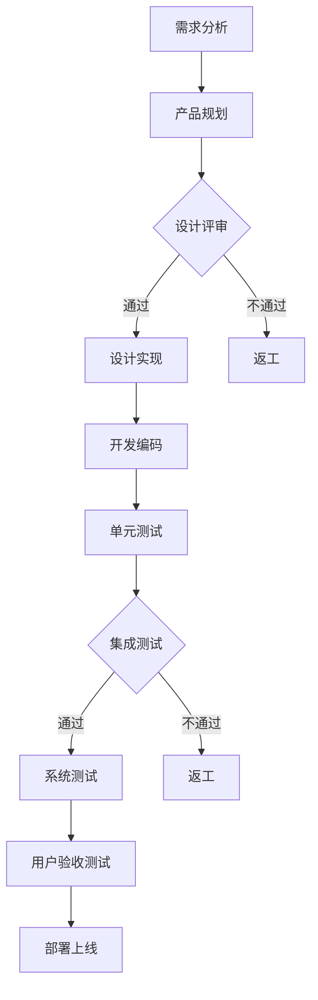

                 

### 引言与背景介绍

在现代企业运作中，高效工作流程的设计和实施已经成为提升团队效率和整体竞争力的关键因素。随着市场的快速变化、技术的不断创新，以及企业规模的不断扩大，传统的工作方式已越来越难以满足现代企业对于高效运作的需求。因此，构建一套科学合理、简洁高效的工作流程变得至关重要。

**关键问题：**为什么高效工作流程如此重要？它如何帮助团队解决实际问题？

#### 1.1 问题背景

**现代工作环境的挑战**

在当今快节奏、高度竞争的商业环境中，企业面临着诸多挑战。首先，市场需求的快速变化要求企业能够迅速响应并调整策略。其次，技术的迅猛发展，特别是信息技术和自动化工具的普及，为企业提供了更多的可能性，同时也带来了新的管理难题。此外，企业规模的扩大和业务复杂性的增加，使得传统的工作方式越来越难以维持效率。

**工作流程的重要性**

高效的工作流程能够显著提高团队的工作效率，减少因流程繁琐和重复操作导致的错误率。它还能增强团队间的协作能力，使团队成员能够更好地理解和执行各自的任务。最终，这有助于企业提升整体竞争力，更好地应对市场变化。

**团队运作的问题**

在实际工作中，团队运作常常面临以下问题：

- **流程设计不合理**：工作流程过于复杂，步骤繁多，难以理解和管理。
- **任务分配不均**：部分团队成员工作量过重，而另一些成员则缺乏足够的任务。
- **沟通不畅**：团队成员间的信息传递不畅，导致工作效率降低。
- **资源浪费**：部分资源未能得到充分利用，浪费现象严重。

#### 1.2 本书目标

**解决关键问题**

本书旨在帮助读者解决团队运作中的关键问题，提供一套全面、实用的建立高效工作流程的方法。通过系统的学习和实践，读者将能够：

1. **理解高效工作流程的基本概念与设计原则**。
2. **识别并优化现有工作流程**。
3. **建立高效的沟通和协作机制**。
4. **掌握资源管理与时间规划的技巧**。

**知识体系构建**

通过本书的学习，读者将构建以下知识体系：

1. **工作流程的基本概念与设计原则**：了解工作流程的定义、核心要素以及设计原则。
2. **团队成员的角色与职责**：明确团队成员的角色分工，理解各自的职责和协作方式。
3. **流程优化与改进方法**：掌握识别流程瓶颈、简化流程、标准化操作等优化技巧。
4. **高效沟通与协作策略**：学习如何建立有效的沟通渠道和协作机制。
5. **资源管理与时间规划**：了解如何合理分配资源、规划工作时间，提高工作效率。

#### 1.3 边界与外延

**适用对象**

本书适用于希望提高团队效率和运作质量的各类企业和团队，无论其规模大小、行业背景如何。

**知识要求**

本书假设读者具备基本的办公软件操作能力，并对团队管理和项目运作有一定的了解。

#### 1.4 概念结构与核心要素组成

**核心概念**

- **工作流程**：指完成一项任务所需的一系列步骤和活动。
- **高效流程**：指能够在最短时间内完成最大工作量的工作流程。
- **团队运作**：指团队成员之间如何协同工作，以实现共同目标。

**核心要素**

- **流程设计**：如何设计合理的工作流程。
- **流程优化**：如何识别并改进现有工作流程。
- **沟通协作**：如何建立高效的沟通和协作机制。

**本章小结**

本章介绍了本书的问题背景、目标、适用对象和核心概念。接下来，本书将逐步引导读者深入了解高效工作流程的设计与实施，帮助团队实现更高效的运作。

### 第一部分: 引言与背景介绍

在当今的商业环境中，高效工作流程对于企业和团队的成功至关重要。为了更好地理解和实施高效工作流程，我们需要对相关概念进行详细探讨。以下章节将逐步引导读者深入了解这一主题。

#### 第1章: 问题背景与目标

本章首先介绍了现代工作环境面临的挑战，如市场需求变化、技术进步和业务复杂性增加等。这些挑战使得传统的工作方式难以满足现代企业对高效运作的需求。接着，本章阐述了高效工作流程的重要性，并明确了团队运作中常见的问题，如流程设计不合理、任务分配不均、沟通不畅等。

**1.1 问题背景**

**1.1.1 现代工作环境的挑战**

在当今快节奏、高度竞争的商业环境中，企业面临着诸多挑战。首先，市场需求的快速变化要求企业能够迅速响应并调整策略。其次，技术的迅猛发展，特别是信息技术和自动化工具的普及，为企业提供了更多的可能性，同时也带来了新的管理难题。此外，企业规模的不断扩大和业务复杂性的增加，使得传统的工作方式越来越难以维持效率。

**1.1.2 工作流程的重要性**

高效的工作流程能够显著提高团队的工作效率，减少因流程繁琐和重复操作导致的错误率。它还能增强团队间的协作能力，使团队成员能够更好地理解和执行各自的任务。最终，这有助于企业提升整体竞争力，更好地应对市场变化。

**1.1.3 团队运作的问题**

在实际工作中，团队运作常常面临以下问题：

- **流程设计不合理**：工作流程过于复杂，步骤繁多，难以理解和管理。
- **任务分配不均**：部分团队成员工作量过重，而另一些成员则缺乏足够的任务。
- **沟通不畅**：团队成员间的信息传递不畅，导致工作效率降低。
- **资源浪费**：部分资源未能得到充分利用，浪费现象严重。

**1.2 本书目标**

**1.2.1 解决关键问题**

本书旨在帮助读者解决团队运作中的关键问题，提供一套全面、实用的建立高效工作流程的方法。通过系统的学习和实践，读者将能够：

1. **理解高效工作流程的基本概念与设计原则**。
2. **识别并优化现有工作流程**。
3. **建立高效的沟通和协作机制**。
4. **掌握资源管理与时间规划的技巧**。

**1.2.2 知识体系构建**

通过本书的学习，读者将构建以下知识体系：

1. **工作流程的基本概念与设计原则**：了解工作流程的定义、核心要素以及设计原则。
2. **团队成员的角色与职责**：明确团队成员的角色分工，理解各自的职责和协作方式。
3. **流程优化与改进方法**：掌握识别流程瓶颈、简化流程、标准化操作等优化技巧。
4. **高效沟通与协作策略**：学习如何建立有效的沟通渠道和协作机制。
5. **资源管理与时间规划**：了解如何合理分配资源、规划工作时间，提高工作效率。

**1.3 边界与外延**

**1.3.1 适用对象**

本书适用于希望提高团队效率和运作质量的各类企业和团队，无论其规模大小、行业背景如何。

**1.3.2 知识要求**

本书假设读者具备基本的办公软件操作能力，并对团队管理和项目运作有一定的了解。

**1.4 概念结构与核心要素组成**

**1.4.1 核心概念**

- **工作流程**：指完成一项任务所需的一系列步骤和活动。
- **高效流程**：指能够在最短时间内完成最大工作量的工作流程。
- **团队运作**：指团队成员之间如何协同工作，以实现共同目标。

**1.4.2 核心要素**

- **流程设计**：如何设计合理的工作流程。
- **流程优化**：如何识别并改进现有工作流程。
- **沟通协作**：如何建立高效的沟通和协作机制。

**1.5 本章小结**

本章介绍了本书的问题背景、目标、适用对象和核心概念。接下来，本书将逐步引导读者深入了解高效工作流程的设计与实施，帮助团队实现更高效的运作。

### 第二部分: 高效工作流程设计原则与策略

高效工作流程的设计和实施是企业成功运作的关键。在这一部分中，我们将深入探讨高效工作流程设计的原则和策略，以帮助读者更好地理解并应用这些原则。

#### 第2章: 高效工作流程设计原则

设计高效工作流程是一个系统的过程，需要遵循一系列基本原则，以确保流程的简洁性、可操作性和可持续性。以下章节将详细阐述这些原则。

#### 2.1 设计原则概述

高效工作流程的设计原则主要包括：

1. **简化流程**：通过减少不必要的步骤和冗余操作，使流程更加简洁明了。
2. **标准化操作**：制定明确的操作手册和标准，确保每个团队成员都能按照统一的方法进行工作。
3. **可视化管理**：使用流程图和信息可视化工具，使工作流程一目了然，便于监控和调整。
4. **阶段性目标设定**：将大目标分解为小目标，并设定明确的阶段性目标，以便于监控和调整。

**2.1.1 简化流程**

简化流程是高效工作流程设计的关键原则之一。通过以下方法可以实现流程简化：

- **过程分析与优化**：对现有流程进行详细分析，识别出冗余步骤和瓶颈环节。
- **确定流程瓶颈**：找到影响流程效率的关键环节，采取针对性措施进行优化。
- **消除冗余步骤**：删除不必要的操作，减少工作量和复杂度。

**2.1.2 标准化操作**

标准化操作有助于确保团队成员在执行任务时的一致性和准确性。以下是实现标准化操作的几个要点：

- **制定操作手册**：详细记录每个任务的操作步骤和注意事项，确保每位团队成员都能按照统一的方法执行任务。
- **角色职责明确**：明确每个团队成员的角色和职责，确保任务分配清晰、责任明确。
- **培训与考核**：定期对团队成员进行培训，确保他们掌握操作手册中的内容，并通过考核确保其掌握程度。

**2.1.3 可视化管理**

可视化管理能够直观地展示工作流程，便于团队成员理解和监控。以下是实现可视化管理的方法：

- **流程图设计**：使用流程图工具绘制工作流程，使流程一目了然。
- **信息可视化工具**：利用信息可视化工具（如KPI仪表盘、看板等）展示关键数据和工作进度。
- **流程监控与反馈**：通过监控工具实时跟踪工作进度，及时反馈问题和调整流程。

**2.1.4 阶段性目标设定**

阶段性目标设定有助于将大目标分解为小目标，并确保每个阶段目标的实现。以下是设定阶段性目标的原则：

- **目标设定原则**：确保目标具体、可量化、可实现，并与整体目标保持一致。
- **目标分解与实施**：将大目标分解为若干小目标，并制定详细的实施计划。
- **目标跟踪与调整**：定期跟踪目标进度，及时调整计划以应对变化。

**2.2 流程简化**

流程简化是高效工作流程设计的基础。以下方法可以帮助实现流程简化：

- **过程分析与优化**：通过分析现有流程，识别出冗余步骤和瓶颈环节。
- **确定流程瓶颈**：找到影响流程效率的关键环节，如过多的审批环节、重复的操作等。
- **消除冗余步骤**：删除不必要的操作，减少工作量和复杂度。

**2.2.1 过程分析与优化**

过程分析是流程优化的第一步。以下方法可以帮助进行过程分析：

- **流程图绘制**：使用流程图工具绘制当前工作流程，包括每个步骤、输入输出和决策点。
- **时间分析**：记录每个步骤所需的时间，识别出耗时较长的环节。
- **资源消耗分析**：分析每个步骤所需的资源（如人力、设备等），识别出资源浪费的环节。

**2.2.2 确定流程瓶颈**

确定流程瓶颈是流程优化的关键。以下方法可以帮助确定流程瓶颈：

- **关键路径分析**：识别出影响整体流程效率的关键路径。
- **瓶颈识别工具**：使用如瓶颈分析图、排队理论等方法，识别出瓶颈环节。
- **访谈与观察**：通过访谈团队成员和现场观察，了解实际操作中的问题和瓶颈。

**2.2.3 消除冗余步骤**

消除冗余步骤是流程简化的核心。以下方法可以帮助实现这一目标：

- **标准化操作**：通过制定操作手册，确保每个团队成员都按照统一的方法执行任务，减少重复操作。
- **自动化工具**：利用自动化工具（如RPA机器人）替代手动操作，减少冗余步骤。
- **流程再造**：在必要时，对现有流程进行再造，重新设计流程以消除冗余步骤。

**2.3 标准化操作**

标准化操作是确保工作流程一致性、准确性和高效性的关键。以下方法可以帮助实现标准化操作：

- **制定操作手册**：详细记录每个任务的操作步骤、注意事项和常见问题及解决方案。
- **角色职责明确**：明确每个团队成员的角色和职责，确保任务分配清晰、责任明确。
- **培训与考核**：定期对团队成员进行培训，确保他们掌握操作手册的内容，并通过考核确保其掌握程度。

**2.3.1 制定操作手册**

制定操作手册是标准化操作的第一步。以下方法可以帮助编写操作手册：

- **任务分解**：将每个任务分解为具体的操作步骤，确保每个步骤都明确无误。
- **流程图**：使用流程图工具绘制任务流程，使操作步骤更加直观。
- **注意事项和常见问题**：记录每个步骤的注意事项和常见问题，以及相应的解决方案。

**2.3.2 角色职责明确**

明确角色职责是确保团队高效运作的关键。以下方法可以帮助实现这一目标：

- **角色定义**：为每个团队成员定义明确的角色，明确其职责和权限。
- **任务分配**：根据角色职责，将任务合理分配给团队成员，确保任务与角色匹配。
- **职责审核**：定期审核团队成员的职责履行情况，确保职责明确、任务分配合理。

**2.3.3 培训与考核**

培训与考核是确保团队成员掌握操作手册和职责的重要手段。以下方法可以帮助实现这一目标：

- **培训计划**：制定详细的培训计划，包括培训内容、培训方式和培训频率。
- **培训材料**：准备高质量的培训材料，如PPT、视频、手册等。
- **考核机制**：建立考核机制，定期对团队成员进行考核，确保其掌握操作手册和职责。

**2.4 可视化管理**

可视化管理能够直观地展示工作流程和关键数据，便于团队成员理解和监控。以下方法可以帮助实现可视化管理：

- **流程图设计**：使用流程图工具绘制工作流程，使流程一目了然。
- **信息可视化工具**：利用信息可视化工具（如KPI仪表盘、看板等）展示关键数据和工作进度。
- **流程监控与反馈**：通过监控工具实时跟踪工作进度，及时反馈问题和调整流程。

**2.4.1 流程图设计**

流程图设计是可视化管理的基础。以下方法可以帮助绘制流程图：

- **流程分析**：对现有流程进行分析，识别出关键步骤和决策点。
- **符号和线条**：使用标准的流程图符号和线条，使流程图清晰易懂。
- **层次结构**：将流程分为不同的层次，便于理解和分析。

**2.4.2 信息可视化工具**

信息可视化工具能够直观地展示关键数据和工作进度。以下方法可以帮助选择和使用信息可视化工具：

- **KPI仪表盘**：用于展示关键绩效指标（KPI）和数据趋势。
- **看板**：用于展示任务进度和工作量。
- **报告**：用于生成详细的报告，便于分析和决策。

**2.4.3 流程监控与反馈**

流程监控与反馈是确保工作流程高效运行的重要手段。以下方法可以帮助实现流程监控与反馈：

- **实时监控**：通过实时监控系统，跟踪工作进度和关键指标。
- **反馈机制**：建立反馈机制，及时收集和反馈问题和建议。
- **问题解决**：针对反馈的问题，及时采取措施进行解决，并调整流程。

**2.5 阶段性目标设定**

阶段性目标设定是确保工作流程按计划推进的重要手段。以下方法可以帮助实现阶段性目标设定：

- **目标设定原则**：确保目标具体、可量化、可实现，并与整体目标保持一致。
- **目标分解与实施**：将大目标分解为若干小目标，并制定详细的实施计划。
- **目标跟踪与调整**：定期跟踪目标进度，及时调整计划以应对变化。

**2.5.1 目标设定原则**

设定目标时需要遵循以下原则：

- **具体性**：目标应明确具体，避免模糊不清。
- **可量化**：目标应可量化，以便于监控和评估。
- **可实现性**：目标应在现有资源和条件下可实现。
- **一致性**：目标应与整体目标保持一致，确保方向一致。

**2.5.2 目标分解与实施**

目标分解与实施是将大目标分解为小目标，并制定详细实施计划的过程。以下方法可以帮助实现这一目标：

- **目标分解**：将大目标分解为若干小目标，确保每个目标都是具体的、可量化的。
- **实施计划**：为每个目标制定详细的实施计划，包括时间表、资源需求和责任分配。
- **任务分配**：将任务合理分配给团队成员，确保每个任务都有明确的责任人。

**2.5.3 目标跟踪与调整**

目标跟踪与调整是确保目标实现的重要手段。以下方法可以帮助实现目标跟踪与调整：

- **进度监控**：定期监控目标进度，确保按计划推进。
- **数据收集**：收集与目标相关的数据，以便于分析和评估。
- **调整计划**：根据监控结果和实际情况，及时调整目标和实施计划。

**2.6 本章小结**

本章详细阐述了高效工作流程设计的原则和策略，包括简化流程、标准化操作、可视化管理以及阶段性目标设定。这些原则和策略为读者提供了系统性的指导，以设计出更高效的工作流程。

### 第3章: 团队成员角色与职责划分

在高效工作流程的实施中，团队成员的角色与职责划分至关重要。明确的角色分工和职责分配不仅有助于提高工作效率，还能增强团队协作，确保项目目标的顺利实现。本章将详细介绍团队成员的不同角色及其职责划分，以及如何实现有效的角色协作与沟通。

#### 3.1 团队成员角色概述

在一个高效的团队中，成员的角色和职责应当明确且相互协调。以下是常见的团队成员角色及其主要职责：

**3.1.1 团队领导者的角色**

团队领导者是团队的指挥者和协调者，负责制定团队目标和策略，确保团队目标的实现。其主要职责包括：

- 制定团队目标和计划。
- 分配和监督任务。
- 激励和指导团队成员。
- 解决团队内部问题和冲突。
- 与上级管理层沟通，反馈团队进展。

**3.1.2 项目经理的角色**

项目经理是项目执行的核心，负责项目规划、执行和监控。其主要职责包括：

- 制定项目计划和时间表。
- 确保资源合理分配和使用。
- 监控项目进度和质量。
- 与客户和利益相关者沟通。
- 解决项目中的问题和风险。

**3.1.3 技术专家的角色**

技术专家是团队的技术支持，负责解决技术难题和技术指导。其主要职责包括：

- 提供技术解决方案。
- 开发和优化技术架构。
- 为团队成员提供技术培训和支持。
- 确保技术方案的可行性和先进性。

**3.1.4 普通团队成员的角色**

普通团队成员负责具体任务的执行和完成。其主要职责包括：

- 按照任务分配执行工作。
- 与团队成员协作，确保任务顺利进行。
- 提供工作进展和反馈。
- 参与团队决策和讨论。

#### 3.2 角色职责划分

**3.2.1 领导者的职责**

领导者需要确保团队目标的实现，同时要关注团队成员的成长和发展。具体职责如下：

- **目标设定**：明确团队目标和愿景，确保团队成员了解并认同。
- **计划与执行**：制定详细的执行计划，监督和指导团队成员完成任务。
- **激励与反馈**：激励团队成员，提供正面的反馈和建设性的意见。
- **冲突解决**：及时解决团队内部的冲突和问题，确保团队和谐。

**3.2.2 项目经理的职责**

项目经理需要确保项目的顺利推进，同时要关注项目质量和资源利用。具体职责如下：

- **项目规划**：制定项目计划和时间表，明确项目目标和交付物。
- **资源管理**：合理分配和利用资源，确保项目需要的资源得到满足。
- **进度监控**：监控项目进度，确保项目按计划推进，及时调整计划和资源。
- **沟通协调**：与团队和客户保持有效的沟通，确保信息畅通。

**3.2.3 技术专家的职责**

技术专家需要确保技术方案的可行性和先进性，同时要支持团队成员的技术需求。具体职责如下：

- **技术方案提供**：提供有效的技术解决方案，解决项目中的技术难题。
- **技术指导**：为团队成员提供技术培训和支持，确保团队成员具备执行任务的能力。
- **技术优化**：持续优化技术架构，提升项目的技术可行性和性能。
- **风险管理**：识别项目中的技术风险，提出应对措施，降低风险影响。

**3.2.4 普通团队成员的职责**

普通团队成员需要按照任务分配，高效完成具体工作。具体职责如下：

- **任务执行**：按照任务要求，高效完成分配的工作。
- **团队协作**：与团队成员协作，确保任务的顺利进行。
- **进展反馈**：定期提供工作进展和反馈，确保团队成员之间的信息畅通。
- **参与决策**：在团队决策过程中，积极参与讨论，提出建议和意见。

#### 3.3 职责协作与沟通

有效的职责协作和沟通是团队高效运作的关键。以下策略可以帮助实现良好的职责协作和沟通：

**3.3.1 跨部门协作**

- **建立协作机制**：明确跨部门协作的流程和规则，确保协作顺利进行。
- **沟通渠道**：建立多层次的沟通渠道，如定期会议、邮件、即时通讯工具等。
- **协调人员**：指定协调人员，负责跨部门之间的沟通和协调。

**3.3.2 沟通渠道与工具**

- **会议**：定期召开团队会议，讨论项目进展和问题解决方案。
- **即时通讯工具**：使用如Slack、Microsoft Teams等即时通讯工具，实时沟通和协作。
- **电子邮件**：用于正式的沟通和文档交流。
- **项目管理工具**：使用如JIRA、Trello等项目管理工具，跟踪任务进度和团队协作。

**3.3.3 沟通技巧与注意事项**

- **明确沟通目标**：每次沟通前，明确沟通的目标和内容，确保沟通高效。
- **倾听与回应**：积极倾听他人的意见和问题，给予及时的回应和反馈。
- **尊重差异**：尊重团队成员的观点和意见，避免冲突和误解。
- **反馈机制**：建立反馈机制，鼓励团队成员提出意见和建议，及时进行调整。

#### 3.4 角色动态调整

团队环境和项目需求是动态变化的，团队成员的角色和职责也需要相应调整。以下策略可以帮助实现角色的动态调整：

**3.4.1 职业发展**

- **角色扩展**：鼓励团队成员在职业发展中扩展自己的角色和职责，提升能力。
- **培训与发展**：为团队成员提供培训和发展机会，提升其专业水平和技能。

**3.4.2 需求变化**

- **灵活调整**：根据项目需求和环境变化，灵活调整团队成员的角色和职责。
- **职责再分配**：在必要时，重新分配任务和职责，确保团队整体效率。

**3.4.3 团队动态调整策略**

- **定期评估**：定期评估团队成员的表现和角色适应性，及时调整。
- **反馈与建议**：鼓励团队成员提出反馈和建议，优化角色配置和职责分配。
- **团队建设**：通过团队建设活动，增强团队凝聚力，提高协作效率。

**3.5 本章小结**

本章深入探讨了团队成员的角色与职责划分，包括领导者、项目经理、技术专家和普通团队成员的角色职责，以及职责协作与沟通的策略。明确的角色分工和有效的沟通协作是团队高效运作的基础，有助于实现项目目标和提升团队整体绩效。

### 高效工作流程的实践与实施

在了解了高效工作流程的设计原则和团队成员角色职责后，如何将这些理论知识转化为实际的运营实践，是确保团队高效运作的关键。以下内容将结合实际案例，详细阐述如何构建和实施高效工作流程，并提供具体的操作步骤和工具应用。

#### 实践案例背景

假设一家软件开发公司正在开发一款创新型移动应用程序。该项目涉及多个部门，包括产品管理、设计、开发、测试和运维。公司希望构建一套高效的工作流程，以提高项目开发效率、降低错误率并确保高质量交付。

#### 4.1 实践步骤

**4.1.1 需求分析**

首先，项目团队需要对市场需求和用户需求进行详细分析，明确应用程序的功能和性能要求。这一步骤包括：

- **市场调研**：通过用户访谈、问卷调查等方式收集用户需求。
- **产品需求文档**：编写详细的产品需求文档（PRD），明确功能需求、性能指标和用户界面设计。

**4.1.2 流程设计**

在需求分析完成后，团队可以开始设计工作流程。以下是具体步骤：

- **流程图绘制**：使用Mermaid工具绘制工作流程图，如图1所示，明确各个阶段的任务和职责。
- **流程优化**：通过流程图分析，识别流程瓶颈和冗余步骤，进行优化。

**4.1.3 角色分工**

明确团队成员的角色和职责，确保任务分配合理。以下是团队成员的角色分工：

- **产品经理**：负责需求分析和产品规划。
- **设计师**：负责用户界面设计和交互设计。
- **开发工程师**：负责编码和单元测试。
- **测试工程师**：负责集成测试、系统测试和用户验收测试。
- **运维工程师**：负责部署和维护。

**4.1.4 标准化操作**

制定标准化操作手册，明确每个任务的执行步骤和注意事项。以下是部分操作手册的示例：

- **需求分析操作手册**：包括市场调研方法、问卷设计、用户访谈技巧等。
- **设计评审操作手册**：包括评审流程、评审标准、反馈机制等。
- **编码规范**：包括代码风格指南、命名规则、注释规范等。

**4.1.5 沟通协作**

建立有效的沟通渠道和协作机制，确保团队成员之间的信息传递和协作。以下是具体措施：

- **团队会议**：每周召开团队会议，总结工作进展、讨论问题和解决方案。
- **即时通讯工具**：使用Slack或Microsoft Teams等即时通讯工具，实时沟通和协作。
- **项目管理工具**：使用JIRA或Trello等项目管理工具，跟踪任务进度和团队协作。

**4.1.6 流程监控与反馈**

建立流程监控和反馈机制，及时跟踪工作进度和发现潜在问题。以下是具体步骤：

- **实时监控**：使用项目管理工具和监控工具，实时跟踪任务进度和关键指标。
- **定期反馈**：定期召开评审会议，收集团队成员的反馈和建议，及时调整工作流程。
- **问题解决**：针对发现的问题，及时采取措施进行解决，并记录解决方案以供参考。

#### 4.2 工具应用

在构建和实施高效工作流程时，可以借助多种工具来提高工作效率和协作效果。以下是部分常用工具的简介：

- **Mermaid**：用于绘制流程图和图表，支持Markdown语法。
- **JIRA**：用于项目管理、任务跟踪和团队协作。
- **Trello**：用于任务管理和团队协作，界面简洁直观。
- **Slack**：用于实时沟通和协作，支持多种集成插件。
- **Microsoft Teams**：用于团队沟通、协作和会议。

#### 4.3 成果评估

在流程实施一段时间后，需要对工作流程的成果进行评估，以验证其有效性。以下是评估指标和方法：

- **任务完成率**：任务按时完成的比例，反映流程的时间效率。
- **错误率**：任务执行过程中的错误率，反映流程的质量。
- **团队满意度**：团队成员对工作流程的满意度，反映流程的适应性。
- **项目交付周期**：项目从启动到交付的总时间，反映流程的整体效率。

通过评估，可以发现工作流程中的问题和不足，并采取相应措施进行改进。

#### 4.4 本章小结

本章通过实际案例详细阐述了高效工作流程的构建和实施过程，包括需求分析、流程设计、角色分工、标准化操作、沟通协作和流程监控与反馈。通过具体的操作步骤和工具应用，读者可以更好地理解和应用高效工作流程，提高团队的工作效率和项目质量。

### 总结与展望

高效工作流程的建立和实施是提升团队运作效率、降低错误率和增强团队协作能力的关键途径。通过简化流程、标准化操作、可视化管理以及阶段性目标设定，企业可以构建出一套科学、合理、高效的工作流程，从而在激烈的市场竞争中脱颖而出。

#### 主要观点回顾

1. **简化流程**：通过过程分析和优化，识别并消除冗余步骤和瓶颈环节，使工作流程更加简洁明了。
2. **标准化操作**：制定详细的操作手册，明确团队成员的角色和职责，通过培训与考核确保操作一致性和准确性。
3. **可视化管理**：使用流程图和信息可视化工具，使工作流程透明化，便于监控和调整。
4. **阶段性目标设定**：将大目标分解为小目标，并设定明确的阶段性目标，便于监控和调整，确保工作进度。

#### 对未来工作流程优化的建议

1. **持续优化**：工作流程不是一成不变的，需要根据实际运行情况进行持续优化和调整。
2. **技术驱动**：利用自动化工具和人工智能技术，提高工作流程的自动化程度，减少人工干预和错误。
3. **团队协作**：强化团队协作，通过定期沟通和反馈，提高团队的整体协作效率。
4. **数据驱动**：利用数据分析和监控，识别工作流程中的瓶颈和改进点，实现数据驱动的工作流程优化。

#### 小结

高效工作流程不仅能够提升企业的运营效率，还能增强团队凝聚力和员工满意度。通过系统性的工作流程设计和实施，企业可以更好地应对市场变化，实现持续成长和发展。

#### 注意事项

1. **适应性**：工作流程需要根据团队和环境的变化进行适应性调整，确保其持续有效性。
2. **培训与教育**：定期对团队成员进行培训和教育，确保其掌握工作流程和操作规范。
3. **反馈机制**：建立有效的反馈机制，鼓励团队成员提出意见和建议，及时调整工作流程。

#### 拓展阅读

- 《敏捷开发实践指南》：了解敏捷开发方法在高效工作流程中的应用。
- 《项目管理知识体系指南》（PMBOK指南）：学习项目管理的基本原则和方法，为工作流程优化提供理论支持。
- 《流程设计与改进》：深入了解流程设计的方法和工具，学习如何识别和优化流程瓶颈。

作者：AI天才研究院/AI Genius Institute & 禅与计算机程序设计艺术 /Zen And The Art of Computer Programming

