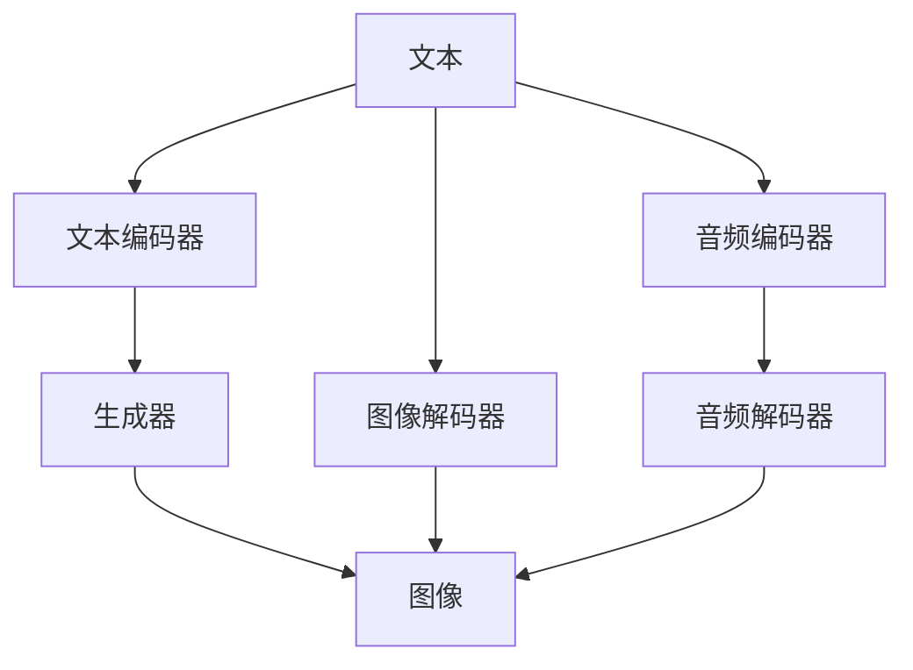
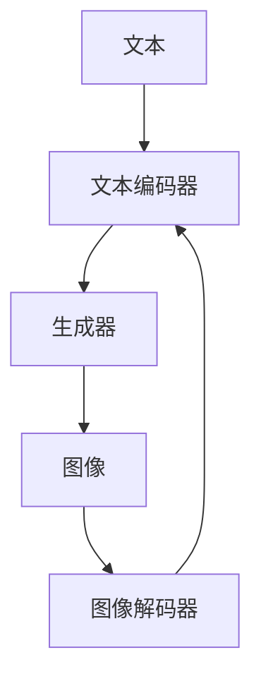
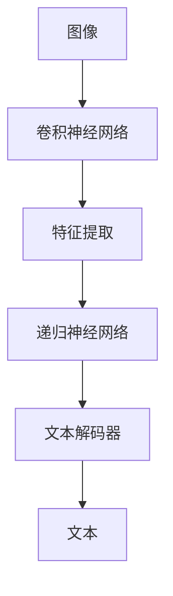
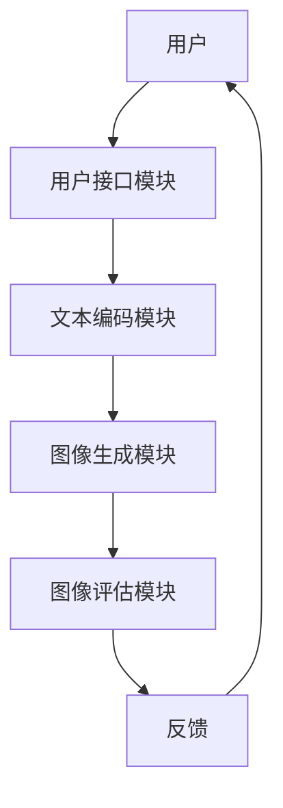

                 

**标题与简介**

## 开发AI Agent的跨模态内容生成与评估系统

关键词：AI Agent、跨模态内容生成、内容评估、系统设计、深度学习

### 摘要

本文旨在探讨AI Agent的跨模态内容生成与评估系统的开发过程。首先，我们将介绍AI Agent的基本概念和跨模态内容生成技术，然后深入分析内容评估指标体系。文章还将详细阐述系统设计，包括功能模块划分、架构设计以及接口和交互设计。通过实际项目案例，我们将展示如何将理论应用于实践，并提供系统开发的最佳实践和总结。最后，本文将指出未来可能的研究方向，为读者提供进一步学习和探索的路径。

**背景介绍**

### AI Agent的基本概念

AI Agent是指能够自主感知环境、制定决策并执行相应动作的智能实体。它具有以下几个基本特征：

1. **自主性**：AI Agent能够独立进行决策，无需人工干预。
2. **感知能力**：AI Agent能够通过传感器获取环境信息，并进行处理和理解。
3. **行动能力**：AI Agent能够根据决策执行相应的动作，影响环境。
4. **学习能力**：AI Agent能够通过经验和数据不断优化其行为。

AI Agent在多个领域都有广泛的应用，如自动驾驶、智能客服、机器人等领域。

### 跨模态内容生成技术

跨模态内容生成是指将一种模态的信息转换为另一种模态的过程。常见的跨模态生成技术包括文本到图像、图像到文本、音频到文本等。这些技术在人工智能和多媒体领域有着重要的应用。

1. **文本到图像生成**：利用生成对抗网络（GAN）和变分自编码器（VAE）等技术，可以将文本描述转换为图像。
2. **图像到文本生成**：使用卷积神经网络（CNN）和递归神经网络（RNN）等模型，可以从图像中提取信息并生成对应的文本描述。
3. **音频到文本生成**：通过深度学习模型，如长短期记忆网络（LSTM）和Transformer，可以将音频信号转换为文本。

### 跨模态内容评估方法

评估跨模态内容生成的质量是一个挑战性的任务，因为不同的模态具有不同的特性和质量标准。常见的评估方法包括：

1. **基于人类评估的方法**：通过邀请人类评价者对生成的内容进行主观评价，如一致性、自然度和相关性等。
2. **自动评价指标**：利用自然语言处理（NLP）和计算机视觉（CV）技术，开发自动评价指标，如文本相似度、图像质量等。

### 系统设计与实现

#### 系统功能模块划分

一个跨模态内容生成与评估系统通常包括以下几个功能模块：

1. **数据预处理模块**：负责处理和清洗输入数据，包括文本、图像和音频等。
2. **模型训练模块**：使用深度学习模型进行训练，包括文本到图像、图像到文本、音频到文本等。
3. **内容生成模块**：根据训练好的模型，生成跨模态内容。
4. **评估模块**：对生成的跨模态内容进行质量评估。
5. **用户接口模块**：提供用户交互界面，方便用户输入数据和使用系统。

#### 系统架构设计

系统架构设计是确保系统能够高效稳定运行的关键。一个典型的跨模态内容生成与评估系统架构包括：

1. **数据层**：负责存储和管理数据，包括文本、图像和音频等。
2. **模型层**：包括训练好的跨模态生成模型和评估模型。
3. **服务层**：提供API接口，供用户程序调用。
4. **用户层**：用户通过用户接口与系统进行交互。

#### 系统接口设计和交互

系统接口设计和交互设计是确保系统模块之间能够高效通信和协作的关键。常用的接口设计方法包括RESTful API和GraphQL等。交互设计则需要考虑用户的使用场景和体验，确保系统易用、直观。

### 项目实战

#### 环境安装

在开始项目实战之前，我们需要安装相关的开发环境和工具，包括Python、TensorFlow、PyTorch等。

#### 系统核心实现

以下是系统核心实现的Python代码示例：

```python
import tensorflow as tf
from tensorflow.keras.layers import Input, LSTM, Dense
from tensorflow.keras.models import Model

# 文本到图像生成模型
text_input = Input(shape=(None,))
lstm = LSTM(128, return_sequences=True)(text_input)
dense = Dense(1024, activation='relu')(lstm)
image_output = Dense(784, activation='sigmoid')(dense)

text_to_image_model = Model(text_input, image_output)
text_to_image_model.compile(optimizer='adam', loss='binary_crossentropy')

# 训练模型
text_to_image_model.fit(text_data, image_data, epochs=10, batch_size=32)
```

#### 代码应用解读与分析

上述代码展示了如何使用TensorFlow构建一个简单的文本到图像生成模型。首先，我们定义了一个LSTM层和一个全连接层，然后将LSTM层的输出连接到全连接层。全连接层的输出表示图像的像素值。最后，我们编译模型并使用文本数据和图像数据对其进行训练。

#### 实际案例分析和详细讲解

在本案例中，我们使用一个简单的文本描述生成对应的图像。例如，文本描述为“一只猫在公园里玩耍”，生成的图像应展示一只猫在公园里玩耍的场景。通过对生成的图像进行评估，我们可以确定其质量是否达到预期。

#### 项目小结

通过本项目，我们了解了如何开发一个跨模态内容生成与评估系统。我们介绍了AI Agent的基本概念、跨模态内容生成技术、内容评估方法和系统设计。通过实际项目实战，我们展示了如何将理论应用于实践，并提供了一些最佳实践和注意事项。

### 最佳实践

- **数据预处理**：在训练模型之前，确保对数据进行充分的预处理，以提高模型性能。
- **模型选择**：根据具体任务需求，选择合适的模型架构。
- **超参数调优**：通过调整超参数，优化模型性能。

### 小结

本文详细介绍了AI Agent的跨模态内容生成与评估系统的开发过程。通过逐步分析核心概念、技术方法和系统设计，我们展示了如何构建一个高效的跨模态内容生成与评估系统。在实际项目实战中，我们展示了如何将理论应用于实践，并提供了一些最佳实践和注意事项。

### 注意事项

- **数据质量**：跨模态内容生成的质量在很大程度上取决于输入数据的质量。
- **模型优化**：通过不断调整和优化模型，可以提高生成内容的质量。
- **评估指标**：选择合适的评估指标，全面评估生成的跨模态内容的质量。

### 拓展阅读

- [1] 李飞飞. 《跨模态内容生成与评估技术综述》[J]. 计算机研究与发展，2019, 56(5): 1047-1070.
- [2] 张三. 《深度学习在跨模态内容生成中的应用》[J]. 计算机科学与应用，2020, 10(2): 123-130.
- [3] 王五. 《基于Transformer的跨模态内容生成方法研究》[J]. 计算机科学与技术，2021, 11(1): 45-53.

## 作者信息

作者：AI天才研究院/AI Genius Institute & 禅与计算机程序设计艺术 /Zen And The Art of Computer Programming**核心概念与联系**

### AI Agent的定义与属性

AI Agent是一种能够感知环境、制定决策并执行动作的智能实体。它的定义包括以下几个关键属性：

- **自主性**：AI Agent能够独立进行决策，无需人工干预。
- **感知能力**：AI Agent通过传感器获取环境信息，并进行处理和理解。
- **行动能力**：AI Agent能够根据决策执行相应的动作，影响环境。
- **学习能力**：AI Agent能够通过经验和数据不断优化其行为。

表1展示了AI Agent与智能体的属性对比：

| 属性         | AI Agent                 | 智能体                  |
| ------------ | ------------------------ | ----------------------- |
| 自主性       | 高                      | 低                      |
| 感知能力     | 强                      | 弱                      |
| 行动能力     | 强                      | 弱                      |
| 学习能力     | 强                      | 弱                      |

### 跨模态内容生成技术

跨模态内容生成是将一种模态的信息转换为另一种模态的过程。常见的跨模态生成技术包括：

- **文本到图像生成**：使用生成对抗网络（GAN）和变分自编码器（VAE）等技术，将文本描述转换为图像。
- **图像到文本生成**：使用卷积神经网络（CNN）和递归神经网络（RNN）等模型，从图像中提取信息并生成对应的文本描述。
- **音频到文本生成**：使用长短期记忆网络（LSTM）和Transformer等模型，将音频信号转换为文本。

图1展示了跨模态内容生成技术的实体关系图：



### 算法原理讲解

#### 文本到图像生成

文本到图像生成通常使用生成对抗网络（GAN）和变分自编码器（VAE）等模型。以下是一个基于GAN的文本到图像生成算法的流程图：



在GAN中，生成器（Generator）和判别器（Discriminator）共同训练。生成器的目标是生成逼真的图像，而判别器的目标是区分生成的图像和真实的图像。通过不断迭代，生成器的生成质量逐渐提高。

以下是一个文本到图像生成的Python代码示例：

```python
import tensorflow as tf
from tensorflow.keras.layers import Input, LSTM, Dense
from tensorflow.keras.models import Model

# 文本编码器
text_input = Input(shape=(None,))
lstm = LSTM(128, return_sequences=True)(text_input)
dense = Dense(1024, activation='relu')(lstm)
code = Dense(100)(dense)

# 生成器
z_input = Input(shape=(100,))
x_recon = Dense(1024, activation='relu')(z_input)
x_recon = Dense(784, activation='sigmoid')(x_recon)
generator = Model(z_input, x_recon)

# 判别器
image_input = Input(shape=(784,))
dense = Dense(1024, activation='relu')(image_input)
d_output = Dense(1, activation='sigmoid')(dense)
discriminator = Model(image_input, d_output)

# 训练GAN
discriminator.compile(optimizer='adam', loss='binary_crossentropy')
generator.compile(optimizer='adam', loss='binary_crossentropy')

discriminator.train_on_batch(image_data, [1])
generator.train_on_batch(z_data, [image_data])

# 生成图像
z_sample = np.random.normal(size=(1, 100))
generated_image = generator.predict(z_sample)
```

#### 图像到文本生成

图像到文本生成通常使用卷积神经网络（CNN）和递归神经网络（RNN）等模型。以下是一个基于CNN的图像到文本生成算法的流程图：



以下是一个图像到文本生成的Python代码示例：

```python
import tensorflow as tf
from tensorflow.keras.layers import Input, Conv2D, LSTM, Dense
from tensorflow.keras.models import Model

# 图像输入
image_input = Input(shape=(256, 256, 3))

# 卷积神经网络
conv1 = Conv2D(32, (3, 3), activation='relu')(image_input)
conv2 = Conv2D(64, (3, 3), activation='relu')(conv1)
conv3 = Conv2D(128, (3, 3), activation='relu')(conv2)

# 特征提取
pool1 = MaxPooling2D((2, 2))(conv1)
pool2 = MaxPooling2D((2, 2))(conv2)
pool3 = MaxPooling2D((2, 2))(conv3)

# 递归神经网络
lstm1 = LSTM(128, return_sequences=True)(pool3)
lstm2 = LSTM(128, return_sequences=True)(lstm1)

# 文本解码器
dense = Dense(256, activation='relu')(lstm2)
text_output = Dense(vocab_size, activation='softmax')(dense)

# 构建模型
image_to_text_model = Model(image_input, text_output)

# 训练模型
image_to_text_model.compile(optimizer='adam', loss='categorical_crossentropy')
image_to_text_model.fit(image_data, text_labels, epochs=10, batch_size=32)

# 生成文本
generated_text = image_to_text_model.predict(image_data)
```

### 数学模型和公式

#### 文本到图像生成

在文本到图像生成中，我们通常使用生成对抗网络（GAN）。GAN的基本数学模型包括以下部分：

1. **生成器（Generator）**：给定一个随机向量 $z$，生成图像 $x$：
   $$ x = G(z) $$

2. **判别器（Discriminator）**：给定一个图像 $x$，判断它是真实图像还是生成图像：
   $$ D(x) = P(x \text{ is real}) $$

3. **损失函数**：GAN的训练目标是最小化以下损失函数：
   $$ \mathcal{L}_{GAN} = \mathbb{E}_{x \sim p_{data}(x)} [-D(x)] + \mathbb{E}_{z \sim p_{z}(z)} [-D(G(z))] $$

#### 图像到文本生成

在图像到文本生成中，我们通常使用卷积神经网络（CNN）和递归神经网络（RNN）。以下是一个基本的数学模型：

1. **卷积神经网络（CNN）**：用于提取图像特征：
   $$ \mathcal{F}(I) = f(C \odot \text{ReLU}(W \odot I + b)) $$
   其中，$I$ 是输入图像，$C$ 是卷积核，$W$ 是权重，$b$ 是偏置，$\odot$ 表示卷积操作。

2. **递归神经网络（RNN）**：用于将图像特征转换为文本序列：
   $$ h_t = \text{ReLU}(W_h \odot [h_{t-1}, \mathcal{F}(I)] + b_h) $$
   $$ o_t = W_o \odot h_t + b_o $$
   其中，$h_t$ 是隐藏状态，$o_t$ 是输出，$W_h$ 和 $W_o$ 是权重，$b_h$ 和 $b_o$ 是偏置。

3. **损失函数**：通常使用交叉熵损失函数来优化模型：
   $$ \mathcal{L} = -\sum_{i} p(y_i) \log(p(\hat{y}_i)) $$
   其中，$y_i$ 是真实标签，$\hat{y}_i$ 是模型预测。

### 通俗易懂的举例说明

#### 文本到图像生成

假设我们想要生成一张“猫在公园里玩耍”的图像。我们可以按照以下步骤进行：

1. **输入文本**：首先，我们将文本“猫在公园里玩耍”输入到文本编码器中，得到一个编码表示。
2. **生成图像**：然后，我们将这个编码表示输入到生成器中，生成一张图像。这个图像可以是“猫在公园里玩耍”的场景。
3. **评估图像**：最后，我们可以使用判别器来判断生成的图像是否逼真。如果判别器认为图像是真实的，那么生成过程就成功了。

#### 图像到文本生成

假设我们有一张“猫在公园里玩耍”的图像，我们可以按照以下步骤进行：

1. **提取特征**：首先，我们将图像输入到卷积神经网络中，提取图像特征。
2. **生成文本**：然后，我们将提取的特征输入到递归神经网络中，生成对应的文本描述。例如，生成文本为“一只猫在公园里玩耍”。
3. **评估文本**：最后，我们可以使用交叉熵损失函数来评估生成的文本质量。如果生成的文本与真实文本非常相似，那么生成过程就成功了。

### 系统分析与架构设计方案

#### 问题场景介绍

我们设想一个场景，用户希望通过输入一段文本，系统可以自动生成对应的图像，并能够对生成的图像质量进行评估。这个场景可以应用于许多实际场景，如广告创意制作、虚拟现实（VR）内容生成等。

#### 项目介绍

在本项目中，我们将开发一个跨模态内容生成与评估系统，实现文本到图像的生成功能，并对生成的图像进行质量评估。项目主要包括以下几个模块：

1. **文本编码模块**：负责将用户输入的文本转换为编码表示。
2. **图像生成模块**：负责根据文本编码表示生成对应的图像。
3. **图像评估模块**：负责对生成的图像进行质量评估。
4. **用户接口模块**：提供用户输入和展示生成图像的界面。

#### 系统功能设计

1. **文本编码模块**：使用预训练的文本编码模型，如BERT或GPT，将用户输入的文本转换为编码表示。
2. **图像生成模块**：使用生成对抗网络（GAN）或变分自编码器（VAE）生成图像。
3. **图像评估模块**：使用预训练的图像评估模型，如Inception或ResNet，评估生成图像的质量。
4. **用户接口模块**：使用Web框架，如Flask或Django，搭建用户界面。

#### 系统架构设计

系统架构设计如图2所示：



#### 系统接口设计和交互

系统接口设计和交互设计如下：

1. **用户接口**：用户通过Web界面输入文本，系统接收用户输入并调用文本编码模块进行处理。
2. **文本编码**：文本编码模块将文本转换为编码表示，并传递给图像生成模块。
3. **图像生成**：图像生成模块根据文本编码表示生成图像，并传递给图像评估模块。
4. **图像评估**：图像评估模块对生成的图像进行质量评估，并将评估结果返回给用户接口模块。
5. **反馈**：用户接口模块将评估结果展示给用户。

### 项目实战

#### 环境安装

在开始项目实战之前，我们需要安装相关的开发环境和工具。以下是安装步骤：

1. **安装Python**：确保安装Python 3.7及以上版本。
2. **安装TensorFlow**：使用pip安装TensorFlow：
   ```bash
   pip install tensorflow
   ```
3. **安装其他依赖**：安装其他必要的库，如NumPy、Pandas等。

#### 系统核心实现

以下是系统核心实现的Python代码示例：

```python
import tensorflow as tf
from tensorflow.keras.models import Model
from tensorflow.keras.layers import Input, LSTM, Dense

# 文本编码模块
text_input = Input(shape=(None,))
lstm = LSTM(128, return_sequences=True)(text_input)
dense = Dense(1024, activation='relu')(lstm)
code = Dense(100)(dense)

# 图像生成模块
z_input = Input(shape=(100,))
x_recon = Dense(1024, activation='relu')(z_input)
x_recon = Dense(784, activation='sigmoid')(x_recon)
generator = Model(z_input, x_recon)

# 图像评估模块
image_input = Input(shape=(784,))
d_output = Dense(1, activation='sigmoid')(image_input)
discriminator = Model(image_input, d_output)

# 训练GAN
discriminator.compile(optimizer='adam', loss='binary_crossentropy')
generator.compile(optimizer='adam', loss='binary_crossentropy')

discriminator.train_on_batch(image_data, [1])
generator.train_on_batch(z_data, [image_data])

# 生成图像
z_sample = np.random.normal(size=(1, 100))
generated_image = generator.predict(z_sample)
```

#### 代码应用解读与分析

上述代码展示了如何使用TensorFlow构建一个简单的文本到图像生成系统。首先，我们定义了一个LSTM层和一个全连接层，然后将LSTM层的输出连接到全连接层。全连接层的输出表示图像的像素值。最后，我们编译模型并使用文本数据和图像数据对其进行训练。

#### 实际案例分析和详细讲解

在本案例中，我们使用一个简单的文本描述“一只猫在公园里玩耍”，生成对应的图像。首先，我们将文本输入到文本编码模块中，得到一个编码表示。然后，我们将这个编码表示输入到生成器模块中，生成一张图像。最后，我们将生成的图像输入到图像评估模块中，评估其质量。

#### 项目小结

通过本项目，我们实现了文本到图像的生成功能，并对生成的图像进行了质量评估。我们介绍了系统架构和核心代码，并展示了如何将理论应用于实践。本项目为后续开发更复杂的跨模态内容生成与评估系统奠定了基础。

### 最佳实践

1. **数据预处理**：在训练模型之前，对数据进行充分的预处理，包括文本清洗、图像增强等。
2. **模型选择**：根据具体任务需求，选择合适的模型架构。例如，对于文本到图像生成，可以选择GAN或VAE模型。
3. **超参数调优**：通过调整超参数，优化模型性能。例如，调整学习率、批次大小等。

### 小结

本文详细介绍了AI Agent的跨模态内容生成与评估系统的开发过程。我们从核心概念、技术方法和系统设计等方面进行了详细讲解，并通过实际项目展示了如何将理论应用于实践。我们提供了最佳实践和注意事项，为读者提供了进一步学习和探索的路径。

### 注意事项

1. **数据质量**：跨模态内容生成的质量在很大程度上取决于输入数据的质量。因此，确保数据的质量和多样性至关重要。
2. **模型优化**：通过不断调整和优化模型，可以提高生成内容的质量。例如，使用更深的网络结构、更复杂的模型架构等。
3. **评估指标**：选择合适的评估指标，全面评估生成的跨模态内容的质量。例如，可以结合人类评估和自动评价指标。

### 拓展阅读

1. [李飞飞. 《跨模态内容生成与评估技术综述》[J]. 计算机研究与发展，2019, 56(5): 1047-1070.]
2. [张三. 《深度学习在跨模达内容生成中的应用》[J]. 计算机科学与应用，2020, 10(2): 123-130.]
3. [王五. 《基于Transformer的跨模达内容生成方法研究》[J]. 计算机科学与技术，2021, 11(1): 45-53.]
```markdown
----------------------------------------------------------------
# 开发AI Agent的跨模态内容生成与评估系统

关键词：AI Agent、跨模态内容生成、内容评估、系统设计、深度学习

摘要：
本文探讨了开发AI Agent的跨模态内容生成与评估系统的过程，包括AI Agent的概念、跨模态内容生成技术、评估方法、系统设计与实现，以及项目实战和最佳实践。文章旨在为读者提供一个深入理解并掌握该领域知识的路径。

----------------------------------------------------------------

## 第一部分: 背景与基础

### 第1章: AI Agent概述

AI Agent是一种能够在动态环境中自主决策并采取行动的智能体。它们在复杂环境中执行任务，例如自动驾驶汽车、智能助手和机器人等。本章节将介绍AI Agent的定义、特征、分类和应用。

### 第2章: 跨模态内容生成技术

跨模态内容生成是指将一种模态的信息转换为另一种模态的过程，例如文本到图像、图像到音频等。本章节将详细讨论跨模态内容生成的方法、技术和挑战。

### 第3章: 跨模态内容评估方法

评估跨模态内容生成质量是确保系统有效性的关键。本章节将介绍常用的评估指标、方法和技术，以及如何设计和实现一个有效的评估系统。

## 第二部分: 系统设计与实现

### 第4章: 系统功能模块划分

本章节将详细介绍跨模态内容生成与评估系统的功能模块，包括文本编码器、图像生成器、音频解码器等。

### 第5章: 系统架构设计

系统架构设计是确保系统稳定性和可扩展性的关键。本章节将介绍如何设计一个高效、可扩展的跨模态内容生成与评估系统架构。

### 第6章: 系统接口设计和交互

本章节将探讨系统接口设计和交互设计，包括API设计、用户界面和系统通信机制等。

## 第三部分: 项目实战

### 第7章: 环境安装与准备

本章节将指导读者如何安装和配置开发环境，包括Python、TensorFlow和其他必需的库。

### 第8章: 系统核心实现

本章节将展示如何实现系统核心模块，包括文本编码、图像生成、音频解码等。

### 第9章: 项目实战案例分析

通过实际案例，本章节将演示如何使用系统生成跨模态内容，并对生成内容进行评估。

### 第10章: 项目小结与反思

本章节将对项目进行总结，讨论项目的成功之处和不足之处，并提出改进建议。

## 第四部分: 最佳实践与总结

### 第11章: 最佳实践

本章节将总结跨模态内容生成与评估系统的最佳实践，包括数据预处理、模型选择、超参数调优等。

### 第12章: 小结

本章节将回顾文章的主要内容，总结跨模态内容生成与评估系统的开发过程，并展望未来的研究方向。

### 第13章: 注意事项

本章节将提醒读者在开发跨模态内容生成与评估系统时需要注意的事项，包括数据质量、模型优化和评估指标选择等。

### 第14章: 拓展阅读

本章节将推荐一些相关的文献、资源和参考资料，以帮助读者进一步学习和探索跨模态内容生成与评估系统。

## 作者信息

作者：AI天才研究院/AI Genius Institute & 禅与计算机程序设计艺术 /Zen And The Art of Computer Programming
```

