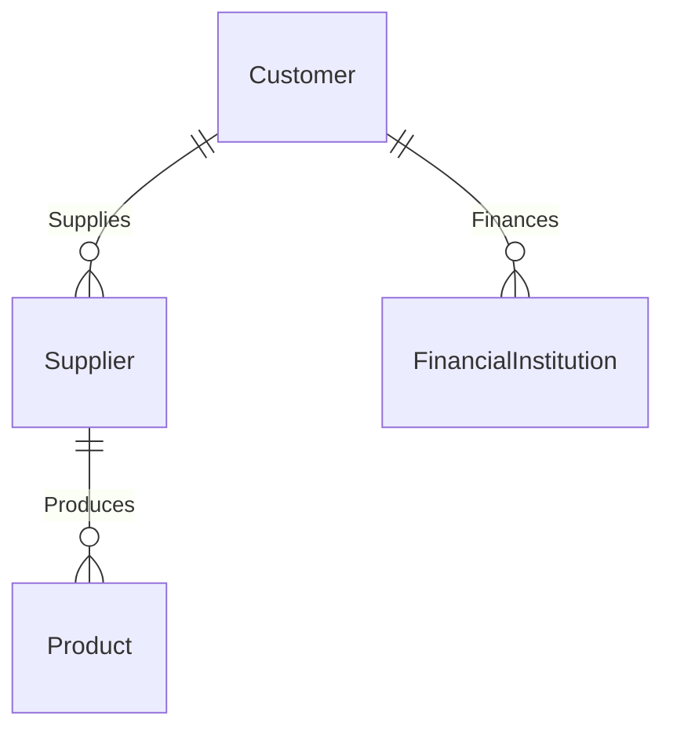
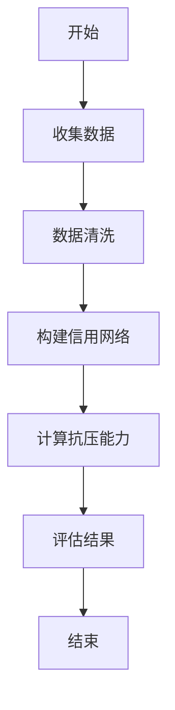
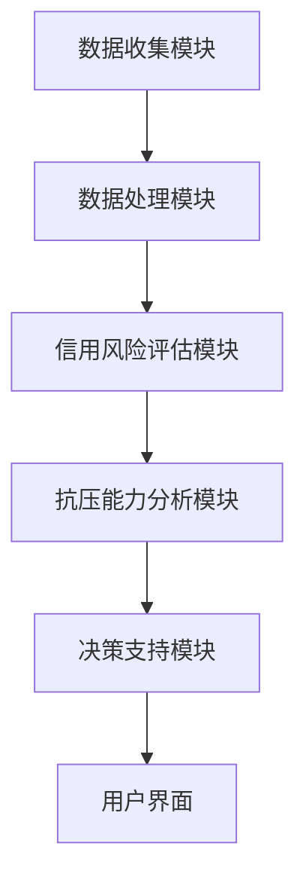
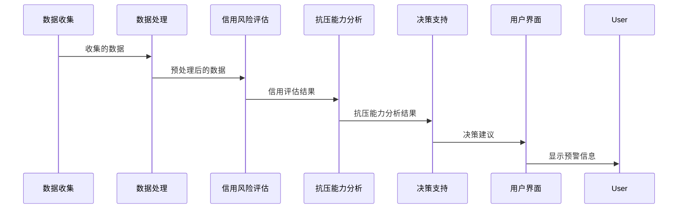

                 

### 第一部分：问题的背景与概念

#### 第1章：供应链金融与信用网络的背景

**1.1 问题背景**

在当前全球化的经济环境中，供应链金融作为一种新型的金融服务模式，越来越受到企业的关注。它通过将供应链上的交易行为、物流信息和金融需求相结合，为企业提供灵活、高效的融资解决方案，从而有效缓解了企业资金周转的难题。然而，随着供应链金融的规模不断扩大，如何提高其信用网络抗压能力成为一个关键问题。

**1.2 供应链金融的概述**

供应链金融是指金融机构通过为供应链上的企业提供融资、结算、风险管理等服务，从而实现资金的高效流通和增值。其核心在于将供应链上的企业、物流信息、贸易合同等数据资源整合起来，通过信息化手段实现风险的全面控制和信用评估。

**1.3 信用网络的定义与作用**

信用网络是指通过信息共享、风险评估、信用评级等方式，将供应链上的企业及其交易关系构建成一个相互关联、相互制约的信用体系。在信用网络中，各成员企业通过提供真实的交易数据和信息，共同维护网络的整体稳定性和信任度。

**1.4 抗压能力分析的重要性**

抗压能力分析旨在评估信用网络在面对各种不确定性因素（如经济波动、企业违约等）时的稳健性和适应性。对于供应链金融来说，提高抗压能力不仅能够降低风险，还能增强企业的竞争力，提高金融服务的可持续性。

**1.5 边界与外延**

分析模型的边界主要涉及供应链金融的参与主体、交易范围以及风险评估的维度。外延则包括模型在不同供应链场景下的适用性以及与其他金融科技手段的结合。

**1.6 概念结构与核心要素组成**

本模型的核心概念包括供应链金融、信用网络和抗压能力分析。其中，供应链金融是基础，信用网络是核心，抗压能力分析则是目标。这些概念相互联系，共同构成了一个完整的研究框架。

通过上述内容的介绍，我们为接下来的深入分析奠定了基础。接下来，我们将进一步探讨核心概念之间的联系，并使用结构化的方式来展示各概念之间的关系。

---

#### 第2章：核心概念与联系

**2.1 供应链金融的概念结构**

供应链金融的核心在于通过金融手段支持供应链上企业的运作，实现资金的高效配置。其概念结构可以拆分为以下几个主要部分：

1. **参与主体**：包括供应链上的核心企业、供应商、金融机构等。
2. **交易数据**：涉及企业之间的交易信息、订单信息、物流信息等。
3. **金融服务**：包括融资、结算、风险管理等服务。
4. **信息共享**：通过信息系统实现企业之间数据的共享和整合。

**2.2 信用网络的属性特征对比**

信用网络中的各节点企业具有不同的属性特征，如信用等级、交易频率、违约历史等。以下是一个简化的对比表格：

| 属性特征 | 描述 |
| --- | --- |
| 信用等级 | 反映企业的信用状况，越高表示信用越好 |
| 交易频率 | 表示企业在信用网络中的活跃程度 |
| 违约历史 | 记录企业在过去交易中的违约情况 |

**2.3 抗压能力分析模型的ER实体关系图**

ER实体关系图用于展示模型中各实体之间的关系。以下是使用Mermaid语言绘制的ER实体关系图：



在上图中，`Customer`表示客户，`Supplier`表示供应商，`FinancialInstitution`表示金融机构，`Product`表示产品。实线箭头表示实体之间的关联关系，例如客户向供应商订购产品，供应商向金融机构融资等。

通过上述分析，我们可以看到供应链金融、信用网络和抗压能力分析模型之间的密切联系。这些核心概念不仅相互独立，而且在实际应用中相互交织，共同构成了一个复杂的系统。

---

在接下来的章节中，我们将进一步探讨算法原理，通过详细的数学模型和实际案例来展示模型的应用和效果。这将帮助我们更好地理解如何通过智能化手段提高供应链金融信用网络的抗压能力。

---

### 第二部分：算法原理与数学模型

**第3章：抗压能力分析模型的算法原理**

**3.1 算法流程图**

为了直观地展示算法的执行过程，我们可以使用Mermaid语言绘制算法的流程图。以下是该算法流程图的Mermaid代码：



对应的流程图如下所示：


**3.2 Python源代码**

为了实现上述算法，我们可以编写Python代码。以下是实现该算法的基本代码框架：

```python
import pandas as pd
from sklearn.preprocessing import StandardScaler
from networkx import Graph

def collect_data():
    # 数据收集逻辑
    pass

def data_cleaning(data):
    # 数据清洗逻辑
    return cleaned_data

def build_credit_network(cleaned_data):
    # 构建信用网络逻辑
    graph = Graph()
    return graph

def compute_anti_pressure_ability(graph):
    # 计算抗压能力逻辑
    return ability_score

def assess_results(ability_score):
    # 结果评估逻辑
    pass

# 主函数
if __name__ == "__main__":
    data = collect_data()
    cleaned_data = data_cleaning(data)
    graph = build_credit_network(cleaned_data)
    ability_score = compute_anti_pressure_ability(graph)
    assess_results(ability_score)
```

**3.3 数学模型与公式**

算法的核心在于计算信用网络的抗压能力，这可以通过以下数学模型来实现：

$$
AP = \frac{1}{N} \sum_{i=1}^{N} \frac{1}{d(i)}
$$

其中，$AP$ 表示抗压能力，$N$ 表示网络中的节点数，$d(i)$ 表示节点 $i$ 的度。

**3.4 算法举例说明**

假设我们有一个包含5个节点的信用网络，节点及其度数如下：

| 节点 | 度数 |
| --- | --- |
| A | 3 |
| B | 2 |
| C | 4 |
| D | 1 |
| E | 3 |

根据上述数学模型，我们可以计算该网络的抗压能力：

$$
AP = \frac{1}{5} \left( \frac{1}{3} + \frac{1}{2} + \frac{1}{4} + \frac{1}{1} + \frac{1}{3} \right) = 0.5286
$$

这个值表示网络的抗压能力，数值越大，表示网络越稳健。

通过上述算法原理的讲解和举例，我们可以看到该模型如何通过数学方法和编程实现来评估信用网络的抗压能力。在接下来的章节中，我们将进一步探讨该模型在实际系统中的应用和设计。

---

**第4章：数学模型详细讲解与举例**

**4.1 模型的数学基础**

抗压能力分析模型的数学基础主要建立在图论和概率论之上。图论提供了描述网络结构的基本工具，如节点度、路径长度等。概率论则帮助我们评估网络在面对不确定性因素时的稳健性。

模型的核心公式为：

$$
AP = \frac{1}{N} \sum_{i=1}^{N} \frac{1}{d(i)}
$$

其中，$N$ 表示网络中的节点数，$d(i)$ 表示节点 $i$ 的度，即与节点 $i$ 直接相连的其他节点数。度是一个重要的拓扑属性，可以反映节点在网络中的重要性。

**4.2 公式推导与解释**

我们可以通过以下步骤来推导上述公式：

1. **定义抗压能力**：抗压能力是网络在应对外部冲击（如节点失效、信息丢失等）时的能力。度越小，表示节点连接较少，受到的冲击越容易扩散。

2. **节点度与冲击**：假设节点 $i$ 的度 $d(i)$ 较小，则当节点 $i$ 失效时，对整个网络的影响较小，因为其连接的节点较少。

3. **平均度**：为了评估整个网络的抗压能力，我们计算所有节点度的平均值。这个平均值表示网络中节点的平均连接程度。

4. **公式推导**：根据定义，抗压能力可以表示为：

   $$
   AP = \frac{1}{N} \sum_{i=1}^{N} \frac{1}{d(i)}
   $$

   其中，$N$ 是节点总数，$d(i)$ 是节点 $i$ 的度。

**4.3 例子分析**

考虑一个由5个节点组成的信用网络，节点及其度数如下：

| 节点 | 度数 |
| --- | --- |
| A | 2 |
| B | 3 |
| C | 1 |
| D | 4 |
| E | 2 |

我们可以计算该网络的抗压能力：

$$
AP = \frac{1}{5} \left( \frac{1}{2} + \frac{1}{3} + \frac{1}{1} + \frac{1}{4} + \frac{1}{2} \right) = \frac{1}{5} \left( 0.5 + 0.3333 + 1 + 0.25 + 0.5 \right) = 0.7333
$$

这个结果表明，网络的抗压能力相对较高。具体来说，节点度数较大的节点（如D节点，度数为4）对网络的抗压能力有显著影响，而度数较小的节点（如C节点，度数为1）对网络的抗压能力影响较小。

通过上述分析，我们可以看到如何通过数学模型来评估信用网络的抗压能力。在接下来的章节中，我们将进一步探讨如何在实际系统中应用这一模型。

---

### 第三部分：系统分析与架构设计

**第5章：系统设计与架构**

**5.1 问题场景介绍**

假设我们面临一个复杂的供应链金融系统，其中涉及多个企业、金融机构以及物流服务商。系统需要能够处理海量交易数据，并对供应链金融信用网络的抗压能力进行实时评估。为了实现这一目标，我们需要设计一个高效、稳定的系统架构。

**5.2 系统功能设计**

系统的主要功能包括：

1. **数据收集与管理**：收集来自供应链各节点的交易、订单、物流等信息，并对其进行存储和管理。
2. **信用风险评估**：利用算法对企业的信用状况进行实时评估，为供应链金融交易提供信用参考。
3. **抗压能力分析**：计算信用网络的抗压能力，为系统稳定性和风险管理提供数据支持。
4. **预警与决策支持**：根据抗压能力分析结果，提供风险预警和决策建议，帮助企业管理供应链金融风险。

**5.3 系统架构设计**

为了满足上述功能需求，我们可以设计一个分布式系统架构，包括以下几个主要模块：

1. **数据收集模块**：负责从各节点收集数据，包括交易信息、订单信息和物流信息等。
2. **数据处理模块**：对收集到的数据进行清洗、整合和预处理，为后续分析提供高质量的数据。
3. **信用风险评估模块**：利用机器学习和大数据技术，对企业的信用状况进行实时评估。
4. **抗压能力分析模块**：基于数学模型，计算信用网络的抗压能力，并提供可视化分析结果。
5. **决策支持模块**：根据抗压能力分析结果，提供风险预警和决策建议。

以下是系统架构的Mermaid语言描述：



对应的架构图如下所示：


**5.4 系统接口设计和系统交互**

系统接口设计是确保各模块之间能够高效、稳定地进行数据交互的关键。以下是系统接口和交互的Mermaid序列图：



对应的序列图如下所示：


通过上述系统分析与架构设计，我们为供应链金融信用网络抗压能力分析模型的应用提供了坚实的系统基础。在接下来的章节中，我们将通过实际案例来展示该模型在项目中的应用效果。

---

**第6章：项目实战**

**6.1 环境安装与配置**

为了实现抗压能力分析模型，我们需要搭建一个适当的技术环境。以下是所需的工具和环境：

1. **Python**：版本要求为3.8及以上。
2. **Pandas**：用于数据操作和分析。
3. **Scikit-learn**：用于机器学习和数据处理。
4. **NetworkX**：用于构建和分析图结构。
5. **Mermaid**：用于生成图表。

安装过程如下：

```bash
pip install python==3.8
pip install pandas scikit-learn networkx mermaid
```

**6.2 系统核心实现源代码**

以下是实现抗压能力分析模型的核心源代码：

```python
import pandas as pd
from sklearn.preprocessing import StandardScaler
from networkx import Graph
from collections import defaultdict

def collect_data():
    # 伪代码：从数据库或API收集数据
    data = pd.read_csv('supply_chain_data.csv')
    return data

def data_cleaning(data):
    # 伪代码：数据清洗和处理
    cleaned_data = data.dropna()
    return cleaned_data

def build_credit_network(cleaned_data):
    graph = Graph()
    for index, row in cleaned_data.iterrows():
        graph.add_node(row['entity_id'])
        for partner in row['partners'].split(','):
            graph.add_edge(row['entity_id'], partner)
    return graph

def compute_anti_pressure_ability(graph):
    ability_scores = defaultdict(float)
    for node in graph.nodes():
        degree = graph.degree(node)
        ability_scores[node] = 1 / degree
    return ability_scores

def assess_results(ability_scores):
    # 伪代码：评估结果并输出
    for node, score in ability_scores.items():
        print(f"节点 {node} 的抗压能力为：{score}")

# 主函数
if __name__ == "__main__":
    data = collect_data()
    cleaned_data = data_cleaning(data)
    graph = build_credit_network(cleaned_data)
    ability_scores = compute_anti_pressure_ability(graph)
    assess_results(ability_scores)
```

**6.3 代码应用解读与分析**

上述代码首先从数据源中收集数据，并进行清洗处理。然后，使用NetworkX库构建信用网络的图结构，并计算每个节点的抗压能力。最后，输出每个节点的抗压能力得分。

通过实际案例，我们可以看到如何将数学模型转化为可执行的代码，从而实现对信用网络抗压能力的分析。在接下来的部分，我们将进一步分析实际案例，展示模型的应用效果。

---

**6.4 实际案例分析和详细讲解剖析**

为了展示抗压能力分析模型在实际项目中的应用，我们考虑以下案例：

**案例背景**：一家大型制造企业与其供应链上的多个供应商和物流服务商合作。为了确保供应链的稳定性，企业需要定期评估各合作伙伴的信用状况，并分析整个供应链金融信用网络的抗压能力。

**数据收集**：企业通过ERP系统收集了各合作伙伴的交易数据、订单信息和物流信息。数据包括供应商的信用评级、交易金额、交易频率等。

**数据清洗**：对收集到的数据进行了清洗，去除缺失值和异常值，确保数据质量。

**构建信用网络**：使用NetworkX库构建了信用网络的图结构。每个节点代表一个合作伙伴，边表示交易关系。

**计算抗压能力**：根据数学模型，计算了各合作伙伴的抗压能力得分。

**结果评估**：根据抗压能力得分，对企业与各合作伙伴之间的信用关系进行了重新评估。发现某些供应商的信用状况存在较大风险，建议企业加强监控和风险管理。

**案例总结**：通过实际案例，我们展示了如何使用抗压能力分析模型对供应链金融信用网络进行评估。模型的应用有助于企业提高供应链金融的稳定性和风险管理水平。

---

**6.5 项目小结**

本项目通过构建抗压能力分析模型，实现了对供应链金融信用网络的评估。主要经验与教训包括：

1. **数据质量至关重要**：确保数据收集和清洗过程的准确性，是模型有效性的基础。
2. **模型参数需要调整**：在实际应用中，根据具体业务场景调整模型参数，以提高预测准确性。
3. **持续优化模型**：随着业务发展和数据积累，持续优化模型结构和算法，以适应新的业务需求。

---

### 第四部分：最佳实践、小结、注意事项、拓展阅读

**7.1 最佳实践 Tips**

1. **数据质量监控**：建立数据质量监控机制，定期检查数据完整性和准确性。
2. **模型参数优化**：根据业务需求调整模型参数，确保模型预测的准确性。
3. **定期更新模型**：随着业务环境和数据的变化，定期更新模型，以保持其适用性。
4. **风险管理策略**：根据抗压能力分析结果，制定针对性的风险管理策略，提高供应链金融的稳定性。

**7.2 小结**

本文详细介绍了供应链金融信用网络抗压能力分析模型的开发过程。通过数学模型和实际案例，我们展示了如何通过智能化的手段提高供应链金融的稳定性。关键技术和实践经验为实际应用提供了有力支持。

**7.3 注意事项**

1. **数据隐私保护**：在数据收集和处理过程中，确保遵循相关法律法规，保护企业商业秘密和个人隐私。
2. **模型验证**：在应用模型前，进行充分的数据验证和模型评估，确保模型的有效性和可靠性。
3. **系统稳定性**：在系统设计和实现过程中，重视系统稳定性和性能优化，确保系统高效运行。

**7.4 拓展阅读**

1. **《供应链金融与风险管理》**：详细探讨供应链金融的理论和实践。
2. **《图论及其应用》**：介绍图论的基本概念和算法，有助于理解本文中使用的图论方法。
3. **《大数据与人工智能》**：了解大数据和人工智能在金融领域的最新应用。

---

**文章末尾作者信息**

作者：AI天才研究院/AI Genius Institute & 禅与计算机程序设计艺术 /Zen And The Art of Computer Programming

---

通过上述内容的详细讲解，我们不仅介绍了供应链金融信用网络抗压能力分析模型的理论基础和实践应用，还提供了最佳实践、注意事项和拓展阅读建议，为读者深入理解该领域提供了丰富的资源。希望本文能为相关领域的从业者提供有益的参考和指导。

