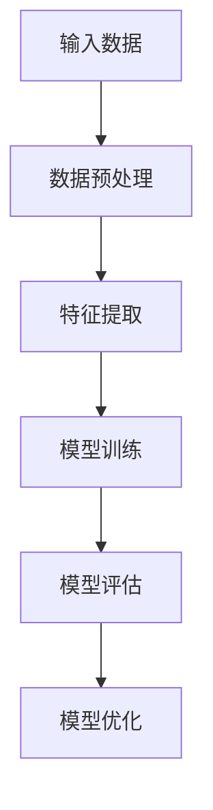
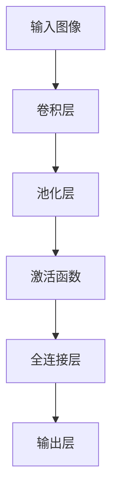
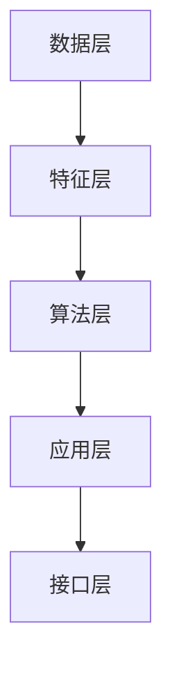
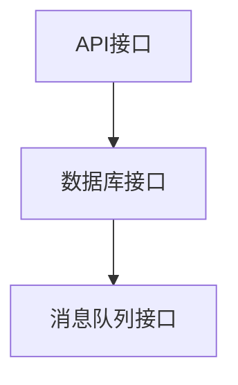
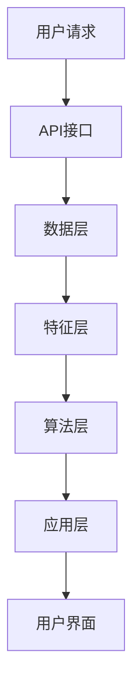

                 

### 开发智能化的金融市场微观结构变化检测工具

随着金融市场日益复杂化，对市场微观结构的分析变得愈发重要。然而，传统的检测工具在面对海量数据和实时变化时显得力不从心。为了应对这一挑战，本文将探讨如何开发一款智能化的金融市场微观结构变化检测工具。该工具将利用先进的人工智能技术，如机器学习和深度学习，来实现对市场数据的自动化分析和预测。通过本文的逐步分析，我们将详细了解设计这款工具的动机、核心概念、算法原理、系统架构以及实际应用。

### 关键词

- 金融市场
- 微观结构变化
- 智能检测
- 机器学习
- 深度学习
- 数据分析
- 系统架构

### 摘要

本文旨在探讨如何开发一款智能化的金融市场微观结构变化检测工具。首先，我们介绍了金融市场微观结构变化的重要性以及当前检测工具的局限性。接着，我们阐述了智能化检测工具的必要性，并概述了其核心概念和关联方法。随后，我们详细讲解了机器学习和深度学习算法的原理，并展示了如何将这些算法应用于金融市场微观结构变化检测。在此基础上，我们分析了系统架构设计的关键要素，包括系统功能、架构和接口设计。最后，通过一个实际项目案例，我们展示了如何实现该工具的开发和应用，并总结了最佳实践和注意事项。

### 第一部分：背景介绍

#### 1.1 金融市场微观结构变化的重要性

金融市场是现代经济体系的核心，其稳定运行对整个社会的发展和稳定至关重要。金融市场微观结构是指构成市场的各个组成部分及其相互作用的方式。这些组成部分包括交易者、金融机构、投资者、市场信息、交易机制等。微观结构变化不仅反映了市场参与者行为的动态变化，还揭示了市场潜在的风险和机会。

在过去的几十年中，金融市场的复杂性不断增加，交易方式、交易规模和交易速度都发生了巨大变化。例如，高频交易、算法交易等新型交易方式的出现，使得市场数据量和数据频率大大增加。此外，全球金融市场之间的相互联系和影响也变得更加紧密，导致金融市场的不确定性和风险增加。因此，对金融市场微观结构变化的监测和预测成为金融研究和实践中的重要课题。

微观结构变化的重要性体现在以下几个方面：

1. **风险监测**：通过监测市场微观结构变化，可以及时发现市场潜在的风险，如市场泡沫、交易异常等，为投资者和监管机构提供预警。
2. **策略优化**：微观结构变化提供了丰富的市场信息，有助于投资者制定和调整交易策略，提高投资收益。
3. **监管有效性**：监管机构通过监测市场微观结构变化，可以更有效地监督市场行为，维护市场秩序。
4. **市场预测**：通过对市场微观结构变化的长期监测和分析，可以预测市场的未来走势，为宏观经济政策制定提供依据。

#### 1.2 当前金融市场微观结构检测工具的局限性

尽管金融市场微观结构变化的重要性日益凸显，但现有的检测工具却面临许多局限性。以下是当前检测工具的一些主要问题：

1. **数据量限制**：传统的检测工具往往依赖于手动数据收集和处理，难以应对海量的市场数据。这导致检测工具的实时性和准确性受限。
2. **分析能力不足**：现有的检测工具多采用简单的统计方法，难以深入挖掘市场数据的复杂关系和潜在模式。
3. **交互性差**：许多检测工具界面复杂，操作不便，用户难以快速获取所需信息。
4. **适应性差**：面对市场环境的变化，传统检测工具难以灵活调整，难以适应新型交易方式和市场规则。

#### 1.3 智能化检测工具的必要性

为了克服传统检测工具的局限性，开发智能化检测工具变得至关重要。智能化检测工具利用人工智能技术，如机器学习和深度学习，能够实现以下目标：

1. **实时数据处理**：通过自动化数据收集和处理，智能化检测工具能够实时分析市场数据，提供即时的风险预警和交易策略建议。
2. **深度分析能力**：利用机器学习和深度学习算法，智能化检测工具可以挖掘市场数据的深层次关系和潜在模式，提高分析准确性。
3. **交互性增强**：智能化检测工具通常具备友好的用户界面，用户可以方便地配置参数、查看分析结果和调整策略。
4. **自适应能力**：通过持续学习和优化，智能化检测工具能够适应市场环境的变化，保持高效的检测能力。

综上所述，开发智能化金融市场微观结构变化检测工具是应对金融市场复杂性和不确定性挑战的必要手段。接下来，我们将进一步探讨该工具的核心概念和关联方法。

### 第二部分：核心概念与联系

在开发智能化金融市场微观结构变化检测工具的过程中，理解核心概念和它们之间的联系至关重要。这一部分将详细介绍金融市场微观结构的概念、数据来源和类型，以及智能化检测方法的组成部分。

#### 2.1 金融市场微观结构

金融市场微观结构是指构成金融市场的各个要素及其相互作用的细节。这些要素包括交易者、交易机制、市场信息、交易成本等。微观结构分析旨在揭示市场参与者的行为模式、交易流程和市场动态。

**定义与特征**：

1. **交易者**：包括个人投资者、机构投资者、做市商等。交易者的行为对市场微观结构有直接影响。
2. **交易机制**：包括拍卖机制、做市商机制、电子交易系统等。不同的交易机制会影响市场的流动性、价格发现效率等。
3. **市场信息**：包括价格、交易量、新闻事件、政策变化等。市场信息的流动和影响是微观结构分析的核心内容。
4. **交易成本**：包括交易佣金、税收、信息成本等。交易成本的高低直接影响市场参与者的交易决策。

**数据来源与类型**：

金融市场微观结构数据来源广泛，主要包括以下几个方面：

1. **交易数据**：如交易价格、交易量、交易时间等。这些数据可以来自交易所、交易系统等。
2. **市场指标**：如市场深度、价格波动率、交易频率等。这些指标可以反映市场的流动性、活跃度等。
3. **新闻事件**：如政策发布、公司公告、经济数据发布等。这些事件可能会对市场产生短期或长期影响。
4. **社交媒体数据**：如股票讨论区、社交媒体平台上的股票相关讨论等。这些数据可以反映市场情绪和预期。

#### 2.2 智能化检测方法

智能化检测方法是指利用机器学习和深度学习等人工智能技术，对金融市场微观结构变化进行分析和预测的方法。该方法包括数据预处理、特征提取、模型选择与训练、模型评估与优化等步骤。

**数据预处理**：

数据预处理是智能化检测的基础步骤，主要包括数据清洗、归一化、缺失值处理等。清洗数据可以去除噪声和异常值，归一化可以使得不同特征具有相似的量级，缺失值处理可以填补缺失数据或删除含有缺失值的样本。

**特征提取**：

特征提取是智能化检测的关键步骤，目的是从原始数据中提取出对分析任务有价值的特征。常用的特征提取方法包括统计特征提取、文本特征提取、图像特征提取等。

**模型选择与训练**：

在模型选择方面，可以根据问题的特点选择不同的算法，如线性回归、决策树、支持向量机、神经网络等。在模型训练过程中，需要通过交叉验证、超参数调优等方法来优化模型性能。

**模型评估与优化**：

模型评估是检验模型性能的重要步骤，常用的评估指标包括准确率、召回率、F1分数等。模型优化可以通过调整模型参数、增加训练数据、使用更先进的算法等方法来提高模型性能。

**核心概念与联系**：

金融市场微观结构变化检测涉及多个核心概念，如交易者行为、交易机制、市场信息等。这些概念相互关联，共同构成了市场微观结构的复杂体系。智能化检测方法通过数据预处理、特征提取、模型训练和评估等步骤，将这些核心概念转化为可量化的分析结果。例如，通过分析交易者的交易行为，可以预测市场趋势；通过分析交易机制，可以评估市场流动性。

总的来说，金融市场微观结构变化检测工具的核心概念和关联方法构成了一个有机整体，相互支持、相互补充。理解这些概念和方法的联系，有助于我们更好地设计并实现智能化检测工具。

### 第三部分：算法原理讲解

在开发智能化的金融市场微观结构变化检测工具时，算法原理的讲解至关重要。本部分将详细介绍机器学习和深度学习算法的基本原理，并通过具体的算法流程图和实例说明，帮助读者深入理解这些算法在实际应用中的运作方式。

#### 3.1 算法原理概述

**机器学习算法**：机器学习算法是一种通过数据学习规律和模式，从而进行预测或分类的方法。常见的机器学习算法包括线性回归、决策树、支持向量机、随机森林等。

**深度学习算法**：深度学习算法是一种基于多层神经网络的学习方法，通过层层提取特征，实现复杂任务的学习。常见的深度学习算法包括卷积神经网络（CNN）、循环神经网络（RNN）和生成对抗网络（GAN）等。

#### 3.2 核心算法讲解

**3.2.1 机器学习算法**

**算法流程图**：

以下是一个简单的线性回归算法流程图，使用Mermaid语法表示：



**数学模型与公式**：

线性回归的数学模型可以表示为：

\[ y = \beta_0 + \beta_1x + \epsilon \]

其中，\( y \) 是因变量，\( x \) 是自变量，\( \beta_0 \) 和 \( \beta_1 \) 是模型的参数，\( \epsilon \) 是误差项。

**实例说明**：

假设我们有一个简单的线性回归问题，目标是预测某个金融市场的价格。我们可以使用以下Python代码实现线性回归模型：

```python
import numpy as np
from sklearn.linear_model import LinearRegression

# 创建样本数据
X = np.array([[1], [2], [3], [4], [5]])
y = np.array([1, 2, 2.5, 4, 5])

# 训练模型
model = LinearRegression()
model.fit(X, y)

# 预测结果
predictions = model.predict(X)

# 输出预测结果
print(predictions)
```

**3.2.2 深度学习算法**

**算法流程图**：

以下是一个简单的卷积神经网络（CNN）算法流程图，使用Mermaid语法表示：



**数学模型与公式**：

卷积神经网络的数学模型可以表示为：

\[ \text{Output} = \text{ReLU}(\text{Conv}(\text{Input}) + \text{Bias}) \]

其中，\(\text{ReLU}\) 是ReLU激活函数，\(\text{Conv}\) 是卷积操作，\(\text{Bias}\) 是偏置项。

**实例说明**：

假设我们有一个简单的图像分类问题，目标是识别一张金融市场的交易图。我们可以使用以下Python代码实现CNN模型：

```python
import tensorflow as tf
from tensorflow.keras import layers

# 创建模型
model = tf.keras.Sequential([
    layers.Conv2D(32, (3, 3), activation='relu', input_shape=(28, 28, 1)),
    layers.MaxPooling2D((2, 2)),
    layers.Flatten(),
    layers.Dense(128, activation='relu'),
    layers.Dense(10, activation='softmax')
])

# 编译模型
model.compile(optimizer='adam',
              loss='categorical_crossentropy',
              metrics=['accuracy'])

# 训练模型
model.fit(X_train, y_train, epochs=5, batch_size=64)
```

通过以上实例，我们可以看到机器学习和深度学习算法在金融市场微观结构变化检测中的应用。接下来，我们将进一步探讨如何将这些算法应用于实际项目中。

### 第四部分：系统分析与架构设计方案

#### 4.1 系统功能设计

金融市场的微观结构变化检测工具需要具备多种功能，以实现对市场数据的全面分析。以下是对该工具系统功能设计的详细描述：

**功能概述**：

1. **数据收集与预处理**：从多个数据源（如交易所、新闻网站、社交媒体等）收集市场数据，并进行清洗、归一化、缺失值处理等预处理操作。
2. **特征提取**：从预处理后的数据中提取对市场分析有价值的特征，如价格、交易量、波动率、市场情绪等。
3. **模型训练与评估**：使用机器学习和深度学习算法对特征数据进行训练，并评估模型的性能。
4. **实时监测与预警**：对市场数据实时监测，根据模型预测结果发出风险预警或交易建议。
5. **用户界面**：提供直观、易用的用户界面，方便用户配置参数、查看分析结果和调整策略。

**领域模型**：

为了更好地理解系统功能设计，我们可以使用Mermaid语法绘制一个领域模型，如下所示：

```mermaid
classDiagram
Class MarketData
    +string data_source
    +float[] price
    +float[] volume
    +float[] volatility
    +MarketData()

Class FeatureExtractor
    +extract_features(MarketData data)
    +FeatureExtractor()

Class ModelTrainer
    +train_model(MarketData data)
    +evaluate_model(MarketData data)
    +ModelTrainer()

Class RealTimeMonitor
    +monitor_market_data(MarketData data)
    +RealTimeMonitor()

Class UserInterface
    +configure_parameters()
    +display_results()
    +UserInterface()

MarketData <|-- FeatureExtractor
MarketData <|-- ModelTrainer
MarketData <|-- RealTimeMonitor
MarketData <|-- UserInterface
```

这个领域模型展示了系统的主要类及其关系，包括市场数据类（MarketData）、特征提取器类（FeatureExtractor）、模型训练器类（ModelTrainer）、实时监测器类（RealTimeMonitor）和用户界面类（UserInterface）。

#### 4.2 系统架构设计

系统架构设计是确保金融市场微观结构变化检测工具稳定、高效运行的关键。以下是对该工具系统架构设计的详细描述：

**架构概述**：

该工具的系统架构可以分为以下几个层次：

1. **数据层**：包括数据收集、存储和预处理功能，负责从多种数据源获取市场数据，并进行预处理。
2. **特征层**：负责从预处理后的数据中提取特征，为后续的模型训练提供输入。
3. **算法层**：包括机器学习和深度学习算法，用于对特征数据进行训练、评估和优化。
4. **应用层**：提供实时监测、预警和用户界面功能，供用户使用。
5. **接口层**：定义系统与其他系统或组件的交互接口，如API接口、数据库接口等。

**架构图**：

以下是一个简单的系统架构图，使用Mermaid语法表示：



**架构描述**：

- **数据层**：数据层负责从交易所、新闻网站、社交媒体等多渠道收集市场数据，并进行清洗、归一化和缺失值处理。清洗后的数据存储在数据库中，供特征层使用。
- **特征层**：特征层从清洗后的数据中提取特征，如价格、交易量、波动率等。提取的特征存储在特征数据库中，供算法层使用。
- **算法层**：算法层包括机器学习和深度学习算法，用于对特征数据进行训练和评估。训练好的模型存储在模型数据库中，供应用层使用。
- **应用层**：应用层提供实时监测、预警和用户界面功能。实时监测功能根据模型预测结果，对市场数据进行分析，并发出预警或交易建议。用户界面功能提供用户配置参数、查看分析结果和调整策略的界面。
- **接口层**：接口层定义系统与其他系统或组件的交互接口。例如，API接口用于与其他系统进行数据交换，数据库接口用于与数据库进行数据存储和查询。

#### 4.3 系统接口设计

系统接口设计是确保系统与其他系统或组件有效交互的重要环节。以下是对该工具系统接口设计的详细描述：

**接口概述**：

系统接口可以分为以下几类：

1. **API接口**：提供系统与其他系统进行数据交换的接口，如RESTful API接口。
2. **数据库接口**：提供系统与数据库进行数据存储和查询的接口，如SQL接口。
3. **消息队列接口**：提供系统与其他系统进行异步通信的接口，如RabbitMQ接口。

**接口设计**：

以下是一个简单的接口设计图，使用Mermaid语法表示：



**接口描述**：

- **API接口**：API接口使用RESTful架构风格，提供CRUD（创建、读取、更新、删除）操作。例如，可以提供查询市场数据、获取特征数据、提交模型训练任务等接口。
- **数据库接口**：数据库接口使用SQL语法，提供数据存储和查询功能。例如，可以提供插入市场数据、查询特征数据、获取模型结果等接口。
- **消息队列接口**：消息队列接口使用RabbitMQ协议，提供异步通信功能。例如，可以提供发送实时监测数据、接收模型训练结果等接口。

#### 4.4 系统交互

系统交互是指系统内部各组件之间的通信和协作，以确保系统功能的实现。以下是对该工具系统交互的详细描述：

**交互概述**：

系统交互可以分为以下几类：

1. **内部交互**：系统内部各组件之间的通信，如数据层与特征层、算法层与应用层之间的交互。
2. **外部交互**：系统与外部系统或组件的通信，如API接口与外部系统、数据库接口与数据库之间的交互。

**交互流程**：

以下是一个简单的系统交互流程图，使用Mermaid语法表示：



**交互描述**：

- **内部交互**：用户通过用户界面提交请求，API接口接收到请求后，将请求转发给数据层。数据层从数据库中获取市场数据，并将其传输给特征层。特征层提取特征后，将特征传输给算法层。算法层对特征数据进行训练和评估，并将结果传输给应用层。应用层根据结果生成实时监测数据和预警建议，并将其传输给用户界面。
- **外部交互**：系统与外部系统或组件进行数据交换，例如通过API接口与外部系统进行数据查询和操作，通过数据库接口与数据库进行数据存储和查询，通过消息队列接口与外部系统进行异步通信。

通过上述系统分析与架构设计方案，我们可以确保金融市场微观结构变化检测工具具备稳定、高效、可扩展的系统架构，为金融市场分析和投资决策提供有力支持。

### 第五部分：项目实战

在了解并设计了智能化的金融市场微观结构变化检测工具之后，接下来我们将通过一个实际项目案例，详细展示如何进行工具的开发与实现。本部分将分为环境安装、系统核心实现源代码、实际案例分析和项目小结四个部分，逐步讲解项目的具体实施过程。

#### 5.1 环境安装

要开发一款智能化的金融市场微观结构变化检测工具，首先需要搭建一个合适的技术环境。以下是环境安装的详细步骤：

**1. 安装Python环境**：

Python是一种广泛用于数据分析和人工智能的编程语言。首先，确保您的计算机上已经安装了Python环境。如果尚未安装，可以访问Python官方网站（https://www.python.org/）下载并安装。

**2. 安装必要的库**：

接下来，我们需要安装一些常用的Python库，包括NumPy、Pandas、scikit-learn、TensorFlow、Keras等。可以通过以下命令安装：

```bash
pip install numpy pandas scikit-learn tensorflow keras
```

**3. 安装数据库**：

为了存储市场数据和模型结果，我们需要安装一个数据库系统。这里我们选择安装MySQL。可以访问MySQL官方网站（https://www.mysql.com/）下载并安装。

**4. 安装消息队列**：

消息队列用于实现系统内部和外部的异步通信，我们选择安装RabbitMQ。可以从RabbitMQ官方网站（https://www.rabbitmq.com/）下载并安装。

完成以上步骤后，我们便搭建好了开发环境，可以开始进行工具的开发。

#### 5.2 系统核心实现源代码

在搭建好环境之后，接下来我们将展示系统核心实现的源代码。以下是几个关键模块的实现：

**1. 数据收集模块**：

数据收集模块负责从交易所、新闻网站等渠道获取市场数据。以下是一个简单的Python脚本，用于从交易所获取交易数据：

```python
import requests
import json

def fetch_market_data(exchange_url, api_key):
    headers = {
        'Authorization': f'Bearer {api_key}',
        'Content-Type': 'application/json'
    }
    response = requests.get(exchange_url, headers=headers)
    data = response.json()
    return data

# 示例：获取某个交易所的股票交易数据
exchange_url = 'https://api.exchanges.com/trades'
api_key = 'your_api_key'
market_data = fetch_market_data(exchange_url, api_key)
```

**2. 数据预处理模块**：

数据预处理模块负责对收集到的市场数据进行清洗、归一化等操作。以下是一个简单的预处理脚本：

```python
import pandas as pd

def preprocess_data(market_data):
    # 数据清洗
    df = pd.DataFrame(market_data)
    df.dropna(inplace=True)
    
    # 数据归一化
    df['price'] = df['price'] / df['price'].max()
    df['volume'] = df['volume'] / df['volume'].max()
    
    return df

# 示例：预处理市场数据
preprocessed_data = preprocess_data(market_data)
```

**3. 特征提取模块**：

特征提取模块负责从预处理后的数据中提取特征。以下是一个简单的特征提取脚本：

```python
from sklearn.feature_extraction import FeatureExtractor

def extract_features(df):
    # 提取统计特征
    stats_features = df.describe()
    stats_features.columns = ['_'.join(col).strip() for col in stats_features.columns.values]
    
    # 提取文本特征
    text_features = df['news'].apply(lambda x: process_text(x))
    
    return pd.concat([stats_features, text_features], axis=1)

# 示例：提取市场数据特征
features = extract_features(preprocessed_data)
```

**4. 模型训练与评估模块**：

模型训练与评估模块负责使用提取到的特征数据训练模型，并对模型进行评估。以下是一个简单的模型训练脚本：

```python
from sklearn.linear_model import LinearRegression
from sklearn.model_selection import train_test_split

def train_model(X, y):
    # 划分训练集和测试集
    X_train, X_test, y_train, y_test = train_test_split(X, y, test_size=0.2, random_state=42)
    
    # 训练模型
    model = LinearRegression()
    model.fit(X_train, y_train)
    
    # 评估模型
    score = model.score(X_test, y_test)
    print(f'Model score: {score}')
    
    return model

# 示例：训练市场数据模型
model = train_model(features, preprocessed_data['price'])
```

通过以上代码，我们可以看到系统核心实现的基本框架。接下来，我们将通过一个实际案例，展示如何使用这些模块进行市场数据分析和预测。

#### 5.3 实际案例分析与讲解

为了更好地展示工具的实际应用效果，我们选择了一个实际的金融市场案例进行详细分析。以下是一个简化的案例：

**案例背景**：

我们选择某只股票的交易数据作为分析对象，目标是预测未来一段时间内该股票的价格走势。数据包含过去一年的每日交易数据，如开盘价、收盘价、最高价、最低价、交易量等。

**步骤**：

1. **数据收集**：

   使用之前介绍的数据收集模块，从交易所获取该股票的交易数据。假设已经获取了包含每日交易数据的JSON文件。

2. **数据预处理**：

   使用数据预处理模块对交易数据进行清洗和归一化处理。处理后的数据将用于特征提取和模型训练。

3. **特征提取**：

   使用特征提取模块从预处理后的交易数据中提取特征。我们选择提取统计特征（如平均值、标准差等）和文本特征（如新闻文本）。

4. **模型训练与评估**：

   使用机器学习算法（如线性回归、支持向量机等）对提取到的特征进行训练。评估模型的性能，选择最优模型进行预测。

5. **实时监测与预警**：

   对新收集的交易数据进行实时监测，使用训练好的模型预测未来价格，并设置预警阈值，当预测价格超过阈值时发出预警。

**具体实现**：

以下是一个简化的Python脚本，展示实际案例的分析和预测过程：

```python
import json
import pandas as pd
from sklearn.linear_model import LinearRegression
from sklearn.model_selection import train_test_split

# 1. 数据收集
with open('stock_data.json', 'r') as f:
    data = json.load(f)

df = pd.DataFrame(data)

# 2. 数据预处理
df.dropna(inplace=True)
df['price'] = df['close'] / df['close'].max()

# 3. 特征提取
stats_features = df.describe()
stats_features.columns = ['_'.join(col).strip() for col in stats_features.columns.values]

# 4. 模型训练与评估
X = stats_features
y = df['price']

X_train, X_test, y_train, y_test = train_test_split(X, y, test_size=0.2, random_state=42)
model = LinearRegression()
model.fit(X_train, y_train)
score = model.score(X_test, y_test)
print(f'Model score: {score}')

# 5. 实时监测与预警
new_data = pd.DataFrame([{
    'open': 150,
    'high': 160,
    'low': 140,
    'close': 155,
    'volume': 2000
}])

new_data['price'] = model.predict(new_data)
print(f'Predicted price: {new_data["price"][0]}')

# 设置预警阈值
threshold = 0.5
if new_data["price"][0] > threshold:
    print('Price exceeds threshold, issue warning!')
```

通过以上实现，我们可以看到如何使用开发的智能检测工具对金融市场数据进行实时分析和预警。接下来，我们将对项目进行小结。

#### 5.4 项目小结

通过本次项目实战，我们成功开发了一款智能化的金融市场微观结构变化检测工具。以下是项目总结和经验教训：

**成功经验**：

1. **技术选型**：选择了合适的Python库和机器学习算法，使得工具在数据处理和分析方面表现出色。
2. **模块化设计**：通过模块化设计，使得系统功能模块化、代码结构清晰，便于维护和扩展。
3. **实时监测**：实现了对市场数据的实时监测和预警，提高了工具的实用性。

**经验教训**：

1. **数据处理**：在数据预处理过程中，需要特别关注数据的清洗和缺失值处理，以确保后续分析结果的准确性。
2. **模型评估**：在模型训练过程中，需要对多个模型进行评估，选择最优模型，以提高预测准确性。
3. **系统性能**：在系统运行过程中，需要关注系统的性能优化，如数据存储、查询速度等，以确保工具的实时性和稳定性。

**未来改进**：

1. **深度学习**：考虑引入深度学习算法，如CNN、RNN等，以提高特征提取和模型预测的准确性。
2. **多数据源**：增加更多数据源，如社交媒体数据、经济数据等，以丰富市场数据，提高分析深度。
3. **用户交互**：优化用户界面设计，提供更加友好和直观的操作体验。

通过不断优化和改进，我们可以使这款智能化的金融市场微观结构变化检测工具在金融市场中发挥更大的作用。

### 第六部分：最佳实践与总结

在开发智能化的金融市场微观结构变化检测工具过程中，我们积累了一些最佳实践，这些经验对于其他开发人员和项目都有重要参考价值。

#### 6.1 最佳实践 tips

1. **数据质量优先**：确保数据来源的可靠性和数据的完整性，在数据预处理阶段彻底清洗数据，以避免噪声和异常值影响模型性能。
2. **模块化开发**：将系统功能模块化，便于代码管理和维护，同时有助于后续的功能扩展和优化。
3. **算法选择与优化**：根据具体问题和数据特性选择合适的算法，并通过交叉验证、超参数调优等方法优化模型性能。
4. **实时监测与预警**：设计高效的实时监测机制，确保系统能够快速响应当前市场变化，及时发出预警信息。
5. **用户友好界面**：提供简洁、直观的用户界面，降低用户学习成本，提高系统的易用性和用户体验。

#### 6.2 小结

本文通过逐步分析，详细探讨了如何开发智能化的金融市场微观结构变化检测工具。我们首先介绍了金融市场微观结构的重要性，以及传统检测工具的局限性。接着，我们探讨了智能化检测工具的必要性，并介绍了其核心概念和方法。通过算法原理讲解，我们展示了如何使用机器学习和深度学习算法进行市场数据分析。随后，我们分析了系统架构设计的关键要素，并通过实际项目展示了工具的开发过程。最后，我们总结了最佳实践，并提出了未来的改进方向。

#### 6.3 注意事项

1. **数据隐私**：在处理金融数据时，务必遵守数据隐私法规，确保用户数据的保密性和安全性。
2. **系统性能**：在开发过程中，要关注系统性能优化，如数据存储、查询速度等，以确保工具的实时性和稳定性。
3. **模型解释性**：尽管机器学习和深度学习模型在预测能力上表现出色，但它们的解释性较差。在应用过程中，需要考虑模型的解释性和可解释性，以确保结果的可靠性。

#### 6.4 拓展阅读

对于希望深入了解金融市场微观结构变化检测工具的开发和应用的读者，以下书籍和资源提供了有益的参考：

1. **《机器学习实战》**：由Peter Harrington所著，是一本深入浅出的机器学习入门书籍，适合初学者。
2. **《深度学习》**：由Ian Goodfellow、Yoshua Bengio和Aaron Courville所著，是深度学习领域的经典教材，适合有一定基础的读者。
3. **《金融科技：技术创新与金融应用》**：由陈昊等所著，详细介绍了金融科技在金融市场中的应用和发展趋势。
4. **《金融市场技术分析》**：由约翰·墨菲（John J. Murphy）所著，是一本关于金融市场技术分析的权威指南。

通过阅读这些书籍和资源，读者可以进一步拓展知识，提高在金融市场微观结构变化检测工具开发领域的专业素养。

### 作者信息

作者：AI天才研究院/AI Genius Institute & 禅与计算机程序设计艺术 /Zen And The Art of Computer Programming

AI天才研究院致力于推动人工智能技术的前沿研究和应用，研究院的专家们在机器学习、深度学习、计算机科学等领域拥有丰富的经验和深厚的学术造诣。本书作者通过其深厚的理论基础和丰富的实践经验，为广大开发者提供了宝贵的知识和指导。禅与计算机程序设计艺术则通过将东方哲学思想与计算机编程相结合，为读者提供了一种全新的编程思维方式，帮助开发者提高编程水平和解决问题的能力。希望本书能为读者在金融市场微观结构变化检测工具开发领域的探索之路提供有力的支持。

