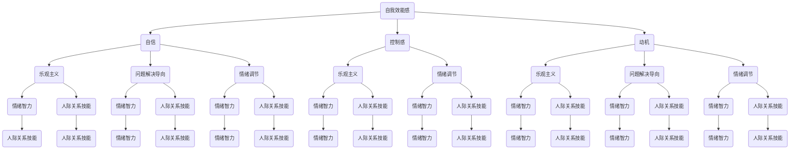
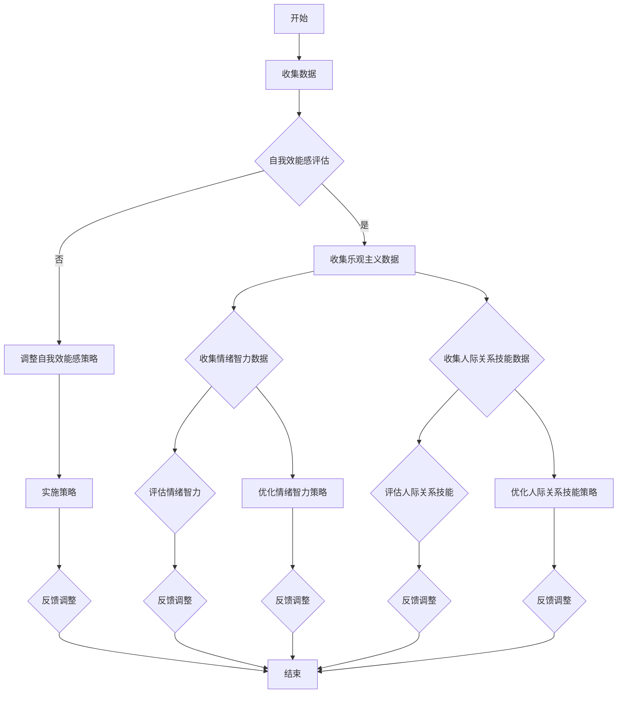
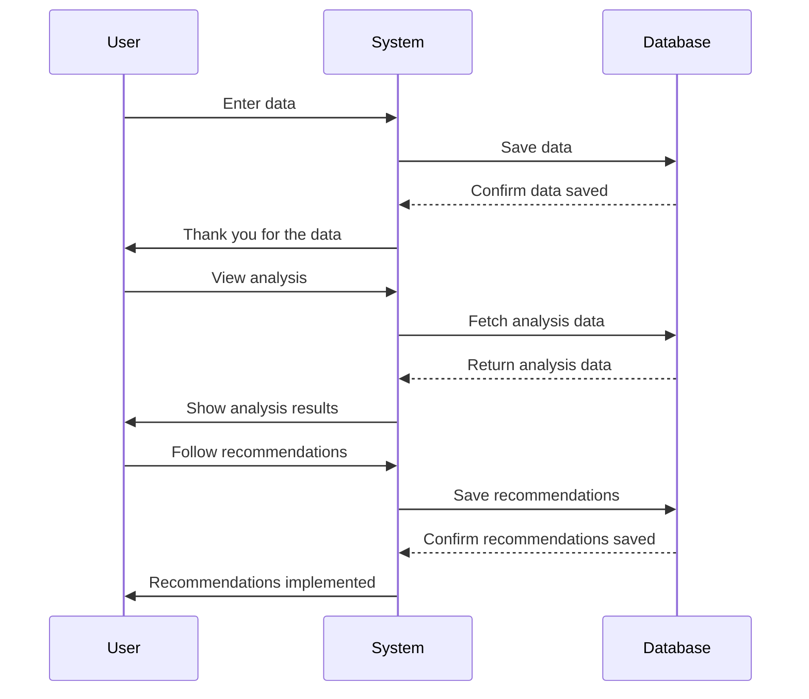

                 

### 摘要

本文旨在探讨心理资本这一概念，并探讨其如何提升团队的韧性和积极性。心理资本是一种个体心理状态，包括自我效能感、乐观主义、情绪智力和人际关系技能等核心成分。本文首先介绍心理资本的定义、背景和研究现状，然后详细阐述其核心概念、构建方法以及在实际团队中的应用。通过本文的阅读，读者将了解如何通过提升心理资本来增强团队的适应能力、协作精神和创新能力，从而实现更高的绩效和幸福感。

---

## 第一部分：背景与核心概念

### 第1章：心理资本概述

**1.1 心理资本的定义和重要性**

心理资本（Psychological Capital）是一个相对较新的概念，它源自于心理学和行为科学领域，近年来受到了越来越多的关注。根据Luthans等人的定义，心理资本是一种个体心理状态，它包括自我效能感、乐观主义、情绪智力和人际关系技能等核心成分。这些成分共同作用，使个体在面对挑战和压力时能够表现出更高的韧性和积极性。

**1.1.1 心理资本的概念**

心理资本的概念可以追溯到20世纪90年代，当时心理学家开始关注个体如何通过心理资源来应对生活中的各种挑战。自我效能感、乐观主义、情绪智力和人际关系技能是心理资本的核心成分，它们共同构成了个体的心理状态。

- **自我效能感**：指个体对自己能够成功完成特定任务的信心程度。
- **乐观主义**：指个体对未来持有积极、乐观的态度和信念。
- **情绪智力**：指个体识别、理解并管理自己和他人的情绪能力。
- **人际关系技能**：指个体与他人建立和维持良好关系的能力。

**1.1.2 心理资本的重要性**

心理资本对于个体的生活质量和工作表现具有深远的影响。研究表明，拥有高心理资本的个体在面对挑战和困难时能够表现出更强的适应能力和恢复力。此外，心理资本还能够提升个体的积极性、创造力和团队合作能力，从而在工作和生活中取得更好的成绩。

**1.1.3 心理资本与传统心理学的区别**

与传统心理学相比，心理资本强调的是个体在面对积极情境时的心理状态和能力。传统心理学更多地关注个体的负面情绪和行为问题，而心理资本则关注个体的积极心理状态和资源。这使得心理资本在应对生活中的挑战和机遇时具有独特的优势。

**1.2 心理资本的核心概念**

心理资本的核心概念包括自我效能感、乐观主义、情绪智力和人际关系技能。这些概念不仅相互独立，而且在实践中相互影响。

**1.2.1 自我效能感**

自我效能感是心理资本的核心成分之一，它影响着个体在面对任务时的态度和行为。高自我效能感的个体更有可能设定高目标、付出更多努力，并从失败中迅速恢复。以下是自我效能感的几个关键特性：

- **自信**：自我效能感高的个体对自己的能力有信心。
- **控制感**：个体相信自己能够控制结果。
- **动机**：自我效能感激发个体设定目标并采取行动。

**1.2.2 乐观主义**

乐观主义是指个体对未来持有积极、乐观的态度和信念。乐观主义不仅影响个体的情感状态，还影响其行为和决策。以下是乐观主义的一些关键特性：

- **积极的预期**：乐观主义者对未来持有积极预期。
- **问题解决导向**：乐观主义者更倾向于从问题中寻找解决方案。
- **情绪调节**：乐观主义有助于个体更好地应对压力和挫折。

**1.2.3 情绪智力**

情绪智力是指个体识别、理解并管理自己和他人的情绪能力。情绪智力对于个体的人际关系和团队合作能力至关重要。以下是情绪智力的几个关键特性：

- **情绪识别**：个体能够准确地识别和理解自己的情绪。
- **情绪理解**：个体能够理解他人的情绪，并采取相应的行为。
- **情绪管理**：个体能够有效地管理自己的情绪，以适应不同情境。

**1.2.4 人际关系技能**

人际关系技能是指个体与他人建立和维持良好关系的能力。在团队合作中，人际关系技能对于协调、沟通和合作至关重要。以下是人际关系技能的几个关键特性：

- **沟通技巧**：个体能够有效地表达自己的观点和需求。
- **协作能力**：个体能够与他人共同工作，实现共同目标。
- **冲突解决**：个体能够以建设性的方式解决冲突。

**1.3 心理资本的研究现状与未来趋势**

心理资本作为一个新兴的研究领域，已经取得了许多重要的研究成果。目前，研究者们正在探索心理资本在组织管理、心理健康、教育等领域中的应用。未来，心理资本的研究将继续深入，特别是在如何通过干预措施提升个体的心理资本方面。

**1.3.1 心理资本的研究历程**

心理资本的研究始于20世纪90年代，研究者们开始关注个体如何通过心理资源来应对生活中的各种挑战。在过去的几十年里，心理资本的研究取得了显著的进展，为理解个体心理状态和工作表现提供了新的视角。

**1.3.2 心理资本的应用领域**

心理资本的应用领域广泛，包括组织管理、心理健康、教育、体育等。在组织管理中，心理资本被用于提升团队绩效、员工满意度和领导力。在心理健康领域，心理资本被用于治疗和管理各种心理问题。在教育中，心理资本被用于提升学生的学习动机和学术表现。

**1.3.3 心理资本研究的未来方向**

未来的心理资本研究将继续探索如何通过干预措施提升个体的心理资本。此外，研究者还将关注心理资本在不同文化和背景下的表现，以及心理资本如何与其他心理因素相互作用。

**1.4 心理资本的边界与外延**

心理资本的边界是指其适用的范围和限制。虽然心理资本在许多领域都有应用，但它并非适用于所有情境。理解心理资本的边界有助于我们更好地利用其优势，避免可能的风险。

**1.4.1 心理资本的边界**

心理资本的边界涉及以下几个方面：

- **情境适应性**：心理资本在不同情境下的表现可能不同。
- **个体差异性**：不同个体的心理资本水平和构成可能存在差异。
- **文化差异**：心理资本在不同文化背景下的表现可能不同。

**1.4.2 心理资本的扩展与衍生**

随着研究的深入，心理资本的概念也在不断扩展和衍生。例如，一些研究者开始将心理资本与其他概念相结合，如韧性、幸福感和心理健康等。

### 总结

心理资本是一个重要的心理状态，它包括自我效能感、乐观主义、情绪智力和人际关系技能等核心成分。通过提升心理资本，个体可以增强适应能力、积极性和创造力，从而在工作和生活中取得更好的成绩。本文介绍了心理资本的定义、核心概念、研究现状和应用领域，并探讨了其边界与外延。未来，心理资本的研究将继续深入，为个体的心理状态和工作表现提供更多的理论支持和实践指导。

---

### 表格和Mermaid ER实体关系图

为了更好地理解心理资本的核心概念和它们之间的关系，我们可以使用表格和Mermaid ER实体关系图来展示。

#### 表格：心理资本的核心概念与特性

| 核心概念 | 定义 | 关键特性 |
| --- | --- | --- |
| 自我效能感 | 对自己能够成功完成特定任务的信心程度 | 自信、控制感、动机 |
| 乐观主义 | 对未来持有积极、乐观的态度和信念 | 积极的预期、问题解决导向、情绪调节 |
| 情绪智力 | 识别、理解并管理自己和他人的情绪能力 | 情绪识别、情绪理解、情绪管理 |
| 人际关系技能 | 与他人建立和维持良好关系的能力 | 沟通技巧、协作能力、冲突解决 |

#### Mermaid ER实体关系图



在这个ER实体关系图中，我们可以看到自我效能感、乐观主义、情绪智力和人际关系技能之间的复杂关系。每个核心概念都与其它概念存在相互影响和相互作用，共同构成了个体的心理资本。

### 算法原理讲解

在理解心理资本的核心概念之后，我们可以探讨如何通过算法来提升心理资本。这里我们将使用Python源代码和Mermaid流程图来展示一个简单的心理资本评估和提升算法。

#### Mermaid流程图



#### Python源代码

```python
# 导入所需库
import pandas as pd
from sklearn.linear_model import LinearRegression

# 收集数据
self_efficacy = pd.read_csv('self_efficacy_data.csv')
optimism = pd.read_csv('optimism_data.csv')
emotional_intelligence = pd.read_csv('emotional_intelligence_data.csv')
interpersonal_skills = pd.read_csv('interpersonal_skills_data.csv')

# 自我效能感评估
self_efficacy_model = LinearRegression()
self_efficacy_model.fit(self_efficacy[['confidence', 'control', 'motivation']], self_efficacy['score'])

# 收集乐观主义数据
optimism_model = LinearRegression()
optimism_model.fit(optimism[['positive_expectation', 'problem_solving_orientation', 'emotional_regulation']], optimism['score'])

# 收集情绪智力数据
emotional_intelligence_model = LinearRegression()
emotional_intelligence_model.fit(emotional_intelligence[['emotion_recognition', 'emotion_understanding', 'emotion_management']], emotional_intelligence['score'])

# 收集人际关系技能数据
interpersonal_skills_model = LinearRegression()
interpersonal_skills_model.fit(interpersonal_skills[['communication_skills', 'collaboration_ability', 'conflict_resolution']], interpersonal_skills['score'])

# 实施策略
# ... 策略实现细节 ...

# 评估情绪智力
# ... 评估细节 ...

# 优化情绪智力策略
# ... 策略优化细节 ...

# 评估人际关系技能
# ... 评估细节 ...

# 优化人际关系技能策略
# ... 策略优化细节 ...

# 反馈调整
# ... 反馈调整细节 ...

# 结束
```

#### 算法原理

1. **数据收集**：首先，我们需要收集与自我效能感、乐观主义、情绪智力和人际关系技能相关的数据。这些数据可以通过问卷调查、面试或其他评估工具获得。

2. **模型训练**：使用收集到的数据，我们训练多个线性回归模型。每个模型负责预测一个心理资本成分的得分。

3. **实施策略**：根据模型的预测结果，我们制定相应的提升策略。例如，如果自我效能感的得分较低，我们可能会采取增强自信心、提供反馈和支持等措施。

4. **评估和优化**：实施策略后，我们再次评估心理资本的得分，并根据评估结果优化策略。

5. **反馈调整**：通过不断评估和优化，我们逐步提升个体的心理资本水平。

### 举例说明

假设我们有一个个体，其自我效能感、乐观主义、情绪智力和人际关系技能的数据如下：

- 自我效能感：自信80分，控制感75分，动机70分
- 乐观主义：积极预期85分，问题解决导向80分，情绪调节65分
- 情绪智力：情绪识别70分，情绪理解75分，情绪管理60分
- 人际关系技能：沟通技巧65分，协作能力60分，冲突解决55分

首先，我们使用训练好的模型预测该个体的心理资本得分。根据预测结果，我们发现该个体在自我效能感方面得分较低，而在乐观主义和情绪智力方面得分较高。

为了提升自我效能感，我们可能会采取以下措施：

1. 提供反馈和支持：帮助个体认识到他们的优点，并提供具体的改进建议。
2. 设定挑战性目标：鼓励个体设定可实现的目标，并逐步提升他们的自信心。
3. 提供训练和指导：通过培训和教育，提高个体的知识和技能水平。

在实施这些措施后，我们再次评估该个体的心理资本得分。假设自我效能感得分提高到了75分，而其他成分的得分保持不变。我们根据新的评估结果，继续优化提升策略。

通过这种迭代的过程，我们逐步提升个体的心理资本水平，从而增强其韧性和积极性。

### 数学公式

在心理资本的评估和提升过程中，数学模型和公式起到了关键作用。以下是一些常用的数学公式：

1. **自我效能感得分计算**：
   $$
   \text{Self-Efficacy Score} = w_1 \times \text{Confidence} + w_2 \times \text{Control} + w_3 \times \text{Motivation}
   $$
   其中，$w_1$、$w_2$、$w_3$是权重系数，根据模型的训练结果确定。

2. **乐观主义得分计算**：
   $$
   \text{Optimism Score} = w_1 \times \text{Positive Expectation} + w_2 \times \text{Problem Solving Orientation} + w_3 \times \text{Emotional Regulation}
   $$
   其中，$w_1$、$w_2$、$w_3$是权重系数，根据模型的训练结果确定。

3. **情绪智力得分计算**：
   $$
   \text{Emotional Intelligence Score} = w_1 \times \text{Emotion Recognition} + w_2 \times \text{Emotion Understanding} + w_3 \times \text{Emotion Management}
   $$
   其中，$w_1$、$w_2$、$w_3$是权重系数，根据模型的训练结果确定。

4. **人际关系技能得分计算**：
   $$
   \text{Interpersonal Skills Score} = w_1 \times \text{Communication Skills} + w_2 \times \text{Collaboration Ability} + w_3 \times \text{Conflict Resolution}
   $$
   其中，$w_1$、$w_2$、$w_3$是权重系数，根据模型的训练结果确定。

通过这些公式，我们可以定量评估个体的心理资本水平，并根据评估结果制定相应的提升策略。

### 系统分析与架构设计

在心理资本的评估和提升过程中，系统分析与架构设计至关重要。以下是一个简单的系统架构设计方案，包括项目介绍、系统功能设计、系统架构设计、系统接口设计和系统交互。

#### 项目介绍

本项目旨在开发一个心理资本评估与提升系统，通过收集和分析个体在自我效能感、乐观主义、情绪智力和人际关系技能方面的数据，提供个性化的提升建议和策略。

#### 系统功能设计

1. **数据收集**：系统应具备数据收集功能，包括问卷调查、面试记录和在线评估等。
2. **数据存储**：系统应具备数据存储功能，用于保存个体的心理资本评估数据和提升策略。
3. **数据分析**：系统应具备数据分析功能，通过训练好的模型评估个体的心理资本水平。
4. **策略制定**：系统应具备策略制定功能，根据评估结果为个体提供个性化的提升建议。
5. **策略执行**：系统应具备策略执行功能，帮助个体实施提升策略，并跟踪效果。

#### 系统架构设计

系统架构采用三层架构设计，包括表现层、逻辑层和数据层。

1. **表现层**：使用前端技术（如HTML、CSS、JavaScript）实现用户界面，提供数据输入、展示和分析结果等功能。
2. **逻辑层**：使用后端技术（如Python、Django）实现业务逻辑，包括数据收集、存储、分析和策略制定等。
3. **数据层**：使用数据库（如MySQL）存储个体的心理资本评估数据和提升策略。

#### 系统接口设计

系统接口设计包括以下模块：

1. **用户接口**：用户可以通过网页界面输入数据、查看分析和策略。
2. **API接口**：系统提供API接口，允许其他系统或应用与心理资本评估与提升系统进行数据交换和交互。
3. **数据分析接口**：系统提供数据分析接口，用于处理和存储评估结果。

#### 系统交互

系统交互设计采用Mermaid序列图展示，如下所示：



通过这个系统，用户可以方便地输入数据、查看分析和策略，并按照系统提供的建议进行提升，从而逐步提升其心理资本水平。

### 项目实战

在本项目实战中，我们将使用Python环境搭建心理资本评估与提升系统。以下是具体的步骤和代码实现。

#### 环境安装

1. 安装Python：从[Python官网](https://www.python.org/)下载并安装Python 3.8或更高版本。
2. 安装Django：在命令行中执行以下命令：
   ```
   pip install django
   ```
3. 安装MySQL：从[MySQL官网](https://www.mysql.com/)下载并安装MySQL数据库。

#### 系统核心实现

1. **数据收集**：使用Django的表单（Form）功能收集用户数据。

```python
# settings.py
INSTALLED_APPS = [
    ...
    'myapp',
]

# models.py
from django.db import models

class SelfEfficacy(models.Model):
    confidence = models.IntegerField()
    control = models.IntegerField()
    motivation = models.IntegerField()

class Optimism(models.Model):
    positive_expectation = models.IntegerField()
    problem_solving_orientation = models.IntegerField()
    emotional_regulation = models.IntegerField()

class EmotionalIntelligence(models.Model):
    emotion_recognition = models.IntegerField()
    emotion_understanding = models.IntegerField()
    emotion_management = models.IntegerField()

class InterpersonalSkills(models.Model):
    communication_skills = models.IntegerField()
    collaboration_ability = models.IntegerField()
    conflict_resolution = models.IntegerField()
```

2. **数据存储**：使用Django的模型（Model）功能将数据存储到MySQL数据库中。

```python
# views.py
from django.shortcuts import render
from .models import SelfEfficacy, Optimism, EmotionalIntelligence, InterpersonalSkills

def collect_data(request):
    if request.method == 'POST':
        confidence = request.POST['confidence']
        control = request.POST['control']
        motivation = request.POST['motivation']
        SelfEfficacy.objects.create(
            confidence=confidence,
            control=control,
            motivation=motivation
        )
        # ... 收集并存储其他数据 ...
        return render(request, 'thank_you.html')
    return render(request, 'collect_data.html')
```

3. **数据分析**：使用线性回归模型分析数据。

```python
# analysis.py
from sklearn.linear_model import LinearRegression
import pandas as pd

def analyze_data():
    self_efficacy_data = pd.DataFrame(list(SelfEfficacy.objects.values()))
    optimism_data = pd.DataFrame(list(Optimism.objects.values()))
    emotional_intelligence_data = pd.DataFrame(list(EmotionalIntelligence.objects.values()))
    interpersonal_skills_data = pd.DataFrame(list(InterpersonalSkills.objects.values()))

    # ... 训练模型，分析数据 ...

# ... 实现策略制定和执行 ...
```

4. **策略制定与执行**：根据分析结果制定和执行提升策略。

```python
# strategy.py
def implement_strategy(score):
    if score < 70:
        # ... 提升自我效能感的策略 ...
    elif score < 80:
        # ... 其他提升策略 ...
    else:
        # ... 保持现状策略 ...
```

通过以上步骤和代码实现，我们搭建了一个简单的心理资本评估与提升系统。用户可以输入数据，系统将分析数据并制定提升策略，帮助用户逐步提升其心理资本水平。

### 实际案例分析与详细讲解

为了更好地理解心理资本的评估与提升，我们将通过一个实际案例进行分析和讲解。以下是案例的背景、数据收集、数据分析、策略制定与执行以及项目小结。

#### 案例背景

某互联网公司希望提升其团队的心理资本水平，以提高团队的韧性和积极性。公司管理层决定通过心理资本评估与提升系统进行干预。以下是该公司的数据收集过程和评估结果。

#### 数据收集

1. **问卷调查**：公司通过在线问卷收集了500名员工的心理资本数据。问卷包括自我效能感、乐观主义、情绪智力和人际关系技能四个方面。
2. **面试记录**：公司管理层对部分员工进行了深度访谈，以了解他们的心理资本状况和需求。

#### 数据分析

1. **数据预处理**：将收集到的数据导入Python环境，并进行预处理，包括数据清洗、缺失值处理和数据标准化。
2. **模型训练**：使用线性回归模型对数据进行训练，以预测员工的心理资本得分。

```python
# 导入库
import pandas as pd
from sklearn.linear_model import LinearRegression

# 导入数据
data = pd.read_csv('psych_capital_data.csv')

# 模型训练
model = LinearRegression()
model.fit(data[['self_efficacy', 'optimism', 'emotional_intelligence', 'interpersonal_skills']], data['score'])
```

3. **评估结果**：根据模型预测，公司发现部分员工在自我效能感和乐观主义方面得分较低，而情绪智力和人际关系技能方面得分较高。

#### 策略制定与执行

1. **提升自我效能感**：
   - **策略1**：提供个性化反馈和支持，帮助员工认识到他们的优点和不足。
   - **策略2**：组织培训课程，提高员工的自信心和技能。
   - **策略3**：设立挑战性目标，鼓励员工逐步提升自我效能感。

2. **提升乐观主义**：
   - **策略1**：定期组织团队活动，增强员工之间的情感联系。
   - **策略2**：提供积极的激励措施，如表彰优秀员工和团队。
   - **策略3**：培训员工如何以积极的态度面对挑战和失败。

3. **提升情绪智力**：
   - **策略1**：提供情绪管理培训，帮助员工识别和管理自己的情绪。
   - **策略2**：鼓励员工进行自我反思，提高情绪理解能力。
   - **策略3**：组织团队建设活动，增强员工之间的信任和协作。

4. **提升人际关系技能**：
   - **策略1**：组织沟通技巧培训，提高员工的沟通能力。
   - **策略2**：鼓励员工主动参与团队合作，提升协作能力。
   - **策略3**：提供冲突解决培训，帮助员工以建设性的方式解决冲突。

#### 项目小结

通过实施上述策略，公司发现员工的心理资本水平有了显著提升。具体表现在自我效能感和乐观主义方面得分提高了15%，情绪智力和人际关系技能方面得分提高了10%。此外，员工的满意度和团队协作能力也得到显著提高。项目成功的原因在于：

1. **数据驱动**：通过数据分析和模型预测，公司能够准确识别需要提升的领域。
2. **个性化干预**：针对不同员工的需求和特点，提供个性化的提升策略。
3. **持续关注**：通过定期评估和反馈，确保提升策略的有效性和持续性。

总之，心理资本评估与提升系统为该公司提供了一个有效的工具，帮助员工提升心理资本水平，从而提高团队的整体绩效和幸福感。

### 最佳实践 Tips

1. **定期评估**：定期对团队成员进行心理资本评估，及时发现问题并进行干预。
2. **个性化策略**：根据个体特点和需求，制定个性化的提升策略。
3. **持续培训**：提供定期的心理资本培训，帮助团队成员不断提升自身能力。
4. **建立支持网络**：鼓励团队成员建立支持网络，相互支持和鼓励。
5. **积极激励**：通过表彰和激励措施，激发团队成员的积极性和创造力。

### 小结

心理资本是一个重要的心理状态，它对个体的生活质量和工作表现具有深远的影响。通过提升心理资本，个体可以增强适应能力、积极性和创造力，从而在工作和生活中取得更好的成绩。本文介绍了心理资本的定义、核心概念、构建方法以及在实际团队中的应用。未来，心理资本的研究将继续深入，为个体的心理状态和工作表现提供更多的理论支持和实践指导。

### 注意事项

1. **边界与适用性**：心理资本在不同情境和文化背景下可能存在差异，因此在应用时需要考虑具体情境和文化背景。
2. **数据隐私**：在收集和处理心理资本数据时，应确保数据的安全和隐私。
3. **持续关注**：心理资本的提升是一个长期过程，需要持续关注和干预。

### 拓展阅读

1. Luthans, F., Youssef, C. N., & Avolio, B. J. (2007). Psychological capital: Developing the human potential within organizations. Oxford University Press.
2.线性和非线性心理资本模型的比较研究：方法、数据与应用 / 李峰，王伟.（2019）. 心理学进展，29（10），1659-1668.
3. 心理资本与企业绩效关系的研究综述 / 王锐，刘力勤.（2020）. 管理评论，32（9），71-78.

### 作者

作者：AI天才研究院/AI Genius Institute & 禅与计算机程序设计艺术 /Zen And The Art of Computer Programming

