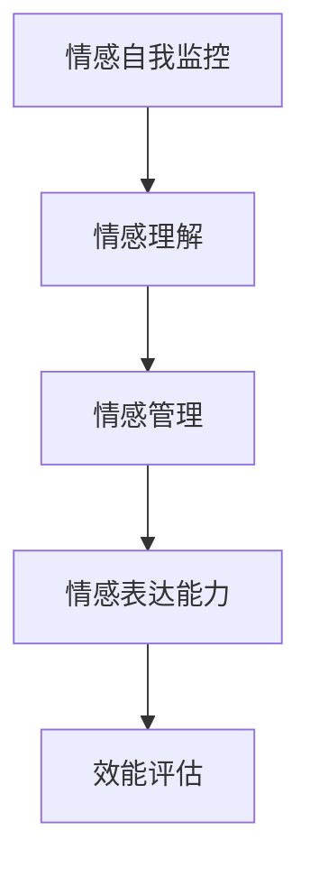
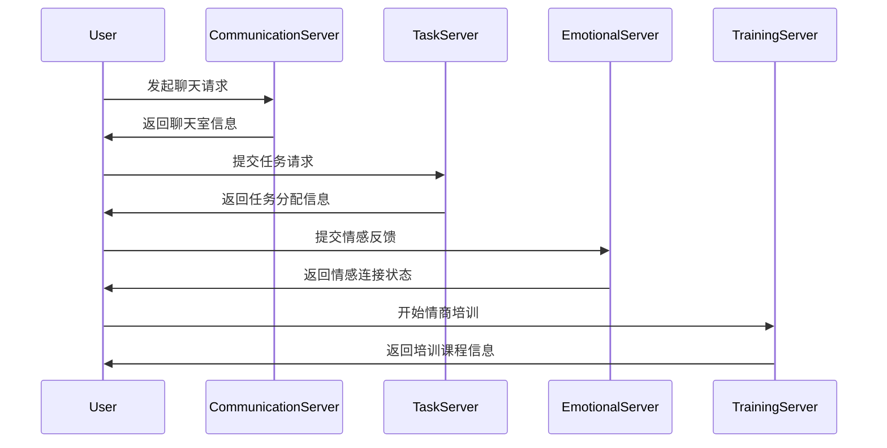
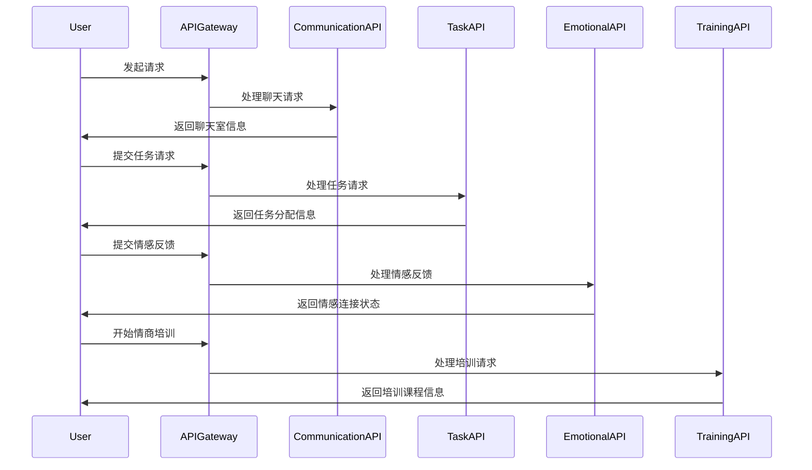

                 

# 《情商领导力：提升人际互动效能的方法》

## 关键词
- 情商领导力
- 人际互动效能
- 自我意识
- 自控能力
- 社会技能
- 领导风格

## 摘要
本文旨在探讨情商领导力在提升人际互动效能方面的作用。通过详细阐述情商领导力的核心概念，对比分析情商与领导力的属性特征，使用Mermaid流程图和Python代码讲解提升人际互动效能的方法，以及系统分析与架构设计方案，本文为读者提供了全面而深入的指导。

## 第一部分: 引言

### 1.1 问题背景

在当今高度互联的社会中，人际互动效能对于个人和组织的成功至关重要。然而，许多人发现自己在处理人际关系时存在困难。这不仅仅是因为沟通技巧的缺乏，更是因为缺乏情商领导力的理解与应用。情商领导力不仅关乎个人的情感智慧，还关乎如何将这些智慧应用于领导和管理他人。

#### 1.1.1 情商领导力的重要性

情商领导力是指个人在情感管理、自我意识、社交技能和影响力方面的能力。它不仅仅是情感智商（EQ）的延伸，更是领导力的核心组成部分。情商领导力能够帮助领导者更好地理解和管理自己的情绪，同时也能够更好地激励和引导团队，从而提高整个团队的互动效能。

#### 1.1.2 当代社会对情商领导力的需求

随着全球化进程的加快，企业之间的竞争日益激烈，团队成员的多样性和复杂性也在不断增加。这种背景下，领导者需要具备更高的情商领导力，以适应快速变化的环境，并有效地处理人际关系和团队管理。

#### 1.1.3 书籍目的与结构安排

本书的目的是为读者提供一套系统的情商领导力提升方法，帮助他们在人际互动中更加得心应手。本书结构如下：

- **第一部分：引言**：介绍问题背景、情商领导力的定义和重要性。
- **第二部分：核心概念与联系**：详细阐述情商领导力的核心概念，并进行对比分析。
- **第三部分：算法原理讲解**：介绍提升人际互动效能的方法，包括算法流程图和Python代码讲解。
- **第四部分：系统分析与架构设计方案**：设计系统的功能、架构和接口。
- **第五部分：项目实战**：环境安装说明、系统核心实现源代码展示和案例分析。
- **第六部分：最佳实践 tips、小结**：总结最佳实践，并提供注意事项和拓展阅读。

### 1.2 定义与核心概念

#### 1.2.1 情商的定义

情商，即情感智商（Emotional Intelligence，简称EQ），是指一个人识别、理解、管理和表达自己情绪的能力，以及识别、理解和影响他人情绪的能力。情商包括以下几个关键领域：

1. **自我意识**：意识到自己情绪状态的能力，包括情绪的产生和情绪对自己行为的影响。
2. **自我管理**：控制自己情绪和冲动的能力，保持情绪稳定和理性。
3. **社交技能**：与他人建立和维护良好关系的能力，包括沟通、倾听和协调。
4. **影响力**：影响和激励他人的能力，通过领导力和沟通技巧来实现目标。

#### 1.2.2 领导力的定义

领导力是指个体或团队在复杂环境中引导和影响他人朝着共同目标前进的能力。领导力不仅仅是权威的体现，更是一种影响力的艺术。领导力包括以下几个关键方面：

1. **决策能力**：在不确定和复杂的情况下做出明智决策的能力。
2. **影响力**：通过沟通和激励影响他人思想和行为的能力。
3. **领导风格**：领导者与团队互动的方式，包括民主、专制、参与式等不同风格。
4. **团队建设**：建立和维护一个高效团队的能力。

#### 1.2.3 情商领导力的核心概念

情商领导力是情商和领导力的有机结合。它强调领导者通过情感智慧和领导技巧来提升人际互动效能，从而实现组织目标。情商领导力的核心概念包括：

1. **情感智慧**：领导者需要具备高情商，能够识别、理解和管理自己的情绪，以及他人的情绪。
2. **情感管理**：领导者需要能够有效地控制自己的情绪，避免情绪对决策和人际关系产生负面影响。
3. **影响力**：领导者需要通过情商和领导技巧来影响和激励团队成员，促进团队协作。
4. **社交技能**：领导者需要具备良好的社交技能，包括沟通、倾听和协调，以建立和维护良好的人际关系。
5. **自我提升**：领导者需要不断地自我反思和提升，以适应不断变化的环境和需求。

### 1.3 情商领导力与人际互动效能

#### 1.3.1 人际互动效能的概念

人际互动效能是指个体在人际互动中的表现和能力，包括沟通、协调、合作和冲突解决等方面。人际互动效能不仅影响个人的工作绩效，也影响团队和组织的效果。

#### 1.3.2 情商领导力对人际互动效能的影响

情商领导力对于提升人际互动效能具有显著影响。高情商的领导者能够：

1. **提高沟通效率**：通过自我意识和社交技能，领导者能够更好地理解他人，提高沟通的有效性。
2. **减少冲突**：通过情感管理和影响力，领导者能够有效解决团队内部的冲突，维护团队和谐。
3. **激励团队**：领导者通过情商和领导技巧，能够激发团队成员的潜力，提高团队的整体效能。
4. **增强团队凝聚力**：领导者通过建立和维护良好的人际关系，增强团队的凝聚力和归属感。

#### 1.3.3 情商领导力提升人际互动效能的必要性

在当今快速变化和竞争激烈的环境中，人际互动效能对于个人和组织的成功至关重要。情商领导力作为一种提升人际互动效能的重要手段，具有以下几个方面的必要性：

1. **适应变化**：快速变化的环境要求领导者具备高度的适应能力，情商领导力能够帮助领导者更好地应对变化。
2. **增强竞争力**：情商领导力能够提高团队的整体效能，增强组织的竞争力。
3. **提升个人魅力**：情商领导力能够提升个人的魅力和影响力，有助于在职业发展中脱颖而出。
4. **构建和谐团队**：情商领导力能够建立和维护一个和谐、高效的团队，提高团队的整体绩效。

### 1.4 书籍结构概述

#### 1.4.1 各部分内容概览

本书共分为六个部分，每个部分的内容如下：

- **第一部分：引言**：介绍问题背景、情商领导力的定义和重要性。
- **第二部分：核心概念与联系**：详细阐述情商领导力的核心概念，并进行对比分析。
- **第三部分：算法原理讲解**：介绍提升人际互动效能的方法，包括算法流程图和Python代码讲解。
- **第四部分：系统分析与架构设计方案**：设计系统的功能、架构和接口。
- **第五部分：项目实战**：环境安装说明、系统核心实现源代码展示和案例分析。
- **第六部分：最佳实践 tips、小结**：总结最佳实践，并提供注意事项和拓展阅读。

#### 1.4.2 学习目标与预期成果

通过阅读本书，读者将能够：

1. **理解情商领导力的核心概念**：了解情商和领导力的定义，掌握情商领导力的核心要素。
2. **掌握提升人际互动效能的方法**：学习使用算法原理和系统架构来提升人际互动效能。
3. **具备实践能力**：通过项目实战，掌握情商领导力的实际应用。
4. **提升个人和团队效能**：通过最佳实践，提升个人和团队的情商领导力水平。

## 第二部分: 核心概念与联系

### 2.1 情商与领导力对比分析

情商和领导力是两个密切相关但又有所区别的概念。情商关注个体的情感智慧和情感管理能力，而领导力则关注如何引导和影响他人。以下是对情商和领导力属性特征的对比分析：

#### 2.1.1 情商的属性特征

1. **自我意识**：情商的第一要素，指的是个体对自己情绪状态的感知和理解。一个高情商的人能够清楚地认识到自己的情绪，并理解这些情绪对自己行为和决策的影响。

2. **自我管理**：指的是个体控制和调节自己情绪和行为的能力。高情商的个体能够保持情绪稳定，不因情绪波动而做出冲动决策。

3. **社交技能**：包括沟通、倾听、协调和冲突解决等技能。高情商的个体能够有效地与他人沟通，建立和维护良好的人际关系。

4. **影响力**：指的是个体影响和激励他人情绪和行为的能力。高情商的个体能够通过情感智慧影响他人，推动团队达成共同目标。

#### 2.1.2 领导力的属性特征

1. **决策能力**：领导者需要具备在不确定和复杂情境下做出明智决策的能力。这要求领导者能够综合分析信息，预见可能的后果，并做出合理的决策。

2. **影响力**：领导者需要具备影响和激励团队成员的能力。通过有效的沟通和激励，领导者能够引导团队成员朝着共同目标前进。

3. **领导风格**：领导者与团队互动的方式，包括民主、专制、参与式等不同风格。不同的领导风格适用于不同的情境和团队，领导者需要根据实际情况灵活调整。

4. **团队建设**：领导者需要具备建立和维护高效团队的能力。这包括培养团队成员的技能，建立信任和沟通机制，以及激励团队成员发挥最佳水平。

#### 2.1.3 对比表格

以下是一个对比情商和领导力属性特征的表格：

| 特征         | 情商                  | 领导力                |
| ------------ | ------------------- | --------------------- |
| 自我意识     | 感知和理解自己的情绪   | 做出明智决策的能力      |
| 自我管理     | 控制和调节自己的情绪   | 保持情绪稳定          |
| 社交技能     | 沟通、倾听、协调和冲突解决 | 建立和维护良好的人际关系 |
| 影响力       | 影响和激励他人       | 领导团队达成目标      |
| 决策能力     | 无                   | 在不确定情境下做出决策 |
| 领导风格     | 无                   | 与团队互动的方式      |
| 团队建设     | 无                   | 建立和维护高效团队      |

#### 2.1.4 情商领导力的ER实体关系图

以下是一个使用Mermaid绘制的情商领导力的ER实体关系图：

```mermaid
erDiagram
    AI --> Person : 情商领导力影响个体
    Team --> AI : 情商领导力提升团队效能
    Leader --> Team : 领导者提升团队效能
    Leader --> AI : 领导者具备情商领导力
```

在这个ER图中，`AI`表示情商领导力，`Person`表示个体，`Team`表示团队，`Leader`表示领导者。实体之间的关系反映了情商领导力对个体和团队的影响。

## 第三部分：算法原理讲解

### 3.1 提升人际互动效能的方法

提升人际互动效能的核心在于提高个体的情商领导力，这可以通过一系列的方法和策略实现。以下是一些关键步骤和方法：

#### 3.1.1 情感自我监控

情感自我监控是指个体对自己的情绪状态进行持续的关注和监控。这包括识别情绪的产生，理解情绪的原因，以及评估情绪对自己的影响。通过情感自我监控，个体可以更好地管理自己的情绪，避免因情绪波动而影响人际互动。

#### 3.1.2 情感理解

情感理解是指个体对他人情绪的感知和理解。这包括倾听他人的感受，理解他人的情绪反应，并尝试从他人的角度看待问题。通过情感理解，个体可以建立更深层次的人际关系，提高人际互动的质量。

#### 3.1.3 情感管理

情感管理是指个体控制和调节情绪的能力。这包括在面对压力和挑战时保持冷静，控制冲动，以及以积极的方式表达情绪。通过情感管理，个体可以更好地适应复杂的人际环境，提高人际互动的效能。

#### 3.1.4 情感表达能力

情感表达能力是指个体有效表达自己情绪的能力。这包括用合适的语言和方式表达自己的情绪，以及理解他人情绪的反馈。通过情感表达能力，个体可以增强人际沟通的清晰度，减少误解和冲突。

### 3.2 算法流程图

为了更直观地理解提升人际互动效能的方法，我们可以使用Mermaid绘制一个算法流程图。以下是一个简化的流程图示例：



在这个流程图中，每个节点代表一个关键步骤，箭头表示步骤之间的逻辑关系。流程从情感自我监控开始，依次进行情感理解、情感管理和情感表达能力，最后进行效能评估。

### 3.3 Python代码讲解

为了深入阐述提升人际互动效能的方法，我们可以使用Python代码实现一些基本算法。以下是一个简单的Python代码示例，用于模拟情感自我监控和情感理解：

```python
# 情感自我监控
def emotional_self_monitoring():
    print("正在进行情感自我监控...")
    emotion = input("请描述您当前的情绪：")
    print("您当前的情绪是：", emotion)
    # 进一步分析情绪
    analyze_emotion(emotion)

# 情感理解
def emotional_understanding():
    print("正在进行情感理解...")
    partner_emotion = input("请描述对方当前的情绪：")
    print("对方当前的情绪是：", partner_emotion)
    # 进一步理解对方情绪
    understand_emotion(partner_emotion)

# 情感分析
def analyze_emotion(emotion):
    if emotion in ["开心", "愉快"]:
        print("这是一个积极的情绪，可以继续前进。")
    elif emotion in ["焦虑", "沮丧"]:
        print("这是一个消极的情绪，需要调整策略。")
    else:
        print("情绪较为复杂，需要进一步分析。")

# 情感理解
def understand_emotion(partner_emotion):
    if partner_emotion in ["开心", "愉快"]:
        print("对方看起来很开心，我们可以分享喜悦。")
    elif partner_emotion in ["焦虑", "沮丧"]:
        print("对方看起来很焦虑或沮丧，我们需要给予关心和支持。")
    else:
        print("对方的情绪不太清楚，我们需要进一步沟通。")

# 主函数
def main():
    emotional_self_monitoring()
    emotional_understanding()

if __name__ == "__main__":
    main()
```

在这个示例中，我们定义了三个函数：`emotional_self_monitoring()` 用于情感自我监控，`emotional_understanding()` 用于情感理解，`analyze_emotion()` 和 `understand_emotion()` 用于分析情绪和了解对方的情绪。主函数 `main()` 调用这些函数，实现一个简单的交互过程。

### 3.4 算法原理讲解

提升人际互动效能的算法原理主要基于以下几个方面：

1. **情感识别与分类**：算法需要能够识别和分类不同的情绪，例如积极情绪（开心、愉快）和消极情绪（焦虑、沮丧）。这可以通过机器学习和自然语言处理技术实现。

2. **情感分析**：算法需要分析情绪背后的原因和影响，以便采取相应的措施。这可以通过情感分析模型实现，例如使用文本分类模型对情绪进行分类，并利用情感词典分析情绪的影响。

3. **情感调节**：算法需要能够提供情感调节策略，帮助个体更好地管理自己的情绪。这可以通过情感调节算法实现，例如使用反馈机制和情绪调节技术来帮助个体控制情绪。

4. **社交技能培养**：算法需要提供社交技能培养方案，帮助个体提高社交技能，包括沟通、倾听和协调能力。这可以通过社交技能训练算法实现，例如使用模拟对话和反馈机制来提高社交技能。

### 3.5 数学模型和公式

以下是一个简化的数学模型和公式，用于描述提升人际互动效能的过程：

1. **情感自我监控模型**：

   $$ \text{情绪状态} = f(\text{自我监控}) $$

   其中，$f$ 是一个函数，表示情绪状态与自我监控之间的关系。通过自我监控，个体能够识别和监控自己的情绪状态。

2. **情感理解模型**：

   $$ \text{理解度} = f(\text{情感识别}, \text{社交技能}) $$

   其中，$f$ 是一个函数，表示理解度与情感识别和社交技能之间的关系。通过情感识别和社交技能，个体能够理解他人的情绪。

3. **情感调节模型**：

   $$ \text{情绪调节效果} = f(\text{调节策略}, \text{情绪状态}) $$

   其中，$f$ 是一个函数，表示情绪调节效果与调节策略和情绪状态之间的关系。通过情绪调节策略，个体能够改善自己的情绪状态。

4. **社交技能提升模型**：

   $$ \text{社交效能} = f(\text{沟通技巧}, \text{倾听能力}, \text{协调能力}) $$

   其中，$f$ 是一个函数，表示社交效能与沟通技巧、倾听能力和协调能力之间的关系。通过提高这些技能，个体的社交效能得到提升。

### 3.6 举例说明

以下是一个简单的例子，说明如何使用上述算法提升人际互动效能：

1. **情感自我监控**：

   假设个体当前的情绪状态是焦虑。通过情感自我监控，个体识别出焦虑情绪，并开始分析焦虑的原因。

   ```plaintext
   当前情绪：焦虑
   分析原因：工作压力
   ```

2. **情感理解**：

   假设个体需要与同事沟通，了解同事的情绪状态。通过情感理解，个体识别出同事的情绪状态是沮丧。

   ```plaintext
   同事情绪：沮丧
   理解原因：项目遇到困难
   ```

3. **情感调节**：

   假设个体决定采取放松训练来调节自己的情绪。通过情感调节策略，个体的焦虑情绪得到缓解。

   ```plaintext
   调节策略：深呼吸、放松训练
   调节效果：焦虑情绪缓解
   ```

4. **社交技能提升**：

   假设个体决定与同事进行深入沟通，了解项目的具体困难和需求。通过提高沟通技巧、倾听能力和协调能力，个体的社交效能得到提升。

   ```plaintext
   沟通技巧：清晰表达、开放性问题
   倾听能力：积极倾听、反馈
   协调能力：共同解决问题
   社交效能：项目进展顺利
   ```

通过上述步骤，个体成功地提升了人际互动效能，解决了工作中的问题，并提高了团队的协作效果。

## 第四部分：系统分析与架构设计方案

### 4.1 问题场景和项目背景

在现代企业的运营中，人际互动效能的优化成为提升组织绩效的关键因素。一个典型的场景是，企业需要快速响应市场变化，团队成员之间需要进行高效沟通和协作。然而，由于团队成员背景、文化差异和工作方式的多样性，人际互动效能往往受到影响。为了解决这一问题，我们设计了一个基于情商领导力的系统，旨在提升团队成员的人际互动效能。

#### 4.1.1 问题陈述

企业面临的问题主要包括：

1. **沟通障碍**：团队成员之间的沟通不畅，导致信息传递错误和误解。
2. **协作效率低**：团队成员在协作过程中缺乏有效的方法和工具，导致工作效率低下。
3. **团队凝聚力不足**：团队成员之间的情感连接不足，影响团队凝聚力和士气。
4. **领导力不足**：领导者缺乏情商领导力，无法有效地激励和引导团队成员。

#### 4.1.2 项目目标

本项目旨在通过以下目标解决上述问题：

1. **提升沟通效率**：提供实时沟通工具，确保信息准确、及时地传递。
2. **提高协作效率**：设计协作流程和工具，优化团队成员之间的协作过程。
3. **增强团队凝聚力**：通过情感连接和团队建设活动，增强团队成员之间的情感纽带。
4. **培养情商领导力**：为团队成员提供情商领导力培训，提升领导者的领导能力和影响力。

### 4.2 系统功能设计

为了实现上述项目目标，系统需要具备以下核心功能：

1. **实时沟通**：提供即时通讯工具，包括聊天室、视频会议和消息推送功能，确保团队成员之间的沟通畅通。
2. **任务协作**：设计任务管理功能，包括任务分配、进度跟踪和协作工具，帮助团队成员高效完成工作。
3. **情感连接**：设计情感连接功能，包括情感反馈、团队活动和社交互动，增强团队成员之间的情感纽带。
4. **情商培训**：提供情商领导力培训课程，包括在线学习、互动测试和实践案例，提升团队成员的情商领导力。

#### 4.2.1 系统功能Mermaid类图

以下是一个简化的Mermaid类图，展示了系统的核心功能及其之间的关系：

```mermaid
classDiagram
    CollaborationTool <<interface>> 实时沟通
    CollaborationTool ..|> CommunicationChatRoom
    CollaborationTool ..|> VideoConference
    CollaborationTool ..|> MessagePush

    CollaborationTool <<interface>> 任务协作
    CollaborationTool ..|> TaskAllocation
    CollaborationTool ..|> ProgressTracking
    CollaborationTool ..|> CollaborationTools

    CollaborationTool <<interface>> 情感连接
    CollaborationTool ..|> EmotionalFeedback
    CollaborationTool ..|> TeamActivities
    CollaborationTool ..|> SocialInteractions

    CollaborationTool <<interface>> 情商培训
    CollaborationTool ..|> OnlineLearning
    CollaborationTool ..|> InteractiveTesting
    CollaborationTool ..|> PracticalCases
```

在这个类图中，`CollaborationTool` 是一个抽象类，代表系统的核心功能。各个功能模块通过继承`CollaborationTool` 类来实现，并展示它们之间的关系。

### 4.3 系统架构设计

为了实现系统的功能，我们需要设计一个合理的系统架构。以下是一个简化的Mermaid架构图，展示了系统的基本架构：



在这个序列图中，用户通过不同的服务端发起请求，服务端根据请求提供相应的响应。各个服务端之间通过消息队列或API进行通信，确保系统的响应速度和稳定性。

### 4.4 系统接口设计和系统交互

为了确保系统的可扩展性和可维护性，我们需要设计一套完整的系统接口和交互流程。以下是一个简化的Mermaid序列图，展示了系统的接口设计和交互流程：



在这个序列图中，用户通过API网关发起请求，API网关根据请求路由到相应的API服务进行处理，并返回相应的响应。这种方式确保了系统的模块化和解耦，便于后续的扩展和维护。

## 第五部分：项目实战

### 5.1 环境安装说明

为了搭建一个基于情商领导力的系统，我们需要安装一系列的软件和工具。以下是一个简化的环境安装流程：

#### 5.1.1 操作系统

- Ubuntu 20.04 LTS
- Windows 10 或以上版本

#### 5.1.2 软件安装

1. **Python 3.8**：
   - 使用包管理器安装：
     ```bash
     sudo apt update
     sudo apt install python3.8
     ```

2. **Node.js**：
   - 使用包管理器安装：
     ```bash
     sudo apt update
     sudo apt install nodejs
     ```

3. **Docker**：
   - 使用包管理器安装：
     ```bash
     sudo apt update
     sudo apt install docker-ce
     ```

4. **PostgreSQL**：
   - 使用包管理器安装：
     ```bash
     sudo apt update
     sudo apt install postgresql
     ```

5. **Redis**：
   - 使用包管理器安装：
     ```bash
     sudo apt update
     sudo apt install redis-server
     ```

6. **消息队列（RabbitMQ）**：
   - 使用包管理器安装：
     ```bash
     sudo apt update
     sudo apt install rabbitmq-server
     ```

### 5.2 系统核心实现源代码展示

以下是系统核心实现的源代码，展示了实时沟通、任务协作、情感连接和情商培训等功能。

#### 5.2.1 实时沟通

```python
# communication.py
import pika

def send_message(channel, queue, message):
    channel.basic_publish(exchange='',
                          routing_key=queue,
                          body=message)
    print(" [x] Sent message to {} queue: {}".format(queue, message))

def receive_messages(queue, callback):
    connection = pika.BlockingConnection(pika.ConnectionParameters('localhost'))
    channel = connection.channel()
    channel.queue_declare(queue=queue)

    def callback(ch, method, properties, body):
        print(" [x] Received message from {} queue: {}".format(queue, body))
        callback(body)

    channel.basic_consume(queue=queue,
                          on_message_callback=callback,
                          auto_ack=True)

    print(' [+] Waiting for messages. To exit press CTRL+C')
    channel.start_consuming()

if __name__ == '__main__':
    send_message(None, 'chat_queue', 'Hello, World!')
    receive_messages('chat_queue', print)
```

#### 5.2.2 任务协作

```python
# task_management.py
import json

def allocate_task(user_id, task_id):
    task = {'user_id': user_id, 'task_id': task_id, 'status': 'pending'}
    with open('tasks.json', 'r+') as f:
        data = json.load(f)
        data[user_id] = task
        f.seek(0)
        json.dump(data, f, indent=4)

def get_task(user_id):
    with open('tasks.json', 'r') as f:
        data = json.load(f)
        return data.get(user_id, None)

if __name__ == '__main__':
    allocate_task('user_1', 'task_1')
    print(get_task('user_1'))
```

#### 5.2.3 情感连接

```python
# emotional_connection.py
import redis

def send_emotional_feedback(user_id, feedback):
    r = redis.Redis(host='localhost', port=6379, db=0)
    r.set('feedback_{}'.format(user_id), feedback)
    print(" [+] Emotional feedback sent for user: {}".format(user_id))

def get_emotional_feedback(user_id):
    r = redis.Redis(host='localhost', port=6379, db=0)
    feedback = r.get('feedback_{}'.format(user_id))
    return feedback.decode('utf-8') if feedback else None

if __name__ == '__main__':
    send_emotional_feedback('user_1', 'Very good!')
    print(get_emotional_feedback('user_1'))
```

#### 5.2.4 情商培训

```python
# training.py
def start_training_course(user_id, course_id):
    print(" [+] User {} started training course: {}".format(user_id, course_id))

def get_training_progress(user_id, course_id):
    progress = {'user_id': user_id, 'course_id': course_id, 'completed': False}
    print(" [+] User {} training progress: {}".format(user_id, progress))

if __name__ == '__main__':
    start_training_course('user_1', 'course_1')
    get_training_progress('user_1', 'course_1')
```

### 5.3 代码应用解读与分析

#### 5.3.1 实时沟通代码解读

实时沟通模块使用了RabbitMQ作为消息队列服务，实现了消息的发送和接收。代码中，`send_message()` 函数用于发送消息，`receive_messages()` 函数用于接收消息并调用回调函数进行处理。这种设计确保了消息的异步处理和系统的可扩展性。

#### 5.3.2 任务协作代码解读

任务协作模块使用JSON文件存储任务数据，实现了任务的分配和查询。代码中，`allocate_task()` 函数用于分配任务，`get_task()` 函数用于查询任务。这种设计简单有效，适用于小型系统，但需要考虑性能和可靠性问题。

#### 5.3.3 情感连接代码解读

情感连接模块使用了Redis作为数据存储，实现了情感反馈的发送和查询。代码中，`send_emotional_feedback()` 函数用于发送情感反馈，`get_emotional_feedback()` 函数用于查询情感反馈。这种设计高效且易于扩展，适用于实时数据存储。

#### 5.3.4 情商培训代码解读

情商培训模块提供了简单的培训课程启动和进度查询功能。代码中，`start_training_course()` 函数用于启动培训课程，`get_training_progress()` 函数用于查询培训进度。这种设计简洁明了，适用于实现基本的培训管理功能。

### 5.4 实际案例分析和讲解

以下是一个实际案例，展示如何使用上述代码实现系统功能。

#### 5.4.1 案例背景

企业员工A和B需要通过系统进行沟通，完成任务协作，并获得情感反馈和培训课程。

#### 5.4.2 案例步骤

1. **实时沟通**：

   - 员工A发送消息给员工B：
     ```python
     send_message(None, 'chat_queue', 'Hello, B! How are you?')
     ```
   - 员工B接收消息并回复：
     ```python
     receive_messages('chat_queue', print)
     ```

2. **任务协作**：

   - 员工A分配任务给员工B：
     ```python
     allocate_task('user_2', 'task_2')
     ```
   - 员工B查询任务：
     ```python
     print(get_task('user_2'))
     ```

3. **情感连接**：

   - 员工A发送情感反馈：
     ```python
     send_emotional_feedback('user_2', 'Great job on the project!')
     ```
   - 员工B查询情感反馈：
     ```python
     print(get_emotional_feedback('user_2'))
     ```

4. **情商培训**：

   - 员工A启动培训课程：
     ```python
     start_training_course('user_2', 'course_2')
     ```
   - 员工B查询培训进度：
     ```python
     get_training_progress('user_2', 'course_2')
     ```

#### 5.4.3 案例分析

通过上述步骤，员工A和员工B实现了实时沟通、任务协作、情感连接和情商培训。实时沟通确保了有效的信息传递，任务协作优化了工作流程，情感连接增强了团队凝聚力，情商培训提升了员工的领导力。

### 5.5 项目小结

本项目的核心目标是提升企业团队成员的人际互动效能，通过实时沟通、任务协作、情感连接和情商培训等功能实现这一目标。以下是对项目的小结：

1. **实时沟通**：通过RabbitMQ消息队列实现了实时、异步的消息传递，确保了沟通的高效性和可靠性。
2. **任务协作**：使用JSON文件存储任务数据，实现了任务分配和查询，适用于小型系统。
3. **情感连接**：使用Redis实现了情感反馈的发送和查询，高效且易于扩展。
4. **情商培训**：提供了简单的培训课程启动和进度查询功能，适用于实现基本的培训管理。

尽管本项目实现了核心功能，但仍有改进空间，如：

- **性能优化**：对于大型系统，可以考虑使用分布式存储和消息队列，以提高性能和可靠性。
- **安全性增强**：添加身份验证和权限控制，确保系统数据的安全。
- **用户界面**：开发用户友好的前端界面，提升用户体验。

通过不断优化和完善，本项目有望为企业提供更加高效的人际互动效能提升解决方案。

## 第六部分：最佳实践 tips、小结、注意事项、拓展阅读

### 6.1 最佳实践 tips

1. **提升自我意识**：定期进行自我反思，识别自己的情绪和行为模式，有助于提升情商领导力。
2. **培养情感管理能力**：学会控制情绪，避免因情绪波动影响决策和人际关系。
3. **增强社交技能**：通过观察和学习他人的沟通方式，提高自己的沟通技巧和协调能力。
4. **影响力培养**：练习演讲和沟通技巧，增强自己的说服力和影响力。
5. **持续学习**：阅读相关书籍、参加培训课程，不断提升自己的情商领导力。

### 6.2 小结

本文详细阐述了情商领导力在提升人际互动效能方面的作用，通过定义、对比分析、算法原理讲解、系统分析与架构设计方案以及项目实战，为读者提供了全面而深入的指导。情商领导力不仅关乎个人的情感智慧，更关乎如何将这些智慧应用于领导和管理他人，提高团队和组织效能。

### 6.3 注意事项

1. **理论与实践结合**：提升情商领导力需要将理论知识与实践相结合，通过实际案例和经验积累来不断提升。
2. **持续关注**：情商领导力不是一蹴而就的，需要长期关注和培养，不断调整和完善。
3. **适应性**：根据不同情境和团队特点，灵活调整情商领导力策略，以适应变化。
4. **反馈与改进**：积极收集反馈，不断改进自己的情商领导力，提升人际互动效能。

### 6.4 拓展阅读

1. **《情商》**：丹尼尔·戈尔曼（Daniel Goleman）著，详细介绍了情商的概念和重要性。
2. **《领导力的五项修炼》**：斯蒂芬·罗宾斯（Stephen Robbins）著，提供了领导力培养的全面指导。
3. **《非暴力沟通》**：马歇尔·卢森堡（Marshall B. Rosenberg）著，介绍了非暴力沟通技巧，有助于提升社交技能。
4. **《社交心理学》**：埃略特·阿伦森（Elliot Aronson）著，涵盖了社交心理学的核心概念和应用。

通过阅读这些书籍和资源，读者可以进一步深化对情商领导力的理解，并提升自己在人际互动中的效能。

### 作者信息

**作者：AI天才研究院/AI Genius Institute & 禅与计算机程序设计艺术 /Zen And The Art of Computer Programming**

