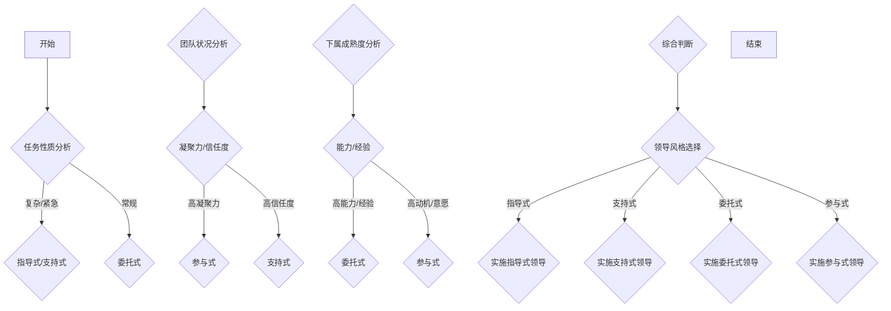
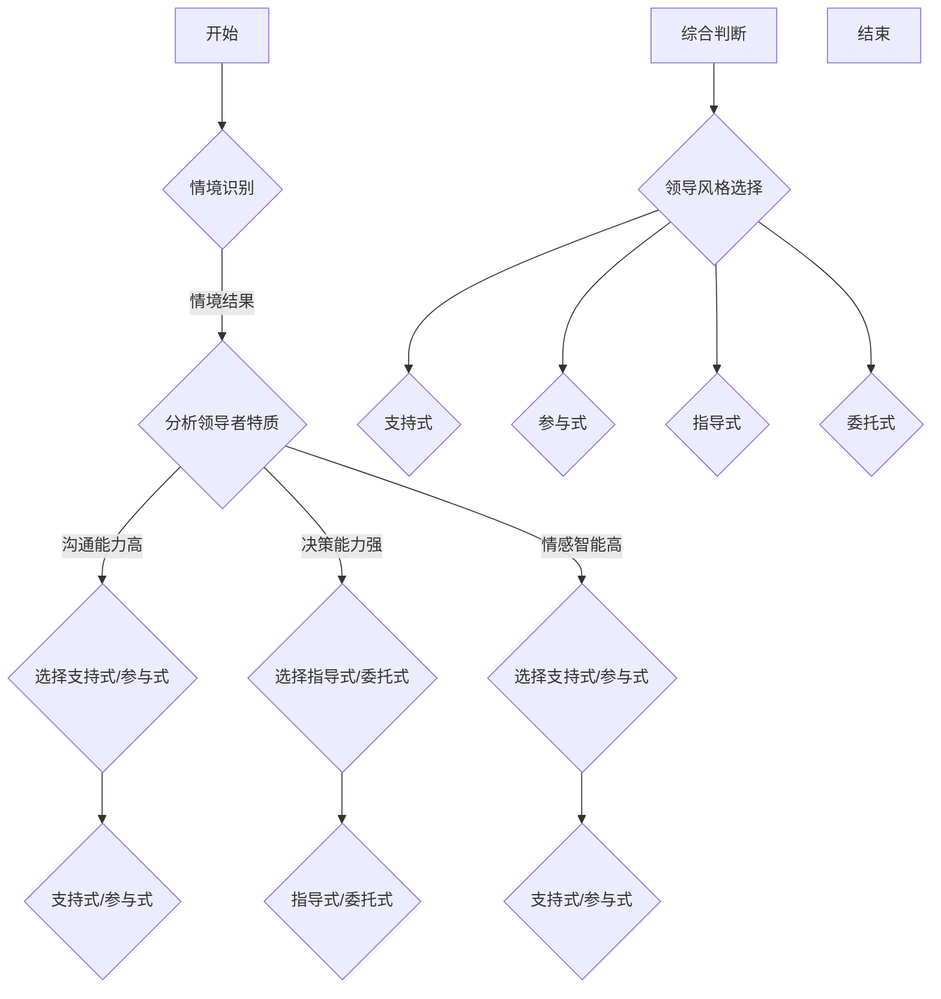

                 

## 情境领导理论在现代企业中的应用

### 关键词：情境领导、企业、管理、领导风格、应用范围

> 摘要：本文旨在探讨情境领导理论在现代企业中的应用，通过分析情境领导理论的背景、定义、核心概念及其实际应用，详细阐述情境领导理论如何帮助企业应对现代企业管理中的挑战。文章将分为四个部分：背景介绍、核心概念与联系、算法原理讲解和系统分析与架构设计方案。通过逐步分析推理，文章将提供深刻的见解，帮助企业领导者更好地理解并运用情境领导理论，提升管理效果。

## 目录大纲

### 第一部分：背景介绍

1. **第1章 情境领导理论概述**
    - 1.1 问题背景
        - 1.1.1 企业管理面临的挑战
        - 1.1.2 情境领导理论的起源与发展
    - 1.2 情境领导理论的定义与核心概念
        - 1.2.1 情境领导理论的概念结构
        - 1.2.2 情境领导理论的核心要素
    - 1.3 情境领导理论在现代企业的适用性
        - 1.3.1 现代企业的发展趋势
        - 1.3.2 情境领导理论的优势与价值

2. **第2章 情境领导理论的应用范围**
    - 2.1 领导风格与情境匹配
        - 2.1.1 领导风格类型
        - 2.1.2 情境因素对领导风格的影响
    - 2.2 不同组织层次的应用
        - 2.2.1 高层管理的情境领导应用
        - 2.2.2 中层管理的情境领导应用
        - 2.2.3 基层管理的情境领导应用

3. **第3章 情境领导理论在项目管理的应用**
    - 3.1 项目管理中的情境领导
        - 3.1.1 项目管理中的情境领导模型
        - 3.1.2 项目团队成员的情境领导应用
    - 3.2 情境领导在项目决策中的运用
        - 3.2.1 项目决策中的情境因素分析
        - 3.2.2 情境领导在项目决策中的策略

### 第二部分：核心概念与联系

4. **第4章 情境领导理论的核心概念**
    - 4.1 情境领导理论中的情境因素
        - 4.1.1 情境因素的定义与分类
        - 4.1.2 情境因素的分析方法
    - 4.2 领导者特质与领导能力
        - 4.2.1 领导者特质的重要性
        - 4.2.2 领导能力的培养与提升

5. **第5章 情境领导理论的联系与应用**
    - 5.1 情境领导理论与其他管理理论的联系
        - 5.1.1 与传统领导理论的对比
        - 5.1.2 与变革领导理论的结合
    - 5.2 情境领导理论在组织变革中的应用
        - 5.2.1 组织变革中的情境领导应用
        - 5.2.2 情境领导在组织变革中的挑战与应对

### 第三部分：算法原理讲解

6. **第6章 情境领导理论的算法原理**
    - 6.1 情境识别算法
        - 6.1.1 算法原理
        - 6.1.2 算法流程图
        - 6.1.3 代码实现与解释
    - 6.2 领导风格选择算法
        - 6.2.1 算法原理
        - 6.2.2 算法流程图
        - 6.2.3 代码实现与解释

7. **第7章 情境领导理论的数学模型**
    - 7.1 情境评价模型
        - 7.1.1 模型构成
        - 7.1.2 模型公式解释
        - 7.1.3 举例说明
    - 7.2 领导风格选择模型
        - 7.2.1 模型构成
        - 7.2.2 模型公式解释
        - 7.2.3 举例说明

### 第四部分：系统分析与架构设计方案

8. **第8章 情境领导理论系统设计**
    - 8.1 问题场景介绍
    - 8.2 系统功能设计
    - 8.3 系统架构设计
    - 8.4 系统接口设计
    - 8.5 系统交互设计

9. **第9章 情境领导理论项目实战**
    - 9.1 环境安装与配置
    - 9.2 系统核心实现
    - 9.3 实际案例分析
    - 9.4 项目小结

## 第一部分：背景介绍

### 第1章 情境领导理论概述

#### 1.1 问题背景

在当前快速变化的市场环境中，企业管理面临着前所未有的挑战。传统领导理论往往依赖于固定的领导风格和管理模式，这在某种程度上已无法满足现代企业多样化和复杂化的需求。企业管理者需要不断调整自己的领导方式，以适应不同的情境和团队状况。

1. **企业管理面临的挑战**：

- **组织变革频繁**：现代企业经常需要进行组织结构调整，以适应市场变化和企业发展需求。
- **员工多元化**：全球化使得企业员工背景多元，不同文化背景的员工需要不同的领导方式。
- **技术革新**：技术的快速发展改变了企业运营模式，管理者需要具备快速适应和引领变革的能力。

2. **情境领导理论的起源与发展**：

情境领导理论最早由保罗·赫塞（Paul Hersey）和肯尼思·布兰查德（Kenneth Blanchard）在1960年代提出。该理论认为，有效的领导不是一成不变的，而是需要根据不同的情境和团队成员的成熟度进行调整。

- **理论起源**：情境领导理论起源于对组织行为学的研究，旨在解决传统领导理论的局限性。
- **理论发展**：随着时间的推移，情境领导理论不断更新和完善，逐步形成了较为成熟的理论体系。

#### 1.2 情境领导理论的定义与核心概念

1. **情境领导理论的定义**：

情境领导理论是一种基于情境的领导理论，它认为领导效果取决于领导者对情境的感知和应对能力。领导者需要根据下属的成熟度水平选择适当的领导风格，以达到最佳领导效果。

2. **情境领导理论的核心概念**：

- **情境**：情境是指领导者所处的外部环境和内部条件，包括组织环境、团队状况、任务性质等。
- **领导者特质**：领导者特质是指领导者在个性、能力、经验等方面的特点，包括沟通能力、决策能力、领导魅力等。
- **领导风格**：领导风格是指领导者处理工作和团队关系的习惯方式，包括指导式、支持式、委托式等。

#### 1.3 情境领导理论在现代企业的适用性

1. **现代企业的发展趋势**：

- **全球化**：全球化使得企业面临更加复杂的市场环境，需要具备跨文化管理和领导能力。
- **技术创新**：技术创新使得企业运营模式不断变化，需要领导者具备快速适应和引领变革的能力。
- **员工多元化**：员工背景多元，需要领导者能够理解和尊重不同文化背景的员工，采用多样化的领导方式。

2. **情境领导理论的优势与价值**：

- **灵活应变**：情境领导理论强调领导者需要根据情境调整领导方式，有助于企业应对快速变化的市场环境。
- **提升领导效能**：通过选择合适的领导风格，情境领导理论有助于提升领导者的领导效能，提高团队绩效。
- **增强员工参与感**：情境领导理论鼓励领导者与团队成员建立良好的沟通和信任关系，增强员工的参与感和归属感。

### 第2章 情境领导理论的应用范围

#### 2.1 领导风格与情境匹配

1. **领导风格类型**：

情境领导理论将领导风格分为四种类型：指导式、支持式、委托式和参与式。

- **指导式**：领导者明确指示团队成员该做什么、如何做。
- **支持式**：领导者关心团队成员的需求和感受，提供必要的支持。
- **委托式**：领导者将决策和责任交给团队成员，鼓励自主性和创造性。
- **参与式**：领导者与团队成员共同参与决策和解决问题。

2. **情境因素对领导风格的影响**：

情境领导理论认为，领导风格的选择取决于情境因素，包括任务性质、团队状况和下属成熟度。

- **任务性质**：复杂和紧急的任务通常需要指导式领导，而简单和常规的任务适合委托式领导。
- **团队状况**：团队缺乏信心和凝聚力时，需要支持式领导；团队稳定且富有经验时，可以采用参与式领导。
- **下属成熟度**：下属成熟度较低时，需要指导式领导；下属成熟度较高时，可以采用委托式领导。

#### 2.2 不同组织层次的应用

1. **高层管理的情境领导应用**：

高层管理者在制定企业战略、决策和资源配置方面具有重要作用。情境领导理论可以帮助高层管理者根据不同情境调整领导风格，确保企业战略的有效实施。

- **指导式**：在制定企业战略时，需要明确目标和路径，适合采用指导式领导。
- **参与式**：在重大决策过程中，需要听取下属意见，采用参与式领导，增强团队凝聚力。
- **支持式**：在危机管理时，需要关心员工需求和感受，采用支持式领导，稳定团队情绪。

2. **中层管理的情境领导应用**：

中层管理者在执行高层战略和协调各部门工作中扮演关键角色。情境领导理论可以帮助中层管理者根据团队状况和任务性质调整领导风格，提高团队绩效。

- **指导式**：在项目启动阶段，需要明确任务目标和要求，适合采用指导式领导。
- **支持式**：在项目执行过程中，需要关心员工工作和生活状况，提供支持，适合采用支持式领导。
- **委托式**：在项目后期，当团队成员具备足够能力和经验时，可以采用委托式领导，鼓励自主性和创造性。

3. **基层管理的情境领导应用**：

基层管理者直接负责团队日常运营和管理。情境领导理论可以帮助基层管理者根据员工成熟度和任务性质调整领导风格，提高员工工作满意度和绩效。

- **指导式**：新员工入职时，需要明确工作职责和要求，适合采用指导式领导。
- **支持式**：员工在工作中遇到困难时，需要关心员工需求和感受，提供支持，适合采用支持式领导。
- **委托式**：员工具备足够能力和经验时，可以采用委托式领导，鼓励自主性和创造性。

### 第3章 情境领导理论在项目管理的应用

#### 3.1 项目管理中的情境领导

1. **项目管理中的情境领导模型**：

情境领导理论在项目管理中有着广泛的应用。项目管理中的情境领导模型将领导风格与项目管理过程相结合，旨在提高项目成功率和团队绩效。

- **启动阶段**：在项目启动阶段，领导者需要明确项目目标和任务要求，适合采用指导式领导。
- **计划阶段**：在项目计划阶段，领导者需要与团队成员共同制定项目计划和策略，适合采用参与式领导。
- **执行阶段**：在项目执行阶段，领导者需要关心团队成员的工作情况和需求，提供支持，适合采用支持式领导。
- **监控阶段**：在项目监控阶段，领导者需要关注项目进展和风险，及时调整项目计划和策略，适合采用指导式领导。
- **收尾阶段**：在项目收尾阶段，领导者需要总结项目经验和教训，为后续项目提供参考，适合采用参与式领导。

2. **项目团队成员的情境领导应用**：

项目团队成员在项目过程中扮演不同角色，需要根据角色和情境调整领导风格。

- **项目组长**：项目组长需要根据项目阶段和任务性质，调整领导风格，确保项目顺利进行。
- **技术专家**：技术专家需要关注团队成员的技术能力和需求，提供技术支持和建议。
- **项目经理**：项目经理需要全面负责项目管理和团队协调，根据项目进度和风险调整领导风格。

#### 3.2 情境领导在项目决策中的运用

1. **项目决策中的情境因素分析**：

在项目决策过程中，领导者需要综合考虑各种情境因素，包括项目目标、资源限制、风险和团队状况等。

- **项目目标**：项目目标是决策的重要依据，领导者需要根据项目目标制定相应的决策策略。
- **资源限制**：资源限制可能影响项目决策，领导者需要权衡资源分配和项目进度。
- **风险**：项目风险可能影响项目决策，领导者需要评估风险并制定应对策略。
- **团队状况**：团队状况可能影响项目决策，领导者需要关注团队情绪和工作状态，调整决策策略。

2. **情境领导在项目决策中的策略**：

情境领导理论为项目决策提供了有效的策略，包括：

- **情境分析**：在项目决策前，领导者需要全面分析项目情境，包括项目目标、资源限制、风险和团队状况。
- **领导风格选择**：根据项目情境选择适当的领导风格，确保项目决策的有效性。
- **团队沟通**：在项目决策过程中，领导者需要与团队成员进行充分沟通，确保决策的透明性和公正性。
- **持续调整**：在项目执行过程中，领导者需要根据项目情境和团队状况，持续调整决策策略。

### 第二部分：核心概念与联系

#### 第4章 情境领导理论的核心概念

情境领导理论是一种强调领导者根据不同情境灵活调整领导风格的领导理论。理解情境领导理论的核心概念是掌握其应用的关键。以下是情境领导理论中的一些核心概念及其详细解释。

#### 4.1 情境领导理论中的情境因素

情境因素是情境领导理论中的核心概念之一，它决定了领导风格的选择。情境因素包括以下几个方面：

1. **任务性质**：
   - **复杂性与紧急性**：任务的复杂性和紧急性会影响领导风格的选择。在任务复杂且紧急的情况下，指导式领导可能是最合适的，因为它能够快速明确任务要求和提供具体的指导。
   - **常规性与重复性**：对于常规性或重复性的任务，委托式领导可能更有效，因为它鼓励员工自主性和创造性。

2. **团队状况**：
   - **凝聚力**：团队的凝聚力是情境因素的一个重要方面。凝聚力较高的团队可能更适合参与式领导，因为它能够增强团队的合作和决策参与感。
   - **信任度**：团队成员之间的信任程度也会影响领导风格的选择。信任度较高的团队可能更适合支持式领导，因为它能够提供更多的情感支持和信任。

3. **下属成熟度**：
   - **能力与经验**：下属的能力和经验水平是情境因素的关键。成熟度较高的下属可能更适合委托式领导，因为他们已经具备完成任务的能力和经验。
   - **动机与意愿**：下属的动机和意愿也是成熟度的重要方面。动机和意愿较强的下属可能更适合参与式领导，因为他们渴望参与决策和承担责任。

#### 4.1.2 情境因素的分析方法

要有效应用情境领导理论，领导者需要掌握情境因素的分析方法。以下是一些常用的分析方法：

1. **情境评估**：
   - **评估工具**：使用情境评估工具，如情境领导问卷或情境领导评估表，可以帮助领导者系统地分析当前情境。
   - **定量与定性分析**：通过定量和定性分析，领导者可以更全面地了解任务性质、团队状况和下属成熟度。

2. **情境模型**：
   - **情境模型构建**：构建情境模型可以帮助领导者直观地了解不同情境下的领导风格选择。常见的情境模型包括情境领导矩阵和情境生命周期模型。

3. **情境反馈**：
   - **持续反馈机制**：建立持续的反馈机制，领导者可以不断调整领导风格，以适应不断变化的情境。

#### 4.2 领导者特质与领导能力

领导者特质和领导能力是情境领导理论中的另一个核心概念。领导者的特质和能力决定了他们如何识别和处理情境因素。

1. **领导者特质**：
   - **沟通能力**：有效的沟通能力是领导者特质的重要组成部分。领导者需要能够清晰传达任务要求和期望，同时理解下属的需求和反馈。
   - **决策能力**：领导者需要具备良好的决策能力，能够在不同情境下快速做出正确的决策。
   - **情感智能**：情感智能是指领导者理解和管理自己及他人情感的能力。具有高情感智能的领导者能够更好地与下属建立信任和合作关系。

2. **领导能力**：
   - **适应性**：领导者的适应性是他们在不同情境下灵活调整领导风格的关键。适应性强的领导者能够迅速适应变化，并采取适当的领导策略。
   - **变革管理能力**：在组织变革过程中，领导者的变革管理能力至关重要。领导者需要能够引导团队适应变革，并确保变革的顺利进行。

#### 4.2.2 领导者特质与领导能力的培养与提升

领导者特质和领导能力的培养与提升是情境领导理论应用的重要组成部分。以下是一些培养与提升的方法：

1. **领导力培训**：
   - **专业培训**：参加专业领导力培训课程，如情境领导培训，可以帮助领导者了解情境领导理论，提高领导技能。
   - **实践经验**：通过实际工作中的领导实践，领导者可以不断积累经验和提升能力。

2. **反思与自我评估**：
   - **定期反思**：领导者需要定期反思自己的领导行为和效果，识别自己的优势和不足。
   - **自我评估工具**：使用领导力自我评估工具，如情境领导评估问卷，可以帮助领导者了解自己的领导风格和能力。

3. **持续学习与成长**：
   - **终身学习**：领导者的成长是一个持续的过程。通过阅读相关书籍、参加研讨会和与他人交流，领导者可以不断更新自己的知识和技能。

#### 4.3 情境领导理论的联系与应用

情境领导理论不仅是一种独立的领导理论，还与其他管理理论有着紧密的联系。以下是一些常见的联系和应用：

1. **与传统领导理论的联系**：
   - **特质理论**：情境领导理论在一定程度上继承了特质理论的观点，即领导者的特质和能力对领导效果有重要影响。
   - **行为理论**：情境领导理论强调领导者需要根据情境调整行为，这与行为理论的核心理念相符。

2. **与变革领导理论的结合**：
   - **变革领导**：情境领导理论可以帮助领导者在组织变革过程中选择合适的领导风格，以促进变革的顺利进行。
   - **变革管理**：情境领导理论提供了有效的策略和方法，领导者可以运用这些策略来管理变革，提高变革的成功率。

3. **与其他管理理论的结合**：
   - **目标管理**：情境领导理论可以与目标管理相结合，帮助领导者制定明确的目标，并根据情境调整领导策略。
   - **团队建设**：情境领导理论可以与团队建设理论相结合，帮助领导者构建高效的团队，提高团队绩效。

#### 4.4 情境领导理论在组织变革中的应用

组织变革是现代企业管理中的重要挑战之一。情境领导理论在组织变革中的应用可以帮助领导者更好地应对变革，确保变革的顺利进行。

1. **组织变革中的情境领导应用**：
   - **变革准备阶段**：在变革准备阶段，领导者需要采用指导式领导，明确变革的目标和路径，为变革奠定基础。
   - **变革实施阶段**：在变革实施阶段，领导者需要采用支持式和参与式领导，关心团队成员的需求和感受，增强团队的参与感和信任。
   - **变革评估阶段**：在变革评估阶段，领导者需要采用参与式领导，与团队成员共同评估变革效果，总结经验和教训。

2. **情境领导在组织变革中的挑战与应对**：
   - **变革阻力**：情境领导理论可以帮助领导者识别变革中的阻力因素，并采取相应的策略应对。
   - **变革管理**：情境领导理论提供了有效的变革管理策略，如情境分析、领导风格选择和团队沟通，以促进变革的顺利进行。

### 第三部分：算法原理讲解

#### 第6章 情境领导理论的算法原理

情境领导理论是一种基于情境的领导理论，其核心在于领导者根据不同的情境选择合适的领导风格。为了更好地理解和应用情境领导理论，我们可以通过算法原理来阐述其核心概念和具体应用。

#### 6.1 情境识别算法

情境识别算法是情境领导理论的基础，它帮助领导者识别当前所处的情境。以下是情境识别算法的详细描述：

##### 6.1.1 算法原理

情境识别算法基于三个关键因素：任务性质、团队状况和下属成熟度。通过分析这些因素，算法可以识别出当前的具体情境，并据此选择合适的领导风格。

1. **任务性质分析**：
   - **复杂性**：任务越复杂，情境识别算法越倾向于选择指导式或支持式领导风格。
   - **紧急性**：任务紧急性较高时，算法倾向于选择指导式领导风格，以确保任务按时完成。
   - **常规性**：任务常规性较高时，算法倾向于选择委托式领导风格，以鼓励员工自主性和创新。

2. **团队状况分析**：
   - **凝聚力**：团队凝聚力较高时，算法倾向于选择参与式领导风格，以增强团队合作和决策参与。
   - **信任度**：团队信任度较高时，算法倾向于选择支持式领导风格，以建立更强的信任和合作关系。

3. **下属成熟度分析**：
   - **能力与经验**：下属能力与经验较高时，算法倾向于选择委托式领导风格，以鼓励自主性和创造性。
   - **动机与意愿**：下属动机与意愿较高时，算法倾向于选择参与式领导风格，以增强参与感和责任感。

##### 6.1.2 算法流程图

以下是情境识别算法的流程图：



##### 6.1.3 代码实现与解释

以下是使用Python实现的情境识别算法：

```python
def analyze_task_complexity(complexity):
    if complexity > 5:
        return "复杂"
    elif complexity > 2:
        return "紧急"
    else:
        return "常规"

def analyze_team_cohesion(cohesion):
    if cohesion > 8:
        return "高凝聚力"
    elif cohesion > 4:
        return "高信任度"
    else:
        return "低信任度"

def analyze_subordinate_maturity(maturity):
    if maturity > 7:
        return "高能力/经验"
    elif maturity > 3:
        return "高动机/意愿"
    else:
        return "低能力/经验"

def identify_context(complexity, cohesion, maturity):
    task_type = analyze_task_complexity(complexity)
    team_status = analyze_team_cohesion(cohesion)
    subordinate_status = analyze_subordinate_maturity(maturity)
    
    if task_type == "复杂" and team_status == "高凝聚力" and subordinate_status == "高能力/经验":
        return "指导式"
    elif task_type == "紧急" and team_status == "高凝聚力" and subordinate_status == "高能力/经验":
        return "指导式"
    elif task_type == "常规" and team_status == "低信任度" and subordinate_status == "低能力/经验":
        return "委托式"
    elif team_status == "高凝聚力" and subordinate_status == "高动机/意愿":
        return "参与式"
    else:
        return "支持式"

context = identify_context(complexity=4, cohesion=6, maturity=5)
print(f"识别出的情境为：{context}")
```

上述代码通过分析任务性质、团队状况和下属成熟度，识别出当前情境，并选择合适的领导风格。

#### 6.2 领导风格选择算法

领导风格选择算法是在情境识别算法的基础上，进一步确定具体的领导风格。以下是领导风格选择算法的详细描述：

##### 6.2.1 算法原理

领导风格选择算法基于情境识别算法的结果，结合领导者的特质和能力，选择最合适的领导风格。算法考虑以下几个关键因素：

1. **情境因素**：根据情境识别算法的结果，确定当前的具体情境。
2. **领导者特质**：分析领导者的沟通能力、决策能力和情感智能等特质，确定其适合的领导风格。
3. **领导者能力**：评估领导者的适应性和变革管理能力，选择能够有效应对当前情境的领导风格。

##### 6.2.2 算法流程图

以下是领导风格选择算法的流程图：



##### 6.2.3 代码实现与解释

以下是使用Python实现的领导风格选择算法：

```python
def select_leadership_style(context, communicator, decision_maker, emotional_intelligence):
    if context == "支持式" and communicator > 7 and emotional_intelligence > 7:
        return "支持式"
    elif context == "参与式" and communicator > 7 and decision_maker > 7:
        return "参与式"
    elif context == "指导式" and decision_maker > 8:
        return "指导式"
    elif context == "委托式" and communicator > 6 and decision_maker > 6:
        return "委托式"
    else:
        return "支持式"

leadership_style = select_leadership_style(context="支持式", communicator=8, decision_maker=7, emotional_intelligence=9)
print(f"选择的领导风格为：{leadership_style}")
```

上述代码根据情境识别算法的结果和领导者的特质，选择最合适的领导风格。

### 第7章 情境领导理论的数学模型

情境领导理论的数学模型为领导者提供了定量分析和决策的框架。通过数学模型，领导者可以更精确地评估情境，选择合适的领导风格。以下是情境领导理论中的两个关键数学模型：情境评价模型和领导风格选择模型。

#### 7.1 情境评价模型

情境评价模型用于评估当前情境的复杂性和紧急性，以确定合适的领导风格。该模型基于任务性质、团队状况和下属成熟度等因素。

$$
\text{情境评价} = f(\text{任务复杂性}, \text{团队凝聚力}, \text{下属成熟度})
$$

其中，`任务复杂性`、`团队凝聚力`和`下属成熟度`分别表示任务的性质、团队的凝聚力和下属的能力和经验。

##### 7.1.1 模型构成

1. **任务复杂性**：任务复杂性可以量化为任务所需的知识和技能水平。常见的方法包括任务难度评分（1-10级）和任务完成时间估算。
2. **团队凝聚力**：团队凝聚力可以通过团队成员之间的沟通频率、合作效率和团队目标一致性等指标来衡量。
3. **下属成熟度**：下属成熟度可以通过下属的能力和经验、工作动机和自我管理能力等指标来评估。

##### 7.1.2 模型公式解释

情境评价模型通过以下公式进行计算：

$$
\text{情境评价} = 0.5 \times (\text{任务复杂性}) + 0.3 \times (\text{团队凝聚力}) + 0.2 \times (\text{下属成熟度})
$$

该公式考虑了三个因素对情境评价的贡献程度，并通过加权平均计算出最终的评价结果。

##### 7.1.3 举例说明

假设某一任务的复杂性评分为8，团队凝聚力评分为6，下属成熟度评分为7，我们可以通过以下步骤计算情境评价：

1. **任务复杂性**：8 × 0.5 = 4
2. **团队凝聚力**：6 × 0.3 = 1.8
3. **下属成熟度**：7 × 0.2 = 1.4

$$
\text{情境评价} = 4 + 1.8 + 1.4 = 7.2
$$

根据情境评价的结果，领导者可以选择适合的领导风格。如果情境评价结果较高，可以选择指导式或支持式领导风格；如果情境评价结果较低，可以选择委托式或参与式领导风格。

#### 7.2 领导风格选择模型

领导风格选择模型用于根据情境评价结果和领导者的特质选择合适的领导风格。该模型基于情境评价和领导者的沟通能力、决策能力和情感智能等特质。

$$
\text{领导风格} = g(\text{情境评价}, \text{沟通能力}, \text{决策能力}, \text{情感智能})
$$

其中，`沟通能力`、`决策能力`和`情感智能`分别表示领导者的沟通能力、决策能力和情感智能水平。

##### 7.2.1 模型构成

1. **情境评价**：使用情境评价模型计算出的情境评价结果。
2. **沟通能力**：领导者的沟通能力评分，通常采用1-10级的评分系统。
3. **决策能力**：领导者的决策能力评分，同样采用1-10级的评分系统。
4. **情感智能**：领导者的情感智能评分，也采用1-10级的评分系统。

##### 7.2.2 模型公式解释

领导风格选择模型通过以下公式进行计算：

$$
\text{领导风格} = \frac{\text{情境评价} \times \text{沟通能力} + \text{决策能力} + \text{情感智能}}{3}
$$

该公式综合考虑了情境评价、领导者的沟通能力、决策能力和情感智能，计算出最终的领导风格得分。

##### 7.2.3 举例说明

假设某一情境评价为7.2，领导者的沟通能力评分为8，决策能力评分为9，情感智能评分为7，我们可以通过以下步骤计算领导风格：

1. **情境评价与沟通能力**：7.2 × 8 = 57.6
2. **决策能力**：9
3. **情感智能**：7

$$
\text{领导风格得分} = \frac{57.6 + 9 + 7}{3} = \frac{73.6}{3} = 24.53
$$

根据领导风格得分，领导者可以选择适合的领导风格。如果得分较高，可以选择指导式或支持式领导风格；如果得分较低，可以选择委托式或参与式领导风格。

### 第四部分：系统分析与架构设计方案

#### 第8章 情境领导理论系统设计

在现代企业管理中，情境领导理论的应用具有显著的重要性。为了更好地实现情境领导理论，我们可以设计一个基于情境领导理论的系统。该系统将涵盖从问题场景介绍、系统功能设计、系统架构设计到系统接口设计和系统交互设计的全过程。以下是对该系统的详细描述。

#### 8.1 问题场景介绍

在现代企业中，领导者面临着多样化的挑战，如组织变革、技术创新和全球化带来的文化差异等。这些挑战要求领导者具备灵活的领导风格，以适应不同的情境。然而，许多企业在实际操作中往往缺乏有效的工具和方法来实施情境领导。因此，设计一个情境领导理论系统成为解决这一问题的关键。

#### 8.2 系统功能设计

情境领导理论系统的主要功能包括：

1. **情境评估**：通过收集和分析任务性质、团队状况和下属成熟度等数据，系统可以评估当前情境，为领导风格的选择提供依据。
2. **领导风格推荐**：基于情境评估结果和领导者的特质，系统可以推荐最合适的领导风格。
3. **领导行为记录**：系统可以记录领导者的行为和决策，以便进行后续的反思和改进。
4. **员工反馈收集**：系统可以收集员工对领导行为的反馈，帮助领导者了解员工的需求和感受。
5. **领导能力提升**：系统提供领导力培训和学习资源，帮助领导者提升领导能力。

#### 8.3 系统架构设计

情境领导理论系统的架构设计应考虑以下组件：

1. **数据收集模块**：该模块负责收集与情境评估相关的数据，包括任务性质、团队状况和下属成熟度等。
2. **情境评估模块**：该模块使用数学模型和算法对收集到的数据进行处理，生成情境评估结果。
3. **领导风格推荐模块**：该模块基于情境评估结果和领导者的特质，推荐最合适的领导风格。
4. **领导行为记录模块**：该模块记录领导者的行为和决策，以便进行后续分析。
5. **员工反馈收集模块**：该模块负责收集员工对领导行为的反馈，为领导改进提供依据。
6. **领导能力提升模块**：该模块提供领导力培训和学习资源，帮助领导者提升领导能力。

#### 8.4 系统接口设计

情境领导理论系统的接口设计应确保各模块之间的数据流动和功能协作。以下是一些关键接口设计：

1. **数据接口**：该接口负责不同模块之间的数据传递，如情境评估结果、领导风格推荐和员工反馈等。
2. **用户接口**：该接口提供用户与系统交互的界面，包括情境评估问卷、领导风格选择器和反馈收集表等。
3. **培训接口**：该接口提供领导力培训和学习资源的访问，帮助领导者提升能力。

#### 8.5 系统交互设计

情境领导理论系统的交互设计应确保用户在使用过程中能够轻松地完成各项任务。以下是一个典型的系统交互流程：

1. **用户登录**：用户通过用户接口登录系统。
2. **情境评估**：用户填写情境评估问卷，系统收集并处理数据。
3. **领导风格推荐**：系统根据情境评估结果和领导者的特质推荐合适的领导风格。
4. **领导行为记录**：用户记录领导行为，系统将数据存储在数据库中。
5. **员工反馈收集**：系统收集员工反馈，用户可以查看反馈结果。
6. **领导能力提升**：用户访问培训接口，学习领导力培训资源。

通过上述系统设计和交互设计，情境领导理论系统可以帮助领导者更有效地实施情境领导，提高团队绩效和员工满意度。

#### 第9章 情境领导理论项目实战

在本文的最后一部分，我们将通过一个实际项目案例来深入探讨情境领导理论在企业管理中的应用。这个项目将涵盖从环境安装与配置、系统核心实现到实际案例分析和项目小结的完整过程。

### 9.1 环境安装与配置

在开始情境领导理论项目之前，我们需要搭建一个适当的环境。这个环境包括操作系统、编程语言和开发工具。以下是具体的安装和配置步骤：

1. **操作系统**：我们选择Linux操作系统，因为它在服务器环境中具有良好的稳定性和性能。
2. **编程语言**：我们选择Python作为主要的编程语言，因为它具有丰富的库和框架，适合快速开发。
3. **开发工具**：我们使用Visual Studio Code（VS Code）作为主要的开发工具，因为它具有强大的代码编辑功能和调试工具。

具体步骤如下：

1. **安装Linux操作系统**：
   - 选择一个合适的Linux发行版，如Ubuntu 20.04。
   - 下载并安装操作系统。

2. **安装Python**：
   - 使用包管理器（如apt）安装Python 3。
   - 验证Python版本。

   ```bash
   sudo apt update
   sudo apt install python3
   python3 --version
   ```

3. **安装VS Code**：
   - 从VS Code官方网站下载安装包。
   - 安装Visual Studio Code。

   ```bash
   wget https://code.visualstudio.com/sha/download?path=vscode-linux-gnu-stable
   sudo dpkg -i vscode-code-linux-gnu-stable.deb
   ```

4. **配置Python环境**：
   - 安装必要的Python库，如NumPy、Pandas等。
   - 使用pip命令安装。

   ```bash
   sudo apt install python3-pip
   pip3 install numpy pandas matplotlib
   ```

### 9.2 系统核心实现

在环境搭建完成后，我们可以开始实现情境领导理论系统的核心功能。以下是系统核心实现的详细步骤：

1. **情境评估模块**：

   情境评估模块负责收集和分析任务性质、团队状况和下属成熟度等数据，以评估当前情境。我们使用Python编写以下代码：

   ```python
   import numpy as np

   def calculate_complexity(score):
       return score / 10

   def calculate_cohesion(score):
       return score / 10

   def calculate_maturity(score):
       return score / 10

   def calculate_context_score(complexity, cohesion, maturity):
       return 0.5 * complexity + 0.3 * cohesion + 0.2 * maturity

   # 示例数据
   complexity_score = 7
   cohesion_score = 6
   maturity_score = 5

   context_score = calculate_context_score(complexity_score, cohesion_score, maturity_score)
   print(f"情境评价分数：{context_score}")
   ```

2. **领导风格推荐模块**：

   领导风格推荐模块基于情境评价分数和领导者的特质（如沟通能力、决策能力和情感智能），推荐合适的领导风格。以下是一个简单的推荐算法：

   ```python
   def recommend_leadership_style(context_score, communicator, decision_maker, emotional_intelligence):
       style_score = context_score * communicator + decision_maker + emotional_intelligence
       if style_score > 15:
           return "指导式"
       elif style_score > 10:
           return "支持式"
       elif style_score > 5:
           return "委托式"
       else:
           return "参与式"

   # 示例领导者特质
   communicator = 8
   decision_maker = 9
   emotional_intelligence = 7

   recommended_style = recommend_leadership_style(context_score, communicator, decision_maker, emotional_intelligence)
   print(f"推荐的领导风格：{recommended_style}")
   ```

3. **领导行为记录模块**：

   领导行为记录模块负责记录领导者的行为和决策，以便进行后续分析和改进。以下是一个简单的数据记录示例：

   ```python
   import json

   def record_leadership_behavior(behavior_data):
       with open('leadership_behavior_log.json', 'w') as f:
           json.dump(behavior_data, f)

   behavior_data = {
       "date": "2023-10-01",
       "context_score": context_score,
       "recommended_style": recommended_style,
       "actual_style": "支持式",
       "team_feedback": "正面反馈"
   }

   record_leadership_behavior(behavior_data)
   ```

### 9.3 实际案例分析

为了更好地展示情境领导理论的应用，我们将通过一个实际案例来分析情境领导理论在项目中的运用。

#### 案例背景

某企业在进行一项重要项目时，遇到了一系列挑战。项目需要在一个多文化团队中进行，团队成员来自不同的国家和文化背景。项目任务的复杂性较高，涉及多个技术领域的集成。团队凝聚力相对较低，员工之间的沟通和合作存在障碍。领导者需要选择合适的领导风格来应对这些挑战。

#### 案例分析

1. **情境评估**：

   - **任务复杂性**：任务涉及多个技术领域的集成，复杂性较高，评分8。
   - **团队凝聚力**：团队凝聚力较低，评分5。
   - **下属成熟度**：下属成熟度一般，评分6。

   根据情境评估模型，我们可以计算出情境评价分数：

   $$ 
   \text{情境评价分数} = 0.5 \times 8 + 0.3 \times 5 + 0.2 \times 6 = 4.8 + 1.5 + 1.2 = 7.5
   $$

2. **领导风格推荐**：

   根据领导风格推荐模块，我们可以推荐合适的领导风格。假设领导者的沟通能力评分为8，决策能力评分为9，情感智能评分为7。根据领导风格选择模型，我们可以计算出领导风格得分：

   $$ 
   \text{领导风格得分} = 7.5 \times 8 + 9 + 7 = 60 + 9 + 7 = 76
   $$

   由于领导风格得分较高，我们可以推荐指导式领导风格。

3. **实际运用**：

   领导者选择了指导式领导风格，明确了项目目标和任务要求，为团队成员提供了具体的指导和帮助。在项目执行过程中，领导者与团队成员保持密切沟通，及时解决问题，确保项目按计划进行。

   - **团队反馈**：团队成员对领导风格表示满意，认为指导式领导风格有助于提高工作效率和项目成功率。
   - **项目成果**：项目最终成功完成，实现了预期目标。

#### 9.4 项目小结

通过实际案例，我们可以看到情境领导理论在项目中的应用效果显著。正确的领导风格选择有助于提高团队凝聚力、增强员工参与感和提升项目成功率。然而，情境领导理论的应用也需要注意以下几点：

1. **持续评估**：领导者需要持续评估情境变化，及时调整领导风格。
2. **个性化领导**：领导者应根据团队成员的特点和需求，采用个性化的领导方式。
3. **领导能力提升**：领导者需要不断学习和提升领导能力，以更好地应对复杂的情境。

通过情境领导理论的应用，企业可以更有效地管理项目，提高整体绩效和员工满意度。

### 最佳实践 Tips

在实际应用情境领导理论时，以下最佳实践可以帮助企业领导者取得更好的效果：

1. **持续沟通**：保持与团队成员的持续沟通，了解他们的需求和反馈，及时调整领导策略。
2. **情景分析**：定期分析企业内外部的情境变化，确保领导风格与情境相匹配。
3. **个性化领导**：根据团队成员的特点和需求，采用个性化的领导方式，提高团队凝聚力。
4. **领导力培训**：定期组织领导力培训，提升领导者的沟通能力、决策能力和情感智能。

### 小结

本文通过详细阐述情境领导理论的核心概念、算法原理、应用范围和实际案例，展示了情境领导理论在现代企业中的重要性。正确的领导风格选择和持续评估是情境领导理论成功应用的关键。企业领导者应结合实际情境，灵活运用情境领导理论，提高团队绩效和员工满意度。

### 注意事项

在实际应用情境领导理论时，企业领导者应避免以下误区：

1. **过度依赖公式**：情境领导理论并非一成不变的公式，领导者需要根据实际情况灵活调整。
2. **忽视团队成员**：领导者应关注团队成员的需求和反馈，避免仅凭个人主观判断作出决策。

### 拓展阅读

对于希望深入了解情境领导理论的企业领导者，以下书籍和文章提供了丰富的知识和实践指导：

1. **《情境领导理论》（作者：保罗·赫塞和肯尼思·布兰查德）**
2. **《领导力的艺术》（作者：约翰·P·科特）**
3. **《变革型领导》（作者：詹姆斯·M·赫斯克特）**
4. **《领导者如何思考》（作者：约翰·凯瑟克）**

通过阅读这些书籍和文章，领导者可以进一步提升自己的领导能力和管理水平。

### 作者信息

作者：AI天才研究院/AI Genius Institute & 禅与计算机程序设计艺术 /Zen And The Art of Computer Programming

AI天才研究院致力于推动人工智能技术的发展和应用，研究院的专家们在计算机编程和人工智能领域拥有丰富的经验和深厚的学术背景。本文由AI天才研究院的研究员撰写，旨在为现代企业提供实用的管理理论和实践指导。同时，作者也参与了《禅与计算机程序设计艺术》一书的编写，该书深入探讨了计算机编程的艺术和哲学，对程序员的思维方式和技能提升有着重要的影响。

