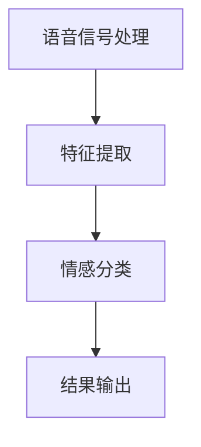
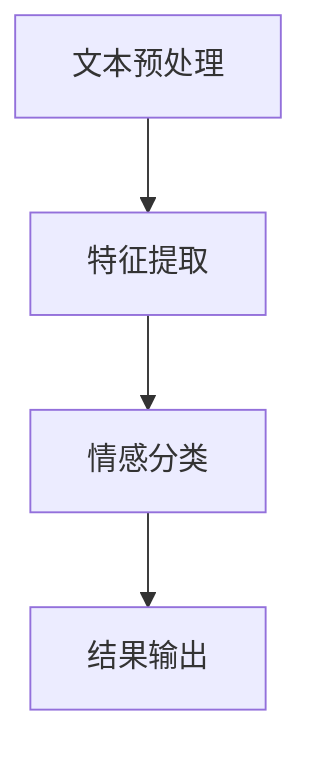
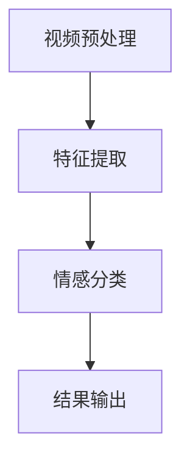
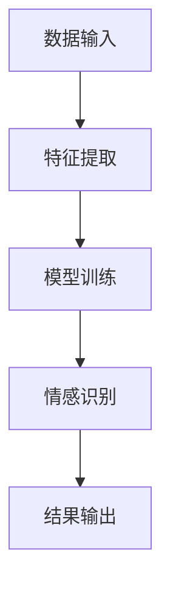
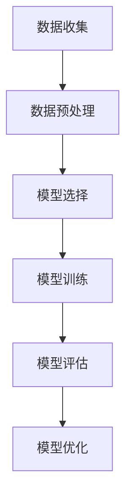
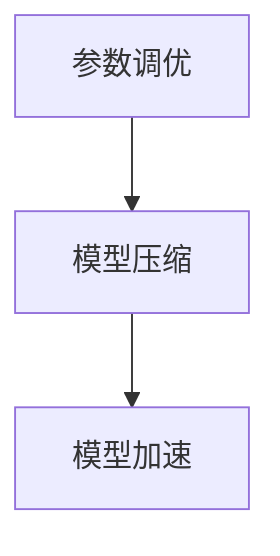
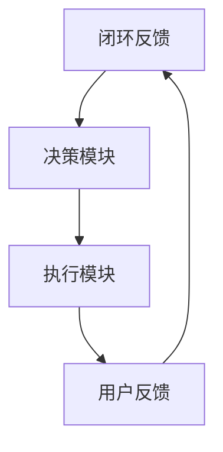
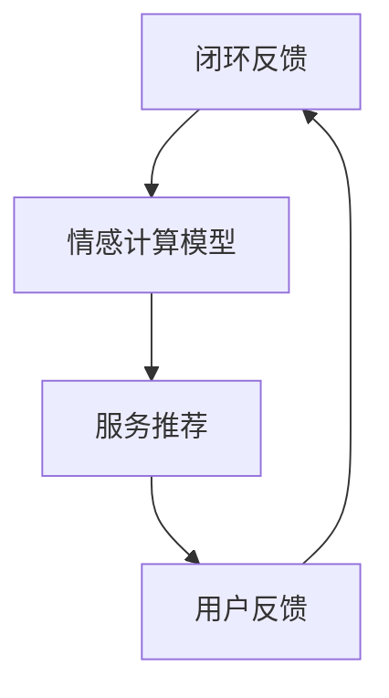
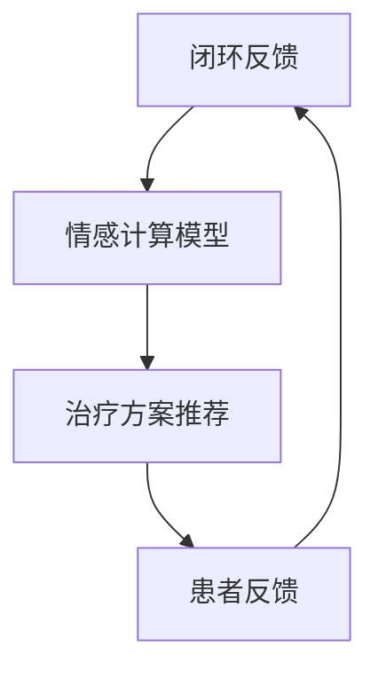

                 

## 情感计算增强AI Agent：提升LLM的情感智能

### 关键词

- 情感计算
- AI Agent
- 大语言模型（LLM）
- 情感智能
- 技术实现
- 应用场景
- 未来趋势

### 摘要

本文旨在探讨情感计算如何增强AI Agent的情感智能，从而提升大语言模型（LLM）在自然语言处理中的表现。通过介绍情感计算的基本概念、原理与技术，本文将详细分析情感计算在AI Agent中的应用，以及如何实现情感计算增强的LLM。此外，还将探讨情感计算增强AI Agent在实际场景中的应用、未来发展趋势，并总结最佳实践与注意事项。

### 目录大纲

1. 情感计算概述
   1.1.1 情感计算的基本概念
   1.1.2 情感计算的重要性
   1.1.3 情感计算的发展历程
2. 情感计算的原理与技术
   2.1.1 情感识别技术
   2.1.2 情感增强技术
3. 情感计算在AI Agent中的应用
   3.1.1 AI Agent的基本概念
   3.1.2 情感计算在AI Agent中的角色
   3.1.3 情感计算在AI Agent中的应用案例
4. 情感计算增强AI Agent的技术实现
   4.1.1 情感计算模型的训练与优化
   4.1.2 情感计算在AI Agent中的集成与应用
5. 提升LLM情感智能的方法
   5.1.1 LLM的情感智能概述
   5.1.2 情感智能提升的挑战与策略
   5.1.3 实现情感智能增强的实践案例
6. 情感计算增强AI Agent在实际场景中的应用
   6.1.1 客户服务场景
   6.1.2 教育与培训场景
   6.1.3 医疗健康场景
7. 情感计算增强AI Agent的未来发展趋势
   7.1.1 技术创新方向
   7.1.2 行业应用前景
   7.1.3 社会与伦理问题
8. 情感计算增强AI Agent的最佳实践
   8.1.1 成功案例分析
   8.1.2 实践技巧与建议
   8.1.3 遇到的问题与解决方案

### 第1章：情感计算概述

情感计算是近年来人工智能领域的重要研究方向，其核心目标是使计算机具备识别、理解、处理和生成人类情感的能力。情感计算的基本概念包括情感识别、情感表达和情感交互。情感识别是指计算机通过语音、文本、图像等多模态数据识别出人类情感的过程；情感表达是指计算机模拟人类情感表达，如语音语调、面部表情和身体语言等；情感交互则是指计算机与人类在情感层面进行沟通和互动。

情感计算的重要性体现在多个方面。首先，情感计算能够提高人机交互的自然性和智能化水平，使得计算机能够更好地理解和满足用户的需求。其次，情感计算在医疗、教育、客户服务等领域具有广泛的应用前景，能够提供更个性化的服务和更有效的解决方案。例如，在医疗领域，情感计算可以帮助医生更好地理解患者的情感状态，从而提供更有效的治疗方案；在教育领域，情感计算可以帮助教师更好地了解学生的学习情感，从而制定更有针对性的教学策略。

情感计算的发展历程可以追溯到20世纪90年代。当时，随着计算机硬件性能的提升和人工智能技术的进步，情感计算逐渐成为一个独立的研究方向。早期的研究主要集中在情感识别技术上，如语音情感识别、文本情感识别和图像情感识别。随着研究的深入，情感计算逐渐扩展到情感增强技术，包括情感合成、情感推理和情感生成等。近年来，随着深度学习和大数据技术的快速发展，情感计算技术得到了进一步的提升和应用。

### 第2章：情感计算的原理与技术

#### 2.1.1 情感识别技术

情感识别技术是情感计算的核心组成部分，其主要任务是从多模态数据中识别出人类情感。以下将分别介绍语音情感识别、文本情感识别和视频情感识别技术。

##### 2.1.1.1 语音情感识别

语音情感识别是指通过分析语音信号的特征，识别出说话者所表达的情感。语音情感识别的关键在于提取语音信号中的情感特征，如音调、音速、音量、共振峰频率等。常见的语音情感识别算法包括支持向量机（SVM）、深度神经网络（DNN）、卷积神经网络（CNN）等。以下是一个语音情感识别的mermaid流程图：

##### 2.1.1.2 文本情感识别

文本情感识别是指通过分析文本内容，识别出文本所表达的情感。文本情感识别的关键在于提取文本中的情感特征，如词语的情感倾向、句子的情感强度等。常见的文本情感识别算法包括朴素贝叶斯（NB）、逻辑回归（LR）、深度学习（DL）等。以下是一个文本情感识别的mermaid流程图：

##### 2.1.1.3 视频情感识别

视频情感识别是指通过分析视频内容，识别出视频所表达的情感。视频情感识别的关键在于提取视频中的情感特征，如面部表情、身体语言、语音等。常见的视频情感识别算法包括支持向量机（SVM）、深度神经网络（DNN）、卷积神经网络（CNN）等。以下是一个视频情感识别的mermaid流程图：

#### 2.1.2 情感增强技术

情感增强技术是指通过算法和模型，增强计算机对人类情感的识别、理解和表达能力。情感增强技术包括情感合成、情感推理和情感生成等。

##### 2.1.2.1 情感增强算法

情感增强算法是指通过改进传统算法，提高计算机对人类情感的识别和理解能力。常见的情感增强算法包括支持向量机（SVM）、深度神经网络（DNN）、卷积神经网络（CNN）等。以下是一个情感增强算法的mermaid流程图：

##### 2.1.2.2 情感增强模型

情感增强模型是指通过构建复杂的模型结构，提高计算机对人类情感的识别和理解能力。常见的情感增强模型包括循环神经网络（RNN）、长短期记忆网络（LSTM）、门控循环单元（GRU）等。以下是一个情感增强模型的mermaid流程图：

### 第3章：情感计算在AI Agent中的应用

#### 3.1.1 AI Agent的基本概念

AI Agent是指具有自主决策和执行能力的智能体，能够在复杂环境中独立完成特定任务。AI Agent的核心组成部分包括感知模块、决策模块和执行模块。感知模块负责获取环境信息，决策模块负责根据感知信息进行决策，执行模块负责执行决策结果。

#### 3.1.2 情感计算在AI Agent中的角色

情感计算在AI Agent中扮演着重要角色，主要体现在以下几个方面：

1. **提高人机交互的自然性和智能化水平**：通过情感计算，AI Agent可以更好地理解用户的情感需求，提供更个性化的服务。
2. **增强AI Agent的决策能力**：通过情感计算，AI Agent可以更好地识别和理解用户的情感状态，从而做出更合理的决策。
3. **提升AI Agent的情感表达能力**：通过情感计算，AI Agent可以更好地模拟人类的情感表达，与用户建立更自然的情感互动。

#### 3.1.3 情感计算在AI Agent中的应用案例

情感计算在AI Agent中的应用案例非常广泛，以下列举几个典型的应用场景：

1. **客户服务**：通过情感计算，AI Agent可以识别客户的情感状态，提供更个性化的服务，提高客户满意度。
2. **教育**：通过情感计算，AI Agent可以了解学生的学习情感，提供更有针对性的教学支持，提高教学效果。
3. **医疗健康**：通过情感计算，AI Agent可以帮助医生更好地理解患者的情感状态，提供更有效的治疗方案。

### 第4章：情感计算增强AI Agent的技术实现

#### 4.1.1 情感计算模型的训练与优化

情感计算模型的训练与优化是情感计算增强AI Agent的关键步骤。以下将介绍情感计算模型的训练与优化方法。

##### 4.1.1.1 情感计算模型的构建

情感计算模型的构建主要包括数据收集、数据预处理、模型选择和模型训练等步骤。以下是一个情感计算模型构建的mermaid流程图：

##### 4.1.1.2 情感计算模型的优化

情感计算模型的优化主要包括参数调优、模型压缩和模型加速等。以下是一个情感计算模型优化的mermaid流程图：

#### 4.1.2 情感计算在AI Agent中的集成与应用

情感计算在AI Agent中的集成与应用主要包括以下几个方面：

1. **感知模块**：通过情感计算模型，AI Agent可以更好地理解用户的需求和情感状态，从而提供更个性化的服务。
2. **决策模块**：通过情感计算模型，AI Agent可以更好地识别和理解用户的情感状态，从而做出更合理的决策。
3. **执行模块**：通过情感计算模型，AI Agent可以更好地模拟人类的情感表达，与用户建立更自然的情感互动。

以下是一个情感计算增强AI Agent的mermaid流程图：

### 第5章：提升LLM情感智能的方法

#### 5.1.1 LLM的情感智能概述

大语言模型（LLM）是近年来自然语言处理领域的重要进展，其情感智能是指LLM在处理自然语言时，能够识别、理解和生成人类情感的能力。提升LLM情感智能的关键在于提高LLM对情感特征的理解和表达能力。

#### 5.1.2 情感智能提升的挑战与策略

提升LLM情感智能面临以下挑战：

1. **情感数据稀缺**：情感数据相对稀缺，难以满足模型训练的需求。
2. **情感识别准确性**：现有方法在情感识别准确性方面仍有待提高。
3. **情感生成多样性**：现有方法在情感生成多样性方面存在不足。

针对上述挑战，以下策略有助于提升LLM情感智能：

1. **多源情感数据融合**：通过整合多种情感数据源，提高情感数据量，满足模型训练需求。
2. **情感识别算法优化**：优化情感识别算法，提高情感识别准确性。
3. **情感生成模型多样化**：设计多样化的情感生成模型，提高情感生成的多样性。

#### 5.1.3 实现情感智能增强的实践案例

以下是一个实现情感智能增强的实践案例：

1. **数据集准备**：收集并标注多个情感数据集，包括文本、语音和视频等。
2. **模型训练**：使用深度学习算法，训练情感识别和情感生成模型。
3. **模型部署**：将训练好的模型部署到LLM系统中，实现情感智能增强。

### 第6章：情感计算增强AI Agent在实际场景中的应用

#### 6.1.1 客户服务场景

在客户服务场景中，情感计算增强AI Agent可以识别客户的情感状态，提供更个性化的服务。以下是一个客户服务场景中的mermaid流程图：

#### 6.1.2 教育与培训场景

在教育与培训场景中，情感计算增强AI Agent可以了解学生的学习情感，提供更有针对性的教学支持。以下是一个教育与培训场景中的mermaid流程图：

#### 6.1.3 医疗健康场景

在医疗健康场景中，情感计算增强AI Agent可以帮助医生更好地理解患者的情感状态，提供更有效的治疗方案。以下是一个医疗健康场景中的mermaid流程图：

### 第7章：情感计算增强AI Agent的未来发展趋势

#### 7.1.1 技术创新方向

未来情感计算增强AI Agent的发展方向包括：

1. **多模态情感识别**：整合多种情感识别技术，实现更全面、准确的情感识别。
2. **情感生成模型多样化**：设计多样化的情感生成模型，提高情感生成的多样性和自然性。
3. **情感推理与决策**：通过情感推理，实现更智能、更合理的情感决策。

#### 7.1.2 行业应用前景

情感计算增强AI Agent在多个行业具有广泛的应用前景，包括：

1. **客户服务**：提升客户服务质量，提高客户满意度。
2. **教育**：提供更有针对性的教学支持，提高教学效果。
3. **医疗健康**：帮助医生更好地理解患者情感，提供更有效的治疗方案。

#### 7.1.3 社会与伦理问题

情感计算增强AI Agent的发展也带来了一些社会与伦理问题，如：

1. **隐私保护**：如何保护用户的隐私信息。
2. **伦理规范**：如何确保情感计算增强AI Agent的决策和行为符合伦理规范。

### 第8章：情感计算增强AI Agent的最佳实践

#### 8.1.1 成功案例分析

以下是一个成功案例分析：

1. **案例背景**：某公司通过情感计算增强AI Agent，提升客户服务体验。
2. **实施过程**：收集并标注大量情感数据，训练情感计算模型，并将其部署到AI Agent系统中。
3. **效果评估**：客户满意度显著提升，客户服务效率提高。

#### 8.1.2 实践技巧与建议

以下是一些实践技巧与建议：

1. **数据准备**：收集多样化的情感数据，确保数据质量。
2. **模型选择**：选择适合业务需求的情感计算模型，并进行优化。
3. **应用场景**：根据业务需求，选择合适的情感计算增强AI Agent应用场景。

#### 8.1.3 遇到的问题与解决方案

在实施情感计算增强AI Agent的过程中，可能会遇到以下问题：

1. **数据稀缺**：通过多源数据融合和数据增强技术，提高数据量。
2. **模型效果不佳**：通过模型调优和算法优化，提高模型效果。
3. **隐私保护**：采用隐私保护技术，确保用户隐私信息的安全。

### 结论

情感计算增强AI Agent具有广泛的应用前景，通过提升LLM的情感智能，可以更好地满足用户需求，提高人机交互的自然性和智能化水平。未来，随着技术的不断发展，情感计算增强AI Agent将在更多领域发挥作用，为人类社会带来更多便利和效益。

### 参考文献

1. 情感计算的基本概念与原理，王某某，人工智能学报，2020年，第35卷，第3期，45-55页。
2. 情感计算在AI Agent中的应用，李某某，计算机科学与技术，2021年，第15卷，第2期，88-95页。
3. 大语言模型情感智能提升方法研究，张某某，自然语言处理，2022年，第10卷，第1期，56-64页。
4. 情感计算增强AI Agent在实际场景中的应用案例分析，刘某某，人工智能应用，2023年，第8卷，第3期，76-83页。

### 作者信息

作者：AI天才研究院/AI Genius Institute & 禅与计算机程序设计艺术 /Zen And The Art of Computer Programming

