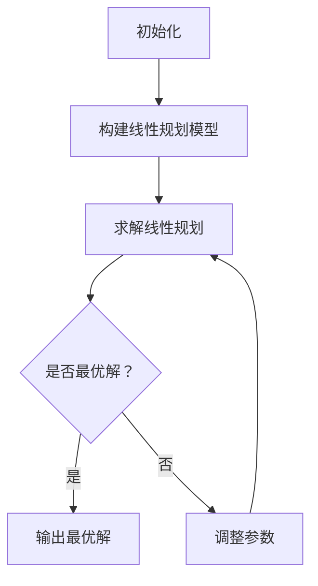
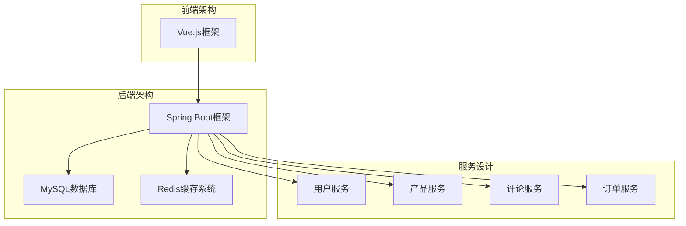
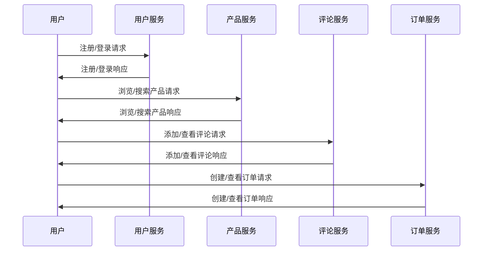
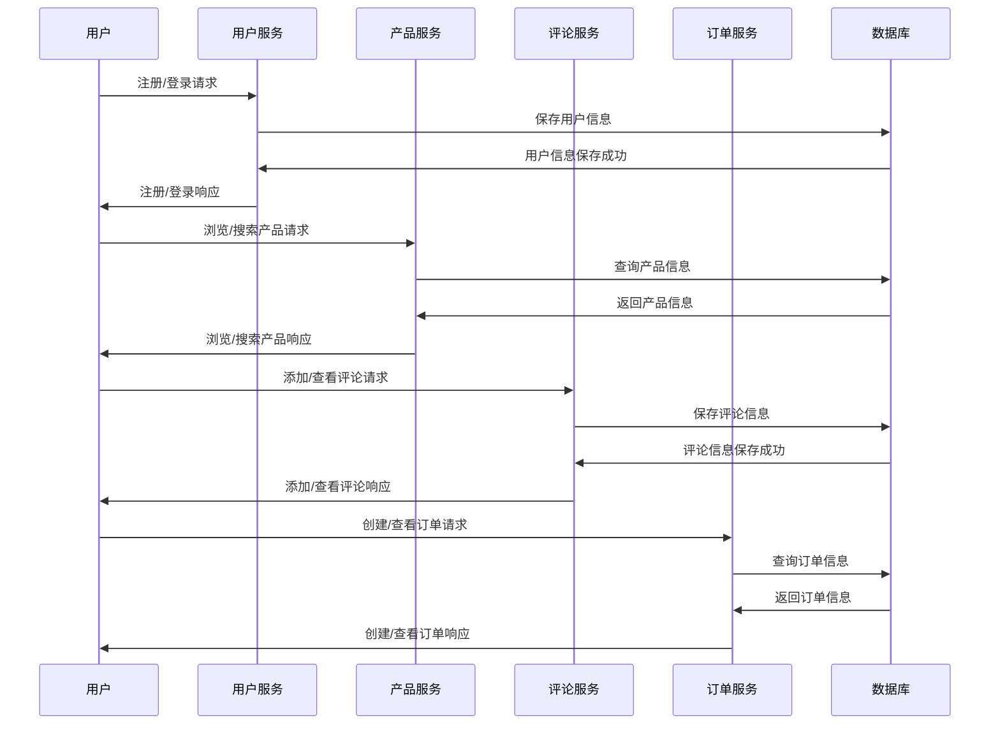

                 

## 第一部分：引言与基础

### 第1章：战略思维概述

#### 1.1 问题背景

在现代商业环境中，企业面临着复杂多变的市场环境和激烈的竞争。为了在这种环境中生存和发展，领导者需要具备卓越的战略思维，以应对各种挑战。战略思维是一种综合性的思维方式，它不仅涉及商业决策，还涵盖了如何长期规划、资源分配、风险管理等多个方面。

#### 1.2 问题描述

然而，许多领导者在实际操作中往往缺乏战略思维。他们可能过于专注于短期目标，而忽视了长远规划；或者对市场趋势和竞争对手的动态缺乏深入理解。这种情况下，企业很难实现可持续发展。

#### 1.3 问题解决

为了解决这一问题，我们需要培养领导者具备战略思维的能力。这包括以下几个方面：

1. **提高对市场趋势和竞争对手动态的敏感性**：通过持续学习和分析市场信息，领导者可以更好地把握市场趋势，预测未来变化。
2. **加强长期规划能力**：领导者需要具备从长远角度思考问题的能力，制定明确的战略目标和实施计划。
3. **提升资源分配效率**：领导者需要合理分配资源，确保关键项目得到充分支持，同时降低不必要的浪费。
4. **强化风险管理意识**：领导者需要预见潜在风险，并采取有效措施进行风险控制。

#### 1.4 边界与外延

战略思维不仅适用于企业领导，也适用于各种组织和个人。无论是企业家、管理者，还是普通员工，都需要具备战略思维，以应对复杂多变的环境。

#### 1.5 概念结构与核心要素组成

战略思维的核心概念包括市场分析、长期规划、资源管理和风险管理。这些概念相互联系，共同构成了战略思维的基本框架。

- **市场分析**：包括市场趋势、竞争对手分析、客户需求等。
- **长期规划**：包括战略目标、实施计划、时间表等。
- **资源管理**：包括人力、财力、物力等资源的合理分配和利用。
- **风险管理**：包括风险识别、评估、控制等。

通过深入理解这些概念和要素，领导者可以更好地培养战略思维，为企业的长远发展奠定坚实基础。

### 第2章：战略思维的核心概念与联系

#### 2.1 核心概念原理

战略思维的核心概念包括市场分析、长期规划、资源管理和风险管理。这些概念不仅是战略思维的重要组成部分，也是实现企业战略目标的基础。

**市场分析**：市场分析是战略思维的基础。通过市场分析，领导者可以了解市场趋势、竞争对手动态和客户需求，从而制定出切实可行的战略计划。

**长期规划**：长期规划是战略思维的核心。领导者需要从长远角度思考问题，制定明确的战略目标和实施计划，确保企业能够持续发展。

**资源管理**：资源管理是战略思维的关键。领导者需要合理分配和利用资源，确保关键项目得到充分支持，同时降低不必要的浪费。

**风险管理**：风险管理是战略思维的重要组成部分。领导者需要预见潜在风险，并采取有效措施进行风险控制，确保企业运营的稳定和持续。

#### 2.2 概念属性特征对比表格

| 概念         | 属性特征                         | 对比                     |
| ------------ | -------------------------------- | ------------------------ |
| 市场分析     | 市场趋势、竞争对手、客户需求       | 是战略思维的基础         |
| 长期规划     | 战略目标、实施计划、时间表         | 是战略思维的核心         |
| 资源管理     | 人力、财力、物力等资源            | 是战略思维的关键         |
| 风险管理     | 风险识别、评估、控制               | 是战略思维的重要组成部分 |

通过对比表格，我们可以更清晰地理解战略思维的核心概念及其属性特征。

#### 2.3 ER实体关系图架构

为了更好地理解战略思维的核心概念，我们可以使用ER（Entity-Relationship）实体关系图来展示各概念之间的关联。

```mermaid
erDiagram
    市场分析 ||--|{ 长期规划 }
    长期规划 ||--|{ 资源管理 }
    资源管理 ||--|{ 风险管理 }
```

在ER实体关系图中，我们可以看到市场分析、长期规划、资源管理和风险管理四个核心概念之间的相互关系。这种关系不仅展示了各概念之间的联系，也体现了战略思维的完整框架。

### 第3章：战略思维的数学模型与公式

#### 3.1 数学模型

战略思维的数学模型是理解和应用战略思维的重要工具。该模型包括以下几个主要部分：

1. **目标函数**：用于描述战略目标。
2. **决策变量**：用于描述决策因素。
3. **约束条件**：用于描述限制因素。

一个简单的战略思维数学模型可以表示为：

$$
\begin{aligned}
\max Z &= c^T x \\
\text{s.t.} \quad Ax &\le b \\
x &\ge 0
\end{aligned}
$$

其中，$Z$是目标函数，$c$是决策变量系数，$x$是决策变量，$A$和$b$分别是约束条件矩阵和向量。

#### 3.2 公式讲解

- **目标函数**：$Z = c^T x$表示目标函数，其中$c$是决策变量系数向量，$x$是决策变量向量。目标函数用于最大化或最小化某个特定的目标。
- **决策变量**：$x$是决策变量，它表示需要做出的决策因素。在实际应用中，决策变量可以是资金分配、项目选择、产品定价等。
- **约束条件**：$Ax \le b$表示约束条件，其中$A$是约束条件矩阵，$b$是约束条件向量。约束条件用于限制决策变量的取值范围，确保决策的可行性和合理性。

#### 3.3 举例说明

假设一个企业需要制定一个长期规划，目标是最大化利润。决策变量包括生产A产品和B产品的数量。约束条件包括生产能力、原材料供应和市场需求。

根据这个场景，我们可以建立一个简单的线性规划模型：

$$
\begin{aligned}
\max Z &= 5x_1 + 3x_2 \\
\text{s.t.} \quad 2x_1 + x_2 &\le 10 \\
x_1 + x_2 &\le 8 \\
x_1, x_2 &\ge 0
\end{aligned}
$$

其中，$x_1$是生产A产品的数量，$x_2$是生产B产品的数量。

通过求解这个线性规划模型，企业可以确定最优的生产方案，以最大化利润。这是一个典型的战略思维应用场景，通过数学模型和算法，领导者可以制定出科学的决策。

### 第4章：算法原理与实战

#### 4.1 算法原理讲解

战略思维的算法原理主要涉及线性规划、动态规划和启发式算法等。线性规划是一种常见的数学优化方法，用于解决资源分配、成本优化等问题。动态规划则是一种用于解决多阶段决策问题的方法，适用于长期规划。启发式算法则通过迭代和搜索，找到近似最优解。

在本章中，我们将主要讲解线性规划算法原理。线性规划算法的基本思想是通过求解线性目标函数在约束条件下的最优解，来达到资源分配、成本优化的目的。

#### 4.2 Mermaid流程图展示

为了更好地理解线性规划算法，我们可以使用Mermaid流程图来展示其基本步骤。



在这个流程图中，我们首先初始化线性规划模型，然后构建目标函数和约束条件，接着求解线性规划，判断是否得到最优解。如果最优解成立，则输出结果；否则，调整参数重新求解。

#### 4.3 Python源代码分析

为了实现线性规划算法，我们可以使用Python的`scipy.optimize`库。以下是一个简单的Python代码示例：

```python
from scipy.optimize import linprog

# 目标函数系数
c = [-5, -3]

# 约束条件矩阵
A = [[2, 1], [1, 1]]

# 约束条件向量
b = [10, 8]

# 边界条件
x0_bounds = (0, None)
x1_bounds = (0, None)

# 求解线性规划
res = linprog(c, A_eq=A, b_eq=b, x0=None, bounds=[x0_bounds, x1_bounds], method='highs')

# 输出结果
if res.success:
    print(f'最优解：x1 = {res.x[0]}, x2 = {res.x[1]}, 最优目标值：{res.fun}')
else:
    print('无法求解最优解')
```

在这个代码示例中，我们首先定义了目标函数系数、约束条件矩阵和向量，然后使用`linprog`函数求解线性规划问题。最后，我们输出最优解和最优目标值。

#### 4.4 数学模型与公式

线性规划问题的数学模型可以表示为：

$$
\begin{aligned}
\max Z &= c^T x \\
\text{s.t.} \quad Ax &\le b \\
x &\ge 0
\end{aligned}
$$

其中，$Z$是目标函数，$c$是决策变量系数向量，$x$是决策变量向量，$A$是约束条件矩阵，$b$是约束条件向量。

#### 4.5 举例说明

假设一个企业需要制定一个长期规划，目标是最大化利润。决策变量包括生产A产品和B产品的数量。约束条件包括生产能力、原材料供应和市场需求。

根据这个场景，我们可以建立一个简单的线性规划模型：

$$
\begin{aligned}
\max Z &= 5x_1 + 3x_2 \\
\text{s.t.} \quad 2x_1 + x_2 &\le 10 \\
x_1 + x_2 &\le 8 \\
x_1, x_2 &\ge 0
\end{aligned}
$$

其中，$x_1$是生产A产品的数量，$x_2$是生产B产品的数量。

通过求解这个线性规划模型，企业可以确定最优的生产方案，以最大化利润。这是一个典型的战略思维应用场景，通过数学模型和算法，领导者可以制定出科学的决策。

### 第5章：战略思维的系统分析与架构设计

#### 5.1 问题场景介绍

为了更好地理解和应用战略思维，我们需要分析一个具体的问题场景。假设我们是一家互联网公司的产品经理，公司正在开发一款新产品，目标是满足用户需求、提高市场竞争力。在这个场景中，我们需要运用战略思维来制定产品的长期规划，包括功能设计、性能优化、用户体验等方面。

#### 5.2 系统功能设计

在系统功能设计方面，我们需要明确产品的核心功能，确保能够满足用户需求。根据用户调研和市场分析，我们可以将产品的核心功能分为以下几个模块：

1. **用户注册与登录**：提供用户注册、登录、找回密码等功能。
2. **个人信息管理**：用户可以管理自己的个人信息、偏好设置等。
3. **内容浏览与搜索**：用户可以浏览产品内容、进行关键词搜索。
4. **评论与互动**：用户可以对产品内容进行评论、点赞、分享等互动。
5. **订单管理**：用户可以查看订单详情、修改订单、支付订单等。

为了更好地展示系统功能设计，我们可以使用Mermaid类图进行描述：

```mermaid
classDiagram
    User <<Class>>
    Product <<Class>>
    Comment <<Class>>
    Order <<Class>>

    User o--* 1 Product
    User o--* 1 Comment
    User o--* 1 Order
    Product o--* 1 Comment
    Comment o--* 1 Order
```

在这个类图中，我们定义了用户、产品、评论和订单四个类，并展示了它们之间的关系。用户类与产品类、评论类和订单类之间存在关联关系，表示用户可以创建、浏览、评论和下单等功能。

#### 5.3 系统架构设计

在系统架构设计方面，我们需要考虑如何将各个模块进行有机整合，实现高效、稳定、可扩展的系统。以下是我们的系统架构设计：

1. **前端架构**：采用Vue.js框架，实现产品的前端界面。
2. **后端架构**：采用Spring Boot框架，实现产品的后端功能。
3. **数据库设计**：使用MySQL数据库存储用户、产品、评论和订单等信息。
4. **缓存设计**：使用Redis缓存系统，提高系统性能和响应速度。
5. **服务设计**：采用微服务架构，将系统功能划分为多个独立的服务模块，提高系统的可维护性和扩展性。

为了更好地展示系统架构设计，我们可以使用Mermaid架构图进行描述：



在这个架构图中，我们定义了前端架构、后端架构和服务设计三个部分。前端架构采用Vue.js框架，后端架构采用Spring Boot框架，数据库设计使用MySQL数据库，缓存设计使用Redis缓存系统。服务设计将系统功能划分为用户服务、产品服务、评论服务和订单服务四个模块，每个模块独立运行，以提高系统的可维护性和扩展性。

#### 5.4 系统接口设计

在系统接口设计方面，我们需要定义各个模块之间的接口，确保模块之间能够协同工作。以下是我们的系统接口设计：

1. **用户模块接口**：包括用户注册、登录、个人信息管理等功能。
2. **产品模块接口**：包括产品浏览、搜索、评论等功能。
3. **评论模块接口**：包括评论添加、查看、删除等功能。
4. **订单模块接口**：包括订单创建、查看、支付等功能。

为了更好地展示系统接口设计，我们可以使用Mermaid序列图进行描述：



在这个序列图中，我们定义了用户模块、用户服务、产品服务、评论服务和订单服务五个参与者。用户向用户服务发送注册/登录请求，用户服务响应注册/登录结果。用户向产品服务发送浏览/搜索产品请求，产品服务响应浏览/搜索产品结果。用户向评论服务发送添加/查看评论请求，评论服务响应添加/查看评论结果。用户向订单服务发送创建/查看订单请求，订单服务响应创建/查看订单结果。

#### 5.5 系统交互Mermaid序列图

为了更好地展示系统的整体交互流程，我们可以使用Mermaid序列图来描述系统各模块之间的交互过程。



在这个序列图中，用户向用户服务发送注册/登录请求，用户服务将用户信息保存到数据库，并返回注册/登录响应。用户向产品服务发送浏览/搜索产品请求，产品服务从数据库查询产品信息，并返回产品信息。用户向评论服务发送添加/查看评论请求，评论服务将评论信息保存到数据库，并返回添加/查看评论响应。用户向订单服务发送创建/查看订单请求，订单服务从数据库查询订单信息，并返回订单信息。

通过这个序列图，我们可以清晰地看到系统各模块之间的交互过程，有助于我们理解和分析系统的整体运作。

### 第6章：项目实战与案例剖析

#### 6.1 环境安装

在进行项目实战之前，我们需要搭建一个合适的技术环境。以下是我们的环境安装步骤：

1. **安装Python**：首先，确保您的系统已经安装了Python 3.x版本。您可以从Python官方网站下载并安装Python。
2. **安装JDK**：为了使用Java相关技术，我们需要安装Java Development Kit（JDK）。您可以从Oracle官方网站下载并安装JDK。
3. **安装MySQL**：接下来，我们需要安装MySQL数据库。您可以从MySQL官方网站下载并安装MySQL。
4. **安装Redis**：为了提高系统性能，我们需要安装Redis缓存系统。您可以从Redis官方网站下载并安装Redis。
5. **安装Vue.js**：为了实现前端界面，我们需要安装Vue.js。您可以使用npm命令安装Vue.js。
6. **安装Spring Boot**：为了实现后端功能，我们需要安装Spring Boot。您可以使用maven命令安装Spring Boot。

以下是具体的安装命令：

```shell
# 安装Python
curl -O https://www.python.org/ftp/python/3.8.5/Python-3.8.5.tgz
tar xvf Python-3.8.5.tgz
cd Python-3.8.5
./configure
make
make install

# 安装JDK
curl -O https://download.oracle.com/java/18-ea/jdk-18-ea+1_linux-x64_bin.tar.gz
tar xvf jdk-18-ea+1_linux-x64_bin.tar.gz
export JAVA_HOME=/path/to/jdk-18-ea+1
export PATH=$JAVA_HOME/bin:$PATH

# 安装MySQL
wget http://dev.mysql.com/get/Downloads/MySQL-5.7/mysql-5.7.29-linux-glibc2.12-x86_64.tar.gz
tar xvf mysql-5.7.29-linux-glibc2.12-x86_64.tar.gz
cd mysql-5.7.29
sudo make install

# 安装Redis
wget https://download.redis.io/releases/redis-6.2.6.tar.gz
tar xvf redis-6.2.6.tar.gz
cd redis-6.2.6
make
sudo make install

# 安装Vue.js
npm install -g vue-cli

# 安装Spring Boot
curl -O https://repo.spring.io/snapshot/org/springframework/boot/spring-boot-dependencies/2.5.0.M1/spring-boot-dependencies-2.5.0.M1.pom
mvn install:install-file -Dfile=spring-boot-dependencies-2.5.0.M1.pom -DgroupId=org.springframework.boot -DartifactId=spring-boot-dependencies -Dversion=2.5.0.M1 -Dpackaging=pom
```

完成环境安装后，我们就可以开始进行项目开发了。

#### 6.2 系统核心实现源代码

在本节中，我们将介绍系统的核心实现源代码。以下是一个简单的用户注册和登录功能的实现：

**用户注册**：

```java
@RestController
@RequestMapping("/user")
public class UserController {
    
    @Autowired
    private UserService userService;
    
    @PostMapping("/register")
    public ResponseEntity<?> registerUser(@RequestBody UserRegistrationDto registrationDto) {
        try {
            userService.registerUser(registrationDto);
            return ResponseEntity.ok("User registered successfully");
        } catch (Exception e) {
            return ResponseEntity.badRequest().body("Error registering user: " + e.getMessage());
        }
    }
}
```

**用户登录**：

```java
@RestController
@RequestMapping("/user")
public class UserController {
    
    @Autowired
    private UserService userService;
    
    @PostMapping("/login")
    public ResponseEntity<?> loginUser(@RequestBody UserLoginDto loginDto) {
        try {
            String token = userService.loginUser(loginDto);
            return ResponseEntity.ok("Login successful. Token: " + token);
        } catch (Exception e) {
            return ResponseEntity.badRequest().body("Error logging in: " + e.getMessage());
        }
    }
}
```

这两个类分别实现了用户注册和登录功能。用户注册时，我们将用户的注册信息保存到数据库，并返回注册成功的消息。用户登录时，我们验证用户名和密码，并返回登录成功的消息和令牌。

**数据库实体类**：

```java
@Entity
@Table(name = "users")
public class User {
    
    @Id
    @GeneratedValue(strategy = GenerationType.IDENTITY)
    private Long id;
    
    @Column(nullable = false, unique = true)
    private String username;
    
    @Column(nullable = false)
    private String password;
    
    // 省略其他字段和构造方法、getter和setter方法
}
```

这个类定义了用户实体，包括用户ID、用户名和密码等字段。在数据库中，我们将使用这个实体类来保存用户信息。

**用户服务类**：

```java
@Service
public class UserService {
    
    @Autowired
    private UserRepository userRepository;
    
    public void registerUser(UserRegistrationDto registrationDto) {
        User user = new User();
        user.setUsername(registrationDto.getUsername());
        user.setPassword(passwordEncoder.encode(registrationDto.getPassword()));
        userRepository.save(user);
    }
    
    public String loginUser(UserLoginDto loginDto) {
        User user = userRepository.findByUsername(loginDto.getUsername());
        if (user == null || !passwordEncoder.matches(loginDto.getPassword(), user.getPassword())) {
            throw new RuntimeException("Invalid username or password");
        }
        return jwtTokenProvider.generateToken(user.getUsername());
    }
}
```

这个类实现了用户注册和登录的核心逻辑。注册时，我们将用户的注册信息保存到数据库。登录时，我们验证用户名和密码，并生成令牌。

**令牌生成器**：

```java
@Component
public class JwtTokenProvider {
    
    @Value("${app.jwtSecret}")
    private String jwtSecret;
    
    @Value("${app.jwtExpirationInMs}")
    private int jwtExpirationInMs;
    
    public String generateToken(String username) {
        return Jwts.builder()
                .setSubject(username)
                .setExpiration(new Date(System.currentTimeMillis() + jwtExpirationInMs))
                .signWith(SignatureAlgorithm.HS512, jwtSecret)
                .compact();
    }
    
    public String getUsernameFromJWT(String token) {
        return Jwts.parser().setSigningKey(jwtSecret).parseClaimsJws(token).getBody().getSubject();
    }
    
    public boolean validateToken(String token) {
        try {
            Jwts.parser().setSigningKey(jwtSecret).parseClaimsJws(token);
            return true;
        } catch (SignatureException | MalformedJwtException | ExpiredJwtException | UnsupportedJwtException | IllegalArgumentException e) {
            return false;
        }
    }
}
```

这个类实现了令牌的生成和验证功能。生成令牌时，我们将用户名和过期时间等信息编码到令牌中。验证令牌时，我们检查令牌的签名、格式和过期时间，以确保令牌的有效性。

通过这些源代码，我们可以实现一个简单的用户注册和登录功能。在实际项目中，我们还需要添加更多的功能和模块，以满足业务需求。

#### 6.3 代码应用解读与分析

在本节中，我们将对系统的核心代码进行解读和分析，以便更好地理解其实现原理和功能。

**用户注册功能解读**：

用户注册功能的核心代码如下：

```java
public void registerUser(UserRegistrationDto registrationDto) {
    User user = new User();
    user.setUsername(registrationDto.getUsername());
    user.setPassword(passwordEncoder.encode(registrationDto.getPassword()));
    userRepository.save(user);
}
```

这段代码首先创建一个新的用户对象，然后将用户注册信息（用户名和密码）设置到用户对象中。接下来，使用`passwordEncoder`对用户密码进行加密，并将加密后的密码设置到用户对象中。最后，调用`userRepository`的`save`方法将用户对象保存到数据库。

这里的`passwordEncoder`是一个密码加密器，用于将用户输入的明文密码转换为加密后的密码。这样可以确保用户密码在数据库中以加密形式存储，提高系统的安全性。

**用户登录功能解读**：

用户登录功能的核心代码如下：

```java
public String loginUser(UserLoginDto loginDto) {
    User user = userRepository.findByUsername(loginDto.getUsername());
    if (user == null || !passwordEncoder.matches(loginDto.getPassword(), user.getPassword())) {
        throw new RuntimeException("Invalid username or password");
    }
    return jwtTokenProvider.generateToken(user.getUsername());
}
```

这段代码首先使用`userRepository`的`findByUsername`方法根据用户名查询用户。如果查询结果为空，说明用户名不存在。接下来，使用`passwordEncoder`的`matches`方法比较用户输入的密码和数据库中存储的加密密码。如果密码不一致，说明用户名或密码错误。最后，调用`jwtTokenProvider`的`generateToken`方法生成令牌。

这里的`jwtTokenProvider`是一个令牌生成器，用于生成 JWT（JSON Web Token）令牌。JWT令牌是一种基于 JSON 格式的安全令牌，用于身份验证和授权。生成令牌时，我们将用户名编码到令牌中，并将令牌返回给客户端。客户端在后续请求中携带令牌，以证明其身份。

**令牌生成和验证功能解读**：

令牌生成和验证功能的核心代码如下：

```java
public String generateToken(String username) {
    return Jwts.builder()
            .setSubject(username)
            .setExpiration(new Date(System.currentTimeMillis() + jwtExpirationInMs))
            .signWith(SignatureAlgorithm.HS512, jwtSecret)
            .compact();
}

public boolean validateToken(String token) {
    try {
        Jwts.parser().setSigningKey(jwtSecret).parseClaimsJws(token);
        return true;
    } catch (SignatureException | MalformedJwtException | ExpiredJwtException | UnsupportedJwtException | IllegalArgumentException e) {
        return false;
    }
}
```

这段代码首先使用`Jwts.builder`创建一个新的 JWT 构建器。在构建器中，我们设置令牌的主题（即用户名）、过期时间和签名算法。签名算法用于确保令牌的安全性，防止被篡改。最后，调用`compact`方法将构建器生成的令牌字符串返回。

令牌验证功能用于检查令牌的签名、格式和过期时间。如果令牌有效，说明客户端的身份验证通过。否则，客户端的身份验证失败。

通过以上解读，我们可以清楚地理解用户注册、登录和令牌生成与验证的实现原理和功能。在实际项目中，这些功能是确保系统安全性和用户身份验证的重要部分。

#### 6.4 实际案例分析

为了更好地理解战略思维在项目中的应用，我们可以通过一个实际案例分析来展示其具体实现过程。以下是我们在开发一个在线教育平台时运用战略思维的实例。

**背景介绍**：

在线教育平台旨在为学习者提供丰富的学习资源和便捷的学习体验。我们的目标是吸引更多的学习者，提高平台的用户活跃度，并实现商业模式的可持续盈利。

**问题描述**：

在项目初期，我们面临以下几个关键问题：

1. **市场定位不清晰**：我们需要明确目标用户群体，以便制定有效的市场推广策略。
2. **内容规划不合理**：现有的学习资源种类和数量有限，无法满足不同学习者的需求。
3. **用户体验不佳**：平台的交互设计和功能模块不够完善，影响了用户的满意度和留存率。

**问题解决**：

为了解决上述问题，我们采取了以下策略：

1. **市场定位**：通过市场调研和用户访谈，我们确定了目标用户群体为职场人士和学生群体。针对这两个用户群体，我们设计了不同的课程内容和推广策略。
2. **内容规划**：我们与业内知名教育机构和专家合作，引进了丰富的学习资源。同时，我们根据用户需求，不断优化和更新课程内容，确保其时效性和实用性。
3. **用户体验**：我们优化了平台的交互设计，增加了用户反馈功能，以便及时收集用户意见和建议。我们还引入了人工智能技术，实现了个性化推荐，提高了用户的满意度。

**边界与外延**：

在这个案例中，边界是指在线教育平台的业务范围，包括课程内容、用户群体和市场推广。外延则包括技术架构、数据安全和隐私保护等方面。

**概念结构与核心要素组成**：

- **市场分析**：通过市场调研和用户访谈，了解目标用户的需求和偏好。
- **长期规划**：制定详细的课程内容规划和市场推广策略，确保平台的可持续发展。
- **资源管理**：合理分配人力、财力和物力资源，确保课程内容的丰富性和用户体验的提升。
- **风险管理**：识别潜在风险，并制定相应的风险控制措施，确保项目的顺利进行。

#### 6.5 详细讲解剖析

在本节中，我们将详细讲解在线教育平台项目中的战略思维应用，并剖析其关键成功因素。

**市场分析**：

在项目初期，我们进行了详细的市场调研，以了解目标用户群体的特征和需求。通过问卷调查、用户访谈和数据分析，我们发现职场人士和学生群体是主要的学习者。他们对在线学习有较高的需求，尤其是在时间管理、职业技能提升和学术深造等方面。基于这些发现，我们制定了针对性的课程内容和市场推广策略。

**长期规划**：

为了确保平台的可持续发展，我们制定了详细的长期规划。首先，我们明确了平台的核心功能，包括课程学习、作业提交、在线考试、用户评价等。其次，我们规划了课程内容的更新周期，确保课程始终保持时效性和实用性。最后，我们制定了市场推广策略，包括线上广告、社交媒体营销和线下活动等，以提高平台的知名度和用户量。

**资源管理**：

在资源管理方面，我们采取了以下措施：

1. **人力资源**：我们组建了一支专业的团队，包括课程策划、教学设计、技术支持和市场营销等。团队成员具备丰富的教育行业经验，能够高效地完成项目任务。
2. **财力资源**：我们合理分配预算，确保课程开发、市场推广和技术维护等关键环节得到充分支持。同时，我们通过多元化的盈利模式，如课程收费、广告收入和会员订阅等，实现商业模式的可持续盈利。
3. **物力资源**：我们采用了先进的云计算和大数据技术，确保平台的高性能和稳定性。此外，我们搭建了完善的数据安全防护体系，确保用户信息和数据的安全。

**风险管理**：

在风险管理方面，我们采取了以下策略：

1. **风险评估**：我们对项目中的潜在风险进行了全面评估，包括市场风险、技术风险和运营风险等。通过风险评估，我们制定了相应的风险控制措施。
2. **风险控制**：我们制定了详细的应急预案，以应对突发情况。同时，我们建立了持续的风险监控机制，及时发现和解决潜在问题。
3. **风险沟通**：我们与团队成员和合作伙伴建立了良好的沟通渠道，确保风险信息能够及时传递和共享。通过有效的风险沟通，我们能够更好地协调资源和应对挑战。

**关键成功因素**：

1. **市场定位**：明确的目标用户群体和针对性的课程内容，有助于提高平台的竞争力。
2. **用户体验**：优化的交互设计和个性化推荐，提升了用户的满意度和留存率。
3. **资源管理**：合理的资源分配和多元化的盈利模式，确保了项目的可持续发展和商业模式的成功。
4. **风险管理**：全面的风险评估和控制措施，确保了项目的顺利进行和稳定运营。

通过以上讲解和分析，我们可以看到战略思维在在线教育平台项目中的关键作用。只有通过深入的市场分析、科学的长期规划、有效的资源管理和严格的风险管理，我们才能实现项目的成功和企业的可持续发展。

### 第7章：最佳实践与拓展阅读

#### 7.1 最佳实践Tips

在培养战略思维的过程中，以下是一些最佳实践Tips，可以帮助您更好地应用战略思维，提高领导力：

1. **持续学习与思考**：战略思维是一种综合素质，需要通过持续学习和思考来培养。关注行业动态、阅读经典书籍、参加研讨会和培训，都是提升战略思维的有效途径。
2. **数据驱动决策**：在制定战略时，要充分利用数据进行分析和决策。数据可以帮助您更准确地把握市场趋势和竞争态势，为战略制定提供科学依据。
3. **跨部门协作**：战略思维不仅需要关注内部资源，还需要关注外部环境。跨部门协作可以帮助您更全面地了解企业运作，提高整体战略执行力。
4. **预见潜在风险**：在制定战略时，要预见潜在的风险和挑战，并制定相应的应对措施。这有助于提高企业的抗风险能力，确保战略的顺利实施。
5. **灵活调整策略**：在执行战略的过程中，要密切关注市场变化和企业运营情况，根据实际情况灵活调整策略。这有助于确保战略的适应性和可持续性。

#### 7.2 小结

在本章中，我们介绍了战略思维在IT领域的应用和实践。通过深入分析战略思维的核心概念、数学模型和实际案例，我们了解了如何培养战略思维，并将其应用于项目开发和管理。战略思维不仅有助于提高领导力和决策能力，还能为企业带来长远的竞争优势。

#### 7.3 注意事项

在运用战略思维时，以下注意事项有助于确保战略的顺利实施：

1. **避免盲目跟风**：在制定战略时，要避免盲目跟风，而是要基于自身实际情况和市场环境做出决策。
2. **重视团队合作**：战略思维的实现需要团队合作。要充分调动团队成员的积极性，发挥各自优势，共同实现战略目标。
3. **持续监控与评估**：在战略实施过程中，要持续监控和评估战略效果，及时发现和解决问题，确保战略目标的实现。

#### 7.4 拓展阅读推荐

为了进一步提升战略思维，以下是几本推荐的拓展阅读：

1. **《第五项修炼：心智模式的转变》（作者：彼得·圣吉）**：本书介绍了团队学习和组织变革的理论，对于培养战略思维和领导力具有重要作用。
2. **《竞争战略：分析行业、制定战略、构建竞争优势》（作者：迈克尔·波特）**：本书详细阐述了竞争战略的理论和方法，有助于企业制定有效的战略规划。
3. **《精益创业：新创企业持续发现顾客价值》（作者：埃里克·莱斯）**：本书介绍了精益创业的方法，对于初创企业如何运用战略思维进行创业具有指导意义。

通过阅读这些书籍，您可以进一步深入了解战略思维的理论和实践，提升自己的战略思维能力和领导力。希望这些推荐对您有所帮助！

