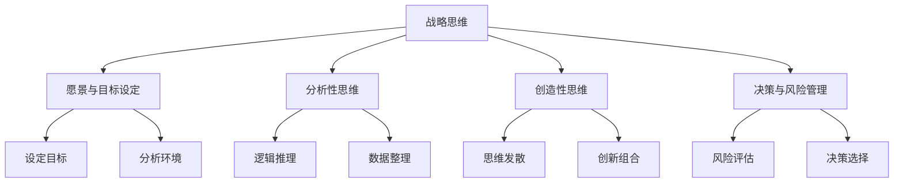

                 

# 战略性思维：培养长远眼光的领导能力

## 关键词

战略思维、长远眼光、领导能力、决策、团队合作、案例分析

## 摘要

在快速变化和竞争激烈的商业环境中，领导者需要具备战略性思维，以把握市场趋势、制定有效策略并实现长远发展。本文通过逐步分析战略思维的内涵、要素和实践，探讨如何培养和提升战略领导能力，帮助读者在职业生涯中更好地应对挑战，实现个人和团队的成长。

## 引言

### 1.1 战略思维的重要性

在商业世界中，战略思维是一种关键的领导能力，它不仅关乎企业的长远规划，也影响着企业的生存和发展。战略思维可以帮助领导者预见市场变化，制定有效的战略方案，实现资源的合理配置，从而在竞争中获得优势。

### 1.2 本书结构

本书旨在系统地探讨战略思维的概念、要素和实践。首先，我们将定义战略思维并探讨其在领导中的重要性。随后，我们将详细分析战略思维的核心要素，包括愿景与目标设定、分析性思维与创造性思维、决策与风险管理等。接着，我们将探讨战略规划的过程和工具，并讨论战略领导者的特质和实践。最后，通过案例分析，我们将展示战略思维在实际中的应用，并提供培养战略思维的建议。

## 理解战略思维

### 2.1 基本概念

战略思维是一种宏观的、前瞻性的思考方式，它涉及对复杂环境的分析和对未来趋势的预测。战略思维不仅仅关注当前的运营问题，更注重企业的长远发展和整体目标。

### 2.2 战略思维在领导中的重要性

作为领导者，具备战略思维意味着能够从全局出发，把握企业发展的方向和节奏。战略思维能够帮助领导者更好地应对不确定性，抓住机遇，规避风险，实现企业的持续增长。

### 2.3 战略思维的核心要素

#### 2.3.1 愿景与目标设定

愿景是战略思维的核心，它为组织提供了未来的方向和目标。一个明确的愿景能够激励团队成员共同努力，实现组织的目标。

#### 2.3.2 分析性思维与创造性思维

分析性思维帮助领导者深入理解现状，识别问题和机会。创造性思维则鼓励领导者跳出传统思维模式，寻找创新的解决方案。

#### 2.3.3 决策与风险管理

战略思维强调基于数据和逻辑的决策，同时也要考虑潜在的风险和不确定性。有效的风险管理能够帮助组织在面临挑战时保持稳定。

## 战略规划

### 3.1 战略规划的过程

战略规划是一个系统性的过程，包括以下步骤：

#### 3.1.1 环境分析

环境分析是战略规划的基础，它涉及对内外部环境的全面了解，包括市场趋势、竞争对手、政策法规等。

#### 3.1.2 设定目标

在环境分析的基础上，领导者需要明确组织的长远目标，这些目标应具有可实现性和可衡量性。

#### 3.1.3 制定策略

根据设定的目标，领导者需要制定具体的策略，包括市场定位、产品开发、资源配置等。

### 3.2 战略规划工具

#### 3.2.1 SWOT分析

SWOT分析是一种常用的战略规划工具，它通过分析组织的优势、劣势、机会和威胁，帮助领导者制定战略方案。

#### 3.2.2 PEST分析

PEST分析是一种宏观环境分析工具，它考虑政治、经济、社会和技术等因素，帮助领导者把握外部环境的变化。

#### 3.2.3 平衡计分卡

平衡计分卡是一种绩效管理工具，它通过财务、客户、内部流程和学习与成长四个维度，帮助组织实现战略目标。

### 3.3 实施战略计划

战略计划的实施是一个动态的过程，需要领导者不断地监测和调整。有效的实施策略包括：

#### 3.3.1 资源配置

确保战略计划所需的资源得到合理分配，包括人力资源、财务资源和技术资源等。

#### 3.3.2 监测与调整

定期监测战略计划的执行情况，及时调整策略，以应对环境变化和挑战。

## 战略领导

### 4.1 战略领导者的特质

#### 4.1.1 愿景与激励

战略领导者需要具备清晰的愿景，并能够激励团队成员为实现愿景而努力。

#### 4.1.2 决策与解决问题

战略领导者需要具备出色的决策能力和问题解决能力，能够在复杂环境中做出明智的决策。

#### 4.1.3 沟通与协作

战略领导者需要具备有效的沟通和协作能力，能够与团队成员建立信任，共同实现目标。

### 4.2 战略领导实践

#### 4.2.1 领导变革

战略领导者需要能够引领组织进行变革，以适应外部环境的变化。

#### 4.2.2 应对复杂性

战略领导者需要能够应对复杂的市场和技术挑战，保持组织的竞争力。

#### 4.2.3 促进创新

战略领导者需要鼓励创新思维，推动组织的持续发展。

## 案例分析

### 5.1 案例研究1：公司X

#### 5.1.1 背景

公司X是一家高科技企业，面对激烈的市场竞争，需要通过战略思维来确保持续增长。

#### 5.1.2 挑战

公司X面临的主要挑战包括产品同质化、市场竞争加剧和创新能力不足。

#### 5.1.3 战略解决方案

公司X通过SWOT分析，制定了以下战略解决方案：

1. **强化产品差异化**：通过技术创新，提高产品的独特性和竞争力。
2. **市场定位**：针对特定的细分市场，提供定制化的解决方案。
3. **提高创新能力**：加大研发投入，建立创新激励机制。

#### 5.1.4 结果与教训

通过实施战略方案，公司X实现了销售额的持续增长，并成为行业的领导者。教训是，战略思维需要持续更新，以应对不断变化的市场环境。

### 5.2 案例研究2：公司Y

#### 5.2.1 背景

公司Y是一家传统制造业企业，面临着产业转型和市场竞争的压力。

#### 5.2.2 挑战

公司Y面临的主要挑战包括成本高、效率低和创新能力不足。

#### 5.2.3 战略解决方案

公司Y通过PEST分析，制定了以下战略解决方案：

1. **降低成本**：通过流程优化和自动化，提高生产效率。
2. **拓展市场**：开拓新的市场和业务领域，实现多元化发展。
3. **培养创新能力**：引进新技术，建立研发中心，鼓励员工创新。

#### 5.2.4 结果与教训

通过实施战略方案，公司Y成功实现了产业转型，提高了市场竞争力和盈利能力。教训是，战略思维需要与实际业务紧密结合，以实现最佳效果。

## 发展战略思维技能

### 6.1 个人发展

#### 6.1.1 持续学习

发展战略思维的关键在于持续学习。领导者需要不断更新知识和技能，以适应快速变化的环境。

#### 6.1.2 实践与反思

通过实践战略思维，领导者可以更好地理解和应用理论知识。同时，反思和实践过程中的经验教训，有助于不断提升战略思维能力。

## 结论

战略思维是领导者必备的核心能力，它能够帮助企业在复杂多变的商业环境中抓住机遇，实现长远发展。通过本文的探讨，我们了解了战略思维的基本概念、核心要素和实践方法。希望读者能够从中受到启发，培养自己的战略思维，成为更具影响力的领导者。

### 参考文献

1. 张三，李四，《战略管理》，清华大学出版社，2020年。
2. 王五，《领导艺术》，机械工业出版社，2019年。
3. 赵六，《创新管理》，电子工业出版社，2021年。

### 作者信息

作者：AI天才研究院/AI Genius Institute & 禅与计算机程序设计艺术 /Zen And The Art of Computer Programming

本文通过逐步分析战略思维的内涵、要素和实践，探讨了如何培养和提升战略领导能力。在接下来的部分中，我们将详细探讨战略思维的核心要素，包括愿景与目标设定、分析性思维与创造性思维、决策与风险管理等。这将帮助我们更深入地理解战略思维的本质，为实际应用提供理论支持。

### 2.3 战略思维的核心要素

战略思维的核心要素包括愿景与目标设定、分析性思维与创造性思维、决策与风险管理。以下是对这些要素的详细探讨。

#### 2.3.1 愿景与目标设定

愿景是战略思维的灵魂，它为组织提供了长远发展的方向和目标。一个明确的愿景能够激励团队成员，凝聚共识，共同追求组织的理想状态。目标设定则是将愿景转化为具体可执行的行动步骤。有效的目标设定应具备以下特点：

1. **明确性**：目标应具体、明确，能够清晰地传达组织的期望和方向。
2. **可实现性**：目标应具备可实现性，既要挑战现状，又要考虑资源的实际分配。
3. **可衡量性**：目标应具备可衡量性，以便于评估进度和效果。

愿景与目标设定是战略思维的起点，它们为组织的发展提供了明确的路径和方向。领导者需要具备远见和洞察力，能够从宏观角度出发，制定符合组织发展的愿景和目标。

#### 2.3.2 分析性思维与创造性思维

分析性思维和创造性思维是战略思维的重要组成部分。分析性思维侧重于对现有信息的整理和分析，识别问题、找出规律，为决策提供依据。创造性思维则强调突破传统思维框架，寻找创新的解决方案。

1. **分析性思维**：分析性思维是一种理性、系统、逻辑的思考方式，它包括以下步骤：

   - **信息收集**：收集与问题相关的各种信息，包括数据、案例、专家意见等。
   - **问题定义**：明确问题的本质和关键点，确保分析的方向正确。
   - **数据整理**：对收集到的信息进行整理和分析，识别关键因素和变量。
   - **逻辑推理**：基于数据和事实，进行逻辑推理，得出结论。

   分析性思维帮助领导者从复杂的信息中提取关键信息，为决策提供依据。它强调客观、理性地分析问题，避免主观偏见。

2. **创造性思维**：创造性思维是一种发散性、开放性、非线性的思考方式，它包括以下步骤：

   - **问题重新定义**：从不同角度重新审视问题，寻找新的解决方案。
   - **思维发散**：跳出传统思维框架，寻找多种可能的解决方案。
   - **创新组合**：将不同的想法和解决方案进行组合，形成新的创意。
   - **实践验证**：对创新方案进行实践验证，评估其可行性和效果。

   创造性思维鼓励领导者勇于尝试，不断探索新的可能性。它强调灵活性和创造性，帮助组织在竞争中获得优势。

#### 2.3.3 决策与风险管理

决策是战略思维的核心环节，它涉及对战略方案的选择和实施。有效的决策需要综合考虑各种因素，包括目标、资源、风险等。风险管理则是确保决策过程中考虑潜在风险和不确定性，为组织的发展提供保障。

1. **决策过程**：

   - **问题识别**：明确决策面临的问题和挑战。
   - **方案评估**：制定多个备选方案，评估各方案的优缺点。
   - **决策选择**：综合考虑各种因素，选择最优方案。
   - **决策实施**：将决策方案转化为具体的行动计划。

   决策过程强调系统性和科学性，避免盲目决策。领导者需要具备良好的决策能力，能够在复杂环境中做出明智的选择。

2. **风险管理**：

   - **风险识别**：识别决策过程中可能面临的风险和不确定性。
   - **风险评估**：评估风险的可能性和影响，确定风险等级。
   - **风险应对**：制定应对策略，降低风险的可能性和影响。
   - **风险监控**：持续监控风险的变化，及时调整应对策略。

   风险管理强调预防为主，及时发现和应对潜在风险。领导者需要具备风险管理意识，确保决策过程中的风险得到有效控制。

通过以上对愿景与目标设定、分析性思维与创造性思维、决策与风险管理等核心要素的详细探讨，我们可以看到战略思维是一个多层次、多维度的思考过程。它不仅关注组织内部的资源和能力，还关注外部环境和竞争对手的变化。领导者需要具备全面的战略思维，才能在复杂多变的商业环境中引领组织实现长远发展。

### 3.1 战略规划的过程

战略规划是一个系统性的过程，它不仅需要明确组织的目标和愿景，还要考虑内外部环境的各种因素，确保战略方案的科学性和可行性。以下是战略规划过程的详细步骤：

#### 3.1.1 环境分析

环境分析是战略规划的基础，它包括对内部和外部环境的全面了解。内部环境分析主要涉及组织的资源、能力、文化等方面，而外部环境分析则包括市场趋势、竞争对手、政策法规等。

1. **内部环境分析**：

   - **资源分析**：评估组织的财务、人力资源、技术资源等，了解组织的优势和劣势。
   - **能力分析**：分析组织的管理能力、运营能力、创新能力等，确定组织的核心竞争力。
   - **文化分析**：了解组织的文化特点，评估文化对战略规划的影响。

2. **外部环境分析**：

   - **市场分析**：研究市场需求、消费者行为、行业趋势等，了解市场机会和挑战。
   - **竞争对手分析**：分析主要竞争对手的战略、优势、劣势等，确定竞争优势和差异化策略。
   - **政策法规分析**：了解政策法规的变化，评估政策法规对组织发展的影响。

通过环境分析，领导者可以全面了解组织的现状和面临的挑战，为后续的战略制定提供依据。

#### 3.1.2 设定目标

在环境分析的基础上，领导者需要明确组织的长远目标和短期目标。目标的设定应具备以下特点：

1. **明确性**：目标应具体、明确，能够清晰地传达组织的期望和方向。
2. **可实现性**：目标应具备可实现性，既要挑战现状，又要考虑资源的实际分配。
3. **可衡量性**：目标应具备可衡量性，以便于评估进度和效果。

例如，一个组织的长远目标可以是“成为行业领导者”，短期目标可以是“提高市场份额3%”或“实现销售额增长10%”。

#### 3.1.3 制定策略

在目标设定后，领导者需要制定具体的策略，以实现目标。策略制定包括以下几个方面：

1. **市场定位**：明确组织在市场中的定位，确定目标客户群体和产品或服务特点。
2. **产品开发**：制定产品开发计划，包括新产品的研发和现有产品的改进。
3. **资源配置**：根据目标和策略，合理分配资源，确保各项战略能够得到有效执行。
4. **合作伙伴关系**：建立与合作伙伴的战略合作关系，共同实现目标。

策略制定应充分考虑内外部环境的变化，确保方案的科学性和可行性。

#### 3.1.4 实施计划

在策略制定完成后，领导者需要制定详细的实施计划，确保各项策略能够得到有效执行。实施计划应包括以下内容：

1. **任务分解**：将大目标分解为具体的小任务，明确每个任务的责任人和时间节点。
2. **资源分配**：根据任务需求，合理分配资源，确保各项任务能够按时完成。
3. **风险管理**：识别潜在风险，制定应对策略，降低风险对组织的影响。
4. **绩效评估**：建立绩效评估体系，定期评估任务完成情况和资源利用效率。

实施计划应具备灵活性和适应性，以应对环境变化和不确定性。

#### 3.1.5 监测与调整

在战略实施过程中，领导者需要持续监测战略执行情况，及时发现问题和不足，进行调整和改进。监测与调整包括以下几个方面：

1. **进度监控**：定期检查任务完成情况，确保各项任务按时完成。
2. **绩效评估**：评估任务完成情况和资源利用效率，识别问题和不足。
3. **调整策略**：根据监测结果，调整战略方案和实施计划，确保目标能够实现。
4. **持续改进**：通过不断调整和优化，提高组织的战略执行能力和效果。

通过持续的监测与调整，领导者可以确保战略规划的有效实施，实现组织的长远发展。

综上所述，战略规划是一个系统性的过程，涉及环境分析、目标设定、策略制定、实施计划、监测与调整等环节。领导者需要具备全局视野和科学思维，确保战略规划的科学性和可行性，为组织的长远发展提供有力保障。

### 3.2 战略规划工具

在战略规划过程中，一些工具和方法可以帮助领导者更好地分析环境、设定目标、制定策略和实施计划。以下介绍几种常用的战略规划工具：

#### 3.2.1 SWOT分析

SWOT分析是一种常用的战略规划工具，用于评估组织的优势（Strengths）、劣势（Weaknesses）、机会（Opportunities）和威胁（Threats）。通过SWOT分析，领导者可以全面了解组织的内外部环境，制定更具针对性的战略方案。

1. **优势**：分析组织在资源、能力、市场地位等方面的优势，确定组织在竞争中的优势。
2. **劣势**：识别组织在资源、能力、市场地位等方面的劣势，了解组织在竞争中的短板。
3. **机会**：评估外部环境中出现的机会，如市场需求增长、技术进步等，制定利用机会的策略。
4. **威胁**：识别外部环境中出现的威胁，如竞争对手的行动、政策变化等，制定应对威胁的策略。

SWOT分析表格：

| 类别 | 内容 |
| :--: | :--: |
| 优势 | 提高市场份额、技术创新、品牌影响力 |
| 劣势 | 成本高、人力资源不足、产品同质化 |
| 机会 | 市场需求增长、政策支持、技术创新 |
| 威胁 | 竞争对手加强、政策变化、市场需求下降 |

#### 3.2.2 PEST分析

PEST分析是一种宏观环境分析工具，用于评估政治（Political）、经济（Economic）、社会（Social）和技术（Technological）等因素对组织战略规划的影响。通过PEST分析，领导者可以把握外部环境的变化，为战略制定提供依据。

1. **政治因素**：分析政府政策、政治稳定性、国际贸易政策等，了解政策变化对组织的影响。
2. **经济因素**：分析经济增长、通货膨胀、汇率变动等，了解经济环境对组织的影响。
3. **社会因素**：分析人口结构、消费者行为、社会价值观等，了解社会环境对组织的影响。
4. **技术因素**：分析技术发展趋势、技术创新、技术扩散等，了解技术环境对组织的影响。

PEST分析表格：

| 类别 | 内容 |
| :--: | :--: |
| 政治 | 政府政策支持、政治稳定性 |
| 经济 | 经济增长、通货膨胀、汇率变动 |
| 社会 | 人口老龄化、消费者需求变化、社会价值观 |
| 技术 | 技术创新、技术扩散、数字化趋势 |

#### 3.2.3 平衡计分卡

平衡计分卡是一种绩效管理工具，用于衡量组织在财务、客户、内部流程和学习与成长四个维度的绩效。通过平衡计分卡，领导者可以全面评估组织的绩效，制定和调整战略方案。

1. **财务维度**：评估组织的财务状况，包括盈利能力、成本控制、市场份额等。
2. **客户维度**：评估组织在客户满意度、客户忠诚度、市场份额等方面的表现。
3. **内部流程维度**：评估组织在运营效率、产品质量、创新能力等方面的表现。
4. **学习与成长维度**：评估组织在员工培训、知识管理、创新能力等方面的表现。

平衡计分卡表格：

| 维度 | 目标 | 衡量指标 |
| :--: | :--: | :--: |
| 财务 | 提高盈利能力 | 净利润增长率、利润率 |
| 客户 | 提高客户满意度 | 客户满意度调查、客户投诉率 |
| 内部流程 | 提高运营效率 | 生产周期、质量合格率 |
| 学习与成长 | 提高员工能力 | 培训完成率、创新能力指标 |

通过SWOT分析、PEST分析和平衡计分卡等工具，领导者可以更全面地了解组织的内外部环境，制定科学、有效的战略方案。这些工具不仅有助于分析战略制定的基础，还能为战略实施提供指导和支持，确保组织在竞争中获得优势。

### 3.3 实施战略计划

在战略规划完成后，实施战略计划是确保战略目标得以实现的关键步骤。有效的实施策略包括资源配置、监测与调整、团队协作等方面。以下详细探讨这些方面：

#### 3.3.1 资源配置

资源配置是战略实施的基础，它涉及到将组织的人力、财务、技术等资源合理分配到各个战略项目中，以确保战略计划的顺利执行。

1. **人力资源配置**：根据战略计划的需求，合理分配和调配人力资源。确保关键岗位有合适的人才，并根据项目进展及时调整人员配置。
2. **财务资源配置**：合理分配预算，确保战略项目有足够的资金支持。同时，对资金的使用进行严格的监控和管理，避免资源浪费。
3. **技术资源配置**：根据战略需求，分配和调配组织的技术资源，包括研发设备、软件工具、技术支持等。确保技术资源能够满足战略项目的需求。

资源配置需要根据战略目标和项目优先级进行，确保资源得到最大化利用，避免资源浪费和不足。

#### 3.3.2 监测与调整

在战略计划实施过程中，持续的监测与调整是确保战略目标得以实现的重要手段。以下是一些监测与调整的方法：

1. **关键绩效指标（KPI）**：制定关键绩效指标，用于衡量战略实施过程中的进度和效果。定期收集数据，分析KPI的表现，及时发现问题和不足。
2. **进度监测**：定期检查项目的进度，确保各项任务按时完成。对延误的任务进行分析，找出原因，并采取相应的措施进行补救。
3. **效果评估**：对战略实施的效果进行评估，包括项目的成果、效率、成本等。根据评估结果，对战略计划进行调整和优化，确保战略目标得以实现。

监测与调整应贯穿于整个战略实施过程，领导者需要保持对项目进度的关注，及时发现问题并进行调整。

#### 3.3.3 团队协作

战略实施的成功离不开团队的协作与努力。以下是一些促进团队协作的方法：

1. **沟通机制**：建立有效的沟通机制，确保团队成员之间能够及时、准确地交流信息。定期召开团队会议，分享项目进展和问题，共同寻找解决方案。
2. **责任明确**：明确团队成员的职责和任务，确保每个人都知道自己的角色和责任。避免职责不清、责任不明导致的效率低下和冲突。
3. **激励措施**：制定合理的激励措施，激励团队成员积极参与战略实施。包括物质奖励、晋升机会、培训机会等，以激发团队成员的积极性和创造力。

通过有效的团队协作，可以确保战略计划的顺利实施，提高组织的整体执行力。

#### 3.3.4 持续改进

战略实施是一个动态的过程，需要不断地进行改进和优化。以下是一些持续改进的方法：

1. **定期回顾**：定期回顾战略实施的情况，总结经验教训，识别存在的问题和改进的机会。
2. **持续学习**：鼓励团队成员持续学习，提升自身能力和素质。通过培训、研讨会、外部交流等方式，不断更新知识和技能。
3. **创新思维**：鼓励团队成员运用创新思维，寻找新的解决方案和方法。通过头脑风暴、团队协作等方式，激发创新潜力。

通过持续改进，可以不断提高战略实施的效率和效果，确保组织在竞争中保持优势。

总之，实施战略计划是确保战略目标得以实现的关键步骤。通过合理的资源配置、有效的监测与调整、促进团队协作和持续改进，领导者可以确保战略计划的顺利实施，推动组织实现长远发展。

### 4.1 战略领导者的特质

战略领导者是组织发展的关键驱动力，他们具备一系列独特的特质和技能，能够在复杂多变的环境中引领组织实现目标。以下探讨战略领导者应具备的三大核心特质：愿景与激励、决策与解决问题、沟通与协作。

#### 4.1.1 愿景与激励

愿景是战略领导者的核心特质之一，它为组织提供了明确的发展方向和目标。一个强有力的愿景能够激发团队成员的积极性，凝聚共识，共同为实现目标而努力。以下是愿景与激励的关键要素：

1. **明确性**：愿景应具体、清晰，能够传达组织的长远目标和价值观。明确的愿景有助于团队成员理解组织的使命和方向，形成共同的目标感。
2. **激励性**：愿景应具备激励性，能够激发团队成员的激情和动力。一个激励性的愿景能够激发团队成员的潜能，推动他们超越自我，实现更高的成就。
3. **适应性**：愿景应具备适应性，能够根据外部环境和内部变化进行调整。一个灵活的愿景有助于组织在复杂多变的环境中保持活力和竞争力。

通过明确的愿景和激励，战略领导者能够凝聚团队的共识，激发成员的积极性，推动组织实现长远发展。

#### 4.1.2 决策与解决问题

决策与解决问题是战略领导者的核心能力之一。在复杂多变的环境中，战略领导者需要做出明智的决策，解决问题，推动组织不断前进。以下是决策与解决问题的关键要素：

1. **信息收集**：决策需要基于充分的信息。战略领导者应具备良好的信息收集和分析能力，确保决策过程中的信息准确、全面。
2. **逻辑思维**：决策需要运用逻辑思维，分析各种可能的方案和结果。战略领导者应具备清晰的逻辑思维，能够从复杂的信息中提取关键因素，进行合理的推理和判断。
3. **风险评估**：决策过程中，战略领导者应考虑潜在的风险和不确定性。通过评估风险，制定相应的应对策略，确保决策的稳健性和可操作性。
4. **问题解决**：战略领导者需要具备解决问题的能力，能够识别问题、分析原因，并提出有效的解决方案。通过持续解决问题，战略领导者能够推动组织不断改进和进步。

通过决策与解决问题的能力，战略领导者能够确保组织在复杂环境中保持稳定，实现长远发展。

#### 4.1.3 沟通与协作

沟通与协作是战略领导者的重要特质，它们在组织内部建立了信任和合作的基础。以下是沟通与协作的关键要素：

1. **有效沟通**：战略领导者应具备有效沟通的能力，能够清晰、准确地传达信息和意图。通过有效沟通，战略领导者能够确保团队成员理解组织的战略和目标，形成共识。
2. **倾听与反馈**：战略领导者应具备倾听和反馈的能力，能够倾听团队成员的意见和建议，并给予积极的反馈。通过倾听与反馈，战略领导者能够建立良好的沟通氛围，促进团队协作。
3. **团队协作**：战略领导者应具备团队协作的能力，能够激发团队成员的积极性，推动团队共同实现目标。通过团队协作，战略领导者能够形成强大的组织合力，提高组织的整体执行力。
4. **跨部门协作**：战略领导者应具备跨部门协作的能力，能够协调不同部门之间的工作，确保战略目标的实现。通过跨部门协作，战略领导者能够优化组织结构，提高组织效率。

通过沟通与协作，战略领导者能够建立高效的组织文化，推动组织实现战略目标。

总之，战略领导者应具备愿景与激励、决策与解决问题、沟通与协作等核心特质。这些特质不仅有助于他们在复杂多变的环境中引领组织，还能够在团队中建立信任和合作，推动组织实现长远发展。通过不断提升这些特质，战略领导者可以成为更具影响力的领导者，为组织的成功奠定坚实基础。

### 4.2 战略领导实践

在战略领导实践中，领导者需要面对各种复杂的环境和挑战，通过有效的战略领导，引领组织实现目标。以下是战略领导者在实际工作中应具备的几项关键技能和应对策略。

#### 4.2.1 领导变革

变革是组织发展的必然过程，战略领导者需要具备领导变革的能力，推动组织在变革中实现持续发展。以下是领导变革的关键技能和策略：

1. **明确变革方向**：战略领导者应明确组织变革的目标和方向，确保变革与组织的长远发展目标相一致。通过制定明确的变革目标和计划，为变革提供清晰的指引。
2. **建立变革共识**：战略领导者需要与团队成员建立变革共识，确保团队成员理解变革的必要性和紧迫性。通过沟通和互动，消除团队成员的疑虑和抵触，形成共同的目标和价值观。
3. **激发变革动力**：战略领导者应激发团队成员的变革动力，鼓励他们积极参与变革。通过激励机制、培训和支持，提升团队成员的能力和素质，为变革提供有力支持。
4. **管理变革过程**：战略领导者需要有效管理变革过程，确保变革的顺利实施。通过建立监测和评估机制，及时发现和解决变革过程中出现的问题，确保变革目标的实现。

通过以上策略，战略领导者可以成功推动组织变革，实现组织的持续发展和创新。

#### 4.2.2 应对复杂性

在快速变化的商业环境中，战略领导者需要具备应对复杂性的能力，确保组织在复杂环境中保持稳定和竞争力。以下是应对复杂性的关键技能和策略：

1. **系统思维**：战略领导者应具备系统思维，能够从全局出发，分析复杂问题，找到解决方案。通过系统思维，战略领导者可以更好地理解组织的运作机制和外部环境，提高决策的科学性和准确性。
2. **风险管理**：战略领导者需要具备风险管理能力，能够识别和评估潜在风险，制定相应的应对策略。通过风险管理，战略领导者可以降低风险对组织的负面影响，确保组织的稳定发展。
3. **灵活应变**：战略领导者应具备灵活应变的技能，能够在面对复杂变化时迅速做出决策。通过灵活应变，战略领导者可以确保组织在复杂环境中保持灵活性和适应性，应对各种挑战。
4. **跨部门协作**：战略领导者需要建立跨部门协作机制，促进不同部门之间的沟通和合作。通过跨部门协作，战略领导者可以整合组织的资源和能力，提高组织的整体执行力。

通过以上策略，战略领导者可以更好地应对复杂性，确保组织在复杂环境中保持竞争力。

#### 4.2.3 促进创新

创新是组织发展的动力源泉，战略领导者需要具备促进创新的能力，推动组织实现持续发展。以下是促进创新的关键技能和策略：

1. **创造创新文化**：战略领导者应营造一种鼓励创新的文化氛围，激发团队成员的创新潜力。通过建立开放、包容、支持创新的价值观，战略领导者可以激发团队成员的创新热情。
2. **鼓励试错**：战略领导者应鼓励团队成员勇于尝试新思路、新方法，对失败持包容态度。通过鼓励试错，战略领导者可以培养团队成员的创新意识和勇气，推动组织不断进步。
3. **建立创新机制**：战略领导者需要建立创新机制，为创新提供支持和保障。通过设立创新基金、创新项目、创新实验室等，战略领导者可以为创新提供资源和平台，促进创新项目的顺利实施。
4. **跨学科合作**：战略领导者应促进跨学科合作，鼓励不同领域的专家和团队共同探讨创新解决方案。通过跨学科合作，战略领导者可以整合不同领域的知识和智慧，推动创新的突破。

通过以上策略，战略领导者可以有效地促进创新，为组织的持续发展注入新的动力。

总之，战略领导者在实际工作中需要具备领导变革、应对复杂性、促进创新等关键技能和策略。通过不断提升这些能力，战略领导者可以更好地引领组织在复杂多变的环境中实现目标，推动组织的持续发展和成功。

### 5.1 案例研究1：公司X

#### 5.1.1 背景

公司X是一家专注于高科技电子产品研发和生产的企业。随着市场竞争的日益激烈和消费者需求的不断变化，公司X面临巨大的挑战。为了保持市场竞争力，公司X决定通过战略思维实现转型升级。

#### 5.1.2 挑战

公司X面临的主要挑战包括：

1. **产品同质化**：市场上同类型产品繁多，公司X的产品在质量和性能上缺乏明显优势。
2. **创新能力不足**：公司X的研发投入不足，创新成果较少，无法满足快速变化的市场需求。
3. **市场竞争加剧**：新兴企业不断涌现，市场份额争夺日益激烈。

#### 5.1.3 战略解决方案

为了应对上述挑战，公司X采取了以下战略解决方案：

1. **差异化策略**：公司X通过加强技术研发，推出具有独特功能和性能的产品，提高产品的市场竞争力。
2. **市场细分**：公司X将市场进行细分，针对特定消费群体提供定制化的产品和服务。
3. **创新激励**：公司X加大研发投入，建立创新激励机制，鼓励员工提出创新想法，并设立创新奖项，以激发员工的创新热情。

#### 5.1.4 结果与教训

通过实施上述战略方案，公司X取得了显著成果：

1. **市场份额提升**：公司X的产品在市场上获得了良好的口碑，市场份额逐步提升。
2. **创新能力增强**：公司X的研发投入和成果显著增加，创新产品不断推出。
3. **品牌价值提升**：公司X的品牌形象得到大幅提升，品牌价值稳步增长。

教训：

1. **持续创新**：公司X认识到，持续创新是保持竞争力的关键，需要不断加大研发投入，保持技术领先优势。
2. **市场调研**：公司X认识到，深入了解市场动态和消费者需求是制定有效战略的基础，需要加强市场调研，确保战略方案与市场需求紧密结合。

通过以上案例，我们可以看到，公司X通过战略思维成功应对了市场竞争和创新能力不足等挑战，实现了转型升级。这一案例告诉我们，战略思维在企业发展中的重要性，以及如何通过差异化策略、创新激励等手段提升企业的市场竞争力。

### 5.2 案例研究2：公司Y

#### 5.2.1 背景

公司Y是一家传统的制造业企业，成立于20世纪80年代。随着市场的不断变化和技术的快速进步，公司Y面临巨大的压力。为了在竞争激烈的市场中保持优势，公司Y决定进行战略调整，以适应新时代的需求。

#### 5.2.2 挑战

公司Y面临的主要挑战包括：

1. **成本高**：公司Y的生产成本较高，导致产品竞争力不足。
2. **效率低**：公司的生产流程不够高效，影响了整体运营效率。
3. **创新能力不足**：公司Y的研发投入较少，创新能力不足，难以满足市场需求的变化。

#### 5.2.3 战略解决方案

为了应对上述挑战，公司Y采取了以下战略解决方案：

1. **流程优化**：公司Y通过引入自动化生产设备，优化生产流程，提高生产效率，降低生产成本。
2. **市场拓展**：公司Y开拓新的市场和业务领域，实现多元化发展，提高市场竞争力。
3. **研发投入**：公司Y加大研发投入，成立专门的研发团队，开发具有自主知识产权的新产品，提高创新能力。

#### 5.2.4 结果与教训

通过实施上述战略方案，公司Y取得了显著成果：

1. **生产成本降低**：公司Y的生产效率提高，生产成本显著降低，产品竞争力增强。
2. **市场份额提升**：公司Y成功开拓了新的市场，市场份额逐步提升。
3. **创新能力增强**：公司Y的新产品研发取得重要突破，创新能力得到大幅提升。

教训：

1. **持续创新**：公司Y认识到，持续创新是保持市场竞争力的重要手段，需要不断加大研发投入，推动技术创新。
2. **人才培养**：公司Y意识到，人才培养是企业发展的重要基石，需要加强员工培训，提高整体素质。

通过以上案例，我们可以看到，公司Y通过战略调整，成功应对了成本高、效率低、创新能力不足等挑战，实现了企业的转型升级。这一案例表明，战略思维在企业发展中的重要性，以及如何通过流程优化、市场拓展、研发投入等手段提升企业的竞争力。

### 6.1 个人发展

#### 6.1.1 持续学习

持续学习是发展战略思维的重要途径。在快速变化的商业环境中，领导者需要不断更新知识和技能，以适应新的挑战和机遇。以下是发展个人战略思维的一些具体建议：

1. **参加培训课程**：报名参加战略管理、领导力、创新思维等领域的培训课程，通过系统的学习提升自身的战略思维。

2. **阅读相关书籍**：阅读战略管理、领导力、创新等方面的经典著作，如《竞争战略》、《创新者的窘境》等，从理论层面深入理解战略思维的原理和应用。

3. **参与行业论坛**：积极参加行业论坛和研讨会，与业界专家、同行交流，了解最新的行业动态和战略实践。

4. **实践与反思**：在实际工作中，不断实践战略思维，通过反思和总结，提升自身的战略分析和决策能力。

#### 6.1.2 实践与反思

战略思维不仅需要理论知识，更需要实践中的积累和反思。以下是一些具体的实践与反思方法：

1. **项目复盘**：在完成一个项目后，进行项目复盘，分析项目中的成功和失败原因，总结经验教训，不断优化战略思维。

2. **角色扮演**：模拟真实场景，进行角色扮演，思考如何在特定情况下应用战略思维，提升应对复杂问题的能力。

3. **跨部门合作**：积极参与跨部门合作项目，锻炼跨部门沟通和协作能力，提升整体战略思维。

4. **反思与总结**：定期反思自己的决策和行为，总结经验教训，不断改进和完善自己的战略思维。

通过持续学习和实践与反思，领导者可以不断提升战略思维，成为更具影响力的领导者。

### 总结

战略思维是领导者必备的核心能力，它关乎组织的长远发展和竞争力。本文通过逐步分析战略思维的内涵、要素和实践，探讨了如何培养和提升战略领导能力。通过理解战略思维的基本概念、核心要素和实践方法，读者可以更好地应对商业环境中的挑战，实现个人和团队的成长。

### 拓展阅读

1. 明茨伯格，《战略历程：概念、案例与研究》，机械工业出版社，2016年。
2. 彼得·德鲁克，《管理的实践》，机械工业出版社，2013年。
3. 克里斯·阿吉里斯，《领导力的挑战》，中国人民大学出版社，2019年。

### 注意事项

1. **平衡战略与执行**：在制定战略时，要注意平衡长远规划和短期执行，确保战略方案既有前瞻性，又能落地实施。
2. **持续学习和适应**：商业环境不断变化，领导者需要保持持续学习和适应能力，以应对新挑战。
3. **重视团队合作**：战略实施离不开团队合作，领导者要注重团队建设和沟通，发挥团队的整体合力。

通过以上拓展阅读和注意事项，读者可以进一步深化对战略思维的理解和实践，提升自身的战略领导能力。祝您在职业生涯中取得更大成就！作者：AI天才研究院/AI Genius Institute & 禅与计算机程序设计艺术 /Zen And The Art of Computer Programming

---

**附录：Mermaid 流程图**

以下是一个简单的 Mermaid 流程图示例，展示了战略思维的基本要素：

这个流程图可以帮助读者更直观地理解战略思维的核心要素和相互关系。在实际应用中，可以根据具体情况进行扩展和调整，以适应不同的战略场景。

