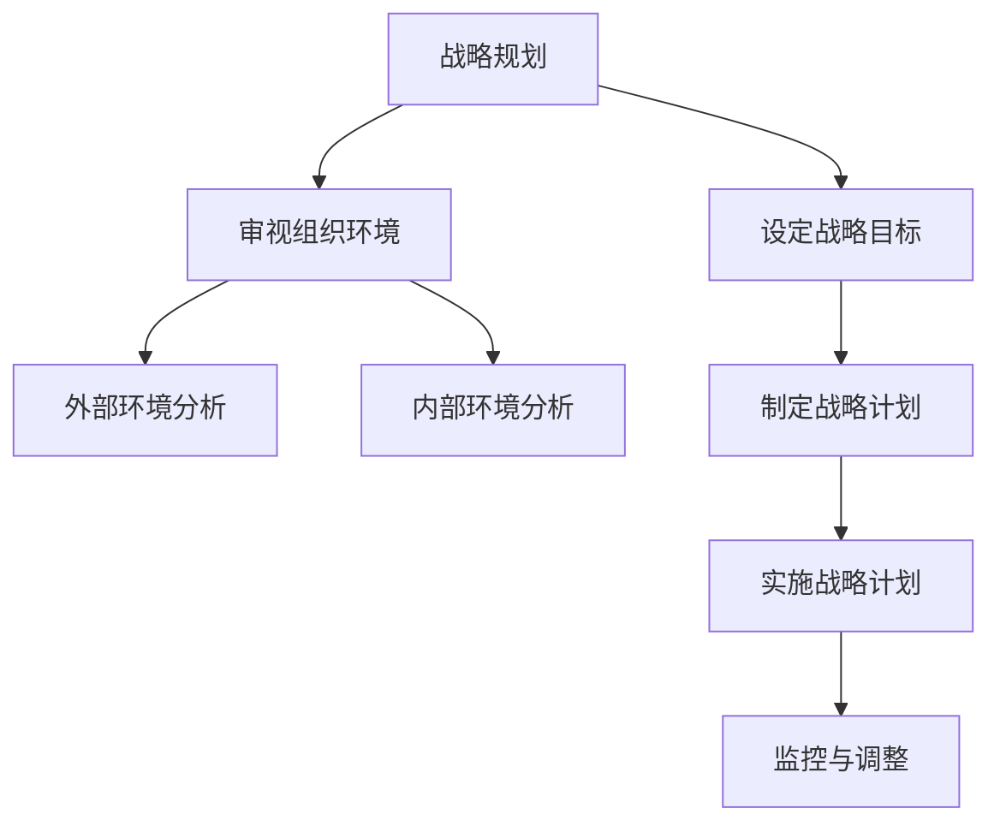

                 

### 目录

### 1. 战略规划概述

#### 1.1 问题背景

在当今快速变化和竞争激烈的商业环境中，企业需要具备前瞻性和灵活性，以应对各种不确定性和挑战。战略规划作为一种系统性的规划过程，旨在为企业提供明确的长期目标和实现路径。然而，许多企业在实际操作中面临着一系列问题，如缺乏明确的目标、不切实际的战略计划、执行困难等。

#### 1.2 核心概念

- **战略规划**：制定和实施长期目标的系统过程，涉及企业愿景、使命、目标、资源和行动计划的制定。
- **长期目标**：指企业希望在一段时间内实现的具体结果和成就，通常具有明确的时间范围和可衡量性。

#### 1.3 战略规划的重要性

- **指导企业决策**：战略规划为企业提供了明确的战略方向，有助于企业在面对市场变化时做出明智的决策。
- **资源优化**：通过战略规划，企业可以更有效地分配和利用资源，提高运营效率和盈利能力。
- **持续竞争力**：战略规划有助于企业保持持续竞争力，适应市场需求的变化，并抓住新的商业机会。

### 2. 制定战略规划

#### 2.1 审视组织环境

- **外部环境分析**：了解市场趋势、竞争格局、法律法规、技术发展等因素对企业的影响。
- **内部环境分析**：评估企业的资源、能力、优势和劣势，明确企业的核心竞争力。

#### 2.2 设定战略目标

- **目标设定原则**：确保目标具体、可衡量、可实现、有时限。
- **目标设定方法**：运用SMART原则（具体、可衡量、可实现、相关、时限）设定目标。

#### 2.3 制定战略计划

- **战略计划制定流程**：从愿景和使命出发，制定短期和长期战略计划。
- **战略计划内容**：包括战略方向、关键任务、资源配置、时间表和预算等。

### 3. 实施战略计划

#### 3.1 制定实施计划

- **实施计划制定**：明确具体行动、责任分配、时间表和资源需求。
- **实施计划评估**：定期评估实施计划的进展，确保按计划推进。

#### 3.2 调整战略规划

- **监测和评估**：通过关键绩效指标（KPI）监控战略执行情况。
- **调整策略**：根据实际情况调整战略规划和实施计划，确保目标的实现。

### 4. 监控与调整

#### 4.1 战略执行监控

- **监控方法**：采用定性和定量方法，如定期汇报、关键绩效指标（KPI）等。
- **监控工具**：利用项目管理软件、数据分析工具等辅助监控。

#### 4.2 战略调整

- **调整策略**：根据监控结果和外部环境变化，及时调整战略规划和实施计划。
- **调整流程**：确保调整过程的透明性和效率，减少不必要的浪费。

### 5. 案例研究

#### 5.1 案例一：苹果公司

- **案例背景**：介绍苹果公司的战略规划和成功经验。
- **案例解析**：分析苹果公司的战略目标、战略计划、实施过程和调整策略。

#### 5.2 案例二：阿里巴巴

- **案例背景**：介绍阿里巴巴的战略规划和成功经验。
- **案例解析**：分析阿里巴巴的战略目标、战略计划、实施过程和调整策略。

### 6. 最佳实践与启示

#### 6.1 最佳实践

- **实践经验分享**：总结企业在战略规划方面的成功经验和教训。
- **最佳实践总结**：提出可操作性的战略规划方法和建议。

#### 6.2 启示

- **启示与思考**：从成功案例中提炼出适用于不同企业的战略规划启示。

### 7. 战略规划的未来趋势

#### 7.1 未来趋势

- **技术发展**：探讨新技术（如人工智能、大数据等）对战略规划的影响。
- **市场变化**：分析市场趋势和竞争环境对战略规划的要求。

#### 7.2 影响因素

- **政策法规**：了解政策法规变化对战略规划的影响。
- **企业使命**：强调企业使命和愿景在战略规划中的核心作用。

### 8. 总结

#### 8.1 内容回顾

- **核心内容**：回顾文章中的核心概念、方法和案例。
- **关键要点**：强调战略规划的重要性、实施策略和调整方法。

#### 8.2 小结

- **小结**：总结战略规划的关键要素和实施步骤。
- **未来展望**：展望战略规划在未来的发展趋势和挑战。

#### 8.3 注意事项

- **注意事项**：提醒读者在战略规划过程中需要注意的事项。
- **拓展阅读**：推荐相关书籍和资源，供读者进一步学习。

### 附录

#### 附录1：战略规划工具与方法

- **SWOT分析**：介绍SWOT分析的原理和应用。
- **PEST分析**：介绍PEST分析的原理和应用。
- **五力模型**：介绍五力模型的原理和应用。

#### 附录2：战略规划流程图

- **战略规划流程图**：使用Mermaid绘制战略规划流程图。

#### 附录3：战略规划案例

- **案例解析**：详细解析经典战略规划案例。

---

# 战略规划：制定并执行长期目标

## 关键词

战略规划、长期目标、企业决策、资源优化、竞争力

## 摘要

本文将探讨战略规划的概念、重要性、制定过程、执行和调整方法。通过分析成功企业的案例，总结最佳实践，展望战略规划的未来发展趋势，旨在为读者提供全面、实用的战略规划指导。

## 1. 战略规划概述

### 1.1 问题背景

在当今快速变化和竞争激烈的商业环境中，企业需要具备前瞻性和灵活性，以应对各种不确定性和挑战。战略规划作为一种系统性的规划过程，旨在为企业提供明确的长期目标和实现路径。然而，许多企业在实际操作中面临着一系列问题，如缺乏明确的目标、不切实际的战略计划、执行困难等。

### 1.2 核心概念

**战略规划**：制定和实施长期目标的系统过程，涉及企业愿景、使命、目标、资源和行动计划的制定。

**长期目标**：指企业希望在一段时间内实现的具体结果和成就，通常具有明确的时间范围和可衡量性。

### 1.3 战略规划的重要性

- **指导企业决策**：战略规划为企业提供了明确的战略方向，有助于企业在面对市场变化时做出明智的决策。
- **资源优化**：通过战略规划，企业可以更有效地分配和利用资源，提高运营效率和盈利能力。
- **持续竞争力**：战略规划有助于企业保持持续竞争力，适应市场需求的变化，并抓住新的商业机会。

## 2. 制定战略规划

### 2.1 审视组织环境

#### 2.1.1 外部环境分析

- **市场趋势**：了解市场需求、技术发展、行业趋势等。
- **竞争格局**：分析竞争对手的优势、劣势和市场定位。
- **法律法规**：了解相关法律法规对企业的要求和影响。

#### 2.1.2 内部环境分析

- **资源评估**：评估企业的资源（如资金、人力资源、技术等）和现有能力。
- **优势与劣势**：分析企业的核心竞争力、独特优势和潜在劣势。

### 2.2 设定战略目标

#### 2.2.1 目标设定原则

- **具体性**：目标应当明确具体，避免模糊不清。
- **可衡量性**：目标应当具有可衡量的标准，便于评估和追踪。
- **可实现性**：目标应当符合企业的实际情况，避免过于理想化。
- **相关性**：目标应当与企业愿景、使命和长期目标相一致。
- **时限性**：目标应当设定明确的时间期限，便于规划和管理。

#### 2.2.2 目标设定方法

- **SMART原则**：运用SMART原则（具体、可衡量、可实现、相关、时限）设定目标。

### 2.3 制定战略计划

#### 2.3.1 战略计划制定流程

- **从愿景和使命出发**：明确企业的愿景和使命，作为战略规划的基石。
- **制定短期和长期战略计划**：根据长期目标，制定具体的短期战略计划，确保目标的实现。

#### 2.3.2 战略计划内容

- **战略方向**：明确企业的战略方向，如市场扩张、产品创新等。
- **关键任务**：确定实现战略目标的关键任务和行动。
- **资源配置**：明确资源需求，确保资源的合理分配。
- **时间表和预算**：制定具体的时间表和预算，确保战略计划的执行。

## 3. 实施战略计划

### 3.1 制定实施计划

- **具体行动**：明确具体的行动计划，确保战略目标的实现。
- **责任分配**：明确每个行动的责任人，确保行动的有效执行。
- **时间表和资源需求**：制定详细的时间表和资源需求，确保行动的顺利进行。

### 3.2 调整战略规划

#### 3.2.1 监测和评估

- **关键绩效指标（KPI）**：设定关键绩效指标，定期评估战略执行情况。
- **定期汇报**：通过定期汇报，了解战略执行的进展和问题。

#### 3.2.2 调整策略

- **根据实际情况调整**：根据监控结果和外部环境变化，及时调整战略规划和实施计划。
- **调整流程**：确保调整过程的透明性和效率，减少不必要的浪费。

## 4. 监控与调整

### 4.1 战略执行监控

- **监控方法**：采用定性和定量方法，如定期汇报、关键绩效指标（KPI）等。
- **监控工具**：利用项目管理软件、数据分析工具等辅助监控。

### 4.2 战略调整

- **调整策略**：根据监控结果和外部环境变化，及时调整战略规划和实施计划。
- **调整流程**：确保调整过程的透明性和效率，减少不必要的浪费。

## 5. 案例研究

### 5.1 案例一：苹果公司

#### 5.1.1 案例背景

- **苹果公司简介**：介绍苹果公司的历史和发展背景。
- **战略规划**：分析苹果公司的战略规划和成功经验。

#### 5.1.2 案例解析

- **战略目标**：解析苹果公司的战略目标和实现过程。
- **战略计划**：分析苹果公司的战略计划和实施策略。
- **调整策略**：探讨苹果公司如何根据市场变化调整战略规划。

### 5.2 案例二：阿里巴巴

#### 5.2.1 案例背景

- **阿里巴巴简介**：介绍阿里巴巴的历史和发展背景。
- **战略规划**：分析阿里巴巴的战略规划和成功经验。

#### 5.2.2 案例解析

- **战略目标**：解析阿里巴巴的战略目标和实现过程。
- **战略计划**：分析阿里巴巴的战略计划和实施策略。
- **调整策略**：探讨阿里巴巴如何根据市场变化调整战略规划。

## 6. 最佳实践与启示

### 6.1 最佳实践

- **实践经验分享**：总结企业在战略规划方面的成功经验和教训。
- **最佳实践总结**：提出可操作性的战略规划方法和建议。

### 6.2 启示

- **启示与思考**：从成功案例中提炼出适用于不同企业的战略规划启示。

## 7. 战略规划的未来趋势

### 7.1 未来趋势

- **技术发展**：探讨新技术（如人工智能、大数据等）对战略规划的影响。
- **市场变化**：分析市场趋势和竞争环境对战略规划的要求。

### 7.2 影响因素

- **政策法规**：了解政策法规变化对战略规划的影响。
- **企业使命**：强调企业使命和愿景在战略规划中的核心作用。

## 8. 总结

### 8.1 内容回顾

- **核心内容**：回顾文章中的核心概念、方法和案例。
- **关键要点**：强调战略规划的重要性、实施策略和调整方法。

### 8.2 小结

- **小结**：总结战略规划的关键要素和实施步骤。
- **未来展望**：展望战略规划在未来的发展趋势和挑战。

### 8.3 注意事项

- **注意事项**：提醒读者在战略规划过程中需要注意的事项。
- **拓展阅读**：推荐相关书籍和资源，供读者进一步学习。

## 附录

### 附录1：战略规划工具与方法

- **SWOT分析**：介绍SWOT分析的原理和应用。
- **PEST分析**：介绍PEST分析的原理和应用。
- **五力模型**：介绍五力模型的原理和应用。

### 附录2：战略规划流程图

- **战略规划流程图**：使用Mermaid绘制战略规划流程图。

### 附录3：战略规划案例

- **案例解析**：详细解析经典战略规划案例。

---

**作者：AI天才研究院/AI Genius Institute & 禅与计算机程序设计艺术 /Zen And The Art of Computer Programming**

## 1. 战略规划概述

### 1.1 问题背景

在当今快速变化和竞争激烈的商业环境中，企业需要具备前瞻性和灵活性，以应对各种不确定性和挑战。战略规划作为一种系统性的规划过程，旨在为企业提供明确的长期目标和实现路径。然而，许多企业在实际操作中面临着一系列问题，如缺乏明确的目标、不切实际的战略计划、执行困难等。

战略规划不仅是一种管理工具，更是一种思维方式，它要求企业从全局和长远的角度出发，制定和实施一系列策略，以实现企业的愿景和使命。在这个高度动态的商业环境中，战略规划的重要性不言而喻。首先，它为企业提供了明确的战略方向，使得企业在面对市场变化时能够做出明智的决策。其次，战略规划有助于企业优化资源配置，提高运营效率和盈利能力。最后，战略规划能够帮助企业保持持续竞争力，适应市场需求的变化，并抓住新的商业机会。

然而，许多企业在实施战略规划时往往面临着诸多挑战。一方面，企业缺乏明确的目标和战略方向，导致战略规划流于形式。另一方面，企业可能忽视了市场环境的变化，制定的战略计划不符合实际需求。此外，执行困难也是一个普遍存在的问题，企业往往在实施过程中缺乏有效的监控和调整机制，导致战略规划难以落地。

因此，本文将探讨战略规划的概念、重要性、制定过程、执行和调整方法。通过分析成功企业的案例，总结最佳实践，展望战略规划的未来发展趋势，旨在为读者提供全面、实用的战略规划指导。

### 1.2 核心概念

#### 战略规划

战略规划（Strategic Planning）是指企业为了实现其长期目标而制定的一系列战略和行动计划。它是一种系统性的过程，涉及到企业的愿景、使命、目标和资源的有效配置。战略规划不仅仅是对未来的一套预设，更是一种动态的管理工具，用于指导企业在不断变化的环境中做出适应和调整。

战略规划的核心要素包括：

- **愿景（Vision）**：企业希望在未来实现的状态和目标，通常具有远大的理想和高度概括性。
- **使命（Mission）**：企业存在的根本目的和原因，通常涵盖企业的核心价值观和业务领域。
- **目标（Goals）**：具体的、可衡量的短期和长期目标，用于指导企业的战略决策和资源分配。
- **行动计划（Action Plans）**：为实现目标而制定的具体行动步骤、时间表和责任分配。

战略规划的过程通常包括以下几个步骤：

1. **审视外部环境**：分析市场趋势、竞争状况、法律法规、技术发展等因素，以了解外部环境对企业的影响。
2. **审视内部环境**：评估企业的资源、能力、优势和劣势，以确定企业的核心竞争力。
3. **设定战略目标**：根据外部和内部环境分析结果，制定具体、可衡量、可实现、相关和有时限的战略目标。
4. **制定战略计划**：明确实现战略目标的战略方向、关键任务、资源配置和时间表。
5. **实施战略计划**：将战略计划转化为具体的行动，确保目标的实现。
6. **监控和调整**：通过关键绩效指标（KPI）监控战略执行情况，根据实际情况调整战略规划和实施计划。

#### 长期目标

长期目标（Long-term Goals）是指企业在较长一段时间内（通常为数年）希望实现的具体结果和成就。长期目标是企业愿景和使命的具体化，是战略规划的核心组成部分。制定明确的长期目标有助于企业集中资源，明确发展方向，从而在竞争激烈的市场中取得优势。

长期目标的特点包括：

- **具体性**：长期目标应当是具体、明确的，可以量化和衡量。
- **可衡量性**：长期目标应当有明确的标准和方法来衡量其实现程度。
- **可实现性**：长期目标应当符合企业的实际情况和能力，避免过于理想化。
- **相关性**：长期目标应当与企业愿景、使命和短期目标相一致。
- **时限性**：长期目标应当设定明确的时间期限，便于规划和管理。

#### 战略规划的重要性

战略规划在企业的长远发展中具有至关重要的地位。以下是战略规划的重要性和作用：

1. **指导企业决策**：战略规划为企业提供了明确的战略方向，有助于企业在面对市场变化时做出明智的决策。通过系统性的规划，企业能够更好地识别机遇和应对挑战。
   
2. **资源优化**：战略规划有助于企业优化资源配置，提高运营效率和盈利能力。通过明确的战略目标和行动计划，企业可以更有效地分配资源，减少浪费，提升整体绩效。

3. **持续竞争力**：战略规划能够帮助企业保持持续竞争力。在动态的市场环境中，企业需要不断适应变化，调整策略。战略规划为企业提供了持续调整和优化的机制，使其能够保持领先地位。

4. **提高员工积极性**：明确的战略规划和目标能够激励员工，增强他们的责任感和参与感。通过共同的目标和愿景，企业能够凝聚员工力量，提升团队协作效率。

5. **风险管理**：战略规划有助于企业识别和应对潜在的风险。通过对外部和内部环境的深入分析，企业可以提前预见可能的风险，制定相应的应对措施，减少不确定性带来的负面影响。

#### 战略规划与企业战略的关系

战略规划是企业战略（Corporate Strategy）的一部分，与企业战略密切相关。企业战略是指企业为实现其长期目标而制定的总体方向和策略。战略规划则是企业战略的具体实施路径，它将企业战略分解为具体的行动步骤和行动计划。

企业战略通常包括以下几个层次：

- **公司层战略**：涉及企业的整体发展方向和业务模式，如多元化经营、市场定位等。
- **业务层战略**：针对特定业务领域或产品线的战略规划，如市场扩张、产品创新等。
- **职能层战略**：涉及企业各职能部门（如营销、生产、人力资源等）的战略规划，确保各部门协同合作，实现整体战略目标。

战略规划在企业战略中的地位和作用如下：

- **确保战略实施的可行性**：战略规划将企业战略转化为具体的行动方案，确保战略目标能够被实际执行。
- **协调各部门合作**：战略规划明确各部门的职责和任务，确保各部门协同合作，共同实现企业战略目标。
- **提高战略执行力**：通过制定具体的行动计划和时间表，战略规划有助于提高企业的战略执行力，确保战略目标的实现。

### 1.3 战略规划的重要性

战略规划对于企业的长远发展具有至关重要的作用。以下从几个方面详细阐述战略规划的重要性：

#### 指导企业决策

首先，战略规划为企业提供了明确的战略方向，使得企业能够在面对市场变化时做出明智的决策。通过系统性的规划过程，企业可以全面分析外部环境和内部条件，识别机遇和挑战，制定相应的战略方案。这种前瞻性和系统性的思维有助于企业避免盲目跟风和短期行为，从而在市场竞争中立于不败之地。

#### 资源优化

其次，战略规划有助于企业优化资源配置，提高运营效率和盈利能力。通过明确的战略目标和行动计划，企业可以更有效地分配资源，避免资源的浪费和重复投入。此外，战略规划还强调了资源的高效利用，通过优化生产流程、技术创新和管理方法，提高企业的生产效率和产品质量。

#### 持续竞争力

此外，战略规划能够帮助企业保持持续竞争力。在当今市场环境中，企业需要不断适应变化，调整策略。战略规划为企业提供了持续调整和优化的机制，使其能够迅速响应市场变化，抓住新的商业机会，保持竞争优势。

#### 提高员工积极性

战略规划还能激励员工，增强他们的责任感和参与感。明确的战略规划和目标能够激发员工的积极性，让他们看到自己的工作对于实现企业目标的重要性。这种共同的目标和愿景有助于提高团队协作效率，形成良好的企业文化。

#### 风险管理

最后，战略规划有助于企业识别和应对潜在的风险。通过对外部和内部环境的深入分析，企业可以提前预见可能的风险，制定相应的应对措施，减少不确定性带来的负面影响。这种前瞻性的风险管理能力有助于企业稳定发展，降低经营风险。

综上所述，战略规划在企业的长远发展中具有不可替代的重要作用。它不仅为企业提供了明确的战略方向和资源优化方案，还提升了企业的持续竞争力和风险管理能力，从而为企业实现长期目标奠定了坚实的基础。

### 1.4 战略规划的关键要素

战略规划的成功与否取决于多个关键要素。以下从几个方面详细探讨这些要素，以确保战略规划的制定和执行能够达到预期效果。

#### 愿景和使命

愿景和使命是战略规划的基础。愿景是企业希望在未来实现的状态和目标，它通常具有远大的理想和高度概括性。使命则描述企业存在的根本目的和原因，通常涵盖企业的核心价值观和业务领域。明确的愿景和使命能够指引企业的战略方向，为战略规划提供方向性的指导。

在制定战略规划时，企业需要确保愿景和使命具有以下特点：

- **远大性**：愿景应当具有远大的理想，能够激励员工和企业共同奋斗。
- **具体性**：使命应当具体、明确，能够指导企业的日常运营和决策。
- **一致性**：愿景和使命应当与企业的价值观和业务领域相一致，形成统一的战略方向。

#### 战略目标

战略目标是战略规划的核心。它们是具体的、可衡量的目标，用于指导企业的战略决策和资源分配。制定有效的战略目标需要遵循SMART原则，即具体（Specific）、可衡量（Measurable）、可实现（Achievable）、相关（Relevant）和有时限（Time-bound）。

在设定战略目标时，企业需要考虑以下因素：

- **具体性**：目标应当明确具体，避免模糊不清。
- **可衡量性**：目标应当具有可衡量的标准，便于评估和追踪。
- **可实现性**：目标应当符合企业的实际情况，避免过于理想化。
- **相关性**：目标应当与企业愿景、使命和长期目标相一致。
- **时限性**：目标应当设定明确的时间期限，便于规划和管理。

#### 行动计划

行动计划是实现战略目标的详细步骤和时间表。它们将战略目标转化为具体的行动，明确每个行动的责任人、时间表和资源需求。制定有效的行动计划需要确保以下要素：

- **具体性**：行动步骤应当具体明确，便于执行和监控。
- **责任分配**：明确每个行动的责任人，确保行动的有效执行。
- **时间表**：制定详细的时间表，确保行动按计划推进。
- **资源需求**：明确资源需求，确保资源的合理分配。

#### 资源配置

资源配置是战略规划中的重要环节。它涉及到企业资源的合理分配和利用，以确保战略目标的实现。有效的资源配置需要考虑以下因素：

- **资源评估**：评估企业的资源（如资金、人力资源、技术等）和现有能力。
- **优先级排序**：根据战略目标的重要性，对资源进行优先级排序，确保关键资源的优先分配。
- **资源整合**：通过跨部门合作和资源整合，提高资源利用效率。

#### 监控和调整

监控和调整是战略规划实施过程中不可或缺的环节。通过监控战略执行情况，企业可以及时发现问题和调整策略，确保战略目标的实现。有效的监控和调整需要考虑以下因素：

- **关键绩效指标（KPI）**：设定关键绩效指标，用于评估战略执行情况。
- **定期汇报**：通过定期汇报，了解战略执行的进展和问题。
- **透明性**：确保监控过程的透明性，提高员工参与度和责任感。
- **灵活性**：根据实际情况调整战略规划和实施计划，确保目标的实现。

综上所述，战略规划的关键要素包括愿景和使命、战略目标、行动计划、资源配置和监控调整。这些要素相互关联，共同构成了一个完整的战略规划体系，为企业的长期发展提供了明确的指导和支持。

### 1.5 战略规划的基本原则

在制定和执行战略规划的过程中，遵循一系列基本原则至关重要。这些原则不仅确保了战略规划的合理性和有效性，还提高了战略规划的成功概率。以下将详细探讨这些基本原则：

#### 审视组织环境

**审视组织环境**是战略规划的重要前提。这一原则要求企业在制定战略规划时，必须全面分析外部环境和内部条件，以确保战略规划与实际情况相符。具体步骤包括：

- **外部环境分析**：分析市场趋势、竞争状况、法律法规、技术发展等因素，了解外部环境对企业的影响。
- **内部环境分析**：评估企业的资源、能力、优势和劣势，了解企业的核心竞争力。

通过审视组织环境，企业可以更准确地把握市场机遇和挑战，制定符合实际的战略规划。

#### 设定战略目标

**设定战略目标**是战略规划的核心环节。这一原则要求企业制定具体、可衡量、可实现、相关和有时限的战略目标。具体方法包括：

- **具体性**：目标应当明确具体，避免模糊不清。
- **可衡量性**：目标应当具有可衡量的标准，便于评估和追踪。
- **可实现性**：目标应当符合企业的实际情况，避免过于理想化。
- **相关性**：目标应当与企业愿景、使命和长期目标相一致。
- **时限性**：目标应当设定明确的时间期限，便于规划和管理。

通过设定明确的战略目标，企业可以确保战略规划的实施方向和进度，提高战略执行力。

#### 制定战略计划

**制定战略计划**是将战略目标转化为具体行动的过程。这一原则要求企业制定详细的战略计划，包括战略方向、关键任务、资源配置和时间表。具体方法包括：

- **战略方向**：明确企业的战略方向，如市场扩张、产品创新等。
- **关键任务**：确定实现战略目标的关键任务和行动。
- **资源配置**：明确资源需求，确保资源的合理分配。
- **时间表**：制定具体的时间表和预算，确保战略计划的执行。

通过制定详细的战略计划，企业可以确保战略目标的实现，提高整体运营效率。

#### 实施战略计划

**实施战略计划**是将战略计划转化为具体行动的过程。这一原则要求企业严格执行战略计划，确保各项任务按计划推进。具体方法包括：

- **责任分配**：明确每个任务的责任人，确保任务的有效执行。
- **进度监控**：定期监控任务进度，确保按计划推进。
- **资源调配**：根据实际情况，及时调整资源配置，确保任务顺利完成。

通过实施战略计划，企业可以确保战略目标的实现，提高整体执行力。

#### 监控和调整

**监控和调整**是战略规划实施过程中的关键环节。这一原则要求企业通过监控战略执行情况，及时发现问题和调整策略，确保战略目标的实现。具体方法包括：

- **设定关键绩效指标（KPI）**：用于评估战略执行情况。
- **定期汇报**：通过定期汇报，了解战略执行的进展和问题。
- **透明性**：确保监控过程的透明性，提高员工参与度和责任感。
- **灵活性**：根据实际情况调整战略规划和实施计划，确保目标的实现。

通过监控和调整，企业可以确保战略规划的有效性和灵活性，提高战略执行力。

综上所述，战略规划的基本原则包括审视组织环境、设定战略目标、制定战略计划、实施战略计划和监控和调整。这些原则相互关联，共同构成了一个完整的战略规划体系，为企业的长期发展提供了明确的指导和支持。

### 2.1 审视组织环境

制定有效的战略规划首先需要全面审视组织所处的内外部环境。这种审视不仅包括对市场趋势、竞争格局、法律法规、技术发展等因素的分析，还包括对企业自身资源、能力和优劣势的深入评估。以下将详细探讨这些内容。

#### 外部环境分析

外部环境分析是战略规划的重要一环，它有助于企业了解外部环境对企业战略的潜在影响。具体步骤包括：

1. **市场趋势分析**：了解市场需求、消费者行为、行业趋势等，以预测未来市场的发展方向。这有助于企业制定适应市场变化的战略计划。

2. **竞争格局分析**：分析竞争对手的市场份额、优势、劣势和策略，以识别潜在的市场机会和威胁。这有助于企业制定有针对性的市场竞争策略。

3. **法律法规分析**：了解相关法律法规对企业的要求和限制，以确保企业在合规的前提下开展业务。这有助于企业避免因违反法规而遭受处罚。

4. **技术发展分析**：关注新技术的发展和应用，以评估其对企业业务的影响。这有助于企业抓住技术发展的机遇，推动业务创新。

#### 内部环境分析

内部环境分析是战略规划的基础，它有助于企业了解自身的资源、能力和优劣势。具体步骤包括：

1. **资源评估**：评估企业的资源状况，包括资金、人力资源、技术、设备等。这有助于企业了解自身的资源优势，为战略规划提供支持。

2. **能力评估**：评估企业的核心能力和竞争优势，包括市场开拓能力、产品研发能力、运营效率等。这有助于企业明确自身的核心竞争力，为战略规划提供依据。

3. **优劣势分析**：分析企业的优势与劣势，包括管理、文化、组织结构等方面。这有助于企业发现内部问题，为战略规划提供改进方向。

#### 外部环境分析

1. **市场趋势**：市场需求变化、技术进步、行业竞争等对企业的潜在影响。
2. **竞争格局**：主要竞争对手的市场份额、策略和优势。
3. **法律法规**：相关政策法规对企业运营的影响。
4. **技术发展**：新技术的发展和应用趋势。

#### 内部环境分析

1. **资源评估**：企业现有的资源情况，包括资金、人力资源、技术等。
2. **能力评估**：企业的核心能力和竞争优势。
3. **优劣势分析**：企业的优势、劣势和存在的问题。

#### 外部环境分析

1. **市场趋势**：了解市场动态、消费者需求变化，预测行业发展趋势。
2. **竞争格局**：分析竞争对手的优劣势，制定有针对性的市场竞争策略。
3. **法律法规**：遵守相关法规，确保企业合规经营。
4. **技术发展**：紧跟技术趋势，推动企业技术进步和业务创新。

#### 内部环境分析

1. **资源评估**：合理配置资源，提高资源利用效率。
2. **能力评估**：发挥企业核心优势，提升竞争力。
3. **优劣势分析**：解决内部问题，优化企业管理和组织结构。

### 2.2 设定战略目标

设定战略目标是战略规划的核心环节。有效的战略目标应当具备具体性、可衡量性、可实现性、相关性和时限性。以下将详细阐述如何运用SMART原则（具体、可衡量、可实现、相关、时限）设定战略目标。

#### 具体性（Specific）

具体性要求战略目标清晰明确，避免模糊和抽象。具体的目标有助于员工理解和执行，提高目标的实现可能性。例如，将“提高销售额”改为“将销售额提高至X万元”。

#### 可衡量性（Measurable）

可衡量性要求战略目标具有明确的衡量标准，便于评估和追踪。通过量化的指标，企业可以实时监控目标的实现进度，及时调整战略规划。例如，将“提升品牌知名度”改为“提高品牌知名度至X分”或“在Y个月内增加X%的品牌曝光率”。

#### 可实现性（Achievable）

可实现性要求战略目标符合企业的实际情况和能力，避免过于理想化。设定目标时，需要考虑企业的资源、技术和市场条件，确保目标具有可行性。例如，将“成为行业领导者”改为“在X年内实现市场份额达到Y%”。

#### 相关性（Relevant）

相关性要求战略目标与企业愿景、使命和长期目标相一致。相关联的目标有助于企业集中资源，形成合力，实现整体战略目标。例如，将“增加产品销售量”改为“增加X产品的销售量，以实现公司的收入增长目标”。

#### 时限性（Time-bound）

时限性要求战略目标设定明确的时间期限，便于规划和执行。明确的时间期限有助于企业制定具体的时间表和行动步骤，提高目标的实现效率。例如，将“提高员工满意度”改为“在Y个月内提高员工满意度至X分”。

#### 设定战略目标的步骤

1. **明确愿景和使命**：战略目标应当与企业的愿景和使命相一致，确保目标的战略方向正确。
2. **分析内外部环境**：根据外部环境分析和内部环境分析的结果，设定符合实际的目标。
3. **运用SMART原则**：将目标具体化、量化、可实现、相关并设定时间期限。
4. **制定关键绩效指标（KPI）**：为每个目标设定可衡量的指标，便于评估和追踪。
5. **制定行动计划**：明确实现目标的行动步骤、责任人、时间表和资源需求。

### 2.3 制定战略计划

制定战略计划是将战略目标转化为具体行动的过程。有效的战略计划应当包括战略方向、关键任务、资源配置和时间表。以下将详细阐述如何制定战略计划。

#### 战略方向

战略方向是战略计划的核心，它明确了企业的长远目标和战略重心。制定战略方向时，企业需要考虑以下因素：

- **企业愿景和使命**：确保战略方向与企业的愿景和使命相一致。
- **市场趋势和竞争环境**：根据市场趋势和竞争环境，确定企业的战略重心。
- **资源和技术条件**：考虑企业的资源和技术条件，确保战略方向的可行性。

#### 关键任务

关键任务是实现战略目标的具体行动。制定关键任务时，企业需要考虑以下因素：

- **目标分解**：将战略目标分解为具体的任务，确保每个任务都有明确的目标和责任。
- **优先级排序**：根据任务的重要性和紧急性，对任务进行优先级排序。
- **资源需求**：明确每个任务的资源需求，确保资源合理分配。

#### 资源配置

资源配置是战略计划实施的基础。制定资源配置计划时，企业需要考虑以下因素：

- **资源评估**：评估企业的资源状况，包括资金、人力资源、技术等。
- **优先级分配**：根据任务的重要性和紧急性，对资源进行优先级分配。
- **跨部门协作**：推动跨部门协作，确保资源的高效利用。

#### 时间表

时间表是战略计划执行的时间安排。制定时间表时，企业需要考虑以下因素：

- **任务分解**：将任务分解为具体的时间节点，确保每个任务都有明确的时间安排。
- **里程碑设置**：设定关键里程碑，用于评估任务进度和整体计划执行情况。
- **灵活性**：考虑外部环境变化，确保计划具有灵活性。

#### 制定战略计划的步骤

1. **明确战略方向**：根据企业愿景和使命、市场趋势和竞争环境，确定战略方向。
2. **分解目标**：将战略目标分解为具体的任务，明确每个任务的目标和责任。
3. **制定资源配置计划**：根据任务的重要性和紧急性，制定资源配置计划。
4. **设定时间表和里程碑**：制定详细的时间表，设定关键里程碑，确保任务按计划执行。
5. **制定行动计划**：明确实现目标的行动步骤、责任人、时间表和资源需求。

### 2.4 实施战略计划

实施战略计划是将战略计划转化为具体行动的过程。有效的实施计划能够确保战略目标的实现，提高企业的运营效率。以下将详细阐述如何实施战略计划。

#### 制定实施计划

制定实施计划是战略计划实施的第一步。实施计划应当包括以下内容：

- **具体行动**：明确实现战略目标的行动步骤，确保每个行动都有具体的执行方案。
- **责任分配**：明确每个行动的责任人，确保行动的有效执行。
- **时间表**：制定详细的时间表，确保行动按计划推进。
- **资源需求**：明确资源需求，确保资源的合理分配。

#### 监控执行进度

监控执行进度是确保战略计划顺利实施的关键。以下方法有助于监控执行进度：

- **定期汇报**：设定定期汇报机制，责任人定期汇报任务进度和存在的问题。
- **关键绩效指标（KPI）**：设定关键绩效指标，用于评估任务完成情况和整体计划执行情况。
- **数据分析和报告**：通过数据分析和报告，实时监控任务进度和整体计划执行情况。

#### 调整策略

在实施战略计划的过程中，企业需要根据实际情况调整策略。以下方法有助于调整策略：

- **问题识别**：及时发现并识别战略计划实施过程中存在的问题。
- **原因分析**：分析问题产生的原因，找出根本原因。
- **调整方案**：制定调整方案，根据实际情况调整战略计划和实施计划。
- **实施调整**：根据调整方案，实施具体的调整措施，确保战略目标的实现。

#### 激励与支持

激励与支持是确保战略计划顺利实施的重要因素。以下方法有助于激励与支持：

- **目标激励**：设定明确的目标和激励机制，激励员工积极完成任务。
- **培训与支持**：提供必要的培训和资源支持，帮助员工克服困难和提高能力。
- **团队协作**：推动团队协作，形成良好的团队氛围，提高整体执行力。

### 2.5 监控和调整

监控和调整是战略规划实施过程中不可或缺的环节。以下将详细探讨如何监控和调整战略规划。

#### 监控执行情况

监控执行情况是确保战略计划顺利实施的关键。以下方法有助于监控执行情况：

- **定期检查**：定期检查战略计划的执行情况，及时发现问题和偏差。
- **数据监控**：通过数据监控工具，实时监控关键绩效指标（KPI）和任务进度。
- **反馈机制**：建立反馈机制，员工可以随时反馈问题和建议。

#### 调整战略规划

调整战略规划是应对外部环境和内部条件变化的重要手段。以下方法有助于调整战略规划：

- **风险评估**：评估外部环境和内部条件变化对企业战略的影响，识别潜在的风险。
- **原因分析**：分析战略规划实施过程中存在的问题和原因，找出根本原因。
- **调整方案**：制定调整方案，根据实际情况调整战略规划和实施计划。
- **实施调整**：根据调整方案，实施具体的调整措施，确保战略目标的实现。

#### 保持灵活性

保持灵活性是确保战略规划适应环境变化的关键。以下方法有助于保持灵活性：

- **敏捷管理**：采用敏捷管理方法，快速响应环境变化，调整战略规划和实施计划。
- **持续改进**：持续改进战略规划，根据实际情况调整和优化战略方案。
- **学习与适应**：鼓励员工学习和适应环境变化，提高企业的灵活性和创新能力。

### 3.1 战略执行监控

战略执行监控是确保战略规划顺利实施的关键环节。通过有效的监控，企业可以及时发现并解决问题，确保战略目标的实现。以下将详细探讨如何进行战略执行监控。

#### 设定关键绩效指标（KPI）

关键绩效指标（KPI）是评估战略执行情况的重要工具。设定KPI时，应遵循以下原则：

- **具体性**：KPI应明确、具体，避免模糊不清。
- **可衡量性**：KPI应有明确的衡量标准，便于评估和追踪。
- **相关性**：KPI应与战略目标和业务目标相关联。
- **时限性**：KPI应有明确的时间期限，便于监控和评估。

#### 监控工具和方法

为了有效监控战略执行情况，企业可以采用以下工具和方法：

- **定期汇报**：定期汇报是监控战略执行情况的基本手段。通过定期汇报，责任人可以汇报任务进展、存在的问题和需要协调的事项。
- **数据分析和报告**：通过数据分析和报告，企业可以实时了解战略执行情况，发现潜在的问题和偏差。
- **项目管理软件**：使用项目管理软件，如Trello、Asana等，可以方便地监控任务进度、资源分配和人员协作情况。
- **绩效管理工具**：使用绩效管理工具，如KPI仪表盘、绩效报告等，可以直观地展示KPI的实时数据和趋势。

#### 监控过程

战略执行监控过程包括以下几个步骤：

1. **设定KPI**：根据战略目标和业务需求，设定关键绩效指标（KPI）。
2. **数据收集**：通过定期汇报、数据分析和报告等方式，收集KPI数据。
3. **数据分析和评估**：对收集到的KPI数据进行分析和评估，发现潜在的问题和偏差。
4. **问题反馈**：将分析结果和存在的问题反馈给相关责任人，要求其采取措施解决。
5. **调整策略**：根据监控结果和实际情况，及时调整战略规划和实施计划。

### 3.2 调整战略规划

在战略执行过程中，企业可能会面临外部环境变化、内部条件变化或战略规划本身存在缺陷等问题，需要及时调整战略规划。以下将详细探讨如何调整战略规划。

#### 调整策略

调整战略规划时，企业应遵循以下策略：

- **问题导向**：以问题为导向，分析问题产生的原因和影响，制定针对性的调整方案。
- **灵活性**：保持战略规划的灵活性，根据实际情况及时调整。
- **透明性**：确保调整过程的透明性，提高员工的参与度和信任度。
- **协作**：推动跨部门协作，共同应对战略调整带来的挑战。

#### 调整步骤

调整战略规划的过程包括以下几个步骤：

1. **问题识别**：及时发现并识别战略执行过程中存在的问题。
2. **原因分析**：分析问题产生的原因，找出根本原因。
3. **评估影响**：评估问题对战略目标实现的影响，确定调整的优先级。
4. **制定方案**：根据问题和影响，制定调整方案，包括调整战略方向、关键任务、资源配置和时间表。
5. **实施调整**：根据调整方案，实施具体的调整措施，确保战略目标的实现。

#### 调整工具和方法

为了有效调整战略规划，企业可以采用以下工具和方法：

- **SWOT分析**：通过SWOT分析，了解企业的优势、劣势、机会和威胁，为调整战略提供依据。
- **PEST分析**：通过PEST分析，了解外部环境的政治、经济、社会和技术因素，为调整战略提供依据。
- **五力模型**：通过五力模型，分析行业竞争格局，为调整战略提供依据。
- **数据分析**：通过数据分析，了解关键绩效指标的实时数据和趋势，为调整战略提供依据。
- **专家咨询**：邀请行业专家或顾问参与战略调整，提供专业的意见和建议。

### 5.1 案例一：苹果公司

#### 5.1.1 案例背景

苹果公司（Apple Inc.）成立于1976年，总部位于美国加利福尼亚州库比蒂诺。苹果公司是全球领先的技术公司，以创新的设计、高质量的产品和卓越的用户体验著称。在过去的几十年中，苹果公司通过一系列成功的战略规划，从一个小型计算机公司发展成为全球市值最高的公司之一。

苹果公司的成功离不开其明确的战略规划和持续的创新。在创始人史蒂夫·乔布斯（Steve Jobs）的领导下，苹果公司始终坚持“精品主义”的理念，致力于提供最优质的产品和服务。通过不断的技术创新和市场拓展，苹果公司在全球范围内建立了强大的品牌影响力。

#### 5.1.2 案例解析

**战略目标**

苹果公司的战略目标主要包括：

- **技术创新**：保持技术领先地位，推动产品创新，为用户带来更好的使用体验。
- **市场拓展**：扩大市场份额，进入新的市场和领域，提升全球竞争力。
- **品牌建设**：建立强大的品牌形象，提升品牌知名度和美誉度。
- **盈利增长**：实现可持续的盈利增长，提升公司市值。

**战略计划**

苹果公司通过以下战略计划实现其目标：

- **产品创新**：持续投资研发，推出具有创新功能的产品，如iPhone、iPad和Mac等。
- **生态系统建设**：打造完整的生态系统，包括硬件、软件和服务，提供一站式解决方案。
- **市场拓展**：通过进入新兴市场，扩大市场份额，如中国市场、印度市场和东南亚市场。
- **品牌推广**：通过广告宣传、产品体验店和用户社区等多种方式，提升品牌知名度和美誉度。
- **供应链优化**：优化供应链管理，提高生产效率和产品质量。

**实施过程**

苹果公司通过以下步骤实施其战略计划：

- **市场调研**：通过市场调研，了解用户需求和行业趋势，为产品创新提供依据。
- **产品研发**：组织研发团队，进行产品设计和研发，确保产品质量和功能创新。
- **市场推广**：通过广告宣传、产品体验店和用户社区等多种方式，推广新产品。
- **销售渠道**：建立全球销售渠道，包括线上和线下渠道，确保产品的市场覆盖。
- **客户服务**：提供优质的客户服务，提升用户体验和品牌忠诚度。

**调整策略**

在战略执行过程中，苹果公司根据市场变化和竞争环境，及时调整战略规划。以下是一些调整策略：

- **技术创新**：紧跟技术发展趋势，持续投资新技术，如人工智能、增强现实和虚拟现实等。
- **市场定位**：根据市场需求和竞争态势，调整产品定位和市场策略，提升竞争力。
- **品牌建设**：加强品牌建设和营销活动，提升品牌形象和市场影响力。
- **供应链优化**：优化供应链管理，提高生产效率和产品质量，降低成本。

### 5.2 案例二：阿里巴巴

#### 5.2.1 案例背景

阿里巴巴集团（Alibaba Group）成立于1999年，总部位于中国杭州。阿里巴巴是一家全球领先的技术公司，业务涵盖电子商务、云计算、数字媒体和娱乐等多个领域。阿里巴巴的创始人马云（Jack Ma）凭借其独特的战略眼光和领导力，将阿里巴巴从一个小型的B2B交易平台发展成为全球最大的电子商务公司之一。

阿里巴巴的成功离不开其明确的战略规划和持续的创新。通过一系列的战略规划，阿里巴巴不仅在国内市场取得了巨大的成功，还积极拓展国际市场，实现了全球业务的多元化发展。

#### 5.2.2 案例解析

**战略目标**

阿里巴巴的战略目标主要包括：

- **电子商务**：建立全球领先的电子商务生态系统，提供一站式购物体验。
- **云计算**：打造强大的云计算平台，为企业和个人提供高效、可靠的计算服务。
- **数字媒体和娱乐**：发展数字媒体和娱乐业务，提升用户体验和品牌价值。
- **国际化**：拓展国际市场，提升全球业务占比。

**战略计划**

阿里巴巴通过以下战略计划实现其目标：

- **电子商务**：投资和收购电商平台，如淘宝、天猫、1688等，打造全方位的电子商务生态系统。
- **云计算**：投资云计算基础设施，推出阿里云平台，提供云计算、大数据、人工智能等服务。
- **数字媒体和娱乐**：投资和开发数字媒体和娱乐项目，如优酷、土豆、阿里影业等，提升用户体验和品牌价值。
- **国际化**：通过跨境电子商务、海外投资和合作，拓展国际市场，提升全球业务占比。

**实施过程**

阿里巴巴通过以下步骤实施其战略计划：

- **市场调研**：通过市场调研，了解用户需求和行业趋势，为产品创新提供依据。
- **产品研发**：组织研发团队，进行产品设计和研发，确保产品质量和功能创新。
- **市场推广**：通过广告宣传、线上线下活动等多种方式，推广新产品。
- **销售渠道**：建立全球销售渠道，包括线上和线下渠道，确保产品的市场覆盖。
- **客户服务**：提供优质的客户服务，提升用户体验和品牌忠诚度。

**调整策略**

在战略执行过程中，阿里巴巴根据市场变化和竞争环境，及时调整战略规划。以下是一些调整策略：

- **技术创新**：紧跟技术发展趋势，持续投资新技术，如人工智能、物联网、区块链等。
- **市场定位**：根据市场需求和竞争态势，调整产品定位和市场策略，提升竞争力。
- **品牌建设**：加强品牌建设和营销活动，提升品牌形象和市场影响力。
- **供应链优化**：优化供应链管理，提高生产效率和产品质量，降低成本。

### 6. 最佳实践与启示

#### 6.1 最佳实践

通过分析苹果公司和阿里巴巴的成功案例，我们可以总结出以下最佳实践：

1. **明确战略目标**：确保战略目标具体、可衡量、可实现、相关和有时限。
2. **制定详细战略计划**：制定详细的战略计划，包括战略方向、关键任务、资源配置和时间表。
3. **实施与监控**：严格执行战略计划，通过关键绩效指标（KPI）监控战略执行情况。
4. **灵活调整**：根据市场变化和竞争环境，及时调整战略规划和实施计划。
5. **技术创新**：持续投资新技术，推动产品创新和业务拓展。
6. **品牌建设**：加强品牌建设和营销活动，提升品牌知名度和美誉度。
7. **国际化**：积极拓展国际市场，提升全球业务占比。

#### 6.2 启示

从苹果公司和阿里巴巴的成功案例中，我们可以得出以下启示：

1. **战略规划的重要性**：战略规划是企业长期发展的基石，有助于企业明确方向、优化资源、保持竞争力。
2. **技术创新的驱动作用**：技术创新是企业持续发展的动力，有助于企业保持市场竞争力。
3. **灵活应变的能力**：企业需要具备灵活应变的能力，及时调整战略规划和实施计划，以应对外部环境变化。
4. **品牌建设的价值**：品牌建设是企业长期发展的关键，有助于提升品牌知名度和美誉度，增强用户忠诚度。

### 7. 战略规划的未来趋势

#### 7.1 未来趋势

战略规划的未来趋势将受到以下因素的影响：

1. **人工智能和大数据**：人工智能和大数据技术的发展将为企业提供更强大的数据分析和管理工具，有助于企业更准确地预测市场趋势和优化资源配置。
2. **可持续发展**：随着全球对可持续发展的重视，企业需要制定可持续发展的战略规划，降低环境影响，实现可持续发展目标。
3. **全球化和数字化**：全球化进程和数字化技术的普及将推动企业跨国运营和数字化转型，企业需要适应全球化背景下的竞争环境。
4. **社会变革**：社会变革（如人口老龄化、消费升级等）将影响市场需求和企业战略，企业需要关注社会变革趋势，调整战略规划。

#### 7.2 影响因素

战略规划的未来趋势将受到以下因素的影响：

1. **政策法规**：政策法规的变化（如税收政策、环保法规等）将直接影响企业的战略决策和运营模式。
2. **技术发展**：新技术的出现（如人工智能、区块链、物联网等）将改变企业的运营方式和市场格局。
3. **市场需求**：市场需求的变化（如消费者行为、行业趋势等）将影响企业的战略规划和市场定位。
4. **竞争态势**：竞争环境的变化（如竞争对手的动态、市场进入者等）将影响企业的战略调整和市场策略。

### 8. 总结

#### 8.1 内容回顾

本文从战略规划概述、制定战略规划、实施战略计划、监控与调整、案例分析、最佳实践与启示、未来趋势等方面，全面探讨了战略规划的重要性和实施方法。通过分析苹果公司和阿里巴巴的成功案例，总结了最佳实践和启示，展望了战略规划的未来趋势。

#### 8.2 小结

战略规划是企业长期发展的基石，有助于企业明确方向、优化资源、保持竞争力。制定和执行战略规划需要遵循一系列原则和方法，确保战略目标的实现。企业需要灵活应对外部环境变化，持续调整战略规划和实施计划，以保持竞争优势。

#### 8.3 注意事项

在制定和执行战略规划时，企业需要注意以下几点：

1. **明确战略目标**：确保战略目标具体、可衡量、可实现、相关和有时限。
2. **制定详细计划**：制定详细的战略计划，明确战略方向、关键任务、资源配置和时间表。
3. **实施与监控**：严格执行战略计划，通过关键绩效指标（KPI）监控战略执行情况。
4. **灵活调整**：根据市场变化和竞争环境，及时调整战略规划和实施计划。
5. **技术创新**：持续投资新技术，推动产品创新和业务拓展。
6. **品牌建设**：加强品牌建设和营销活动，提升品牌知名度和美誉度。
7. **国际化**：积极拓展国际市场，提升全球业务占比。

#### 8.4 拓展阅读

为了进一步深入了解战略规划，读者可以参考以下书籍和资源：

1. **《战略规划：理论与实践》**：刘晶韬 著
2. **《战略管理：概念与案例》**：斯蒂芬·罗宾斯 著
3. **《竞争战略》**：迈克尔·波特 著
4. **《创新与企业家精神》**：彼得·德鲁克 著
5. **阿里巴巴集团官网**：https://www.alibaba.com/
6. **苹果公司官网**：https://www.apple.com/

### 附录

#### 附录1：战略规划工具与方法

1. **SWOT分析**：用于评估企业的优势、劣势、机会和威胁。
2. **PEST分析**：用于分析企业所处的政治、经济、社会和技术环境。
3. **五力模型**：用于分析行业竞争格局。

#### 附录2：战略规划流程图

#### 附录3：战略规划案例

- **苹果公司**：详细解析苹果公司的战略规划和成功经验。
- **阿里巴巴**：详细解析阿里巴巴的战略规划和成功经验。

---

**作者：AI天才研究院/AI Genius Institute & 禅与计算机程序设计艺术 /Zen And The Art of Computer Programming**

