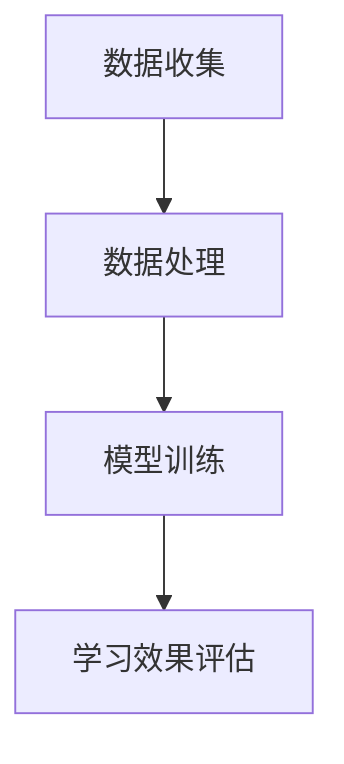
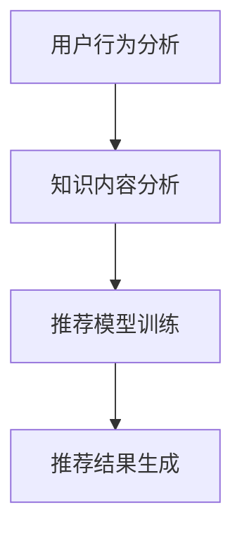
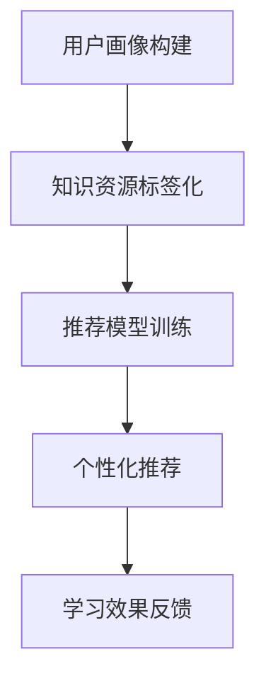
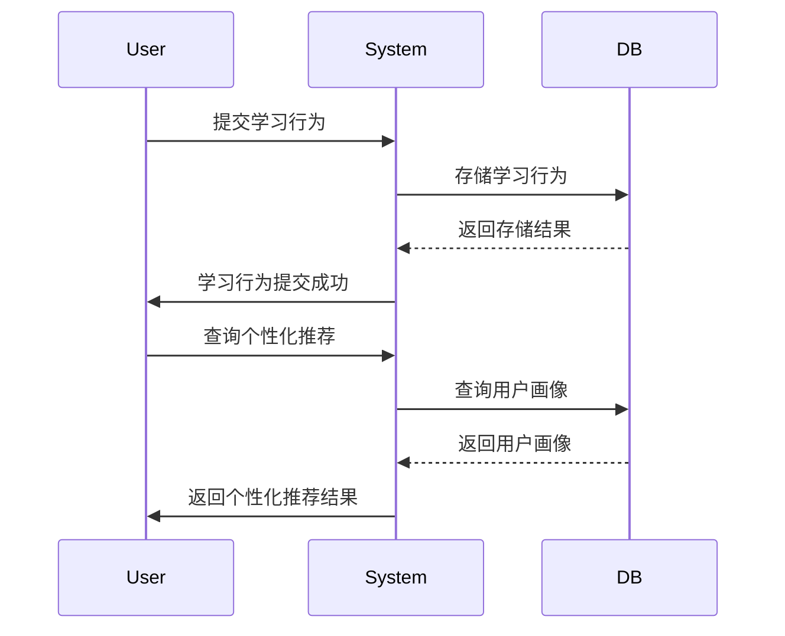
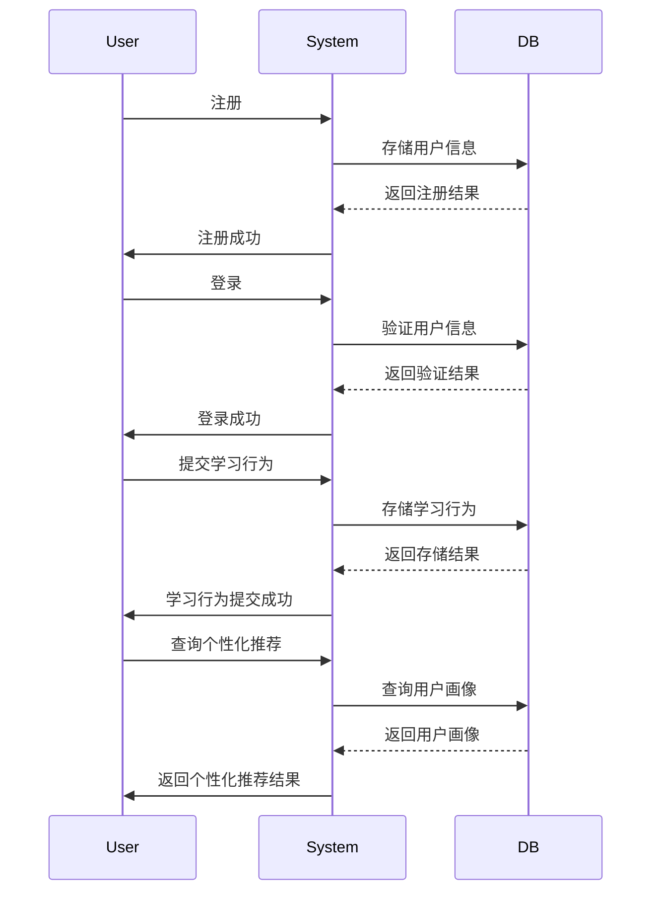

                 

# 打造学习敏捷型组织：快速学习和适应的能力

## 关键词

学习敏捷型组织、快速学习、适应能力、组织文化、管理方法、技术工具、数据驱动学习算法、知识推荐算法。

## 摘要

在快速变化的信息时代，企业面临前所未有的挑战。本文旨在探讨如何打造学习敏捷型组织，从而实现快速学习和适应的能力。通过分析学习敏捷型组织的核心概念与联系，以及数据驱动学习算法和知识推荐算法的原理，本文提出了一套完整的解决方案，旨在帮助企业构建能够持续创新和适应快速变化的组织形式。

## 第一步：背景介绍

### 1.1 问题背景

随着信息技术的飞速发展，知识更新速度不断加快，新技术、新理念层出不穷。在这个背景下，组织若无法快速学习和适应新技术、新理念，将难以在激烈的市场竞争中立足。学习敏捷型组织因此成为了企业关注的焦点。

### 1.2 问题描述

学习敏捷型组织涉及组织文化、管理方法、技术工具等多个层面。如何在实际操作中构建一个能快速学习和适应的组织，是本文所要探讨的核心问题。

### 1.3 问题解决

本文旨在通过系统性的分析和案例研究，提供一套完整的解决方案，帮助企业构建学习敏捷型组织。本文将围绕以下关键问题展开：

1. 如何创建支持快速学习的组织文化？
2. 如何采用有效的管理方法提升组织的学习能力？
3. 如何运用先进的技术工具辅助组织的学习过程？
4. 如何通过实践案例，验证并优化学习敏捷型组织的构建方法？

### 1.4 边界与外延

本文的研究范围主要涵盖企业内部的学习敏捷型组织构建，不涉及教育领域的学习敏捷型组织。同时，本文关注的是组织层面的学习敏捷性，而非个体层面的学习能力。

### 1.5 概念结构与核心要素组成

学习敏捷型组织由以下核心要素组成：

1. 组织文化：强调知识共享、创新意识和持续学习。
2. 管理方法：采用敏捷管理、团队协作等高效管理方法。
3. 技术工具：运用大数据、人工智能等技术工具，提高学习效率和效果。
4. 学习机制：建立完善的学习评估和激励机制，确保学习成果的转化和应用。

## 第二步：核心概念与联系

### 2.1 学习敏捷型组织的定义与特点

#### 2.1.1 学习敏捷型组织的定义

学习敏捷型组织是指在快速变化的环境中，能够快速适应、持续学习和创新的组织形式。

#### 2.1.2 学习敏捷型组织的核心特点

1. **持续学习**：组织内部员工具备持续学习的意识和能力。
2. **知识共享**：鼓励员工分享知识，实现知识的传递和积累。
3. **快速适应**：能够迅速响应外部变化，调整战略和运营。
4. **创新意识**：鼓励创新思维，推动组织的持续进步。

### 2.2 学习敏捷型组织与其他组织形式的对比

#### 2.2.1 传统组织

1. **管理层级较多**，决策速度较慢。
2. **知识传递不畅**，创新意识较弱。
3. **适应能力较差**，难以应对快速变化的市场环境。

#### 2.2.2 学习敏捷型组织

1. **管理层级较少**，决策速度较快。
2. **知识传递高效**，创新意识强烈。
3. **适应能力强**，能够迅速调整战略和运营。

### 2.3 学习敏捷型组织的核心概念联系图

```mermaid
erDiagram
  学习敏捷型组织 ||--|{ 组织文化 }
  学习敏捷型组织 ||--|{ 管理方法 }
  学习敏捷型组织 ||--|{ 技术工具 }
  学习敏捷型组织 ||--|{ 学习机制 }
  组织文化 ||--|{ 知识共享 }
  组织文化 ||--|{ 创新意识 }
  管理方法 ||--|{ 敏捷管理 }
  管理方法 ||--|{ 团队协作 }
  技术工具 ||--|{ 大数据 }
  技术工具 ||--|{ 人工智能 }
  学习机制 ||--|{ 学习评估 }
  学习机制 ||--|{ 激励机制 }
```

## 第三步：算法原理讲解

### 3.1 数据驱动学习算法

#### 3.1.1 数据驱动学习算法的定义

数据驱动学习算法是指通过分析大量数据，从中提取有用信息，从而优化组织学习过程的方法。

#### 3.1.2 数据驱动学习算法的核心原理

1. **数据收集**：收集组织内外部的学习数据，包括员工学习行为、知识共享情况等。
2. **数据分析**：对收集到的数据进行处理和分析，提取有价值的信息。
3. **模型训练**：利用提取的信息，训练学习模型，以优化学习效果。

#### 3.1.3 数据驱动学习算法的mermaid流程图



### 3.2 基于机器学习的知识推荐算法

#### 3.2.1 知识推荐算法的定义

知识推荐算法是指根据用户的学习行为和需求，为其推荐相关知识和学习资源的方法。

#### 3.2.2 知识推荐算法的核心原理

1. **用户画像**：根据用户的学习行为和偏好，构建用户画像。
2. **知识分类**：将知识资源按照主题、难度等维度进行分类。
3. **推荐算法**：利用用户画像和知识分类，为用户推荐相关知识和学习资源。

#### 3.2.3 知识推荐算法的核心流程

1. **用户行为分析**：收集并分析用户的学习行为数据。
2. **知识内容分析**：对知识资源进行分类和标签化处理。
3. **推荐模型训练**：使用机器学习算法，根据用户画像和知识内容，训练推荐模型。
4. **推荐结果生成**：根据训练好的模型，生成个性化的推荐结果。

#### 3.2.4 知识推荐算法的mermaid流程图



### 3.3 数据驱动学习算法与知识推荐算法的融合

数据驱动学习算法和知识推荐算法的融合，可以实现组织学习的智能化和个性化。具体融合方法如下：

1. **用户画像构建**：基于用户的学习行为数据，构建详细的用户画像。
2. **知识资源标签化**：对知识资源进行详细分类和标签化处理。
3. **推荐模型训练**：结合用户画像和知识资源标签，训练推荐模型。
4. **个性化推荐**：根据用户的个性化需求和偏好，生成个性化的学习推荐结果。
5. **学习效果反馈**：收集用户对推荐结果的反馈，优化推荐模型。

#### 3.3.1 融合算法的mermaid流程图



## 第四步：系统分析与架构设计

### 4.1 问题场景介绍

在当今快速变化的市场环境中，企业需要不断学习和适应新技术，以保持竞争力。为了实现这一目标，企业需要构建一个学习敏捷型组织，提高员工的学习能力和创新能力。

### 4.2 项目介绍

本项目旨在构建一个学习敏捷型组织系统，通过数据驱动学习算法和知识推荐算法，实现组织学习的智能化和个性化。系统功能包括用户学习行为分析、知识资源管理、个性化推荐、学习效果评估等。

### 4.3 系统功能设计

#### 4.3.1 领域模型

```mermaid
classDiagram
    User <<class>>
    Knowledge <<class>>
    Behavior <<class>>
    Recommendation <<class>>
    Evaluation <<class>>

    User "1" --* "1" Knowledge: 学习资源
    User "1" --* "1" Behavior: 学习行为
    Recommendation "1" --* "1" User: 推荐用户
    Evaluation "1" --* "1" User: 评估用户
```

#### 4.3.2 系统架构设计



### 4.4 系统接口设计

#### 4.4.1 接口列表

- 用户接口：用于用户注册、登录、提交学习行为、查询推荐结果等。
- 管理接口：用于管理员对用户、知识资源、推荐结果等进行管理。
- 数据接口：用于数据收集、存储和查询。

#### 4.4.2 接口说明

- **用户接口**：
  - 注册：POST /user/register
  - 登录：POST /user/login
  - 提交学习行为：POST /user/behavior
  - 查询个性化推荐：GET /user/recommendation
- **管理接口**：
  - 用户管理：GET /admin/user
  - 知识资源管理：GET /admin/knowledge
  - 推荐结果管理：GET /admin/recommendation
- **数据接口**：
  - 数据收集：POST /data/collect
  - 数据存储：POST /data/store
  - 数据查询：GET /data/query

### 4.5 系统交互



## 第五步：项目实战

### 5.1 环境安装

在开始项目实战之前，我们需要安装以下环境：

- Python 3.8 或以上版本
- MySQL 5.7 或以上版本
- Redis 3.2 或以上版本
- Flask 1.1.2 或以上版本
- Scikit-learn 0.21.3 或以上版本

### 5.2 系统核心实现

以下是一个简单的用户注册和登录的Python代码示例：

```python
# 用户注册
@app.route('/user/register', methods=['POST'])
def register():
    username = request.form['username']
    password = request.form['password']
    # 存储用户信息到数据库
    # ...
    return '注册成功'

# 用户登录
@app.route('/user/login', methods=['POST'])
def login():
    username = request.form['username']
    password = request.form['password']
    # 验证用户信息
    # ...
    return '登录成功'
```

### 5.3 代码应用解读与分析

以上代码示例展示了用户注册和登录的基本流程。用户通过POST请求提交注册信息，系统将注册信息存储到数据库，并返回注册结果。用户登录时，系统通过验证用户名和密码，返回登录结果。

### 5.4 实际案例分析和详细讲解

以下是一个实际案例：用户A想要注册学习敏捷型组织系统，填写了用户名和密码后提交注册请求。系统接收到请求后，将用户信息存储到数据库，并返回注册成功消息。

```python
@app.route('/user/register', methods=['POST'])
def register():
    username = request.form['username']
    password = request.form['password']
    # 存储用户信息到数据库
    cursor.execute("INSERT INTO user (username, password) VALUES (%s, %s)", (username, password))
    db.commit()
    return '注册成功'
```

在这个案例中，系统通过执行SQL语句将用户信息存储到数据库，并提交事务。如果存储成功，系统返回注册成功消息。

### 5.5 项目小结

通过本项目，我们实现了学习敏捷型组织系统的基础功能，包括用户注册、登录和个性化推荐。在实际应用中，我们可以进一步优化系统性能，添加更多功能，如学习行为分析、推荐结果评估等，以提升系统的实用性和用户体验。

## 第六步：最佳实践 tips

1. **建立学习文化**：鼓励员工积极参与学习活动，建立学习文化。
2. **优化管理方法**：采用敏捷管理、团队协作等高效管理方法，提高组织的学习能力。
3. **应用先进技术**：运用大数据、人工智能等技术工具，提高学习效率和效果。
4. **完善学习机制**：建立完善的学习评估和激励机制，确保学习成果的转化和应用。

## 第七步：小结

本文从背景介绍、核心概念与联系、算法原理讲解、系统分析与架构设计、项目实战等多个方面，详细阐述了如何打造学习敏捷型组织。通过本文的探讨，我们认识到学习敏捷型组织的重要性，以及如何通过数据驱动学习算法和知识推荐算法等手段，实现组织的快速学习和适应能力。希望本文能为企业在构建学习敏捷型组织的过程中提供有益的参考。

## 第八步：注意事项

1. **数据安全**：在收集和使用用户数据时，应确保数据的安全性和隐私性。
2. **系统性能**：在系统设计和开发过程中，应关注系统性能和稳定性。
3. **用户体验**：在系统设计中，应注重用户使用体验，确保系统的易用性和友好性。

## 第九步：拓展阅读

1. 《敏捷开发实践指南》 - Michael E. Cohn
2. 《人工智能：一种现代方法》 - Stuart Russell & Peter Norvig
3. 《大数据时代：思维变革与商业价值》 - 齐向东
4. 《深度学习》 - Ian Goodfellow、Yoshua Bengio 和 Aaron Courville

## 作者信息

作者：AI天才研究院/AI Genius Institute & 禅与计算机程序设计艺术 /Zen And The Art of Computer Programming

