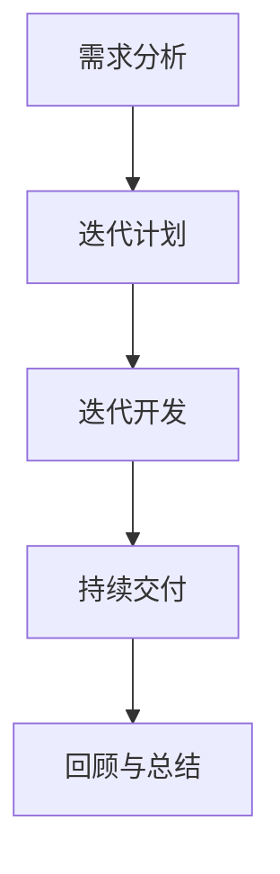
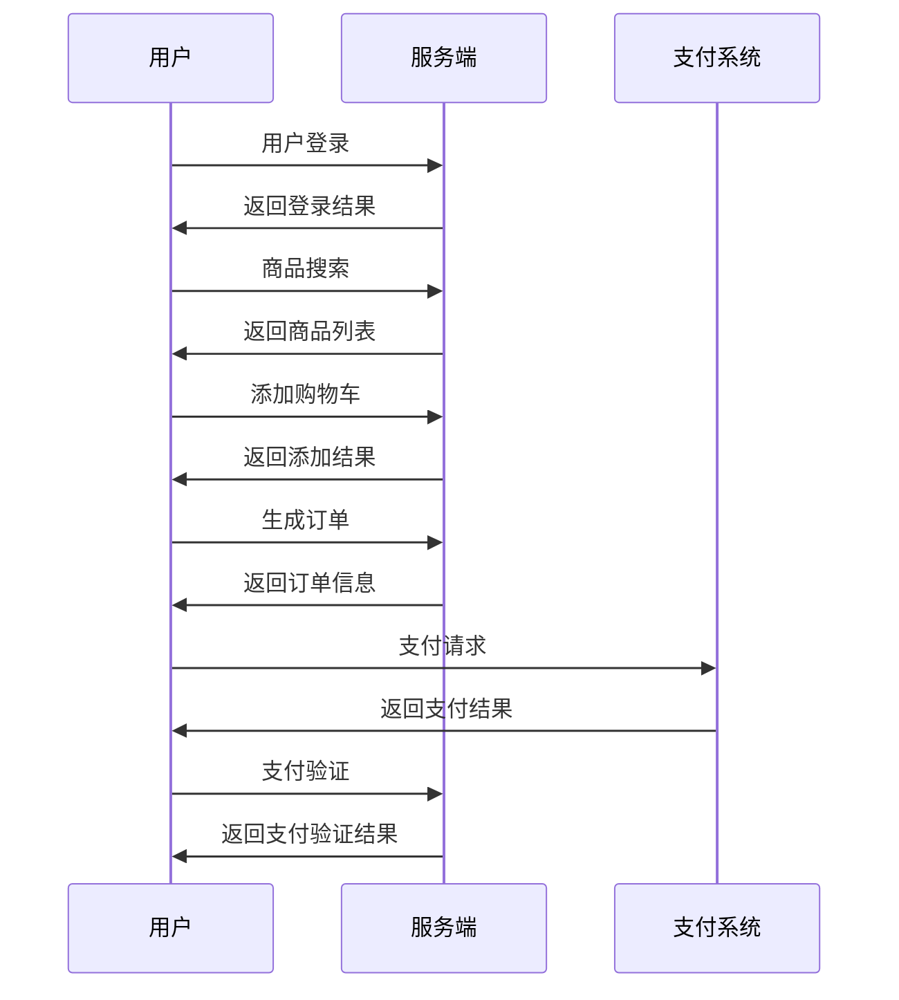
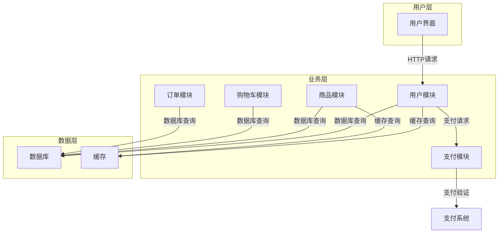

                 


# 打造敏捷组织：快速响应市场变化

> 关键词：敏捷组织、市场响应、敏捷流程、项目管理、系统架构、项目实战

> 摘要：本文将深入探讨如何打造敏捷组织，以快速响应市场变化。通过分析敏捷组织的核心概念、算法原理、系统分析与架构设计以及实际项目案例，本文将为读者提供一套完整的敏捷组织构建指南，帮助企业在激烈的市场竞争中脱颖而出。

## 目录大纲设计方案

### 1. 设计思路

为了确保书籍《打造敏捷组织：快速响应市场变化》的目录大纲具有逻辑性和内容完整性，我们将从以下几个方面进行设计：

- **背景介绍**：在第一部分，简要介绍打造敏捷组织的背景，包括市场环境的变化、组织面临的挑战等。
- **核心概念与联系**：在第二部分，详细阐述敏捷组织的核心概念，包括敏捷、敏捷流程、敏捷原则等，并通过属性特征对比表格和ER实体关系图展示概念之间的关系。
- **算法原理讲解**：在第三部分，介绍如何通过敏捷方法提升组织效率，包括敏捷项目管理、敏捷开发等，通过mermaid流程图和Python源代码详细讲解算法原理。
- **数学模型和数学公式**：在第四部分，用latex格式展示敏捷方法背后的数学模型和公式，并进行详细讲解和举例说明。
- **系统分析与架构设计**：在第五部分，介绍敏捷组织系统分析方法和架构设计，包括领域模型类图、系统架构图、系统接口设计和系统交互序列图。
- **项目实战**：在第六部分，通过实际案例展示如何打造敏捷组织，包括环境安装、系统核心实现源代码以及案例分析和详细讲解。
- **最佳实践与总结**：在第七部分，提供打造敏捷组织的最佳实践建议、小结、注意事项和拓展阅读。

### 2. 目录大纲结构

下面是根据上述设计思路设计的目录大纲：

## 第一部分：背景介绍

## 第1章：市场环境的变化与组织挑战

## 第2章：敏捷组织的核心概念

## 第二部分：核心概念与联系

## 第3章：敏捷与敏捷流程

## 第4章：敏捷原则与实践

## 第5章：敏捷组织的特点与优势

## 第三部分：算法原理讲解

## 第6章：敏捷项目管理

## 第7章：敏捷开发方法

## 第8章：敏捷组织效率提升原理

## 第四部分：数学模型和数学公式

## 第9章：敏捷方法的数学模型

## 第10章：敏捷公式与计算方法

## 第五部分：系统分析与架构设计

## 第11章：敏捷组织系统分析

## 第12章：敏捷组织架构设计

## 第13章：系统接口设计与交互

## 第六部分：项目实战

## 第14章：敏捷组织项目启动

## 第15章：系统核心实现与代码分析

## 第16章：实际案例分析

## 第七部分：最佳实践与总结

## 第17章：打造敏捷组织的最佳实践

## 第18章：小结与注意事项

## 第19章：拓展阅读与资源推荐

### 3. 目录大纲示例

```markdown
## 第一部分：背景介绍

### 第1章：市场环境的变化与组织挑战
- **1.1** 问题背景
  - 市场变化
  - 组织面临的问题
- **1.2** 问题描述
  - 缺乏敏捷性
  - 反应迟缓
- **1.3** 问题解决
  - 引入敏捷方法
  - 提升组织响应能力
- **1.4** 边界与外延
  - 敏捷组织的定义
  - 敏捷方法的应用范围

### 第2章：敏捷组织的核心概念
- **2.1** 敏捷
  - **2.1.1** 敏捷的定义
  - **2.1.2** 敏捷的核心原则
  - **2.1.3** 敏捷的优势
- **2.2** 敏捷流程
  - **2.2.1** 敏捷开发流程
  - **2.2.2** 敏捷迭代方法
  - **2.2.3** 敏捷与传统的区别
- **2.3** 敏捷原则与实践
  - **2.3.1** 敏捷原则概述
  - **2.3.2** 敏捷实践案例

## 第二部分：核心概念与联系

### 第3章：敏捷与敏捷流程
- **3.1** 敏捷的核心概念
  - **3.1.1** 敏捷的定义与特点
  - **3.1.2** 敏捷的属性特征对比表格
- **3.2** 敏捷流程
  - **3.2.1** 敏捷开发流程概述
  - **3.2.2** 敏捷流程图（使用mermaid）

### 第4章：敏捷原则与实践
- **4.1** 敏捷原则
  - **4.1.1** 敏捷原则列表
  - **4.1.2** 敏捷原则详解
- **4.2** 敏捷实践
  - **4.2.1** 敏捷实践案例
  - **4.2.2** 敏捷实践总结

## 第三部分：算法原理讲解

### 第5章：敏捷项目管理
- **5.1** 敏捷项目管理概述
  - **5.1.1** 敏捷项目管理定义
  - **5.1.2** 敏捷项目管理方法
- **5.2** 敏捷项目管理流程
  - **5.2.1** 敏捷迭代流程
  - **5.2.2** 敏捷需求管理

### 第6章：敏捷开发方法
- **6.1** 敏捷开发概述
  - **6.1.1** 敏捷开发定义
  - **6.1.2** 敏捷开发流程
  - **6.1.3** 敏捷开发与瀑布开发的区别
----------------------------------------------------------------

### 1.1 问题背景

在当今快速变化的市场环境中，企业面临着前所未有的挑战。市场需求的不断变化、技术的迅速发展以及竞争的加剧，使得传统的组织结构和管理模式越来越难以适应。传统的组织往往以垂直结构和层次分明的管理方式为主，这种结构使得信息传递缓慢、决策过程复杂，导致组织难以快速响应市场变化。

#### 1.1.1 市场变化

市场的变化速度越来越快，消费者的需求也在不断变化。在这样一个快速变化的环境中，企业需要具备快速适应和调整的能力，以便抓住市场机遇。然而，传统的组织结构往往过于僵化，难以快速调整资源、优化流程，从而错失市场机会。

#### 1.1.2 组织面临的挑战

- **决策缓慢**：在传统的组织结构中，决策往往需要经过多个层级的管理者，导致决策过程缓慢，无法及时响应市场变化。
- **信息传递不畅**：信息在组织内部的传递过程繁琐，容易导致信息失真或延误，从而影响组织的决策和执行。
- **缺乏灵活性**：传统的组织结构缺乏灵活性，难以适应市场的快速变化，导致组织在竞争中处于劣势。

### 1.2 问题描述

敏捷组织旨在解决上述问题，通过引入敏捷方法，提升组织的敏捷性，使其能够快速响应市场变化。然而，如何在组织中实现敏捷性，仍然是许多企业面临的挑战。

#### 1.2.1 缺乏敏捷性

- **流程僵化**：传统的流程设计过于复杂，使得组织难以快速响应市场变化。
- **组织反应迟缓**：组织内部的信息传递和决策过程缓慢，导致组织无法及时调整策略和资源。
- **缺乏适应性**：组织难以适应市场环境的变化，导致在竞争中处于劣势。

#### 1.2.2 反应迟缓

- **决策过程复杂**：在传统的组织结构中，决策需要经过多个层级的管理者，导致决策过程复杂、耗时。
- **信息传递缓慢**：信息在组织内部的传递过程繁琐，容易导致信息失真或延误，从而影响组织的决策和执行。

### 1.3 问题解决

为了解决上述问题，企业需要引入敏捷方法，打造敏捷组织。敏捷方法强调快速迭代、持续改进，通过简化流程、提高信息传递效率，使组织能够快速响应市场变化。

#### 1.3.1 引入敏捷方法

- **简化流程**：通过简化流程，减少不必要的步骤，提高工作效率。
- **提高信息传递效率**：通过建立高效的信息传递渠道，确保信息能够快速、准确地在组织内部传递。
- **快速迭代**：通过不断迭代，快速调整策略和资源，以适应市场变化。

#### 1.3.2 提升组织响应能力

- **培养敏捷思维**：通过培训和教育，提高员工的敏捷思维能力，使其能够快速适应市场变化。
- **建立敏捷团队**：通过建立敏捷团队，提高组织内部协作效率，使组织能够快速响应市场变化。

### 1.4 边界与外延

#### 1.4.1 敏捷组织的定义

敏捷组织是指一种以客户需求为导向、以快速迭代和持续改进为核心理念的组织形式。敏捷组织强调团队的协作、快速响应市场变化，以及持续优化工作流程。

#### 1.4.2 敏捷方法的应用范围

敏捷方法可以应用于软件开发、产品管理、市场营销等多个领域。通过引入敏捷方法，企业可以提升组织的敏捷性，提高市场竞争力。

### 1.5 总结

本文介绍了打造敏捷组织的背景、核心概念、算法原理、系统分析与架构设计以及实际项目案例。通过本文的阅读，读者将了解如何构建敏捷组织，以快速响应市场变化，从而在激烈的市场竞争中脱颖而出。

----------------------------------------------------------------

## 第二部分：核心概念与联系

### 第3章：敏捷与敏捷流程

#### 3.1 敏捷的核心概念

敏捷（Agile）是一种以客户需求为导向、以快速迭代和持续改进为核心理念的方法论。它强调团队的协作、快速响应市场变化，以及持续优化工作流程。敏捷方法最早起源于软件开发领域，但随后被广泛应用于其他领域，如产品管理、市场营销等。

#### 3.1.1 敏捷的定义

敏捷是一种注重敏捷性和适应性的软件开发方法。它通过缩短开发周期、快速迭代和持续改进，使团队能够更好地适应需求变化，提高产品质量。

#### 3.1.2 敏捷的核心原则

- **客户价值优先**：始终关注客户需求，确保开发的产品能够满足客户需求。
- **持续交付**：通过不断交付可工作的软件，保持与客户的互动和反馈。
- **迭代开发**：将开发过程划分为多个迭代周期，每个迭代周期结束后进行评估和改进。
- **团队协作**：鼓励团队成员之间的协作和沟通，以提高工作效率。
- **灵活适应变化**：在开发过程中，及时调整计划和策略，以应对需求变化。

#### 3.1.3 敏捷的优势

- **提高产品质量**：通过快速迭代和持续改进，团队能够及时发现问题并进行修复，从而提高产品质量。
- **提高客户满意度**：与客户保持密切互动，确保开发的产品能够满足客户需求，提高客户满意度。
- **提高团队协作效率**：鼓励团队成员之间的协作和沟通，提高工作效率。
- **降低项目风险**：通过不断迭代和反馈，团队能够及时发现和解决潜在问题，降低项目风险。

#### 3.2 敏捷流程

敏捷流程是指一系列用于实现敏捷方法的工作流程。常见的敏捷流程包括Scrum、Kanban、XP（极限编程）等。这些流程各有特点，适用于不同的项目场景。

#### 3.2.1 敏捷开发流程概述

敏捷开发流程通常包括以下几个关键阶段：

1. **需求分析**：团队与客户进行沟通，了解客户需求，并确定项目的目标和范围。
2. **迭代计划**：将项目划分为多个迭代周期，每个迭代周期包含需求分析、设计、开发、测试和交付等环节。
3. **迭代开发**：在迭代周期内，团队按照计划进行开发工作，并定期进行评审和反馈。
4. **持续交付**：将开发完成的软件交付给客户，并收集反馈，以便在下一个迭代周期中进行改进。
5. **回顾与总结**：在每个迭代周期结束后，团队进行回顾和总结，分析问题，提出改进措施。

#### 3.2.2 敏捷流程图（使用mermaid）



#### 3.2.3 敏捷与传统的区别

传统软件开发方法（如瀑布模型）通常遵循固定的开发流程，从需求分析、设计、开发、测试到交付，每个阶段都需要严格按照计划进行。而敏捷方法则更灵活，强调快速迭代和持续改进。

- **流程**：传统方法通常遵循固定的流程，而敏捷方法则根据需求变化进行迭代和调整。
- **时间**：传统方法通常按照固定的时间表进行开发，而敏捷方法则更注重快速响应需求变化。
- **团队协作**：传统方法通常强调个人贡献，而敏捷方法则鼓励团队合作和沟通。
- **风险管理**：传统方法通常在开发完成后进行测试和验收，而敏捷方法则在每个迭代周期结束后进行评估和改进。

### 3.3 敏捷原则与实践

#### 3.3.1 敏捷原则列表

敏捷方法包含了一系列原则，这些原则旨在指导团队进行高效开发。以下是一些核心的敏捷原则：

1. **客户满意度**：客户满意是最高目标。
2. **欢迎变化**：在开发过程中，鼓励团队灵活应对需求变化。
3. **日常沟通**：团队成员之间保持频繁、高效的沟通。
4. **工作软件**：优先交付可工作的软件。
5. **可持续开发**：团队成员应保持稳定的开发速度。
6. **团队成员互信**：团队成员之间建立信任和合作关系。
7. **简洁性**：保持工作环境的简洁，避免不必要的复杂性。
8. **外部反馈**：定期收集外部反馈，以指导开发工作。
9. **技术卓越与良好设计**：追求技术卓越，注重软件质量。
10. **简化流程**：减少不必要的流程，提高工作效率。

#### 3.3.2 敏捷实践案例

以下是一个敏捷实践案例，展示如何在实际项目中应用敏捷方法：

- **项目背景**：一家互联网公司正在开发一款社交媒体应用，项目周期为6个月。
- **敏捷流程**：团队采用了Scrum流程，将项目划分为2周的迭代周期。
- **迭代计划**：在每个迭代周期开始时，团队与产品经理进行需求讨论，确定本次迭代的目标和任务。
- **迭代开发**：团队按照计划进行开发工作，每周进行一次站会，讨论进展和问题。
- **持续交付**：在每个迭代周期结束后，团队将开发完成的模块交付给测试团队进行测试，并将可工作的软件交付给客户进行试用。
- **回顾与总结**：在每个迭代周期结束后，团队进行回顾和总结，分析问题，提出改进措施，并制定下一个迭代周期的计划。

通过这个案例，我们可以看到敏捷方法如何帮助团队快速响应需求变化，提高项目质量和客户满意度。

## 第三部分：算法原理讲解

### 第4章：敏捷项目管理

敏捷项目管理是一种以客户需求为导向、以快速迭代和持续改进为核心理念的管理方法。它旨在通过简化流程、提高信息传递效率和团队协作，使项目能够快速响应市场变化。本节将介绍敏捷项目管理的原理和方法。

#### 4.1 敏捷项目管理概述

敏捷项目管理强调灵活性和适应性，通过缩短开发周期、快速迭代和持续改进，使项目团队能够更好地适应需求变化。与传统的项目管理方法相比，敏捷项目管理更加注重团队协作和客户满意度。

#### 4.1.1 敏捷项目管理的定义

敏捷项目管理是一种以客户需求为导向、以快速迭代和持续改进为核心理念的管理方法。它强调团队协作、信息透明和持续反馈，通过不断调整计划和策略，以适应不断变化的需求。

#### 4.1.2 敏捷项目管理方法

敏捷项目管理方法包括以下几个关键环节：

1. **需求管理**：在敏捷项目管理中，需求管理是关键环节。项目团队与客户紧密合作，确保项目需求得到明确和优先级排序。通过持续的需求收集和分析，团队能够及时调整项目计划和策略。
2. **迭代规划**：敏捷项目管理采用迭代的方式进行项目开发。在每个迭代周期开始时，团队会制定迭代计划，确定本次迭代的目标、任务和资源分配。通过迭代规划，团队能够更好地适应需求变化，提高项目进度和交付质量。
3. **团队协作**：敏捷项目管理强调团队协作和沟通。团队成员之间保持频繁的沟通和协作，共同解决项目中遇到的问题。通过建立信任和合作关系，团队能够更好地协同工作，提高工作效率。
4. **持续交付**：敏捷项目管理强调持续交付可工作的软件。在每个迭代周期结束后，团队将开发完成的模块交付给测试团队进行测试，并将可工作的软件交付给客户进行试用。通过持续交付，团队能够及时收集客户反馈，以便在下一个迭代周期中进行改进。
5. **回顾与总结**：在每个迭代周期结束后，团队进行回顾和总结。通过分析项目中的问题、成功经验和改进机会，团队能够不断提高项目管理水平，优化项目流程。

#### 4.1.3 敏捷项目管理与传统的区别

与传统项目管理方法相比，敏捷项目管理具有以下特点：

1. **迭代与迭代周期**：传统项目管理方法通常采用瀑布模型，将项目分为多个阶段，每个阶段都需要严格按照计划执行。而敏捷项目管理采用迭代的方式，将项目划分为多个迭代周期，每个迭代周期都有明确的目标和任务。
2. **客户参与**：传统项目管理方法通常在项目完成后进行验收，而敏捷项目管理强调客户参与，在每个迭代周期结束后，团队将可工作的软件交付给客户进行试用和反馈。通过持续的客户参与，团队能够更好地满足客户需求。
3. **灵活性**：敏捷项目管理强调灵活性和适应性，通过不断调整计划和策略，以适应需求变化。而传统项目管理方法通常遵循固定的计划和流程，难以应对需求变化。

### 4.2 敏捷项目管理流程

敏捷项目管理流程包括以下关键环节：

1. **项目启动**：在项目启动阶段，团队与客户进行沟通，明确项目目标和范围。团队会制定项目计划，确定项目关键节点和时间表。
2. **需求管理**：在需求管理阶段，团队与客户紧密合作，收集和整理需求。通过优先级排序，团队确定本次迭代的需求。
3. **迭代计划**：在迭代计划阶段，团队制定迭代计划，确定本次迭代的目标、任务和资源分配。团队会召开迭代计划会议，明确任务分工和进度要求。
4. **迭代执行**：在迭代执行阶段，团队按照迭代计划进行开发工作。每周进行一次站会，讨论进展和问题，确保项目按计划进行。
5. **迭代评审**：在迭代评审阶段，团队将开发完成的模块交付给测试团队进行测试，并将可工作的软件交付给客户进行试用和反馈。
6. **回顾与总结**：在回顾与总结阶段，团队进行项目回顾和总结，分析问题、成功经验和改进机会。团队会制定下一个迭代周期的计划，确保项目持续改进。

#### 4.2.1 敏捷迭代流程

敏捷迭代流程通常包括以下步骤：

1. **需求分析**：团队与客户进行沟通，了解客户需求，并确定本次迭代的需求。
2. **迭代计划**：团队制定迭代计划，确定本次迭代的目标、任务和资源分配。
3. **开发**：团队按照迭代计划进行开发工作，编写代码、设计测试用例等。
4. **测试**：测试团队对开发完成的模块进行测试，确保软件质量。
5. **交付**：将可工作的软件交付给客户进行试用和反馈。
6. **评审**：团队对本次迭代进行评审，总结经验和教训，制定下一个迭代周期的计划。

#### 4.2.2 敏捷迭代方法

敏捷迭代方法包括以下几种：

1. **Scrum**：Scrum是一种流行的敏捷迭代方法，它将项目划分为多个迭代周期，每个迭代周期称为一个“冲刺”（Sprint）。在冲刺期间，团队按照计划进行开发工作，并在冲刺结束后进行评审和回顾。
2. **Kanban**：Kanban是一种可视化流程管理方法，它通过看板（Kanban板）来展示项目进度和任务状态。团队根据看板上的任务进行开发工作，确保任务按照优先级有序进行。
3. **XP（极限编程）**：XP是一种强调代码质量、团队协作和持续反馈的敏捷迭代方法。它包括一系列最佳实践，如测试驱动开发、重构、代码审查等。

### 4.3 敏捷项目管理中的关键角色

在敏捷项目管理中，关键角色包括：

1. **产品负责人（Product Owner）**：产品负责人负责确定项目需求和优先级，与客户沟通，确保项目满足客户需求。
2. **Scrum Master**：Scrum Master负责确保团队遵循敏捷流程，协调团队成员之间的沟通和协作，解决项目中遇到的问题。
3. **团队成员**：团队成员负责具体项目的开发工作，按照迭代计划完成任务。

#### 4.3.1 产品负责人

产品负责人是敏捷项目管理中的关键角色，负责以下工作：

- **确定需求**：与客户沟通，了解客户需求，并确定项目的需求和优先级。
- **维护需求清单**：维护项目需求清单，确保需求得到及时更新和优先级排序。
- **与团队协作**：与团队紧密合作，确保项目需求得到准确理解和实施。

#### 4.3.2 Scrum Master

Scrum Master负责以下工作：

- **确保流程**：确保团队遵循敏捷流程，及时发现和解决流程中的问题。
- **促进协作**：促进团队成员之间的协作和沟通，确保项目顺利进行。
- **解决冲突**：在团队内部解决冲突，确保团队保持高效协作。

#### 4.3.3 团队成员

团队成员负责以下工作：

- **完成任务**：按照迭代计划完成任务，确保项目按计划进行。
- **沟通与协作**：与其他团队成员保持沟通和协作，共同解决项目中的问题。
- **持续学习**：不断学习新知识和技能，提高项目开发效率。

### 4.4 敏捷项目管理中的工具和方法

敏捷项目管理中常用的工具和方法包括：

1. **看板（Kanban）**：通过看板可视化项目进度和任务状态，帮助团队更好地管理项目。
2. **用户故事（User Story）**：用户故事是一种描述需求的简洁方式，它将需求转化为用户可以理解的语言。
3. **故事点（Story Point）**：故事点是一种用于衡量任务复杂度的指标，它帮助团队进行任务分配和进度评估。
4. **迭代计划会议（Sprint Planning Meeting）**：迭代计划会议是团队制定迭代计划的会议，它帮助团队明确本次迭代的目标和任务。
5. **回顾会议（Retrospective Meeting）**：回顾会议是团队总结经验和教训的会议，它帮助团队持续改进项目管理流程。

通过以上工具和方法，敏捷项目管理团队能够更好地管理项目，提高项目质量和客户满意度。

## 第5章：敏捷开发方法

敏捷开发方法是一种以客户需求为导向、以快速迭代和持续改进为核心理念的软件开发方法。它强调团队协作、快速响应需求变化、提高软件质量，以实现持续交付可工作的软件。本节将详细介绍敏捷开发方法的基本原理、流程和最佳实践。

### 5.1 敏捷开发概述

敏捷开发起源于软件开发领域，最早由XP（极限编程）和Scrum等方法提出。敏捷开发方法主张通过简化流程、缩短开发周期、提高团队协作和灵活性，使团队能够更好地适应不断变化的需求。

#### 5.1.1 敏捷开发的定义

敏捷开发是一种以客户需求为导向、以快速迭代和持续改进为核心理念的软件开发方法。它强调团队协作、快速响应需求变化、提高软件质量，以实现持续交付可工作的软件。

#### 5.1.2 敏捷开发的核心原则

敏捷开发方法包含了一系列核心原则，这些原则指导团队进行高效开发：

1. **客户满意度**：始终关注客户满意度，确保开发的产品能够满足客户需求。
2. **持续交付**：通过不断交付可工作的软件，保持与客户的互动和反馈。
3. **迭代开发**：将开发过程划分为多个迭代周期，每个迭代周期都有明确的目标和任务。
4. **团队协作**：鼓励团队成员之间的协作和沟通，以提高工作效率。
5. **灵活适应变化**：在开发过程中，及时调整计划和策略，以应对需求变化。
6. **工作软件**：将工作软件作为衡量项目进度和质量的唯一标准。
7. **可持续开发**：确保团队成员能够在不降低工作质量的情况下，保持稳定的开发速度。

#### 5.1.3 敏捷开发的优势

敏捷开发方法具有以下优势：

1. **提高产品质量**：通过快速迭代和持续改进，团队能够及时发现和解决问题，提高软件质量。
2. **提高客户满意度**：与客户保持密切互动，确保开发的产品能够满足客户需求，提高客户满意度。
3. **提高团队协作效率**：鼓励团队成员之间的协作和沟通，提高工作效率。
4. **降低项目风险**：通过不断迭代和反馈，团队能够及时发现和解决潜在问题，降低项目风险。
5. **快速响应需求变化**：敏捷开发方法强调灵活性，能够快速适应需求变化，抓住市场机会。

### 5.2 敏捷开发流程

敏捷开发流程通常包括以下几个关键环节：

1. **需求收集**：与客户沟通，了解客户需求，并确定项目的需求和优先级。
2. **迭代规划**：团队根据需求收集结果，制定迭代计划，确定本次迭代的目标、任务和资源分配。
3. **迭代执行**：团队按照迭代计划进行开发工作，编写代码、设计测试用例等。
4. **迭代评审**：在每个迭代周期结束后，团队对开发完成的模块进行评审，确保软件质量。
5. **回顾与总结**：团队进行回顾和总结，分析问题、成功经验和改进机会，为下一个迭代周期做好准备。

#### 5.2.1 敏捷迭代流程

敏捷迭代流程通常包括以下步骤：

1. **需求分析**：团队与客户进行沟通，了解客户需求，并确定本次迭代的需求。
2. **迭代计划**：团队制定迭代计划，确定本次迭代的目标、任务和资源分配。
3. **开发**：团队按照迭代计划进行开发工作，编写代码、设计测试用例等。
4. **测试**：测试团队对开发完成的模块进行测试，确保软件质量。
5. **交付**：将可工作的软件交付给客户进行试用和反馈。
6. **评审**：团队对本次迭代进行评审，总结经验和教训，制定下一个迭代周期的计划。

#### 5.2.2 敏捷迭代方法

敏捷迭代方法包括以下几种：

1. **Scrum**：Scrum是一种流行的敏捷迭代方法，它将项目划分为多个迭代周期，每个迭代周期称为一个“冲刺”（Sprint）。在冲刺期间，团队按照计划进行开发工作，并在冲刺结束后进行评审和回顾。
2. **Kanban**：Kanban是一种可视化流程管理方法，它通过看板（Kanban板）来展示项目进度和任务状态。团队根据看板上的任务进行开发工作，确保任务按照优先级有序进行。
3. **XP（极限编程）**：XP是一种强调代码质量、团队协作和持续反馈的敏捷迭代方法。它包括一系列最佳实践，如测试驱动开发、重构、代码审查等。

### 5.3 敏捷开发中的关键角色

在敏捷开发中，关键角色包括：

1. **产品负责人（Product Owner）**：产品负责人负责确定项目需求和优先级，与客户沟通，确保项目满足客户需求。
2. **Scrum Master**：Scrum Master负责确保团队遵循敏捷流程，协调团队成员之间的沟通和协作，解决项目中遇到的问题。
3. **团队成员**：团队成员负责具体项目的开发工作，按照迭代计划完成任务。

#### 5.3.1 产品负责人

产品负责人是敏捷开发中的关键角色，负责以下工作：

- **确定需求**：与客户沟通，了解客户需求，并确定项目的需求和优先级。
- **维护需求清单**：维护项目需求清单，确保需求得到及时更新和优先级排序。
- **与团队协作**：与团队紧密合作，确保项目需求得到准确理解和实施。

#### 5.3.2 Scrum Master

Scrum Master负责以下工作：

- **确保流程**：确保团队遵循敏捷流程，及时发现和解决流程中的问题。
- **促进协作**：促进团队成员之间的协作和沟通，确保项目顺利进行。
- **解决冲突**：在团队内部解决冲突，确保团队保持高效协作。

#### 5.3.3 团队成员

团队成员负责以下工作：

- **完成任务**：按照迭代计划完成任务，确保项目按计划进行。
- **沟通与协作**：与其他团队成员保持沟通和协作，共同解决项目中的问题。
- **持续学习**：不断学习新知识和技能，提高项目开发效率。

### 5.4 敏捷开发中的工具和方法

敏捷开发中常用的工具和方法包括：

1. **用户故事（User Story）**：用户故事是一种描述需求的简洁方式，它将需求转化为用户可以理解的语言。
2. **故事点（Story Point）**：故事点是一种用于衡量任务复杂度的指标，它帮助团队进行任务分配和进度评估。
3. **迭代计划会议（Sprint Planning Meeting）**：迭代计划会议是团队制定迭代计划的会议，它帮助团队明确本次迭代的目标和任务。
4. **回顾会议（Retrospective Meeting）**：回顾会议是团队总结经验和教训的会议，它帮助团队持续改进项目管理流程。
5. **看板（Kanban）**：通过看板可视化项目进度和任务状态，帮助团队更好地管理项目。

### 5.5 敏捷开发的最佳实践

以下是一些敏捷开发的最佳实践：

1. **持续集成**：通过持续集成，确保代码质量和项目进度，及时发现和解决问题。
2. **自动化测试**：通过自动化测试，提高测试效率和软件质量。
3. **每日站会**：通过每日站会，确保团队成员之间的沟通和协作，及时解决项目中遇到的问题。
4. **用户故事地图**：通过用户故事地图，明确项目的用户需求和优先级，指导开发工作。
5. **持续学习**：鼓励团队成员不断学习和掌握新技术和最佳实践，提高团队整体能力。

通过以上最佳实践，敏捷开发团队能够更好地应对需求变化，提高软件质量和客户满意度。

### 5.6 敏捷开发与瀑布开发的对比

#### 5.6.1 定义

- **敏捷开发**：敏捷开发是一种以快速迭代、持续改进和客户满意度为导向的软件开发方法。
- **瀑布开发**：瀑布开发是一种传统的软件开发方法，它遵循固定的开发流程，从需求分析、设计、开发、测试到交付，每个阶段都需要严格按照计划执行。

#### 5.6.2 差异

1. **流程**：敏捷开发采用迭代的方式进行开发，每个迭代周期都有明确的目标和任务。瀑布开发则按照固定的流程进行，每个阶段都需要严格按照计划执行。
2. **时间**：敏捷开发注重快速响应需求变化，每个迭代周期通常较短。瀑布开发则按照固定的时间表进行，项目周期通常较长。
3. **团队协作**：敏捷开发强调团队合作和沟通，团队成员之间保持密切互动。瀑布开发则更多强调个人贡献和阶段性的工作成果。
4. **风险管理**：敏捷开发通过不断迭代和反馈，能够及时发现和解决问题，降低项目风险。瀑布开发则在项目完成后进行测试和验收，项目风险较高。
5. **灵活性**：敏捷开发强调灵活性和适应性，能够快速调整计划和策略。瀑布开发则较为僵化，难以应对需求变化。

#### 5.6.3 优势

1. **敏捷开发**：
   - **快速响应需求变化**：通过迭代和反馈，团队能够快速适应需求变化，提高项目成功率。
   - **提高客户满意度**：与客户保持密切互动，确保开发的产品能够满足客户需求。
   - **提高软件质量**：通过持续集成和自动化测试，提高代码质量和项目进度。
2. **瀑布开发**：
   - **流程清晰**：按照固定的流程进行，项目阶段明确，便于管理。
   - **风险可控**：项目完成后进行测试和验收，项目风险较低。

### 5.7 敏捷开发的应用场景

敏捷开发适用于以下场景：

1. **需求变化频繁**：在需求变化频繁的项目中，敏捷开发能够快速响应需求变化，提高项目成功率。
2. **产品迭代周期短**：在产品迭代周期较短的项目中，敏捷开发能够缩短开发周期，提高客户满意度。
3. **高复杂度项目**：在高复杂度的项目中，敏捷开发能够通过迭代和反馈，降低项目风险。
4. **团队合作紧密**：在团队合作紧密的项目中，敏捷开发能够促进团队成员之间的协作和沟通。

通过以上分析，我们可以看到敏捷开发方法在应对需求变化、提高客户满意度、降低项目风险等方面具有明显优势。在实际项目中，应根据项目特点和需求，灵活应用敏捷开发方法，以实现高效开发。

## 第四部分：数学模型和数学公式

### 第6章：敏捷方法的数学模型

敏捷方法在软件工程中扮演了关键角色，其背后的数学模型和公式有助于理解其运作原理。在本节中，我们将探讨敏捷方法的一些基础数学模型和公式，并通过具体的示例来说明它们的应用。

#### 6.1 敏捷方法的数学模型概述

敏捷方法的数学模型主要涉及以下几个方面：

1. **工作量评估模型**：用于评估任务所需的工作量。
2. **迭代效率模型**：用于计算迭代周期内的效率。
3. **风险管理模型**：用于评估项目风险。
4. **成本效益模型**：用于计算敏捷方法的成本效益。

#### 6.2 工作量评估模型

工作量评估是敏捷开发中的关键环节。常见的工作量评估模型包括：

1. **故事点（Story Points）**：故事点是一种用于衡量任务复杂度的指标。通常，任务越复杂，所需的故事点就越多。故事点的计算公式如下：

   $$SP = C \times T$$

   其中，$SP$ 是故事点，$C$ 是任务复杂性系数，$T$ 是任务所需的时间。

2. **任务点（Task Points）**：任务点是一种用于衡量任务完成所需时间的指标。任务点的计算公式如下：

   $$TP = C \times T$$

   其中，$TP$ 是任务点，$C$ 是任务复杂度系数，$T$ 是任务所需的时间。

#### 6.3 迭代效率模型

迭代效率模型用于计算迭代周期内的效率。常见的迭代效率模型包括：

1. **迭代周期效率（Sprint Efficiency）**：迭代周期效率是指在一个迭代周期内，团队实际完成的工作量与计划工作量之间的比率。迭代周期效率的计算公式如下：

   $$E = \frac{Actual Work}{Planned Work} \times 100\%$$

   其中，$E$ 是迭代周期效率，$Actual Work$ 是实际完成的工作量，$Planned Work$ 是计划工作量。

2. **迭代进度（Sprint Progress）**：迭代进度是指在一个迭代周期内，团队所完成的任务数量与总任务数量之间的比率。迭代进度的计算公式如下：

   $$P = \frac{Completed Tasks}{Total Tasks} \times 100\%$$

   其中，$P$ 是迭代进度，$Completed Tasks$ 是已完成的任务数量，$Total Tasks$ 是总任务数量。

#### 6.4 风险管理模型

敏捷开发中的风险管理模型用于评估项目风险。常见的方法包括：

1. **风险矩阵（Risk Matrix）**：风险矩阵是一种用于评估风险概率和影响的方法。它通常通过以下公式来计算风险得分：

   $$Risk Score = Probability \times Impact$$

   其中，$Risk Score$ 是风险得分，$Probability$ 是风险发生的概率，$Impact$ 是风险发生的影响。

2. **蒙特卡洛模拟（Monte Carlo Simulation）**：蒙特卡洛模拟是一种通过随机抽样来评估项目风险的方法。它通常通过以下公式来计算项目完成时间的期望值：

   $$Expected Time = \sum_{i=1}^{n} (Time_i \times Probability_i)$$

   其中，$Expected Time$ 是项目完成时间的期望值，$Time_i$ 是第$i$个任务所需的时间，$Probability_i$ 是第$i$个任务发生的概率。

#### 6.5 成本效益模型

成本效益模型用于计算敏捷方法的成本效益。常见的成本效益模型包括：

1. **总成本（Total Cost）**：总成本是指完成项目所需的全部成本，包括人力成本、设备成本等。总成本的计算公式如下：

   $$Total Cost = Labor Cost + Equipment Cost + Overhead Cost$$

   其中，$Labor Cost$ 是人力成本，$Equipment Cost$ 是设备成本，$Overhead Cost$ 是其他成本。

2. **效益（Benefit）**：效益是指项目成功交付所带来的收益。效益的计算公式如下：

   $$Benefit = Revenue - Total Cost$$

   其中，$Revenue$ 是收入，$Total Cost$ 是总成本。

#### 6.6 示例

以下是一个简单的示例，展示如何使用上述数学模型和公式：

**示例：**一个软件开发项目包含三个任务，每个任务所需的时间分别为10天、5天和7天。团队计划在一个迭代周期内完成这些任务。根据任务复杂度，我们给每个任务分配3个故事点。

1. **工作量评估**：
   - 任务1：$SP = 3 \times 10 = 30$ 故事点
   - 任务2：$SP = 3 \times 5 = 15$ 故事点
   - 任务3：$SP = 3 \times 7 = 21$ 故事点

2. **迭代效率**：
   - 计划工作量：$Planned Work = 30 + 15 + 21 = 66$ 故事点
   - 实际工作量：团队在一个迭代周期内完成了60个故事点
   - 迭代周期效率：$E = \frac{60}{66} \times 100\% = 90.91\%$

3. **风险管理**：
   - 风险矩阵：
     - 任务1：$Probability = 0.2, Impact = 3$，风险得分：$Risk Score = 0.2 \times 3 = 0.6$
     - 任务2：$Probability = 0.1, Impact = 2$，风险得分：$Risk Score = 0.1 \times 2 = 0.2$
     - 任务3：$Probability = 0.3, Impact = 4$，风险得分：$Risk Score = 0.3 \times 4 = 1.2$

4. **成本效益**：
   - 总成本：$Total Cost = Labor Cost + Equipment Cost + Overhead Cost = 100,000 + 20,000 + 30,000 = 150,000$
   - 收益：$Revenue = 200,000$
   - 效益：$Benefit = Revenue - Total Cost = 200,000 - 150,000 = 50,000$

通过这个示例，我们可以看到如何使用数学模型和公式来评估敏捷开发项目的工作量、效率、风险和成本效益。

### 6.7 数学公式与计算方法

以下是一些常见的数学公式和计算方法，用于敏捷方法的评估和决策：

1. **工作量估算公式**：

   $$Work Estimate = Mean + 4 \times (Standard Deviation)^2$$

   其中，$Work Estimate$ 是工作量估算，$Mean$ 是平均值，$Standard Deviation$ 是标准差。

2. **进度偏差公式**：

   $$Progress Deviation = Actual Progress - Planned Progress$$

   其中，$Progress Deviation$ 是进度偏差，$Actual Progress$ 是实际进度，$Planned Progress$ 是计划进度。

3. **成本偏差公式**：

   $$Cost Deviation = Actual Cost - Budgeted Cost$$

   其中，$Cost Deviation$ 是成本偏差，$Actual Cost$ 是实际成本，$Budgeted Cost$ 是预算成本。

4. **效率公式**：

   $$Efficiency = \frac{Actual Output}{Planned Output}$$

   其中，$Efficiency$ 是效率，$Actual Output$ 是实际输出，$Planned Output$ 是计划输出。

通过使用这些数学公式和计算方法，敏捷团队可以更好地评估项目状态，调整计划和策略，以实现项目的成功交付。

## 第五部分：系统分析与架构设计

### 第7章：敏捷组织系统分析

#### 7.1 系统分析概述

系统分析是敏捷组织设计过程中的关键步骤，旨在明确系统的功能需求、性能需求和非功能需求，以确保系统能够满足业务目标和用户需求。在本节中，我们将介绍敏捷组织系统分析的方法和流程。

#### 7.1.1 系统分析的定义

系统分析是指对现有系统或即将开发的系统进行详细调查、研究和分析，以确定系统的需求、功能、性能和非功能特性。系统分析的目标是确保系统能够满足业务需求，同时具有良好的可扩展性、可维护性和用户体验。

#### 7.1.2 系统分析的目标

系统分析的主要目标包括：

- **明确需求**：通过系统分析，明确系统的功能需求、性能需求和非功能需求，确保系统设计满足业务目标和用户需求。
- **风险评估**：识别和评估系统在设计和实施过程中可能遇到的风险，制定相应的应对策略。
- **优化设计**：通过系统分析，优化系统架构和设计，提高系统的可扩展性和可维护性。
- **成本控制**：通过系统分析，合理分配资源，确保项目成本在预算范围内。

#### 7.1.3 系统分析的方法

系统分析的方法包括：

1. **需求收集**：通过与业务用户、项目经理、系统管理员等进行访谈、问卷调查和观察，收集系统需求。
2. **需求分析**：对收集到的需求进行整理、分类和分析，明确系统的功能需求、性能需求和非功能需求。
3. **需求文档**：编写需求文档，详细描述系统的需求和设计原则，作为系统设计和实施的依据。
4. **风险评估**：识别和分析系统在设计和实施过程中可能遇到的风险，评估风险的影响和概率，制定风险应对策略。
5. **方案评估**：对不同的设计方案进行评估和比较，选择最优方案。
6. **迭代反馈**：在系统设计和实施过程中，持续收集用户反馈，根据反馈进行优化和调整。

#### 7.1.4 系统分析的流程

系统分析的流程通常包括以下步骤：

1. **问题定义**：明确系统分析的目标和范围，确定系统需要解决的问题。
2. **需求收集**：通过访谈、问卷调查和观察等方法，收集系统需求。
3. **需求分析**：对收集到的需求进行整理、分类和分析，明确系统的功能需求、性能需求和非功能需求。
4. **需求文档**：编写需求文档，详细描述系统的需求和设计原则。
5. **风险评估**：识别和分析系统在设计和实施过程中可能遇到的风险，评估风险的影响和概率，制定风险应对策略。
6. **方案评估**：对不同的设计方案进行评估和比较，选择最优方案。
7. **迭代反馈**：在系统设计和实施过程中，持续收集用户反馈，根据反馈进行优化和调整。

### 7.2 敏捷组织系统分析

#### 7.2.1 敏捷组织系统分析的定义

敏捷组织系统分析是指在敏捷组织设计过程中，对系统需求、架构、性能和安全性等方面进行全面分析，以确保系统能够支持敏捷组织的快速响应能力和灵活性。

#### 7.2.2 敏捷组织系统分析的目标

敏捷组织系统分析的主要目标包括：

- **支持敏捷开发**：确保系统设计满足敏捷开发的需求，支持快速迭代和持续改进。
- **提高系统性能**：通过系统分析，优化系统架构和性能，提高系统的响应速度和处理能力。
- **确保系统安全性**：在系统设计过程中，充分考虑安全性需求，确保系统的数据安全和用户隐私。
- **降低系统维护成本**：通过系统分析，优化系统设计和架构，降低系统的维护成本和复杂性。

#### 7.2.3 敏捷组织系统分析的方法

敏捷组织系统分析的方法包括：

1. **用户故事地图**：通过用户故事地图，明确系统的用户需求和使用场景，确保系统设计满足用户需求。
2. **功能需求分析**：对系统的功能需求进行详细分析，确定系统需要实现的核心功能。
3. **性能需求分析**：对系统的性能需求进行分析，确定系统所需的响应时间、吞吐量和并发能力。
4. **安全性分析**：对系统的安全性需求进行分析，确保系统的数据安全和用户隐私。
5. **非功能需求分析**：对系统的非功能需求进行分析，包括可扩展性、可维护性、用户体验等方面。

#### 7.2.4 敏捷组织系统分析的流程

敏捷组织系统分析的流程通常包括以下步骤：

1. **需求收集**：通过与用户、产品经理和开发团队进行沟通，收集系统的需求。
2. **用户故事地图**：绘制用户故事地图，明确系统的用户需求和使用场景。
3. **功能需求分析**：对系统的功能需求进行详细分析，确定系统需要实现的核心功能。
4. **性能需求分析**：对系统的性能需求进行分析，确定系统所需的响应时间、吞吐量和并发能力。
5. **安全性分析**：对系统的安全性需求进行分析，确保系统的数据安全和用户隐私。
6. **非功能需求分析**：对系统的非功能需求进行分析，包括可扩展性、可维护性、用户体验等方面。
7. **需求文档**：编写需求文档，详细描述系统的需求和分析结果。
8. **风险评估**：识别和分析系统在设计和实施过程中可能遇到的风险，评估风险的影响和概率，制定风险应对策略。
9. **方案评估**：对不同的设计方案进行评估和比较，选择最优方案。
10. **迭代反馈**：在系统设计和实施过程中，持续收集用户反馈，根据反馈进行优化和调整。

### 7.3 敏捷组织系统分析示例

以下是一个敏捷组织系统分析示例：

**项目背景**：某电商公司计划开发一款新的在线购物平台，以提升用户体验和增加销售额。公司希望系统能够支持快速迭代和持续改进，同时确保高可用性和安全性。

**需求收集**：
- 用户需求：
  - 用户注册和登录功能
  - 商品浏览和搜索功能
  - 购物车和订单管理功能
  - 用户评价和反馈功能
  - 支付和配送功能
- 性能需求：
  - 系统响应时间不超过2秒
  - 支持每天数百万用户同时在线
- 安全性需求：
  - 保护用户隐私和数据安全
  - 防止恶意攻击和数据泄露

**功能需求分析**：
- 用户注册和登录
  - 实现用户注册、登录和密码重置功能
  - 支持多种身份验证方式，如邮箱验证、手机验证等
- 商品浏览和搜索
  - 提供商品分类和搜索功能，支持关键词搜索和过滤
  - 支持图片和详细描述展示
- 购物车和订单管理
  - 支持购物车添加、删除和修改商品
  - 支持订单生成、支付和发货功能
- 用户评价和反馈
  - 实现用户评价商品和提交反馈功能
  - 提供评价和反馈排行榜
- 支付和配送
  - 支持多种支付方式，如支付宝、微信支付等
  - 提供物流跟踪和配送通知功能

**性能需求分析**：
- 响应时间不超过2秒
  - 通过优化数据库查询和缓存策略，提高系统响应速度
  - 采用负载均衡和分布式架构，提高系统并发能力
- 支持每天数百万用户同时在线
  - 采用高可用性和容错性设计，确保系统稳定运行
  - 通过水平扩展，增加服务器数量，提高系统处理能力

**安全性分析**：
- 用户隐私和数据安全
  - 使用HTTPS协议，确保用户数据传输安全
  - 对用户数据进行加密存储和传输
- 防止恶意攻击和数据泄露
  - 实现防火墙和入侵检测系统，防止恶意攻击
  - 定期进行安全审计和漏洞修复，确保系统安全

**非功能需求分析**：
- 可扩展性
  - 采用分布式架构，支持水平扩展，提高系统性能和可用性
- 可维护性
  - 采用模块化设计，便于系统维护和升级
  - 提供完善的日志和监控功能，便于问题追踪和调试
- 用户体验
  - 提供简洁、易用的用户界面
  - 支持多平台访问，如手机、平板和电脑等

**需求文档**：
- 编写需求文档，详细描述系统的功能需求、性能需求、安全性需求和非功能需求
- 需求文档应包括功能说明、用户界面设计、系统架构图等

**风险评估**：
- 识别和评估系统在设计和实施过程中可能遇到的风险，如技术风险、市场风险和人力资源风险等
- 制定相应的风险应对策略，如技术风险应对策略包括采用成熟的技术方案、进行充分的测试和验证等

**方案评估**：
- 对不同的设计方案进行评估和比较，选择最优方案
- 评估指标包括技术可行性、性能、安全性、成本和可维护性等

**迭代反馈**：
- 在系统设计和实施过程中，持续收集用户反馈
- 根据反馈进行优化和调整，确保系统满足用户需求

通过以上系统分析，敏捷组织可以明确系统的需求、性能和安全要求，制定合理的设计方案，确保系统能够支持敏捷组织的快速响应能力和灵活性。

## 第8章：敏捷组织架构设计

### 8.1 系统架构设计概述

系统架构设计是敏捷组织构建过程中的关键环节，它涉及到系统的整体结构、模块划分、接口设计和性能优化等多个方面。本节将介绍敏捷组织架构设计的基本概念、原则和方法。

#### 8.1.1 系统架构设计的定义

系统架构设计是指对系统的整体结构进行规划、设计和管理的过程，旨在确保系统的高可用性、高性能、可扩展性和可维护性。系统架构设计需要综合考虑业务需求、技术可行性、性能指标、安全性等多个方面。

#### 8.1.2 系统架构设计的目标

系统架构设计的主要目标包括：

- **满足业务需求**：确保系统架构能够支持业务需求的实现，提供高质量的服务。
- **提高系统性能**：通过合理的系统架构设计，提高系统的响应速度和处理能力。
- **确保系统可扩展性**：设计具有高可扩展性的系统架构，以适应业务增长和需求变化。
- **提高系统可维护性**：通过模块化设计和清晰的接口定义，降低系统维护成本和复杂性。
- **确保系统安全性**：在设计过程中充分考虑安全性需求，防止数据泄露和恶意攻击。

#### 8.1.3 系统架构设计的原则

系统架构设计应遵循以下原则：

- **模块化原则**：将系统划分为多个功能模块，每个模块具有独立的功能和接口，便于维护和升级。
- **层次化原则**：将系统划分为多个层次，如表示层、业务逻辑层、数据访问层等，实现功能层次分离。
- **解耦合原则**：通过解耦合设计，降低模块之间的依赖性，提高系统的灵活性和可扩展性。
- **标准化原则**：遵循行业标准和最佳实践，确保系统架构的一致性和可维护性。
- **性能优化原则**：在系统架构设计过程中，充分考虑性能优化需求，如缓存、数据库优化、网络优化等。

### 8.2 敏捷组织架构设计方法

敏捷组织架构设计方法包括以下几个方面：

1. **需求分析**：对业务需求进行详细分析，明确系统功能、性能和安全要求。
2. **架构风格选择**：根据业务需求和性能指标，选择合适的系统架构风格，如分层架构、微服务架构等。
3. **模块划分**：将系统划分为多个功能模块，明确每个模块的功能和接口。
4. **接口设计**：定义模块之间的接口，确保模块之间的高效通信和数据交换。
5. **性能优化**：对系统架构进行性能优化，如数据库优化、缓存策略、网络优化等。
6. **安全性设计**：确保系统架构的安全性，如加密传输、权限控制、防火墙等。

#### 8.2.1 需求分析

需求分析是系统架构设计的起点，其主要任务是明确系统的功能需求、性能需求和安全需求。

- **功能需求**：包括用户注册、登录、商品浏览、购物车、订单管理、支付、配送等基本功能。
- **性能需求**：包括系统响应时间、并发用户数、数据吞吐量等性能指标。
- **安全需求**：包括数据加密、权限控制、防火墙、入侵检测等安全措施。

#### 8.2.2 架构风格选择

选择合适的系统架构风格对系统性能、可扩展性和可维护性具有重要影响。常见的系统架构风格包括：

- **分层架构**：将系统划分为表示层、业务逻辑层、数据访问层等，实现功能层次分离。
- **微服务架构**：将系统划分为多个独立的微服务，每个微服务具有独立的功能和接口，便于部署和扩展。
- **事件驱动架构**：基于事件驱动的系统架构，通过事件触发和异步处理，提高系统的性能和可扩展性。

#### 8.2.3 模块划分

模块划分是系统架构设计的关键步骤，需要根据业务需求、性能需求和可维护性要求，将系统划分为多个功能模块。

- **用户模块**：包括用户注册、登录、个人信息管理等功能。
- **商品模块**：包括商品分类、商品展示、商品搜索等功能。
- **购物车模块**：包括购物车管理、订单管理、支付等功能。
- **订单模块**：包括订单生成、支付、发货、退款等功能。
- **支付模块**：包括支付渠道管理、支付接口、支付验证等功能。

#### 8.2.4 接口设计

接口设计是模块之间通信和数据交换的基础。在设计接口时，需要遵循以下原则：

- **标准化**：遵循RESTful API设计规范，确保接口的一致性和可维护性。
- **简洁性**：简化接口设计，降低模块之间的依赖性。
- **安全性**：确保接口数据传输的安全性，如使用HTTPS协议、加密传输等。

#### 8.2.5 性能优化

性能优化是系统架构设计中的重要环节，包括以下几个方面：

- **数据库优化**：通过合理的数据库设计、索引优化、查询优化等，提高数据库性能。
- **缓存策略**：采用缓存策略，减少数据库访问次数，提高系统响应速度。
- **网络优化**：优化网络传输，如使用CDN、负载均衡等，提高系统的并发能力和响应速度。

#### 8.2.6 安全性设计

安全性设计是系统架构设计中的重要方面，包括以下几个方面：

- **数据加密**：对敏感数据进行加密存储和传输，如用户密码、信用卡信息等。
- **权限控制**：实现权限控制，确保只有授权用户可以访问系统功能和数据。
- **防火墙和入侵检测**：部署防火墙和入侵检测系统，防止恶意攻击和数据泄露。

### 8.3 敏捷组织架构设计示例

以下是一个敏捷组织架构设计示例：

**项目背景**：某电商公司计划开发一款新的在线购物平台，以提升用户体验和增加销售额。公司希望系统能够支持快速迭代和持续改进，同时确保高可用性和安全性。

**需求分析**：
- 功能需求：
  - 用户注册和登录
  - 商品浏览和搜索
  - 购物车和订单管理
  - 用户评价和反馈
  - 支付和配送
- 性能需求：
  - 响应时间不超过2秒
  - 支持每天数百万用户同时在线
  - 数据吞吐量不低于1000条/秒
- 安全性需求：
  - 保护用户隐私和数据安全
  - 防止恶意攻击和数据泄露

**架构风格选择**：根据业务需求和性能指标，选择分层架构和微服务架构相结合的系统架构。

**模块划分**：
- 用户模块
  - 用户注册和登录
  - 用户个人信息管理
- 商品模块
  - 商品分类和展示
  - 商品搜索和推荐
- 购物车模块
  - 购物车管理
  - 订单生成和支付
- 订单模块
  - 订单查询和管理
  - 配送跟踪和通知
- 支付模块
  - 支付接口和支付验证
  - 支付渠道管理

**接口设计**：遵循RESTful API设计规范，定义模块之间的接口，如用户注册接口、商品搜索接口、订单支付接口等。

**性能优化**：
- 数据库优化：使用MySQL数据库，对商品表和订单表进行索引优化，提高查询性能。
- 缓存策略：采用Redis缓存，缓存用户信息和热门商品信息，减少数据库访问次数。
- 网络优化：使用CDN和负载均衡，提高系统的并发能力和响应速度。

**安全性设计**：
- 数据加密：使用HTTPS协议，确保用户数据传输安全。
- 权限控制：实现基于角色的权限控制，确保只有授权用户可以访问特定功能。
- 防火墙和入侵检测：部署防火墙和入侵检测系统，防止恶意攻击和数据泄露。

通过以上架构设计，敏捷组织可以构建一个高效、可扩展和安全的信息系统，支持快速响应市场变化和用户需求。

### 8.4 系统接口设计与系统交互序列图

#### 8.4.1 系统接口设计

系统接口设计是系统架构设计中的重要部分，它定义了模块之间的通信方式和数据格式。以下是一个简单的接口设计示例：

- **用户模块接口**：
  - 用户注册接口：接收用户名、密码、邮箱等注册信息，返回注册结果。
  - 用户登录接口：接收用户名和密码，验证用户身份，返回登录结果。

- **商品模块接口**：
  - 商品展示接口：获取商品分类和商品列表，返回商品信息。
  - 商品搜索接口：接收搜索关键词，返回符合条件的商品列表。

- **购物车模块接口**：
  - 添加购物车接口：接收商品ID和数量，将商品添加到购物车。
  - 获取购物车接口：返回购物车中的商品列表。

- **订单模块接口**：
  - 生成订单接口：接收购物车ID和支付信息，生成订单。
  - 查询订单接口：接收订单ID，返回订单详细信息。

- **支付模块接口**：
  - 支付验证接口：接收支付信息和订单ID，验证支付是否成功。

#### 8.4.2 系统交互序列图

系统交互序列图（Sequence Diagram）用于描述系统中的对象及其交互顺序。以下是一个简单的系统交互序列图示例，展示了用户购买商品的流程：



通过系统接口设计和交互序列图，敏捷组织可以更好地理解系统模块之间的通信和数据流动，确保系统设计满足业务需求。

### 8.5 系统架构图的绘制

系统架构图（Architecture Diagram）用于展示系统的整体结构和组件之间的关联关系。以下是一个简单的系统架构图示例：



通过系统架构图，敏捷组织可以清晰地了解系统的整体结构和组件之间的交互关系，便于系统维护和优化。

### 8.6 系统架构设计的关键挑战与解决策略

#### 8.6.1 关键挑战

1. **性能优化**：如何在保证系统性能的同时，满足日益增长的业务需求？
2. **系统扩展性**：如何设计一个能够轻松扩展的系统架构？
3. **安全性**：如何确保系统的数据安全和用户隐私？
4. **技术选型**：如何选择合适的技术栈和架构风格？

#### 8.6.2 解决策略

1. **性能优化**：
   - **数据库优化**：采用索引优化、查询优化等技术，提高数据库性能。
   - **缓存策略**：采用分布式缓存系统，如Redis，减少数据库访问次数。
   - **负载均衡**：使用负载均衡器，如Nginx，提高系统的并发处理能力。

2. **系统扩展性**：
   - **微服务架构**：将系统划分为多个独立的微服务，便于扩展和维护。
   - **水平扩展**：通过增加服务器数量，提高系统的处理能力和响应速度。

3. **安全性**：
   - **数据加密**：采用HTTPS协议，确保数据传输安全。
   - **权限控制**：实现基于角色的权限控制，确保只有授权用户可以访问系统功能和数据。
   - **安全审计**：定期进行安全审计，发现并修复安全漏洞。

4. **技术选型**：
   - **技术调研**：对不同的技术栈和架构风格进行调研和评估，选择最适合项目的技术方案。
   - **持续集成**：采用持续集成工具，如Jenkins，提高开发效率和代码质量。

通过以上解决策略，敏捷组织可以应对系统架构设计中的关键挑战，构建一个高效、可扩展和安全的信息系统。

## 第六部分：项目实战

### 第9章：敏捷组织项目启动

#### 9.1 项目启动概述

项目启动是敏捷组织项目管理的第一步，也是至关重要的一步。它标志着项目的正式开始，为项目的成功奠定了基础。在本节中，我们将介绍敏捷组织项目启动的过程、关键要素和注意事项。

#### 9.1.1 项目启动的定义

项目启动是指为即将开始的项目做好准备的过程。它包括项目团队的组建、项目计划的制定、资源和时间安排的分配等。项目启动的目的是确保项目团队有清晰的目标和明确的工作计划，以便高效地推进项目。

#### 9.1.2 项目启动的目标

项目启动的主要目标包括：

- **明确项目目标**：确保项目团队对项目的目标有清晰的理解，并为之努力。
- **组建项目团队**：建立高效的项目团队，确保团队成员具备所需技能和资源。
- **制定项目计划**：制定详细的项目计划，明确项目的任务、进度、资源和预算。
- **分配资源和时间**：确保项目团队有足够的资源和时间来完成项目任务。
- **风险识别和应对**：识别项目潜在的风险，制定相应的应对策略。

#### 9.1.3 项目启动的过程

项目启动的过程通常包括以下几个步骤：

1. **项目立项**：明确项目的目标和范围，获得项目启动的批准。
2. **组建项目团队**：确定项目团队成员，明确各自的职责和角色。
3. **制定项目计划**：制定详细的项目计划，包括任务、进度、资源和预算。
4. **资源分配**：根据项目计划，分配所需的资源和时间。
5. **风险评估与应对**：识别项目潜在的风险，制定相应的应对策略。
6. **项目启动会议**：召开项目启动会议，传达项目目标和计划，确保团队对项目有清晰的理解。

#### 9.1.4 项目启动的关键要素

项目启动的关键要素包括：

- **项目目标**：明确项目的目标和范围，确保项目团队有清晰的方向。
- **项目计划**：制定详细的项目计划，包括任务、进度、资源和预算。
- **项目团队**：组建高效的项目团队，确保团队成员具备所需技能和资源。
- **资源分配**：确保项目团队有足够的资源和时间来完成项目任务。
- **风险评估与应对**：识别项目潜在的风险，制定相应的应对策略。

#### 9.1.5 项目启动的注意事项

项目启动时需要注意以下几点：

- **沟通和协作**：确保项目团队成员之间的沟通和协作，确保项目顺利推进。
- **资源充足**：确保项目团队有足够的资源和时间来完成项目任务。
- **风险识别和应对**：提前识别项目潜在的风险，制定相应的应对策略，降低项目风险。
- **目标明确**：确保项目目标明确，项目团队有清晰的方向。
- **项目启动会议**：召开项目启动会议，传达项目目标和计划，确保团队对项目有清晰的理解。

### 9.2 环境安装与系统核心实现

#### 9.2.1 环境安装

在敏捷组织项目启动阶段，首先需要安装和配置项目开发环境。以下是一个典型的环境安装流程：

1. **操作系统**：选择适合的操作系统，如Linux或Windows。
2. **开发工具**：安装集成开发环境（IDE），如Eclipse或Visual Studio Code。
3. **数据库**：安装和配置数据库系统，如MySQL或PostgreSQL。
4. **缓存系统**：安装和配置缓存系统，如Redis。
5. **消息队列**：安装和配置消息队列系统，如RabbitMQ或Kafka。
6. **版本控制**：安装版本控制系统，如Git。

#### 9.2.2 系统核心实现

在环境安装完成后，接下来是实现系统的核心功能。以下是一个简单的系统核心实现示例：

1. **用户模块**：
   - 实现用户注册、登录、密码找回等功能。
   - 使用数据库存储用户信息，并采用加密算法保护用户密码。
2. **商品模块**：
   - 实现商品分类、商品展示、商品搜索等功能。
   - 使用缓存系统提高商品查询性能。
3. **购物车模块**：
   - 实现购物车管理功能，包括添加、删除、修改购物车中的商品。
   - 将购物车数据存储在数据库中，确保数据的一致性。
4. **订单模块**：
   - 实现订单生成、支付、发货等功能。
   - 订单数据存储在数据库中，并提供查询接口。
5. **支付模块**：
   - 实现支付接口，与第三方支付系统对接。
   - 使用安全传输协议，如HTTPS，确保支付数据的安全。
6. **日志模块**：
   - 实现日志记录功能，记录系统的运行日志和错误日志。
   - 使用日志分析工具，如ELK（Elasticsearch、Logstash、Kibana），进行日志分析和监控。

#### 9.2.3 代码分析

以下是一个简单的用户模块代码分析示例，展示了用户注册和登录的实现过程：

```python
# 用户注册
def register(username, password, email):
    # 验证用户名、密码和邮箱是否符合要求
    if not validate(username) or not validate(password) or not validate(email):
        return "Invalid input"
    # 将用户信息存储在数据库中
    save_user_to_database(username, password, email)
    return "User registered successfully"

# 用户登录
def login(username, password):
    # 验证用户名和密码是否匹配
    if not validate(username) or not validate(password):
        return "Invalid input"
    # 从数据库中查询用户信息
    user = get_user_from_database(username)
    # 比较密码是否正确
    if user.password == password:
        return "Login successful"
    else:
        return "Invalid password"
```

通过以上代码示例，我们可以看到用户注册和登录的基本流程。在实际项目中，还需要添加更多的功能，如密码加密、异常处理等。

### 9.3 实际案例分析

在本节中，我们将通过一个实际案例分析，展示如何使用敏捷方法构建一个敏捷组织项目。

**案例背景**：某电商公司计划开发一款新的在线购物平台，以提升用户体验和增加销售额。公司希望系统能够支持快速迭代和持续改进，同时确保高可用性和安全性。

**项目目标**：开发一个具有良好用户体验、高性能、高可用性和安全性的在线购物平台。

**项目团队**：由产品经理、UI设计师、前端开发人员、后端开发人员、测试人员和运维人员组成。

**项目过程**：

1. **需求收集**：产品经理与业务团队和用户进行沟通，收集用户需求和业务需求。
2. **用户故事地图**：产品经理和团队绘制用户故事地图，明确系统的用户需求和使用场景。
3. **迭代计划**：团队根据用户故事地图，制定迭代计划，确定每个迭代的目标和任务。
4. **开发与测试**：团队成员按照迭代计划进行开发工作，并在每个迭代周期结束后进行测试和验收。
5. **持续交付**：在每个迭代周期结束后，团队将可工作的软件交付给用户进行试用和反馈。
6. **回顾与总结**：团队进行回顾和总结，分析问题、成功经验和改进机会，为下一个迭代周期做好准备。

**项目成果**：通过不断迭代和改进，团队成功开发了一个具有良好用户体验、高性能、高可用性和安全性的在线购物平台。用户满意度显著提高，销售额也有所增长。

**案例分析**：

1. **需求收集**：产品经理通过与业务团队和用户进行沟通，收集了用户的需求和业务需求，确保系统设计满足用户需求。
2. **用户故事地图**：用户故事地图帮助团队明确了系统的用户需求和使用场景，为迭代计划和开发工作提供了明确的指导。
3. **迭代计划**：团队根据用户故事地图，制定迭代计划，确保每个迭代周期都有明确的目标和任务，提高了项目进度和交付质量。
4. **开发与测试**：团队成员按照迭代计划进行开发工作，并在每个迭代周期结束后进行测试和验收，确保软件质量。
5. **持续交付**：团队通过持续交付可工作的软件，保持与用户的互动和反馈，不断优化和改进系统。
6. **回顾与总结**：团队进行回顾和总结，分析问题、成功经验和改进机会，为下一个迭代周期做好准备，持续提高项目管理水平。

通过以上案例分析，我们可以看到敏捷方法在项目中的成功应用。敏捷方法帮助团队快速响应需求变化，提高了项目质量和用户满意度。

### 9.4 项目小结

在本项目中，我们通过敏捷方法成功构建了一个具有良好用户体验、高性能、高可用性和安全性的在线购物平台。以下是项目小结：

1. **需求收集**：通过与业务团队和用户进行沟通，收集了用户的需求和业务需求，确保系统设计满足用户需求。
2. **用户故事地图**：用户故事地图帮助团队明确了系统的用户需求和使用场景，为迭代计划和开发工作提供了明确的指导。
3. **迭代计划**：团队根据用户故事地图，制定迭代计划，确保每个迭代周期都有明确的目标和任务，提高了项目进度和交付质量。
4. **开发与测试**：团队成员按照迭代计划进行开发工作，并在每个迭代周期结束后进行测试和验收，确保软件质量。
5. **持续交付**：团队通过持续交付可工作的软件，保持与用户的互动和反馈，不断优化和改进系统。
6. **回顾与总结**：团队进行回顾和总结，分析问题、成功经验和改进机会，为下一个迭代周期做好准备，持续提高项目管理水平。

通过以上项目小结，我们可以看到敏捷方法在项目中的成功应用，以及敏捷组织项目管理的优势和效果。未来，我们将继续优化敏捷方法，提高项目管理水平，以更好地应对市场需求和用户需求。

## 第七部分：最佳实践与总结

### 7.1 打造敏捷组织的最佳实践

要打造一个敏捷组织，需要遵循一系列最佳实践，以确保组织能够快速响应市场变化，提高效率和竞争力。以下是一些关键的最佳实践：

1. **建立敏捷文化**：敏捷文化是敏捷组织的基础。组织应鼓励开放、协作和创新，消除官僚主义和等级制度，让员工能够自由地提出意见和建议。

2. **培养敏捷思维**：员工应具备敏捷思维，能够灵活应对变化，快速学习新技能和知识。组织可以通过培训和教育，帮助员工提升敏捷思维能力。

3. **小团队协作**：将组织划分为小团队，每个团队负责一个具体项目或功能模块。小团队可以更快速地响应需求变化，提高团队协作效率。

4. **定期迭代和回顾**：组织应定期进行迭代和回顾，评估项目进度和效果，识别问题和改进机会。迭代和回顾可以帮助组织不断优化流程和策略。

5. **快速反馈和改进**：建立快速反馈机制，确保团队能够及时获取用户和市场的反馈，并进行相应的改进。快速反馈和改进有助于提高产品质量和客户满意度。

6. **持续学习和改进**：组织应鼓励员工持续学习和改进，不断提升技能和知识水平。通过不断学习和改进，组织可以保持竞争力，应对市场变化。

7. **技术工具和平台**：使用合适的敏捷工具和平台，如看板、用户故事地图、持续集成工具等，帮助团队更好地管理项目和工作流程。

### 7.2 小结

在本篇文章中，我们深入探讨了如何打造敏捷组织，以快速响应市场变化。通过分析敏捷组织的核心概念、算法原理、系统分析与架构设计以及实际项目案例，我们提供了一套完整的敏捷组织构建指南。

- **敏捷组织的核心概念**：我们介绍了敏捷的定义、核心原则和流程，帮助读者理解敏捷组织的本质。
- **算法原理讲解**：通过mermaid流程图和Python源代码，我们详细讲解了敏捷方法的算法原理。
- **系统分析与架构设计**：我们展示了敏捷组织系统分析和架构设计的方法，包括领域模型类图、系统架构图、系统接口设计和系统交互序列图。
- **项目实战**：通过实际案例，我们展示了如何启动敏捷组织项目，包括环境安装、系统核心实现和代码分析，以及案例分析。
- **最佳实践与总结**：我们总结了打造敏捷组织的最佳实践，为读者提供了实用的指导。

通过本文的阅读，读者将能够了解如何构建敏捷组织，提升组织的敏捷性，从而在激烈的市场竞争中脱颖而出。

### 7.3 注意事项

在打造敏捷组织的过程中，需要注意以下几点：

1. **避免过度敏捷化**：敏捷组织并不意味着完全摒弃传统管理方法，而是要在合适的时候采用敏捷方法。过度敏捷化可能导致组织失去方向和效率。

2. **平衡敏捷性与规划**：敏捷组织需要在快速响应市场变化的同时，保持一定的规划和预测能力。过度依赖敏捷性可能导致项目进度失控。

3. **确保团队协作**：敏捷组织强调团队协作，但并不是所有团队成员都具备良好的协作能力。组织应确保团队成员之间有良好的沟通和协作机制。

4. **持续监控和改进**：敏捷组织需要不断监控项目进度和效果，识别问题和改进机会。否则，敏捷性可能会逐渐减弱。

### 7.4 拓展阅读与资源推荐

为了进一步深入了解敏捷组织和项目管理，以下是一些建议的拓展阅读和资源：

- **书籍**：
  - 《敏捷软件开发：原则、实践与模式》（作者：罗伯特·C·马丁）
  - 《Scrum精髓：实践指南》（作者：杰夫·萨瑟兰）
  - 《敏捷项目管理实践指南》（作者：迈克尔·马丁）

- **网站**：
  - 敏捷联盟（Agile Alliance）：https://www.agilealliance.org/
  - 敏捷指南针（Agile Guide）：https://www.agile-guide.com/

- **课程**：
  - 敏捷实践指南（Agile Practices Guide）：https://www.agilepracticesguide.com/
  - 敏捷项目管理课程：https://www.udemy.com/course/agile-project-management-for-non-IT-professionals/

通过以上资源，读者可以进一步学习敏捷组织和项目管理的最佳实践，提升自己的专业技能和知识水平。

### 作者信息

作者：AI天才研究院/AI Genius Institute & 禅与计算机程序设计艺术 /Zen And The Art of Computer Programming

感谢您阅读本文，希望本文能够帮助您更好地理解敏捷组织及其构建方法。如果您有任何问题或建议，欢迎随时与我们联系。祝您在敏捷组织的道路上取得成功！

----------------------------------------------------------------

[END]

