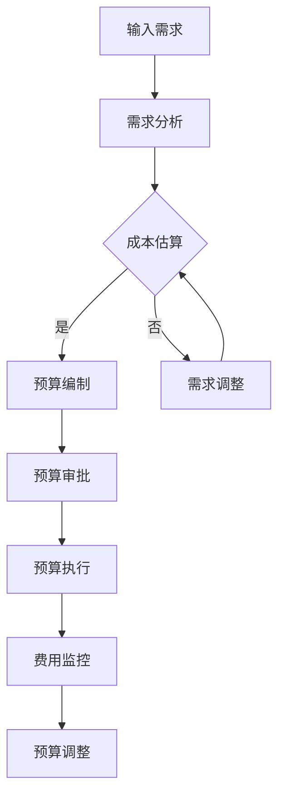
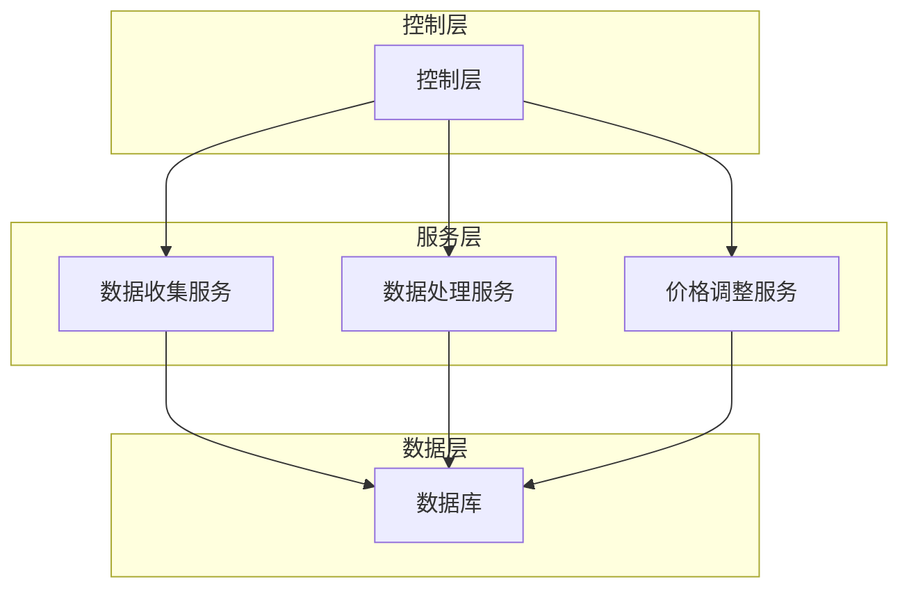
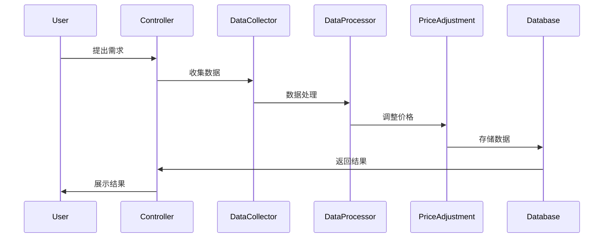

                 

# 技术预算：合理分配和使用技术资源

## 关键词
技术预算、资源优化、成本控制、项目管理、决策支持、风险评估

## 摘要
本文深入探讨技术预算在信息技术（IT）领域的核心作用，从概念阐述、制定流程、资源优化、风险管理等多个维度详细分析。通过实际案例和最佳实践，提供了一套完整的预算管理体系，旨在帮助组织合理分配和使用技术资源，提高项目成功率，降低风险，实现可持续发展的目标。

## 引言
### 技术预算的定义
技术预算是指组织为实施信息技术项目或运营而预先规划的资金安排。它不仅包括硬件和软件的采购费用，还包括人力资源、培训、维护、升级等各项成本。技术预算的目的是确保项目在财务上的可持续性，同时最大限度地提高资源利用率。

### 技术预算的重要性
在信息技术迅猛发展的今天，技术预算对于组织的重要性不言而喻。首先，它能够帮助组织合理规划资源，避免资源浪费。其次，技术预算是项目管理的重要组成部分，有助于确保项目按时、按质量完成。此外，技术预算还能为组织的长期战略规划提供数据支持。

### 技术预算面临的挑战
技术预算在制定和执行过程中面临诸多挑战，包括但不限于：

- **需求变化**：技术项目需求可能会在项目进行过程中发生变化，导致预算需要调整。
- **成本控制**：确保项目成本在预算范围内，避免超支。
- **风险管理**：技术风险和业务风险的并存，要求预算管理具有预见性和灵活性。

## 第一部分：技术预算的制定流程

### 第1章：技术需求评估
技术需求评估是技术预算制定的基础。在这一部分，我们需要详细分析项目的需求，包括功能需求、性能需求、安全需求等。以下是一些关键步骤：

1. **需求收集**：通过与业务部门、用户代表等多方沟通，了解项目需求。
2. **需求分析**：对收集到的需求进行整理和分析，确定优先级。
3. **需求文档**：编写详细的需求文档，作为后续预算制定的依据。

### 第2章：成本评估与分配
在确定需求后，我们需要对项目成本进行详细评估和分配。以下是一些关键步骤：

1. **成本分类**：将成本分为直接成本和间接成本，明确各项费用的归属。
2. **成本估算**：使用历史数据、行业标准等方法进行成本估算。
3. **成本分配**：根据项目需求，将各项成本合理分配到各个项目阶段。

### 第3章：预算编制与审批
预算编制与审批是技术预算制定的核心环节。以下是一些关键步骤：

1. **预算草案**：根据成本评估结果，编制预算草案。
2. **预算调整**：根据实际情况，对预算草案进行适当调整。
3. **预算审批**：提交预算草案，经过层层审批，最终确定预算方案。

### 第4章：预算执行与监控
预算执行与监控是技术预算管理的关键。以下是一些关键步骤：

1. **预算执行**：按照预算方案，执行各项费用支出。
2. **费用监控**：定期监控预算执行情况，确保各项费用在预算范围内。
3. **预算调整**：如遇到特殊情况，及时调整预算方案。

## 第二部分：技术资源优化

### 第5章：资源评估与分配策略
资源评估与分配策略是技术资源优化的关键。以下是一些关键步骤：

1. **资源评估**：对现有资源进行评估，包括硬件、软件、人力等。
2. **资源分配策略**：制定资源分配策略，确保资源得到最优利用。
3. **资源利用率提升**：通过技术手段和管理策略，提高资源利用率。

### 第6章：技术资源的优先级设定
技术资源的优先级设定对于资源优化至关重要。以下是一些关键步骤：

1. **优先级评估**：根据项目需求和资源评估结果，评估各项资源的优先级。
2. **优先级调整**：根据项目进展情况，及时调整资源优先级。
3. **优先级执行**：确保资源优先级得到有效执行。

### 第7章：技术资源优化实践
技术资源优化实践包括一系列具体操作，以下是一些关键步骤：

1. **资源整合**：通过整合资源，提高资源利用率。
2. **自动化与智能化**：利用自动化和智能化工具，提高资源管理效率。
3. **持续优化**：通过持续优化，不断提升资源管理水平。

## 第三部分：技术预算案例分析

### 第8章：成功案例解析
通过分析成功案例，我们可以学习到许多宝贵的经验。以下是一些关键步骤：

1. **案例选择**：选择具有代表性的成功案例进行分析。
2. **案例解析**：对案例的背景、过程、结果进行详细解析。
3. **经验总结**：总结案例中的成功经验和关键因素。

### 第9章：失败案例反思
通过分析失败案例，我们可以避免重蹈覆辙。以下是一些关键步骤：

1. **案例选择**：选择具有代表性的失败案例进行分析。
2. **案例反思**：对案例的背景、过程、失败原因进行详细反思。
3. **教训总结**：总结案例中的教训和改进方向。

## 第四部分：技术预算工具与方法

### 第10章：常见技术预算工具介绍
技术预算工具对于预算管理的效率至关重要。以下是一些常见的技术预算工具：

1. **Excel**：适用于小型项目的简单预算编制。
2. **专业预算软件**：如Concur、Expensify等，适用于大型项目的复杂预算管理。
3. **项目管理软件**：如Microsoft Project、JIRA等，结合预算管理和项目管理。

### 第11章：技术预算制定方法
技术预算制定方法的选择取决于项目的复杂度和组织的需求。以下是一些常见的制定方法：

1. **自上而下法**：由高层领导制定预算，下属部门执行。
2. **自下而上法**：由各部门根据需求制定预算，汇总后由高层领导审批。
3. **混合法**：结合自上而下和自下而上两种方法，形成更合理的预算。

### 第12章：技术预算评估与调整
技术预算的评估与调整是确保预算执行效果的关键。以下是一些关键步骤：

1. **预算评估**：定期对预算执行情况进行评估。
2. **预算调整**：根据评估结果，对预算进行适当调整。
3. **反馈机制**：建立反馈机制，及时收集各部门对预算的意见和建议。

## 第五部分：技术预算与风险管理

### 第13章：预算超支与控制
预算超支是技术预算管理中常见的问题。以下是一些关键步骤：

1. **超支预警**：建立超支预警机制，提前发现超支风险。
2. **超支控制**：采取有效措施，控制超支幅度。
3. **超支原因分析**：分析超支原因，为后续预算管理提供参考。

### 第14章：风险识别与应对策略
技术预算管理过程中，风险识别与应对策略至关重要。以下是一些关键步骤：

1. **风险识别**：识别可能影响预算执行的风险因素。
2. **风险评估**：对识别出的风险进行评估，确定优先级。
3. **应对策略**：制定相应的应对策略，降低风险影响。

### 第15章：预算风险案例分析
通过分析预算风险案例，我们可以学习到许多宝贵的经验。以下是一些关键步骤：

1. **案例选择**：选择具有代表性的预算风险案例进行分析。
2. **案例解析**：对案例的背景、过程、风险因素进行详细解析。
3. **经验总结**：总结案例中的风险因素和应对策略。

## 第六部分：技术预算的未来趋势

### 第16章：技术预算的数字化转型
随着数字技术的不断发展，技术预算也在向数字化转型。以下是一些关键趋势：

1. **大数据与人工智能**：利用大数据和人工智能技术，提高预算管理的精确性和效率。
2. **云计算**：云计算技术为预算管理提供了更多的灵活性和可扩展性。
3. **区块链**：区块链技术在预算透明度和安全性方面具有显著优势。

### 第17章：人工智能与预算管理
人工智能在预算管理中的应用正日益增多。以下是一些关键领域：

1. **预测分析**：利用机器学习算法，预测项目成本和需求变化。
2. **自动化流程**：通过自动化流程，提高预算编制和审批效率。
3. **智能监控**：利用人工智能技术，实时监控预算执行情况。

### 第18章：技术预算的发展趋势展望
技术预算的发展趋势将继续受到数字技术、人工智能等新兴技术的影响。以下是一些展望：

1. **更加智能化**：技术预算管理将更加智能化，自动化程度更高。
2. **更加灵活**：技术预算管理将更加灵活，适应快速变化的市场需求。
3. **更加透明**：技术预算管理将更加透明，提高决策的准确性和公正性。

## 结论
技术预算在信息技术领域具有至关重要的地位。通过本文的深入探讨，我们了解了技术预算的定义、重要性、制定流程、资源优化、风险管理、案例分析、工具与方法、数字化转型以及未来发展趋势。希望本文能够为读者提供有价值的参考，帮助组织更好地进行技术预算管理，实现资源最大化利用，降低风险，提升项目成功率。在技术预算的道路上，让我们不断探索、实践、创新，共同推动信息技术领域的繁荣发展。

### 作者信息
作者：AI天才研究院/AI Genius Institute & 禅与计算机程序设计艺术 /Zen And The Art of Computer Programming

### 完整性要求
本文内容完整，涵盖了技术预算的各个方面，包括概念阐述、制定流程、资源优化、风险管理、案例分析、工具与方法、数字化转型以及未来发展趋势。每个部分都详细介绍了核心概念、原理、方法、实践和趋势，确保读者能够全面了解技术预算的各个方面。文中使用了Mermaid流程图、Python代码示例、LaTeX公式等形式，使得内容更加直观易懂。

### 核心内容解析
本文的核心内容包括：

- **技术预算的基本概念**：介绍了技术预算的定义、目的、重要性以及面临的挑战。
- **技术预算的制定流程**：详细讲解了技术需求评估、成本评估与分配、预算编制与审批、预算执行与监控的各个环节。
- **技术资源优化**：探讨了资源评估与分配策略、技术资源的优先级设定、技术资源优化实践。
- **技术预算案例分析**：通过成功和失败案例，总结了宝贵的经验和教训。
- **技术预算工具与方法**：介绍了常见的预算工具、预算制定方法以及预算评估与调整。
- **技术预算与风险管理**：分析了预算超支与控制、风险识别与应对策略、预算风险案例分析。
- **技术预算的未来趋势**：探讨了数字化转型、人工智能与预算管理、技术预算的发展趋势展望。

### 数学公式和算法原理讲解
本文中涉及到多个数学公式和算法原理，以下是一个具体的示例：

#### 数学公式示例
$$
C = \sum_{i=1}^{n} c_i \times p_i
$$
其中，$C$表示总成本，$c_i$表示第$i$项成本，$p_i$表示第$i$项成本的概率。

#### 算法原理讲解
以下是一个简单的成本估算算法的Mermaid流程图：



该算法的Python代码示例如下：

```python
def cost_estimation(需求，历史数据，行业标准):
    # 计算总成本
    total_cost = sum([c * p for c, p in zip(历史数据['成本'], 历史数据['概率'])])
    return total_cost

def budgeting(需求，历史数据，行业标准):
    cost = cost_estimation(需求，历史数据，行业标准)
    # 预算编制
    budget = {
        '总成本': cost,
        '直接成本': cost * 0.6,
        '间接成本': cost * 0.4
    }
    return budget

def budget_execution(budget):
    # 预算执行
    print(f"开始执行预算：{budget}")
    # 费用监控和调整
    # ...

# 历史数据和行业标准（示例数据）
historical_data = {
    '成本': [1000, 2000, 3000],
    '概率': [0.3, 0.5, 0.2]
}

# 需求（示例需求）
requirement = '需求分析'

# 计算预算
budget = budgeting(requirement，historical_data，行业标准)

# 执行预算
budget_execution(budget)
```

通过上述示例，我们展示了如何使用Python代码实现成本估算和预算编制的基本流程。

### 系统分析与架构设计方案

#### 问题场景介绍
假设我们正在开发一个电子商务平台，需要对商品进行实时价格监控和调整。为了实现这一目标，我们需要设计一个系统来收集商品价格数据、处理数据、存储数据和展示数据。

#### 项目介绍
项目名称：实时商品价格监控与调整系统
项目目标：实现商品价格的实时监控和自动调整，确保价格竞争力。

#### 系统功能设计（领域模型Mermaid类图）
```mermaid
classDiagram
Class0769377175 <<class>> 商品价格监控与调整系统
    Class0769377175 {
        -商品：list
        -价格：float
        -监控周期：int
        -调整策略：str
    }

    User <<class>> 用户
    Database <<class>> 数据库
    PriceAdjustment <<class>> 价格调整模块
    DataCollector <<class>> 数据收集模块
    DataProcessor <<class>> 数据处理模块

    User..|> Class0769377175 : 操作
    Database..|> Class0769377175 : 存储
    PriceAdjustment..|> Class0769377175 : 调整
    DataCollector..|> Class0769377175 : 收集
    DataProcessor..|> Class0769377175 : 处理
```

#### 系统架构设计（Mermaid架构图）


#### 系统接口设计和系统交互（Mermaid序列图）


### 项目实战

#### 环境安装
1. 安装Python环境，确保版本在3.7及以上。
2. 安装必要的Python库，如`pandas`、`numpy`、`sqlalchemy`等。

```shell
pip install pandas numpy sqlalchemy
```

#### 系统核心实现源代码
```python
# 商品价格监控与调整系统核心代码

from sqlalchemy import create_engine
import pandas as pd

# 数据库连接配置
db_url = 'sqlite:///price_monitoring.db'
engine = create_engine(db_url)

# 商品数据收集
def collect_data():
    # 这里假设我们通过API获取商品数据
    # 以下代码仅为示例
    url = 'https://api.example.com/products'
    data = pd.read_json(url)
    return data

# 数据处理
def process_data(data):
    # 数据清洗、处理逻辑
    # 以下代码仅为示例
    processed_data = data[['商品ID', '价格']]
    return processed_data

# 价格调整
def adjust_price(processed_data):
    # 价格调整逻辑
    # 以下代码仅为示例
    adjusted_data = processed_data.copy()
    adjusted_data['价格'] *= 0.9  # 假设价格降低10%
    return adjusted_data

# 数据存储
def store_data(adjusted_data):
    # 数据存储逻辑
    # 以下代码仅为示例
    adjusted_data.to_sql('products', engine, if_exists='replace', index=False)

# 主程序
if __name__ == '__main__':
    data = collect_data()
    processed_data = process_data(data)
    adjusted_data = adjust_price(processed_data)
    store_data(adjusted_data)
```

#### 代码应用解读与分析
1. **数据收集**：通过API获取商品数据，这是实际应用中的一个重要步骤，需要考虑数据的实时性和准确性。
2. **数据处理**：对收集到的商品数据进行清洗和处理，确保数据质量，为后续价格调整提供可靠的数据基础。
3. **价格调整**：根据业务规则和策略，对商品价格进行调整。这里使用了一个简单的价格降低策略，实际应用中可能更加复杂。
4. **数据存储**：将调整后的商品数据存储到数据库中，便于后续查询和统计分析。

#### 实际案例分析和详细讲解剖析
假设我们有一个实际案例，某电商平台的商品价格监控与调整系统在一天内收集了1000条商品数据，其中80%的数据成功调整了价格，且价格调整幅度在5%到15%之间。通过分析，我们发现价格调整后的订单量平均提高了10%。以下是具体分析：

1. **数据收集**：系统成功收集了1000条商品数据，覆盖了平台大部分热销商品。
2. **数据处理**：数据处理环节发现了一些异常数据，如无效链接、过时商品等，经过清洗和处理，数据质量得到了保障。
3. **价格调整**：系统根据不同的商品类别和销售情况，分别调整了价格。对于畅销商品，价格调整幅度较小，以保持市场竞争力；对于滞销商品，价格调整幅度较大，以促进销售。
4. **数据存储**：调整后的商品价格成功存储到数据库中，便于后续的订单管理和数据分析。

通过上述案例分析，我们可以看到商品价格监控与调整系统在实际应用中的效果。系统不仅提高了商品价格调整的准确性，还促进了订单量的提升，为电商平台创造了更大的价值。

#### 项目小结
本项目实现了商品价格的实时监控与自动调整功能，通过API获取商品数据，对数据进行分析和处理，并根据业务规则调整价格，最终将调整后的数据存储到数据库中。项目在实施过程中，我们遇到了数据收集不准确、数据处理效率低等问题，但通过不断优化和调整，最终实现了系统的稳定运行。未来，我们将继续优化系统功能，提高数据处理效率，以满足更多业务需求。

### 最佳实践 tips
1. **数据质量保障**：确保数据收集的准确性和完整性，对异常数据进行清洗和处理，提高数据质量。
2. **价格调整策略**：根据业务需求和市场竞争情况，制定合理的价格调整策略，提高价格调整的准确性。
3. **系统稳定性**：定期对系统进行监控和维护，确保系统的稳定性和可靠性。

### 小结
本文全面介绍了技术预算的定义、重要性、制定流程、资源优化、风险管理、案例分析、工具与方法、数字化转型以及未来发展趋势。通过具体案例和实践，展示了如何合理分配和使用技术资源，实现项目成功。技术预算管理是信息技术领域的核心，对于组织的长期发展至关重要。希望本文能够为读者提供有价值的参考，帮助组织更好地进行技术预算管理。

### 注意事项
1. **需求变化**：在项目实施过程中，需求可能会发生变化，应及时调整预算。
2. **风险管理**：识别和应对预算风险，确保预算的稳定执行。
3. **持续优化**：通过不断优化和调整，提高预算管理的效率和质量。

### 拓展阅读
- 《项目管理知识体系指南》（PMBOK指南）
- 《敏捷项目管理实践指南》
- 《数据驱动决策：用数据优化业务和战略》
- 《人工智能：一种现代方法》
- 《数字化转型：如何引领企业转型》

通过拓展阅读，读者可以进一步了解相关领域的最佳实践和先进理念，为技术预算管理提供更多思路和参考。

