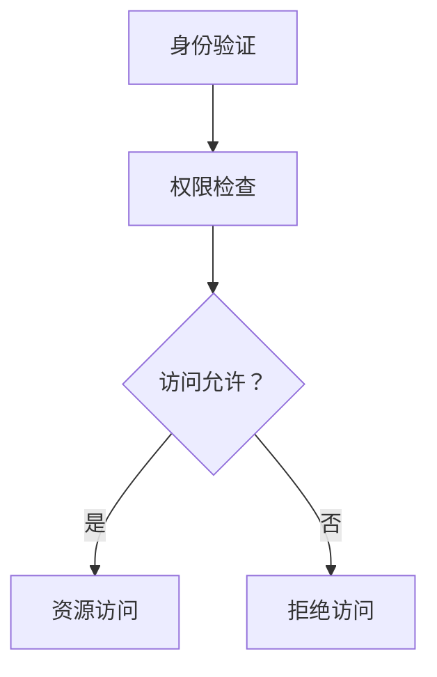
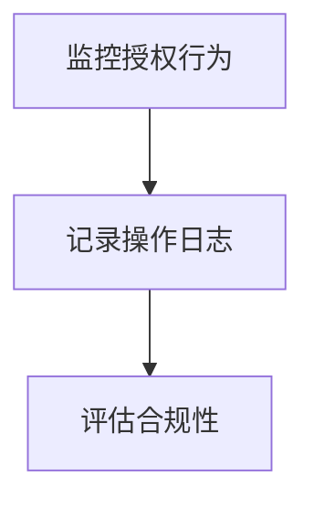
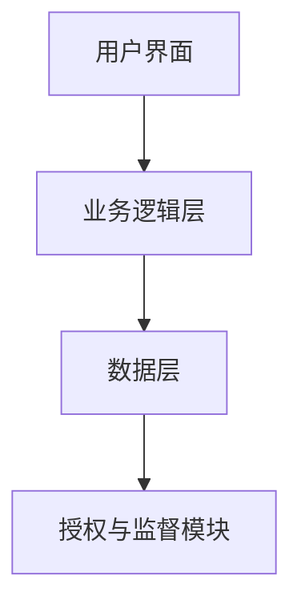
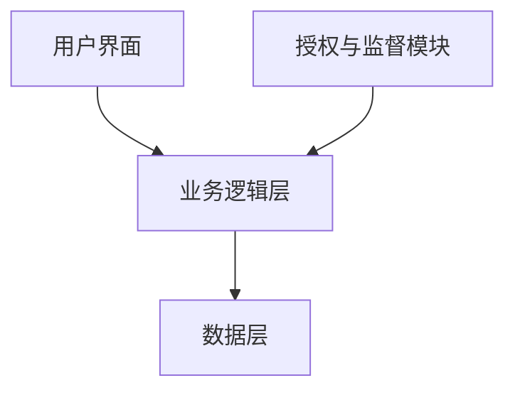
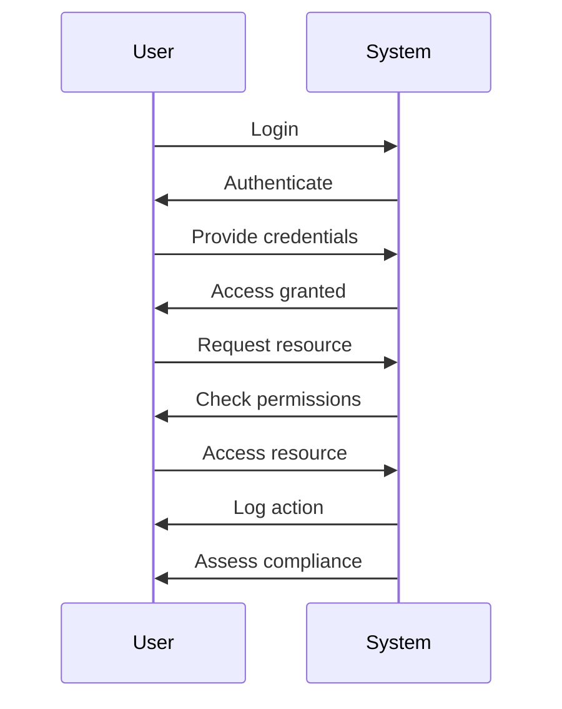

                 

### 文章标题

### 关键词

### 摘要

### 第一部分：授权与监督的基本概念

#### 第1章：授权与监督的概述

**1.1 授权的概念与重要性**

授权（Authorization）是一种赋予主体（通常是用户或程序）在特定环境下执行特定操作的能力。在信息技术领域，授权是实现访问控制和权限管理的关键机制。授权的重要性在于确保系统资源的合法使用，防止未经授权的访问和操作，从而保护系统的安全性和稳定性。

- **授权的定义**：授权是一种机制，用于验证用户或程序的访问权限，并允许其在系统内部执行特定操作。
- **授权的重要性**：授权是确保系统安全性和可控性的基础，有助于防范内部和外部威胁。
- **授权的边界与外延**：授权的边界包括授权的范围、有效期限和条件，其外延涉及系统内部所有可以授权的操作和资源。

**1.2 监督的概念与作用**

监督（Supervision）是对授权过程及其执行结果进行监控和管理的活动。监督的主要作用是确保授权机制的有效性和合规性，及时发现和纠正异常情况，提高系统的整体性能。

- **监督的定义**：监督是一种监控和审查机制，用于跟踪和评估授权过程的行为和结果。
- **监督的作用**：监督有助于确保授权的公正性、透明性和合规性，同时提高系统的可靠性和可维护性。
- **监督的类型**：监督可以分为预防性监督、检测性监督和纠正性监督，每种类型都有其特定的目标和应用场景。

**1.3 授权与监督的关系**

授权与监督之间存在紧密的联系和相互作用。授权是监督的基础，而监督是授权的保障。二者的协同作用可以确保系统在安全、稳定和高效的状态下运行。

- **授权与监督的联系**：授权是监督的对象，监督是授权的有效补充。
- **授权与监督的对比**：授权侧重于赋予权限，而监督侧重于监控和评估。
- **授权与监督的协同作用**：通过有效的授权和监督机制，可以实现系统的安全和效率的平衡。

#### 第2章：授权机制

**2.1 授权机制的原理**

授权机制是确保系统资源被正确授权给用户或程序的核心机制。其基本原理包括身份验证、权限分配和访问控制。

- **授权机制的基本原理**：身份验证确认用户或程序的合法性，权限分配确定其可访问的资源，访问控制决定其操作权限。
- **授权机制的组成部分**：身份验证模块、权限数据库、访问控制策略和审计日志。

**2.2 授权流程与实现**

授权流程包括用户身份验证、权限检查和资源访问三个主要步骤。以下使用Mermaid绘制授权流程图，并给出Python代码实现。



```python
def authenticate_user(username, password):
    # 身份验证逻辑
    return True  # 假设验证通过

def check_permissions(user, resource):
    # 权限检查逻辑
    return True  # 假设用户有权限访问

def access_resource(user, resource):
    if authenticate_user(user.username, user.password) and check_permissions(user, resource):
        print(f"{user.username} has access to {resource}.")
    else:
        print("Access denied.")

# 示例
user = User(username="Alice", password="alice123")
resource = "data_file.txt"
access_resource(user, resource)
```

**2.3 Python代码示例**

以上Python代码展示了基本的授权流程。在实际应用中，授权机制会更加复杂，涉及多级权限和动态权限调整。

- **授权机制的Python实现**：使用Python编写身份验证、权限检查和资源访问的功能模块。
- **授权代码的解读与分析**：代码中的每个函数和逻辑步骤都有详细注释，便于理解。

#### 第3章：监督机制

**3.1 监督机制的原理**

监督机制是确保授权执行过程符合预期和安全要求的关键。其原理包括监控授权行为、记录审计日志和评估合规性。

- **监督机制的基本原理**：监控授权执行过程中的关键环节，记录操作日志，对异常行为进行实时响应。
- **监督机制的组成部分**：监控模块、日志记录模块和合规性评估模块。

**3.2 监督流程与实现**

监督流程包括监控授权行为、记录操作日志和评估合规性三个主要步骤。以下使用Mermaid绘制监督流程图，并给出Python代码实现。



```python
import logging

def monitor_authorization_action(action, user, resource):
    # 监控授权行为逻辑
    logging.info(f"{user.username} performed {action} on {resource}.")

def log_action(action, user, resource):
    # 记录操作日志逻辑
    with open("audit.log", "a") as log_file:
        log_file.write(f"{action} by {user.username} on {resource} at {datetime.now()}\n")

def assess_compliance():
    # 评估合规性逻辑
    # 假设通过检查审计日志，确定系统合规
    return True

# 示例
user = User(username="Alice")
resource = "data_file.txt"
action = "read"
monitor_authorization_action(action, user, resource)
log_action(action, user, resource)
if assess_compliance():
    print("System compliance is satisfactory.")
else:
    print("Compliance issues detected.")
```

**3.3 Python代码示例**

以上Python代码展示了基本的监督流程。在实际应用中，监督机制会根据具体需求进行调整和优化。

- **监督机制的Python实现**：使用Python编写监控、日志记录和合规性评估的功能模块。
- **监督代码的解读与分析**：代码中的每个函数和逻辑步骤都有详细注释，便于理解。

### 第二部分：授权与监督在实践中的应用

#### 第4章：授权与监督的数学模型

**4.1 授权数学模型**

授权数学模型用于描述授权过程中涉及的变量和关系。以下是一个简单的授权数学模型，使用LaTeX格式表示。

$$
\text{Authorization} = f(\text{Authentication}, \text{Permission}, \text{Context})
$$

其中，$f$ 是一个函数，表示授权的结果，依赖于身份验证（Authentication）、权限（Permission）和上下文（Context）。

- **身份验证**：验证用户的身份，如用户名和密码。
- **权限**：确定用户可以访问的资源。
- **上下文**：包括时间、地点和特定条件等。

**4.2 监督数学模型**

监督数学模型用于描述监督过程中涉及的变量和关系。以下是一个简单的监督数学模型，使用LaTeX格式表示。

$$
\text{Supervision} = g(\text{Monitoring}, \text{Logging}, \text{Compliance})
$$

其中，$g$ 是一个函数，表示监督的结果，依赖于监控（Monitoring）、日志记录（Logging）和合规性（Compliance）。

- **监控**：实时监控授权行为的执行情况。
- **日志记录**：记录授权行为的详细日志。
- **合规性**：评估授权行为的合规性，如是否符合预定的政策和规则。

**4.3 数学模型应用举例**

以下使用Python代码举例说明授权和监督数学模型的应用。

```python
def authorize_user(authentication, permission, context):
    # 授权过程
    if authentication and permission and context.is_valid():
        return "User authorized."
    else:
        return "User authorization failed."

def supervise_action(monitoring, logging, compliance):
    # 监督过程
    if monitoring and logging and compliance:
        return "Action supervised successfully."
    else:
        return "Supervision failed."

# 示例
authentication = True
permission = True
context = Context(valid=True)
print(authorize_user(authentication, permission, context))

monitoring = True
logging = True
compliance = True
print(supervise_action(monitoring, logging, compliance))
```

### 第三部分：授权与监督的系统设计与实现

#### 第5章：授权与监督的系统架构设计

**5.1 系统应用场景**

授权与监督系统可以应用于各种场景，如企业信息管理系统、网络安全系统、教育管理系统等。以下以企业信息管理系统为例，介绍系统的架构设计。

**5.2 系统架构设计**

系统的整体架构包括用户界面、业务逻辑层、数据层和授权与监督模块。以下使用Mermaid绘制系统架构图。



**5.3 系统接口设计**

系统接口设计包括用户界面与业务逻辑层、业务逻辑层与数据层、以及授权与监督模块与其他模块之间的接口。以下使用Mermaid绘制系统接口图。



**5.4 系统交互序列图**

系统交互序列图描述了用户与系统之间的交互过程，包括登录、请求资源、授权和监督等步骤。以下使用Mermaid绘制系统交互序列图。



### 第四部分：授权与监督的实战案例

#### 第6章：授权与监督在企业信息管理系统中的应用

**6.1 企业背景介绍**

某大型企业采用企业信息管理系统（EIS）来管理其业务流程、资源和数据。该系统需要实现用户权限的合理分配和严格监督，以确保系统的安全性和数据完整性。

**6.2 企业授权与监督方案设计**

企业授权与监督方案设计包括以下步骤：

1. **需求分析**：确定系统需要保护的资源、用户的权限需求和系统的安全要求。
2. **方案设计**：设计授权与监督机制，包括用户身份验证、权限分配、授权流程和监督流程。
3. **方案实施**：根据设计方案实现系统功能，并进行测试和优化。

**6.3 企业授权与监督实施**

企业授权与监督实施包括以下步骤：

1. **环境准备**：安装和配置企业信息管理系统，以及授权与监督模块所需的软件和硬件。
2. **用户注册**：为系统管理员和普通用户创建账户，并进行身份验证。
3. **权限分配**：根据用户的角色和职责，分配相应的权限。
4. **授权流程**：实现用户登录、请求资源和访问控制的授权流程。
5. **监督流程**：实现授权行为的监控、日志记录和合规性评估。

**6.4 企业授权与监督效果评估**

企业授权与监督效果评估包括以下步骤：

1. **性能评估**：评估系统的响应时间、吞吐量和资源利用率。
2. **安全性评估**：评估系统的安全漏洞和攻击防护能力。
3. **用户满意度评估**：通过问卷调查和用户反馈，了解系统的用户满意度。
4. **成本效益评估**：评估系统的投资回报率和成本效益。

### 第五部分：最佳实践与总结

#### 第7章：最佳实践与总结

**7.1 最佳实践 tips**

1. **明确授权和监督的目标**：在设计和实施授权与监督机制时，明确系统的安全目标和管理目标。
2. **合理划分权限级别**：根据用户的角色和职责，合理划分权限级别，避免权限滥用。
3. **定期审核和更新权限**：定期审核和更新用户的权限，确保权限与实际需求一致。
4. **使用自动化工具**：利用自动化工具进行授权和监督，提高效率和准确性。
5. **加强用户教育和培训**：加强用户对授权和监督机制的理解和使用，提高系统的合规性和安全性。

**7.2 小结**

1. **授权与监督的重要性**：授权与监督是确保系统安全性和稳定性的关键机制。
2. **授权与监督的原理**：授权是赋予权限，监督是监控和评估。
3. **授权与监督的实践**：通过实际案例，展示了授权与监督在各个领域的应用。
4. **系统的设计与实现**：系统架构设计和接口设计是授权与监督的关键。

**7.3 注意事项**

1. **安全性**：在设计和实现授权与监督机制时，始终关注系统的安全性。
2. **合规性**：确保系统符合相关的法律法规和标准。
3. **可扩展性**：设计可扩展的系统架构，以适应未来的需求变化。
4. **用户友好性**：提高系统的用户友好性，降低使用难度。

**7.4 拓展阅读**

1. **相关文献**：查阅相关领域的学术文献，了解最新的研究成果和应用案例。
2. **技术博客**：关注知名技术博客，学习优秀的授权与监督实践。
3. **开源项目**：参与开源项目，了解授权与监督的实际应用和开发经验。

