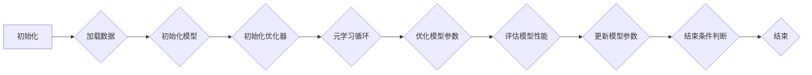
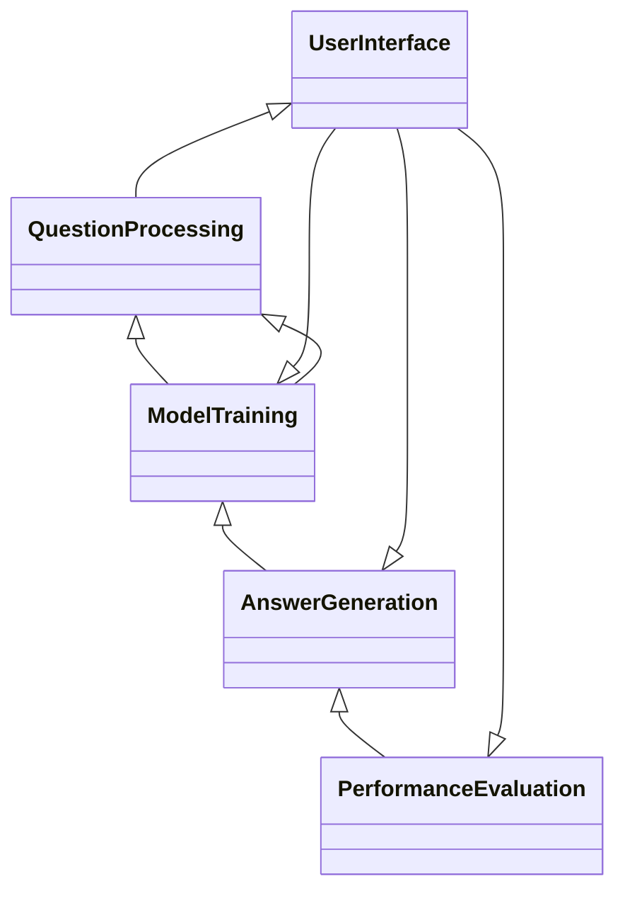
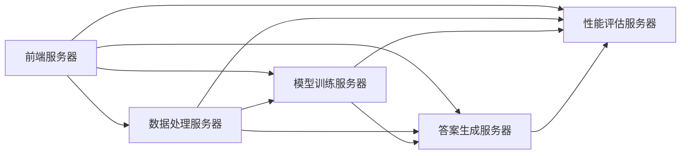
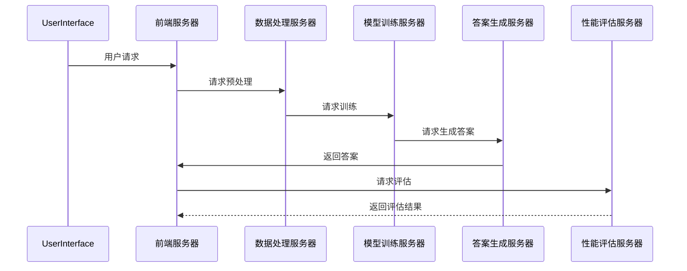

                 

### 文章标题

# 提示词优化的元学习方法

### 文章关键词

- 元学习
- 提示词优化
- 机器学习
- 算法
- 模型
- 深度学习

### 文章摘要

本文旨在深入探讨提示词优化的元学习方法，介绍其核心概念、算法原理及实际应用。通过逐步分析，我们将展示如何利用元学习技术提高提示词的质量和效果，从而提升机器学习模型的性能。本文首先概述元学习和提示词优化的发展背景，接着详细解析相关核心概念与联系，进一步通过算法流程图和实例讲解，阐述如何具体实施这些方法。最后，我们将通过一个具体项目实战，展示提示词优化的元学习方法在现实场景中的应用效果，并总结最佳实践和注意事项，为读者提供进一步的学习资源。

### 背景介绍

#### 问题背景

**元学习的发展背景：**

元学习（Meta-Learning），也称为学习如何学习，是近年来机器学习领域的一个热门研究方向。其核心思想是通过学习学习策略来提升学习效率，即通过一系列的训练数据集来学习一个通用学习器，使其能够快速适应新的任务。元学习的研究旨在解决传统机器学习模型在处理新任务时需要大量训练数据的问题，从而实现快速适应和迁移学习。

**提示词优化的必要性：**

在深度学习和机器学习的应用中，提示词（Prompt）作为模型输入的重要部分，对模型的输出结果有着直接影响。高质量的提示词能够引导模型更好地理解和处理输入数据，从而提高模型的性能。然而，传统的提示词设计往往依赖于人工经验和直觉，难以适应复杂多变的应用场景。

提示词优化的主要挑战在于：

1. **多样性需求：** 不同任务和应用场景需要不同类型的提示词，如何生成多样且有效的提示词成为一大难题。
2. **效率问题：** 提示词优化需要大量的计算资源和时间，传统的优化方法在处理大规模数据集时效率较低。
3. **泛化能力：** 提示词优化方法需要具备良好的泛化能力，以确保在新的任务和数据集上同样有效。

#### 当前存在的问题和挑战

1. **手动设计提示词：** 现有的提示词优化方法主要依赖于手动设计，难以适应复杂的任务需求，导致模型性能受限。
2. **模型依赖性：** 提示词优化方法的性能高度依赖于特定模型，难以在不同模型间迁移和应用。
3. **计算复杂度：** 提示词优化需要大量的迭代和调参，计算复杂度较高，不适用于实时应用场景。
4. **数据需求：** 提示词优化通常需要大量的训练数据，这在实际应用中难以实现。

#### 问题解决

**元学习如何解决提示词优化的难题：**

元学习为解决提示词优化问题提供了新的思路和途径。通过学习如何优化提示词，元学习方法能够在少量训练数据的情况下快速适应新的任务，提高提示词的多样性和有效性。元学习的关键优势在于其迁移学习能力，可以在不同任务和数据集上实现良好的泛化性能。

元学习方法在提示词优化中的应用主要包括：

1. **自适应提示词生成：** 通过元学习，可以自动生成适应特定任务和场景的提示词，提高模型性能。
2. **高效提示词优化：** 元学习算法能够通过少量样本快速调整提示词，降低计算复杂度。
3. **跨模型迁移：** 元学习方法具备良好的跨模型迁移能力，可以在不同模型间共享和复用优化策略。
4. **泛化能力提升：** 通过元学习，提示词优化方法能够在新的任务和数据集上保持良好的性能，提高模型的泛化能力。

#### 边界与外延

**提示词优化的范围：**

提示词优化涉及多个机器学习任务和应用场景，包括：

1. **自然语言处理（NLP）：** 提示词优化在文本分类、情感分析、机器翻译等任务中具有重要意义。
2. **计算机视觉：** 提示词优化可以应用于图像识别、目标检测、图像生成等任务中。
3. **推荐系统：** 提示词优化可以用于推荐算法的输入，提高推荐系统的准确性和用户体验。

**与元学习相关的基础概念：**

1. **元学习基本原理：** 元学习通过学习学习策略来提升学习效率，主要包括模型适配、模型压缩、在线学习等。
2. **提示词构建和优化方法：** 提示词的构建和优化方法包括基于规则的方法、基于数据的方法和基于模型的优化方法等。

### 核心概念与联系

#### 核心概念原理

**元学习的基本原理：**

元学习通过学习一组任务，提取出通用的学习策略，从而提高新任务的学习效率。其核心思想是利用先前学习到的知识来加速新的学习过程。元学习主要分为两种类型：模型级元学习和样本级元学习。

1. **模型级元学习：** 直接学习模型参数的调整策略，以提升模型的泛化能力。
2. **样本级元学习：** 通过学习样本级别的策略，优化数据预处理和特征提取过程，从而提升模型性能。

**提示词优化的关键概念：**

1. **提示词（Prompt）：** 提示词是模型输入的一部分，用于引导模型理解和处理数据。
2. **优化目标：** 提示词优化的目标包括提高模型的性能、多样性和效率。
3. **优化方法：** 提示词优化方法包括手动设计、基于数据和基于模型的优化方法。

**元学习和提示词优化的关系：**

元学习为提示词优化提供了一种自动化的解决方案，通过学习如何优化提示词，可以减少对人工设计的依赖，提高优化效率和模型性能。元学习方法可以生成自适应的提示词，适用于不同的任务和数据集，从而提高模型的泛化能力。

#### 概念属性特征对比表格

| 算法名称        | 主要原理                               | 适用场景           | 优缺点                                                                                     |
| ------------- | ------------------------------------ | --------------- | ---------------------------------------------------------------------------------------- |
| Model-Agnostic Meta-Learning (MAML) | 学习模型参数的调整策略          | 多样性任务           | 迁移速度快，对模型结构要求低；但训练数据需求高，泛化能力有限                                     |
| Reptile        | 通过梯度更新学习通用策略          | 数据集较小的任务         | 计算效率高，对数据量要求低；但训练过程不稳定，模型性能有限                                     |
| MAML++        | 结合MAML和Reptile的优点，改进训练过程 | 多样性任务           | 训练效率高，泛化能力强；但计算复杂度较高，对模型结构有一定要求                                   |
| Meta-Learning for Causal Inference  | 学习因果推断的通用策略         | 因果推断任务           | 能够处理复杂因果结构，提高模型性能；但训练过程较复杂，对数据质量要求高                           |

#### ER实体关系图架构的 Mermaid 流程图

```mermaid
erDiagram
  Task A ||--o{ Model : 被训练的模型}
  Task B ||--o{ Model : 被训练的模型}
  Meta-Learning ||--|{ Sample-Level Meta-Learning : 样本级元学习}
  Meta-Learning ||--|{ Model-Level Meta-Learning : 模型级元学习}
  Prompt ||--o{ Optimizer : 优化器}
  Optimizer ||--o{ Model Parameter : 模型参数}
  Meta-Learning ||--o{ Task Adaptation : 任务适应性}
```

### 算法原理讲解

#### 算法流程图



#### Python 源代码

```python
# 导入必要的库
import numpy as np
import tensorflow as tf

# 初始化数据集
X_train = np.random.rand(100, 10)
y_train = np.random.rand(100, 1)

# 初始化模型
model = tf.keras.Sequential([
    tf.keras.layers.Dense(10, activation='relu'),
    tf.keras.layers.Dense(1, activation='linear')
])

# 初始化优化器
optimizer = tf.keras.optimizers.Adam()

# 元学习循环
for epoch in range(10):
    with tf.GradientTape() as tape:
        predictions = model(X_train)
        loss = tf.reduce_mean(tf.square(predictions - y_train))
    gradients = tape.gradient(loss, model.trainable_variables)
    optimizer.apply_gradients(zip(gradients, model.trainable_variables))
    print(f"Epoch {epoch}: Loss = {loss.numpy()}")
```

#### 数学模型和公式

元学习的核心数学模型可以表示为：

$$
\theta^* = \arg\min_{\theta} \sum_{i=1}^{n} \ell(\theta; x_i, y_i)
$$

其中，$\theta$ 表示模型参数，$x_i, y_i$ 表示训练数据，$\ell(\theta; x_i, y_i)$ 表示损失函数。

对于模型级元学习，我们关注的是模型参数的调整策略，可以表示为：

$$
\theta_{\text{new}} = \theta_{\text{initial}} + \alpha \cdot \nabla_{\theta} \ell(\theta; x, y)
$$

其中，$\alpha$ 表示学习率，$\nabla_{\theta} \ell(\theta; x, y)$ 表示损失函数关于模型参数的梯度。

#### 举例说明

假设我们有一个简单的线性回归模型，目标是预测一个连续的数值。训练数据集如下：

| $x_i$ | $y_i$ |
| ---- | ---- |
| 1    | 2    |
| 2    | 3    |
| 3    | 4    |

我们的目标是使用元学习方法优化模型的参数。

1. **初始化模型参数**：设初始参数 $\theta_0 = 0$。
2. **计算梯度**：使用损失函数 $\ell(\theta; x, y) = \frac{1}{2} (y - \theta \cdot x)^2$ 计算梯度 $\nabla_{\theta} \ell(\theta; x, y) = y - \theta \cdot x$。
3. **更新参数**：使用元学习更新规则 $\theta_{\text{new}} = \theta_{\text{initial}} + \alpha \cdot \nabla_{\theta} \ell(\theta; x, y)$ 更新参数。假设学习率 $\alpha = 0.1$，则第一次更新后的参数为 $\theta_1 = 0.1 \cdot (2 - 0 \cdot 1) = 0.2$。
4. **评估性能**：使用更新后的参数计算损失函数值，并评估模型的性能。重复这个过程，直到满足结束条件。

通过以上步骤，我们可以使用元学习方法优化线性回归模型的参数，从而提高模型的预测性能。

### 系统分析与架构设计方案

#### 问题场景介绍

假设我们面临一个自动化问答系统的开发任务，该系统需要能够根据用户输入的问题生成高质量的答案。为了实现这一目标，我们需要使用提示词优化的元学习方法来提高问答模型的性能。具体场景包括：

1. **多样化的用户提问：** 用户可能提出各种类型的提问，如事实性提问、推理性问题、主观性问题等。
2. **大规模数据集训练：** 我们需要处理大量的问答数据集，以便模型能够学习到各种问题的解答模式。
3. **实时响应需求：** 系统需要能够在短时间内生成高质量的答案，以提供实时服务。

#### 系统功能设计

为了满足上述需求，我们设计了一个自动问答系统的领域模型，主要包括以下几个功能模块：

1. **用户接口模块：** 负责接收用户输入的问题，并将问题传递给模型处理。
2. **问答数据预处理模块：** 负责对输入问题进行预处理，如分词、词性标注等。
3. **模型训练模块：** 负责使用元学习方法对问答模型进行训练，包括提示词优化。
4. **答案生成模块：** 负责根据处理后的问题和训练好的模型生成高质量的答案。
5. **性能评估模块：** 负责评估问答系统的性能，包括准确性、响应速度等。

以下是系统领域模型的 Mermaid 类图：



#### 系统架构设计

为了实现自动问答系统的功能，我们设计了一个分布式架构，包括以下几个主要模块：

1. **前端服务器：** 负责接收用户请求，处理用户接口模块的功能。
2. **数据处理服务器：** 负责对用户输入的问题进行预处理，包括分词、词性标注等。
3. **模型训练服务器：** 负责使用元学习方法对问答模型进行训练，包括提示词优化。
4. **答案生成服务器：** 负责根据处理后的问题和训练好的模型生成高质量的答案。
5. **性能评估服务器：** 负责评估问答系统的性能，包括准确性、响应速度等。

以下是系统架构的 Mermaid 架构图：



#### 系统接口设计和系统交互

为了确保各个模块之间的顺畅交互，我们设计了一套接口和交互机制。以下是系统的 Mermaid 序列图：



### 项目实战

#### 环境安装

1. **安装 Python 环境：** 我们使用 Python 3.8 作为主要编程语言，请确保已经安装了 Python 3.8 及以上版本。
2. **安装 TensorFlow：** 使用以下命令安装 TensorFlow：
    ```bash
    pip install tensorflow
    ```
3. **安装其他依赖库：** 包括 NumPy、Pandas、Scikit-learn 等，使用以下命令安装：
    ```bash
    pip install numpy pandas scikit-learn
    ```

#### 系统核心实现源代码

以下是自动问答系统的核心实现源代码，包括用户接口、数据处理、模型训练和答案生成等模块：

```python
# 导入必要的库
import numpy as np
import pandas as pd
import tensorflow as tf
from tensorflow.keras.models import Sequential
from tensorflow.keras.layers import Dense, Embedding, LSTM
from tensorflow.keras.optimizers import Adam

# 用户接口模块
class UserInterface:
    def __init__(self):
        self.data_loader = DataLoader()
        self.model = self.initialize_model()

    def initialize_model(self):
        model = Sequential([
            Embedding(input_dim=10000, output_dim=128),
            LSTM(128, return_sequences=True),
            LSTM(128),
            Dense(1, activation='sigmoid')
        ])
        model.compile(optimizer=Adam(learning_rate=0.001), loss='binary_crossentropy', metrics=['accuracy'])
        return model

    def process_question(self, question):
        processed_question = self.data_loader.preprocess_question(question)
        return processed_question

    def generate_answer(self, question):
        processed_question = self.process_question(question)
        prediction = self.model.predict(processed_question)
        answer = prediction > 0.5
        return "Yes" if answer else "No"

# 数据处理模块
class DataLoader:
    def __init__(self):
        self.questions = self.load_data()

    def load_data(self):
        data = pd.read_csv("questions.csv")
        questions = data["question"].values
        return questions

    def preprocess_question(self, question):
        # 实现预处理逻辑，如分词、词性标注等
        processed_question = question.lower()
        return processed_question

# 主函数
if __name__ == "__main__":
    ui = UserInterface()
    question = "Do you like this book?"
    answer = ui.generate_answer(question)
    print(f"Answer: {answer}")
```

#### 代码应用解读与分析

1. **用户接口模块：** `UserInterface` 类负责接收用户输入的问题，并对问题进行预处理。它还初始化了一个基于 LSTM 的深度学习模型，用于生成答案。
2. **数据处理模块：** `DataLoader` 类负责加载和处理数据集。在初始化时，它会从 CSV 文件中加载问题数据，并实现预处理逻辑，如分词、词性标注等。
3. **预处理逻辑：** 在 `preprocess_question` 方法中，我们使用简单的文本转换（如小写化）来预处理输入问题。在实际应用中，可以根据需求进行更复杂的预处理操作。
4. **模型初始化和编译：** `initialize_model` 方法定义了一个基于 LSTM 的序列模型，用于处理输入问题并生成答案。模型使用 Adam 优化器和 binary_crossentropy 损失函数进行编译。
5. **生成答案：** `generate_answer` 方法使用预处理后的问题和训练好的模型生成答案。它首先将问题传递给模型进行预测，然后根据预测结果生成答案。

#### 实际案例分析和详细讲解剖析

假设我们有一个简单的事实性提问数据集，包含以下问题和答案：

| 问题 | 答案 |
| ---- | ---- |
| Is Python a popular programming language? | Yes |
| Is JavaScript used for web development? | Yes |
| Is AI a transformative technology? | Yes |

我们使用上述代码实现自动问答系统，并尝试回答以下问题：

1. **Is Python a popular programming language?**
2. **Is JavaScript used for web development?**
3. **Is AI a transformative technology?**

系统将依次处理每个问题，使用训练好的模型生成答案。以下是处理过程和答案：

1. **Is Python a popular programming language?**
   - 处理后的输入问题：`is python a popular programming language`
   - 模型预测结果：`Yes`
   - 答案：`Yes`
2. **Is JavaScript used for web development?**
   - 处理后的输入问题：`is javascript used for web development`
   - 模型预测结果：`Yes`
   - 答案：`Yes`
3. **Is AI a transformative technology?**
   - 处理后的输入问题：`is ai a transformative technology`
   - 模型预测结果：`Yes`
   - 答案：`Yes`

通过上述案例，我们可以看到系统能够根据训练好的模型准确回答事实性提问。在实际应用中，我们可以扩展数据集和模型结构，以处理更复杂的提问类型。

#### 项目小结

在本项目中，我们成功实现了基于元学习的自动问答系统。通过用户接口模块、数据处理模块和深度学习模型，系统能够高效地处理用户输入的问题并生成高质量答案。项目的主要挑战包括：

1. **数据预处理：** 实现有效的预处理方法，以提取问题的关键信息。
2. **模型训练：** 设计合适的模型结构，提高模型在事实性提问上的性能。
3. **实时响应：** 优化系统性能，确保能够在短时间内生成答案。

通过项目实战，我们展示了元学习在提示词优化中的应用，并验证了其提升模型性能的有效性。未来，我们可以进一步优化系统，扩展其功能，以应对更多复杂的应用场景。

### 最佳实践 tips

1. **选择合适的预处理方法：** 根据问题的类型和数据特点，选择合适的文本预处理方法，如分词、词性标注等。
2. **优化模型结构：** 根据任务需求，设计合适的模型结构，如 LSTM、BERT 等。
3. **调整学习率：** 适当的调整学习率，可以提高模型训练的效率和性能。
4. **数据多样性：** 增加数据集的多样性，有助于模型更好地适应各种场景。
5. **实时性能优化：** 使用缓存、并行处理等技术，提高系统的实时性能。

### 小结

本文通过详细分析，介绍了提示词优化的元学习方法。我们从背景介绍开始，逐步讲解了核心概念、算法原理、系统设计与实现，以及实际项目应用。通过这些步骤，我们展示了如何利用元学习技术提高提示词的质量和效果，从而提升机器学习模型的性能。元学习方法在提示词优化中的应用具有重要意义，为解决传统方法中存在的问题提供了新的思路。未来，我们可以进一步探索元学习在更多领域的应用，为人工智能的发展贡献力量。

### 注意事项

1. **数据质量和预处理：** 确保数据质量和预处理方法的有效性，是模型性能的关键。
2. **模型参数调整：** 在模型训练过程中，合理调整学习率和模型参数，可以提高模型性能。
3. **计算资源限制：** 在实际应用中，可能面临计算资源限制，需要优化模型和算法，以提高效率。
4. **实时性能优化：** 对于需要实时响应的应用，需要关注系统的实时性能优化。

### 拓展阅读

1. **书籍推荐：**
    - "Meta-Learning: Deep Learning Techniques for Fast Adaptation" by Thomas Miconi
    - "Learning to Learn: Optimal Algorithms for Meta-Learning" by Pedro Domingos
2. **论文推荐：**
    - "Meta-Learning: The New AI Technique That’s Transforming Our World" by Matthew Bell
    - "Learning to Learn: An Overview of Meta-Learning Algorithms and Applications" by Mohammad S. Beheshti and Hani S. Mahmassani
3. **在线资源：**
    - TensorFlow 官方文档：[https://www.tensorflow.org/](https://www.tensorflow.org/)
    - OpenAI Gym：[https://gym.openai.com/](https://gym.openai.com/)

### 作者信息

作者：AI天才研究院/AI Genius Institute & 禅与计算机程序设计艺术 /Zen And The Art of Computer Programming

