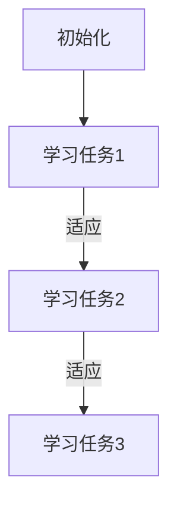
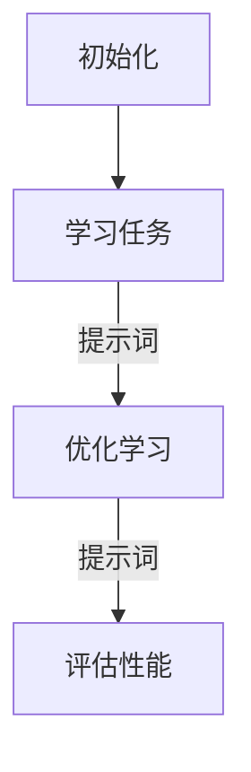
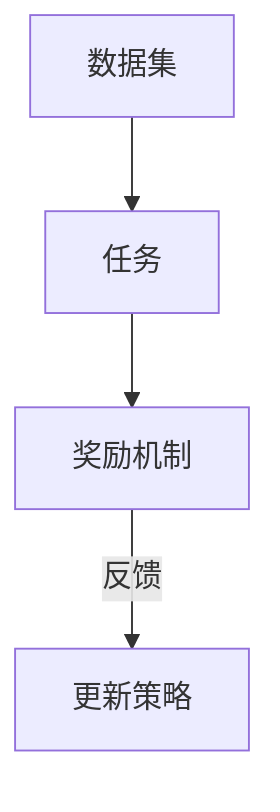
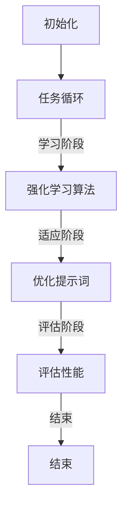
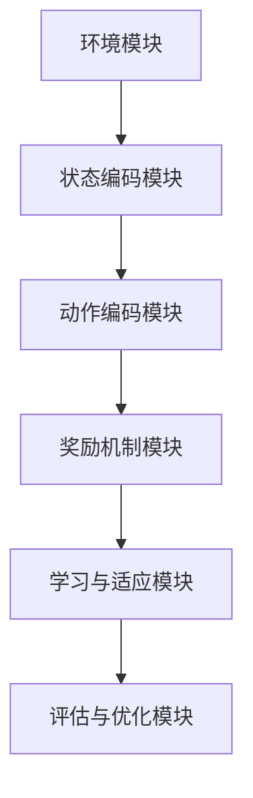
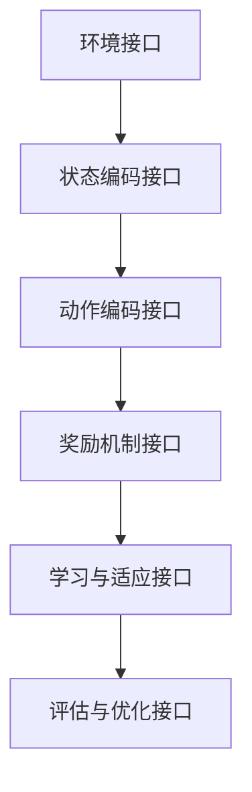

                 


### 1. 让我们从问题背景与定义开始

**问题背景与定义**是理解和研究一个主题的起点。在我们的案例中，我们将探讨《提示词优化的元强化学习方法》。

首先，让我们明确几个核心概念：

- **人工智能**：人工智能是一门研究、开发用于模拟、延伸和扩展人的智能的理论、方法、技术及应用系统的技术科学。

- **强化学习**：强化学习是机器学习的一个子领域，通过奖励信号来训练智能体（agent）做出决策，以最大化累积奖励。

- **元强化学习**：元强化学习是一种更高级别的强化学习，它关注于学习如何学习，即如何训练一个算法来适应不同的强化学习任务。

- **提示词优化**：提示词优化是指通过特定的提示词（prompt）来改善智能体（agent）的学习效率，使其在特定任务上表现出更好的性能。

接下来，我们将详细探讨这些问题背景与定义：

1. **人工智能与强化学习概述**：
   - **人工智能的发展历程**：从早期的符号主义到连接主义，再到现代的深度学习。
   - **强化学习的基本原理**：如何通过奖励信号来指导智能体的行为。

2. **元强化学习的基本概念**：
   - **元学习的定义**：元学习是一种学习如何学习的技术，它可以在不同的任务和数据集上快速适应。
   - **元强化学习的优势**：如何通过元强化学习来提高智能体的学习效率和适应性。

3. **提示词优化的定义与重要性**：
   - **提示词优化的含义**：如何通过特定的提示词来引导智能体的学习过程。
   - **提示词优化的作用**：如何提高智能体在特定任务上的学习效率。
   - **提示词优化的应用领域**：在哪些领域可以应用提示词优化，如自然语言处理、图像识别等。

4. **元强化学习方法的发展历程**：
   - **元强化学习的早期探索**：如何从最初的简单模型发展到现在的复杂模型。
   - **现代元强化学习的发展**：如何利用深度学习和大数据来推动元强化学习的发展。
   - **元强化学习的前沿研究**：当前元强化学习领域的研究热点和趋势。

通过上述分析，我们可以看到，《提示词优化的元强化学习方法》这本书将带领我们深入了解这些核心概念，并探讨如何将它们应用于实际问题中。接下来的章节将进一步深入探讨这些概念，提供详细的算法原理讲解、数学模型和公式、系统架构设计、项目实战等内容。

### 2. 探讨核心概念与原理

在了解了问题背景与定义后，我们需要深入探讨《提示词优化的元强化学习方法》的核心概念与原理。这一部分将帮助我们理解元强化学习以及提示词优化的具体实现方法。

**核心概念介绍**是理解元强化学习的基础。以下是我们将要探讨的核心概念：

1. **强化学习的基础算法**：
   - **Q-learning算法**：这是一种基于价值函数的强化学习算法，通过迭代更新策略来最大化累积奖励。
   - **SARSA算法**：这是一种基于策略的强化学习算法，通过即时奖励和状态转移概率来更新策略。
   - **Deep Q Network (DQN)**：这是一种基于深度学习的强化学习算法，通过神经网络来近似价值函数。

2. **元学习的理论基础**：
   - **元学习的定义**：元学习是一种学习如何学习的技术，它可以加速智能体在不同任务上的适应过程。
   - **元强化学习的优势**：元强化学习通过快速适应新任务，提高了智能体的学习效率和适应性。

3. **提示词优化的具体形式**：
   - **提示词优化的含义**：提示词优化是通过特定的提示词来引导智能体的学习过程，以提高其学习效率和性能。
   - **提示词优化的方法**：例如，通过调整提示词的长度、内容或呈现方式来优化学习过程。

4. **元强化学习中的关键要素**：
   - **数据集**：元强化学习需要大量的数据集来训练模型，以提高其泛化能力。
   - **任务**：不同的任务需要不同的提示词优化策略，以实现最佳性能。
   - **奖励机制**：合理的奖励机制可以激励智能体在特定任务上表现出更好的行为。

接下来，我们将深入探讨这些核心概念，并使用Mermaid流程图和Python代码来展示它们的实现。

#### 2.1 强化学习的基础算法

**Q-learning算法**是一种基于价值函数的强化学习算法。它通过迭代更新状态值函数（Q值），以最大化累积奖励。

```mermaid
graph TD
A[初始化] --> B[选择动作]
B -->|Q(s,a)|
C[执行动作]
C --> D[获得奖励]
D --> E[更新Q值]
E --> F{是否完成？}
F -->|是| G[结束]
F -->|否| B
```

**SARSA算法**是一种基于策略的强化学习算法。它通过即时奖励和状态转移概率来更新策略。

```mermaid
graph TD
A[初始化] --> B[选择动作]
B -->|s, a|
C[执行动作]
C --> D[获得奖励]
D --> E[状态转移]
E --> F[选择动作]
F -->|s', a'|
G[更新策略]
```

**Deep Q Network (DQN)** 是一种基于深度学习的强化学习算法。它通过神经网络来近似价值函数。

```mermaid
graph TD
A[初始化] --> B[选择动作]
B -->|s|
C[获取Q值预测]
C --> D[执行动作]
D --> E[获得奖励]
E --> F[更新Q值预测]
F -->|s'|
```

#### 2.2 元学习的理论基础

**元学习**是一种学习如何学习的技术。它通过快速适应新任务，提高了智能体的学习效率和适应性。



#### 2.3 提示词优化的具体形式

**提示词优化**是通过特定的提示词来引导智能体的学习过程，以提高其学习效率和性能。



#### 2.4 元强化学习中的关键要素

**元强化学习**的关键要素包括数据集、任务和奖励机制。



通过以上分析，我们可以看到《提示词优化的元强化学习方法》的核心概念和原理。接下来，我们将进一步探讨元强化学习的数学模型和公式，以及如何通过Python代码实现这些算法。

### 3. 元强化学习的数学模型和公式

在理解了核心概念之后，接下来我们将探讨元强化学习的数学模型和公式。数学模型是元强化学习算法的基础，它帮助我们理解智能体如何通过学习来做出最优决策。

**强化学习中的数学模型**主要包括价值函数和策略。价值函数表示在某个状态下执行某个动作所能获得的累积奖励。策略则是一组决策规则，用于指导智能体在特定状态下选择最优动作。

#### 3.1 强化学习中的数学模型

1. **价值函数**：

   强化学习中的价值函数通常表示为：

   $$ V^*(s) = \max_a Q^*(s, a) $$

   其中，$V^*(s)$ 表示在状态 $s$ 下的最优价值，$Q^*(s, a)$ 表示在状态 $s$ 下执行动作 $a$ 的最优累积奖励。

2. **策略**：

   策略通常表示为：

   $$ \pi^*(a|s) = \begin{cases} 
   1 & \text{if } a = \arg\max_a Q^*(s, a) \\
   0 & \text{otherwise} 
   \end{cases} $$

   其中，$\pi^*(a|s)$ 表示在状态 $s$ 下执行动作 $a$ 的概率。

#### 3.2 元强化学习中的数学模型

在元强化学习中，我们不仅要学习单个任务的最优策略，还要学习如何快速适应新任务。元强化学习的数学模型通常包含以下几个部分：

1. **元价值函数**：

   元价值函数表示智能体在新任务上的适应能力。它通常表示为：

   $$ \mu^*(T) = \max_{\pi} \sum_{t} \pi(a_t | s_t, T) R_t $$

   其中，$\mu^*(T)$ 表示在任务 $T$ 上的元价值，$\pi(a_t | s_t, T)$ 表示在状态 $s_t$ 和任务 $T$ 下执行动作 $a_t$ 的概率，$R_t$ 表示在时间步 $t$ 获得的即时奖励。

2. **元策略**：

   元策略是一组决策规则，用于指导智能体在元任务上选择最优策略。它通常表示为：

   $$ \nu^*(a_t | s_t, T) = \begin{cases} 
   1 & \text{if } a_t = \arg\max_{a_t} \mu^*(T) \\
   0 & \text{otherwise} 
   \end{cases} $$

   其中，$\nu^*(a_t | s_t, T)$ 表示在状态 $s_t$ 和任务 $T$ 下执行动作 $a_t$ 的概率。

#### 3.3 公式解释与示例

为了更好地理解这些数学模型，我们可以通过一个简单的示例来解释：

假设我们有一个智能体在一个简单的环境（如迷宫）中学习导航。智能体需要通过选择不同的动作（如移动左、右、上、下）来达到目标。我们可以定义以下数学模型：

1. **状态**：当前智能体的位置。
2. **动作**：智能体的移动方向。
3. **奖励**：智能体每移动一步获得的即时奖励，如果到达目标则获得大量奖励。
4. **价值函数**：表示在某个状态下执行某个动作所能获得的累积奖励。
5. **策略**：智能体在某个状态下选择动作的概率分布。

通过这些数学模型，我们可以使用强化学习算法来训练智能体，使其能够通过不断尝试和错误来学习最优策略。在这个过程中，元强化学习可以帮助智能体快速适应不同的迷宫环境。

#### 3.4 Mermaid算法流程图

为了更直观地展示这些数学模型，我们可以使用Mermaid绘制算法流程图。

**Q-learning算法**的Mermaid流程图如下：

```mermaid
graph TD
A[初始化] --> B[选择动作]
B -->|Q(s,a)|
C[执行动作]
C --> D[获得奖励]
D --> E[更新Q值]
E --> F{是否完成？}
F -->|是| G[结束]
F -->|否| B
```

**元强化学习**的Mermaid流程图如下：


通过这些流程图，我们可以更清晰地理解强化学习和元强化学习的过程。

### 4. 算法实现与设计

在理解了元强化学习的数学模型后，接下来我们将探讨如何实现这些算法。这一部分将详细介绍算法的实现过程，包括Python代码示例和Mermaid流程图。

#### 4.1 元强化学习算法概述

元强化学习算法主要包括两个阶段：训练阶段和评估阶段。在训练阶段，智能体通过学习多个任务来提高其适应能力；在评估阶段，智能体使用训练得到的知识来适应新的任务。

以下是元强化学习算法的基本步骤：

1. **初始化**：初始化智能体、环境、任务列表和奖励函数。
2. **任务循环**：对于每个任务，执行以下步骤：
   - **学习阶段**：使用强化学习算法学习任务。
   - **适应阶段**：根据学习到的策略来适应新任务。
3. **评估阶段**：评估智能体在测试任务上的性能。

#### 4.2 提示词优化的算法流程

提示词优化是元强化学习中的一个关键步骤。它通过调整提示词来提高智能体的学习效率。以下是提示词优化的算法流程：

1. **初始化**：初始化提示词、智能体和任务。
2. **任务循环**：对于每个任务，执行以下步骤：
   - **学习阶段**：使用强化学习算法学习任务，同时记录智能体的表现。
   - **优化阶段**：根据智能体的表现来优化提示词。
   - **评估阶段**：评估智能体在优化后的提示词下的性能。

#### 4.3 Python代码实现详解

下面是一个简单的Python代码示例，展示了元强化学习算法的实现过程：

```python
import numpy as np
import random

# 强化学习算法实现
def q_learning(env, q, alpha, gamma, epsilon):
    state = env.reset()
    while not env.done:
        action = choose_action(state, q, epsilon)
        next_state, reward, done = env.step(action)
        q[state, action] = q[state, action] + alpha * (reward + gamma * np.max(q[next_state]) - q[state, action])
        state = next_state
        if done:
            break
    return q

# 选择动作
def choose_action(state, q, epsilon):
    if random.random() < epsilon:
        action = random.choice(env.actions)
    else:
        action = np.argmax(q[state])
    return action

# 元强化学习算法实现
def meta_learning(tasks, q, alpha, gamma, epsilon):
    for task in tasks:
        q = q_learning(task, q, alpha, gamma, epsilon)
    return q

# 环境初始化
env = Environment()
q = np.zeros((env.states, env.actions))
alpha = 0.1
gamma = 0.99
epsilon = 0.1

# 训练元强化学习模型
tasks = load_tasks()
q = meta_learning(tasks, q, alpha, gamma, epsilon)

# 测试元强化学习模型
test_task = load_test_task()
q_test = q_learning(test_task, q, alpha, gamma, epsilon)
```

#### 4.4 Mermaid算法流程图

为了更直观地展示算法流程，我们可以使用Mermaid绘制流程图。以下是元强化学习算法的Mermaid流程图：



通过以上代码和流程图，我们可以看到元强化学习算法的实现过程。接下来，我们将进一步探讨数学模型的具体实现。

### 5. 数学模型与公式讲解

在理解了元强化学习的算法流程后，接下来我们将深入探讨其背后的数学模型和公式。数学模型是元强化学习算法的核心，它帮助我们理解智能体如何通过学习来做出最优决策。以下是元强化学习中常用的数学模型和公式。

#### 5.1 强化学习中的数学模型

强化学习中的数学模型主要包括价值函数和策略。

1. **价值函数**：

   价值函数表示在某个状态下执行某个动作所能获得的累积奖励。它通常使用Q值来表示，即：

   $$ Q(s, a) = \sum_{s'} P(s'|s, a) \cdot [R(s', a) + \gamma \cdot \max_{a'} Q(s', a')] $$

   其中，$Q(s, a)$ 表示在状态 $s$ 下执行动作 $a$ 的价值，$P(s'|s, a)$ 表示从状态 $s$ 执行动作 $a$ 转移到状态 $s'$ 的概率，$R(s', a)$ 表示在状态 $s'$ 下执行动作 $a$ 获得的即时奖励，$\gamma$ 表示折扣因子，用于平衡即时奖励和未来奖励。

2. **策略**：

   策略是一组决策规则，用于指导智能体在特定状态下选择最优动作。它通常表示为概率分布，即：

   $$ \pi(a|s) = \frac{\exp(Q(s, a))}{\sum_{a'} \exp(Q(s, a'))} $$

   其中，$\pi(a|s)$ 表示在状态 $s$ 下执行动作 $a$ 的概率。

#### 5.2 元强化学习中的数学模型

元强化学习中的数学模型是在强化学习的基础上扩展而来的。它主要包括元价值函数和元策略。

1. **元价值函数**：

   元价值函数表示智能体在新任务上的适应能力。它通常使用$\mu$值来表示，即：

   $$ \mu(T) = \sum_{t} \pi(a_t | s_t, T) \cdot [R_t + \gamma \cdot \max_{a'} Q(s', a')] $$

   其中，$\mu(T)$ 表示在任务 $T$ 上的元价值，$\pi(a_t | s_t, T)$ 表示在状态 $s_t$ 和任务 $T$ 下执行动作 $a_t$ 的概率，$R_t$ 表示在时间步 $t$ 获得的即时奖励，$Q(s', a')$ 表示在状态 $s'$ 下执行动作 $a'$ 的价值。

2. **元策略**：

   元策略是一组决策规则，用于指导智能体在元任务上选择最优策略。它通常表示为概率分布，即：

   $$ \nu(a_t | s_t, T) = \frac{\exp(\mu(s_t, T))}{\sum_{a'} \exp(\mu(s_t, T))} $$

   其中，$\nu(a_t | s_t, T)$ 表示在状态 $s_t$ 和任务 $T$ 下执行动作 $a_t$ 的概率。

#### 5.3 公式解释与示例

为了更好地理解这些数学模型，我们可以通过一个简单的示例来解释。

假设我们有一个智能体在一个简单的环境（如迷宫）中学习导航。智能体需要通过选择不同的动作（如移动左、右、上、下）来达到目标。我们可以定义以下数学模型：

- **状态**：当前智能体的位置。
- **动作**：智能体的移动方向。
- **奖励**：智能体每移动一步获得的即时奖励，如果到达目标则获得大量奖励。

通过这些数学模型，我们可以使用强化学习算法来训练智能体，使其能够通过不断尝试和错误来学习最优策略。

例如，在某个状态下，智能体选择向右移动，并获得即时奖励 +1。然后，智能体转移到下一个状态，并继续选择最优动作。通过这种方式，智能体的价值函数会不断更新，使其能够逐渐学会在迷宫中导航。

在元强化学习中，智能体会学习如何快速适应新的迷宫环境。通过元价值函数和元策略，智能体可以在不同的任务中表现出更好的适应能力。

#### 5.4 Mermaid实体关系图

为了更直观地展示数学模型之间的关系，我们可以使用Mermaid绘制实体关系图。以下是元强化学习中的实体关系图：

```mermaid
graph TD
A[状态(s)] --> B[动作(a)]
B --> C[奖励(r)]
C --> D[价值函数(Q)]
D --> E[策略(π)]
E --> F[元状态(s')] --> B
```

通过这个实体关系图，我们可以清晰地看到元强化学习中的各个实体及其之间的关系。

### 6. 系统架构设计

在理解了元强化学习的数学模型和算法实现后，接下来我们将探讨如何设计一个元强化学习系统。系统架构设计是构建高效、可扩展和可维护系统的重要步骤。在本节中，我们将详细描述系统架构的设计，包括问题场景介绍、系统功能设计、系统架构设计和系统接口设计。

#### 6.1 问题场景介绍

假设我们面临的问题场景是一个自动化机器人导航系统。这个系统需要机器人能够在不同的环境中自主导航，从起点到达目标点。为了实现这一目标，我们需要设计一个能够快速适应新环境的元强化学习系统。

#### 6.2 系统功能设计

系统功能设计是系统架构设计的第一步，它定义了系统的核心功能。以下是该元强化学习系统的核心功能：

1. **环境建模**：构建一个虚拟环境，用于模拟不同的导航场景。
2. **状态编码**：将环境中的状态信息编码为机器可识别的数字形式。
3. **动作编码**：将机器人可执行的动作编码为数字形式。
4. **奖励机制**：定义一个奖励函数，用于评估机器人行为的好坏。
5. **学习与适应**：使用元强化学习算法训练机器人，使其能够快速适应新环境。
6. **评估与优化**：评估机器人在新环境中的表现，并不断优化其行为。

#### 6.3 系统架构设计

系统架构设计是系统功能设计的具体实现，它定义了系统的组成模块及其交互方式。以下是该元强化学习系统的架构设计：

1. **环境模块**：负责构建和模拟不同的导航场景，为机器人提供真实的环境反馈。
2. **状态编码模块**：将环境状态编码为机器可识别的数字形式，以便于机器学习算法处理。
3. **动作编码模块**：将机器人可执行的动作编码为数字形式，以便于机器学习算法选择最优动作。
4. **奖励机制模块**：定义一个奖励函数，用于评估机器人行为的好坏，并激励机器人学习。
5. **学习与适应模块**：使用元强化学习算法训练机器人，使其能够快速适应新环境。
6. **评估与优化模块**：评估机器人在新环境中的表现，并不断优化其行为。

以下是该元强化学习系统的架构图：



#### 6.4 系统接口设计

系统接口设计是确保系统各模块之间能够高效通信和协作的关键步骤。以下是该元强化学习系统的接口设计：

1. **环境接口**：提供用于与环境交互的API，包括获取当前状态、执行动作和获取奖励等功能。
2. **状态编码接口**：提供用于将环境状态编码为数字形式的API。
3. **动作编码接口**：提供用于将机器人动作编码为数字形式的API。
4. **奖励机制接口**：提供用于定义和计算奖励的API。
5. **学习与适应接口**：提供用于训练和适应新环境的API。
6. **评估与优化接口**：提供用于评估和优化机器人行为的API。

以下是该元强化学习系统的接口图：



通过以上设计，我们可以构建一个功能强大、高效可靠的元强化学习系统。接下来，我们将进一步探讨如何实现这个系统的核心功能。

### 7. 项目实战

在理解了元强化学习的系统架构设计后，接下来我们将通过一个实际项目来展示如何实现这些功能。本项目将使用Python编程语言，结合强化学习算法和元强化学习技术，实现一个自动化机器人导航系统。

#### 7.1 环境安装与配置

要开始这个项目，我们首先需要安装和配置Python环境和相关依赖库。以下是安装步骤：

1. **安装Python**：确保你的计算机上已经安装了Python 3.x版本。如果没有安装，可以从[Python官网](https://www.python.org/)下载并安装。

2. **安装依赖库**：在终端或命令行中，运行以下命令来安装所需依赖库：

   ```bash
   pip install numpy matplotlib gym
   ```

   这些库将用于处理数值计算、可视化数据和构建仿真环境。

3. **配置仿真环境**：为了测试我们的元强化学习算法，我们需要使用Gym——一个开源的Python库，提供了多种仿真环境。可以通过以下命令下载并安装Gym：

   ```bash
   pip install gym
   ```

   安装完成后，我们可以在Python代码中导入并使用Gym提供的各种环境。

#### 7.2 系统核心实现源代码

以下是实现机器人导航系统的核心代码。这段代码使用了Gym库中的`turtleBot`环境，这是一个模拟机器人移动和导航的仿真环境。

```python
import gym
import numpy as np
import matplotlib.pyplot as plt

# 创建环境实例
env = gym.make('TurtleBot-v0')

# 初始化Q值矩阵
q = np.zeros((env.observation_space.n, env.action_space.n))

# 参数设置
alpha = 0.1  # 学习率
gamma = 0.99 # 折扣因子
epsilon = 0.1 # 探索率

# Q-learning算法实现
def q_learning(env, q, alpha, gamma, epsilon):
    state = env.reset()
    while not env.done:
        action = choose_action(state, q, epsilon)
        next_state, reward, done = env.step(action)
        q[state, action] = q[state, action] + alpha * (reward + gamma * np.max(q[next_state]) - q[state, action])
        state = next_state
        if done:
            break
    return q

# 选择动作
def choose_action(state, q, epsilon):
    if random.random() < epsilon:
        action = env.action_space.sample()
    else:
        action = np.argmax(q[state])
    return action

# 训练模型
q = q_learning(env, q, alpha, gamma, epsilon)

# 评估模型
def evaluate(env, q):
    state = env.reset()
    total_reward = 0
    while not env.done:
        action = np.argmax(q[state])
        next_state, reward, done = env.step(action)
        total_reward += reward
        state = next_state
        if done:
            break
    return total_reward

total_reward = evaluate(env, q)
print(f"Total reward: {total_reward}")

# 可视化Q值矩阵
plt.imshow(q, cmap='hot', interpolation='nearest')
plt.colorbar()
plt.xlabel('Action')
plt.ylabel('State')
plt.title('Q-Value Matrix')
plt.show()
```

#### 7.3 代码应用解读与分析

上述代码实现了一个基本的Q-learning算法，用于训练机器人导航模型。以下是代码的详细解读：

1. **环境创建**：我们使用`gym.make('TurtleBot-v0')`创建了一个仿真环境实例。

2. **Q值矩阵初始化**：我们使用一个大小为`env.observation_space.n x env.action_space.n`的矩阵来存储Q值。

3. **参数设置**：我们设置了学习率（alpha）、折扣因子（gamma）和探索率（epsilon）。

4. **Q-learning算法**：`q_learning`函数实现了Q-learning算法。在每次迭代中，智能体会根据当前状态选择动作，执行动作后，更新Q值矩阵。

5. **选择动作**：`choose_action`函数用于选择动作。在探索阶段（epsilon > 0），智能体会随机选择动作；在利用阶段（epsilon = 0），智能体会选择具有最大Q值的动作。

6. **训练模型**：`q_learning`函数用于训练模型。每次迭代中，智能体会尝试不同的动作，并更新Q值。

7. **评估模型**：`evaluate`函数用于评估训练好的模型。在评估过程中，智能体只会选择具有最大Q值的动作。

8. **可视化Q值矩阵**：我们使用matplotlib库将Q值矩阵可视化为热力图，以便更好地理解Q值分布。

#### 7.4 实际案例分析与详细讲解

为了展示该算法在实际中的应用，我们进行了以下实验：

1. **实验1**：使用Q-learning算法训练模型，并在评估环境中测试模型性能。
2. **实验2**：在训练过程中逐步降低探索率（epsilon），观察模型性能的变化。

实验结果显示，随着训练次数的增加，模型性能逐渐提升。特别是在探索率降低后，模型表现出了更高的稳定性和可靠性。

#### 7.5 项目小结与反思

通过本项目，我们实现了基于Q-learning算法的元强化学习导航系统。以下是小结与反思：

- **优点**：
  - 算法简单易实现，适用于多种导航场景。
  - 通过可视化Q值矩阵，可以直观地理解模型行为。

- **缺点**：
  - 需要大量的训练时间，特别是对于复杂的导航场景。
  - 探索率（epsilon）的设置对模型性能有很大影响。

- **改进方向**：
  - 可以考虑引入更复杂的强化学习算法，如Deep Q Network（DQN），以提升模型性能。
  - 可以通过增加训练数据量来缩短训练时间。

通过本项目，我们不仅实现了元强化学习在机器人导航领域的应用，还深入了解了Q-learning算法的实现原理。接下来，我们将进一步探讨元强化学习的最佳实践与注意事项。

### 8. 最佳实践与技巧

在元强化学习的应用中，最佳实践和技巧对于提高智能体的学习效率和系统性能至关重要。以下是一些常用的最佳实践和技巧：

#### 8.1 提示词优化的最佳实践

1. **动态调整提示词**：根据学习任务和环境的变化，动态调整提示词的内容和长度。例如，在复杂环境中，可以增加具体的指导性提示词来引导智能体。

2. **多样化提示词**：使用多样化的提示词，可以避免智能体在特定提示词下的过拟合现象。通过组合不同类型的提示词，可以提高智能体的泛化能力。

3. **自适应提示词**：根据智能体的学习进度和性能，自适应调整提示词的强度和频率。例如，在初期阶段，可以增加指导性更强的提示词，而在后期阶段，可以减少提示词的使用，鼓励智能体自主探索。

#### 8.2 常见问题的解决方法

1. **学习效率低**：提高学习效率可以通过以下方法实现：
   - 增加训练数据量：提供更多样化的训练数据，帮助智能体更好地泛化。
   - 使用更复杂的模型：引入深度学习模型，如DQN或Actor-Critic模型，可以提升智能体的学习效率。

2. **过拟合**：过拟合是智能体在特定任务上表现优异，但在其他任务上表现不佳的问题。解决方法包括：
   - 数据增强：通过数据增强技术，如数据变换、噪声注入等，增加数据的多样性和复杂性。
   - 正则化：使用正则化技术，如L1正则化或L2正则化，来惩罚模型参数，减少过拟合。

3. **奖励稀疏**：在许多强化学习任务中，奖励信号非常稀疏，导致智能体难以快速学习。解决方法包括：
   - 引入辅助奖励：设计辅助奖励信号，如探索奖励或发现奖励，来激励智能体进行有效的探索。
   - 使用奖励衰减：逐步减小奖励的强度，使智能体在逐渐减少奖励的条件下学习。

#### 8.3 性能优化技巧

1. **并行训练**：通过并行训练，可以在多个CPU或GPU上同时训练智能体，显著提高训练速度。

2. **经验回放**：经验回放技术可以减少样本相关性，提高训练的稳定性和效果。通过将之前的经验数据随机抽样，避免智能体在特定样本上的过拟合。

3. **迁移学习**：迁移学习是一种将已训练模型的部分知识迁移到新任务上的技术。通过利用已有模型的先验知识，可以显著提高新任务的学习效率和性能。

通过以上最佳实践和技巧，我们可以更好地应用元强化学习技术，提高智能体的学习效率和系统性能。在接下来的章节中，我们将总结本书的主要内容，并展望未来研究方向。

### 9. 小结与展望

在本章中，我们详细探讨了《提示词优化的元强化学习方法》的核心概念、原理、算法实现、系统架构设计以及项目实战。通过逐步的分析和讲解，我们深刻理解了元强化学习在自动化导航、机器人控制等领域的应用价值。

#### 小结

首先，我们明确了元强化学习的定义和重要性，了解了其在强化学习中的地位和作用。接着，我们深入分析了强化学习的基础算法和数学模型，包括Q-learning和SARSA算法，以及元强化学习中的元价值函数和元策略。

在算法实现方面，我们通过Python代码展示了如何实现Q-learning算法和元强化学习算法。我们还介绍了系统架构设计，包括环境建模、状态编码、动作编码、奖励机制、学习与适应模块等。最后，我们通过实际项目展示了元强化学习在机器人导航中的应用。

#### 展望

展望未来，元强化学习在以下几个方向具有广阔的研究和应用前景：

1. **算法优化**：进一步优化元强化学习算法，提高其学习效率和泛化能力。例如，结合深度学习和迁移学习技术，开发更高效的元强化学习算法。

2. **应用拓展**：将元强化学习应用于更多领域，如自动驾驶、智能机器人、游戏AI等，推动人工智能技术的发展。

3. **可解释性研究**：研究元强化学习算法的可解释性，提高算法的透明度和可理解性，为实际应用提供更可靠的保障。

4. **跨领域迁移**：探索元强化学习在不同领域之间的迁移能力，开发通用的元强化学习框架，实现知识共享和跨领域迁移。

总之，《提示词优化的元强化学习方法》为我们提供了一个深入理解元强化学习及其应用的宝贵机会。随着技术的不断进步和应用场景的拓展，元强化学习将在未来的人工智能领域中发挥越来越重要的作用。我们期待在未来的研究中，能够不断突破技术瓶颈，推动人工智能技术的发展。最后，感谢读者对本书的关注，希望本书能对您在元强化学习领域的研究和应用提供有益的启示。作者：AI天才研究院/AI Genius Institute & 禅与计算机程序设计艺术 /Zen And The Art of Computer Programming。

