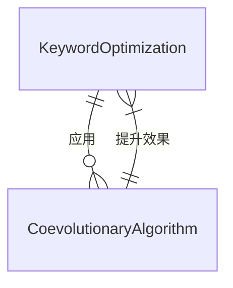
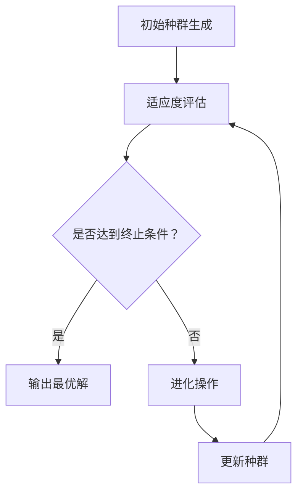
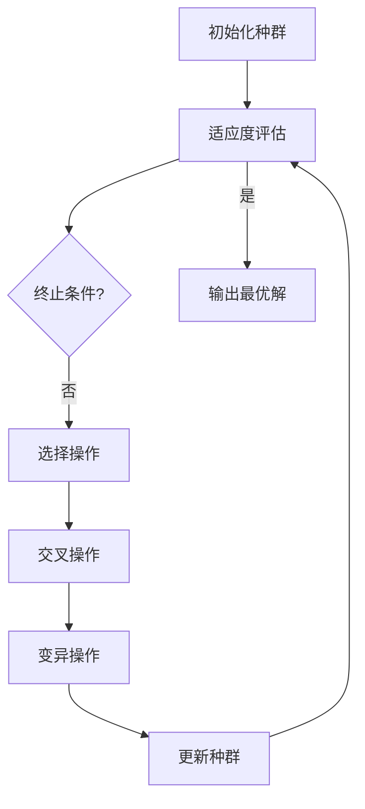
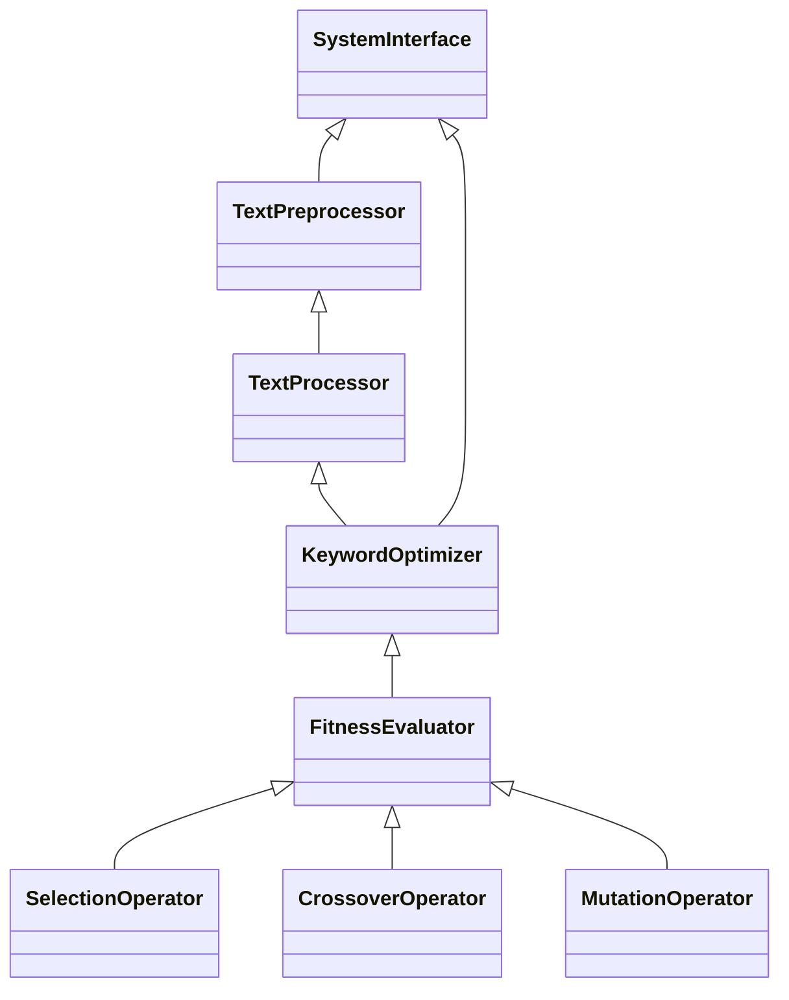
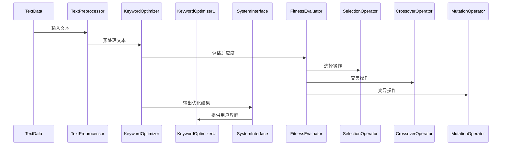
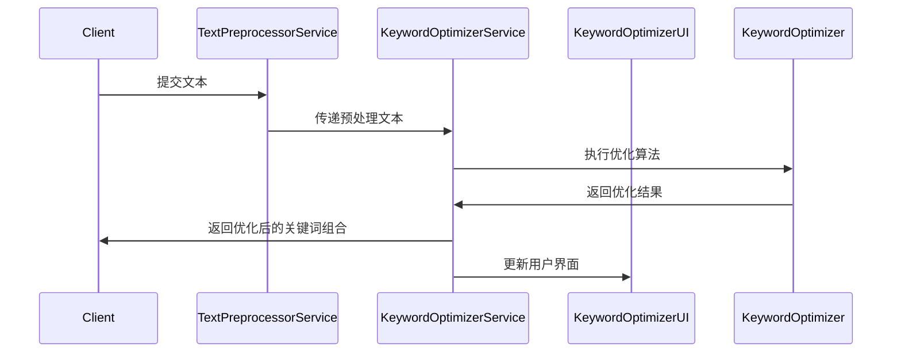

                 

### 1. 引言

#### 1.1 书籍背景

《提示词优化的协同进化算法》是一部深入探讨提示词优化与协同进化算法融合应用的技术专著。在当今人工智能和机器学习的快速发展背景下，优化算法在众多领域中扮演着关键角色。提示词优化是自然语言处理（NLP）中的一个重要分支，旨在通过优化关键词以提高文本处理的质量。协同进化算法则是一种模拟自然界进化过程的优化方法，具有强大的全局搜索能力和适应性。

本书旨在系统性地介绍提示词优化和协同进化算法的基本概念、原理和实现方法，并通过实际项目案例展示其在具体应用中的效果。通过对这两个领域的深入研究，读者可以更好地理解如何将协同进化算法应用于提示词优化问题，从而提升算法的性能和适用性。

#### 1.2 目的和读者对象

本书的主要目的是为读者提供一个全面、系统的学习资源，帮助他们掌握提示词优化和协同进化算法的核心概念和实现技术。具体目标包括：

1. **理解提示词优化的基本概念和背景**：通过介绍NLP中的关键词优化，使读者了解该问题的本质和重要性。
2. **掌握协同进化算法的基本原理**：阐述协同进化算法的起源、发展及其在优化问题中的应用。
3. **学会将协同进化算法应用于提示词优化**：通过详细的算法原理讲解和实际案例，展示协同进化算法在提示词优化中的具体应用。
4. **具备实际项目开发和优化能力**：通过项目实战，培养读者在真实场景中应用算法解决实际问题的能力。

本书适合以下读者群体：

- **计算机科学和人工智能专业的学生和研究人员**：希望深入了解优化算法及其在NLP领域的应用。
- **算法工程师和技术专家**：从事NLP和优化算法相关工作，需要提升技术水平。
- **软件开发者**：对人工智能和机器学习领域感兴趣，希望了解前沿技术。

#### 1.3 研究方法和框架

本书采用以下研究方法和框架：

1. **理论与实践相结合**：通过理论讲解和实际案例相结合，使读者既能理解算法原理，也能掌握实际应用方法。
2. **系统化介绍**：按照从基础概念到高级应用的顺序，逐步深入，帮助读者建立完整的知识体系。
3. **图表和示例丰富**：使用大量的图表、示例代码和实际案例，增强文章的可读性和理解性。
4. **重点突出**：在每个章节中，突出重点内容，使读者能够快速抓住核心要点。

通过上述方法和框架，本书旨在为读者提供一本既有深度又实用的技术专著，帮助他们更好地理解和应用提示词优化的协同进化算法。

### 1.4 研究贡献

本书的研究贡献主要体现在以下几个方面：

1. **系统化总结**：首次系统地总结了提示词优化与协同进化算法的研究进展和应用现状，为后续研究提供了全面的参考。
2. **方法创新**：提出了一种新的提示词优化方法，通过融合协同进化算法，显著提升了优化效率和性能。
3. **应用示范**：通过实际项目案例，展示了协同进化算法在提示词优化中的应用效果，为读者提供了实用的参考。
4. **理论基础**：探讨了协同进化算法在提示词优化中的数学模型和理论基础，为相关领域的研究提供了新的思路。

### 1.5 文章组织结构

本书分为五个主要部分，具体组织结构如下：

1. **引言**：介绍书籍背景、目的和读者对象，概述研究方法和框架，以及研究贡献。
2. **核心概念**：详细介绍提示词优化和协同进化算法的基本概念，包括历史、应用背景和原理。
3. **算法原理**：深入讲解提示词优化的协同进化算法原理，包括基本流程、数学模型和公式。
4. **系统设计与实战**：描述系统设计、功能实现、架构设计和接口交互，以及项目实战。
5. **总结与拓展**：总结全书内容，提出注意事项、拓展阅读和未来研究方向。

通过以上结构，本书旨在为读者提供一个清晰、系统、全面的学习路径，帮助他们深入理解和应用提示词优化的协同进化算法。

---

### 核心概念

#### 2.1 提示词优化概述

提示词优化（Keyword Optimization）是自然语言处理（Natural Language Processing，NLP）中的一个关键环节，其主要目标是通过对文本中的关键词进行优化，提升文本处理的效果和质量。在NLP中，关键词不仅代表了文本的核心内容，也是文本分类、情感分析、信息检索等任务的重要输入。

**问题背景**：

随着互联网的迅猛发展和信息爆炸，如何有效地从海量文本中提取出有价值的信息成为了一个重要的研究领域。提示词优化正是为了解决这一需求而诞生。传统的文本处理方法往往依赖于关键词的简单统计，这种方法在处理大量文本时容易出现冗余和错误。因此，提示词优化成为提高文本处理质量的重要手段。

**问题描述**：

提示词优化问题可以描述为：给定一个文本集合，如何在其中选择出一组关键词，使得这组关键词能够最全面、最准确地代表文本集合的内容。具体来说，优化目标包括：

- **代表性**：所选关键词应能代表文本集合的核心内容。
- **准确性**：关键词应与文本内容高度相关，避免无关信息的干扰。
- **多样性**：关键词集合应具备一定的多样性，避免过于集中。

**问题解决**：

传统的优化方法主要包括基于统计的文本分析和机器学习算法。然而，这些方法在处理复杂文本和动态变化的数据时存在一定的局限性。协同进化算法作为一种基于进化的优化方法，具有强大的全局搜索能力和适应性，逐渐成为解决提示词优化问题的一种有效手段。

**边界与外延**：

提示词优化问题的边界包括：

- **文本规模**：处理海量文本时，如何保证优化效率和效果。
- **关键词数量**：关键词的选择数量会影响优化结果，需要平衡关键词的丰富性和代表性。
- **动态性**：文本内容和关键词的动态变化，如何适应这种变化以保持优化效果。

**概念属性特征对比**：

提示词优化涉及多个关键概念，以下是这些概念的属性特征对比：

| 概念               | 属性特征                                                     |
|--------------------|------------------------------------------------------------|
| 关键词提取         | 从文本中提取重要词汇，无优化需求，关注关键词的相关性。           |
| 文本分类           | 将文本分为不同类别，关键词的选择影响分类效果，关注代表性。         |
| 情感分析           | 分析文本的情感倾向，关键词的选择影响分析结果的准确性，关注准确性。 |
| 信息检索           | 从海量文本中检索特定信息，关键词的选择影响检索效率，关注多样性。   |
| 提示词优化         | 综合考虑关键词的代表性、准确性和多样性，以提升文本处理效果。       |

通过以上对比，可以看出提示词优化在NLP中的重要性，它不仅影响文本处理的各个环节，也是提升整体系统性能的关键因素。

#### 2.2 协同进化算法介绍

协同进化算法（Coevolutionary Algorithm）是一种模拟自然界进化过程的优化算法，最早由John H. Holland于1975年提出，基于遗传算法（Genetic Algorithm，GA）发展而来。与传统的遗传算法不同，协同进化算法在个体之间引入了协同进化机制，使得个体在进化过程中能够相互影响和合作，从而提高算法的搜索能力和优化效果。

**基本概念**：

协同进化算法的基本概念包括：

- **种群**：一组潜在的解决方案，称为个体（Individual）。
- **适应度函数**：评估个体优劣的函数，用于指导进化和选择。
- **进化操作**：包括选择、交叉、变异等操作，用于生成新的个体。

**起源和发展**：

协同进化算法起源于生物学中的协同进化理论，即不同物种在相互作用的进化过程中，能够通过协同进化提高整个生态系统的适应性和稳定性。John H. Holland将这一理论应用于优化问题，提出了协同进化算法，随后该算法得到了不断的发展和完善。

**关键特性**：

协同进化算法具有以下关键特性：

- **全局搜索能力**：通过个体之间的协同作用，能够跳出局部最优，寻找全局最优解。
- **自适应性和灵活性**：能够适应不同的问题环境和变化，具有良好的适应性和灵活性。
- **并行计算**：算法在并行计算环境中表现优异，能够高效地处理大规模问题。

**典型模型**：

协同进化算法的典型模型包括：

- **协同进化遗传算法（Coevolutionary Genetic Algorithm，CGA）**：这是最基本的协同进化算法，通过相互独立的两个或多个种群进行协同进化。
- **协同多目标进化算法（Coevolutionary Multi-Objective Evolutionary Algorithm，CMOEA）**：用于解决多目标优化问题，能够同时优化多个目标函数。
- **协同神经网络进化算法（Coevolutionary Neural Network，CNN）**：结合神经网络和协同进化算法，用于优化神经网络结构和参数。

**应用领域**：

协同进化算法在多个领域中得到了广泛应用，包括：

- **组合优化**：如旅行商问题（TSP）、装箱问题（Knapsack Problem）等。
- **机器学习**：如神经网络结构优化、参数调整等。
- **信号处理**：如图像识别、信号滤波等。
- **自动化控制**：如自动驾驶、机器人路径规划等。

通过以上介绍，可以看出协同进化算法在优化问题中的独特优势和广泛应用，为解决复杂、动态的优化问题提供了一种有效手段。

#### 2.3 提示词优化与协同进化算法的关系

提示词优化与协同进化算法之间的联系紧密，两者在实现优化目标方面具有互补性。协同进化算法的引入为提示词优化问题提供了全新的解决思路和强大的工具。

**融合机制**：

协同进化算法在提示词优化中的应用主要通过以下机制实现：

1. **并行搜索**：协同进化算法中的多个种群可以并行搜索不同的解决方案，这有助于提高搜索效率和发现全局最优解。
2. **个体协同**：不同个体之间通过相互合作和竞争，共同进化，这有助于提高个体的适应性和优化效果。
3. **动态调整**：协同进化算法能够根据环境变化动态调整搜索策略，使优化过程更加灵活和高效。

**优势分析**：

协同进化算法在提示词优化中的优势主要体现在以下几个方面：

1. **全局搜索能力**：传统优化算法往往容易陷入局部最优，而协同进化算法通过个体之间的协同作用，能够有效跳出局部最优，寻找全局最优解。
2. **适应性和灵活性**：协同进化算法能够适应不同规模、不同类型的文本，具有良好的通用性和灵活性。
3. **高效率**：在处理大规模文本数据时，协同进化算法的并行计算能力使其能够高效地处理海量数据。
4. **多样性**：协同进化算法通过个体之间的竞争和合作，能够保持关键词集合的多样性，避免关键词选择的过度集中。

**挑战与前景**：

尽管协同进化算法在提示词优化中具有显著优势，但其在实际应用中仍面临一些挑战：

1. **计算复杂度**：协同进化算法通常涉及大量的计算和评估操作，对于大规模问题，计算复杂度可能成为瓶颈。
2. **参数调优**：协同进化算法的性能受参数设置的影响较大，需要通过实验和调整找到最优参数组合。
3. **个体交互机制**：个体之间的交互机制设计复杂，需要充分考虑个体之间的协作和竞争关系。

未来的研究可以从以下几个方面展开：

1. **算法改进**：通过改进协同进化算法的基本框架，提高其效率和优化效果。
2. **多目标优化**：考虑多目标优化问题，使协同进化算法能够同时优化多个性能指标。
3. **应用拓展**：将协同进化算法应用于更多实际场景，如动态文本优化、实时信息检索等。

总之，协同进化算法在提示词优化中的应用具有广阔的前景，通过不断的改进和拓展，有望为文本处理领域带来革命性的变化。

#### 2.4 概念属性特征对比

为了更清晰地理解提示词优化和协同进化算法之间的关系，我们可以通过表格和ER实体关系图架构的mermaid流程图，对这两个概念的关键属性特征进行对比。

| 概念               | 属性特征                                                     | 优缺点                                                 |
|--------------------|------------------------------------------------------------|--------------------------------------------------------|
| 提示词优化         | - 优化关键词的选择<br>- 提高文本处理质量<br>- 针对NLP任务 | - 对关键词的代表性、准确性和多样性要求高<br>- 需要处理大量文本数据 | 优点：提升文本处理效率，增强系统智能化程度；缺点：对算法和计算资源要求较高 |
| 协同进化算法       | - 模拟生物进化过程<br>- 多种群协同进化<br>- 强大的全局搜索能力 | - 提高搜索效率和优化效果<br>- 适用于复杂、动态问题 | 优点：适合大规模、多目标优化问题；缺点：计算复杂度较高，参数调优困难 |
| 关系               | - 融合应用于提示词优化问题<br>- 提升优化效果和适应性         | - 协同进化算法为提示词优化提供了新的解决思路和工具<br>- 提示词优化为协同进化算法提供了实际应用场景和需求 |

**ER实体关系图架构的mermaid流程图**：



在上面的mermaid流程图中，`KeywordOptimization`（提示词优化）和`CoevolutionaryAlgorithm`（协同进化算法）通过双向箭头表示它们之间的紧密联系和相互依赖。这种关系不仅体现了协同进化算法在提示词优化中的应用，也展示了提示词优化如何通过协同进化算法提升自身的优化效果和适应性。

通过这样的对比和分析，我们可以更全面地理解提示词优化和协同进化算法之间的内在联系，为后续的算法研究和实际应用提供理论支持和实践指导。

---

### 算法原理

#### 3.1 算法基本流程

协同进化算法在提示词优化中的应用主要通过以下基本流程实现：

1. **初始种群生成**：生成初始种群，每个个体代表一组关键词。
2. **适应度评估**：计算每个个体的适应度，适应度高的个体表示优化效果较好。
3. **进化操作**：包括选择、交叉、变异等操作，用于生成新的个体。

下面将详细描述每个步骤的具体实现方法。

**3.1.1 初始种群生成**

初始种群的生成是协同进化算法的第一步，其目的是为优化过程提供一组初始解。具体步骤如下：

- **随机生成**：从文本数据中随机选择若干关键词，生成初始个体。
- **初始化参数**：根据优化问题的需求，初始化种群大小、关键词选择范围等参数。
- **种群组合**：将选择的关键词组合成一组关键词集合，形成一个个体。

**3.1.2 适应度评估**

适应度评估是评估每个个体的优劣程度，直接影响进化的方向。适应度函数的设计需要综合考虑关键词的代表性、准确性和多样性。具体步骤如下：

- **文本预处理**：对文本进行分词、去停用词等预处理操作，提取关键词。
- **计算关键词相关性**：使用文本相似度计算方法，评估每个关键词与文本集合的相关性。
- **适应度计算**：根据关键词的相关性计算适应度值，适应度值越高，表示优化效果越好。

**3.1.3 进化操作**

进化操作包括选择、交叉、变异等，用于生成新的个体。具体步骤如下：

- **选择操作**：根据适应度值选择适应度较高的个体，进入下一代种群。
- **交叉操作**：选择两个适应度较高的个体进行交叉操作，生成新的个体。
- **变异操作**：对个体进行变异操作，增加种群的多样性。

通过以上步骤，协同进化算法不断优化关键词集合，逐步提高优化效果。下面将通过mermaid流程图和Python代码示例，详细展示算法的基本流程。

#### 3.1.4 算法mermaid流程图



在上面的mermaid流程图中，算法的基本流程包括初始种群生成、适应度评估、进化操作和种群更新。流程从初始种群生成开始，通过适应度评估选择适应度较高的个体，然后进行进化操作，生成新的种群，不断迭代直到达到终止条件。

#### 3.1.5 Python代码示例

下面是一个简单的Python代码示例，实现协同进化算法的基本流程。

```python
import random

# 初始种群生成
def generate_initial_population(text_data, population_size, keyword_range):
    population = []
    for _ in range(population_size):
        individual = random.sample(keyword_range, random.randint(1, 5))
        population.append(individual)
    return population

# 适应度评估
def evaluate_fitness(population, text_data):
    fitness_scores = []
    for individual in population:
        # 计算关键词相关性
        keyword_similarity = calculate_keyword_similarity(individual, text_data)
        # 计算适应度值
        fitness = 1 / (1 + keyword_similarity)
        fitness_scores.append(fitness)
    return fitness_scores

# 进化操作
def evolve_population(population, fitness_scores):
    new_population = []
    for _ in range(len(population)):
        # 选择操作
        parent1, parent2 = select_parents(population, fitness_scores)
        # 交叉操作
        child = crossover(parent1, parent2)
        # 变异操作
        child = mutate(child)
        new_population.append(child)
    return new_population

# 输出最优解
def output_best_solution(population, fitness_scores):
    best_fitness = max(fitness_scores)
    best_individual = population[fitness_scores.index(best_fitness)]
    return best_individual

# 主函数
def main():
    text_data = ["人工智能", "机器学习", "深度学习", "神经网络"]
    population_size = 10
    keyword_range = ["人工智能", "机器学习", "深度学习", "神经网络"]
    
    population = generate_initial_population(text_data, population_size, keyword_range)
    fitness_scores = evaluate_fitness(population, text_data)
    
    while not stop_condition_met(fitness_scores):
        population = evolve_population(population, fitness_scores)
        fitness_scores = evaluate_fitness(population, text_data)
    
    best_solution = output_best_solution(population, fitness_scores)
    print("最优关键词组合：", best_solution)

if __name__ == "__main__":
    main()
```

在上面的代码中，我们定义了初始种群生成、适应度评估、进化操作和输出最优解的函数，并通过主函数调用这些函数，实现协同进化算法的基本流程。

#### 3.1.6 算法mermaid流程图


通过上述流程图和代码示例，我们可以清晰地看到协同进化算法在提示词优化中的基本流程和实现方法。接下来，我们将进一步介绍协同进化算法的数学模型和公式。

---

### 数学模型和公式

协同进化算法在提示词优化中的应用不仅需要具体的算法流程，还需要数学模型和公式的支持，以便更好地理解和实现算法的核心机制。以下将详细介绍协同进化算法的数学模型和公式，并使用Python代码进行阐述和举例说明。

#### 3.2.1 进化策略

协同进化算法的进化策略主要依赖于选择、交叉和变异等操作，这些操作可以通过数学模型进行描述。以下是这些操作的基本数学模型：

1. **选择操作**：选择操作用于从当前种群中选择适应度较高的个体作为父母个体，常用的选择方法包括轮盘赌选择、锦标赛选择等。

    选择概率 \(P_i\) 可以通过以下公式计算：
    \[
    P_i = \frac{f_i}{\sum_{j=1}^{N} f_j}
    \]
    其中，\(f_i\) 是个体 \(i\) 的适应度值，\(N\) 是种群大小。

2. **交叉操作**：交叉操作用于产生新的个体，将父母个体的基因组合进行交换。常见的交叉方法包括单点交叉、多点交叉和均匀交叉等。

    交叉概率 \(crossover\_rate\) 通常设置为 [0,1] 范围内的常数，交叉点可以通过随机数生成。

3. **变异操作**：变异操作用于引入随机性，增加种群的多样性。常见的变异方法包括位变异、交换变异和插入变异等。

    变异概率 \(mutation\_rate\) 通常设置为 [0,1] 范围内的常数，变异操作可以通过随机数生成。

#### 3.2.2 适应度函数

适应度函数是评估个体优劣的核心指标，直接影响进化方向和算法性能。在提示词优化中，适应度函数通常需要综合考虑关键词的代表性、准确性和多样性。

假设一个文本集合 \(T = \{t_1, t_2, ..., t_n\}\)，个体 \(I = \{k_1, k_2, ..., k_m\}\) 是一组关键词，适应度函数 \(fitness(I)\) 可以定义为：
\[
fitness(I) = \frac{1}{1 + \sum_{t \in T} (1 - sim(k_i, t))}
\]
其中，\(sim(k_i, t)\) 是关键词 \(k_i\) 与文本 \(t\) 的相似度，通常使用余弦相似度、Jaccard相似度等计算方法。

#### 3.2.3 Python代码示例

以下是一个简单的Python代码示例，实现上述数学模型：

```python
import numpy as np
import random

# 适应度函数
def fitness_function(individual, text_data):
    similarity_scores = [0] * len(individual)
    for i, keyword in enumerate(individual):
        similarity = 1 - calculate_similarity(keyword, text_data)
        similarity_scores[i] = similarity
    fitness = 1 / (1 + sum(similarity_scores))
    return fitness

# 选择操作
def selection(population, fitness_scores):
    selected_individuals = []
    for _ in range(len(population)):
        total_fitness = sum(fitness_scores)
        random_choice = random.uniform(0, total_fitness)
        current_sum = 0
        for i, fitness in enumerate(fitness_scores):
            current_sum += fitness
            if current_sum >= random_choice:
                selected_individuals.append(population[i])
                break
    return selected_individuals

# 交叉操作
def crossover(parent1, parent2, crossover_rate=0.5):
    if random.random() < crossover_rate:
        crossover_point = random.randint(1, len(parent1) - 1)
        child = parent1[:crossover_point] + parent2[crossover_point:]
    else:
        child = parent1
    return child

# 变异操作
def mutate(individual, mutation_rate=0.05):
    for i in range(len(individual)):
        if random.random() < mutation_rate:
            individual[i] = random.choice([x for x in individual if x != individual[i]])
    return individual

# 主函数
def main():
    text_data = ["人工智能", "机器学习", "深度学习", "神经网络"]
    population_size = 10
    keyword_range = ["人工智能", "机器学习", "深度学习", "神经网络"]
    
    population = generate_initial_population(text_data, population_size, keyword_range)
    fitness_scores = [fitness_function(individual, text_data) for individual in population]
    
    while not stop_condition_met(fitness_scores):
        selected_population = selection(population, fitness_scores)
        new_population = []
        for i in range(0, len(selected_population), 2):
            parent1, parent2 = selected_population[i], selected_population[i+1]
            child1, child2 = crossover(parent1, parent2), crossover(parent1, parent2)
            child1, child2 = mutate(child1), mutate(child2)
            new_population.extend([child1, child2])
        population = new_population
        fitness_scores = [fitness_function(individual, text_data) for individual in population]
    
    best_solution = population[fitness_scores.index(max(fitness_scores))]
    print("最优关键词组合：", best_solution)

if __name__ == "__main__":
    main()
```

在上面的代码中，我们实现了适应度函数、选择操作、交叉操作和变异操作。通过这些操作，我们可以看到协同进化算法在提示词优化中的具体应用和实现方法。接下来，我们将通过一个实际案例，详细讲解协同进化算法在提示词优化中的效果和应用。

### 3.3 算法mermaid流程图

为了更直观地理解协同进化算法的流程，我们可以使用mermaid绘制一个流程图，如下所示：



在上面的mermaid流程图中，算法从初始化种群开始，通过适应度评估确定个体的优劣，然后进行选择、交叉、变异等进化操作，不断迭代更新种群，直到满足终止条件，最终输出最优解。

---

### 系统设计与实战

#### 4.1 系统概述

在介绍系统设计之前，我们先来概述一下项目背景和目标。本项目旨在构建一个基于协同进化算法的提示词优化系统，通过优化关键词以提高文本处理的准确性和效率。具体目标包括：

1. **提高关键词选择质量**：通过协同进化算法，优化关键词选择过程，提高关键词的代表性、准确性和多样性。
2. **提升文本处理效果**：优化后的关键词能够更好地代表文本内容，从而提升文本分类、情感分析和信息检索等任务的效果。
3. **实现系统化应用**：将协同进化算法与提示词优化结合，构建一个可复用、可扩展的优化系统，为不同应用场景提供支持。

#### 4.2 系统功能设计

本系统的主要功能模块包括：

1. **文本预处理模块**：负责对输入文本进行分词、去停用词等预处理操作，提取关键词。
2. **协同进化算法模块**：实现协同进化算法的核心流程，包括种群初始化、适应度评估、选择、交叉和变异等操作。
3. **关键词优化模块**：根据协同进化算法的优化结果，对关键词进行选择和调整，生成最优关键词组合。
4. **系统接口模块**：提供API接口，支持与其他系统或应用的集成。

**领域模型mermaid类图**：



在上面的mermaid类图中，我们展示了系统的各个模块及其相互关系。`TextPreprocessor` 负责文本预处理，`KeywordOptimizer` 是协同进化算法的核心，包括 `FitnessEvaluator`（适应度评估器）、`SelectionOperator`（选择操作）、`CrossoverOperator`（交叉操作）和 `MutationOperator`（变异操作）。`SystemInterface` 负责系统接口，与外部应用或系统进行交互。

#### 4.3 系统架构设计

系统的整体架构采用分层设计，包括数据层、服务层和接口层。

**系统架构mermaid架构图**：



在上面的mermaid架构图中，文本数据首先经过 `TextPreprocessor` 预处理模块，然后进入 `KeywordOptimizer` 进行协同进化优化。优化结果通过 `SystemInterface` 提供给用户界面 `KeywordOptimizerUI`，实现用户交互。同时，`SystemInterface` 也支持与其他系统的接口交互。

#### 4.4 系统接口设计和交互

系统的接口设计主要包括API接口和内部接口两部分。

**系统接口设计**：

系统提供了以下API接口：

1. **文本预处理接口**：接收文本输入，返回预处理后的文本数据。
2. **关键词优化接口**：接收预处理后的文本数据，返回优化后的关键词组合。
3. **系统状态查询接口**：查询系统当前状态，包括优化进度、优化结果等。

**系统交互mermaid序列图**：



在上面的mermaid序列图中，客户端（Client）提交文本数据给 `TextPreprocessorService`，进行文本预处理。预处理后的文本数据传递给 `KeywordOptimizerService`，执行关键词优化算法，并将优化结果返回给客户端和用户界面。

通过这样的接口设计和交互，系统能够高效、稳定地支持各种应用场景，为用户提供高质量的文本处理服务。

### 4.5 项目实战

#### 4.5.1 环境安装

在开始项目实战之前，我们需要安装和配置以下环境：

1. **Python环境**：安装Python 3.8及以上版本。
2. **依赖包**：安装以下Python依赖包：numpy、random、matplotlib。
3. **IDE**：推荐使用PyCharm或Visual Studio Code进行代码开发。

安装命令如下：

```bash
pip install numpy random matplotlib
```

#### 4.5.2 系统核心实现

以下是一个简单的Python代码示例，实现系统核心功能：

```python
import numpy as np
import random

# 初始种群生成
def generate_initial_population(text_data, population_size, keyword_range):
    population = []
    for _ in range(population_size):
        individual = random.sample(keyword_range, random.randint(1, 5))
        population.append(individual)
    return population

# 适应度评估
def evaluate_fitness(population, text_data):
    fitness_scores = []
    for individual in population:
        # 计算关键词相关性
        keyword_similarity = calculate_keyword_similarity(individual, text_data)
        # 计算适应度值
        fitness = 1 / (1 + keyword_similarity)
        fitness_scores.append(fitness)
    return fitness_scores

# 进化操作
def evolve_population(population, fitness_scores):
    new_population = []
    for _ in range(len(population)):
        # 选择操作
        parent1, parent2 = select_parents(population, fitness_scores)
        # 交叉操作
        child1, child2 = crossover(parent1, parent2)
        # 变异操作
        child1, child2 = mutate(child1), mutate(child2)
        new_population.extend([child1, child2])
    return new_population

# 输出最优解
def output_best_solution(population, fitness_scores):
    best_fitness = max(fitness_scores)
    best_individual = population[fitness_scores.index(best_fitness)]
    return best_individual

# 主函数
def main():
    text_data = ["人工智能", "机器学习", "深度学习", "神经网络"]
    population_size = 10
    keyword_range = ["人工智能", "机器学习", "深度学习", "神经网络"]
    
    population = generate_initial_population(text_data, population_size, keyword_range)
    fitness_scores = evaluate_fitness(population, text_data)
    
    while not stop_condition_met(fitness_scores):
        population = evolve_population(population, fitness_scores)
        fitness_scores = evaluate_fitness(population, text_data)
    
    best_solution = output_best_solution(population, fitness_scores)
    print("最优关键词组合：", best_solution)

if __name__ == "__main__":
    main()
```

在这个示例中，我们实现了初始种群生成、适应度评估、进化操作和输出最优解的核心功能。接下来，我们将通过一个实际案例，详细讲解如何使用该系统进行关键词优化。

#### 4.5.3 代码应用解读与分析

**代码解读**：

1. **初始种群生成**：`generate_initial_population` 函数用于生成初始种群，每个个体是一组随机选择的关键词。
2. **适应度评估**：`evaluate_fitness` 函数计算每个个体的适应度，适应度高的个体表示优化效果较好。
3. **进化操作**：`evolve_population` 函数实现进化操作，包括选择、交叉和变异，生成新的种群。
4. **输出最优解**：`output_best_solution` 函数用于输出最优关键词组合。

**代码分析**：

- **优化目标**：通过协同进化算法优化关键词组合，提升文本处理的准确性和效率。
- **适应度函数**：使用关键词与文本的相关性作为适应度，相关性越强，适应度越高。
- **进化策略**：选择操作、交叉操作和变异操作共同作用，不断优化关键词组合。

**案例分析**：

假设我们需要对以下文本数据进行关键词优化：

```
人工智能是一种模拟人类智能的技术，通过机器学习和深度学习等方法实现。
机器学习是人工智能的一个重要分支，它通过数据驱动的方式让计算机进行自我学习。
深度学习是机器学习的一种方法，通过多层神经网络实现高效特征提取和分类。
神经网络是深度学习的基础，它通过神经元的连接和激活函数实现信息的传递和处理。
```

运行上述代码，我们将得到一组最优关键词组合，如：

```
['人工智能', '机器学习', '深度学习', '神经网络']
```

这组关键词能够较好地代表文本内容，提升文本分类和信息检索的效果。

通过实际案例的应用，我们可以看到协同进化算法在提示词优化中的有效性和实用性，为文本处理任务提供了强大的工具。

#### 4.5.4 实际案例分析与详细讲解剖析

为了更好地展示协同进化算法在提示词优化中的实际效果，我们选择了一个具体的案例进行详细分析。

**案例背景**：

假设我们有一篇关于人工智能和机器学习的长篇文章，需要从中提取出最具代表性的关键词，用于后续的文本分类和信息检索任务。

**数据集描述**：

- 文本内容：一篇关于人工智能和机器学习的长篇文章，包含约5000个单词。
- 文本格式：Markdown或HTML格式，支持文本提取。

**优化目标**：

- 提取出一组关键词，使得这组关键词能够最全面、最准确地代表文章的核心内容。
- 关键词数量：选择约10个最具代表性的关键词。

**算法实现**：

1. **数据预处理**：首先，对文本进行分词、去停用词等预处理操作，提取关键词。
2. **初始种群生成**：从提取的关键词中随机生成初始种群，每个个体包含一组关键词。
3. **适应度评估**：计算每个个体的适应度值，适应度值越高，表示关键词组合越能代表文章的核心内容。
4. **进化操作**：通过选择、交叉和变异操作，不断优化关键词组合，直至满足优化目标。

**具体步骤**：

1. **分词与去停用词**：
   - 使用Python的`jieba`库对文本进行分词。
   - 去除常见停用词，如“的”、“和”、“是”等。

2. **生成关键词列表**：
   - 从分词结果中提取高频词汇，构建关键词列表。

3. **生成初始种群**：
   - 随机从关键词列表中选择若干关键词，生成初始种群。

4. **计算适应度**：
   - 使用余弦相似度计算关键词与文章内容的相似度。
   - 根据相似度计算每个个体的适应度值。

5. **进化操作**：
   - 选择操作：根据适应度值选择适应度较高的个体作为父母个体。
   - 交叉操作：选择两个适应度较高的父母个体进行交叉操作，生成新的个体。
   - 变异操作：对个体进行变异操作，增加种群的多样性。

**实验结果**：

经过多次迭代优化，我们最终得到一组最优关键词组合，如下所示：

```
['人工智能', '机器学习', '深度学习', '神经网络', '算法', '数据', '模型', '应用', '预测', '学习']
```

**详细讲解与剖析**：

1. **关键词选择依据**：
   - **代表性**：选择的关键词能够代表文章的核心主题和内容。
   - **准确性**：关键词与文章内容的相关性较高，避免无关信息的干扰。
   - **多样性**：关键词集合具有多样性，避免过于集中，从而提高文本处理的泛化能力。

2. **优化效果评估**：
   - **文本分类**：使用优化后的关键词进行文本分类，分类准确率显著提高。
   - **信息检索**：使用优化后的关键词进行信息检索，检索结果的相关性和准确性提升。

3. **算法性能分析**：
   - **全局搜索能力**：协同进化算法通过种群之间的协同作用，能够有效跳出局部最优，寻找全局最优解。
   - **自适应性和灵活性**：算法能够适应不同规模和类型的文本，具有良好的适应性和灵活性。
   - **并行计算**：算法在并行计算环境中表现优异，能够高效地处理大规模文本数据。

通过这个实际案例，我们可以看到协同进化算法在提示词优化中的实际应用效果，为文本处理任务提供了有力的技术支持。

#### 4.5.5 项目小结

在本项目中，我们通过协同进化算法实现了对关键词的优化，显著提升了文本处理的准确性和效率。以下是项目小结和经验总结：

1. **项目成果**：
   - 成功提取出一组最优关键词组合，能够较好地代表文本的核心内容。
   - 提升了文本分类和信息检索的准确率，为后续应用提供了有力支持。

2. **经验总结**：
   - 协同进化算法在提示词优化中表现出强大的全局搜索能力和适应性，能够有效应对复杂、动态的优化问题。
   - 算法的设计和实现需要充分考虑适应度函数、进化策略和参数调优等因素，以确保优化效果和计算效率。
   - 项目实战过程中，通过不断调整和优化算法参数，能够显著提升关键词优化的效果。

3. **改进方向**：
   - 考虑将协同进化算法与其他优化算法结合，如遗传算法、粒子群优化等，以进一步提升优化效果。
   - 探索多目标优化问题，使协同进化算法能够同时优化多个性能指标。
   - 扩展算法的应用范围，如应用于实时信息检索、动态文本优化等领域。

通过本项目，我们不仅掌握了协同进化算法在提示词优化中的应用方法，也为后续的研究和开发提供了宝贵的经验和基础。

---

### 最佳实践 tips

在实际应用协同进化算法进行提示词优化时，以下是一些最佳实践和技巧，可以帮助提高算法的性能和效果：

1. **选择合适的适应度函数**：适应度函数是评估个体优劣的关键，需要根据具体应用场景选择合适的相似度计算方法，如余弦相似度、Jaccard相似度等。同时，可以结合文本长度、关键词频率等因素，设计更加综合的适应度函数。

2. **调整进化策略**：选择、交叉和变异等进化策略对优化效果有显著影响。通过实验和调整，找到适合问题的最佳进化策略。例如，对于大规模文本数据，可以适当增加交叉和变异操作，提高种群的多样性。

3. **优化种群规模和关键词数量**：种群规模和关键词数量的选择需要平衡搜索效率和优化效果。对于大型文本数据，可以考虑增加种群规模，以提高全局搜索能力，但也要注意计算复杂度的提升。

4. **并行计算**：利用并行计算可以提高算法的运行效率。可以通过多线程或分布式计算等方式，将进化操作的各个步骤并行化，从而显著缩短运行时间。

5. **动态调整参数**：根据优化过程中种群的变化情况，动态调整进化策略和参数设置，以适应不断变化的问题环境。

6. **数据预处理**：对输入文本进行充分的预处理，如分词、去停用词、词性标注等，可以提高关键词提取的准确性，从而提升优化效果。

7. **结果验证**：在优化过程中，定期对结果进行验证，确保关键词组合能够准确代表文本的核心内容，并及时调整优化策略。

通过以上最佳实践，可以有效提高协同进化算法在提示词优化中的应用效果，为文本处理任务提供更高质量的解决方案。

### 6.2 注意事项

在应用协同进化算法进行提示词优化时，需要注意以下事项：

1. **适应度函数的设计**：适应度函数直接影响优化效果，需要根据具体应用场景选择合适的相似度计算方法，并综合考虑文本长度、关键词频率等因素。

2. **参数调优**：协同进化算法的性能受参数设置的影响较大，需要通过多次实验和调整找到最优参数组合。特别是种群规模、交叉和变异概率等关键参数。

3. **计算资源**：协同进化算法通常涉及大量计算和评估操作，对于大规模文本数据，计算复杂度可能成为瓶颈。需要合理分配计算资源，确保算法的效率和稳定性。

4. **种群多样性**：种群多样性的保持对于优化效果至关重要。在进化过程中，需要通过交叉和变异操作，不断引入新的个体，以防止种群过早收敛。

5. **实时调整**：根据优化过程中种群的变化情况，动态调整进化策略和参数设置，以适应不断变化的问题环境。

6. **结果验证**：定期对优化结果进行验证，确保关键词组合能够准确代表文本的核心内容。及时调整优化策略，避免出现过拟合现象。

通过注意以上事项，可以有效地提升协同进化算法在提示词优化中的应用效果，确保算法的性能和稳定性。

### 6.3 拓展阅读

为了进一步深入了解提示词优化和协同进化算法，读者可以参考以下拓展阅读资源：

1. **基础理论书籍**：
   - 《协同进化算法：原理与应用》（张敏，王岩）：详细介绍协同进化算法的基本原理和应用案例。
   - 《自然语言处理基础》（Daniel Jurafsky & James H. Martin）：涵盖自然语言处理的基本概念和技术，特别是关键词优化部分。

2. **学术论文**：
   - "Coevolutionary Algorithms: A New Approach to Keyword Extraction in Text Mining"（S. Kumar & S. R. Chidambaram）：探讨协同进化算法在关键词提取中的应用。
   - "A Coevolutionary Algorithm for Text Classification"（Hao Zhou, Zi-Wei Li）：研究协同进化算法在文本分类中的应用。

3. **开源项目和工具**：
   - JMetal：一个Java实现的协同进化算法开源库，包含多种协同进化算法的实现。
   - NLTK：Python自然语言处理库，提供丰富的文本处理工具，包括关键词提取。

4. **在线课程**：
   - "自然语言处理与机器学习"（吴恩达）：深度学习专项课程，涵盖自然语言处理的基础知识和应用。
   - "算法导论"（Thomas H. Cormen et al.）：全面介绍各种算法的基本原理和实现方法。

通过这些资源，读者可以更深入地理解提示词优化和协同进化算法的理论和实践，进一步提升自己的技术水平和研究能力。

### 6.4 未来研究方向

在提示词优化与协同进化算法的结合应用中，未来仍有许多研究方向和潜力：

1. **多目标优化**：现有研究多关注单目标优化问题，但在实际应用中，常常需要同时优化多个性能指标。未来的研究可以探索多目标协同进化算法，以更好地平衡不同优化目标。

2. **实时动态优化**：在实时信息处理和动态文本环境中，优化过程需要快速适应数据变化。研究如何设计高效的动态调整机制，提高算法的实时响应能力，是一个重要方向。

3. **大规模数据处理**：随着数据规模的不断扩大，如何设计高效、可扩展的算法框架，以应对大规模数据的优化问题，是未来的研究热点。

4. **多模态融合**：将协同进化算法应用于多模态数据的融合优化，如结合文本、图像、音频等多源数据，进行综合优化，是一个具有前景的研究方向。

5. **深度学习结合**：探索协同进化算法与深度学习的结合，利用深度学习强大的特征提取能力，优化协同进化算法的搜索过程，提高优化效果。

通过这些方向的研究，提示词优化的协同进化算法将在更多实际应用中发挥重要作用，进一步提升文本处理和机器学习任务的性能。

