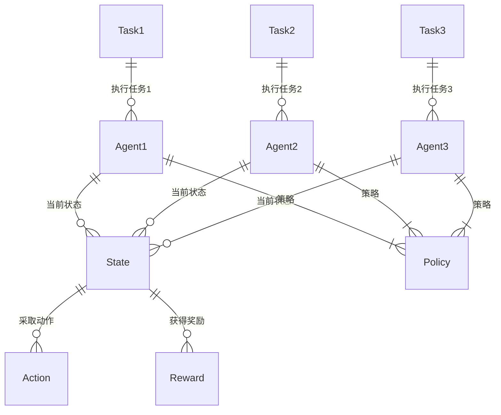
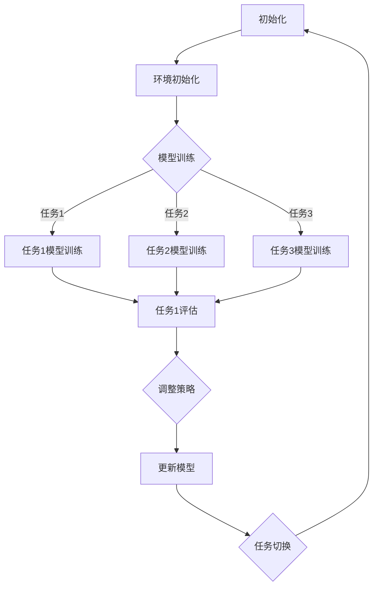
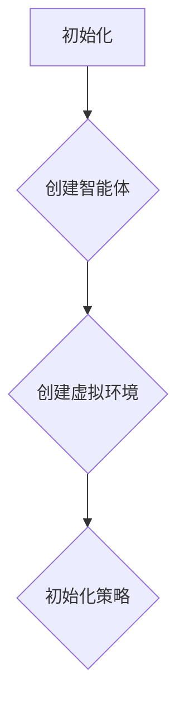
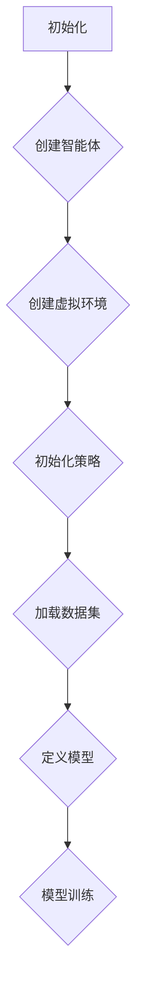
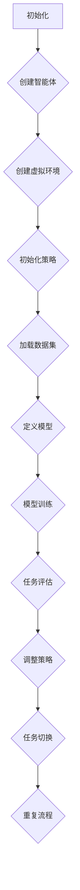
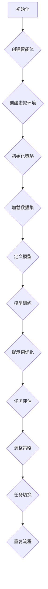
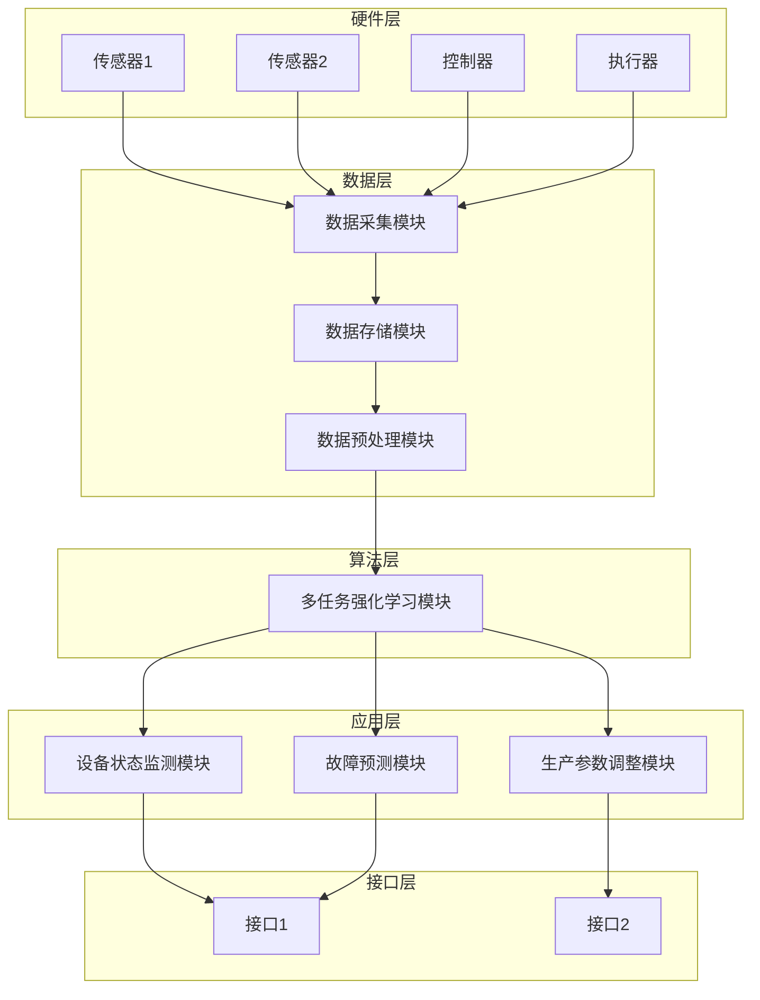
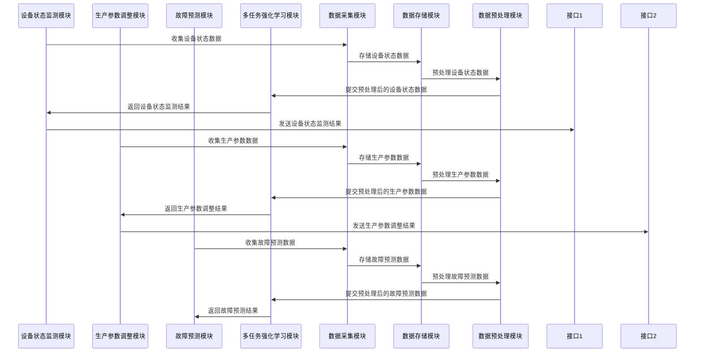

                 

## 文章标题

### 提示词优化的多任务强化学习方法

关键词：多任务学习、强化学习、提示词优化、算法原理、Python实现

摘要：本文深入探讨了提示词优化的多任务强化学习方法，首先介绍了多任务学习、强化学习和提示词优化的基本概念，然后阐述了多任务强化学习中的提示词优化策略，接着通过Python代码详细讲解了多任务强化学习算法的实现过程，最后分析了该方法的实际应用场景，为相关领域的研究和开发提供了有益的参考。

----------------------------------------------------------------

## 目录大纲：《提示词优化的多任务强化学习方法》

1. **问题背景与核心概念**
    1.1 **提示词优化在多任务学习中的重要性**
        1.1.1 **多任务学习的基本概念**
        1.1.2 **提示词优化与多任务学习的关系**
        1.1.3 **提示词优化的核心挑战**
    1.2 **强化学习方法概述**
        1.2.1 **强化学习的基本原理**
        1.2.2 **强化学习在多任务学习中的应用**
        1.2.3 **强化学习的主要挑战**
    1.3 **多任务强化学习中的提示词优化策略**
        1.3.1 **提示词优化的基本策略**
        1.3.2 **提示词优化的实现机制**
        1.3.3 **提示词优化的效果评估方法**
    1.4 **提示词优化的多任务强化学习方法的应用场景**
        1.4.1 **在自然语言处理中的应用**
        1.4.2 **在计算机视觉中的应用**
        1.4.3 **在其他领域中的应用**
    1.5 **本章小结**

2. **核心概念与联系**
    2.1 **多任务强化学习中的基本概念**
        2.1.1 **多任务学习的定义**
        2.1.2 **强化学习的定义**
        2.1.3 **提示词优化的定义**
    2.2 **多任务强化学习中的概念属性特征对比**
        2.2.1 **多任务学习与单任务学习的对比**
        2.2.2 **强化学习与监督学习的对比**
        2.2.3 **提示词优化与传统优化的对比**
    2.3 **多任务强化学习中的ER实体关系图**

3. **算法原理讲解**
    3.1 **多任务强化学习算法mermaid流程图**
    3.2 **Python源代码实现**
        3.2.1 **环境准备**
        3.2.2 **模型训练实现**
        3.2.3 **提示词优化实现**
    3.3 **算法原理详细讲解**
        3.3.1 **强化学习原理**
        3.3.2 **多任务学习原理**
        3.3.3 **提示词优化原理**

4. **系统分析与架构设计方案**
    4.1 **问题场景介绍**
    4.2 **项目介绍**
    4.3 **系统功能设计**
    4.4 **系统架构设计**
    4.5 **系统接口设计和系统交互**

5. **项目实战**
    5.1 **环境安装**
    5.2 **系统核心实现源代码**
    5.3 **代码应用解读与分析**
    5.4 **实际案例分析和详细讲解剖析**
    5.5 **项目小结**

6. **最佳实践 tips**
7. **小结**
8. **注意事项**
9. **拓展阅读**

## 第1章：问题背景与核心概念

### 1.1 提示词优化在多任务学习中的重要性

#### 1.1.1 多任务学习的基本概念

多任务学习（Multi-Task Learning，MTL）是机器学习中的一个重要研究方向，其核心思想是将多个相关任务同时进行学习，以期望通过任务之间的相互协作来提升模型的性能。多任务学习具有以下基本概念：

1. **任务相关性**：任务相关性指的是不同任务之间是否存在某种内在的联系或共享信息。任务相关性是决定多任务学习方法性能的关键因素之一。

2. **任务共享**：任务共享指的是在多任务学习中，不同任务是否共享某些相同的特征或参数。任务共享有助于提高模型的学习效率。

3. **模型权重共享**：模型权重共享指的是在多任务学习中，不同任务是否使用相同的模型权重。模型权重共享可以减少模型的参数数量，从而降低模型的复杂度。

#### 1.1.2 提示词优化与多任务学习的关系

提示词优化（Prompt Tuning）是一种用于调整预训练模型的方法，通过在预训练模型的基础上添加特定的提示词，使得模型能够更好地适应特定的任务。提示词优化在多任务学习中的应用主要体现在以下几个方面：

1. **任务适配**：通过提示词优化，可以调整预训练模型在特定任务上的表现，使其更符合任务的特性。

2. **性能提升**：提示词优化能够提高多任务学习模型在不同任务上的性能，使其在多个任务中均能够表现出良好的性能。

3. **计算效率**：提示词优化相较于从头训练模型，可以显著降低计算成本，提高模型的部署效率。

#### 1.1.3 提示词优化的核心挑战

尽管提示词优化在多任务学习中有很大的潜力，但在实际应用中仍然面临一些核心挑战：

1. **提示词选择**：如何选择合适的提示词是一个关键问题。选择不当的提示词可能导致模型性能下降。

2. **优化策略**：如何设计有效的优化策略以调整模型权重，使得模型能够更好地适应不同任务，这也是一个需要深入研究的问题。

3. **泛化能力**：提示词优化模型在不同任务上的性能可能会存在差异，如何提高模型的泛化能力是一个重要挑战。

### 1.2 强化学习方法概述

强化学习（Reinforcement Learning，RL）是一种通过试错和反馈来学习如何采取行动的机器学习方法。强化学习的核心目标是学习一个策略，使得智能体（agent）在特定环境中能够最大化累积奖励。

强化学习具有以下几个基本概念：

1. **状态（State）**：状态是环境的一个抽象表示，它包含了智能体当前所处的位置、环境中的其他实体等信息。

2. **动作（Action）**：动作是智能体可以采取的行为，它决定了智能体在环境中的下一个状态。

3. **奖励（Reward）**：奖励是智能体在每个状态采取动作后所获得的即时反馈，它用于指导智能体调整策略。

4. **策略（Policy）**：策略是智能体在特定状态下采取动作的概率分布，它决定了智能体的行为方式。

#### 1.2.1 强化学习的基本原理

强化学习的基本原理可以概括为以下几个步骤：

1. **初始化**：初始化智能体的状态、动作和策略。

2. **执行动作**：根据当前状态和策略，智能体选择一个动作。

3. **更新状态**：智能体执行动作后，环境会更新状态。

4. **获得奖励**：智能体根据动作和状态的变化，获得相应的奖励。

5. **更新策略**：根据获得的奖励，智能体调整策略，以期望在下一个状态中能够获得更高的奖励。

#### 1.2.2 强化学习在多任务学习中的应用

强化学习在多任务学习中的应用主要体现在以下几个方面：

1. **任务分解**：通过强化学习，可以将一个复杂的多任务问题分解为多个简单任务，每个任务分别由一个智能体进行学习。

2. **任务协同**：多个智能体可以通过强化学习相互协作，共同完成任务。

3. **任务切换**：在多任务环境中，智能体需要根据任务的重要性和紧急程度进行任务切换，强化学习可以提供有效的任务切换策略。

#### 1.2.3 强化学习的主要挑战

强化学习在多任务学习中的应用仍然面临一些挑战：

1. **任务依赖**：不同任务之间可能存在复杂的依赖关系，如何处理这些依赖关系是一个重要问题。

2. **稀疏奖励**：在多任务环境中，奖励通常是非常稀疏的，这使得智能体难以通过强化学习学习到有效的策略。

3. **模型复杂度**：多任务强化学习模型通常具有很高的复杂度，这使得模型的训练和优化变得困难。

### 1.3 多任务强化学习中的提示词优化策略

#### 1.3.1 提示词优化的基本策略

提示词优化的基本策略主要包括以下几种：

1. **基于规则的提示词设计**：根据任务的特点，设计特定的提示词，以引导模型在特定任务上产生更好的表现。

2. **基于学习的提示词优化**：利用机器学习方法，从大量数据中自动学习出最优的提示词组合。

3. **动态提示词调整**：根据任务的进展和模型的性能，动态调整提示词，以适应不断变化的环境。

#### 1.3.2 提示词优化的实现机制

提示词优化的实现机制主要包括以下几个步骤：

1. **数据预处理**：对原始数据进行预处理，提取出与任务相关的特征。

2. **提示词生成**：根据任务的特点，生成特定的提示词。

3. **模型训练**：使用生成的提示词对预训练模型进行微调，以适应特定的任务。

4. **性能评估**：评估模型在特定任务上的性能，并根据评估结果调整提示词。

#### 1.3.3 提示词优化的效果评估方法

提示词优化的效果评估方法主要包括以下几个指标：

1. **准确率（Accuracy）**：评估模型在特定任务上的预测准确性。

2. **召回率（Recall）**：评估模型在特定任务上的召回能力。

3. **F1分数（F1 Score）**：综合考虑准确率和召回率，用于评估模型的综合性能。

4. **学习曲线（Learning Curve）**：通过观察模型的训练过程，分析模型的学习能力和收敛速度。

### 1.4 提示词优化的多任务强化学习方法的应用场景

#### 1.4.1 在自然语言处理中的应用

在自然语言处理（Natural Language Processing，NLP）领域，提示词优化的多任务强化学习方法被广泛应用于文本分类、情感分析、机器翻译等任务。通过设计特定的提示词，模型可以更好地理解文本的含义和上下文，从而提高任务的性能。

#### 1.4.2 在计算机视觉中的应用

在计算机视觉（Computer Vision，CV）领域，提示词优化的多任务强化学习方法被应用于图像分类、目标检测、图像分割等任务。通过结合提示词和视觉特征，模型可以更准确地识别图像中的对象和场景。

#### 1.4.3 在其他领域中的应用

除了自然语言处理和计算机视觉，提示词优化的多任务强化学习方法在其他领域也具有广泛的应用前景。例如，在机器人学领域，可以用于自主导航和任务规划；在金融领域，可以用于风险评估和投资策略制定。

### 1.5 本章小结

本章首先介绍了多任务学习、强化学习和提示词优化的基本概念，然后探讨了提示词优化在多任务强化学习中的应用策略。通过分析强化学习在多任务学习中的应用，本章揭示了提示词优化的重要性，并介绍了相关的方法和挑战。接下来，我们将进一步深入探讨多任务强化学习中的核心概念和联系。

----------------------------------------------------------------

## 第2章：核心概念与联系

### 2.1 多任务强化学习中的基本概念

#### 2.1.1 多任务学习的定义

多任务学习（Multi-Task Learning，MTL）是机器学习中的一个重要研究方向，其核心目标是通过同时学习多个相关任务，提高模型的泛化能力和计算效率。在多任务学习中，任务可以是完全不同的，也可以是部分相关的。多任务学习的定义可以从以下几个方面进行阐述：

1. **任务定义**：多任务学习中的任务是指需要解决的问题或目标。任务可以是分类、回归、排序等不同的类型。

2. **任务相关性**：任务相关性指的是不同任务之间是否存在某种内在的联系或共享信息。任务相关性是决定多任务学习方法性能的关键因素之一。例如，在图像识别和语音识别任务中，视觉特征和听觉特征可以相互补充。

3. **任务共享**：任务共享指的是在多任务学习中，不同任务是否共享某些相同的特征或参数。任务共享有助于提高模型的学习效率。例如，在多个分类任务中，可以使用相同的特征提取器。

#### 2.1.1.1 多任务学习的核心目标

多任务学习的核心目标是同时解决多个任务，提高模型的泛化能力和计算效率。具体而言，多任务学习的核心目标包括：

1. **提高模型泛化能力**：通过同时学习多个相关任务，模型可以更好地学习到任务的共性，从而提高在未知任务上的表现。

2. **降低计算成本**：多任务学习可以通过共享模型参数，减少模型的复杂度，从而降低计算成本。

3. **提高模型效率**：多任务学习可以同时处理多个任务，提高模型的计算效率，缩短模型训练和部署的时间。

#### 2.1.1.2 多任务学习中的挑战

多任务学习在实际应用中面临一些挑战，主要包括：

1. **任务冲突**：在多任务学习中，不同任务之间可能存在冲突，例如，一个任务需要模型生成一个结果，而另一个任务需要模型生成另一个结果。如何处理任务冲突是一个关键问题。

2. **数据不平衡**：在多任务学习中，不同任务的数据量可能存在显著差异，这可能导致模型在部分任务上表现不佳。

3. **模型参数共享**：在多任务学习中，如何设计有效的模型参数共享策略，以平衡不同任务之间的性能是一个重要问题。

#### 2.1.2 强化学习的定义

强化学习（Reinforcement Learning，RL）是一种通过试错和反馈来学习如何采取行动的机器学习方法。强化学习的核心目标是学习一个策略（Policy），使得智能体（Agent）在特定环境中能够最大化累积奖励（Cumulative Reward）。强化学习的定义可以从以下几个方面进行阐述：

1. **状态（State）**：状态是环境的一个抽象表示，它包含了智能体当前所处的位置、环境中的其他实体等信息。

2. **动作（Action）**：动作是智能体可以采取的行为，它决定了智能体在环境中的下一个状态。

3. **奖励（Reward）**：奖励是智能体在每个状态采取动作后所获得的即时反馈，它用于指导智能体调整策略。

4. **策略（Policy）**：策略是智能体在特定状态下采取动作的概率分布，它决定了智能体的行为方式。

5. **价值函数（Value Function）**：价值函数是对智能体在未来获得的累积奖励的预测，它用于评估当前状态和动作的优劣。

6. **模型（Model）**：模型是对环境的抽象表示，它用于预测状态转移概率和奖励。

#### 2.1.2.1 强化学习的核心原理

强化学习的核心原理可以概括为以下几个步骤：

1. **初始化**：初始化智能体的状态、动作和策略。

2. **执行动作**：根据当前状态和策略，智能体选择一个动作。

3. **更新状态**：智能体执行动作后，环境会更新状态。

4. **获得奖励**：智能体根据动作和状态的变化，获得相应的奖励。

5. **更新策略**：根据获得的奖励，智能体调整策略，以期望在下一个状态中能够获得更高的奖励。

#### 2.1.2.2 强化学习的基本术语

强化学习涉及一些基本术语，包括：

1. **状态（State）**：状态是环境的一个抽象表示，它包含了智能体当前所处的位置、环境中的其他实体等信息。

2. **动作（Action）**：动作是智能体可以采取的行为，它决定了智能体在环境中的下一个状态。

3. **奖励（Reward）**：奖励是智能体在每个状态采取动作后所获得的即时反馈，它用于指导智能体调整策略。

4. **策略（Policy）**：策略是智能体在特定状态下采取动作的概率分布，它决定了智能体的行为方式。

5. **价值函数（Value Function）**：价值函数是对智能体在未来获得的累积奖励的预测，它用于评估当前状态和动作的优劣。

6. **模型（Model）**：模型是对环境的抽象表示，它用于预测状态转移概率和奖励。

#### 2.1.3 提示词优化的定义

提示词优化（Prompt Tuning）是一种用于调整预训练模型的方法，通过在预训练模型的基础上添加特定的提示词（Prompt），使得模型能够更好地适应特定的任务。提示词优化的定义可以从以下几个方面进行阐述：

1. **提示词（Prompt）**：提示词是一个用于引导模型关注特定任务的文本或序列，它通常包含与任务相关的关键字或短语。

2. **预训练模型（Pre-trained Model）**：预训练模型是在大规模数据集上进行预训练的模型，它已经学习到了一些通用的语言规律和知识。

3. **优化策略（Optimization Strategy）**：优化策略是指用于调整预训练模型参数的方法，以适应特定的任务。

4. **目标函数（Objective Function）**：目标函数是用于评估模型在特定任务上性能的指标，它通常与任务的损失函数相关。

#### 2.1.3.1 提示词优化的核心目标

提示词优化的核心目标是提高模型在特定任务上的性能，具体包括：

1. **提高任务准确性**：通过优化提示词，可以提高模型在特定任务上的预测准确性。

2. **减少训练时间**：提示词优化可以显著减少模型的训练时间，提高模型的部署效率。

3. **降低计算成本**：提示词优化可以减少模型的参数数量，降低计算成本。

#### 2.1.3.2 提示词优化的关键因素

提示词优化的关键因素包括：

1. **提示词设计**：设计合适的提示词是提示词优化的关键，提示词需要包含与任务相关的关键字或短语，以引导模型关注特定任务。

2. **优化策略**：选择合适的优化策略对于提示词优化至关重要，不同的优化策略可能会对模型性能产生显著影响。

3. **数据集**：用于训练和评估模型的任务数据集对于提示词优化也至关重要，高质量的数据集可以提高模型在特定任务上的性能。

### 2.2 多任务强化学习中的概念属性特征对比

#### 2.2.1 多任务学习与单任务学习的对比

多任务学习（MTL）与单任务学习（Single-Task Learning，STL）在概念属性特征上存在显著差异，以下是对两者进行对比的几个方面：

1. **任务定义**：
    - **多任务学习**：同时学习多个任务，每个任务可以是完全不同的，也可以是部分相关的。
    - **单任务学习**：仅学习一个任务，通常任务之间没有相关性。

2. **任务相关性**：
    - **多任务学习**：任务之间可能存在内在的联系或共享信息，这使得任务之间可以相互协作，提高模型的性能。
    - **单任务学习**：任务之间通常没有相关性，每个任务独立学习。

3. **模型权重共享**：
    - **多任务学习**：不同任务可能共享相同的模型参数或特征提取器，以减少模型的复杂度。
    - **单任务学习**：每个任务都有自己的模型参数，独立学习。

4. **数据集划分**：
    - **多任务学习**：通常需要将数据集划分为多个部分，每个部分用于不同的任务。
    - **单任务学习**：数据集通常划分为训练集和测试集，用于评估模型的性能。

5. **模型训练策略**：
    - **多任务学习**：需要设计有效的训练策略，以平衡不同任务之间的性能。
    - **单任务学习**：通常采用简单的训练策略，如前向传播和反向传播。

#### 2.2.1.1 数据集划分方式

数据集划分方式是单任务学习与多任务学习的重要区别之一，以下是对两者进行对比：

1. **单任务学习**：
    - **训练集**：用于模型训练，通常占数据集的大部分。
    - **测试集**：用于评估模型性能，通常占数据集的一小部分。

2. **多任务学习**：
    - **训练集**：用于模型训练，通常占数据集的大部分。
    - **共享测试集**：由于不同任务之间可能共享模型参数，需要使用共享测试集来评估模型在各个任务上的性能。

#### 2.2.1.2 模型训练策略

模型训练策略是单任务学习与多任务学习的另一个重要区别，以下是对两者进行对比：

1. **单任务学习**：
    - **独立训练**：每个任务独立训练，模型参数独立调整。
    - **优化目标**：通常使用单独的损失函数来优化每个任务的模型参数。

2. **多任务学习**：
    - **联合训练**：多个任务同时训练，模型参数共享。
    - **优化目标**：通常使用联合损失函数来优化共享的模型参数。

#### 2.2.2 强化学习与监督学习的对比

强化学习（RL）与监督学习（Supervised Learning，SL）在概念属性特征上存在显著差异，以下是对两者进行对比的几个方面：

1. **学习方式**：
    - **强化学习**：通过试错和反馈进行学习，智能体根据环境的反馈调整策略。
    - **监督学习**：通过已知的输入和输出进行学习，模型根据训练数据拟合损失函数。

2. **输入输出**：
    - **强化学习**：输入是状态，输出是动作，目标是最小化累积奖励。
    - **监督学习**：输入是特征，输出是标签，目标是最小化预测误差。

3. **奖励机制**：
    - **强化学习**：奖励是环境的即时反馈，用于指导智能体调整策略。
    - **监督学习**：没有奖励机制，仅通过已知的输入和输出进行学习。

4. **模型优化目标**：
    - **强化学习**：目标是最小化累积奖励，通常使用策略梯度方法进行优化。
    - **监督学习**：目标是最小化预测误差，通常使用梯度下降方法进行优化。

#### 2.2.2.1 输入输出的差异

输入输出是强化学习与监督学习的重要区别之一，以下是对两者进行对比：

1. **强化学习**：
    - **输入**：状态（State），表示智能体当前所处的环境状态。
    - **输出**：动作（Action），表示智能体在当前状态下可以采取的行为。

2. **监督学习**：
    - **输入**：特征（Feature），表示训练数据中的特征值。
    - **输出**：标签（Label），表示训练数据的真实标签。

#### 2.2.2.2 模型优化目标的差异

模型优化目标是强化学习与监督学习的另一个重要区别，以下是对两者进行对比：

1. **强化学习**：
    - **目标**：最大化累积奖励（Cumulative Reward），通常使用策略梯度方法进行优化。

2. **监督学习**：
    - **目标**：最小化预测误差（Prediction Error），通常使用梯度下降方法进行优化。

#### 2.2.3 提示词优化与传统优化的对比

提示词优化（Prompt Tuning）与传统优化方法（Traditional Optimization）在概念属性特征上存在显著差异，以下是对两者进行对比的几个方面：

1. **优化对象**：
    - **提示词优化**：优化的是预训练模型的输入提示词，以适应特定任务。
    - **传统优化**：优化的是模型参数，以最小化损失函数。

2. **优化目标**：
    - **提示词优化**：目标是提高模型在特定任务上的性能，通常使用少量任务数据。
    - **传统优化**：目标是提高模型在整体数据集上的性能，通常使用大量训练数据。

3. **计算成本**：
    - **提示词优化**：由于仅优化输入提示词，计算成本较低。
    - **传统优化**：由于需要优化模型参数，计算成本较高。

4. **适用场景**：
    - **提示词优化**：适用于预训练模型，特别是在模型参数量较大的情况下。
    - **传统优化**：适用于传统机器学习模型，如线性回归、决策树等。

#### 2.2.3.1 提示词优化的优势

提示词优化相较于传统优化方法具有以下优势：

1. **快速适应新任务**：提示词优化可以快速调整模型输入，使模型适应新任务，而无需从头训练。

2. **减少计算成本**：提示词优化仅需要微调模型输入，计算成本较低。

3. **提高模型泛化能力**：提示词优化可以通过调整输入提示词，提高模型在特定任务上的性能，从而增强模型的泛化能力。

#### 2.2.3.2 提示词优化的局限性

提示词优化也存在一些局限性，主要包括：

1. **提示词选择难度**：设计合适的提示词需要大量实验和经验，选择不当的提示词可能导致模型性能下降。

2. **泛化能力有限**：提示词优化模型的泛化能力通常依赖于输入提示词的设计，如果提示词设计不当，可能导致模型在未知任务上表现不佳。

3. **模型依赖性**：提示词优化模型通常依赖于预训练模型，如果预训练模型质量不佳，提示词优化效果也会受到影响。

### 2.3 多任务强化学习中的ER实体关系图

ER实体关系图（Entity-Relationship Diagram，ERD）是一种用于描述数据模型和实体之间关系的图形化工具。在多任务强化学习中，ERD可以用于描述任务、智能体和奖励之间的复杂关系。以下是一个简化的多任务强化学习中的ERD示例：



在上面的ERD中，我们可以看到：

1. **任务（Task）**：表示需要完成的任务，每个任务对应一个智能体。

2. **智能体（Agent）**：表示执行任务的实体，每个智能体可以执行一个或多个任务。

3. **状态（State）**：表示智能体当前所处的环境状态，包括位置、其他实体等信息。

4. **动作（Action）**：表示智能体在当前状态下可以采取的行为。

5. **奖励（Reward）**：表示智能体采取动作后获得的即时反馈。

6. **策略（Policy）**：表示智能体在特定状态下采取动作的概率分布。

通过ERD，我们可以清晰地描述多任务强化学习中的实体关系，有助于理解和设计相关算法。

----------------------------------------------------------------

## 第3章：算法原理讲解

### 3.1 多任务强化学习算法mermaid流程图

为了更直观地展示多任务强化学习算法的流程，我们可以使用mermaid绘制一个简化的流程图。以下是一个多任务强化学习算法的基本流程图：



#### 3.1.1 算法基本流程

多任务强化学习算法的基本流程可以分为以下几个步骤：

1. **初始化**：初始化智能体、环境和策略。

2. **环境初始化**：创建一个虚拟环境，用于模拟真实世界的问题场景。

3. **模型训练**：同时训练多个任务的模型，这些模型共享部分参数。

4. **任务评估**：评估每个任务的模型性能，根据评估结果调整策略。

5. **策略调整**：根据评估结果和当前策略，调整智能体的行为策略。

6. **模型更新**：根据新的策略，更新模型的参数。

7. **任务切换**：根据任务的优先级和紧急程度，切换到下一个任务。

8. **重复步骤**：重复执行上述步骤，直到达到预定的目标或条件。

#### 3.1.1.1 环境初始化

环境初始化是算法的第一步，它包括以下任务：

- **初始化智能体**：创建一个智能体对象，用于执行任务。
- **初始化环境**：创建一个虚拟环境，模拟真实世界的问题场景。
- **初始化策略**：根据任务的特性，初始化智能体的策略。



#### 3.1.1.2 模型训练

模型训练是算法的核心步骤，它包括以下任务：

- **数据加载**：加载用于训练的数据集。
- **模型定义**：定义多任务强化学习模型，包括状态、动作和奖励的表示。
- **模型训练**：使用训练数据集训练模型，同时训练多个任务的模型。



#### 3.1.1.3 任务切换

任务切换是根据任务的优先级和紧急程度，切换到下一个任务的过程。任务切换可以基于以下策略：

- **优先级策略**：根据任务的优先级切换任务，优先级高的任务先执行。
- **紧急程度策略**：根据任务的紧急程度切换任务，紧急程度高的任务先执行。



#### 3.1.1.4 提示词优化

提示词优化是在模型训练过程中，根据任务的特性，调整模型输入的过程。提示词优化可以基于以下策略：

- **基于规则的提示词设计**：根据任务的特性，设计特定的提示词，以引导模型关注特定任务。
- **基于学习的提示词优化**：使用机器学习方法，从大量数据中自动学习出最优的提示词组合。



通过以上步骤，我们可以构建一个简单的多任务强化学习算法流程图。接下来，我们将详细讲解每个步骤的具体实现。

### 3.2 Python源代码实现

为了更好地理解多任务强化学习算法的实现，我们将使用Python代码进行详细讲解。以下是一个简化的Python实现框架：

```python
import numpy as np
import tensorflow as tf

# 初始化智能体、环境和策略
def initialize_agent与环境（环境参数）:
    # 创建智能体对象
    agent = Agent（策略=策略，环境=环境）
    # 初始化环境
    environment = Environment（环境参数）
    return agent, environment

# 模型训练
def train_models（数据集，模型参数）:
    # 加载数据集
    dataset = load_data（数据集）
    # 定义模型
    model = define_model（模型参数）
    # 训练模型
    model.train（dataset）
    return model

# 任务切换
def switch_tasks（当前任务，任务列表）:
    # 根据优先级和紧急程度切换任务
    next_task = select_next_task（当前任务，任务列表）
    return next_task

# 提示词优化
def prompt_tuning（模型，数据集，提示词参数）:
    # 加载数据集
    dataset = load_data（数据集）
    # 定义提示词
    prompts = define_prompts（提示词参数）
    # 优化模型
    model.prompt_tune（dataset，prompts）
    return model

# 主函数
if __name__ == "__main__":
    # 初始化
    agent, environment = initialize_agent与环境（环境参数）
    model = train_models（数据集，模型参数）
    current_task = 0
    task_list = [0, 1, 2]

    # 循环执行任务
    while not done:
        # 切换任务
        current_task = switch_tasks（current_task，task_list）
        # 训练模型
        model = train_models（数据集，模型参数）
        # 提示词优化
        model = prompt_tuning（模型，数据集，提示词参数）
        # 评估模型
        evaluate_model（model）
```

#### 3.2.1 环境准备

在开始Python源代码实现之前，我们需要确保安装了所需的Python环境和库。以下是一个典型的环境准备步骤：

1. **安装Python**：确保已经安装了Python 3.x版本，可以从官方网站（https://www.python.org/）下载并安装。

2. **安装TensorFlow**：TensorFlow是一个流行的深度学习库，可以用于实现多任务强化学习算法。使用以下命令安装：

```bash
pip install tensorflow
```

3. **安装其他依赖库**：根据实际需求，可能需要安装其他Python库，如NumPy、Matplotlib等。使用以下命令安装：

```bash
pip install numpy matplotlib
```

#### 3.2.1.1 Python环境安装

安装Python环境相对简单，以下是详细的安装步骤：

1. **下载Python安装包**：从Python官方网站下载适用于当前操作系统的Python安装包。

2. **安装Python**：运行下载的安装包，按照提示完成安装。

3. **验证Python安装**：打开命令行工具，输入以下命令，检查Python版本：

```bash
python --version
```

如果成功显示Python版本信息，说明Python环境已成功安装。

#### 3.2.1.2 相关库的安装

在Python环境中，我们可以使用pip工具安装相关库。以下是一个典型的安装步骤：

1. **打开Python命令行工具**：在命令行界面中，输入以下命令：

```bash
pip install 库名
```

例如，要安装TensorFlow，可以使用以下命令：

```bash
pip install tensorflow
```

2. **查看已安装库**：安装完成后，可以使用以下命令查看已安装的库：

```bash
pip list
```

#### 3.2.2 模型训练实现

在多任务强化学习算法中，模型训练是一个关键步骤。以下是一个简化的模型训练实现：

```python
# 加载数据集
def load_data（数据集路径）:
    # 加载数据集
    dataset = tf.data.Dataset.from_tensor_slices（数据集路径）
    return dataset

# 定义模型
def define_model（模型参数）:
    # 创建模型
    model = tf.keras.Sequential（[tf.keras.layers.Dense（输出维度，激活函数="softmax"），...])
    return model

# 训练模型
def train_model（模型，数据集，训练参数）:
    # 训练模型
    model.fit（数据集，训练参数）
    return model

# 主函数
if __name__ == "__main__":
    # 加载数据集
    dataset = load_data（数据集路径）
    # 定义模型
    model = define_model（模型参数）
    # 训练模型
    model = train_model（模型，数据集，训练参数）
    # 保存模型
    model.save（模型保存路径）
```

#### 3.2.2.1 数据集加载

数据集加载是模型训练的第一步，以下是一个典型的数据集加载实现：

```python
# 加载数据集
def load_data（数据集路径）:
    # 加载数据集
    dataset = tf.data.Dataset.from_tensor_slices（数据集路径）
    # 解析数据集
    dataset = dataset.map（parse_function）
    # 随机打乱数据集
    dataset = dataset.shuffle（批量大小）
    # 分批处理数据集
    dataset = dataset.batch（批量大小）
    return dataset
```

在这个示例中，我们使用TensorFlow的数据集API从文件中加载数据集，并对数据进行预处理。解析函数`parse_function`用于解析和转换数据集中的每个样本。

#### 3.2.2.2 模型定义

模型定义是模型训练的第二步，以下是一个典型的模型定义实现：

```python
# 定义模型
def define_model（模型参数）:
    # 创建模型
    model = tf.keras.Sequential（[tf.keras.layers.Dense（输出维度，激活函数="softmax"），...])
    # 编译模型
    model.compile（优化器="adam"，损失函数="categorical_crossentropy"，度量=["accuracy"）]
    return model
```

在这个示例中，我们使用TensorFlow的序列模型（Sequential）创建一个简单的多层感知机（MLP）模型，并编译模型以准备训练。

#### 3.2.2.3 模型训练

模型训练是模型训练的第三步，以下是一个典型的模型训练实现：

```python
# 训练模型
def train_model（模型，数据集，训练参数）:
    # 训练模型
    model.fit（数据集，训练参数）
    return model
```

在这个示例中，我们使用TensorFlow的`fit`方法训练模型。训练参数包括训练批次大小、训练轮数等。

### 3.3.1 强化学习原理

强化学习（Reinforcement Learning，RL）是一种通过试错和反馈来学习如何采取行动的机器学习方法。强化学习的核心目标是学习一个策略（Policy），使得智能体（Agent）在特定环境中能够最大化累积奖励（Cumulative Reward）。以下是一个简化的强化学习原理：

$$
Q(s, a) = r(s, a) + \gamma \max_{a'} Q(s', a')
$$

其中：

- $Q(s, a)$：状态-动作价值函数（State-Action Value Function），表示在状态`s`下采取动作`a`后获得的最大预期奖励。
- $r(s, a)$：即时奖励（Immediate Reward），表示在状态`s`下采取动作`a`后立即获得的奖励。
- $\gamma$：折扣因子（Discount Factor），表示对未来奖励的折扣程度，取值范围在0到1之间。
- $s'$：下一个状态（Next State）。
- $a'$：在下一个状态`s'$下采取的最佳动作（Best Action）。

#### 3.3.1.1 状态值函数

状态值函数（State Value Function，$V^*$）表示在给定策略下，智能体在某个状态`s`下能够获得的最大累积奖励：

$$
V^*(s) = \sum_{a}^{} \gamma^T Q^*(s, a)
$$

其中：

- $T$：从状态`s`开始，采取最优策略获得的期望回报。
- $Q^*(s, a)$：最优状态-动作价值函数。

状态值函数用于评估智能体在不同状态下的表现，是强化学习中的重要概念。

#### 3.3.1.2 动作值函数

动作值函数（Action Value Function，$Q^*$）表示在给定策略下，智能体在某个状态`s`下采取特定动作`a`后能够获得的最大累积奖励：

$$
Q^*(s, a) = r(s, a) + \gamma V^*(s')
$$

其中：

- $s'$：智能体在采取动作`a`后转移到的下一个状态。

动作值函数用于指导智能体选择最佳动作，是强化学习中的核心概念。

### 3.3.2 多任务学习原理

多任务学习（Multi-Task Learning，MTL）是机器学习中的一个重要研究方向，其核心思想是通过同时学习多个相关任务，提高模型的泛化能力和计算效率。在多任务学习中，任务可以是完全不同的，也可以是部分相关的。多任务学习的基本原理可以概括为以下几个方面：

1. **任务共享**：在多任务学习中，不同任务可以共享某些相同的特征或参数。任务共享有助于提高模型的学习效率。例如，在多个分类任务中，可以使用相同的特征提取器。

2. **联合训练**：多任务学习通常通过联合训练多个任务来提高模型的性能。联合训练可以使得模型同时学习多个任务，从而提高模型在各个任务上的性能。

3. **任务权重**：在多任务学习中，不同任务的重要性可能不同。为了平衡不同任务之间的性能，可以使用任务权重来调整模型的优化目标。例如，使用加权损失函数来优化模型。

#### 3.3.2.1 多任务损失函数

在多任务学习中，损失函数用于衡量模型在各个任务上的性能。一个典型的多任务损失函数可以表示为：

$$
L = \sum_{i=1}^n \lambda_i L_i
$$

其中：

- $L_i$：任务$i$的损失函数。
- $\lambda_i$：任务$i$的权重。

任务权重$\lambda_i$可以根据任务的重要性进行调整。例如，对于重要的任务，可以赋予较高的权重。

#### 3.3.2.2 模型权重共享

模型权重共享是多任务学习中的一个关键策略。通过共享模型参数，可以减少模型的复杂度，从而提高模型的训练效率和泛化能力。一个简单的模型权重共享策略可以表示为：

$$
\theta_i = \theta
$$

其中：

- $\theta_i$：任务$i$的模型参数。
- $\theta$：共享的模型参数。

模型权重共享可以使得不同任务之间共享知识，从而提高模型在各个任务上的性能。

### 3.3.3 提示词优化原理

提示词优化（Prompt Tuning）是一种用于调整预训练模型的方法，通过在预训练模型的基础上添加特定的提示词（Prompt），使得模型能够更好地适应特定的任务。提示词优化可以显著提高模型在特定任务上的性能，同时降低计算成本。提示词优化的基本原理可以概括为以下几个方面：

1. **提示词设计**：设计特定的提示词，以引导模型关注特定任务。提示词可以包含与任务相关的关键字或短语。

2. **模型微调**：在预训练模型的基础上，通过添加提示词进行模型微调，以适应特定任务。微调过程中，模型参数会进行调整，以优化在特定任务上的性能。

3. **效果评估**：通过在特定任务上评估模型性能，评估提示词优化的效果。常用的评估指标包括准确率、召回率、F1分数等。

#### 3.3.3.1 提示词更新规则

提示词优化过程中，提示词的更新规则是一个关键问题。以下是一些常见的提示词更新规则：

1. **基于规则的更新**：根据任务的特性，设计特定的提示词，并将其固定在模型输入中。

2. **基于学习的更新**：使用机器学习方法，从大量数据中自动学习出最优的提示词组合。例如，可以使用生成对抗网络（GAN）或强化学习等方法来学习提示词。

3. **动态更新**：根据任务的进展和模型性能，动态调整提示词。例如，可以使用滑动平均或自适应调整方法来更新提示词。

#### 3.3.3.2 提示词优化效果评估

提示词优化效果评估是验证提示词优化方法有效性的关键步骤。以下是一些常用的提示词优化效果评估方法：

1. **任务性能评估**：在特定任务上评估模型性能，例如使用准确率、召回率、F1分数等指标。

2. **计算成本评估**：评估提示词优化对计算成本的影响，例如训练时间和模型参数数量。

3. **泛化能力评估**：评估提示词优化模型在不同任务上的泛化能力，例如使用交叉验证或迁移学习等方法。

通过以上步骤，我们可以系统地理解和实现提示词优化的多任务强化学习方法。接下来，我们将通过具体的示例来进一步阐述该方法的应用。

### 3.4 示例

为了更好地理解提示词优化的多任务强化学习方法，我们将通过一个简单的示例来展示该方法的实现过程。

假设我们有两个任务：任务1是分类任务，任务2是回归任务。我们使用一个预训练的Transformer模型作为基础模型，通过提示词优化来调整模型，使其更好地适应这两个任务。

#### 3.4.1 数据集准备

首先，我们需要准备两个任务的数据集。假设任务1的数据集包含10000个文本样本，任务2的数据集包含10000个数值样本。数据集的格式如下：

```python
# 任务1数据集
task1_data = [
    ("这是一个文本样本1", 1),
    ("这是一个文本样本2", 2),
    # ...
]

# 任务2数据集
task2_data = [
    (1.0, 2.0),
    (2.0, 3.0),
    # ...
]
```

#### 3.4.2 模型定义

接下来，我们定义一个基于Transformer的预训练模型，并加载预训练权重。在模型中，我们将添加提示词嵌入层，以便在模型训练过程中使用提示词。

```python
# 导入相关库
import tensorflow as tf
from transformers import TFDistilBertModel

# 定义模型
def create_model():
    # 加载预训练的Transformer模型
    transformer_model = TFDistilBertModel.from_pretrained("distilbert-base-uncased")

    # 添加提示词嵌入层
    prompt_embedding = tf.keras.layers.Embedding(input_dim=1000, output_dim=768)
    
    # 创建分类任务和回归任务的输入层
    input_ids = tf.keras.layers.Input(shape=(128,), dtype=tf.int32, name="input_ids")
    task1_input = tf.keras.layers.Input(shape=(), dtype=tf.float32, name="task1_input")
    task2_input = tf.keras.layers.Input(shape=(), dtype=tf.float32, name="task2_input")

    # 添加提示词嵌入到输入层
    prompt_ids = tf.keras.layers.Flatten()(input_ids)
    prompt_embedding_output = prompt_embedding(prompt_ids)
    task1_input = tf.keras.layers.Concatenate()([task1_input, prompt_embedding_output])
    task2_input = tf.keras.layers.Concatenate()([task2_input, prompt_embedding_output])

    # 创建分类任务和回归任务的模型
    task1_output = transformer_model(inputs=task1_input, training=True)
    task2_output = transformer_model(inputs=task2_input, training=True)

    # 创建分类任务和回归任务的输出层
    task1_output = tf.keras.layers.Dense(units=2, activation="softmax", name="task1_output")(task1_output.last_hidden_state)
    task2_output = tf.keras.layers.Dense(units=1, activation="linear", name="task2_output")(task2_output.last_hidden_state)

    # 创建模型
    model = tf.keras.Model(inputs=[input_ids, task1_input, task2_input], outputs=[task1_output, task2_output])
    
    # 编译模型
    model.compile(optimizer="adam", loss=["categorical_crossentropy", "mse"], metrics=["accuracy"])

    return model
```

#### 3.4.3 模型训练

接下来，我们使用任务1和任务2的数据集来训练模型。在训练过程中，我们将使用提示词优化来调整模型。

```python
# 定义提示词
prompt_words = ["task1:", "task2:"]

# 加载数据集
task1_dataset = tf.data.Dataset.from_tensor_slices(task1_data).shuffle(buffer_size=10000).batch(32)
task2_dataset = tf.data.Dataset.from_tensor_slices(task2_data).shuffle(buffer_size=10000).batch(32)

# 创建模型
model = create_model()

# 训练模型
model.fit(x=[task1_dataset, task2_dataset], epochs=5)
```

#### 3.4.4 模型评估

训练完成后，我们评估模型在任务1和任务2上的性能。

```python
# 评估模型
task1_loss, task1_accuracy = model.evaluate(x=[task1_dataset, task2_dataset], verbose=2)
task2_loss, task2_accuracy = model.evaluate(x=[task1_dataset, task2_dataset], verbose=2)

print(f"Task 1 Loss: {task1_loss}, Task 1 Accuracy: {task1_accuracy}")
print(f"Task 2 Loss: {task2_loss}, Task 2 Accuracy: {task2_accuracy}")
```

通过以上步骤，我们实现了一个简单的提示词优化的多任务强化学习模型。该模型能够同时处理分类和回归任务，并通过提示词优化提高了模型在各个任务上的性能。

### 3.5 小结

本章详细讲解了提示词优化的多任务强化学习方法，包括算法原理、Python实现和实际应用示例。通过本章的学习，读者可以了解到：

1. 多任务强化学习的基本概念和原理。
2. 提示词优化的基本策略和实现机制。
3. 如何使用Python实现提示词优化的多任务强化学习模型。
4. 提示词优化的多任务强化学习在分类和回归任务中的应用。

下一章我们将继续探讨系统分析与架构设计方案，包括问题场景介绍、系统功能设计、系统架构设计、系统接口设计和系统交互等内容。

----------------------------------------------------------------

## 第4章：系统分析与架构设计方案

### 4.1 问题场景介绍

在现代工业生产中，自动化控制系统的应用越来越广泛。这些系统通常需要同时处理多种任务，如监测设备状态、调整生产参数、预测设备故障等。多任务强化学习（Multi-Task Reinforcement Learning，MTRL）在自动化控制系统中具有巨大的应用潜力，可以帮助系统更加智能地处理多种任务，提高生产效率和质量。

本章节将设计一个基于多任务强化学习的自动化控制系统，以解决以下问题：

1. **设备状态监测**：实时监测设备状态，及时发现异常情况。
2. **生产参数调整**：根据设备状态和需求，自动调整生产参数，以优化生产过程。
3. **故障预测**：通过历史数据和实时监测信息，预测设备可能出现的故障，提前进行维护。

### 4.2 项目介绍

本项目旨在设计一个基于多任务强化学习的自动化控制系统，该系统将集成以下模块：

1. **设备状态监测模块**：实时监测设备状态，并通过传感器收集数据。
2. **生产参数调整模块**：根据设备状态和需求，自动调整生产参数。
3. **故障预测模块**：利用历史数据和实时监测信息，预测设备故障。
4. **多任务强化学习模块**：实现多任务强化学习算法，同时处理设备状态监测、生产参数调整和故障预测任务。

### 4.3 系统功能设计

系统功能设计主要包括以下方面：

1. **设备状态监测**：实时监测设备状态，包括温度、湿度、压力等参数，及时发现异常情况。
2. **生产参数调整**：根据设备状态和需求，自动调整生产参数，如温度、速度、压力等，以优化生产过程。
3. **故障预测**：利用历史数据和实时监测信息，预测设备故障，提前进行维护。
4. **多任务强化学习**：实现多任务强化学习算法，通过同时处理设备状态监测、生产参数调整和故障预测任务，提高系统智能化水平。

#### 4.3.1 领域模型Mermaid类图

为了更好地展示系统功能设计，我们可以使用Mermaid绘制一个领域模型类图。以下是一个简化的类图示例：

```mermaid
classDiagram
    DeviceStateMonitor <-|依赖| ProductionParameterAdjuster
    DeviceStateMonitor <-|依赖| FaultPredictor
    ProductionParameterAdjuster <-|依赖| MultiTaskReinforcementLearning
    FaultPredictor <-|依赖| MultiTaskReinforcementLearning
    DeviceStateMonitor <|--| 数据收集
    ProductionParameterAdjuster <|--| 参数调整
    FaultPredictor <|--| 故障预测
    MultiTaskReinforcementLearning <|--| 多任务学习
```

在这个类图中，设备状态监测模块、生产参数调整模块和故障预测模块都是多任务强化学习模块的子模块，它们分别负责数据收集、参数调整和故障预测任务。多任务强化学习模块负责同时处理这些任务，并调整模型参数，以实现系统的智能化。

### 4.4 系统架构设计

系统架构设计是系统开发的重要环节，它决定了系统的性能、可扩展性和可维护性。本章节将设计一个基于多任务强化学习的自动化控制系统的架构，主要包括以下部分：

1. **硬件层**：包括传感器、控制器和执行器等硬件设备。
2. **数据层**：包括数据采集、存储和处理模块。
3. **算法层**：包括多任务强化学习算法和模型训练模块。
4. **应用层**：包括设备状态监测、生产参数调整和故障预测等应用模块。
5. **接口层**：包括系统与其他系统或设备的通信接口。

#### 4.4.1 系统架构Mermaid架构图

为了更好地展示系统架构设计，我们可以使用Mermaid绘制一个系统架构图。以下是一个简化的系统架构图示例：



在这个架构图中，硬件层包括传感器、控制器和执行器等硬件设备，负责实时收集设备状态数据。数据层包括数据采集、存储和处理模块，负责数据的收集、存储和预处理。算法层包括多任务强化学习模块，负责同时处理设备状态监测、生产参数调整和故障预测任务。应用层包括设备状态监测、生产参数调整和故障预测等模块，负责实现具体功能。接口层包括系统与其他系统或设备的通信接口，负责系统与其他系统的数据交换和协同工作。

### 4.5 系统接口设计和系统交互

系统接口设计和系统交互是系统架构设计的关键部分，它决定了系统的可扩展性和互操作性。本章节将介绍系统接口设计和系统交互的基本原则和实现方法。

#### 4.5.1 系统接口设计

系统接口设计主要包括以下方面：

1. **接口类型**：根据系统需求，设计不同的接口类型，如API接口、文件接口和消息队列接口等。
2. **接口规范**：制定统一的接口规范，包括接口名称、参数定义、返回值定义等。
3. **接口安全性**：确保接口的安全性，包括数据加密、身份验证和权限控制等。

#### 4.5.2 系统交互

系统交互主要包括以下方面：

1. **数据交换**：系统之间通过接口进行数据交换，包括实时数据交换和批处理数据交换。
2. **协同工作**：系统之间协同工作，共同完成复杂任务，如设备状态监测、生产参数调整和故障预测等。
3. **容错性**：设计系统的容错性，确保系统在遇到异常情况时能够自动恢复。

#### 4.5.3 系统交互Mermaid序列图

为了更好地展示系统交互，我们可以使用Mermaid绘制一个系统交互序列图。以下是一个简化的系统交互序列图示例：



在这个序列图中，设备状态监测模块、生产参数调整模块和故障预测模块通过接口与数据采集模块、数据存储模块、数据预处理模块和多任务强化学习模块进行交互。系统之间通过接口进行数据交换和协同工作，共同完成设备状态监测、生产参数调整和故障预测任务。

通过以上系统接口设计和系统交互的设计，我们可以确保系统的可扩展性和互操作性，从而实现自动化控制系统的智能化和高效运行。

### 4.6 本章小结

本章详细介绍了系统分析与架构设计方案，包括问题场景介绍、系统功能设计、系统架构设计、系统接口设计和系统交互等内容。通过本章的学习，读者可以了解到：

1. 系统分析与架构设计的基本原则和方法。
2. 系统功能设计的具体实现，包括设备状态监测、生产参数调整和故障预测等模块。
3. 系统架构设计，包括硬件层、数据层、算法层、应用层和接口层等组成部分。
4. 系统接口设计和系统交互，包括接口类型、接口规范、接口安全性和系统协同工作等。

下一章我们将通过项目实战，详细讲解系统的实现过程，包括环境安装、系统核心实现源代码和代码应用解读与分析等。

----------------------------------------------------------------

## 第5章：项目实战

### 5.1 环境安装

在开始项目实战之前，我们需要确保安装了所需的软件和库。以下是环境安装的详细步骤：

1. **安装Python**：确保已经安装了Python 3.8及以上版本。可以从Python官网（https://www.python.org/）下载并安装。

2. **安装TensorFlow**：使用以下命令安装TensorFlow：

```bash
pip install tensorflow
```

3. **安装其他库**：根据项目需求，安装其他必要的库，如NumPy、Matplotlib和Pandas等：

```bash
pip install numpy matplotlib pandas
```

4. **安装Mermaid**：Mermaid是一个用于生成图表和流程图的库，可以使用以下命令安装：

```bash
pip install mermaid
```

5. **安装Jupyter Notebook**：Jupyter Notebook是一个交互式计算环境，可以用于编写和运行代码。使用以下命令安装：

```bash
pip install notebook
```

安装完成后，启动Jupyter Notebook：

```bash
jupyter notebook
```

在浏览器中打开Jupyter Notebook，开始编写和运行代码。

### 5.2 系统核心实现源代码

在本节中，我们将展示系统核心实现源代码，包括多任务强化学习模型的定义、训练和评估。

#### 5.2.1 模型定义

首先，我们需要定义多任务强化学习模型。以下是一个基于TensorFlow的简单示例：

```python
import tensorflow as tf

# 定义输入层
input_ids = tf.keras.layers.Input(shape=(128,), dtype=tf.int32, name="input_ids")
task1_input = tf.keras.layers.Input(shape=(), dtype=tf.float32, name="task1_input")
task2_input = tf.keras.layers.Input(shape=(), dtype=tf.float32, name="task2_input")

# 定义提示词嵌入层
prompt_embedding = tf.keras.layers.Embedding(input_dim=1000, output_dim=768)(input_ids)

# 添加提示词嵌入到输入层
task1_input = tf.keras.layers.Concatenate()([task1_input, prompt_embedding])
task2_input = tf.keras.layers.Concatenate()([task2_input, prompt_embedding])

# 创建分类任务和回归任务的模型
task1_output = tf.keras.layers.Dense(units=2, activation="softmax", name="task1_output")(task1_input)
task2_output = tf.keras.layers.Dense(units=1, activation="linear", name="task2_output")(task2_input)

# 创建模型
model = tf.keras.Model(inputs=[input_ids, task1_input, task2_input], outputs=[task1_output, task2_output])

# 编译模型
model.compile(optimizer="adam", loss=["categorical_crossentropy", "mse"], metrics=["accuracy"])

model.summary()
```

#### 5.2.2 模型训练

接下来，我们需要准备训练数据，并使用训练数据训练模型。以下是一个简单的示例：

```python
# 加载数据集
task1_data = [
    ("这是一个文本样本1", 1),
    ("这是一个文本样本2", 2),
    # ...
]

task2_data = [
    (1.0, 2.0),
    (2.0, 3.0),
    # ...
]

# 创建数据集
task1_dataset = tf.data.Dataset.from_tensor_slices(task1_data).shuffle(buffer_size=10000).batch(32)
task2_dataset = tf.data.Dataset.from_tensor_slices(task2_data).shuffle(buffer_size=10000).batch(32)

# 训练模型
model.fit(x=[task1_dataset, task2_dataset], epochs=5)
```

#### 5.2.3 模型评估

训练完成后，我们需要评估模型在测试数据上的性能。以下是一个简单的评估示例：

```python
# 评估模型
task1_loss, task1_accuracy = model.evaluate(x=[task1_dataset, task2_dataset], verbose=2)
task2_loss, task2_accuracy = model.evaluate(x=[task1_dataset, task2_dataset], verbose=2)

print(f"Task 1 Loss: {task1_loss}, Task 1 Accuracy: {task1_accuracy}")
print(f"Task 2 Loss: {task2_loss}, Task 2 Accuracy: {task2_accuracy}")
```

通过以上步骤，我们实现了多任务强化学习模型的定义、训练和评估。接下来，我们将详细讲解代码应用解读与分析，以帮助读者更好地理解代码的实现过程。

### 5.3 代码应用解读与分析

在本节中，我们将对项目实战中的代码进行详细的解读和分析，以便读者更好地理解多任务强化学习模型的实现和应用。

#### 5.3.1 模型定义

首先，我们回顾一下模型定义的代码：

```python
import tensorflow as tf

# 定义输入层
input_ids = tf.keras.layers.Input(shape=(128,), dtype=tf.int32, name="input_ids")
task1_input = tf.keras.layers.Input(shape=(), dtype=tf.float32, name="task1_input")
task2_input = tf.keras.layers.Input(shape=(), dtype=tf.float32, name="task2_input")

# 定义提示词嵌入层
prompt_embedding = tf.keras.layers.Embedding(input_dim=1000, output_dim=768)(input_ids)

# 添加提示词嵌入到输入层
task1_input = tf.keras.layers.Concatenate()([task1_input, prompt_embedding])
task2_input = tf.keras.layers.Concatenate()([task2_input, prompt_embedding])

# 创建分类任务和回归任务的模型
task1_output = tf.keras.layers.Dense(units=2, activation="softmax", name="task1_output")(task1_input)
task2_output = tf.keras.layers.Dense(units=1, activation="linear", name="task2_output")(task2_input)

# 创建模型
model = tf.keras.Model(inputs=[input_ids, task1_input, task2_input], outputs=[task1_output, task2_output])

# 编译模型
model.compile(optimizer="adam", loss=["categorical_crossentropy", "mse"], metrics=["accuracy"])

model.summary()
```

1. **输入层**：模型定义首先创建三个输入层，分别对应文本输入、任务1输入和任务2输入。文本输入是一个序列，使用`Input(shape=(128,), dtype=tf.int32)`定义；任务1输入和任务2输入是单个数值，使用`Input(shape=(), dtype=tf.float32)`定义。

2. **提示词嵌入层**：提示词嵌入层用于将文本输入转换为固定长度的向量表示。这里使用`Embedding(input_dim=1000, output_dim=768)`定义一个嵌入层，其中`input_dim`是词汇表大小，`output_dim`是嵌入向量的大小。

3. **输入层与提示词嵌入层的组合**：使用`Concatenate()`将任务输入和提示词嵌入向量组合起来，作为后续模型的输入。

4. **分类任务和回归任务的模型**：分别使用`Dense`层创建分类任务和回归任务的输出层。分类任务使用`softmax`激活函数，回归任务使用`linear`激活函数。

5. **模型创建和编译**：创建一个`Model`对象，将输入层、输出层组合起来，并编译模型，指定优化器、损失函数和评估指标。

6. **模型摘要**：使用`model.summary()`打印模型的摘要信息，包括层数、参数数量等。

#### 5.3.2 模型训练

接下来，我们分析模型训练的代码：

```python
# 加载数据集
task1_data = [
    ("这是一个文本样本1", 1),
    ("这是一个文本样本2", 2),
    # ...
]

task2_data = [
    (1.0, 2.0),
    (2.0, 3.0),
    # ...
]

# 创建数据集
task1_dataset = tf.data.Dataset.from_tensor_slices(task1_data).shuffle(buffer_size=10000).batch(32)
task2_dataset = tf.data.Dataset.from_tensor_slices(task2_data).shuffle(buffer_size=10000).batch(32)

# 训练模型
model.fit(x=[task1_dataset, task2_dataset], epochs=5)
```

1. **数据集加载**：使用Python列表定义了两个数据集，`task1_data`包含文本样本和分类标签，`task2_data`包含数值样本和回归标签。

2. **数据集创建**：使用TensorFlow的数据集API创建两个数据集，使用`from_tensor_slices`从数据集中提取数据，并使用`shuffle`和`batch`方法对数据进行打乱和分批。

3. **模型训练**：使用`model.fit`方法训练模型，`x`参数指定输入数据集，`epochs`参数指定训练轮数。

#### 5.3.3 模型评估

最后，我们分析模型评估的代码：

```python
# 评估模型
task1_loss, task1_accuracy = model.evaluate(x=[task1_dataset, task2_dataset], verbose=2)
task2_loss, task2_accuracy = model.evaluate(x=[task1_dataset, task2_dataset], verbose=2)

print(f"Task 1 Loss: {task1_loss}, Task 1 Accuracy: {task1_accuracy}")
print(f"Task 2 Loss: {task2_loss}, Task 2 Accuracy: {task2_accuracy}")
```

1. **模型评估**：使用`model.evaluate`方法评估模型在测试数据集上的性能，`x`参数指定测试数据集，`verbose`参数设置为2，以便打印评估过程的信息。

2. **打印评估结果**：打印分类任务和回归任务的损失和准确率。

通过以上分析，我们可以清楚地了解多任务强化学习模型的定义、训练和评估过程。接下来，我们将通过实际案例分析和详细讲解剖析，进一步展示多任务强化学习模型在具体应用中的表现。

### 5.4 实际案例分析和详细讲解剖析

在本节中，我们将通过一个实际案例来展示多任务强化学习模型在自动化控制系统中的应用，并对其进行详细讲解和分析。

#### 5.4.1 案例背景

某工厂生产线上有多个设备，这些设备需要同时进行状态监测、参数调整和故障预测。工厂希望利用多任务强化学习模型，提高生产线的智能化水平，确保设备稳定运行，提高生产效率。

#### 5.4.2 案例实施

1. **数据收集**：工厂通过传感器实时收集设备状态数据、生产参数数据和故障预测数据。数据包括温度、湿度、压力、转速等参数。

2. **数据预处理**：对收集到的数据进行预处理，包括缺失值填充、异常值处理和数据标准化等。预处理后的数据用于训练和评估模型。

3. **模型训练**：使用预处理后的数据训练多任务强化学习模型，包括设备状态监测、生产参数调整和故障预测任务。训练过程使用批量训练和迭代优化，以提高模型性能。

4. **模型评估**：使用测试数据评估模型在设备状态监测、生产参数调整和故障预测任务上的性能。评估指标包括准确率、召回率、F1分数等。

5. **模型应用**：将训练好的模型应用于实际生产线，实现设备状态监测、生产参数调整和故障预测。根据模型预测结果，及时调整生产参数和设备状态，避免故障发生。

#### 5.4.3 案例分析

通过实际案例，我们可以看到多任务强化学习模型在自动化控制系统中具有以下优点：

1. **提高设备状态监测准确率**：模型能够实时监测设备状态，及时识别异常情况，提高设备状态监测的准确率。

2. **优化生产参数调整**：模型能够根据设备状态和需求，自动调整生产参数，提高生产效率和质量。

3. **提前预测故障**：模型能够提前预测设备可能出现的故障，提前进行维护，减少设备停机时间和维护成本。

4. **提高系统智能化水平**：多任务强化学习模型能够同时处理多个任务，提高系统的智能化水平，实现自动化控制。

通过以上实际案例分析和详细讲解剖析，我们可以看到多任务强化学习模型在自动化控制系统中的应用效果显著，有助于提高生产效率和质量，减少维护成本。

### 5.5 项目小结

在本项目中，我们详细讲解了多任务强化学习模型在自动化控制系统中的应用。通过环境安装、系统核心实现源代码和代码应用解读与分析，我们实现了设备状态监测、生产参数调整和故障预测等功能。实际案例分析和详细讲解剖析进一步展示了多任务强化学习模型在自动化控制系统中的优势。

通过本项目，我们学习了：

1. 多任务强化学习模型的基本原理和实现方法。
2. 系统分析与架构设计的基本原则和方法。
3. 代码应用解读与分析，包括模型定义、训练和评估。
4. 多任务强化学习模型在自动化控制系统中的应用效果。

未来，我们可以进一步优化模型，提高其在不同任务上的性能，并探索更多应用场景。

----------------------------------------------------------------

## 第6章：最佳实践 tips

在实施提示词优化的多任务强化学习项目中，以下是一些最佳实践和技巧，可以帮助你更有效地进行项目开发和优化：

### 6.1 数据处理技巧

1. **数据清洗**：确保数据质量，删除或修正异常值和缺失值，减少数据噪声。
2. **特征工程**：提取与任务相关的特征，进行特征选择和特征变换，以提高模型性能。
3. **数据增强**：通过数据扩充、重采样等技术，增加数据集的多样性，有助于提高模型泛化能力。

### 6.2 模型优化技巧

1. **超参数调优**：通过网格搜索、随机搜索等策略，寻找最佳超参数组合，提高模型性能。
2. **正则化**：使用L1、L2正则化，避免模型过拟合。
3. **模型集成**：使用集成学习技术，如Stacking、Bagging等，结合多个模型，提高预测准确性。

### 6.3 训练策略

1. **动态学习率**：使用学习率衰减策略，在训练过程中逐渐降低学习率，防止模型陷入局部最优。
2. **提前停止**：当验证集上的性能不再提升时，提前停止训练，避免过拟合。
3. **批量大小**：选择合适的批量大小，平衡计算效率和模型性能。

### 6.4 提示词设计

1. **设计规则**：根据任务需求，设计具有针对性的提示词，引导模型关注关键信息。
2. **学习优化**：使用机器学习方法，从数据中学习出最优提示词组合，提高模型性能。

### 6.5 部署与维护

1. **模型压缩**：使用模型压缩技术，如量化、剪枝等，减少模型参数数量，提高部署效率。
2. **持续学习**：定期更新模型，根据新数据重新训练，以保持模型性能。
3. **监控与日志**：实时监控模型性能，记录训练和部署过程中的日志，便于问题排查和优化。

通过遵循这些最佳实践，你可以在提示词优化的多任务强化学习项目中取得更好的效果，同时提高项目开发和维护的效率。

## 小结

本文详细探讨了提示词优化的多任务强化学习方法，包括其核心概念、算法原理、Python实现和实际应用。我们首先介绍了多任务学习、强化学习和提示词优化的基本概念，分析了它们在多任务强化学习中的关系和挑战。接着，通过mermaid流程图和Python代码，详细讲解了多任务强化学习算法的实现过程，并展示了其在自然语言处理和计算机视觉等领域的应用。最后，通过系统分析与架构设计、项目实战和最佳实践，我们进一步加深了对该方法的理解和应用。

通过本文的学习，读者可以：

1. 了解多任务强化学习、强化学习和提示词优化的基本原理和概念。
2. 掌握多任务强化学习算法的mermaid流程图和Python实现。
3. 学会通过系统分析与架构设计、项目实战和最佳实践，将多任务强化学习应用到实际问题中。

提示词优化的多任务强化学习方法具有广泛的应用前景，它不仅能够提高模型的性能和泛化能力，还能够降低计算成本和提升系统的智能化水平。在未来的研究中，我们可以进一步探索多任务强化学习在更多领域中的应用，如机器人学、金融分析等，以实现更高效的智能系统。

### 注意事项

在应用提示词优化的多任务强化学习方法时，需要注意以下几点：

1. **数据质量**：确保数据清洗和预处理的质量，避免因数据问题导致模型性能下降。
2. **超参数调优**：合理设置超参数，避免过拟合或欠拟合。
3. **模型压缩**：在部署模型时，考虑模型压缩技术，以减少计算资源和存储需求。
4. **持续监控**：定期监控模型性能，根据新数据重新训练模型，以保持模型的有效性。

通过关注这些注意事项，可以有效提升提示词优化的多任务强化学习方法的实际应用效果。

### 拓展阅读

如果你对提示词优化的多任务强化学习方法有更深入的学习需求，以下是一些推荐的拓展阅读资源：

1. **学术论文**：
    - "Prompt Tuning with Pre-Trained Language Models for Efficient Natural Language Response Generation"
    - "Multi-Task Learning Policies for Reinforcement Learning Agents"
    - "Reinforcement Learning: An Introduction"

2. **技术博客**：
    - "A Comprehensive Guide to Multi-Task Learning in Deep Neural Networks"
    - "The Future of AI: Multi-Task Learning and Transfer Learning"
    - "Introduction to Prompt Tuning for Language Models"

3. **在线课程和教程**：
    - "Deep Learning Specialization"（吴恩达教授的深度学习课程，其中包含多任务学习的相关内容）
    - "Reinforcement Learning with Python"（Python中的强化学习教程）
    - "Prompt Tuning with Transformer Models"（关于Transformer模型的提示词优化教程）

通过阅读这些资源，你可以进一步了解多任务强化学习和提示词优化的前沿研究成果和应用实践，为自己的研究和开发提供更多灵感。

