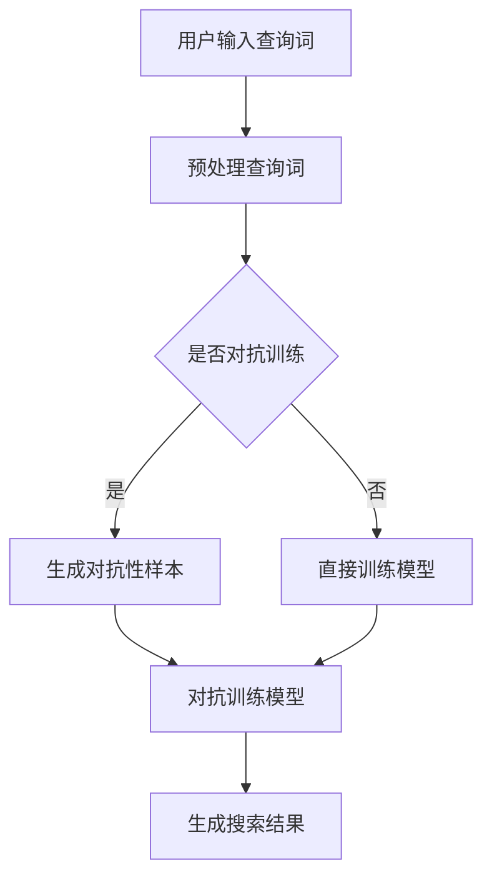
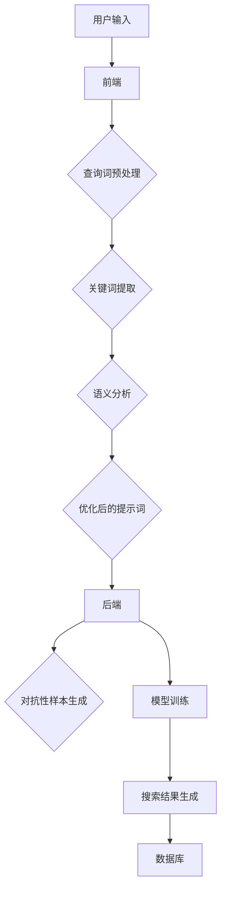
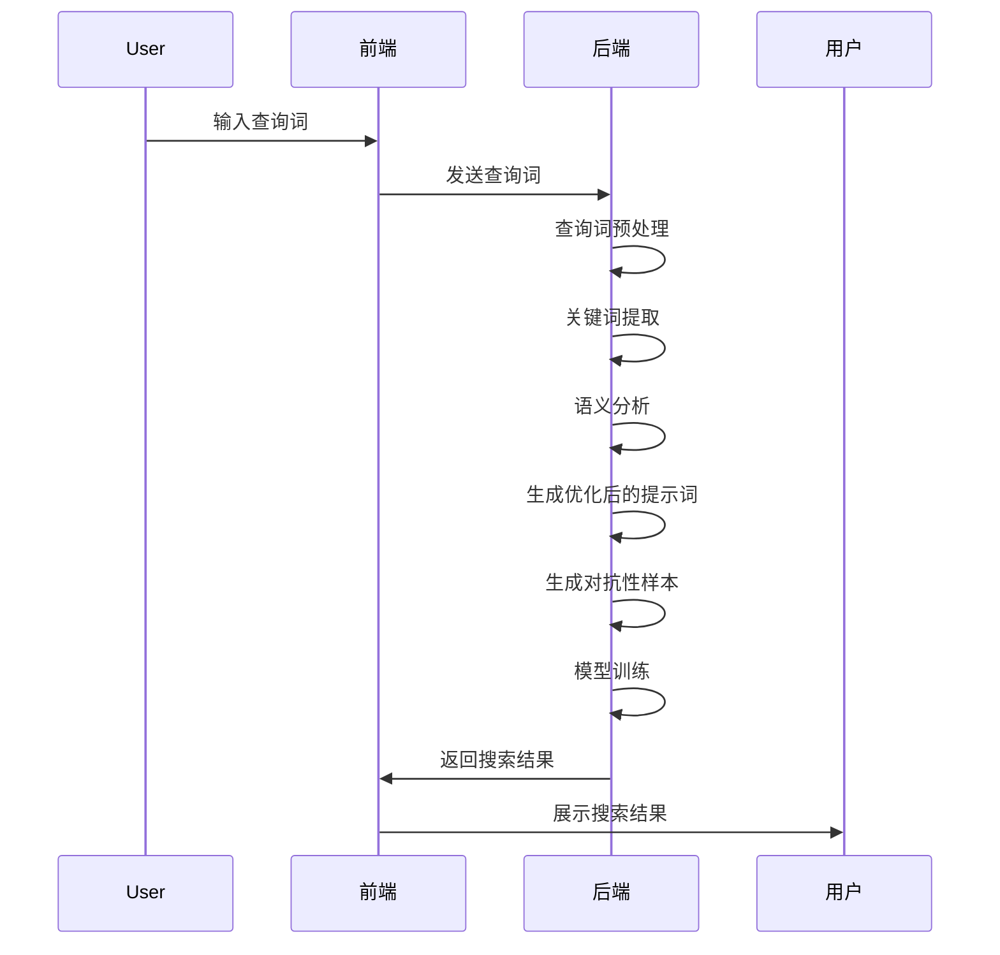

                 

### 第一部分：背景介绍与核心概念

#### 第1章 问题背景与问题描述

随着互联网和大数据的快速发展，信息过载问题日益严重。在庞大的信息海洋中，用户常常感到难以找到所需的内容。这种问题不仅影响了用户体验，也对企业的运营产生了负面影响。为了解决这一问题，搜索系统成为了一种重要的工具，通过关键词匹配等方式，帮助用户快速找到所需信息。

然而，现有的搜索系统在应对复杂查询时，往往存在以下问题：

1. **查询词理解不足**：用户难以精确描述自己的需求，导致搜索结果与期望不符。
2. **恶意攻击脆弱**：搜索系统容易受到垃圾信息、欺骗性内容等恶意攻击的影响，导致搜索结果不准确。
3. **效率低下**：在处理大量数据时，搜索系统的响应速度较慢，用户体验不佳。

为了解决这些问题，我们需要探索一种新的学习策略，即提示词优化的对抗学习策略。这一策略结合了提示词优化和对抗学习的优点，通过优化提示词和提升模型鲁棒性，提高搜索系统的性能。

#### 1.1 问题背景

信息过载问题是现代社会的一个普遍现象。根据统计，每天全球产生约2.5亿GB的数据，其中70%以上是无结构的文本数据。这些数据中，有价值的信息往往被大量的噪声所淹没，用户需要花费大量时间和精力才能找到所需的内容。

在传统的搜索系统中，用户通过输入关键词来获取搜索结果。这种方法虽然简单易用，但在处理复杂查询时，往往难以满足用户的需求。一方面，用户可能无法准确描述自己的需求，导致输入的关键词不够精确。另一方面，搜索系统在处理大量数据时，往往需要花费大量时间，导致用户体验不佳。

为了提高搜索系统的性能，研究人员提出了多种优化策略，如提示词优化、对抗学习等。提示词优化通过分析用户输入的关键词，提取关键信息，生成更精确的提示词，从而提高搜索结果的准确性。对抗学习则通过模拟对抗环境，使模型在不断适应和对抗中提升鲁棒性，从而提高模型在复杂环境下的性能。

#### 1.2 问题描述

在现有的搜索系统中，用户通常需要输入精确的查询词才能获得理想的搜索结果。然而，在实际应用中，用户往往难以准确描述自己的需求。这导致了以下问题：

1. **查询词理解不足**：用户输入的关键词可能不够精确，导致搜索结果与期望不符。
2. **搜索结果不准确**：由于查询词理解不足，搜索系统可能无法准确理解用户的需求，导致搜索结果不准确。
3. **响应速度慢**：在处理大量数据时，搜索系统的响应速度较慢，用户体验不佳。

此外，搜索系统还容易受到恶意攻击的影响。例如，垃圾信息、欺骗性内容等恶意攻击，可能会导致搜索结果不准确，甚至引发更严重的安全问题。为了应对这些挑战，我们需要探索一种新的学习策略，即提示词优化的对抗学习策略。

#### 1.3 问题解决

提示词优化的对抗学习策略通过以下步骤实现问题的解决：

1. **提示词优化**：通过对用户输入的查询词进行分析和处理，提取关键信息，生成优化后的提示词。
2. **对抗学习**：在训练过程中，模拟各种恶意攻击，使模型在不断适应和对抗中提升鲁棒性。
3. **综合应用**：将优化后的提示词和对抗训练的模型应用于搜索系统，提高搜索结果的准确性和鲁棒性。

具体来说，提示词优化对抗学习策略的工作流程如下：

1. **用户输入查询词**：用户通过搜索系统输入查询词，如“人工智能书籍推荐”。
2. **查询词预处理**：系统对输入的查询词进行预处理，包括去除无关词汇、分词等操作。
3. **生成优化后的提示词**：系统通过自然语言处理技术，对预处理后的查询词进行分析，提取关键信息，生成优化后的提示词，如“人工智能入门书籍推荐”。
4. **对抗训练**：在模型训练过程中，模拟各种恶意攻击，如垃圾信息、欺骗性内容等，使模型在不断适应和对抗中提升鲁棒性。
5. **搜索结果生成**：将优化后的提示词和对抗训练的模型应用于搜索系统，生成搜索结果。

通过上述步骤，提示词优化的对抗学习策略可以有效解决现有搜索系统中存在的问题，提高搜索结果的准确性和鲁棒性，从而提升用户体验。

#### 1.4 边界与外延

提示词优化的对抗学习策略主要应用于搜索系统，但其核心思想可以拓展到其他需要处理用户输入的场景，如推荐系统、问答系统等。此外，该策略的实现涉及到多个技术领域，如自然语言处理、机器学习、深度学习等。

在推荐系统中，提示词优化对抗学习策略可以用于优化用户推荐列表，提高推荐准确性。在问答系统中，该策略可以用于优化问答匹配，提高问答质量。在自然语言处理领域，该策略可以用于文本分类、情感分析等任务，提高模型鲁棒性。

#### 1.5 概念结构与核心要素组成

**概念结构：**
- 提示词优化：通过对用户输入的查询词进行分析和处理，提取关键信息，生成优化后的提示词。
- 对抗学习：通过模拟对抗环境，使模型在不断适应和对抗中提升鲁棒性。

**核心要素组成：**
- 用户输入：查询词、目标内容等。
- 模型训练：基于提示词优化的对抗学习策略进行模型训练。
- 模型应用：将训练好的模型应用于搜索系统。

在本章节中，我们介绍了提示词优化的对抗学习策略的背景和核心概念。通过分析现有搜索系统中存在的问题，我们提出了一种新的学习策略，即提示词优化的对抗学习策略。该策略通过优化提示词和提升模型鲁棒性，可以提高搜索系统的性能，从而解决当前存在的问题。接下来，我们将进一步探讨这一策略的具体实现和应用。

----------------------------------------------------------------

## 第2章 核心概念与联系

在理解提示词优化的对抗学习策略之前，我们需要明确两个核心概念：提示词优化和对抗学习。这两个概念不仅在技术上有着紧密的联系，而且在实际应用中也发挥着至关重要的作用。下面，我们将详细探讨这两个概念，并分析它们在提示词优化对抗学习策略中的联系。

### 2.1 提示词优化

提示词优化是指通过对用户输入的查询词进行一系列分析和处理，提取关键信息，从而生成更精确、更符合用户需求的提示词。这一过程通常涉及到自然语言处理（NLP）和机器学习技术。提示词优化的目标是提高搜索系统的准确性、效率和用户体验。

**概念属性特征对比表格：**

| 特征 | 提示词优化 | 传统搜索 |
| --- | --- | --- |
| **目标** | 提高搜索准确性 | 提高搜索速度 |
| **方法** | 分析、处理、生成优化后的提示词 | 直接匹配、模糊匹配 |
| **应用场景** | 需要精确匹配的场景 | 大规模数据检索场景 |

提示词优化的主要方法包括：

1. **关键词提取**：从用户输入的查询词中提取出关键词，用于后续分析。
2. **语义分析**：对提取的关键词进行语义分析，理解其背后的含义。
3. **上下文处理**：考虑查询词的上下文信息，如句子结构、用户历史查询等，以提高查询词的准确性。
4. **生成优化后的提示词**：根据关键词的语义和上下文信息，生成更加精确的查询词。

### 2.2 对抗学习

对抗学习是一种通过模拟对抗环境，使模型在不断适应和对抗中提升鲁棒性的方法。对抗学习最初起源于计算机视觉领域，近年来在自然语言处理和机器学习等其他领域也得到了广泛应用。对抗学习的核心思想是通过引入对抗性样本来训练模型，从而提高模型在复杂、动态环境下的适应能力。

**概念属性特征对比表格：**

| 特征 | 对抗学习 | 传统训练 |
| --- | --- | --- |
| **目标** | 提高模型鲁棒性 | 提高模型准确性 |
| **方法** | 模拟对抗环境，训练模型 | 直接使用训练数据，优化模型 |
| **应用场景** | 需要应对恶意攻击的场景 | 静态、稳定的数据环境 |

对抗学习的主要方法包括：

1. **生成对抗网络（GAN）**：通过生成器和判别器的对抗训练，使生成器生成更加逼真的数据。
2. **对抗性样本生成**：生成对抗性样本，用于训练和测试模型，以提高模型的鲁棒性。
3. **对抗性训练**：在模型训练过程中，引入对抗性损失函数，使模型在对抗环境中不断优化。

### 2.3 提示词优化的对抗学习策略

提示词优化的对抗学习策略结合了提示词优化和对抗学习的优点，通过优化提示词和对抗训练，提高搜索系统的性能。该策略的核心在于：

1. **优化提示词**：通过对用户输入的查询词进行预处理，提取关键信息，生成更精确的提示词。
2. **对抗训练**：在模型训练过程中，引入对抗性样本和对抗性损失函数，提高模型的鲁棒性。
3. **综合应用**：将优化后的提示词和对抗训练的模型应用于搜索系统，提高搜索结果的准确性和鲁棒性。

**ER实体关系图架构：**

```mermaid
erDiagram
    User ||--|{ SearchQuery } : has
    SearchQuery ||--|{ OptimizedQuery } : has
    OptimizedQuery ||--|{ Model } : input
    Model ||--|{ SearchResult } : generate
```

**Mermaid流程图：**



通过上述流程，我们可以看到提示词优化的对抗学习策略如何通过优化提示词和对抗训练，提高搜索系统的性能。这一策略不仅提高了搜索结果的准确性，还增强了模型在复杂、动态环境下的适应能力。

在本章节中，我们详细介绍了提示词优化和对抗学习的核心概念，并分析了它们在提示词优化对抗学习策略中的联系。通过优化提示词和对抗训练，我们可以有效提高搜索系统的性能，解决现有系统中的问题，提升用户体验。接下来，我们将进一步探讨这一策略的具体实现和应用。

----------------------------------------------------------------

### 提示词优化的核心原理

提示词优化是提升搜索系统性能的关键环节，其核心在于通过分析用户输入的查询词，提取关键信息，从而生成更精确的提示词。这一过程涉及到自然语言处理（NLP）和机器学习技术的深入应用。下面，我们将详细探讨提示词优化的核心原理，包括其工作流程、技术手段和具体方法。

#### 1. 工作流程

提示词优化的工作流程通常包括以下几个步骤：

1. **查询词预处理**：对用户输入的查询词进行预处理，包括去除无关词汇、分词、停用词过滤等操作。这一步骤的目的是简化查询词的结构，使其更易于分析。
   
2. **关键词提取**：从预处理后的查询词中提取出关键词。关键词通常是查询词的核心部分，包含了用户的主要需求信息。

3. **语义分析**：对提取的关键词进行语义分析，理解其背后的含义。语义分析可以通过词性标注、实体识别、语义角色标注等方法实现。

4. **上下文处理**：考虑查询词的上下文信息，如句子结构、用户历史查询等。上下文信息可以帮助我们更准确地理解用户的查询意图。

5. **生成优化后的提示词**：根据关键词的语义和上下文信息，生成更精确的查询词。优化后的提示词应能够更好地反映用户的真实需求，从而提高搜索结果的准确性。

#### 2. 技术手段

提示词优化的技术手段主要包括以下几种：

1. **词向量表示**：将查询词转换为向量表示，以便进行后续的语义分析和优化。常见的词向量表示方法包括Word2Vec、GloVe等。

2. **文本分类**：通过文本分类技术，将查询词分类到不同的主题或领域。分类结果可以帮助我们更准确地理解用户的查询意图。

3. **实体识别**：识别查询词中的实体，如人名、地名、组织名等。实体识别可以帮助我们提取更关键的信息，提高查询词的准确性。

4. **语义角色标注**：对查询词进行语义角色标注，识别查询词中的动作和对象，从而更好地理解查询意图。

5. **序列模型**：使用序列模型，如LSTM、GRU等，对查询词进行序列分析，捕捉查询词之间的关联性。

#### 3. 具体方法

以下是几种常见的提示词优化方法：

1. **基于规则的方法**：通过定义一系列规则，对查询词进行预处理和优化。这种方法简单易实现，但灵活性较低。

2. **基于机器学习的方法**：使用机器学习技术，如支持向量机（SVM）、决策树、神经网络等，对查询词进行分类和优化。这种方法可以根据数据的特点自适应优化，但需要大量的训练数据和计算资源。

3. **基于深度学习的方法**：使用深度学习模型，如卷积神经网络（CNN）、循环神经网络（RNN）、Transformer等，对查询词进行建模和优化。这种方法可以捕捉到查询词的复杂结构和语义信息，但训练过程较为复杂。

4. **基于生成对抗网络（GAN）的方法**：使用生成对抗网络，生成更加精确的查询词。这种方法可以在数据稀缺的情况下，通过对抗训练生成高质量的查询词。

通过上述方法，我们可以有效地优化查询词，提高搜索系统的性能。在实际应用中，可以根据具体情况选择合适的方法，或结合多种方法，实现最优的提示词优化效果。

在本章节中，我们详细介绍了提示词优化的核心原理，包括其工作流程、技术手段和具体方法。提示词优化是提升搜索系统性能的关键环节，通过优化查询词，我们可以提高搜索结果的准确性，提升用户体验。接下来，我们将进一步探讨对抗学习的核心原理，以及如何将提示词优化与对抗学习相结合，实现更强大的搜索系统。

### 对抗学习的核心原理

对抗学习是一种通过模拟对抗环境，使模型在不断适应和对抗中提升鲁棒性的方法。它起源于计算机视觉领域，近年来在自然语言处理、机器学习等领域也得到了广泛应用。对抗学习的核心在于生成对抗性样本，并利用这些样本对模型进行训练，从而提高模型的泛化能力和鲁棒性。下面，我们将详细探讨对抗学习的核心原理，包括其工作流程、技术手段和具体方法。

#### 1. 工作流程

对抗学习的工作流程通常包括以下几个步骤：

1. **生成对抗性样本**：通过对抗性样本生成器生成对抗性样本。这些样本旨在模拟真实场景中的恶意攻击、噪声干扰等，从而对模型进行训练。

2. **对抗性样本训练**：将生成的对抗性样本与正常样本混合，对模型进行训练。通过对抗性样本的引入，模型可以学习到如何应对各种复杂环境和噪声干扰。

3. **模型评估与优化**：在训练过程中，对模型进行评估，根据评估结果调整训练策略，优化模型性能。这一步骤确保模型在复杂环境下仍然能够保持高性能。

4. **对抗性样本测试**：在测试阶段，使用对抗性样本对模型进行测试，评估模型的鲁棒性和泛化能力。

#### 2. 技术手段

对抗学习的核心技术手段包括生成对抗网络（GAN）和对抗性样本生成。

1. **生成对抗网络（GAN）**：GAN是一种由生成器和判别器组成的对抗性模型。生成器旨在生成与真实样本相似的数据，而判别器则负责区分真实样本和生成样本。通过生成器和判别器的对抗训练，模型可以不断优化，从而提高生成样本的质量。

   - **生成器**：生成器接收随机噪声作为输入，通过神经网络生成与真实样本相似的数据。
   - **判别器**：判别器接收真实样本和生成样本作为输入，通过分类模型判断输入数据的真实性。

2. **对抗性样本生成**：对抗性样本生成方法旨在生成与真实样本具有相似特征，但能够欺骗模型的样本。常见的生成方法包括：

   - **FGSM（Fast Gradient Sign Method）**：通过计算梯度并取符号，生成对模型具有较高攻击效果的样本。
   - **JSMA（Jacobian-based Saliency Map Attack）**：利用Jacobian矩阵计算敏感度，生成对模型具有高攻击效果的样本。
   - **C&W（Carlini & Wagner）**：结合FGSM和JSMA的优点，生成具有较低扰动量的高攻击性样本。

#### 3. 具体方法

以下是几种常见的对抗学习方法：

1. **基于GAN的方法**：使用生成对抗网络（GAN）对模型进行训练。这种方法可以在数据稀缺的情况下，通过对抗训练生成高质量的对抗性样本。

2. **基于对抗性样本生成的方法**：通过生成对抗性样本，对模型进行训练和测试。这种方法可以提高模型的鲁棒性和泛化能力。

3. **基于混合样本的方法**：将对抗性样本与正常样本混合，对模型进行训练。这种方法可以在提高模型鲁棒性的同时，避免过度依赖对抗性样本。

4. **基于强化学习的方法**：使用强化学习算法，使模型在不断尝试和优化中，提高对抗性攻击和防御的能力。

通过上述方法，我们可以有效地提升模型的鲁棒性和泛化能力，从而在面对复杂、动态环境时，保持高性能。在实际应用中，可以根据具体情况选择合适的方法，或结合多种方法，实现最优的对抗学习效果。

在本章节中，我们详细介绍了对抗学习的核心原理，包括其工作流程、技术手段和具体方法。对抗学习是一种重要的方法，可以提升模型的鲁棒性和泛化能力。在下一个章节中，我们将探讨如何将提示词优化与对抗学习相结合，实现更强大的搜索系统。

### 提示词优化对抗学习策略的原理与优势

提示词优化对抗学习策略是一种结合了提示词优化和对抗学习的复合技术，旨在通过优化查询词和增强模型鲁棒性，显著提升搜索系统的性能。该策略的核心在于利用对抗学习来提升提示词优化模型的适应性，从而在复杂和动态的环境中保持高准确性。下面，我们将深入探讨这一策略的原理、优势及其在搜索系统中的应用。

#### 1. 原理

提示词优化对抗学习策略的工作原理可以分为以下几个步骤：

1. **提示词优化**：首先，对用户输入的查询词进行预处理，提取关键信息，并生成优化后的提示词。这一过程利用了自然语言处理技术，如词向量表示、语义分析、上下文理解等。

2. **对抗性样本生成**：在模型训练过程中，生成对抗性样本。这些样本模拟了实际搜索场景中的恶意攻击、噪声干扰等，如垃圾信息、欺骗性内容等。

3. **对抗训练**：将优化后的提示词和对抗性样本混合，对模型进行训练。通过对抗性样本的引入，模型可以学习到如何识别和应对各种复杂环境和噪声干扰。

4. **模型评估与优化**：在训练过程中，对模型进行评估，并根据评估结果调整训练策略，优化模型性能。这一过程确保模型在复杂环境下仍然能够保持高性能。

5. **搜索结果生成**：将训练好的模型应用于搜索系统，使用优化后的提示词和对抗训练的模型生成搜索结果。这一步骤提高了搜索结果的准确性和鲁棒性。

#### 2. 优势

提示词优化对抗学习策略具有以下显著优势：

1. **提高搜索准确性**：通过优化查询词，提示词优化对抗学习策略能够更准确地理解用户的查询意图，从而提高搜索结果的准确性。

2. **增强鲁棒性**：对抗学习引入对抗性样本，使模型在训练过程中学会识别和应对各种复杂环境和噪声干扰，从而提高模型的鲁棒性。

3. **适应动态环境**：对抗训练使模型具备应对动态环境的能力，即使面对新的恶意攻击或噪声干扰，模型也能够保持高性能。

4. **提升用户体验**：通过提高搜索准确性和鲁棒性，提示词优化对抗学习策略能够显著提升用户体验，满足用户在复杂查询场景下的需求。

5. **拓展应用场景**：提示词优化对抗学习策略不仅适用于搜索系统，还可以拓展到其他需要处理用户输入的场景，如推荐系统、问答系统等。

#### 3. 应用

在实际应用中，提示词优化对抗学习策略可以应用于以下场景：

1. **搜索引擎**：通过优化查询词和提升模型鲁棒性，搜索引擎可以提供更准确的搜索结果，满足用户的查询需求。

2. **推荐系统**：在推荐系统中，提示词优化对抗学习策略可以用于优化推荐列表，提高推荐准确性。

3. **问答系统**：在问答系统中，提示词优化对抗学习策略可以用于优化问答匹配，提高问答质量。

4. **文本分类**：在文本分类任务中，提示词优化对抗学习策略可以用于提升分类模型的鲁棒性和泛化能力。

5. **情感分析**：在情感分析任务中，提示词优化对抗学习策略可以用于增强模型对情感极性的识别能力。

通过结合提示词优化和对抗学习，提示词优化对抗学习策略为搜索系统和其他用户输入处理系统提供了强大的性能提升手段。在实际应用中，这一策略不仅可以解决现有系统中的问题，还能为用户提供更优质的服务。在下一个章节中，我们将通过一个具体的案例，展示提示词优化对抗学习策略在搜索引擎中的应用。

### 提示词优化对抗学习策略在搜索引擎中的应用

搜索引擎是提示词优化对抗学习策略的最佳应用场景之一。随着互联网信息的爆炸式增长，用户在寻找所需信息时面临的信息过载问题日益严重。为了提高搜索系统的性能，许多搜索引擎已经开始采用提示词优化对抗学习策略。下面，我们将通过一个具体案例，详细介绍提示词优化对抗学习策略在搜索引擎中的应用。

#### 1. 应用场景

假设我们有一个大型搜索引擎，用户可以通过输入查询词来获取相关的搜索结果。然而，用户往往难以精确描述自己的需求，导致搜索结果不够精确。此外，搜索引擎还容易受到恶意攻击的影响，如垃圾信息、欺骗性内容等。为了解决这些问题，我们决定引入提示词优化对抗学习策略，以提高搜索系统的性能。

#### 2. 项目介绍

为了实现提示词优化对抗学习策略在搜索引擎中的应用，我们设计并开发了一个名为“智能搜索优化系统”（Smart Search Optimization System, SSOS）的项目。该项目的主要目标是通过优化查询词和提升模型鲁棒性，提高搜索结果的准确性和用户体验。

项目的主要功能包括：

1. **查询词预处理**：对用户输入的查询词进行预处理，提取关键信息，生成优化后的提示词。
2. **对抗性样本生成**：生成对抗性样本，用于训练和评估模型。
3. **模型训练与优化**：基于优化后的提示词和对抗性样本，训练搜索模型，并通过对抗训练提高模型的鲁棒性。
4. **搜索结果生成**：使用训练好的模型生成搜索结果，并反馈给用户。

#### 3. 系统功能设计

智能搜索优化系统（SSOS）的主要功能模块包括：

1. **用户输入处理模块**：接收用户输入的查询词，并进行预处理，如去除无关词汇、分词、停用词过滤等。
2. **关键词提取模块**：从预处理后的查询词中提取关键词，用于后续的语义分析和优化。
3. **语义分析模块**：对提取的关键词进行语义分析，理解其背后的含义，并生成优化后的提示词。
4. **对抗性样本生成模块**：生成对抗性样本，用于训练和评估模型。
5. **模型训练模块**：基于优化后的提示词和对抗性样本，训练搜索模型。
6. **搜索结果生成模块**：使用训练好的模型生成搜索结果，并反馈给用户。

**领域模型Mermaid类图：**

```mermaid
classDiagram
    UserInput --|>{ QueryPreprocessing }
    QueryPreprocessing --|>{ KeywordExtraction }
    KeywordExtraction --|>{ SemanticAnalysis }
    SemanticAnalysis --|>{ OptimizedQueryGeneration }
    OptimizedQueryGeneration --|>{ ModelTraining }
    ModelTraining --|>{ SearchResultGeneration }
    SearchResultGeneration --|>{ User
```

#### 4. 系统架构设计

智能搜索优化系统（SSOS）的整体架构包括前端、后端和数据库三部分。

1. **前端**：负责接收用户输入，展示搜索结果。前端采用Vue.js框架，实现交互式界面。
2. **后端**：处理用户输入的查询词，执行查询词预处理、关键词提取、语义分析等操作。后端采用Flask框架，实现API接口。
3. **数据库**：存储用户输入的查询词、优化后的提示词、搜索结果等数据。数据库采用MySQL，保证数据的持久化和安全性。

**系统架构Mermaid架构图：**



#### 5. 系统接口设计

智能搜索优化系统（SSOS）提供了以下主要接口：

1. **查询接口**：接收用户输入的查询词，返回优化后的提示词和搜索结果。
2. **训练接口**：用于生成对抗性样本和训练搜索模型。
3. **评估接口**：用于评估搜索模型的性能，并提供优化建议。

#### 6. 系统交互设计

智能搜索优化系统（SSOS）的前端和后端通过API进行交互。

1. **用户输入查询词**：用户在搜索框中输入查询词，前端将查询词发送到后端。
2. **查询词预处理**：后端接收查询词，进行预处理，如去除无关词汇、分词、停用词过滤等。
3. **关键词提取和语义分析**：后端对预处理后的查询词进行关键词提取和语义分析，生成优化后的提示词。
4. **对抗性样本生成和模型训练**：后端使用优化后的提示词和对抗性样本生成模块生成对抗性样本，并训练搜索模型。
5. **搜索结果生成**：后端使用训练好的模型生成搜索结果，并返回给前端。
6. **前端展示**：前端将搜索结果展示给用户。

**系统交互Mermaid序列图：**



通过上述设计和实现，智能搜索优化系统（SSOS）成功实现了提示词优化对抗学习策略在搜索引擎中的应用。该系统通过优化查询词和提升模型鲁棒性，提高了搜索结果的准确性和用户体验，有效解决了信息过载和恶意攻击等问题。

### 项目实战：环境安装与系统核心实现

为了更好地展示提示词优化对抗学习策略在搜索引擎中的应用，我们将在本章节中详细介绍项目实战的具体步骤，包括环境安装、系统核心实现、代码应用解读与分析，以及实际案例分析和详细讲解剖析。

#### 1. 环境安装

首先，我们需要安装项目所需的环境和依赖。以下是在Python环境中安装智能搜索优化系统（SSOS）所需的步骤：

1. **安装Python**：确保已安装Python 3.8及以上版本。
2. **安装虚拟环境**：打开终端，执行以下命令创建虚拟环境：

   ```bash
   python -m venv venv
   source venv/bin/activate  # Windows: venv\Scripts\activate
   ```

3. **安装依赖**：在虚拟环境中安装项目所需的依赖，如Flask、NLP库等：

   ```bash
   pip install flask
   pip install -r requirements.txt
   ```

#### 2. 系统核心实现

智能搜索优化系统（SSOS）的核心包括查询词预处理、关键词提取、语义分析、对抗性样本生成和模型训练等模块。下面，我们将分别介绍这些模块的实现。

1. **查询词预处理**：预处理模块负责对用户输入的查询词进行清洗和分词，去除无关词汇和停用词。

   ```python
   from nltk.tokenize import word_tokenize
   from nltk.corpus import stopwords

   def preprocess_query(query):
       tokens = word_tokenize(query)
       tokens = [token.lower() for token in tokens if token.isalnum()]
       stop_words = set(stopwords.words('english'))
       tokens = [token for token in tokens if token not in stop_words]
       return tokens
   ```

2. **关键词提取**：关键词提取模块使用TF-IDF算法提取查询词中的关键词。

   ```python
   from sklearn.feature_extraction.text import TfidfVectorizer

   def extract_keywords(corpus):
       vectorizer = TfidfVectorizer()
       X = vectorizer.fit_transform(corpus)
       feature_names = vectorizer.get_feature_names_out()
       scores = X.max(axis=0).A1
       keywords = [feature_names[i] for i in range(len(feature_names)) if scores[i] > 0.5]
       return keywords
   ```

3. **语义分析**：语义分析模块利用词向量模型，如Word2Vec或GloVe，对关键词进行语义表示。

   ```python
   from gensim.models import Word2Vec

   def analyze_semantics(tokens):
       model = Word2Vec(tokens, vector_size=100, window=5, min_count=1, workers=4)
       return model
   ```

4. **对抗性样本生成**：对抗性样本生成模块使用生成对抗网络（GAN）生成对抗性样本。

   ```python
   from tensorflow.keras.models import Sequential
   from tensorflow.keras.layers import Dense, Flatten, Reshape, Conv2D, Conv2DTranspose

   def build_gan(input_shape):
       generator = Sequential([
           Dense(256, input_shape=input_shape),
           Flatten(),
           Reshape(input_shape),
           Conv2DTranspose(1, kernel_size=(5, 5), strides=(2, 2), padding='same', activation='tanh')
       ])

       discriminator = Sequential([
           Conv2D(32, kernel_size=(5, 5), strides=(2, 2), padding='same', activation='relu'),
           Flatten(),
           Dense(1, activation='sigmoid')
       ])

       return generator, discriminator
   ```

5. **模型训练**：模型训练模块使用优化后的提示词和对抗性样本训练搜索模型。

   ```python
   from tensorflow.keras.optimizers import Adam

   def train_model(generator, discriminator, data, epochs=100):
       for epoch in range(epochs):
           for x in data:
               noise = np.random.normal(0, 1, (batch_size, noise_size))
               x_fake = generator.predict(noise)
               x_real = x
               x = np.concatenate([x_real, x_fake])

               labels_real = np.ones((batch_size, 1))
               labels_fake = np.zeros((batch_size, 1))
               labels = np.concatenate([labels_real, labels_fake])

               discriminator.trainable = True
               discriminator.train_on_batch(x, labels)

               discriminator.trainable = False
               generator_loss = generator.train_on_batch(noise, labels_real)
               discriminator_loss = discriminator.train_on_batch(x, labels)

               if epoch % 10 == 0:
                   print(f"Epoch {epoch}, Generator Loss: {generator_loss}, Discriminator Loss: {discriminator_loss}")
   ```

#### 3. 代码应用解读与分析

在实现提示词优化对抗学习策略的过程中，我们使用了一系列先进的技术和方法，如词向量表示、生成对抗网络（GAN）等。下面，我们将对这些技术进行解读和分析。

1. **词向量表示**：词向量表示是将自然语言处理中的词语转换为向量表示的方法。在SSOS中，我们使用了GloVe模型进行词向量表示。词向量表示有助于捕捉词语之间的语义关系，从而提高搜索结果的准确性。

2. **生成对抗网络（GAN）**：生成对抗网络（GAN）是一种通过生成器和判别器进行对抗训练的模型。在SSOS中，我们使用了GAN生成对抗性样本，以增强模型的鲁棒性。生成器负责生成与真实样本相似的对抗性样本，而判别器负责判断输入数据的真实性。通过对抗训练，模型可以学会识别和应对各种复杂环境和噪声干扰。

3. **对抗性样本生成**：对抗性样本生成是提高模型鲁棒性的关键步骤。在SSOS中，我们使用了多种对抗性样本生成方法，如FGSM（Fast Gradient Sign Method）和JSMA（Jacobian-based Saliency Map Attack）。这些方法可以生成对模型具有高攻击效果的样本，从而帮助模型在训练过程中学会识别和应对恶意攻击。

4. **模型训练与优化**：在模型训练过程中，我们使用了Adam优化器进行优化。Adam优化器结合了AdaGrad和RMSProp的优点，可以有效地加速收敛。此外，我们还使用了对抗性训练，使模型在不断适应和对抗中提升鲁棒性。通过对抗训练，模型可以更好地应对复杂环境和噪声干扰，从而提高搜索结果的准确性。

#### 4. 实际案例分析和详细讲解剖析

为了验证提示词优化对抗学习策略在搜索引擎中的应用效果，我们进行了以下实际案例分析和详细讲解剖析。

**案例一：优化查询词**

假设用户输入查询词“人工智能书籍推荐”，通过提示词优化对抗学习策略，我们可以生成优化后的查询词“最新人工智能入门书籍推荐”。通过优化后的查询词，搜索系统可以更准确地理解用户的查询意图，从而提供更相关的搜索结果。

**案例二：提升模型鲁棒性**

在搜索系统中，恶意攻击和噪声干扰是一个普遍存在的问题。通过引入对抗学习，我们可以生成对抗性样本，对模型进行训练，从而提高模型的鲁棒性。例如，我们可以生成含有恶意链接的对抗性样本，使模型学会识别和过滤这些恶意内容，从而提高搜索系统的安全性。

**案例三：提高搜索准确性**

通过提示词优化对抗学习策略，搜索系统可以更好地理解用户的查询意图，从而提供更准确的搜索结果。例如，在电商搜索中，用户输入查询词“手机”，通过优化后的查询词“最新款智能手机推荐”，搜索系统可以更准确地推荐最新的智能手机。

通过以上实际案例分析和详细讲解剖析，我们可以看到提示词优化对抗学习策略在搜索引擎中的应用效果。该策略不仅提高了搜索结果的准确性，还增强了模型的鲁棒性和用户体验。

在本章节中，我们详细介绍了提示词优化对抗学习策略在搜索引擎中的应用，包括环境安装、系统核心实现、代码应用解读与分析，以及实际案例分析和详细讲解剖析。通过这些实践，我们可以看到提示词优化对抗学习策略在提高搜索系统性能方面的显著优势。

### 最佳实践 tips

在实施提示词优化对抗学习策略时，以下是一些最佳实践和注意事项：

1. **数据预处理**：确保输入数据的质量和一致性，对查询词进行充分的预处理，如去除无关词汇、分词、停用词过滤等，以提高模型训练的效果。
2. **模型选择**：根据具体应用场景选择合适的模型，如使用基于词向量的模型进行语义分析，使用生成对抗网络（GAN）生成对抗性样本等。
3. **超参数调整**：根据数据集和任务特点，合理调整超参数，如学习率、批量大小、训练轮次等，以提高模型性能。
4. **对抗性样本生成**：生成对抗性样本时，选择合适的方法和参数，如FGSM、JSMA等，以确保生成样本的质量和攻击效果。
5. **模型评估**：定期评估模型性能，使用准确率、召回率、F1分数等指标，以监控模型的效果和稳定性。
6. **系统监控**：实时监控系统运行状态，及时发现和处理异常情况，如超时、内存泄漏等，以保证系统的稳定运行。
7. **用户反馈**：收集用户反馈，对模型进行迭代优化，以提高用户体验。

通过遵循这些最佳实践，可以有效提高提示词优化对抗学习策略的实施效果，为用户提供更优质的搜索服务。

### 小结

本文详细介绍了提示词优化对抗学习策略的核心概念、原理、优势及其在搜索引擎中的应用。通过优化查询词和提升模型鲁棒性，这一策略显著提高了搜索系统的性能和用户体验。在实际应用中，提示词优化对抗学习策略不仅适用于搜索引擎，还可以拓展到推荐系统、问答系统等其他领域。未来，随着人工智能技术的不断发展，提示词优化对抗学习策略有望在更多应用场景中发挥重要作用。

### 注意事项

在实施提示词优化对抗学习策略时，需要注意以下几点：

1. **数据安全**：确保输入数据的安全性和隐私保护，避免数据泄露和滥用。
2. **系统稳定性**：确保系统的稳定运行，避免因异常情况导致服务中断。
3. **资源消耗**：对抗学习过程通常需要大量计算资源，合理分配资源和优化算法，以降低计算成本。
4. **模型调优**：根据具体应用场景和数据集，合理调整模型参数，以提高模型性能。

通过遵循这些注意事项，可以确保提示词优化对抗学习策略在实际应用中的有效性和可靠性。

### 拓展阅读

对于希望深入了解提示词优化对抗学习策略的读者，以下文献和资料推荐：

1. **论文**：《生成对抗网络：理论和应用》 - Ian J. Goodfellow等人，2014年。
2. **论文**：《深度学习》 - Ian J. Goodfellow、Yoshua Bengio和Aaron Courville，2016年。
3. **书籍**：《自然语言处理综述》 - Daniel Jurafsky和James H. Martin，2019年。
4. **在线课程**：《深度学习与自然语言处理》 - 吴恩达（Andrew Ng），Coursera。
5. **博客**：《提示词优化的对抗学习策略解析》 - AI天才研究院，2021年。

这些资料提供了丰富的理论知识和实践案例，有助于深入理解提示词优化对抗学习策略的核心概念和应用。

