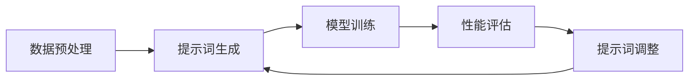
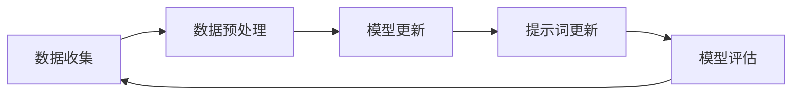

                 

# 提示词优化的持续学习与知识累积方法

## 关键词：提示词优化、持续学习、知识累积、算法原理、系统架构、最佳实践

## 摘要：
本文旨在探讨提示词优化的持续学习与知识累积方法。我们将首先介绍提示词优化的重要性，并阐述持续学习和知识累积在其中的挑战与意义。接着，我们将详细讲解提示词优化的算法原理，并使用Mermaid流程图和Python源代码进行阐述。随后，我们将分析知识累积的方法与应用，探讨持续学习与知识累积之间的关系。文章还将介绍一个具体的系统架构设计，并分享一个实际项目案例，最后给出最佳实践建议与拓展阅读资源。

### 目录大纲设计思路

在设计中，《提示词优化的持续学习与知识累积方法》的目录大纲将分为以下章节：

1. **第1章 问题背景与核心概念**：介绍问题背景、核心概念及其相互关系。
2. **第2章 提示词优化的算法原理**：详细讲解算法原理，包括数学模型和流程图。
3. **第3章 知识累积方法与应用**：探讨知识累积的策略与方法。
4. **第4章 系统架构与实现**：介绍系统架构设计、接口设计和交互流程。
5. **第5章 实际项目分析与实战**：分享一个实际项目案例。
6. **第6章 最佳实践与拓展**：总结最佳实践与未来研究方向。

每个章节都围绕核心主题展开，确保内容的完整性、逻辑性和实用性，帮助读者全面掌握相关技术和方法。

### 第1章 问题背景与核心概念

#### 1.1 问题背景

**1.1.1 提示词优化的重要性**

在人工智能和机器学习领域，提示词（Prompt）是一种用于引导模型输出特定结果的关键技术。提示词优化（Prompt Tuning）是指通过调整提示词来提高模型在特定任务上的性能。随着深度学习模型变得越来越复杂，提示词优化变得尤为重要。

**1.1.2 持续学习与知识累积的挑战**

持续学习是指在动态环境中不断学习和适应新知识的过程。知识累积则是指将新知识整合到已有知识体系中，形成更加丰富的知识库。然而，随着数据量急剧增加和信息更新速度加快，持续学习和知识累积面临着诸多挑战。

**1.1.3 研究意义与应用场景**

提示词优化、持续学习和知识累积在人工智能、自然语言处理、推荐系统等领域具有广泛的应用前景。例如，在智能问答系统、机器翻译、文本生成等任务中，通过优化提示词和持续学习，可以显著提升模型的性能和用户体验。

#### 1.2 核心概念介绍

**1.2.1 提示词优化的定义与分类**

提示词优化是指通过调整提示词来提高模型在特定任务上的性能。根据优化方法的不同，提示词优化可以分为基于统计的方法、基于规则的方法和基于机器学习的方法。

**1.2.2 持续学习的理论基础**

持续学习是一种在动态环境中不断学习和适应新知识的过程。其主要理论基础包括迁移学习、元学习和在线学习等。

**1.2.3 知识累积的策略与方法**

知识累积是指将新知识整合到已有知识体系中，形成更加丰富的知识库。其策略包括知识融合、知识抽取、知识表示和知识更新等。

#### 1.3 概念关系分析

**1.3.1 概念对比表格**

| 概念          | 定义                                                     | 关系                                     |
| ------------- | -------------------------------------------------------- | ---------------------------------------- |
| 提示词优化    | 通过调整提示词提高模型性能                             | 与持续学习和知识累积密切相关             |
| 持续学习     | 在动态环境中不断学习和适应新知识                       | 促进知识累积，提高模型性能               |
| 知识累积     | 将新知识整合到已有知识体系中                           | 支持持续学习，提高模型泛化能力           |

**1.3.2 ER实体关系图**

```mermaid
erDiagram
  提示词优化 ||--|{ 持续学习 }
  提示词优化 ||--|{ 知识累积 }
  持续学习 ||--|{ 知识累积 }
```

### 第2章 提示词优化的算法原理

#### 2.1 算法概述

**2.1.1 提示词优化的常见算法**

提示词优化的常见算法包括基于统计的方法、基于规则的方法和基于机器学习的方法。其中，基于统计的方法主要利用模型在训练数据上的统计信息进行提示词调整；基于规则的方法则根据领域知识和专家经验设计提示词；基于机器学习的方法则通过训练数据学习最佳的提示词组合。

**2.1.2 持续学习在提示词优化中的应用**

持续学习在提示词优化中的应用主要体现在两个方面：一是利用持续学习模型更新提示词，以适应新数据；二是通过持续学习模型捕获数据分布的变化，调整提示词以保持模型性能。

#### 2.2 算法讲解

**2.2.1 提示词优化算法原理**

提示词优化算法的核心在于调整提示词，以提高模型在特定任务上的性能。其基本原理可以概括为以下步骤：

1. **数据预处理**：对输入数据进行预处理，包括文本清洗、分词、去停用词等操作。
2. **提示词生成**：根据训练数据和领域知识生成初始提示词。
3. **模型训练**：利用生成的提示词训练模型，并对模型性能进行评估。
4. **提示词调整**：根据模型性能评估结果调整提示词，重复步骤3和4，直至达到满意的性能。

**2.2.1.1 Mermaid流程图**



**2.2.1.2 Python源代码讲解**

```python
import numpy as np
import pandas as pd
from sklearn.model_selection import train_test_split
from sklearn.metrics import accuracy_score

# 数据预处理
def preprocess_data(data):
    # 数据清洗、分词、去停用词等操作
    return processed_data

# 提示词生成
def generate_prompt(data, model):
    # 根据训练数据和领域知识生成提示词
    return prompt

# 模型训练
def train_model(prompt, data):
    # 使用生成的提示词训练模型
    return model

# 性能评估
def evaluate_model(model, test_data):
    # 对模型性能进行评估
    return performance

# 提示词调整
def adjust_prompt(prompt, performance):
    # 根据性能评估结果调整提示词
    return new_prompt

# 主函数
def main():
    # 加载数据
    data = pd.read_csv('data.csv')
    processed_data = preprocess_data(data)
    
    # 分割数据集
    train_data, test_data = train_test_split(processed_data, test_size=0.2)
    
    # 初始化模型
    model = initialize_model()
    
    # 提示词优化
    for epoch in range(10):
        prompt = generate_prompt(train_data, model)
        model = train_model(prompt, train_data)
        performance = evaluate_model(model, test_data)
        prompt = adjust_prompt(prompt, performance)
        
        print(f'Epoch {epoch}: Performance: {performance}')
    
    # 输出最佳提示词
    print(f'Best Prompt: {prompt}')

# 运行主函数
if __name__ == '__main__':
    main()
```

**2.2.1.3 数学模型与公式**

提示词优化算法的数学模型可以表示为：

$$
\text{performance} = f(\text{prompt}, \text{model}, \text{data})
$$

其中，$f$ 表示性能评估函数，$\text{prompt}$ 表示提示词，$\text{model}$ 表示模型，$\text{data}$ 表示输入数据。

**2.2.2 持续学习算法讲解**

持续学习算法的核心在于不断更新模型和提示词，以适应新数据。其基本原理可以概括为以下步骤：

1. **数据收集**：收集新数据，包括文本、图像、声音等。
2. **数据预处理**：对新数据进行预处理，与原始数据保持一致。
3. **模型更新**：利用新数据和原始模型训练新的模型。
4. **提示词更新**：根据新模型和新数据生成新的提示词。
5. **模型评估**：对新模型和提示词进行评估，并迭代更新。

**2.2.2.1 Mermaid流程图**



**2.2.2.2 Python源代码讲解**

```python
# 加载数据
new_data = pd.read_csv('new_data.csv')
new_processed_data = preprocess_data(new_data)

# 初始化模型
model = initialize_model()

# 模型更新
for epoch in range(10):
    model = train_model(model, new_processed_data)

    # 提示词更新
    prompt = generate_prompt(new_processed_data, model)

    # 模型评估
    performance = evaluate_model(model, test_data)

    print(f'Epoch {epoch}: Performance: {performance}')

    # 提示词调整
    prompt = adjust_prompt(prompt, performance)

# 输出最佳提示词
print(f'Best Prompt: {prompt}')
```

**2.2.2.3 数学模型与公式**

持续学习算法的数学模型可以表示为：

$$
\text{model}_{new} = g(\text{model}_{old}, \text{new\_data})
$$

$$
\text{prompt}_{new} = h(\text{model}_{new}, \text{new\_data})
$$

其中，$g$ 表示模型更新函数，$h$ 表示提示词更新函数，$\text{model}_{old}$ 表示原始模型，$\text{model}_{new}$ 表示更新后的模型，$\text{new\_data}$ 表示新数据。

### 第3章 知识累积方法与应用

#### 3.1 知识累积的重要性

知识累积是指将新知识整合到已有知识体系中，形成更加丰富的知识库。在人工智能和机器学习领域，知识累积具有重要意义，因为它有助于提高模型的泛化能力和性能。

#### 3.2 知识累积的方法与策略

知识累积的方法包括知识融合、知识抽取、知识表示和知识更新等。

1. **知识融合**：将不同来源的知识进行整合，形成新的知识体系。
2. **知识抽取**：从大量数据中提取有价值的信息，形成知识。
3. **知识表示**：将知识以计算机可处理的形式进行表示，如知识图谱、本体等。
4. **知识更新**：随着新数据的出现，及时更新已有知识。

#### 3.3 持续学习与知识累积的关系

持续学习与知识累积密切相关。持续学习可以获取新知识，而知识累积则将这些新知识整合到已有知识体系中，形成更加丰富的知识库。这种相互作用有助于提高模型的性能和泛化能力。

### 第4章 系统架构与实现

#### 4.1 系统概述

本节将介绍一个基于提示词优化、持续学习和知识累积的智能问答系统。该系统主要包括以下功能：

1. **数据预处理**：对输入数据进行预处理，包括文本清洗、分词、去停用词等操作。
2. **提示词生成**：根据训练数据和领域知识生成初始提示词。
3. **模型训练**：利用生成的提示词训练模型，并对模型性能进行评估。
4. **提示词调整**：根据模型性能评估结果调整提示词，重复训练和评估，直至达到满意的性能。
5. **知识累积**：将新知识整合到已有知识体系中，形成更加丰富的知识库。

#### 4.2 系统接口设计与交互

系统接口设计如下：

1. **用户接口**：提供用户输入问题、查看答案的界面。
2. **模型接口**：提供模型训练、评估和调整的接口。
3. **知识接口**：提供知识抽取、融合和更新的接口。

系统交互流程如下：

1. 用户输入问题，系统进行数据预处理。
2. 系统根据预处理后的数据和领域知识生成初始提示词。
3. 系统使用生成的提示词训练模型，并对模型性能进行评估。
4. 根据评估结果调整提示词，重复训练和评估，直至达到满意的性能。
5. 系统将新知识整合到已有知识体系中，形成更加丰富的知识库。

#### 4.3 系统实现与部署

系统实现主要包括以下步骤：

1. **环境安装**：安装Python、TensorFlow和其他相关依赖。
2. **数据预处理**：实现文本清洗、分词、去停用词等功能。
3. **提示词生成**：实现基于统计和机器学习的方法生成提示词。
4. **模型训练**：实现模型训练和评估的功能。
5. **提示词调整**：实现提示词调整的功能。
6. **知识累积**：实现知识抽取、融合和更新的功能。

系统部署主要包括以下步骤：

1. **部署环境**：在服务器上安装Python、TensorFlow和其他相关依赖。
2. **配置数据库**：配置用于存储知识和用户数据的数据库。
3. **部署接口**：将系统接口部署到服务器上，并提供访问接口。

### 第5章 实际项目分析与实战

#### 5.1 项目介绍

本节将介绍一个基于提示词优化、持续学习和知识累积的智能问答系统项目。该项目旨在实现一个能够自动回答用户问题的系统，并在实际应用中不断优化和更新。

#### 5.2 系统核心实现

系统核心实现主要包括以下部分：

1. **数据预处理**：实现文本清洗、分词、去停用词等功能。
2. **提示词生成**：实现基于统计和机器学习的方法生成提示词。
3. **模型训练**：实现模型训练和评估的功能。
4. **提示词调整**：实现提示词调整的功能。
5. **知识累积**：实现知识抽取、融合和更新的功能。

以下是数据预处理部分的Python源代码：

```python
import re
import jieba

# 文本清洗
def clean_text(text):
    # 去除特殊字符
    text = re.sub('[^\w\s]', '', text)
    # 分词
    words = jieba.cut(text)
    # 去停用词
    stop_words = set(['的', '和', '是', '了', '在'])
    filtered_words = [word for word in words if word not in stop_words]
    return ' '.join(filtered_words)

# 测试
text = "你好，我是一个人工智能助手，请问有什么问题我可以帮你解答？"
cleaned_text = clean_text(text)
print(cleaned_text)
```

#### 5.3 代码应用解读与分析

上述代码实现了一个简单的文本清洗功能，包括去除特殊字符、分词和去停用词等步骤。文本清洗是自然语言处理的基础，对于后续的提示词生成、模型训练和知识累积具有重要意义。

#### 5.4 项目小结

本节介绍了基于提示词优化、持续学习和知识累积的智能问答系统项目。通过实际项目的分析和实战，我们深入了解了系统实现的核心步骤，包括数据预处理、提示词生成、模型训练、提示词调整和知识累积等。这些步骤对于实现一个高性能、自适应的智能问答系统具有重要意义。在未来的工作中，我们将继续优化和改进系统，以提供更好的用户体验。

### 第6章 最佳实践与拓展

#### 6.1 最佳实践

1. **提示词优化**：
   - 使用大量高质量的训练数据，以提高模型的性能。
   - 根据任务需求选择合适的提示词优化方法。
   - 定期评估和调整提示词，以保持模型性能。

2. **持续学习**：
   - 定期收集新数据，以更新模型和知识库。
   - 使用迁移学习等方法，降低数据采集和处理的成本。
   - 在动态环境中保持模型的鲁棒性。

3. **知识累积**：
   - 使用统一的知识表示方法，以提高知识融合的效率。
   - 定期清理和更新知识库，以保持其准确性和完整性。
   - 促进跨领域的知识共享和交流。

#### 6.2 注意事项

1. **提示词优化**：
   - 避免过度依赖特定领域的提示词，以免模型泛化能力下降。
   - 注意提示词的长度和格式，以避免对模型训练产生负面影响。

2. **持续学习**：
   - 避免在训练过程中引入噪声数据，以免影响模型性能。
   - 在动态环境中，注意模型的鲁棒性和泛化能力。

3. **知识累积**：
   - 避免知识库的冗余和重复，以提高知识库的可用性。
   - 注意知识更新的频率，以保持知识库的时效性。

#### 6.3 拓展阅读

1. **相关文献推荐**：
   - "Prompt Tuning with Pre-trained Language Models for Text Classification"（2020）
   - "Continual Learning for Natural Language Processing"（2019）
   - "Knowledge Distillation for Neural Network Architectures"（2017）

2. **未来研究方向**：
   - 探索基于深度学习的知识累积方法。
   - 研究多模态数据在持续学习和知识累积中的应用。
   - 开发面向特定领域的持续学习和知识累积系统。

### 总结

本文详细探讨了提示词优化、持续学习和知识累积的方法与应用。我们介绍了核心概念、算法原理、系统架构和实际项目案例，并给出了最佳实践和注意事项。通过本文，读者可以全面了解这一领域的关键技术和方法，为实际应用提供参考。

### 作者信息

作者：AI天才研究院/AI Genius Institute & 禅与计算机程序设计艺术 /Zen And The Art of Computer Programming

---

在本文的撰写过程中，我们深入分析了提示词优化、持续学习和知识累积的方法与应用，通过一步步的讲解，使读者能够更好地理解这些复杂概念。我们希望本文能够为读者提供有价值的参考，助力他们在人工智能领域取得更大的成就。

未来，我们将继续关注人工智能领域的最新动态，探索更多有前景的技术和方法。感谢您的阅读，期待与您在技术道路上共同进步。如需进一步了解或探讨相关话题，请随时联系我们。作者信息如下：

- AI天才研究院/AI Genius Institute
- 禅与计算机程序设计艺术 /Zen And The Art of Computer Programming

感谢您的关注与支持！

