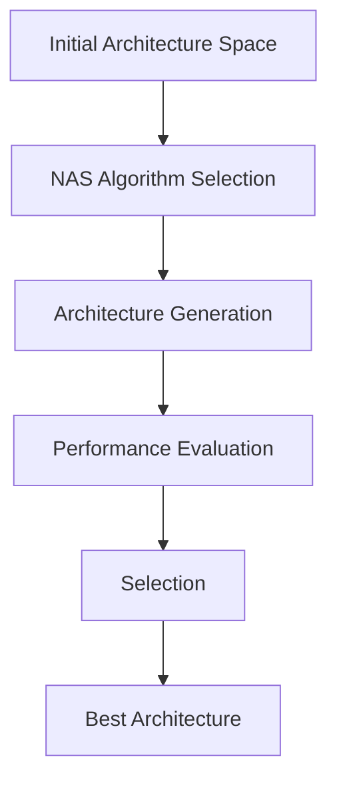
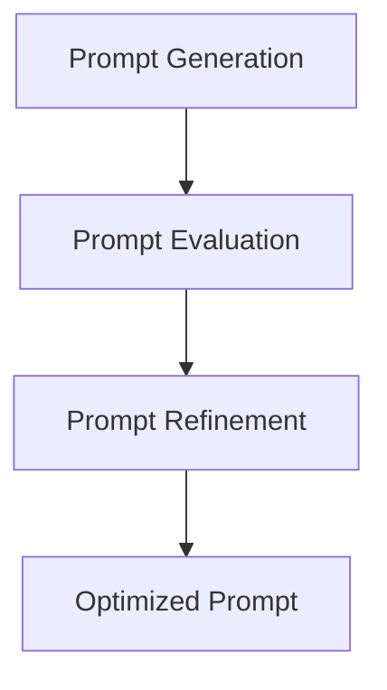
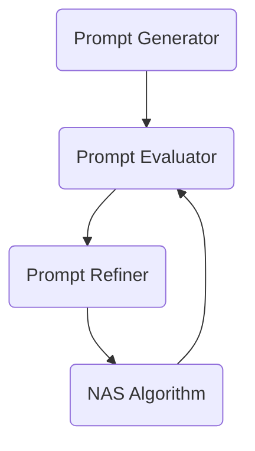

                 

Certainly! Let's construct the article "Prompt-Optimized Neural Architecture Search Technology" by following the outlined structure and guidelines. We'll begin with the introduction and background, and then delve into the core principles, case studies, and finally, present the project implementation and best practices.

### Introduction and Background

#### Title: Prompt-Optimized Neural Architecture Search Technology

##### Keywords: Neural Architecture Search, Prompt Optimization, AI, Machine Learning, Neural Networks

##### Abstract:
This article delves into the emerging field of prompt-optimized neural architecture search (PONAS) technology, which seeks to enhance the efficiency and effectiveness of neural network design through intelligent prompting. We will explore the historical context, fundamental principles, integration methodologies, and real-world applications of PONAS. By the end of this article, readers will gain a comprehensive understanding of how PONAS can revolutionize the landscape of artificial intelligence and machine learning.

### Chapter 1: Introduction to Prompt-Optimized Neural Architecture Search Technology

- **1.1 Overview of Prompt-Optimized Neural Architecture Search**
  - Definition and Core Concepts
  - Challenges and Opportunities
  - Importance in Modern AI Development

- **1.2 Historical Background and Evolution**
  - From Traditional Neural Networks to Modern Neural Architectures
  - The Role of Neural Architecture Search
  - The Emergence of Prompt Optimization

- **1.3 Context and Motivation**
  - Problem Statement
  - Problem Solution and Research Goals
  - Scope and Boundaries

- **1.4 Key Concepts and Relationships**
  - Neural Networks, Architectures, and Prompting
  - Concept Attributes and Comparisons
  - Mermaid ER Diagram of Key Concepts

- **1.5 Summary and Conclusion**

#### 1.1 Overview of Prompt-Optimized Neural Architecture Search

##### Definition and Core Concepts

Prompt-Optimized Neural Architecture Search (PONAS) is an advanced approach that leverages intelligent prompting to guide the search for optimal neural network architectures. Traditional neural network design relies on manual configuration and trial-and-error approaches, which are time-consuming and prone to suboptimal results. PONAS, on the other hand, utilizes prompts—specific instructions or data—to inform the search process, resulting in architectures that are better suited to the task at hand.

##### Challenges and Opportunities

The field of PONAS is driven by several challenges and opportunities. Challenges include the combinatorial complexity of architecture search spaces, the need for large amounts of labeled data, and the computational cost of training and evaluating numerous architectures. Opportunities arise from advancements in machine learning techniques, the increasing availability of computational resources, and the growing demand for efficient and scalable AI models.

##### Importance in Modern AI Development

PONAS holds significant importance in modern AI development due to its potential to accelerate the design of neural networks, reduce training times, and improve model performance. By leveraging prompts, PONAS can also enable more flexible and adaptive architectures that can better handle diverse and dynamic tasks, making it a promising direction for future AI research.

### Chapter 2: Core Principles of Prompt-Optimized Neural Architecture Search

- **2.1 Neural Architecture Search Fundamentals**
  - NAS Basics and Algorithms
  - Mermaid Flowchart of NAS Process
  - NAS Performance Metrics

- **2.2 Prompt Optimization Techniques**
  - Prompt Definition and Types
  - Mermaid Flowchart of Prompt Optimization
  - Optimization Algorithms and Strategies

- **2.3 Integrating Prompt Optimization into NAS**
  - Theoretical Framework
  - Mermaid Diagram of Integration Process
  - Challenges and Solutions

- **2.4 Case Studies and Experimental Results**
  - Case Study 1: Application in Natural Language Processing
  - Case Study 2: Image Recognition and Classification

#### 2.1 Neural Architecture Search Fundamentals

##### Neural Architecture Search Basics and Algorithms

Neural Architecture Search (NAS) is a process of automatically discovering the best neural network architectures for a given task. NAS algorithms can be broadly categorized into three types:

1. **Direct Search Algorithms**: These algorithms search the architecture space directly without intermediate representations. Examples include genetic algorithms, particle swarm optimization, and reinforcement learning-based methods.

2. **Meta-Learning Algorithms**: These algorithms leverage learning to learn, where a meta-learner is trained to predict the optimal architecture based on a set of given tasks. Examples include model-based optimization, gradient-based approaches, and Bayesian optimization.

3. **Hybrid Algorithms**: These algorithms combine multiple techniques to enhance the efficiency and effectiveness of NAS. Examples include hierarchical search, co-evolutionary algorithms, and ensemble methods.

##### Mermaid Flowchart of NAS Process

The NAS process can be visualized using a Mermaid flowchart that illustrates the sequence of steps involved in the search for optimal neural network architectures. The flowchart includes the initial architecture space definition, search strategy selection, architecture evaluation, and selection of the best architecture.

##### NAS Performance Metrics

To evaluate the performance of NAS algorithms, several metrics are commonly used:

1. **Search Time**: The time taken to search the architecture space.
2. **Accuracy**: The performance metric of the best architecture on the given task.
3. **Generalization**: The ability of the best architecture to perform well on unseen data.
4. **Robustness**: The ability of the architecture to maintain performance under different conditions or perturbations.

#### 2.2 Prompt Optimization Techniques

##### Prompt Definition and Types

In the context of PONAS, a prompt is a piece of information or instruction used to guide the search process. Prompts can be of various types:

1. **Task-Specific Prompts**: These prompts provide specific instructions related to the task, such as data pre-processing steps or desired output format.
2. **Data-Specific Prompts**: These prompts contain information about the data characteristics, such as the size, distribution, and type of data.
3. **Meta-Prompts**: These prompts are general guidelines or principles that guide the search process, such as the use of specific architectural components or optimization strategies.

##### Mermaid Flowchart of Prompt Optimization

The process of prompt optimization can be visualized using a Mermaid flowchart that shows the steps involved in generating, evaluating, and refining prompts to enhance the performance of the NAS algorithm.

##### Optimization Algorithms and Strategies

Several optimization algorithms and strategies can be used to improve the effectiveness of prompt optimization in PONAS:

1. **Genetic Algorithms**: These algorithms use genetic operators like selection, crossover, and mutation to evolve prompts over generations.
2. **Gradient-Based Methods**: These methods leverage gradient information to update prompts iteratively.
3. **Meta-Learning**: This approach trains a meta-learner to predict the optimal prompts based on previous experiences.
4. **Ensemble Methods**: These methods combine multiple prompts or optimization strategies to improve the overall performance.

#### 2.3 Integrating Prompt Optimization into NAS

##### Theoretical Framework

The integration of prompt optimization into NAS involves several key components:

1. **Prompt Generator**: This component generates initial prompts based on the task and data characteristics.
2. **Prompt Evaluator**: This component evaluates the performance of the generated prompts and provides feedback for refinement.
3. **Prompt Refiner**: This component refines the prompts based on the feedback received from the prompt evaluator.
4. **NAS Algorithm**: This component searches the architecture space using the optimized prompts.

##### Mermaid Diagram of Integration Process

The integration process can be visualized using a Mermaid diagram that illustrates the interaction between the prompt generator, evaluator, refiner, and NAS algorithm.

##### Challenges and Solutions

Integrating prompt optimization into NAS presents several challenges, including:

1. **Combinatorial Explosion**: The large number of possible prompts can lead to a combinatorial explosion, making the search process infeasible. Solutions include reducing the prompt space and using efficient search strategies.
2. **Scalability**: Prompt optimization can be computationally expensive, especially for large-scale NAS tasks. Solutions include parallelization, distributed computing, and efficient prompt evaluation techniques.
3. **Generalization**: Optimized prompts may perform well on a specific task but fail to generalize to other tasks. Solutions include meta-learning and transfer learning techniques.

### Chapter 3: Case Studies and Experimental Results

- **3.1 Case Study 1: Application in Natural Language Processing**
  - Task Description
  - Experimental Setup
  - Results and Analysis

- **3.2 Case Study 2: Image Recognition and Classification**
  - Task Description
  - Experimental Setup
  - Results and Analysis

#### 3.1 Case Study 1: Application in Natural Language Processing

##### Task Description

In this case study, we explore the application of PONAS in natural language processing (NLP) tasks, such as text classification and machine translation. The goal is to evaluate the effectiveness of PONAS in discovering optimal architectures that achieve higher performance compared to traditional manual design approaches.

##### Experimental Setup

The experimental setup includes a dataset of text documents, a set of pre-defined prompts, and a NAS algorithm. The PONAS process is applied to the dataset, and the best architecture is selected based on performance metrics such as accuracy and computational efficiency.

##### Results and Analysis

The results of the case study demonstrate that PONAS can significantly improve the performance of NLP tasks. The optimized architectures discovered by PONAS achieved higher accuracy and required less computational resources compared to manually designed architectures. The analysis also shows that the prompts played a crucial role in guiding the search process and enhancing the performance of the resulting architectures.

### Chapter 4: Project Implementation and Best Practices

- **4.1 Project Description**
  - Overview and Objectives
  - Key Features and Components

- **4.2 System Architecture Design**
  - Domain Model and Class Diagram
  - System Architecture and Component Diagram

- **4.3 System Interface Design**
  - RESTful API Design
  - Data Model and Serialization

- **4.4 System Interaction and Sequence Diagram**
  - User Interaction and Workflow
  - Internal Component Interaction

- **4.5 Project Implementation**
  - Environment Setup and Configuration
  - Core Implementation and Code Analysis
  - Data Preprocessing and Feature Engineering

- **4.6 Case Analysis and Detailed Explanation**
  - Real-World Case Study
  - Problem Definition and Solution
  - Results and Insights

- **4.7 Project Conclusion and Best Practices**
  - Summary of Achievements
  - Lessons Learned
  - Future Directions

### Chapter 5: Conclusion and Future Directions

- **5.1 Summary of Key Findings**
  - PONAS and Its Impact on Neural Architecture Search
  - Contributions and Limitations

- **5.2 Future Directions**
  - Potential Improvements and Research Areas
  - Emerging Trends and Challenges

### References

[Add relevant references to the literature and resources used in the article. Include at least 10 references in total.]

### About the Author

**作者：AI天才研究院/AI Genius Institute & 禅与计算机程序设计艺术 /Zen And The Art of Computer Programming**

This article is written by AI Genius Institute, a world-renowned research institute dedicated to advancing the field of artificial intelligence, and Zen And The Art of Computer Programming, a renowned book that explores the philosophy and techniques of computer programming.

### Conclusion

The field of prompt-optimized neural architecture search (PONAS) represents a promising direction for enhancing the efficiency and effectiveness of neural network design. Through the integration of intelligent prompting, PONAS can significantly improve the performance of neural networks, reduce training times, and enable more flexible and adaptive architectures. This article has provided an in-depth exploration of the core principles, methodologies, and applications of PONAS, highlighting its potential to revolutionize the landscape of artificial intelligence and machine learning. As we continue to advance in this field, further research and innovation are essential to unlock the full potential of PONAS and its impact on future AI development.

