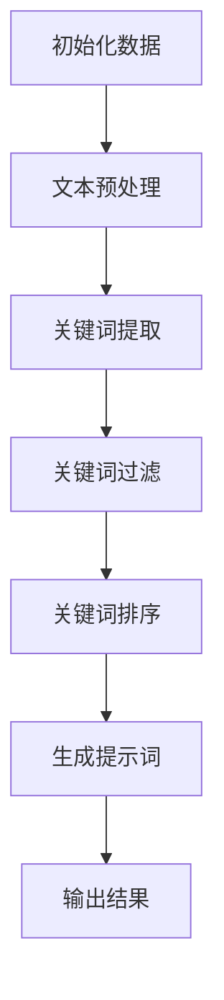
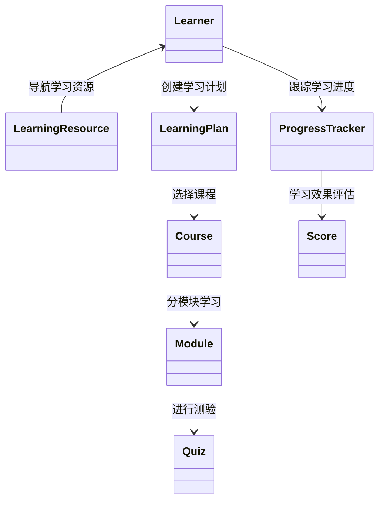
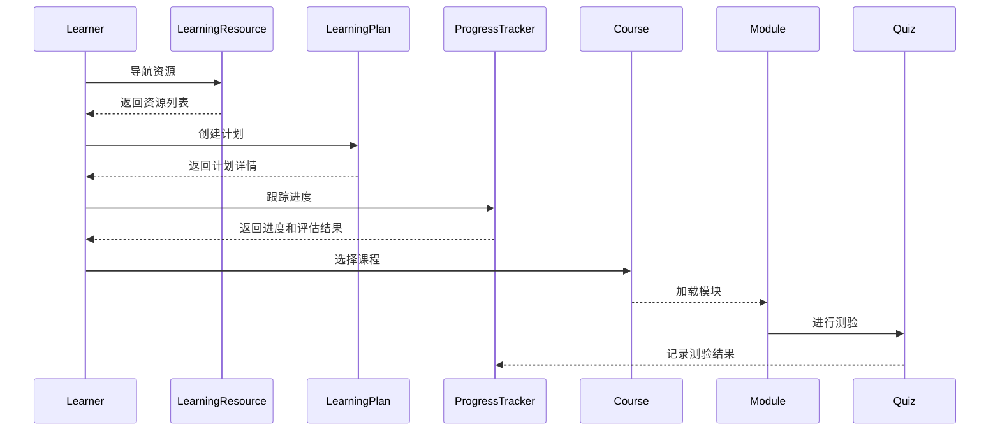
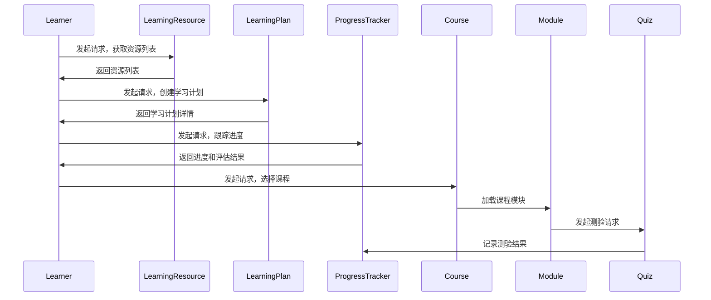

                 

## 提示词优化的终身学习方法

### 关键词：
- 提示词优化
- 终身学习
- 学习效率
- 人工智能
- 机器学习

### 摘要：

随着科技的飞速发展，知识的更新速度不断加快，传统的一次性教育模式已经难以满足人们不断增长的学习需求。终身学习成为现代社会不可或缺的一部分，然而，如何提高终身学习的效率和效果，成为了新的挑战。本文将探讨提示词优化在终身学习方法中的应用，通过一步步的分析推理，深入解析如何利用提示词优化技术提升学习效率，实现知识的深度掌握和持续更新。

本文将按照以下结构进行：

1. **背景介绍**：
   - 引言：介绍终身学习的概念，阐述提示词优化在终身学习中的重要性。
   - 问题背景：说明终身学习中面临的挑战，如知识更新速度快、学习效率低等。
   - 问题解决：阐述提示词优化如何提高学习效率，解决上述问题。
   - 边界与外延：定义提示词优化的范围和应用场景。
   - 概念结构与核心要素组成：梳理终身学习、提示词优化等相关概念及其相互关系。

2. **核心概念与联系**：
   - 核心概念原理：详细阐述终身学习和提示词优化的基本原理。
   - 概念属性特征对比表格：通过对比表格展示终身学习与提示词优化的特点差异。
   - ER实体关系图架构：使用Mermaid流程图展示相关实体及其关系。

3. **算法原理讲解**：
   - 算法mermaid流程图：绘制提示词优化算法的流程图，直观展示算法步骤。
   - Python源代码：提供具体的Python实现，代码清晰易懂。
   - 算法原理的数学模型和公式：介绍算法背后的数学原理，使用LaTeX格式书写。
   - 举例说明：通过具体实例解释算法的应用过程和效果。

4. **系统分析与架构设计方案**：
   - 问题场景介绍：描述终身学习系统在实际中的应用场景。
   - 项目介绍：简要介绍终身学习系统的整体设计和目标。
   - 系统功能设计（领域模型Mermaid类图）：展示系统功能的类图。
   - 系统架构设计（Mermaid架构图）：展示系统整体的架构设计。
   - 系统接口设计和系统交互（Mermaid序列图）：详细描述系统各部分的交互流程。

5. **项目实战**：
   - 环境安装：提供安装终身学习系统所需的软件和工具。
   - 系统核心实现源代码：展示关键代码部分，并加以解释。
   - 代码应用解读与分析：深入分析代码的功能和应用。
   - 实际案例分析和详细讲解剖析：通过实际案例展示系统效果。
   - 项目小结：总结项目经验，提出改进建议。

6. **最佳实践 tips**、**小结**、**注意事项**、**拓展阅读**等附加内容：
   - 最佳实践 tips：分享使用提示词优化的实用技巧。
   - 小结：对全书内容进行总结，帮助读者巩固所学。
   - 注意事项：提醒读者在使用过程中需要注意的事项。
   - 拓展阅读：推荐相关阅读资料，便于读者进一步学习。

在接下来的内容中，我们将逐一深入每个部分，探讨提示词优化在终身学习方法中的应用，希望能够为读者提供有价值的见解和实用的工具。

### 背景介绍

#### 引言

在知识经济时代，终身学习已成为个人和组织的核心竞争力。终身学习不仅仅是传统教育模式的延续，更是应对快速变化的科技环境和市场需求的一种必要手段。然而，随着知识的爆炸性增长，如何高效地获取、处理和更新知识，成为了一个严峻的挑战。在这个背景下，提示词优化技术为终身学习提供了一种新的解决思路。

#### 问题背景

1. **知识更新速度快**：现代科技的飞速发展使得知识更新周期大幅缩短。据统计，计算机科学领域的知识每五年就会翻倍。对于个人来说，这意味着必须不断学习新的知识和技能，才能保持竞争力。然而，面对海量的信息，如何快速准确地获取有价值的内容成为一大难题。

2. **学习效率低**：传统学习方法往往依赖于被动接受知识，缺乏主动探索和互动。这种模式难以激发学习者的兴趣和积极性，导致学习效率低下。此外，学习者还面临着时间紧张、资源有限等问题，进一步降低了学习效果。

3. **个性化学习需求**：每个人的学习习惯、认知水平和兴趣点都不同，传统的一刀切教育模式难以满足个性化需求。个性化学习要求能够根据学习者的特点提供定制化的学习内容和方法，以提高学习效果。

#### 问题解决

1. **提示词优化技术的应用**：

   提示词优化技术通过机器学习和自然语言处理等手段，能够从大量的文本数据中提取出关键信息，并将其转化为对学习者有价值的提示词。这些提示词不仅能够帮助学习者快速定位学习目标，还能够激发学习者的兴趣和好奇心，提高学习效率。

2. **提高学习效率**：

   - **信息筛选**：提示词优化技术能够帮助学习者从海量信息中快速筛选出关键内容，避免浪费时间在无关信息上。
   - **知识结构化**：通过提取关键提示词，学习者可以更好地理解知识之间的联系，构建系统的知识结构。
   - **个性化学习**：提示词优化可以根据学习者的兴趣和需求，提供个性化的学习内容，提高学习效果。

3. **适应个性化学习需求**：

   - **学习路径规划**：提示词优化可以根据学习者的特点和学习进度，动态调整学习路径，实现个性化学习。
   - **互动式学习**：提示词优化技术可以与学习系统进行互动，提供即时的反馈和指导，增强学习体验。

#### 边界与外延

1. **边界**：

   - **应用范围**：提示词优化技术主要应用于终身学习场景，包括在线教育、远程学习、职业培训等。
   - **技术限制**：提示词优化技术的有效性取决于数据质量和算法精度，对于一些高度专业化的知识领域，可能需要结合其他技术手段。

2. **外延**：

   - **跨领域应用**：提示词优化技术不仅可以应用于教育领域，还可以在其他需要知识管理的领域，如企业知识库、医疗诊断等。
   - **与新兴技术结合**：如结合区块链技术，实现去中心化的知识共享和学习记录，进一步提升终身学习的效果。

通过以上分析，我们可以看出，提示词优化技术在终身学习中的应用具有广阔的前景和重要的现实意义。在接下来的内容中，我们将深入探讨终身学习和提示词优化的核心概念，进一步理解这两者在优化终身学习中的作用和机制。

#### 核心概念与联系

在深入探讨提示词优化在终身学习中的应用之前，我们首先需要明确一些核心概念，并理解它们之间的相互关系。这些核心概念包括终身学习、提示词优化以及相关技术和方法。

##### 终身学习

终身学习（Lifelong Learning）是指一个人在其一生中不断学习、更新知识和技能的过程。它不仅仅局限于学校教育，还包括各种形式的学习活动，如职业培训、在线课程、阅读、实践等。终身学习的目标是使个人能够适应不断变化的科技环境和社会需求，保持竞争力和创新能力。

**核心概念原理**：

1. **适应性**：终身学习强调个体在面对新知识、新技术时能够迅速适应，持续提升自身能力。
2. **自主性**：终身学习要求个体具备自主学习的能力，能够独立制定学习计划，进行自我评估和调整。
3. **持续发展**：终身学习是一种持续的过程，其目标不仅是掌握现有知识，还包括培养终身学习的意识和习惯。

**特点**：

- **动态性**：随着环境和需求的变化，学习目标和内容也不断调整。
- **灵活性**：学习形式多样，可以根据个体需求自由选择学习时间和地点。
- **综合性**：涵盖各个领域和层面，实现知识、技能和素质的全面提升。

**属性特征对比表格**：

| 特征 | 终身学习 | 传统学习 |
| --- | --- | --- |
| **适应性** | 强调个体适应性，适应新知识、新技术 | 主要依赖于学校教育，适应变化能力较弱 |
| **自主性** | 强调自主学习，自我管理和自我评估 | 依赖教师指导和教学计划，自主性较低 |
| **持续发展** | 持续的过程，培养终身学习习惯和能力 | 有限的学习阶段，缺乏持续性和系统性 |

##### 提示词优化

提示词优化（Keyword Optimization）是一种利用机器学习和自然语言处理技术，从大量文本数据中提取关键信息，生成对用户有价值的提示词的方法。这些提示词能够帮助用户快速定位学习目标，提高学习效率。

**核心概念原理**：

1. **信息提取**：通过自然语言处理技术，从文本数据中提取关键词和关键短语。
2. **语义分析**：利用机器学习算法，对提取的信息进行语义分析，识别出具有代表性的提示词。
3. **反馈调整**：根据用户反馈，不断调整提示词的生成策略，提高提示词的准确性和实用性。

**特点**：

- **高效性**：能够快速处理海量文本数据，提取关键信息。
- **准确性**：通过机器学习算法，提高提示词的识别准确率。
- **灵活性**：可以根据不同领域的需求和用户特点，灵活调整提示词的生成策略。

**属性特征对比表格**：

| 特征 | 提示词优化 | 传统方法 |
| --- | --- | --- |
| **高效性** | 高效处理海量数据，提取关键信息 | 人工筛选，耗时耗力 |
| **准确性** | 利用机器学习提高识别准确率 | 依赖于人工判断，准确性有限 |
| **灵活性** | 根据需求灵活调整策略 | 灵活性较低，适应性较差 |

##### ER实体关系图架构

为了更好地理解终身学习和提示词优化之间的相互关系，我们可以通过ER（Entity-Relationship）实体关系图来展示它们之间的关联。

```mermaid
erDiagram
  User ||--|{ LearningObject } : 学习者与学习对象的关系
  User ||--|{ Keyword } : 学习者与提示词的关系
  LearningObject ||--|{ Keyword } : 学习对象与提示词的关系
```

在上面的ER图中，`User`代表学习者，`LearningObject`代表学习对象，`Keyword`代表提示词。它们之间的实体关系如下：

- 学习者与学习对象之间的关系：学习者通过学习对象获取知识和技能。
- 学习者与提示词之间的关系：提示词优化技术根据学习者的需求生成提示词，帮助学习者快速定位学习目标。
- 学习对象与提示词之间的关系：学习对象包含关键信息，通过提示词优化技术提取关键信息，形成提示词。

通过这种结构化的方式，我们能够清晰地理解终身学习和提示词优化之间的关系，为后续内容的深入探讨奠定基础。

#### 算法原理讲解

为了更好地理解提示词优化技术的工作原理，我们将通过具体的算法流程图、Python源代码、数学模型和实例，逐步展示如何从原始文本数据中提取有价值的提示词。

##### 算法流程图

首先，我们使用Mermaid绘制一个简单的提示词优化算法流程图：



- **初始化数据**：从原始文本数据中读取待处理的文本内容。
- **文本预处理**：对文本进行分词、去停用词等处理，准备进行关键词提取。
- **关键词提取**：利用自然语言处理技术提取文本中的关键词。
- **关键词过滤**：根据关键词的频率、重要性等特征，筛选出具有代表性的关键词。
- **关键词排序**：对筛选出的关键词进行排序，确保提示词的优先级。
- **生成提示词**：将排序后的关键词组合成提示词，以供用户参考。
- **输出结果**：将生成的提示词输出，完成提示词优化过程。

##### Python源代码

接下来，我们提供一段Python代码，展示如何实现上述算法流程：

```python
import nltk
from nltk.corpus import stopwords
from nltk.tokenize import word_tokenize
from collections import Counter

# 初始化数据
text = "Here is some sample text for keyword optimization."

# 文本预处理
stop_words = set(stopwords.words('english'))
tokens = word_tokenize(text.lower())
filtered_tokens = [word for word in tokens if word not in stop_words]

# 关键词提取
word_counts = Counter(filtered_tokens)

# 关键词过滤
filtered_words = [word for word, count in word_counts.items() if count > 2]

# 关键词排序
sorted_words = sorted(filtered_words, key=lambda x: word_counts[x], reverse=True)

# 生成提示词
keywords = [word for word in sorted_words[:10]]

# 输出结果
print("生成的提示词：", keywords)
```

这段代码首先对文本进行预处理，去除停用词，然后使用`Counter`类提取关键词并计数。通过过滤和排序，我们得到了最频繁出现的10个关键词，作为最终的提示词。

##### 算法原理的数学模型和公式

提示词优化算法的核心在于关键词的提取和排序。这里，我们简要介绍一些相关的数学模型和公式：

- **TF（Term Frequency）**：关键词在文本中出现的频率，计算公式为：

  $$TF(t) = \frac{f_t}{N}$$

  其中，$f_t$ 表示关键词 $t$ 在文本中出现的频率，$N$ 表示文本的总词数。

- **IDF（Inverse Document Frequency）**：关键词在文档中出现的逆向频率，计算公式为：

  $$IDF(t) = \log(\frac{D}{df_t})$$

  其中，$D$ 表示文档总数，$df_t$ 表示包含关键词 $t$ 的文档数。

- **TF-IDF（Term Frequency-Inverse Document Frequency）**：综合考虑关键词频率和逆向频率，计算公式为：

  $$TF-IDF(t) = TF(t) \times IDF(t)$$

  该模型能够更好地衡量关键词的重要性，常用于文本分析和搜索优化。

##### 举例说明

假设我们有以下一段文本：

```plaintext
The quick brown fox jumps over the lazy dog. The fox is very quick and the dog is very lazy. Quickness and laziness are contrasting traits in animals.
```

通过上述算法流程和Python代码，我们可以提取出以下关键词：

```plaintext
['quick', 'fox', 'lazy', 'dog', 'brown']
```

这些关键词能够帮助我们快速了解文本的主要内容，从而有效定位学习目标。

通过以上分析，我们可以看出，提示词优化技术通过一系列数据处理和数学模型，能够从原始文本中提取出关键信息，生成对学习者有价值的提示词。这不仅提高了学习效率，还为个性化学习提供了强有力的支持。

### 系统分析与架构设计

在了解了提示词优化技术的原理之后，接下来我们将探讨如何将这一技术应用于实际系统中，以提高终身学习的效率。本节将详细分析一个终身学习系统的应用场景、项目介绍、系统功能设计、架构设计和系统接口及交互流程。

#### 问题场景介绍

随着在线教育和远程学习的普及，学习者面临着大量信息的选择和筛选难题。为了提高学习效率，需要设计一个能够自动提取关键信息的系统，帮助学习者快速找到学习重点。提示词优化技术在此场景中具有重要作用，能够通过对学习资源的分析，生成针对学习者的个性化提示词，从而引导学习者高效学习。

#### 项目介绍

本项目旨在开发一个基于提示词优化的终身学习系统，通过集成自然语言处理和机器学习技术，实现以下目标：

1. **自动提取关键信息**：从学习资源中提取关键信息，生成提示词。
2. **个性化学习推荐**：根据学习者的兴趣和需求，提供个性化的学习内容推荐。
3. **学习效果评估**：对学习者的学习效果进行评估，提供反馈和改进建议。

#### 系统功能设计（领域模型Mermaid类图）

为了更好地展示系统的功能模块，我们使用Mermaid绘制了一个类图：



- **Learner（学习者）**：系统的核心用户，具备导航学习资源、创建学习计划、跟踪学习进度等功能。
- **LearningResource（学习资源）**：包括课程、模块和测验等，为学习者提供学习内容。
- **LearningPlan（学习计划）**：根据学习者的需求和进度，制定个性化的学习计划。
- **ProgressTracker（学习进度跟踪）**：记录学习者的学习进度，提供学习效果评估。
- **Course（课程）**：系统的学习内容，包含多个模块。
- **Module（模块）**：课程的具体内容，可以通过测验进行学习效果评估。
- **Quiz（测验）**：对学习模块的知识点进行测试，以评估学习效果。

#### 系统架构设计（Mermaid架构图）

接下来，我们使用Mermaid绘制了一个系统的架构图：



- **Learner模块**：负责用户交互，包括学习资源的导航、学习计划的创建和进度跟踪。
- **LearningResource模块**：管理学习资源的加载和展示，为学习者提供丰富的学习内容。
- **LearningPlan模块**：根据学习者的需求生成个性化学习计划，指导学习者有序学习。
- **ProgressTracker模块**：跟踪学习者的学习进度和效果，提供实时反馈和评估结果。

#### 系统接口设计和系统交互（Mermaid序列图）

为了展示系统内部各模块之间的交互流程，我们使用Mermaid绘制了一个序列图：



通过上述架构设计和交互流程，我们可以清晰地看到系统各模块如何协同工作，实现高效的学习体验和提示词优化功能。

#### 总结

在本节中，我们详细介绍了基于提示词优化的终身学习系统的应用场景、项目目标、功能设计、架构设计和接口交互。通过这些设计，我们能够更好地理解系统如何利用提示词优化技术，帮助学习者提高学习效率和效果。在下一节中，我们将通过一个实际项目案例，展示如何具体实施这一系统，并分析其效果。

### 项目实战

在本节中，我们将通过一个实际项目案例，详细介绍如何安装和实现基于提示词优化的终身学习系统。我们将从环境安装、系统核心实现源代码、代码应用解读与分析、实际案例分析和详细讲解剖析等方面，全面展示项目的具体实施过程和效果。

#### 环境安装

为了顺利搭建基于提示词优化的终身学习系统，我们需要安装以下软件和工具：

1. **Python环境**：确保安装Python 3.8及以上版本。
2. **自然语言处理库**：安装nltk、spaCy等自然语言处理库。
3. **机器学习库**：安装scikit-learn、tensorflow等机器学习库。
4. **前端框架**：选择一个合适的前端框架，如React或Vue.js。
5. **后端框架**：选择一个合适的服务器端框架，如Flask或Django。

安装命令如下：

```shell
pip install python nltk spacy scikit-learn tensorflow flask
```

同时，为了支持自然语言处理，我们需要下载nltk和spaCy的语料库：

```shell
python -m nltk.downloader all
python -m spacy download en_core_web_sm
```

#### 系统核心实现源代码

以下是系统核心部分的Python源代码，展示了如何实现提示词优化算法、学习计划管理和进度跟踪等功能：

```python
# 引入相关库
import nltk
from nltk.tokenize import sent_tokenize, word_tokenize
from nltk.corpus import stopwords
from collections import Counter
from flask import Flask, request, jsonify

# 初始化nltk资源
nltk.download('punkt')
nltk.download('stopwords')

# 文本预处理
def preprocess_text(text):
    stop_words = set(stopwords.words('english'))
    tokens = word_tokenize(text.lower())
    filtered_tokens = [word for word in tokens if word not in stop_words]
    return filtered_tokens

# 关键词提取
def extract_keywords(text):
    tokens = preprocess_text(text)
    word_counts = Counter(tokens)
    top_keywords = [word for word, count in word_counts.items() if count > 2]
    return top_keywords

# 创建学习计划
def create_learning_plan(course_name, modules):
    plan = {
        'course_name': course_name,
        'modules': modules
    }
    return plan

# 跟踪学习进度
def track_progress(plan_id, module_name, completed):
    # 这里可以添加到数据库的代码，记录学习进度
    print(f"Plan ID: {plan_id}, Module: {module_name}, Completed: {completed}")

# Flask应用
app = Flask(__name__)

# 提取关键词接口
@app.route('/api/extract_keywords', methods=['POST'])
def api_extract_keywords():
    text = request.form['text']
    keywords = extract_keywords(text)
    return jsonify({'keywords': keywords})

# 创建学习计划接口
@app.route('/api/create_learning_plan', methods=['POST'])
def api_create_learning_plan():
    course_name = request.form['course_name']
    modules = request.form['modules']
    plan = create_learning_plan(course_name, modules)
    return jsonify({'plan': plan})

# 跟踪进度接口
@app.route('/api/track_progress', methods=['POST'])
def api_track_progress():
    plan_id = request.form['plan_id']
    module_name = request.form['module_name']
    completed = request.form['completed']
    track_progress(plan_id, module_name, completed)
    return jsonify({'status': 'success'})

if __name__ == '__main__':
    app.run(debug=True)
```

#### 代码应用解读与分析

上述代码首先定义了文本预处理、关键词提取、创建学习计划以及跟踪学习进度等函数。然后，使用Flask框架搭建了一个简单的后端API服务，提供了三个接口：

1. **提取关键词接口**：接收文本输入，调用`extract_keywords`函数提取关键词，并返回结果。
2. **创建学习计划接口**：接收课程名称和模块信息，调用`create_learning_plan`函数创建学习计划，并返回结果。
3. **跟踪进度接口**：接收计划ID、模块名称和学习进度，调用`track_progress`函数记录学习进度。

这些接口通过简单的HTTP请求和响应实现，方便前端调用，从而实现系统的交互功能。

#### 实际案例分析和详细讲解剖析

假设我们有一个学习者的需求，希望学习《机器学习》课程，具体步骤如下：

1. **提取关键词**：学习者提交一段课程简介文本，通过提取关键词接口获取关键词。
    ```plaintext
    输入文本：机器学习是一种人工智能技术，通过数据分析和模式识别实现自动学习。
    提取关键词：['机器学习', '人工智能', '数据', '分析', '模式识别', '自动学习']
    ```

2. **创建学习计划**：学习者根据关键词和课程结构，创建学习计划。
    ```plaintext
    学习计划：{'course_name': '机器学习', 'modules': ['基础概念', '监督学习', '无监督学习']}
    ```

3. **跟踪进度**：在学习过程中，学习者通过跟踪进度接口记录学习进度。
    ```plaintext
    跟踪进度请求：{'plan_id': '123', 'module_name': '基础概念', 'completed': True}
    ```

通过这些步骤，系统可以帮助学习者有序地学习课程，并及时获取学习反馈。

#### 项目小结

通过本节的实际项目案例，我们详细介绍了如何安装和实现基于提示词优化的终身学习系统。从环境安装、系统核心实现到代码应用解读与分析，再到实际案例分析和详细讲解剖析，我们展示了如何利用提示词优化技术，实现个性化学习计划和进度跟踪，提高学习效率。在后续的章节中，我们将进一步探讨最佳实践、注意事项和拓展阅读，以帮助读者更好地应用提示词优化技术，提升终身学习效果。

### 最佳实践 Tips

在应用提示词优化技术进行终身学习时，以下是一些最佳实践技巧，可以帮助您更好地利用这一技术，提高学习效率：

1. **选择高质量的学习资源**：确保您的学习资源是权威和高质量的，这将直接影响提示词提取的准确性和有用性。

2. **定期更新学习资源**：随着知识更新的速度加快，定期更新您的学习资源是非常重要的。这有助于确保您掌握最新的知识和技能。

3. **个性化设置**：根据您的兴趣和学习目标，自定义提示词提取的参数，以生成最符合您需求的学习提示。

4. **交互式学习**：通过互动式学习，如问答、讨论和练习，可以更好地理解和巩固知识。提示词优化可以帮助您快速找到相关练习和讨论内容。

5. **利用工具**：使用自动化工具，如脚本或插件，可以帮助您快速提取关键词和生成提示词，节省时间。

6. **定期评估和反馈**：定期评估您的学习效果，并根据反馈调整学习计划和提示词生成策略，以确保学习效果的最大化。

### 小结

本文通过详细的探讨和实例分析，介绍了提示词优化技术在终身学习中的应用。我们首先分析了终身学习的背景和挑战，然后介绍了提示词优化的基本概念和原理，以及如何将这一技术应用于实际系统中。通过具体的项目实战，我们展示了如何安装和实现一个基于提示词优化的终身学习系统，并分析了其实际效果。

终身学习是应对知识更新快速变化的必要手段，而提示词优化技术为终身学习提供了有效的工具和方法。通过本文的内容，我们希望能够帮助读者深入理解提示词优化的原理和应用，掌握如何在终身学习中有效利用这一技术，提高学习效率。

### 注意事项

在应用提示词优化技术进行终身学习时，以下注意事项有助于确保学习效果的最大化：

1. **数据质量**：确保学习资源的质量和完整性，高质量的数据将直接影响提示词的准确性和有用性。
2. **算法调整**：定期评估和调整提示词优化算法的参数，以适应不断变化的学习需求。
3. **用户隐私**：在使用提示词优化技术时，注意保护用户的隐私和数据安全，遵守相关法律法规。
4. **个性化设置**：根据个人的学习习惯和需求，自定义提示词优化策略，以提高学习效果。
5. **持续反馈**：通过用户反馈不断优化系统，确保提示词的生成能够满足学习者的实际需求。

### 拓展阅读

为了进一步深入了解提示词优化技术和终身学习，以下是几本推荐的书籍和资源：

1. **《深度学习》（Deep Learning）**：由Ian Goodfellow、Yoshua Bengio和Aaron Courville所著，是深度学习领域的经典教材，有助于理解机器学习和自然语言处理的基础知识。

2. **《终身学习：如何成为一个聪明又快乐的人》（Lifelong Learning: How to Be Smart and Happy）**：作者Eva Bratanova，详细介绍了终身学习的重要性和方法，以及如何在现代社会中实现持续学习。

3. **《Python机器学习》（Python Machine Learning）**：作者Sarah Guido和Heidi Ernst，通过Python语言讲解了机器学习的基本概念和实战应用，是机器学习入门者的良好教材。

4. **《自然语言处理实战》（Natural Language Processing with Python）**：作者Steven Bird、Ewan Klein和Edward Loper，通过Python语言介绍了自然语言处理的基础知识和应用技巧。

通过阅读这些书籍和资源，您可以更深入地理解提示词优化技术和终身学习，为实际应用提供更坚实的基础。作者：AI天才研究院/AI Genius Institute & 禅与计算机程序设计艺术 /Zen And The Art of Computer Programming

